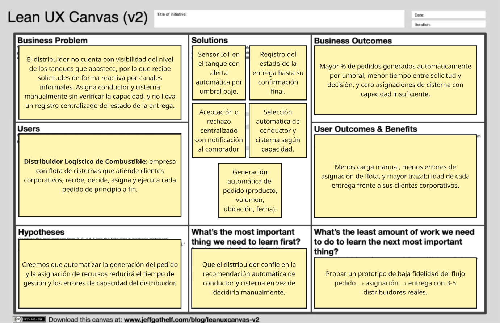
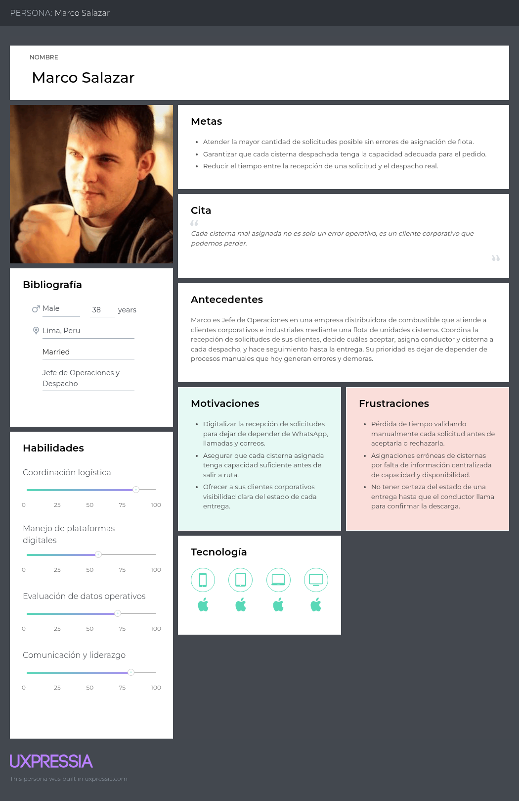
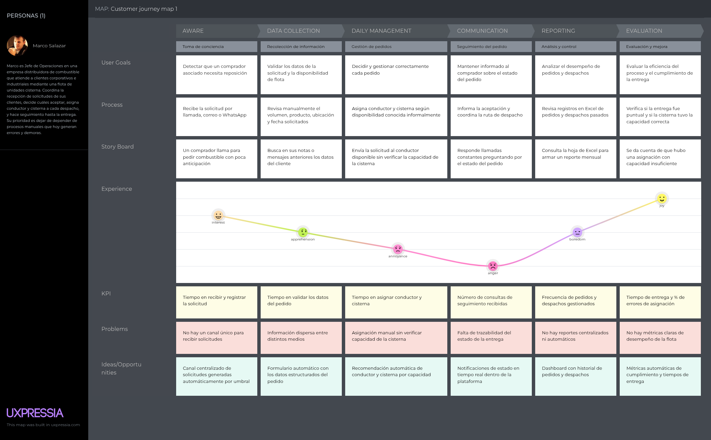
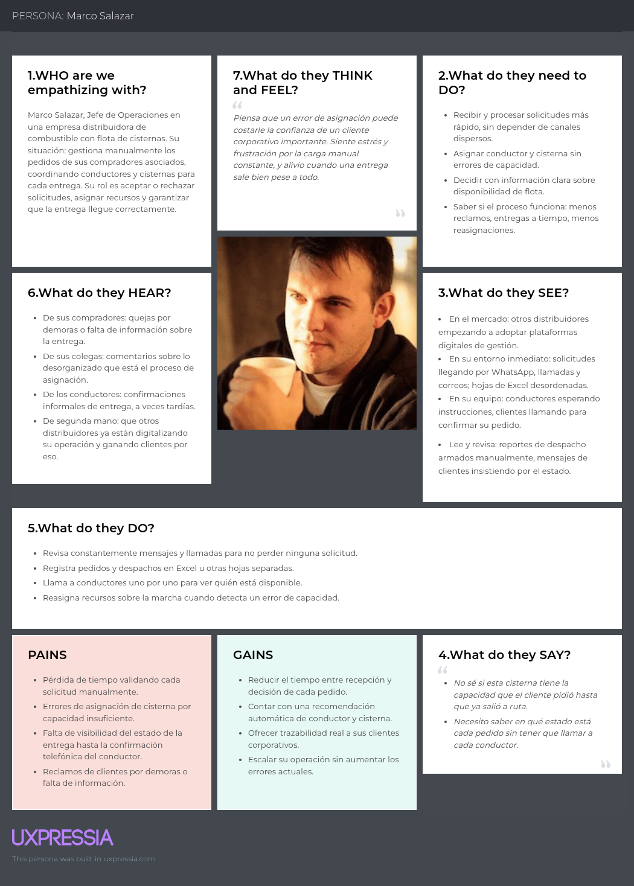
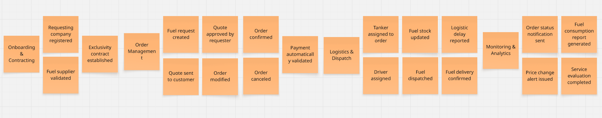
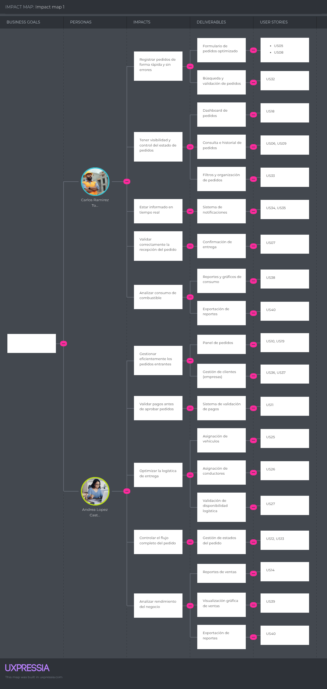
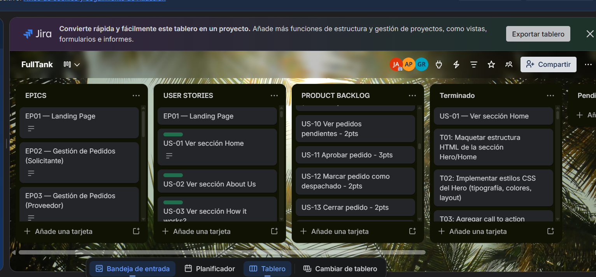

<div align="center">
  
  <p>Universidad Peruana de Ciencias Aplicadas</p>
  <p>Carrera de Ingeniería de Software</p>
  <p><strong>1ASI0572</strong></p>
  <p><strong>Desarrollo de Soluciones IOT</strong></p>
  <p>NRC</p>
  <p><strong>16518</strong></p>
  <h2>Informe de AV 1</h2>
  <p>Docente</p>
  <p><strong>Sanchez Portugal, Jimmy Enrique</strong></p>
  <p>Equipo</p>
  <p><strong>PrimeFuel</strong></p>
  <p>Proyecto</p>
  <p><strong>FullTank</strong></p>
</div>
<h2 align="center">Integrantes</h2>
<div align="center">
  <table>
    <tr>
      <th><strong>Código</strong></th>
      <th><strong>Apellidos y Nombres</strong></th>
    </tr>
    <tr>
      <td>u202317269</td>
      <td>Bonifacio Jaramillo Samuel Jesus</td>
    </tr>
    <tr>
      <td>u201822823</td>
      <td>Castro Pariona Jefferson Ernesto</td>
    </tr>
    <tr>
      <td>u20221a118</td>
      <td>Katherine Maryory Mejia Aliaga</td>
    </tr>
    <tr>
      <td>u202320684</td>
      <td>Ponce Perales Alberto Alejandro</td>
    </tr>
    <tr>
      <td>u202321843</td>
      <td>Delgado Carrasco Schneider Carlos Alberto</td>
    </tr>
    <tr>
      <td>u202312700</td>
      <td>Lopez Goitia Carlos Alberto</td>
    </tr>
    <tr>
      <td>u202223286</td>
      <td>Rodriguez Parco Joseph Pablo</td>
    </tr>
      <tr>
      <td>u202116246</td>
      <td>Guerrero Vasquez Jhon Danny</td>
    </tr>
  </table>
</div>
<div align="center">
  <p><strong>Período 202620</strong></p>
  <p><strong>Setiembre 2026</strong></p>
</div>

## Registro de Versiones del Informe

<table border>
  <thead>
    <tr>
      <th><b>Versión</b></th>
      <th><b>Fecha</b></th>
      <th><b>Autores</b></th>
      <th><b>Descripción de modificación</b></th>
    </tr>
  </thead>
  <tbody>
    <tr>
      <td>AV1</td>
      <td>14/09/26</td>
      <td>
        FullTank Team
      </td>
      <td>Creación y consolidación de los capítulos I, II, III y IV del informe, incluyendo la documentación de requisitos, diseño estratégico y diseño táctico de los bounded contexts.</td>
    </tr>
  </tbody>
  <tbody>
    <tr>
      <td>TB1</td>
      <td>9/10/26</td>
      <td>
        FullTank Team
      </td>
      <td>Creación y consolidación de los capítulos V y VI del informe, incluyendo el diseño UI/UX de landing, web y móvil, la evidencia de implementación, pruebas y despliegue del Sprint 1, y la actualización de los capítulos I y II</td>
    </tr>
  </tbody>
</table>

## Project Report Collaboration Insights

**Link del repositorio del informe:** [Report](https://github.com/16518-IoT-PrimeFuel/Report)

**Link del repositorio de la Landing Page:** [Landing Page](https://github.com/16518-IoT-PrimeFuel/landing-page)

**Link del repositorio del frontend:** [Frontend](https://github.com/16518-IoT-PrimeFuel/frontend)

**Link del repositorio del backend:** [Backend](https://github.com/16518-IoT-PrimeFuel/backend)

**Link de los repositorios de la organización:** [16518-IoT-PrimeFuel](https://github.com/16518-IoT-PrimeFuel)

**Link de Swagger desplegado con Render:** [BackendAPI-Swagger](https://fulltank-backend.onrender.com/swagger-ui/index.html)

**Link de frontend desplegado con Vercel:** [FullTank Frontend](https://primefuel-frontend-three.vercel.app/home)

## Contenido

- [Capítulo I: Introducción](docs/chapter1.md)
  - [1.1. Startup Profile](docs/chapter1.md#11-startup-profile)
    - [1.1.1. Descripción de la Startup](docs/chapter1.md#111-descripción-de-la-startup)
    - [1.1.2. Perfiles de integrantes del equipo](docs/chapter1.md#112-perfiles-de-integrantes-del-equipo)
  - [1.2. Solution Profile](docs/chapter1.md#12-solution-profile)
    - [1.2.1 Antecedentes y problemática](docs/chapter1.md#121-antecedentes-y-problemática)
    - [1.2.2 Lean UX Process](docs/chapter1.md#122-lean-ux-process)
      - [1.2.2.1. Lean UX Problem Statements](docs/chapter1.md#1221-lean-ux-problem-statements)
      - [1.2.2.2. Lean UX Assumptions](docs/chapter1.md#1222-lean-ux-assumptions)
      - [1.2.2.3. Lean UX Hypothesis Statements](docs/chapter1.md#1223-lean-ux-hypothesis-statements)
      - [1.2.2.4. Lean UX Canvas](docs/chapter1.md#1224-lean-ux-canvas)
  - [1.3. Segmentos objetivos](docs/chapter1.md#13-segmentos-objetivos)
- [Capítulo II: Requirements Elicitation & Analysis](docs/chapter2.md)
  - [2.1. Competidores](docs/chapter2.md#21-competidores)
    - [2.1.1. Análisis competitivo](docs/chapter2.md#211-análisis-competitivo)
    - [2.1.2. Estrategias y tácticas frente a competidores](docs/chapter2.md#212-estrategias-y-tácticas-frente-a-competidores)
  - [2.2. Entrevistas](docs/chapter2.md#22-entrevistas)
    - [2.2.1. Diseño de entrevistas](docs/chapter2.md#221-diseño-de-entrevistas)
    - [2.2.2. Registro de entrevistas](docs/chapter2.md#222-registro-de-entrevistas)
    - [2.2.3. Análisis de entrevistas](docs/chapter2.md#223-análisis-de-entrevistas)
  - [2.3. Needfinding](docs/chapter2.md#23-needfinding)
    - [2.3.1. User Personas](docs/chapter2.md#231-user-personas)
    - [2.3.2. User Task Matrix](docs/chapter2.md#232-user-task-matrix)
    - [2.3.3. User Journey Mapping](docs/chapter2.md#233-user-journey-mapping)
    - [2.3.4. Empathy Mapping](docs/chapter2.md#234-empathy-mapping)
  - [2.4. Big Picture EventStorming](docs/chapter2.md#24-big-picture-event-storming)
  - [2.5. Ubiquitous Language](docs/chapter2.md#25-ubiquitous-language)
- [Capítulo III: Requirements Specification](docs/chapter3.md)
  - [3.1. User Stories](docs/chapter3.md#31-user-stories)
  - [3.2. Impact Mapping](docs/chapter3.md#32-impact-mapping)
  - [3.3. Product Backlog](docs/chapter3.md#33-product-backlog)
- [Capítulo IV: Solution Software Design](docs/chapter4.md)
  - [4.1. Strategic-Level Domain-Driven Design](docs/chapter4.md#41-strategic-level-domain-driven-design)
    - [4.1.1. Design-Level EventStorming](docs/chapter4.md#411-design-level-eventstorming)
      - [4.1.1.1 Candidate Context Discovery](docs/chapter4.md#4111-candidate-context-discovery)
      - [4.1.1.2 Domain Message Flows Modeling](docs/chapter4.md#4112-domain-message-flows-modeling)
      - [4.1.1.3 Bounded Context Canvases](docs/chapter4.md#4113-bounded-context-canvases)
    - [4.1.2. Context Mapping](docs/chapter4.md#412-context-mapping)
    - [4.1.3. Software Architecture](docs/chapter4.md#413-software-architecture)
      - [4.1.3.1. Software Architecture System Landscape Diagram](docs/chapter4.md#4131-software-architecture-system-landscape-diagram)
      - [4.1.3.2. Software Architecture Context Level Diagrams](docs/chapter4.md#4132-software-architecture-context-level-diagrams)
      - [4.1.3.3. Software Architecture Container Level Diagrams](docs/chapter4.md#4133-software-architecture-container-level-diagrams)
      - [4.1.3.4. Software Architecture Deployment Diagrams](docs/chapter4.md#4134-software-architecture-deployment-diagrams)
  - [4.2. Tactical-Level Domain-Driven Design](docs/chapter4.md#42-tactical-level-domain-driven-design)
    - [4.2.1. Bounded Context: IAM](docs/chapter4.md#421-bounded-context-iam)
      - [4.2.1.1. Domain Layer](docs/chapter4.md#4211-domain-layer)
      - [4.2.1.2. Interface Layer](docs/chapter4.md#4212-interface-layer)
      - [4.2.1.3. Application Layer](docs/chapter4.md#4213-application-layer)
      - [4.2.1.4. Infrastructure Layer](docs/chapter4.md#4214-infrastructure-layer)
      - [4.2.1.5. Component Diagram](docs/chapter4.md#4215-bounded-context-software-architecture-component-level-diagram)
      - [4.2.1.6. Code Level Diagrams](docs/chapter4.md#4216-bounded-context-software-architecture-code-level-diagrams)
        - [4.2.1.6.1. Domain Layer Class Diagram](docs/chapter4.md#42161-bounded-context-domain-layer-class-diagram)
        - [4.2.1.6.2. Database Design Diagram](docs/chapter4.md#42162-bounded-context-database-design-diagram)
    - [4.2.2. Bounded Context: Notification](docs/chapter4.md#422-bounded-context-notification)
      - [Domain Layer](docs/chapter4.md#4221-domain-layer)
      - [Interface Layer](docs/chapter4.md#4222-interface-layer)
      - [Application Layer](docs/chapter4.md#4223-application-layer)
      - [Infrastructure Layer](docs/chapter4.md#4224-infrastructure-layer)
      - [Component Diagrams](docs/chapter4.md#4225-bounded-context-software-architecture-component-level-diagrams)
      - [Code Level Diagrams](docs/chapter4.md#4226-bounded-context-software-architecture-code-level-diagrams)
        - [Domain Layer Class Diagram](docs/chapter4.md#42261-bounded-context-domain-layer-class-diagram)
        - [Database Design Diagram](docs/chapter4.md#42262-bounded-context-database-design-diagram)
    - [4.2.3. Bounded Context: Inventory](docs/chapter4.md#423-bounded-context-inventory)
      - [Domain Layer](docs/chapter4.md#4231-domain-layer)
      - [Interface Layer](docs/chapter4.md#4232-interface-layer)
      - [Application Layer](docs/chapter4.md#4233-application-layer)
      - [Infrastructure Layer](docs/chapter4.md#4234-infrastructure-layer)
      - [Component Diagrams](docs/chapter4.md#4235-bounded-context-software-architecture-component-level-diagrams)
      - [Code Level Diagrams](docs/chapter4.md#4236-bounded-context-software-architecture-code-level-diagrams)
        - [Domain Layer Class Diagram](docs/chapter4.md#42361-bounded-context-domain-layer-class-diagram)
        - [Database Design Diagram](docs/chapter4.md#42362-bounded-context-database-design-diagram)
    - [4.2.4. Cross-Cutting Software Architecture Views](docs/chapter4.md#424-cross-cutting-software-architecture-views)
      - [Code Level Diagrams](docs/chapter4.md#4241-software-architecture-code-level-diagrams)
      - [Database Design Diagram](docs/chapter4.md#4242-software-architecture-database-design-diagram)
    - [4.2.5. Bounded Context: Equipment](docs/chapter4.md#425-bounded-context-equipment)
      - [Domain Layer](docs/chapter4.md#4251-domain-layer)
      - [Interface Layer](docs/chapter4.md#4252-interface-layer)
      - [Application Layer](docs/chapter4.md#4253-application-layer)
      - [Infrastructure Layer](docs/chapter4.md#4254-infrastructure-layer)
      - [Component Diagrams](docs/chapter4.md#4255-bounded-context-software-architecture-component-level-diagrams)
      - [Code Level Diagrams](docs/chapter4.md#4256-bounded-context-software-architecture-code-level-diagrams)
        - [Domain Layer Class Diagram](docs/chapter4.md#42561-bounded-context-domain-layer-class-diagram)
        - [Database Design Diagram](docs/chapter4.md#42562-bounded-context-database-design-diagram)
      - [Runtime Evidence](docs/chapter4.md#4257-runtime-evidence)
    - [4.2.6. Bounded Context: Fulfillment](docs/chapter4.md#426-bounded-context-fulfillment)
      - [Domain Layer](docs/chapter4.md#4261-domain-layer)
      - [Interface Layer](docs/chapter4.md#4262-interface-layer)
      - [Application Layer](docs/chapter4.md#4263-application-layer)
      - [Infrastructure Layer](docs/chapter4.md#4264-infrastructure-layer)
      - [Component Diagrams](docs/chapter4.md#4265-bounded-context-software-architecture-component-level-diagrams)
      - [Code Level Diagrams](docs/chapter4.md#4266-bounded-context-software-architecture-code-level-diagrams)
        - [Domain Layer Class Diagram](docs/chapter4.md#42661-bounded-context-domain-layer-class-diagram)
        - [Database Design Diagram](docs/chapter4.md#42662-bounded-context-database-design-diagram)
      - [Runtime Evidence](docs/chapter4.md#4267-runtime-evidence)
    - [4.2.7. Bounded Context: Ordering](docs/chapter4.md#427-bounded-context-ordering)
      - [Domain Layer](docs/chapter4.md#4271-domain-layer)
      - [Interface Layer](docs/chapter4.md#4272-interface-layer)
      - [Application Layer](docs/chapter4.md#4273-application-layer)
      - [Infrastructure Layer](docs/chapter4.md#4274-infrastructure-layer)
      - [Component Diagrams](docs/chapter4.md#4275-bounded-context-software-architecture-component-level-diagrams)
      - [Code Level Diagrams](docs/chapter4.md#4276-bounded-context-software-architecture-code-level-diagrams)
        - [Domain Layer Class Diagram](docs/chapter4.md#42761-bounded-context-domain-layer-class-diagram)
        - [Database Design Diagram](docs/chapter4.md#42762-bounded-context-database-design-diagram)
    - [4.2.8. Bounded Context: Payment](docs/chapter4.md#428-bounded-context-payment)
      - [Domain Layer](docs/chapter4.md#4281-domain-layer)
      - [Interface Layer](docs/chapter4.md#4282-interface-layer)
      - [Application Layer](docs/chapter4.md#4283-application-layer)
      - [Infrastructure Layer](docs/chapter4.md#4284-infrastructure-layer)
      - [Component Diagrams](docs/chapter4.md#4285-bounded-context-software-architecture-component-level-diagrams)
      - [Code Level Diagrams](docs/chapter4.md#4286-bounded-context-software-architecture-code-level-diagrams)
        - [Domain Layer Class Diagram](docs/chapter4.md#42861-bounded-context-domain-layer-class-diagrams)
        - [Database Design Diagram](docs/chapter4.md#42862-bounded-context-database-design-diagram)
    - [4.2.9. Bounded Context: Analytics](docs/chapter4.md#429-bounded-context-analytics)
      - [Domain Layer](docs/chapter4.md#4291-domain-layer)
      - [Interface Layer](docs/chapter4.md#4292-interface-layer)
      - [Application Layer](docs/chapter4.md#4293-application-layer)
      - [Infrastructure Layer](docs/chapter4.md#4294-infrastructure-layer)
      - [Component Diagrams](docs/chapter4.md#4295-bounded-context-software-architecture-component-level-diagrams)
      - [Code Level Diagrams](docs/chapter4.md#4296-bounded-context-software-architecture-code-level-diagrams)
        - [Domain Layer Class Diagram](docs/chapter4.md#42961-bounded-context-domain-layer-class-diagrams)
        - [Database Design Diagram](docs/chapter4.md#42962-bounded-context-database-design-diagram)
    - [4.2.10. Bounded Context: Telemetry](docs/chapter4.md#4210-bounded-context-telemetry)
      - [Domain Layer](docs/chapter4.md#42101-domain-layer)
      - [Interface Layer](docs/chapter4.md#42102-interface-layer)
      - [Application Layer](docs/chapter4.md#42103-application-layer)
      - [Infrastructure Layer](docs/chapter4.md#42104-infrastructure-layer)
      - [Component Diagrams](docs/chapter4.md#42105-bounded-context-software-architecture-component-level-diagrams)
      - [Code Level Diagrams](docs/chapter4.md#42106-bounded-context-software-architecture-code-level-diagrams)
        - [Domain Layer Class Diagram](docs/chapter4.md#421061-bounded-context-domain-layer-class-diagram)
        - [Database Design Diagram](docs/chapter4.md#421062-bounded-context-database-design-diagram)
      - [Runtime Evidence](docs/chapter4.md#42107-runtime-evidence)
    - [4.2.11. Bounded Context: Replenishment](docs/chapter4.md#4211-bounded-context-replenishment)
      - [Domain Layer](docs/chapter4.md#42111-domain-layer)
      - [Interface Layer](docs/chapter4.md#42112-interface-layer)
      - [Application Layer](docs/chapter4.md#42113-application-layer)
      - [Infrastructure Layer](docs/chapter4.md#42114-infrastructure-layer)
      - [Component Diagrams](docs/chapter4.md#42115-bounded-context-software-architecture-component-level-diagrams)
      - [Code Level Diagrams](docs/chapter4.md#42116-bounded-context-software-architecture-code-level-diagrams)
        - [Domain Layer Class Diagram](docs/chapter4.md#421161-bounded-context-domain-layer-class-diagram)
        - [Database Design Diagram](docs/chapter4.md#421162-bounded-context-database-design-diagram)
      - [Runtime Evidence](docs/chapter4.md#42117-runtime-evidence)
    - [4.2.12. Bounded Context: Fleet](docs/chapter4.md#4212-bounded-context-fleet)
      - [Domain Layer](docs/chapter4.md#42121-domain-layer)
      - [Interface Layer](docs/chapter4.md#42122-interface-layer)
      - [Application Layer](docs/chapter4.md#42123-application-layer)
      - [Infrastructure Layer](docs/chapter4.md#42124-infrastructure-layer)
      - [Component Diagrams](docs/chapter4.md#42125-bounded-context-software-architecture-component-level-diagrams)
      - [Code Level Diagrams](docs/chapter4.md#42126-bounded-context-software-architecture-code-level-diagrams)
        - [Domain Layer Class Diagram](docs/chapter4.md#421261-bounded-context-domain-layer-class-diagram)
        - [Database Design Diagram](docs/chapter4.md#421262-bounded-context-database-design-diagram)
      - [Runtime Evidence](docs/chapter4.md#42127-runtime-evidence)
    - [4.2.13. Bounded Context: Supply](docs/chapter4.md#4213-bounded-context-supply)
      - [Domain Layer](docs/chapter4.md#42131-domain-layer)
      - [Interface Layer](docs/chapter4.md#42132-interface-layer)
      - [Application Layer](docs/chapter4.md#42133-application-layer)
      - [Infrastructure Layer](docs/chapter4.md#42134-infrastructure-layer)
      - [Component Diagrams](docs/chapter4.md#42135-bounded-context-software-architecture-component-level-diagrams)
      - [Code Level Diagrams](docs/chapter4.md#42136-bounded-context-software-architecture-code-level-diagrams)
        - [Domain Layer Class Diagram](docs/chapter4.md#421361-bounded-context-domain-layer-class-diagram)
        - [Database Design Diagram](docs/chapter4.md#421362-bounded-context-database-design-diagram)
      - [Runtime Evidence](docs/chapter4.md#42137-runtime-evidence)
- [Capítulo V: Solution UI/UX Design](docs/chapter5.md)
  - [5.1. Style Guidelines](docs/chapter5.md#51-style-guidelines)
    - [5.1.1. General Style Guidelines](docs/chapter5.md#511-general-style-guidelines)
    - [5.1.2. Web, Mobile and IoT Style Guidelines](docs/chapter5.md#512-web-mobile-and-iot-style-guidelines)
  - [5.2. Information Architecture](docs/chapter5.md#52-information-architecture)
    - [5.2.1. Organization Systems](docs/chapter5.md#521-organization-systems)
    - [5.2.2. Labeling Systems](docs/chapter5.md#522-labeling-systems)
    - [5.2.3. SEO Tags and Meta Tags](docs/chapter5.md#523-seo-tags-and-meta-tags)
    - [5.2.4. Searching Systems](docs/chapter5.md#524-searching-systems)
    - [5.2.5. Navigation Systems](docs/chapter5.md#525-navigation-systems)
  - [5.3. Landing Page UI Design](docs/chapter5.md#53-landing-page-ui-design)
    - [5.3.1. Landing Page Wireframe](docs/chapter5.md#531-landing-page-wireframe)
    - [5.3.2. Landing Page Mock-up](docs/chapter5.md#532-landing-page-mock-up)
  - [5.4. Applications UX/UI Design](docs/chapter5.md#54-applications-uxui-design)
    - [5.4.1. Applications Wireframes](docs/chapter5.md#541-applications-wireframes)
    - [5.4.2. Applications Wireflow Diagrams](docs/chapter5.md#542-applications-wireflow-diagrams)
    - [5.4.3. Applications Mock-ups](docs/chapter5.md#543-applications-mock-ups)
    - [5.4.4. Applications User Flow Diagrams](docs/chapter5.md#544-applications-user-flow-diagrams)
  - [5.5. Applications Prototyping](docs/chapter5.md#55-applications-prototyping)
  - [5.6. IoT Device Design](docs/chapter5.md#56-iot-device-design)
- [Capítulo VI: Product Implementation, Validation & Deployment](docs/chapter6.md)
  - [6.1. Software Configuration Management](docs/chapter6.md#61-software-configuration-management)
    - [6.1.1. Software Development Environment Configuration](docs/chapter6.md#611-software-development-environment-configuration)
    - [6.1.2. Source Code Management](docs/chapter6.md#612-source-code-management)
    - [6.1.3. Source Code Style Guide & Conventions](docs/chapter6.md#613-source-code-style-guide-conventions)
    - [6.1.4. Software Deployment Configuration](docs/chapter6.md#614-software-deployment-configuration)
  - [6.2. Landing Page, Services & Applications Implementation](docs/chapter6.md#62-landing-page-services-applications-implementation)
    - [6.2.1. Sprint 1](docs/chapter6.md#621-sprint-1)
      - [6.2.1.1. Sprint Planning 1](docs/chapter6.md#6211-sprint-planning-1)
      - [6.2.1.2. Aspect Leaders and Collaborators](docs/chapter6.md#6212-aspect-leaders-and-collaborators)
      - [6.2.1.3. Sprint Backlog 1](docs/chapter6.md#6213-sprint-backlog-1)
      - [6.2.1.4. Development Evidence for Sprint Review](docs/chapter6.md#6214-development-evidence-for-sprint-review)
      - [6.2.1.5. Testing Suite Evidence for Sprint Review](docs/chapter6.md#6215-testing-suite-evidence-for-sprint-review)
      - [6.2.1.6. Execution Evidence for Sprint Review](docs/chapter6.md#6216-execution-evidence-for-sprint-review)
      - [6.2.1.7. Services Documentation Evidence for Sprint Review](docs/chapter6.md#6217-services-documentation-evidence-for-sprint-review)
      - [6.2.1.8. Software Deployment Evidence for Sprint Review](docs/chapter6.md#6218-software-deployment-evidence-for-sprint-review)
      - [6.2.1.9. Team Collaboration Insights during Sprint](docs/chapter6.md#6219-team-collaboration-insights-during-sprint)
  - 6.3. Validation Interviews.
    - 6.3.1. Diseño de Entrevistas.
    - 6.3.2. Registro de Entrevistas.
    - 6.3.3. Evaluaciones según heurísticas.  - [6.4. Video About-the-Product](docs/anexes.md#video-about-the-product)
- [Conclusiones](docs/anexes.md#conclusiones)
  - Conclusiones y recomendaciones.
  - [Video About-the-Team](docs/anexes.md#video-about-the-team)
- [Bibliografía](docs/anexes.md#bibliografía)
- [Anexos](docs/anexes.md#anexos)

## Student Outcome

<table border="1">
  <thead>
    <tr>
      <th width="25%"><b>Criterio Específico</b></th>
      <th><b>Acciones Realizadas</b></th>
      <th><b>Conclusiones</b></th>
    </tr>
  </thead>
  <tbody>
    <tr>
      <td width="25%"><b>Comunica oralmente con efectividad a rangos de audiencia</b></td>
      <td>
        <b>AV1</b><br>
        <b>Bonifacio Jaramillo Samuel Jesus</b><br>
        Participó en las reuniones de coordinación del equipo y comunicó propuestas para el avance del proyecto mediante nuestro canal de Discord.<br>
        <b>Castro Pariona Jefferson Ernesto</b><br>
        Participó en las entrevistas con los usuarios y en las reuniones de coordinación, comunicando hallazgos e ideas para los entregables del proyecto.<br>
        <b>Mejia Aliaga Katherine Maryory</b><br>
        Participó en las reuniones del equipo y comunicó propuestas para organizar el desarrollo de los entregables y mejorar la solución.<br>
        <b>Ponce Perales Alberto Alejandro</b><br>
        Participó en las sesiones de brainstorming y comunicó ideas para definir y mejorar las funcionalidades del proyecto.<br>
        <b>Delgado Carrasco Schneider Carlos Alberto</b><br>
        Participó en las reuniones de coordinación y comunicó aportes para el desarrollo de la solución y la organización del trabajo.<br>
        <b>Lopez Goitia Carlos Alberto</b><br>
        Participó en las reuniones de coordinación del equipo, exponiendo el estado de avance del informe y comunicando aportes para la organización de los entregables.<br>
        <b>Guerrero Vasquez Jhon Danny</b><br>
        Nuevo integrante que se incorporó al equipo.<br>
        <br>
        <b>TB1</b><br>
        <b>Bonifacio Jaramillo Samuel Jesus</b><br>
        Coordinó el avance del Sprint 1 en las reuniones y por Discord, y explicó al equipo las decisiones de backend, frontend y despliegue en Render, Aiven y Vercel.<br>
        <b>Castro Pariona Jefferson Ernesto</b><br>
        Participó en el Sprint Planning y comunicó los cambios de la landing page para el Distribuidor Logístico de Combustible.<br>
        <b>Mejia Aliaga Katherine Maryory</b><br>
        Participó en el Sprint Planning y en las reuniones de coordinación, aportando criterios para el diseño UI/UX y la coherencia del informe.<br>
        <b>Ponce Perales Alberto Alejandro</b><br>
        Preparó y expuso el Sprint Planning 1, y comunicó al equipo las decisiones de alcance, UI/UX y estructura de los capítulos V y VI.<br>
        <b>Delgado Carrasco Schneider Carlos Alberto</b><br>
        Participó en las reuniones de coordinación y presentó el avance de wireframes y mock-ups de landing, web y móvil.<br>
        <b>Lopez Goitia Carlos Alberto</b><br>
        Participó en las reuniones de coordinación, exponiendo el avance de wireflows, mock-ups y evidencias del capítulo VI.<br>
        <b>Rodriguez Parco Joseph Pablo</b><br>
        Participó en el Sprint Planning y coordinó con el equipo las decisiones de los web services (ingesta IoT, solicitudes y ciclo de entrega).<br>
        <b>Guerrero Vasquez Jhon Danny</b><br>
        Se incorporó al equipo durante este entregable y se alineó su participación en las reuniones de coordinación.<br>
      </td>
      <td>
        <b>AV1</b><br>
        La participación en reuniones, entrevistas y sesiones de brainstorming permitió al equipo fortalecer su capacidad para comunicar ideas, hallazgos y propuestas de manera clara, coordinar acuerdos y colaborar en la definición de la solución.<br>
        <b>TB1</b><br>
        El Sprint Planning y las reuniones de seguimiento sirvieron para acordar alcance, diseño e implementación, y dejar esas decisiones entendidas por todo el equipo.
      </td>
    </tr>
    <tr>
      <td width="25%"><b>Comunica por escrito con efectividad a diferentes rangos de audiencia</b></td>
      <td>
        <b>AV1</b><br>
        <b>Bonifacio Jaramillo Samuel Jesus</b><br>
        Redactó y revisó contenido técnico del informe, procurando que las ideas y propuestas del proyecto fueran claras para el lector.<br>
        <b>Castro Pariona Jefferson Ernesto</b><br>
        Apoyó en la redacción y documentación del proyecto, especialmente en la organización de entrevistas, análisis y entregables.<br>
        <b>Mejia Aliaga Katherine Maryory</b><br>
        Contribuyó en la redacción y revisión de los contenidos del informe para mantener claridad y coherencia entre sus secciones.<br>
        <b>Ponce Perales Alberto Alejandro</b><br>
        Contribuyó en la redacción y revisión de contenidos, aportando ideas para mejorar la explicación de la solución.<br>
        <b>Delgado Carrasco Schneider Carlos Alberto</b><br>
        Apoyó en la elaboración y revisión del informe, verificando que la información técnica y las propuestas estuvieran documentadas.<br>
        <b>Lopez Goitia Carlos Alberto</b><br>
        Redactó documentación técnica del proyecto, incluyendo la conversión del README a PDF y los scripts de video del entregable, procurando que la información fuera clara y comprensible para el lector.<br>
        <b>Guerrero Vasquez Jhon Danny</b><br>
        Nuevo integrante del equipo, colaborativo respecto a la documentación y también contribuyo al analisis del frontend.<br>
        <br>
        <b>TB1</b><br>
        <b>Bonifacio Jaramillo Samuel Jesus</b><br>
        Redactó y revisó contenido técnico del capítulo VI (configuración, implementación y evidencias de despliegue) y corrigió figuras del informe.<br>
        <b>Castro Pariona Jefferson Ernesto</b><br>
        Documentó el enfoque de la landing hacia el Distribuidor Logístico de Combustible y colaboró en la redacción del informe.<br>
        <b>Mejia Aliaga Katherine Maryory</b><br>
        Contribuyó en la revisión de los capítulos V y VI para mantener coherencia entre el diseño, el informe y el alcance del sprint.<br>
        <b>Ponce Perales Alberto Alejandro</b><br>
        Redactó los capítulos V y VI y actualizó los capítulos I y II: quitó telemática y control de válvulas, y simplificó el seguimiento de entregas.<br>
        <b>Delgado Carrasco Schneider Carlos Alberto</b><br>
        Documentó en el capítulo V los wireframes y mock-ups de landing, web y móvil, y agregó evidencias de pruebas, Swagger e insights de contribución.<br>
        <b>Lopez Goitia Carlos Alberto</b><br>
        Incorporó al capítulo V los wireflows y mock-ups, y al capítulo VI las capturas de pruebas y ejecución.<br>
        <b>Rodriguez Parco Joseph Pablo</b><br>
        Colaboró en la redacción del informe, documentando el trabajo de los web services del Sprint 1.<br>
        <b>Guerrero Vasquez Jhon Danny</b><br>
        Actualizó su perfil de integrante en el capítulo I, contribuyo con el frontend y la validación del landing para que todo funcione correctamente. Además que ayudo en la creación del canvas.<br>
      </td>
      <td>
        <b>AV1</b><br>
        La elaboración y revisión colaborativa del informe permitió al equipo fortalecer su capacidad para prevenir, estructurar, redactar y presentar información técnica de forma clara, ordenada, coherente y comprensible para diferentes rangos de audiencia.<br>
        <b>TB1</b><br>
        Los capítulos V y VI, con los ajustes de I y II, dejaron por escrito el diseño, las pruebas y el despliegue para un lector que no vio el código.
      </td>
    </tr>
  </tbody>
</table>

---

# Capítulo I: Introducción

## 1.1 Startup Profile

### 1.1.1 Descripción de la Startup

**Prime Fuel**: Startup dedicada a digitalizar la operación logística de los distribuidores de combustible que atienden a clientes corporativos e industriales mediante flotas de unidades cisterna. La plataforma es contratada por el distribuidor y le permite instalar un dispositivo IoT en el tanque de cada comprador asociado, generar automáticamente el pedido cuando el nivel alcanza un umbral crítico, aceptar o rechazar cada solicitud, asignar un conductor habilitado y una cisterna con capacidad suficiente, y mantener actualizado el estado de la entrega hasta su confirmación final. Fue fundada por estudiantes de la Universidad Peruana de Ciencias Aplicadas.

**Misión**: Nuestra misión es digitalizar la operación de distribución de combustible de las empresas transportistas, mediante una plataforma que conecte el monitoreo IoT del nivel de tanque de sus compradores con la generación automática de pedidos, la asignación de conductor y cisterna, y el seguimiento del estado de cada entrega, reduciendo la dependencia de procesos manuales y mejorando la trazabilidad de toda la operación.

**Visión**: Nuestra visión es consolidarnos como la plataforma de referencia para distribuidores logísticos de combustible, ayudándolos a operar su flota de forma más eficiente, anticipando la demanda de sus compradores mediante datos de nivel de tanque en tiempo real y automatizando cada etapa del ciclo de pedido, asignación y entrega.

---

### 1.1.2 Perfiles de integrantes del equipo

<table border>
  <thead>
    <tr>
      <th>Foto</th>
      <th>Nombre completo</th>
      <th>Código</th>
      <th>Carrera</th>
      <th>Habilidades técnicas</th>
    </tr>
  </thead>
  <tbody>
    <tr>
      <td></td>
      <td>Bonifacio Jaramillo Samuel Jesus</td>
      <td>u202317269</td>
      <td>Ingeniería de Software</td>
      <td>Soy Desarrollador FullStack orientado a soluciones AI. Amplia experiencia en pipelines automatizados y experimentos con LLMs. Actualmente desarrollando workflows inteligentes.</td>
    </tr>
    <tr>
      <td></td>
      <td>Castro Pariona Jefferson Ernesto</td>
      <td>u201822823</td>
      <td>Ingeniería de Software</td>
      <td>Estudiante de la carrera de Ingenieria de Software en 7mo ciclo. He ido descubriendo a lo largo de mi carrera, nuevas tecnologias y forjando mis conocimientos en el rubro. Tengo conocimientos solidos en programacion en Javascript y C#.</td>
    </tr>
    <tr>
      <td></td>
      <td>Alberto Alejandro Ponce Perales</td>
      <td>u202320684</td>
      <td>Ingeniería de Software</td>
      <td>Estudiante de la carrera de Ingeniería de Software en la UPC. Actualmente cuento con conocimientos en lenguajes de programación como C + + y manejo de Java. Considero que mis mayores virtudes son: la responsabilidad, capacidad de adaptarme, trabajar en equipo y la resiliencia.</td>
    </tr>
    <tr>
      <td></td>
      <td>Schneider Carlos Alberto Delgado Carrasco</td>
      <td>u202321843</td>
      <td>Ingeniería de Software</td>
      <td>Soy estudiante de Ingeniería de Software en la UPC, con conocimientos en programación y bases de datos. Me interesa la tecnología, la innovación y el desarrollo de soluciones digitales que mejoren la vida de las personas. Estoy comprometido con mi formación y busco nuevos retos que me permitan crecer a nivel académico y personal.</td>
    </tr>
    <tr>
      <td>
      </td>
      <td>Carlos Alberto Lopez Goitia</td>
      <td>u202312700</td>
      <td>Ingeniería de Software</td>
      <td>Estudiante de Ingeniería de Software en la UPC. Cuento con experiencia en desarrollo full-stack: frontend móvil con Flutter y Kotlin/Jetpack Compose, backend con .NET 8 y MySQL, y desarrollo de aplicaciones web con Angular, Node.js/Express y MongoDB. He trabajado en proyectos desplegados en la nube (Azure) usando Docker para la orquestación de servicios, además de diseño de APIs REST y modelado de bases de datos NoSQL.</td>
    </tr>
    <tr>
      <td></td>
      <td>Joseph Pablo Rodriguez Parco</td>
      <td>u202223286</td>
      <td>Ingeniería de Software</td>
      <td>Ingeniero de software creando soluciones basadas en la nube, AWS Certified. Estudiante de Ingeniería de Software en la UPC, actualmente en octavo ciclo.</td>
    </tr>
    <tr>
      <td>
      </td>
      <td>Katherine Maryory Mejia Aliaga</td>
      <td>u20221a118</td>
      <td>Ingeniería de Software</td>
      <td>Soy studiante de 7mo ciclo de Ingeniería de Software (21 años), apasionada por el desarrollo de proyectos de Internet de las Cosas (IoT) y con un fuerte interés en
        aprender a guiar y liderar iniciativas tecnológicas.
      </td>
    </tr>
    <tr>
      <td></td>
      <td>Jhon D. Guerrero Vasquez</td>
      <td>u202116246</td>
      <td>Ingeniería de Software</td>
      <td>Soy estudiante de Ingeniería de Software, apasionado por la arquitectura de software y el desarrollo de aplicaciones web y mi fuerte interes en este proyecto consiste en validadr los bounded context en la programación haciendo uso de las tecnologias. También me apasiona el trabajo colaborativo y el debate para encontrar soluciones creativas frente a las necesidades.</td>
    </tr>
  </tbody>
</table>

---

## 1.2 Solution Profile

### 1.2.1 Antecedentes y problemática

- **What (¿Qué?)**
  En este documento, un pedido de combustible es la solicitud que un comprador asociado genera automáticamente cuando el nivel de su tanque de almacenamiento alcanza un umbral crítico, y que el distribuidor logístico debe aceptar o rechazar, asignar a un conductor y una cisterna, y hacer seguimiento hasta su confirmación final de entrega. No se trata de la alerta del tanque de un vehículo particular, sino de la operación de abastecimiento que un distribuidor con flota de cisternas ejecuta para sus clientes corporativos o industriales.

  La problemática tiene tres partes relacionadas. Primero, el distribuidor no cuenta con visibilidad en tiempo real del nivel de los tanques de sus compradores, por lo que las solicitudes de abastecimiento le llegan de forma reactiva, mediante llamadas, correos o mensajería, en lugar de generarse automáticamente al cruzar un umbral. Segundo, una vez recibida la solicitud, el distribuidor asigna manualmente un conductor y una cisterna disponible, sin verificar de forma sistemática que la capacidad de la cisterna sea suficiente para el volumen solicitado. Tercero, una vez que la cisterna sale a ruta, el distribuidor no cuenta con un registro centralizado del estado de la entrega hasta que el conductor confirma manualmente la descarga, lo que dificulta la trazabilidad completa del pedido dentro de la plataforma.

- **When (¿Cuándo?)**
  El problema se presenta en toda la cadena de abastecimiento gestionada por el distribuidor: cuando el tanque de un comprador se acerca a su nivel crítico y la alerta no llega a tiempo, cuando el distribuidor debe asignar conductor y cisterna entre varias solicitudes simultáneas, y cuando la cisterna ya está en ruta, momento en el que el estado de la entrega no se actualiza en la plataforma hasta la confirmación final del conductor.

- **Where (¿Dónde?)**
  El problema se ubica en dos puntos principales: en las instalaciones del comprador, donde está el tanque cuyo nivel determina si se genera o no un pedido; y en las operaciones internas del distribuidor, donde se decide qué conductor y qué cisterna atienden cada solicitud, y donde se espera la confirmación de entrega, que hoy se comunica por canales externos a la plataforma.

- **Who (¿Quién?)**
  El principal afectado es el distribuidor logístico de combustible, que opera una flota de unidades cisterna y atiende a clientes corporativos o industriales. Dentro del distribuidor, los responsables de operaciones y despacho enfrentan la dificultad de asignar conductores y cisternas sin datos centralizados de disponibilidad y capacidad, y de confirmar la entrega sin depender de comunicación manual con el conductor. Los compradores asociados participan como usuarios secundarios: su rol se limita a que el nivel de su tanque, medido por el sensor IoT, sea la señal que activa el flujo de abastecimiento del distribuidor.

- **Why (¿Por qué?)**
  La causa principal es la falta de integración entre el nivel físico del tanque del comprador, la operación logística del distribuidor y el estado del pedido durante la entrega. Sin datos continuos del nivel del tanque, el distribuidor no puede anticipar la demanda ni generar el pedido automáticamente. Sin un registro centralizado de conductores habilitados y capacidad de cisternas, la asignación depende del criterio manual de un operador. Y sin un registro centralizado del estado de la entrega, la confirmación final depende de la comunicación manual entre el conductor y el distribuidor, en lugar de quedar registrada en la plataforma.

- **How (¿Cómo?)**
  En el proceso actual, el comprador revisa visualmente su tanque o utiliza un método manual y contacta al distribuidor por correo, llamada o mensajería. El distribuidor recibe la solicitud, la registra manualmente y asigna un conductor y una cisterna según disponibilidad, sin verificación automática de que la capacidad de la cisterna cubra el volumen solicitado. Una vez que la cisterna sale a ruta, la confirmación de la entrega se comunica de forma manual, por lo que la plataforma no refleja el estado real del pedido hasta que el conductor informa la descarga.

- **How Much (¿Cuánto?)**
  La gestión manual de la asignación de conductor y cisterna puede producir errores de capacidad, retrasos en el despacho o uso ineficiente de la flota. La falta de un registro centralizado del estado de la entrega limita la trazabilidad que el distribuidor puede ofrecer a sus clientes corporativos, y dificulta identificar en qué etapa se encuentra cada pedido sin contactar directamente al conductor. El impacto económico exacto deberá medirse durante la validación con distribuidores.

### 1.2.2 Lean UX Process

Para el desarrollo de la startup utilizamos el enfoque Lean UX. Este enfoque permite convertir la problemática general en necesidades concretas del distribuidor logístico de combustible, nuestro segmento objetivo principal, validar hipótesis y ajustar la solución desde las primeras etapas. En nuestro caso, la plataforma debe resolver el monitoreo del nivel de los tanques de los compradores asociados, la generación automática de pedidos, la aceptación o rechazo de solicitudes, la asignación de conductor y cisterna según capacidad, y el seguimiento del estado de la entrega hasta su confirmación final.

En la sección 1.2.1 se describe el problema del proceso completo de abastecimiento desde la perspectiva del distribuidor. En la sección 1.2.2.1 este problema se analiza en un único Problem Statement centrado en el distribuidor logístico de combustible, ya que es el segmento comercial principal y el cliente que contrata la solución; los compradores asociados intervienen como usuarios secundarios cuyo nivel de tanque activa el flujo, pero no constituyen un segmento objetivo independiente.

#### 1.2.2.1 Lean UX Problem Statements

**Distribuidores Logísticos de Combustible**
- **Problema:** Los distribuidores que atienden a clientes corporativos o industriales mediante flotas de cisternas no cuentan con visibilidad en tiempo real del nivel de los tanques de sus compradores asociados, por lo que reciben solicitudes de forma reactiva y las gestionan manualmente. Además, la asignación de conductor y cisterna no verifica de forma sistemática la capacidad requerida, y no existe un registro centralizado del estado de la entrega hasta su confirmación final.
- **Impacto:** Aumenta el riesgo de errores de capacidad en la asignación de cisternas, retrasa la atención de solicitudes y reduce la trazabilidad de la entrega frente a los clientes corporativos.
- **Riesgo:** La adopción puede verse afectada si la plataforma no se integra con la operación real de despacho del distribuidor, o si el conductor no confirma oportunamente el estado de la entrega dentro de la plataforma.
- **How Might We...? (¿Cómo podríamos...?):** ¿Cómo podríamos permitir que un distribuidor reciba automáticamente el pedido cuando el tanque de un comprador asociado alcanza su umbral crítico, acepte o rechace la solicitud, asigne un conductor habilitado y una cisterna con capacidad suficiente, y mantenga actualizado el estado de la entrega hasta su confirmación final, reduciendo el tiempo de asignación en un 40 % y los pedidos sin estado de entrega registrado a cero durante los primeros tres meses?

#### 1.2.2.2 Lean UX Assumptions

**Business Assumptions (Suposiciones de Negocio)**
* Los distribuidores logísticos de combustible buscan reducir errores de asignación y mejorar la confiabilidad de sus entregas para proteger su relación con clientes corporativos.
* Los distribuidores están dispuestos a instalar un dispositivo IoT en los tanques de sus compradores asociados como parte de su servicio integral.
* Los distribuidores valorarán contar con un único lugar desde donde aceptar o rechazar solicitudes generadas automáticamente por el nivel de tanque de sus compradores.
* La falta de visibilidad sobre el nivel de los tanques y la asignación manual de flota justifican reemplazar progresivamente el proceso actual por un flujo centralizado y automatizado.
* Los distribuidores valorarán contar con trazabilidad del estado de la entrega como un diferenciador frente a otros proveedores de combustible.

**User Assumptions (Suposiciones de Usuario)**
* *¿Quién es el usuario?* El usuario principal es el distribuidor logístico de combustible: sus responsables de operaciones y despacho, que gestionan solicitudes, conductores y cisternas. Los compradores asociados son usuarios secundarios, cuyo tanque activa el flujo de abastecimiento.
* *¿Dónde encaja nuestro producto en su trabajo?* FullTank se utilizará como la plataforma central del distribuidor para monitorear los tanques de sus compradores, recibir y decidir solicitudes, asignar conductor y cisterna, y hacer seguimiento del estado de cada entrega.
* *¿Qué problemas debe resolver nuestro producto?* FullTank debe eliminar la dependencia de canales informales para recibir solicitudes, automatizar la verificación de capacidad al asignar una cisterna, y ofrecer trazabilidad del estado de la entrega hasta su confirmación final.
* *¿Cuándo y cómo es nuestro producto usado?* El distribuidor lo usará para recibir solicitudes generadas automáticamente por el nivel del tanque del comprador, aceptarlas o rechazarlas, asignar conductor y cisterna, y hacer seguimiento del estado de la entrega. El comprador solo interactúa de forma secundaria, principalmente para consultar el estado de su pedido.
* *¿Qué características son importantes?* Son importantes la asociación de tanques de compradores con detección automática de umbral bajo, la generación de pedidos sin transcripción manual, la aceptación o rechazo centralizado de solicitudes con notificación al comprador, la selección automática de conductor y cisterna por capacidad, y el seguimiento del estado de la entrega hasta su confirmación final.
* *¿Cómo debe verse nuestro producto y cómo debe comportarse?* El producto debe presentar una interfaz operativa y clara, orientada al flujo de trabajo diario de un distribuidor: solicitudes entrantes, estado de la flota disponible y seguimiento de entregas en curso, con alertas visibles ante solicitudes pendientes o entregas sin confirmar.

**Feature Assumptions**
* Creemos que al asociar los tanques de los compradores a la plataforma y detectar automáticamente el umbral de bajo nivel, el distribuidor podrá anticipar la demanda sin depender de que el comprador lo contacte.
* Creemos que al generar el pedido automáticamente con el producto, volumen, ubicación y fecha requeridos, eliminaremos la transcripción manual de solicitudes.
* Creemos que al centralizar la aceptación o rechazo de solicitudes y notificar su estado al comprador, reduciremos el tiempo de respuesta del distribuidor.
* Creemos que al seleccionar automáticamente un conductor habilitado y una cisterna con capacidad igual o superior al volumen solicitado, reduciremos los errores de asignación de flota.
* Creemos que al mantener actualizado el estado de la entrega hasta su confirmación final, aumentaremos la trazabilidad que el distribuidor puede ofrecer a sus clientes.
* Creemos que al ofrecer una interfaz clara y centrada en la operación diaria de despacho, aumentaremos la adopción entre distribuidores.

#### 1.2.2.3 Lean UX Hypothesis Statements

**Hypothesis Statement 01:**
* *Creemos* que asociar los tanques de los compradores a la plataforma y detectar automáticamente el umbral de bajo nivel reducirá el tiempo entre la necesidad real de reposición y la generación del pedido.
* *Sabremos* que hemos tenido éxito
* *Cuando* durante el primer trimestre de uso, más del 80 % de los pedidos se generen automáticamente por umbral de tanque, sin que el comprador tenga que iniciar el contacto manualmente.

**Hypothesis Statement 02:**
* *Creemos* que generar el pedido automáticamente con el producto, volumen, ubicación y fecha requeridos reducirá los errores de transcripción en la solicitud.
* *Sabremos* que hemos tenido éxito
* *Cuando* más del 70 % de los pedidos generados no requieran corrección posterior de sus datos.

**Hypothesis Statement 03:**
* *Creemos* que centralizar la aceptación o rechazo de solicitudes y notificar su estado al comprador reducirá el tiempo de respuesta del distribuidor ante cada pedido.
* *Sabremos* que hemos tenido éxito
* *Cuando* el tiempo promedio entre la recepción de la solicitud y la decisión del distribuidor se reduzca en un 40 % respecto al proceso manual actual.

**Hypothesis Statement 04:**
* *Creemos* que seleccionar automáticamente un conductor habilitado y una cisterna con capacidad igual o superior al volumen solicitado reducirá los errores de asignación de flota.
* *Sabremos* que hemos tenido éxito
* *Cuando* se elimine la asignación de cisternas con capacidad insuficiente durante los primeros tres meses de uso.

**Hypothesis Statement 05:**
* *Creemos* que mantener actualizado el estado de la entrega dentro de la plataforma, desde el despacho hasta la confirmación final, aumentará la trazabilidad percibida por el distribuidor y sus clientes corporativos.
* *Sabremos* que hemos tenido éxito
* *Cuando* más del 90 % de los pedidos entregados queden registrados con su estado actualizado en la plataforma, sin depender de una llamada de confirmación manual.

**Hypothesis Statement 06:**
* *Creemos* que automatizar todo el flujo desde la detección del nivel bajo del tanque hasta la confirmación de entrega reducirá el tiempo total de ciclo de abastecimiento del distribuidor.
* *Sabremos* que hemos tenido éxito
* *Cuando* el tiempo promedio entre la alerta generada por el sensor y la confirmación de entrega se reduzca de forma medible respecto al proceso manual actual, durante el primer trimestre de uso.

#### 1.2.2.4 Lean UX Canvas



El Lean UX Canvas se interpreta para un único segmento comercial principal: los Distribuidores Logísticos de Combustible. El comprador asociado participa como usuario secundario, porque instala el dispositivo IoT en su tanque y origina el pedido, pero el distribuidor es quien contrata la solución y administra el flujo operativo. Su aplicación produce los siguientes cambios en la documentación posterior:

* **Capítulo 1 — Marco introductorio:** El problema, la propuesta de valor y el segmento objetivo deben presentar al distribuidor como cliente principal y al comprador como cliente asociado. El flujo debe describirse en este orden: detección de nivel bajo, generación automática del pedido, aceptación, asignación del conductor y la cisterna, despacho y seguimiento del estado de la entrega hasta su cierre.
* **Capítulo 2 — Requirements Elicitation & Analysis:** Las entrevistas, personas, tareas, journeys, mapas de empatía, Event Storming y lenguaje ubicuo deben centrarse en supervisores de operaciones, operadores de pedidos, planificadores de flota, conductores y compradores asociados. Los conceptos principales serán tanque asociado, umbral de nivel, pedido automático, aceptación, capacidad de cisterna, asignación de conductor, estado de la entrega y confirmación de recepción.
* **Capítulo 3 — Requirements Specification:** Las historias de usuario, el Impact Mapping y el Product Backlog deben priorizar registrar dispositivos y tanques asociados, detectar umbrales, generar pedidos, aceptar o rechazar solicitudes, recomendar recursos con capacidad suficiente, notificar estados y registrar el avance de la entrega. Los criterios de aceptación deberán comprobar generación de pedidos en menos de **60 segundos**, aceptación en menos de **5 minutos**, asignación válida en menos de **2 minutos**, capacidad de cisterna suficiente en el **100 %** de las recomendaciones y trazabilidad completa de las entregas.
* **Capítulo 4 — Solution Software Design:** La arquitectura debe integrar los bounded contexts de tanques y dispositivos (Equipment), lecturas IoT (Telemetry), reposición automática (Replenishment), inventario y reserva de producto (Inventory y Supply), órdenes (Ordering), flota (Fleet), entregas (Fulfillment), pagos (Payment), notificaciones (Notification) y analítica (Analytics), manteniendo IAM como capacidad transversal. También debe incluir la recepción autenticada de las lecturas del dispositivo IoT del tanque, el evento de nivel bajo, la generación idempotente de la solicitud, una asignación basada en capacidad y disponibilidad, y el historial de estados de cada entrega desde el pedido hasta la recepción.

## 1.3 Segmentos objetivos

**Distribuidores Logísticos de Combustible**

Empresas que transportan y entregan combustibles a clientes corporativos o industriales mediante flotas de unidades cisterna. Este es el segmento comercial principal y el cliente que contrata la solución. El distribuidor ofrece a sus propios compradores un servicio integral que incluye la instalación de un dispositivo IoT en el tanque, la generación automática de pedidos, la aceptación de solicitudes, la asignación de conductores y cisternas y el seguimiento del estado de la entrega. Los compradores asociados participan como usuarios secundarios, porque el nivel de su tanque inicia el flujo de abastecimiento.

*Necesidades:*

* Asociar tanques de compradores y detectar automáticamente el umbral de bajo nivel.
* Generar pedidos con el producto, volumen, ubicación y fecha requeridos sin transcripción manual.
* Aceptar o rechazar solicitudes y notificar su estado al comprador de forma centralizada.
* Seleccionar automáticamente un conductor habilitado y una cisterna con capacidad igual o superior al volumen solicitado.
* Seguir el estado de cada entrega, desde la asignación hasta su cierre, y conservar su trazabilidad.

---

# Capítulo II: Requirements Elicitation & Analysis

## 2.1. Competidores

El análisis competitivo se realiza para un único segmento objetivo: **Distribuidores Logísticos de Combustible**. Los compradores asociados se consideran usuarios finales del servicio que el distribuidor ofrece mediante tanques instrumentados, no un segmento comercial independiente.

En el mercado existen diversas soluciones digitales enfocadas en la gestión de combustible y flotas que compiten de manera directa o indirecta con lo propuesto. Entre ellas destaca **Zavgar**, una plataforma SaaS que ayuda a las empresas con flotas vehiculares a optimizar costos y controlar el consumo de combustible. Otro competidor importante es **FuelCloud**, que ofrece una solución integrada de hardware y software para garantizar seguridad y precisión en el despacho de combustible, principalmente en empresas con tanques propios. Finalmente, **Wialon** se presenta como una plataforma internacional de gestión de flotas que combina monitoreo GPS, análisis operativos y control de combustible, dirigida a compañías logísticas y de transporte.

### 2.1.1. Análisis competitivo.

<table border="2">
  <tr>
    <th colspan="6" style="text-align:left">Competitive Analysis Landscape</th>
  </tr>
  <tr>
    <td colspan="1"><strong>¿Por qué llevar a cabo este análisis?</strong></td>
    <td colspan="5">Este análisis se está llevando a cabo porque queremos conocer las ventajas y desventajas de nuestra aplicación frente a la competencia, y cómo nos diferenciamos de ellas.</td>
  </tr>
  <tr>
    <td colspan="2"><strong></strong></td>
    <td><strong>FullTank</strong><br></td>
    <td><strong>Zavgar</strong><br></td>
    <td><strong>FuelCloud</strong><br></td>
    <td><strong>Wialon</strong><br></td>
  </tr>

  <tr>
    <th rowspan="3">Perfil</th>
    <td><strong>Visión general</strong></td>
    <td>Plataforma web e IoT que digitaliza el flujo desde el nivel bajo del tanque asociado hasta la aceptación, asignación y entrega del distribuidor.</td>
    <td>SaaS para la gestión de consumo de combustible de flotas, con enfoque en eficiencia, monitoreo y costos.</td>
    <td>Solución con hardware/software para el control físico del despacho de combustible.</td>
    <td>Plataforma de gestión de flotas con control de combustible, GPS y reportes operativos.</td>
  </tr>
  <tr>
    <td><strong>Ventaja competitiva</strong></td>
    <td>Especialización en el flujo completo de pedido, despacho y análisis; integración de pagos y logística; UI intuitiva.</td>
    <td>No requiere hardware; ofrece métricas, control de gastos y reportes sobre consumo.</td>
    <td>Control físico preciso del combustible, monitoreo en tiempo real.</td>
    <td>Seguimiento en tiempo real, visualización de rutas, integración con sensores de combustible.</td>
  </tr>
  <tr>
    <td><strong>¿Qué valor ofrece al cliente?</strong></td>
    <td>Trazabilidad total, eficiencia operativa, reportes de consumo y validación segura de pedidos.</td>
    <td>Optimización de costos y control sobre el uso de combustible en flotas.</td>
    <td>Seguridad y precisión operativa en el control de combustible.</td>
    <td>Trazabilidad de flotas, alertas automáticas, análisis de rutas y consumo de combustible.</td>
  </tr>
  <tr>
    <th rowspan="2">Perfil de Marketing</th>
    <td><strong>Mercado objetivo</strong></td>
    <td>Distribuidores Logísticos de Combustible que atienden compradores asociados mediante un servicio IoT y logístico integrado.</td>
    <td>Empresas con flotas vehiculares que desean monitorear y reducir el consumo de combustible.</td>
    <td>Empresas con tanques de combustible propios.</td>
    <td>Empresas logísticas, distribuidoras y de transporte de combustible.</td>
  </tr>
  <tr>
    <td><strong>Estrategias de marketing</strong></td>
    <td>Alianzas con proveedores, demostraciones de ahorro, marketing de contenido enfocado en eficiencia.</td>
    <td>Enfoque digital, contenido técnico, integración con proveedores de tarjetas de combustible.</td>
    <td>Ferias industriales, distribuidores, venta consultiva entre empresas.</td>
    <td>Alianzas con distribuidores de GPS, marketing técnico, ferias de transporte.</td>
  </tr>
  <tr>
    <th rowspan="3">Perfil de Producto</th>
    <td><strong>Productos & Servicios</strong></td>
    <td>Plataforma para gestión completa de pedidos, seguimiento, reportes, validación y alertas.</td>
    <td>Plataforma web con módulo de abastecimiento, reportes de consumo, integración GPS y tarjetas.</td>
    <td>Hardware IoT y software para gestión, y control de combustible.</td>
    <td>Plataforma SaaS + app móvil con monitoreo, alertas, mapas y módulos personalizables.</td>
  </tr>
  <tr>
    <td><strong>Precios & Costos</strong></td>
    <td>Modelo SaaS con suscripción escalable según volumen y servicios.</td>
    <td>SaaS con modelos por flota activa o vehículos monitoreados.</td>
    <td>Venta e instalación de hardware + licencias de software.</td>
    <td>Modelo SaaS modular, basado en vehículos activos y funcionalidades activadas.</td>
  </tr>
  <tr>
    <td><strong>Canales de distribución</strong></td>
    <td>Aplicación web responsive y aplicación móvil Flutter en desarrollo para el personal del distribuidor.</td>
    <td>Web app, marketing digital y comunidad de flotas.</td>
    <td>Plataforma web + hardware instalado en sitio.</td>
    <td>Red de partners global, distribuidores locales e integradores de sistemas GPS.</td>
  </tr>
  <tr>
    <th rowspan="4">Análisis SWOT</th>
    <td><strong>Fortalezas</strong></td>
    <td>Enfoque especializado, experiencia de usuario optimizada, integraciones clave, análisis avanzado de consumo.</td>
    <td>Implementación ágil, sin hardware, fácil adopción en empresas medianas.</td>
    <td>Control físico riguroso, solución probada en industrias exigentes.</td>
    <td>Plataforma robusta, cobertura internacional, integración con más de 2,400 dispositivos GPS.</td>
  </tr>
  <tr>
    <td><strong>Debilidades</strong></td>
    <td>Nueva en el mercado, menor reconocimiento de marca, necesita consolidar confianza.</td>
    <td>No gestiona el flujo completo del pedido, enfoque parcial en flotas.</td>
    <td>Alto costo, dependencia de hardware, menor adaptabilidad en mercados emergentes.</td>
    <td>No gestiona pedidos entre proveedor y solicitante, requiere configuración técnica inicial.</td>
  </tr>
  <tr>
    <td><strong>Oportunidades</strong></td>
    <td>Alta informalidad en el sector, digitalización creciente en logística, necesidad de trazabilidad y control.</td>
    <td>Mayor conciencia en eficiencia de flotas y digitalización de costos operativos.</td>
    <td>Nuevos mercados industriales con enfoque en seguridad y control.</td>
    <td>Creciente necesidad de control logístico y monitoreo de distribución en países en desarrollo.</td>
  </tr>
  <tr>
    <td><strong>Amenazas</strong></td>
    <td>Aparición de soluciones similares, resistencia al cambio en empresas tradicionales, competencia ERP.</td>
    <td>SaaS especializados con mayor cobertura funcional (ERP, proveedores, logística).</td>
    <td>SaaS ágiles y sin hardware físico, que ofrecen soluciones más accesibles.</td>
    <td>SaaS más específicos y ligeros, enfocados exclusivamente en la trazabilidad de entregas.</td>
  </tr>
</table>

### 2.1.2. Estrategias y tácticas frente a competidores.

**PrimeFuel** aplicará diversas estrategias para afrontar la competencia y aprovechar las oportunidades que ofrece el sector.

#### a. Diferenciación a través de especialización
Una de las principales estrategias de **PrimeFuel** es la **especialización en el flujo automático de abastecimiento para distribuidores**. A diferencia de soluciones como **Zavgar**, que están orientadas principalmente al control y análisis del consumo de combustible en flotas, nuestra plataforma conecta el evento IoT del tanque del comprador con la aceptación, asignación de recursos y entrega del distribuidor. Esto permite ofrecer un paquete B2B completo, con eficiencia operativa, seguridad y trazabilidad.

- **Táctica**: Desarrollar funcionalidades para monitorear el tanque del comprador, generar solicitudes idempotentes, solicitar la aceptación del distribuidor y recomendar automáticamente el conductor y la cisterna según volumen, capacidad, disponibilidad y ruta. Esto crea una ventaja frente a competidores como **FuelCloud**, que se centran más en el control físico del combustible y menos en la orquestación completa del servicio logístico.

#### b. Innovación en la interfaz de usuario y experiencia

El sistema de **PrimeFuel** está diseñado para ofrecer una **experiencia de usuario optimizada**, algo que **Wialon** y **FuelCloud** no abordan en sus plataformas. Al ser una solución especializada y dirigida a una tarea específica, podemos dedicar más recursos en crear una interfaz intuitiva y procesos bien definidos, brindando comodidad y seguridad a nuestros usuarios.

- **Táctica**: Diseñar una **interfaz intuitiva y consistente** que permita al distribuidor acceder a reportes de consumo, aceptar o rechazar solicitudes y coordinar la asignación de conductor y cisterna con facilidad, incluyendo una visualización clara del nivel del tanque del comprador asociado y del estado de cada solicitud (pendiente, aceptada o rechazada). Además, ofrecer **soporte y formación continua** para asegurar que el distribuidor aproveche al máximo todas las funcionalidades del sistema.

#### c. Flexibilidad en precios y modelo SaaS escalable
El modelo de precios de **PrimeFuel** ofrece **planes escalables basados en suscripción**, lo que hace que sea más accesible para medianas y grandes empresas. Esto es más competitivo frente a **Wialon**, que puede no ser una opción viable para empresas que solo requieren una solución de pedidos de combustible. También es más asequible que **FuelCloud**, que requiere una inversión considerable en hardware, instalación y mantenimiento.

- **Táctica**: Ofrecer un modelo de suscripción flexible y **precios competitivos**, con **múltiples niveles de suscripción** adaptados a las necesidades de diferentes empresas. Esto permitirá que empresas de menor tamaño puedan acceder a la plataforma sin comprometer su presupuesto, a la vez que se asegura el crecimiento a largo plazo a medida que la empresa crece. El módulo de monitoreo IoT podrá ofrecerse como una capa adicional dentro de este modelo escalable, evitando que el costo del sensor sea una barrera de entrada para empresas más pequeñas.

#### d. Aprovechamiento de la digitalización en la logística
El sector de la logística está experimentando una transformación digital acelerada. **PrimeFuel** se aprovechará de esta tendencia incorporando monitoreo IoT del nivel de combustible en los tanques de los compradores asociados, permitiendo que el distribuidor cuente con datos reales y actualizados para iniciar pedidos y planificar recursos, en lugar de depender únicamente de la comunicación manual.

- **Táctica**: Instalar sensores de nivel en los tanques de los compradores asociados, configurables por umbral según la capacidad y el consumo de cada cliente. Esta información permitirá generar automáticamente la solicitud dirigida al distribuidor asociado; luego la plataforma solicitará su aceptación y recomendará los recursos de transporte compatibles. De esta forma, PrimeFuel convierte el dispositivo IoT en el iniciador del flujo de negocio del distribuidor.

#### e. Expansión hacia mercados internacionales
Si bien **PrimeFuel** está inicialmente orientada a empresas locales, el modelo de negocio y la flexibilidad de la plataforma la hacen ideal para expandirse a **mercados internacionales**. Competidores como **Wialon** ya tienen presencia en mercados globales, pero su enfoque en empresas grandes y sus altos costos de implementación pueden ser una barrera para empresas de menor tamaño, limitando su alcance.

- **Táctica**: Iniciar la expansión en mercados emergentes donde la digitalización en la logística es una necesidad creciente. Esto incluirá la **localización de la plataforma** (idioma, moneda, regulaciones locales) para facilitar la adaptabilidad de los nuevos mercados.

## 2.2. Entrevistas.

### 2.2.1. Diseño de entrevistas.

Las entrevistas buscan comprender el proceso actual de abastecimiento antes de presentar la propuesta de FullTank. Por ese motivo, las preguntas se formulan de manera abierta y se enfocan en experiencias concretas, especialmente en la revisión del nivel de los tanques de los compradores asociados, la generación y aceptación de pedidos, la asignación de recursos y la coordinación de los despachos.

La evidencia se conserva en un único segmento objetivo entrevistado: los **Distribuidores Logísticos de Combustible**. Las preguntas cubren tanto la operación interna del distribuidor (recepción, aceptación y asignación de pedidos) como su relación con los compradores asociados, en particular el tanque, el umbral de reposición y la visibilidad que el distribuidor debe ofrecerles como parte de su servicio integral.

**Distribuidores Logísticos de Combustible**

**Preguntas:**

1. ¿Cuál es su cargo y qué responsabilidades tiene en la gestión de pedidos o despachos?
2. ¿Qué tipos de clientes atiende la empresa y qué volumen aproximado de pedidos gestiona?
3. Cuénteme sobre el último pedido de combustible que recibió. ¿Por qué medio llegó y cómo lo registró?
4. ¿Cómo organizan actualmente los pedidos, contratos y despachos?
5. ¿Qué herramientas utilizan para registrar y consultar esa información?
6. ¿Qué errores o dificultades se presentan con mayor frecuencia durante la gestión de los pedidos?
7. ¿Cómo coordinan las cantidades, fechas, rutas y lugares de entrega?
8. ¿Cómo informan al cliente sobre la confirmación y el avance del despacho?
9. ¿Cuánto tiempo dedican a responder consultas sobre el estado de los pedidos?
10. ¿Qué ocurre cuando un cliente solicita combustible con poca anticipación?
11. ¿Qué información sobre el nivel o consumo del tanque del cliente les ayudaría a planificar mejor las entregas?
12. ¿Qué reportes o métricas necesitan para tomar decisiones operativas?
13. ¿Con qué sistemas tendría que integrarse una nueva plataforma?
14. ¿Qué condiciones serían necesarias para que la empresa adopte una plataforma de este tipo?
15. Si un cliente de confianza tuviera configurada la reposición automática, ¿qué necesitarían ver en la solicitud para poder aceptarla o rechazarla con seguridad?
16. ¿Cómo deciden qué conductor y qué cisterna asignar a cada pedido? ¿Qué información revisan antes de asignarlos (disponibilidad, capacidad, ubicación)?
17. ¿Con qué frecuencia ocurre que la cisterna asignada no tiene capacidad suficiente para el volumen solicitado, y cómo lo resuelven cuando sucede?
18. ¿Qué criterios utilizan para rechazar una solicitud de un cliente, y cómo comunican ese rechazo?
19. Una vez que la cisterna sale a despachar, ¿cómo hacen seguimiento del estado de la entrega hasta que se confirma la descarga?
20. ¿Cuántos conductores y cisternas maneja la empresa en promedio, y cómo llevan el registro de su disponibilidad actual?


### 2.2.2 Registro de entrevistas


**1. Perspectiva del Distribuidor Logístico de Combustible**

- Entrevista 1:

<table>
  <thead>
    <tr>
      <th>Campo</th>
      <th>Detalle</th>
    </tr>
  </thead>
  <tbody>
    <tr>
      <td><strong>Nombre entrevistado</strong></td>
      <td>Sebastian Beingolea</td>
    </tr>
    <tr>
      <td><strong>Edad</strong></td>
      <td>33 años</td>
    </tr>
    <tr>
      <td><strong>Departamento</strong></td>
      <td>San Isidro</td>
    </tr>
    <tr>
      <td><strong>Inicio del video</strong></td>
      <td>00:00</td>
    </tr>
    <tr>
      <td><strong>Fin del video</strong></td>
      <td>10:13</td>
    </tr>
    <tr>
      <td><strong>Link del video</strong></td>
      <td>
        <a href="https://www.youtube.com/watch?v=KBK9qF3dAbY">
          https://www.youtube.com/watch?v=KBK9qF3dAbY
        </a>
      </td>
    </tr>
    <tr>
  <td><strong>Foto entrevista</strong></td>
    <td>
      
    </td>
  </tr>
    <tr>
      <td><strong>Resumen</strong></td>
      <td>
        Sebastian Beingolea aporta la perspectiva del comprador asociado atendido por el distribuidor. Durante la entrevista se recopila información sobre sus necesidades, procesos actuales y principales dificultades relacionadas con la gestión del abastecimiento de combustible, identificando oportunidades de mejora que el distribuidor puede incorporar en su servicio mediante IoT.
      </td>
    </tr>
  </tbody>
</table>
<br>

- Entrevista 2:

<table>
  <thead>
    <tr>
      <th>Campo</th>
      <th>Detalle</th>
    </tr>
  </thead>
  <tbody>
    <tr>
      <td><strong>Nombre entrevistado</strong></td>
      <td>Gabriela Carranza</td>
    </tr>
    <tr>
      <td><strong>Edad</strong></td>
      <td>30 años</td>
    </tr>
    <tr>
      <td><strong>Departamento</strong></td>
      <td>Miraflores</td>
    </tr>
    <tr>
      <td><strong>Inicio del video</strong></td>
      <td>00:00</td>
    </tr>
    <tr>
      <td><strong>Fin del video</strong></td>
      <td>11:33</td>
    </tr>
    <tr>
      <td><strong>Link del video</strong></td>
      <td><a href="https://drive.google.com/file/d/1TnIBlL5xnvlYr5oxEbewsl5iyUiKiBgZ/view?usp=sharing">https://drive.google.com/file/d/1TnIBlL5xnvlYr5oxEbewsl5iyUiKiBgZ/view?usp=sharing</a></td>
    </tr>
    <tr>
      <td><strong>Foto entrevista</strong></td>
      <td></td>
    </tr>
    <tr>
      <td><strong>Resumen</strong></td>
      <td>Gabriela, encargada de logística de una empresa constructora, señala que gestiona el abastecimiento de diésel para maquinaria pesada y un grupo electrógeno. Explica que cuentan con un tanque de aproximadamente 1,000 galones, cuyo nivel revisa diariamente el encargado de campo y comunica por WhatsApp. Los pedidos se coordinan mediante llamadas, correos y WhatsApp, mientras que los ingresos y consumos se registran en Excel. Identifica como principales dificultades la información dispersa, la incertidumbre sobre los horarios de entrega y los retrasos que han ocasionado la detención temporal de maquinaria. Considera útil recibir alertas de nivel bajo, confirmaciones de pedidos y avisos de retrasos. Para implementar sensores y una plataforma digital, señala la necesidad de evaluar los costos, la conectividad, la capacitación y el soporte técnico. Prefiere aprobar las solicitudes antes de enviarlas al proveedor para mantener el control del presupuesto y las cantidades, aunque consideraría automatizarlas posteriormente con límites y controles para evitar pedidos duplicados.</td>
    </tr>
  </tbody>
</table>

- Entrevista 3:

| Campo | Detalle |
|-------------------------|---------|
| **Nombre entrevistado** | Renzo Aguilar |
| **Edad**               | 36 |
| **Departamento**       | Lima |
| **Inicio del video**   | 00:00:00 |
| **Fin del video**      | 00:03:49 |
| **Link del video**     | https://upcedupe-my.sharepoint.com/:v:/g/personal/u202312700_upc_edu_pe/IQBsJbWTfC77Q660AJPfD6bbAR57wQAbh2TSy8zloK92Mq0?nav=eyJyZWZlcnJhbEluZm8iOnsicmVmZXJyYWxBcHAiOiJPbmVEcml2ZUZvckJ1c2luZXNzIiwicmVmZXJyYWxBcHBQbGF0Zm9ybSI6IldlYiIsInJlZmVycmFsTW9kZSI6InZpZXciLCJyZWZlcnJhbFZpZXciOiJNeUZpbGVzTGlua0NvcHkifX0&e=nN124a |
| **Foto entrevista**    |  |
| **Resumen**           | Renzo Aguilar, responsable de logística en una empresa constructora, revisa el nivel de sus tanques de forma manual y coordina pedidos por llamadas y WhatsApp sin registro centralizado. Ha sufrido paralización de maquinaria por desabastecimiento. Prefiere aprobar manualmente cada solicitud automática al menos al inicio, hasta ganar confianza en la plataforma. |


- Entrevista 4:

<table>
  <thead>
    <tr>
      <th>Campo</th>
      <th>Detalle</th>
    </tr>
  </thead>
  <tbody>
    <tr>
      <td><strong>Nombre entrevistado</strong></td>
      <td>Andres Rodriguez</td>
    </tr>
    <tr>
      <td><strong>Edad</strong></td>
      <td>30 años</td>
    </tr>
    <tr>
      <td><strong>Departamento</strong></td>
      <td>Lince</td>
    </tr>
    <tr>
      <td><strong>Inicio del video</strong></td>
      <td>00:00</td>
    </tr>
    <tr>
      <td><strong>Fin del video</strong></td>
      <td>06:54</td>
    </tr>
    <tr>
      <td><strong>Link del video</strong></td>
      <td>
        <a href="https://www.youtube.com/watch?v=r_hFYg3dLmE">
          https://www.youtube.com/watch?v=r_hFYg3dLmE
        </a>
      </td>
    </tr>
    <tr>
      <td><strong>Foto entrevista</strong></td>
      <td>
        
      </td>
    </tr>
    <tr>
      <td><strong>Resumen</strong></td>
      <td>
        Andres Rodriguez aporta la perspectiva del Distribuidor Logístico de Combustible. Durante la entrevista se aborda el proceso de atención de pedidos, coordinación con compradores, distribución del combustible y principales retos operativos. Se identifican oportunidades de mejora relacionadas con la gestión de solicitudes, planificación de entregas y uso de herramientas digitales que permitan optimizar el seguimiento, la disponibilidad de stock y la eficiencia del servicio.
      </td>
    </tr>
  </tbody>
</table>
<br>


- Entrevista 5:

<table>
  <thead>
    <tr>
      <th>Campo</th>
      <th>Detalle</th>
    </tr>
  </thead>
  <tbody>
    <tr>
      <td><strong>Nombre entrevistado</strong></td>
      <td>Estefani Ocampos</td>
    </tr>
    <tr>
      <td><strong>Edad</strong></td>
      <td>33 años</td>
    </tr>
    <tr>
      <td><strong>Departamento</strong></td>
      <td>Surquillo</td>
    </tr>
    <tr>
      <td><strong>Inicio del video</strong></td>
      <td>00:00</td>
    </tr>
    <tr>
      <td><strong>Fin del video</strong></td>
      <td>11:54</td>
    </tr>
    <tr>
      <td><strong>Link del video</strong></td>
      <td><a href="https://drive.google.com/file/d/1fgEz09nUDLHO-VdgDLD438u3Qklf8lcD/view?usp=sharing">https://drive.google.com/file/d/1fgEz09nUDLHO-VdgDLD438u3Qklf8lcD/view?usp=sharing</a></td>
    </tr>
    <tr>
      <td><strong>Foto entrevista</strong></td>
      <td></td>
    </tr>
    <tr>
      <td><strong>Resumen</strong></td>
      <td>Estefani, coordinadora de pedidos y despachos en una distribuidora de combustible, señala que su área atiende a constructoras, empresas de transporte y plantas industriales, gestionando aproximadamente entre ocho y doce pedidos diarios. Explica que utilizan Excel, correos, WhatsApp y llamadas, además de sistemas de facturación y GPS que no están integrados con el registro de pedidos. Identifica dificultades relacionadas con solicitudes incompletas, cambios no actualizados y posibles registros duplicados. Estima que dedica entre una y dos horas diarias a responder consultas sobre los despachos. Considera útil disponer de información actualizada sobre el nivel, la capacidad y el consumo de los tanques de los clientes para anticipar las entregas. Para adoptar FullTank, destaca la integración con los sistemas existentes, la capacitación, el soporte y los permisos de acceso. Ante solicitudes automáticas, requiere información completa del pedido, autorización del cliente y controles de duplicidad, además de verificar la disponibilidad de combustible y transporte antes de aceptarlas. Propone comenzar con algunos clientes habituales para evaluar el funcionamiento de la plataforma.</td>
    </tr>
  </tbody>
</table>


- Entrevista 6:

| Campo                    | Detalle |
|-------------------------|---------|
| **Nombre entrevistado** | Milagros Rojas |
| **Edad**               | 30 |
| **Departamento**       | Lima |
| **Inicio del video**   | 00:00:00 |
| **Fin del video**      | 00:03:47 |
| **Link del video**     | https://upcedupe-my.sharepoint.com/:v:/g/personal/u202312700_upc_edu_pe/IQDUk0I5os_2SKDyYbaQxJ9JAecYWQ1WphbJ67EKMeSFwT8?nav=eyJyZWZlcnJhbEluZm8iOnsicmVmZXJyYWxBcHAiOiJPbmVEcml2ZUZvckJ1c2luZXNzIiwicmVmZXJyYWxBcHBQbGF0Zm9ybSI6IldlYiIsInJlZmVycmFsTW9kZSI6InZpZXciLCJyZWZlcnJhbFZpZXciOiJNeUZpbGVzTGlua0NvcHkifX0&e=MOhwmk  |
| **Foto entrevista**    |  |
| **Resumen**           | Milagros Rojas, coordinadora de operaciones en una distribuidora de combustible, gestiona pedidos por WhatsApp y los registra manualmente en Excel, sin integración con contratos ni despachos. Identifica errores de registro y duplicidad de confirmaciones como problemas frecuentes. Confiaría en la reposición automática si puede ver nivel del tanque, cantidad, fecha y stock disponible antes de aceptar. |


### 2.2.3 Análisis de entrevistas

En esta sección se presenta el análisis de la información recolectada durante las entrevistas, realizadas únicamente al segmento objetivo del proyecto: el **Distribuidor Logístico de Combustible**. La empresa compradora no fue entrevistada como segmento independiente; es un actor asociado cuyo tanque, mediante el dispositivo IoT que el distribuidor instala y administra, origina la señal que activa el flujo de abastecimiento. La información sobre su comportamiento y necesidades proviene de lo reportado por los propios distribuidores entrevistados, no de una entrevista directa.

### Perspectiva del Distribuidor Logístico de Combustible

**Análisis de Características Objetivas y Subjetivas:**

El análisis revela una operación fragmentada y dependiente de procesos manuales. El 100 % de los distribuidores entrevistados recibe las solicitudes de sus compradores asociados mediante WhatsApp, llamadas o correo, y utiliza Excel u otras herramientas separadas para registrar pedidos, contratos y despachos. La información del comprador no se transforma automáticamente en una solicitud estructurada (producto, volumen, ubicación, fecha), y la decisión de aceptar o rechazar cada solicitud depende de una revisión individual sin un canal centralizado.

Respecto a la asignación de recursos, el 100 % reporta que la elección de conductor y cisterna se hace de forma manual, según disponibilidad conocida informalmente por el encargado de despacho, sin verificar de forma sistemática que la capacidad de la cisterna cubra el volumen solicitado; varios mencionan haber asignado, al menos una vez, una cisterna con capacidad insuficiente para el pedido. El criterio de rechazo de una solicitud tampoco está estandarizado: depende de la disponibilidad de flota al momento de recibirla, más que de una regla explícita.

Sobre el seguimiento de la entrega, el 100 % indica que el estado del pedido se confirma únicamente cuando el conductor informa manualmente la descarga, generalmente por llamada o mensaje, por lo que el distribuidor no cuenta con visibilidad del avance de la entrega mientras la cisterna está en ruta.

Desde una perspectiva subjetiva, el 100 % identifica errores por información incompleta, duplicidad de confirmaciones y pérdida de tiempo en validaciones manuales. También se observa la necesidad de automatizar la selección de conductores y cisternas, evitando asignar vehículos con capacidad insuficiente o no disponibles, y de contar con un registro centralizado del estado de cada entrega sin depender de la comunicación telefónica con el conductor. Respecto al comprador asociado, los distribuidores coinciden en que sus clientes priorizan la continuidad operativa y la confiabilidad del abastecimiento por encima de cualquier otra característica del servicio.

Por ello, la propuesta de valor para este segmento es ofrecer un paquete integral: sensor IoT en el tanque del comprador, generación automática del pedido, aceptación o rechazo centralizado, asignación de conductor y cisterna por capacidad, y registro del estado de la entrega hasta su confirmación final.

### Síntesis del segmento

El flujo de negocio se sostiene en un único segmento objetivo, activado por una señal externa: el nivel del tanque del comprador asociado origina la necesidad, y el distribuidor es quien recibe, decide, asigna y ejecuta la entrega. La necesidad prioritaria del segmento es convertir esa señal IoT en una operación que el distribuidor pueda atender de forma rentable y sin fricción, sin que la gestión del comprador se convierta en un segmento comercial aparte.

Esta relación define la propuesta de valor:

- Para el distribuidor (segmento objetivo): automatización de la recepción del pedido, aceptación o rechazo, asignación de conductor y cisterna por capacidad, y trazabilidad del estado de la entrega.
- Para el comprador asociado (actor secundario): reposición oportuna y visibilidad del estado de su pedido, sin tener que iniciar el contacto manualmente.

Las historias de usuario y las épicas del Capítulo III se derivan de la necesidad del distribuidor, sin perder de vista que el nivel del tanque del comprador es la señal que habilita todo el flujo.

### Conclusiones y Definición de Arquetipos

Basado en el análisis de las entrevistas, se define el siguiente arquetipo para el segmento objetivo, junto con un perfil de referencia del actor secundario que no fue entrevistado directamente:

**User Persona principal: Distribuidor Logístico de Combustible ("El Gestor Saturado")**
- Rasgo clave: Busca automatizar la operación para reducir carga manual y escalar sus despachos con la flota disponible.
- Sustento: El 100 % reporta desorganización, errores, duplicidad de confirmaciones, asignación manual de conductor/cisterna sin verificación de capacidad, y ausencia de seguimiento del estado de la entrega.
- Necesidad principal: Convertir el evento de nivel bajo del tanque de un comprador asociado en un pedido aceptable, asignar automáticamente un conductor y una cisterna compatibles, y mantener trazabilidad del estado de la entrega hasta su confirmación.

**Perfil de referencia (no entrevistado): comprador asociado ("El Operador Crítico")**
- Rasgo clave: Prioriza la continuidad operativa y la confiabilidad del abastecimiento, según lo reportado por los distribuidores.
- Sustento: Los distribuidores entrevistados identifican el desabastecimiento y la falta de trazabilidad de sus compradores como riesgos recurrentes de la relación comercial.
- Necesidad principal (inferida): Mantener el tanque por encima del nivel crítico y conocer el estado del pedido generado por el dispositivo IoT, sin participar activamente en su creación.


## 2.3 Needfinding
### 2.3.1 User Personas
- **Segmento objetivo: Distribuidores Logísticos de Combustible.**
  - Perfil operativo asociado: distribuidor que administra pedidos, flota y entregas.
  

Los artefactos visuales de personas se conservan como evidencia del proceso. Marco representa al **distribuidor**, que es el cliente y segmento objetivo que administra el flujo automático de pedidos y despachos.

### 2.3.2 User Task Matrix

El User Task Matrix presenta las tareas que realiza el User Persona principal —el distribuidor logístico de combustible— para cumplir sus objetivos en su día a día, independientemente de si usa nuestro software o no. Se evalúa la frecuencia y la importancia de cada tarea para identificar dónde aportar valor.

<table border="1">
  <thead>
    <tr>
      <th>Tarea (Task)</th>
      <th>Frecuencia</th>
      <th>Importancia</th>
    </tr>
  </thead>
  <tbody>
    <tr>
      <td>Recibir la solicitud de un comprador asociado</td>
      <td>Alta</td>
      <td>Alta</td>
    </tr>
    <tr>
      <td>Validar la información de la solicitud (producto, volumen, ubicación, fecha)</td>
      <td>Alta</td>
      <td>Alta</td>
    </tr>
    <tr>
      <td>Decidir si aceptar o rechazar la solicitud</td>
      <td>Alta</td>
      <td>Alta</td>
    </tr>
    <tr>
      <td>Asignar conductor y cisterna disponibles</td>
      <td>Alta</td>
      <td>Alta</td>
    </tr>
    <tr>
      <td>Verificar que la cisterna tenga capacidad suficiente para el pedido</td>
      <td>Media</td>
      <td>Alta</td>
    </tr>
    <tr>
      <td>Coordinar la ruta y el despacho</td>
      <td>Media</td>
      <td>Media</td>
    </tr>
    <tr>
      <td>Informar al comprador sobre la confirmación y el avance del pedido</td>
      <td>Alta</td>
      <td>Alta</td>
    </tr>
    <tr>
      <td>Confirmar la entrega una vez completado el despacho</td>
      <td>Alta</td>
      <td>Alta</td>
    </tr>
    <tr>
      <td>Registrar pedidos y despachos en herramientas separadas (Excel, etc.)</td>
      <td>Media</td>
      <td>Media</td>
    </tr>
    <tr>
      <td>Revisar historial de pedidos y despachos anteriores</td>
      <td>Media</td>
      <td>Media</td>
    </tr>
    <tr>
      <td>Generar reportes operativos para la toma de decisiones</td>
      <td>Baja</td>
      <td>Media</td>
    </tr>
  </tbody>
</table>

### 2.3.3 User Journey Mapping

**Rol principal del segmento: Distribuidor Logístico de Combustible**

El User Journey Mapping de Marco representa el recorrido actual del jefe de operaciones de un distribuidor, desde la recepción de la solicitud hasta la entrega. El mapa se utiliza para identificar las decisiones que deben automatizarse y las excepciones que todavía requieren intervención humana.

En la situación As-Is, Marco enfrenta un flujo de trabajo altamente demandante y fragmentado: recibe pedidos por diversos canales, valida la información manualmente, decide si puede atenderlos, busca un conductor, selecciona una cisterna y organiza la ruta mediante llamadas, mensajes y hojas de cálculo. Esto genera sobrecarga operativa, errores de capacidad, reasignaciones y limitada visibilidad del estado de cada entrega.

El Journey busca evidenciar los puntos críticos de su experiencia actual, identificando emociones, tareas, fricciones y oportunidades de mejora a lo largo de cada etapa. Este análisis servirá como base para automatizar la aceptación de solicitudes, la recomendación de recursos, el seguimiento del estado de la entrega y la generación del acta de recepción.




### 2.3.4 Empathy Mapping

Para la elaboración del Empathy Map, el equipo partió del conocimiento y las observaciones recolectadas durante el análisis del User Persona. Se colocó al centro del mapa al usuario correspondiente al segmento objetivo (**Marco**, distribuidor logístico de combustible) y se respondieron las preguntas clave sobre su entorno, emociones, comportamientos y necesidades.

**Rol principal del segmento: Distribuidor Logístico de Combustible**

 

## 2.4 Big Picture Event Storming

Para comprender a profundidad el dominio del negocio de **PrimeFuel** y alinear la visión tecnológica con las operaciones reales de distribución de combustible, el equipo llevó a cabo una sesión de **Event Storming**. La sesión se reinterpreta con el distribuidor como actor principal y con el evento IoT del tanque como iniciador del flujo. Esta técnica colaborativa permitió identificar los hitos clave del sistema sin adelantarnos a detalles técnicos.

### Step 1 – Free Exploration (Exploración Libre)

En esta primera etapa, el equipo realizó una lluvia de ideas desestructurada para capturar todos los **Eventos de Dominio** relevantes de la operativa logística y comercial. Utilizando notas de color naranja (*post-its*), registramos hechos que ya ocurrieron en el negocio, redactados estrictamente en tiempo pasado (ej. *Fuel request created*, *Fuel dispatched*). 

El objetivo principal fue plasmar sobre el lienzo la realidad del negocio, desde la asociación del tanque del comprador hasta el despacho físico en las cisternas, priorizando la cantidad de eventos sobre el orden cronológico o la jerarquía.

<div align="center">
  
  <p><em>Step 1 - Exploración libre de eventos de dominio.</em></p>
</div>

### Step 2 – Structured Organization (Líneas de Tiempo)

Tras listar los eventos de dominio, procedimos a organizar el caos inicial estructurando los *post-its* en un flujo lógico de negocio de izquierda a derecha. Agrupamos los eventos en cuatro grandes bloques temporales que reflejan el ciclo de vida real de una operación de abastecimiento de combustible:

1. **Tank Onboarding & IoT Monitoring:** Abarca la asociación del comprador y su tanque, la configuración del umbral y la recepción de lecturas del dispositivo.
2. **Automatic Order Management:** Contiene el evento `LowFuelLevelDetected`, la generación idempotente del pedido, la solicitud de aceptación y las decisiones de aceptar o rechazar.
3. **Resource Assignment & Dispatch:** Refleja la recomendación y la selección del conductor y de la cisterna según el volumen, la capacidad y la disponibilidad, además del despacho de la orden.
4. **Delivery & Traceability:** Agrupa el avance de la entrega por estados (inicio, llegada y cierre con el volumen entregado), las notificaciones, el pago y los reportes operativos.

Esta estructura temporal nos ayudó a identificar claramente las áreas críticas donde la digitalización eliminará los actuales cuellos de botella del sector.

<div align="center">
  
  <p><em>Step 2 - Organización temporal por flujos de negocio.</em></p>
</div>


## 2.5 Ubiquitous Language

En este proyecto, cuyo objetivo principal es mejorar la eficiencia, la trazabilidad y la comunicación en la gestión y distribución de combustible a través de una plataforma web, se ha definido el siguiente lenguaje común para garantizar la claridad y la coherencia entre usuarios, desarrolladores y partes interesadas:


<table border="1">
  <thead>
    <tr>
      <th>Term</th>
      <th>Definition</th>
    </tr>
  </thead>
  <tbody>
    <tr>
      <td>Fuel Request</td>
      <td>Solicitud de abastecimiento generada por el dispositivo IoT al detectar que el tanque asociado alcanzó su umbral de nivel bajo.</td>
    </tr>
    <tr>
      <td>Client Company</td>
      <td>Empresa compradora asociada al distribuidor cuyo tanque utiliza el dispositivo IoT y origina la solicitud.</td>
    </tr>
    <tr>
      <td>Fuel Supplier</td>
      <td>Distribuidor Logístico de Combustible responsable de aceptar solicitudes, asignar recursos y ejecutar la entrega.</td>
    </tr>
    <tr>
      <td>Tank Device</td>
      <td>Dispositivo IoT instalado en el tanque del comprador para medir el nivel y emitir lecturas asociadas a un tanque y una ubicación.</td>
    </tr>
    <tr>
      <td>Low Fuel Level Event</td>
      <td>Evento emitido cuando la lectura del tanque es igual o inferior al umbral configurado y habilita la generación del pedido.</td>
    </tr>
    <tr>
      <td>Order Status</td>
      <td>Current stage of a request (e.g., pending, validated, scheduled, in delivery, completed).</td>
    </tr>
    <tr>
      <td>Order Tracking</td>
      <td>Seguimiento del avance de una entrega a través de sus estados: asignada, iniciada, en destino, completada o fallida.</td>
    </tr>
    <tr>
      <td>Delivery Scheduling</td>
      <td>Proceso de asignar fecha, ventana de entrega, conductor y cisterna con capacidad suficiente para el volumen del pedido.</td>
    </tr>
    <tr>
      <td>Resource Assignment</td>
      <td>Recomendación o selección automática de un conductor habilitado y una cisterna con capacidad igual o superior al volumen solicitado.</td>
    </tr>
    <tr>
      <td>Delivery Traceability</td>
      <td>Cadena de eventos que relaciona el nivel que originó el pedido, la aceptación, la asignación, los estados de la entrega, el volumen entregado y el pago.</td>
    </tr>
    <tr>
      <td>Centralized Dashboard</td>
      <td>Main interface where users visualize orders, metrics, and operational status.</td>
    </tr>
    <tr>
      <td>Notification</td>
      <td>Automated message informing users about updates or changes in their fuel requests.</td>
    </tr>
    <tr>
      <td>Order History</td>
      <td>Record of past fuel requests, including details and outcomes.</td>
    </tr>
    <tr>
      <td>Logistics Planning</td>
      <td>Organization and optimization of routes, deliveries, and operational resources.</td>
    </tr>
    <tr>
      <td>Validation Process</td>
      <td>Step where the supplier confirms availability, accuracy, and feasibility of a request.</td>
    </tr>
    <tr>
      <td>Integrated Communication</td>
      <td>Built-in chat or messaging system enabling direct interaction between clients and suppliers.</td>
    </tr>
    <tr>
      <td>Operational Metrics</td>
      <td>Indicators such as delivery time, efficiency, and error rates used for performance evaluation.</td>
    </tr>
    <tr>
      <td>Report</td>
      <td>Generated document or dashboard summarizing fuel consumption, deliveries, and performance data.</td>
    </tr>
    <tr>
      <td>Session</td>
      <td>Authenticated period in which a user accesses the platform with secure credentials.</td>
    </tr>
    <tr>
      <td>Roles and Permissions</td>
      <td>Access controls that define what actions each type of user (client or supplier) can perform.</td>
    </tr>
  </tbody>
</table>

Beneficios esperados del lenguaje común:

- Facilita la comunicación entre desarrolladores, usuarios y partes interesadas del sistema.

- Mejora la comprensión de los procesos y funcionalidades principales del sistema.

- Reduce la ambigüedad y las malas interpretaciones durante el diseño y el desarrollo.

- Garantiza la coherencia en la documentación, las interfaces y la implementación.

---

# Capítulo III: Requirements Specification

## 3.1 User Stories

Las épicas de este capítulo se derivan de las necesidades identificadas en el Capítulo I y validadas mediante las entrevistas y el Needfinding del Capítulo II. Una épica representa una capacidad de negocio suficientemente amplia para contener varias historias de usuario relacionadas por una misma necesidad; no representa una pantalla, un endpoint aislado ni una tarea técnica. Cada historia se mantiene dentro de la épica cuyo resultado contribuye directamente a resolver el problema.

La trazabilidad funcional se organiza de la siguiente manera:

El único segmento comercial de este capítulo es el **Distribuidor Logístico de Combustible**. Para conservar la numeración y el contenido de las historias levantadas en las entrevistas, las historias heredadas que utilizan los términos «proveedor», «solicitante» o «ambos roles» se interpretan como puntos de contacto dentro de ese mismo servicio: respectivamente, el distribuidor, el comprador asociado y la interacción entre ambos. Las historias nuevas del flujo IoT emplean directamente esta nomenclatura.

* **Necesidad N1 — Activar el abastecimiento sin comunicación manual:** se cubre con **EP02 — Activación IoT y solicitudes automáticas**, que agrupa la asociación del tanque, la detección del umbral, la generación idempotente del pedido y la consulta de su estado.
* **Necesidad N2 — Permitir que el distribuidor decida si puede atender el pedido:** se cubre con **EP03 — Aceptación y gestión del pedido del distribuidor**, que agrupa la revisión, aceptación, rechazo, despacho y cierre de la solicitud.
* **Necesidad N3 — Asignar recursos compatibles y disponibles:** se cubre con **EP08 — Asignación de recursos y despacho**, que agrupa la administración de conductores y cisternas, la validación de capacidad y la asignación al pedido.
* **Necesidad N4 — Entregar el combustible de forma segura y demostrable:** se cubre con **EP16 — Monitoreo del tanque y trazabilidad de la entrega**, que agrupa la asociación del tanque con su dispositivo, las alertas de operación y la evidencia de la entrega.
* **Necesidad N5 — Mantener acceso, comunicación y decisiones basadas en datos:** se cubre con las épicas transversales de IAM, notificaciones, reportes, catálogo e inventario, que soportan las capacidades principales sin sustituirlas.

Las historias existentes de registro manual, consulta, pagos, autenticación y landing se conservan como capacidades complementarias o de contingencia. El flujo principal, sin embargo, debe empezar en el evento IoT de nivel bajo y no en un formulario manual del comprador.

<table border>
  <thead>
    <tr>
      <th>ID</th>
      <th>Título</th>
      <th>Descripción</th>
      <th>Criterios de Aceptación</th>
      <th>Epic ID</th>
    </tr>
  </thead>
  <tbody>

<!-- EP01 -->
<tr>
  <td colspan="5"><b>EP01 — Landing Page:</b> Como visitante, quiero explorar el sitio web público de FullTank para conocer el producto antes de registrarme.</td>
</tr>
<tr>
  <td>US-01</td>
  <td>Ver sección Home</td>
  <td>Como visitante (proveedor), quiero ver una sección de inicio que resuma el valor de FullTank para comprender rápidamente el objetivo del sistema.</td>
  <td><b>Escenario 1: Visualización de resumen del sistema</b><br/>Dado que el visitante (proveedor) accede al sitio web,<br/>Cuando se encuentra en la sección Home,<br/>Entonces puede ver un resumen claro del sistema.<br/><br/><b>Escenario 2: Acceso a call to action desde Home</b><br/>Dado que el visitante (proveedor) revisa la sección Home,<br/>Cuando desliza hacia abajo,<br/>Entonces encuentra un botón que lo invita a conocer más sobre FullTank.</td>
  <td>EP01</td>
</tr>
<tr>
  <td>US-02</td>
  <td>Ver sección About Us</td>
  <td>Como visitante del servicio FullTank, quiero conocer quiénes están detrás de FullTank para confiar en el sistema.</td>
  <td><b>Escenario 1: Información visible del equipo</b><br/>Dado que el visitante del servicio FullTank accede a About Us,<br/>Cuando se carga la sección,<br/>Entonces puede leer una descripción del equipo detrás del sistema.<br/><br/><b>Escenario 2: Ver valores o misión</b><br/>Dado que el visitante del servicio FullTank revisa la sección completa,<br/>Cuando llega al final del contenido,<br/>Entonces puede conocer los valores o misión de la empresa.</td>
  <td>EP01</td>
</tr>
<tr>
  <td>US-03</td>
  <td>Ver sección How it works?</td>
  <td>Como visitante del servicio FullTank, quiero entender cómo funciona FullTank paso a paso para evaluar si se ajusta a mis necesidades.</td>
  <td><b>Escenario 1: Comprensión del flujo de pedidos</b><br/>Dado que el visitante del servicio FullTank accede a How it works?,<br/>Cuando lee la sección,<br/>Entonces entiende el flujo de pedido desde solicitud hasta entrega.<br/><br/><b>Escenario 2: Interacción clara entre usuarios</b><br/>Dado que el visitante del servicio FullTank busca claridad,<br/>Cuando revisa la sección,<br/>Entonces puede comprender cómo interactúan solicitante y proveedor.</td>
  <td>EP01</td>
</tr>
<tr>
  <td>US-04</td>
  <td>Enviar mensaje de contacto</td>
  <td>Como visitante del servicio FullTank, quiero enviar un mensaje desde Contact Us para solicitar más información.</td>
  <td><b>Escenario 1: Envío exitoso de mensaje</b><br/>Dado que el visitante del servicio FullTank completa el formulario correctamente,<br/>Cuando presiona "Enviar",<br/>Entonces el mensaje es registrado para revisión.<br/><br/><b>Escenario 2: Validación de campos obligatorios</b><br/>Dado que el visitante del servicio FullTank deja campos vacíos,<br/>Cuando intenta enviar el formulario,<br/>Entonces el sistema muestra una advertencia.<br/><br/><b>Escenario 3: Confirmación visual del envío</b><br/>Dado que el visitante del servicio FullTank envía el formulario exitosamente,<br/>Cuando el mensaje es registrado,<br/>Entonces recibe una confirmación visual o notificación.</td>
  <td>EP01</td>
</tr>
<tr>
  <td>US-36</td>
  <td>Ver sección Benefits</td>
  <td>Como visitante del servicio FullTank, quiero conocer las principales ventajas con las que puedo contar para evaluar la implementación de la plataforma.</td>
  <td><b>Escenario 1: Visualizar beneficios</b><br/>Dado que el visitante del servicio FullTank accede a la sección "¿Por qué elegir FullTank?",<br/>Cuando visualiza los múltiples beneficios,<br/>Entonces puede identificar nuestra ventajas frente a nuestros competidores.<br/><br/><b>Escenario 2: Visualizar beneficios</b><br/>Dado que el visitante del servicio FullTank accede a la sección "¿Por qué elegir FullTank?",<br/>Cuando observa la lista de beneficios,<br/>Entonces ve como le podría beneficiar usar FullTank.</td>
  <td>EP01</td>
</tr>
<tr>
  <td>US-37</td>
  <td>Ver sección Lo que Dicen Nuestros Clientes</td>
  <td>Como visitante del servicio FullTank, quiero conocer los testimonios de los usuarios de FullTank para tener confianza en la plataforma y saber que otras empresas ya la están usando.</td>
  <td><b>Escenario 1: Ver testimonios de clientes</b><br/>Dado que el visitante del servicio FullTank está interesado en los comentarios de los clientes,<br/>Cuando accede a la sección,<br/>Entonces puede leer un breve testimonio sobre experiencias usando FullTank.<br/><br/><b>Escenario 2: Visualizar testimonios recientes</b><br/>Dado que el visitante del servicio FullTank accede a la sección y esta se actualiza regularmente,<br/>Cuando se carga la información,<br/>Entonces visualiza las últimos testimonios que se han unido a FullTank.</td>
  <td>EP01</td>
</tr>
<tr>
  <td>US-38</td>
  <td>Ver sección Planes y Precios</td>
  <td>Como visitante del servicio FullTank, quiero saber que planes se adecuan a mis necesidades para poder iniciar un proceso de registro o solicitud.</td>
  <td><b>Escenario 1: Ver información sobre ser solicitante de combustible</b><br/>Dado que el visitante entra a la sección Precios y Planes,<br/>Cuando visualiza los diferentes precios y las features incluidas,<br/>Entonces entiende que existe flexibilidad para adaptar FullTank a su empresa.<br/><br/><b>Escenario 2: Seleccionar un plan</b><br/>Dado que el visitante está interesado en obtener un plan específico,<br/>Cuando hace clic en el call to action,<br/>Entonces es redirigido a la página de registro.</td>
  <td>EP01</td>
</tr>
<tr>
  <td>US-39</td>
  <td>Cambiar idioma</td>
  <td>Como visitante del servicio FullTank, quiero poder cambiar entre inglés y español para entender la plataforma en mi idioma preferido.</td>
  <td><b>Escenario 1: Cambiar idioma a español</b><br/>Dado que el visitante del servicio FullTank está viendo la página en inglés,<br/>Cuando selecciona la opción de español,<br/>Entonces toda la interfaz de la página se muestra en español.<br/><br/><b>Escenario 2: Cambiar idioma a inglés</b><br/>Dado que el visitante está viendo la página en español,<br/>Cuando selecciona la opción de inglés,<br/>Entonces toda la interfaz de la página se muestra en inglés.</td>
  <td>EP01</td>
</tr>

<!-- EP02 -->
<tr>
  <td colspan="5"><b>EP02 — Activación IoT y Solicitudes Automáticas:</b> Como comprador asociado y sistema IoT, quiero detectar el nivel bajo del tanque y generar una solicitud completa para iniciar el abastecimiento sin comunicación manual.</td>
</tr>
<tr>
  <td>US-05</td>
  <td>Registrar pedido de contingencia</td>
  <td>Como comprador asociado, quiero registrar manualmente un pedido cuando el dispositivo IoT no esté disponible para mantener la continuidad del abastecimiento.</td>
  <td><b>Escenario 1: Registro exitoso del pedido</b><br/>Dado que el solicitante accede al formulario de pedidos,<br/>Cuando completa los campos requeridos,<br/>Entonces puede enviar un nuevo pedido.<br/><br/><b>Escenario 2: Validación de campos</b><br/>Dado que el solicitante deja un campo obligatorio vacío,<br/>Cuando intenta enviar el pedido,<br/>Entonces el sistema muestra un mensaje de error.<br/><br/><b>Escenario 3: Confirmación del cambio de estado</b><br/>Dado que el solicitante envió el pedido,<br/>Cuando el proveedor lo aprueba,<br/>Entonces su estado se actualiza automáticamente.</td>
  <td>EP02</td>
</tr>
<tr>
  <td>US-06</td>
  <td>Consultar estado del pedido</td>
  <td>Como comprador asociado, quiero consultar el estado del pedido generado por mi tanque para saber si fue aceptado, asignado, despachado o entregado.</td>
  <td><b>Escenario 1: Consulta de estado en el panel</b><br/>Dado que el solicitante accede a su panel,<br/>Cuando revisa la lista de pedidos,<br/>Entonces ve el estado actualizado.<br/><br/><b>Escenario 2: Actualización dinámica de estado</b><br/>Dado que el solicitante está visualizando el panel de pedidos,<br/>Cuando el pedido cambia de estado,<br/>Entonces el cambio se refleja correctamente al recargar el panel.</td>
  <td>EP02</td>
</tr>
<tr>
  <td>US-07</td>
  <td>Confirmar recepción de pedido</td>
  <td>Como comprador asociado, quiero confirmar la recepción del combustible para que el distribuidor cierre la entrega y conserve la evidencia.</td>
  <td><b>Escenario 1: Confirmación exitosa de recepción</b><br/>Dado que el solicitante recibió el pedido,<br/>Cuando lo confirma en el sistema,<br/>Entonces su estado cambia a "Entregado".<br/><br/><b>Escenario 2: Prevención de doble confirmación</b><br/>Dado que el solicitante ya confirmó la entrega,<br/>Cuando intenta volver a confirmar,<br/>Entonces el sistema bloquea la acción y notifica al usuario.</td>
  <td>EP02</td>
</tr>
<tr>
  <td>US-08</td>
  <td>Registrar información de pago</td>
  <td>Como comprador asociado, quiero registrar la información de pago asociada al pedido cuando el acuerdo comercial lo requiera.</td>
  <td><b>Escenario 1: Registro exitoso de depósitos</b><br/>Dado que el solicitante ingresa la información de depósitos,<br/>Cuando registra el pedido,<br/>Estos quedan vinculados a él.<br/><br/><b>Escenario 2: Número de operación con formato inválido</b><br/>Dado que el solicitante ingresa un número de operación que no corresponde a un formato bancario válido,<br/>Cuando intenta registrar el depósito,<br/>Entonces el sistema muestra un mensaje de error.<br/><br/><b>Escenario 3: Validación de depósitos ya registrados</b><br/>Dado que el solicitante ingresa un depósito con un número de operación repetido,<br/>Cuando intenta seguir con el registro,<br/>Entonces el sistema notifica el error.</td>
  <td>EP02</td>
</tr>
<tr>
  <td>US-09</td>
  <td>Ver historial de pedidos</td>
  <td>Como comprador asociado, quiero consultar el historial de pedidos generados por mi tanque para revisar el abastecimiento recibido.</td>
  <td><b>Escenario 1: Visualización del historial</b><br/>Dado que el solicitante accede al historial,<br/>Cuando se listan los pedidos,<br/>Entonces puede ver fecha, tipo y estado de cada uno.<br/><br/><b>Escenario 2: Historial vacío</b><br/>Dado que el solicitante aún no ha realizado pedidos,<br/>Cuando accede al historial,<br/>Entonces se muestra un mensaje informativo.<br/><br/><b>Escenario 3: Acceso a detalles desde historial</b><br/>Dado que el solicitante ve la lista de pedidos anteriores,<br/>Cuando selecciona uno,<br/>Entonces puede revisar sus detalles.</td>
  <td>EP02</td>
</tr>
<tr>
  <td>US-43</td>
  <td>Ver detalle de pedido</td>
  <td>Como usuario del servicio FullTank, quiero ver el detalle completo de un pedido para revisar toda la información asociada.</td>
  <td><b>Escenario 1: Visualización completa del detalle</b><br/>Dado que el usuario selecciona un pedido desde su panel,<br/>Cuando se carga la vista de detalle,<br/>Entonces puede ver tipo de combustible, cantidad, estado, fechas, datos de pago y asignación logística.<br/><br/><b>Escenario 2: Pedido no encontrado</b><br/>Dado que el usuario intenta acceder al detalle de un pedido inexistente,<br/>Cuando se carga la vista,<br/>Entonces el sistema muestra un mensaje de error y ofrece regresar al listado.<br/><br/><b>Escenario 3: Restricción de acceso a pedidos ajenos</b><br/>Dado que el usuario intenta acceder al detalle de un pedido que no le pertenece,<br/>Cuando carga la URL directamente,<br/>Entonces el sistema restringe el acceso y redirige a su propio panel.</td>
  <td>EP02</td>
</tr>
<tr>
  <td>US-50</td>
  <td>Generar solicitud automática por umbral de tanque</td>
  <td>Como sistema IoT, quiero generar automáticamente una solicitud de pedido cuando el sensor detecte que el nivel del tanque alcanzó el umbral configurado y exista un distribuidor asociado, para que el abastecimiento se inicie sin intervención manual del comprador.</td>
  <td><b>Escenario 1: Generación automática exitosa</b><br/>Dado que el sensor reporta un nivel igual o menor al umbral configurado y la empresa tiene un proveedor de confianza asignado,<br/>Cuando el sistema procesa la lectura,<br/>Entonces se crea automáticamente una solicitud con estado "Pendiente" sin intervención del solicitante.<br/><br/><b>Escenario 2: Sin proveedor de confianza configurado</b><br/>Dado que el sensor detecta el umbral crítico pero la empresa no tiene proveedor de confianza asignado,<br/>Cuando se procesa la lectura,<br/>Entonces el sistema notifica al solicitante para que registre el pedido manualmente.<br/><br/><b>Escenario 3: Umbral aún no alcanzado</b><br/>Dado que el sensor reporta un nivel por encima del umbral configurado,<br/>Cuando se procesa la lectura,<br/>Entonces no se genera ninguna solicitud.</td>
  <td>EP02</td>
</tr>

<!-- EP03 -->
<tr>
  <td colspan="5"><b>EP03 — Aceptación y Gestión del Pedido del Distribuidor:</b> Como distribuidor, quiero revisar, aceptar o rechazar las solicitudes generadas por IoT y conducirlas hasta el despacho y cierre.</td>
</tr>
<tr>
  <td>US-10</td>
  <td>Ver pedidos pendientes</td>
  <td>Como distribuidor, quiero ver las solicitudes pendientes con nivel, volumen, producto, ubicación y fecha requeridos para tomar una decisión informada.</td>
  <td><b>Escenario 1: Listado de pedidos pendientes</b><br/>Dado que el proveedor accede al panel,<br/>Cuando ve los pedidos pendientes,<br/>Entonces puede revisar sus detalles básicos.<br/><br/><b>Escenario 2: Filtro por fechas o cliente</b><br/>Dado que el proveedor tiene muchos pedidos,<br/>Cuando aplica filtros por fecha o empresa,<br/>Entonces puede localizar los pedidos relevantes.</td>
  <td>EP03</td>
</tr>
<tr>
  <td>US-11</td>
  <td>Aprobar pedido</td>
  <td>Como distribuidor, quiero aceptar una solicitud generada por IoT cuando pueda atender el volumen, producto, ubicación y fecha requeridos.</td>
  <td><b>Escenario 1: Aprobación de pedido con depósitos válidos</b><br/>Dado que el proveedor tiene el pago completo del pedido,<br/>Cuando intenta aprobarlo,<br/>Entonces el estado cambia a "Aprobado".<br/><br/><b>Escenario 2: No aprobar el pedido por pago incompleto</b><br/>Dado que el proveedor no cuenta con los depósitos suficientes para completar el pago del pedido,<br/>Cuando intenta aprobarlo,<br/>Entonces se muestra un mensaje indicando que el pedido no fue pagado por completo.</td>
  <td>EP03</td>
</tr>
<tr>
  <td>US-12</td>
  <td>Marcar pedido como despachado</td>
  <td>Como distribuidor, quiero marcar cuándo una orden asignada sale a entrega para iniciar el seguimiento del viaje.</td>
  <td><b>Escenario 1: Despacho exitoso de un pedido</b><br/>Dado que el proveedor tiene un pedido aprobado,<br/>Cuando marca el pedido como despachado,<br/>Entonces el estado cambia a "Despachado".<br/><br/><b>Escenario 2: Restricción de despacho sin aprobación previa</b><br/>Dado que el proveedor intenta despachar un pedido sin pasar por la liberación correspondiente,<br/>Cuando ejecuta la acción,<br/>Entonces el sistema impide el cambio de estado y muestra un mensaje.</td>
  <td>EP03</td>
</tr>
<tr>
  <td>US-13</td>
  <td>Cerrar pedido</td>
  <td>Como distribuidor, quiero cerrar la orden cuando exista confirmación y evidencia de recepción para finalizar el proceso.</td>
  <td><b>Escenario 1: Cierre correcto del pedido tras confirmación</b><br/>Dado que el solicitante ya confirmó la entrega,<br/>Cuando el proveedor cierra el pedido,<br/>Entonces este no puede modificarse más.<br/><br/><b>Escenario 2: Intento de cierre sin confirmación previa</b><br/>Dado que el proveedor intenta cerrar el pedido,<br/>Cuando el solicitante aún no ha confirmado la entrega,<br/>Entonces el sistema impide esta acción.</td>
  <td>EP03</td>
</tr>
<tr>
  <td>US-14</td>
  <td>Generar reporte de ventas</td>
  <td>Como proveedor, quiero generar reportes de ventas para tener registro de operaciones realizadas.</td>
  <td><b>Escenario 1: Generación de reporte con datos disponibles</b><br/>Dado que el proveedor selecciona un rango de fechas válido,<br/>Cuando solicita el reporte,<br/>Entonces se genera un archivo con los datos de ventas.<br/><br/><b>Escenario 2: Generación sin datos en el rango</b><br/>Dado que el proveedor selecciona un rango sin ventas,<br/>Cuando solicita el reporte,<br/>Entonces el sistema informa que no hay resultados.<br/><br/><b>Escenario 3: Descarga del archivo generado</b><br/>Dado que el reporte se genera correctamente,<br/>Cuando finaliza el proceso,<br/>Entonces el proveedor puede descargar el archivo.</td>
  <td>EP03</td>
</tr>
<tr>
  <td>US-42</td>
  <td>Rechazar pedido</td>
  <td>Como distribuidor, quiero rechazar una solicitud cuando no pueda atenderla e indicar el motivo para notificar oportunamente al comprador.</td>
  <td><b>Escenario 1: Rechazo exitoso con motivo</b><br/>Dado que el proveedor decide no atender un pedido pendiente,<br/>Cuando selecciona "Rechazar" e ingresa un motivo,<br/>Entonces el estado del pedido cambia a "Rechazado" y el solicitante recibe una notificación.<br/><br/><b>Escenario 2: Intento de rechazo sin motivo</b><br/>Dado que el proveedor intenta rechazar un pedido sin ingresar motivo,<br/>Cuando ejecuta la acción,<br/>Entonces el sistema solicita ingresar un motivo obligatorio antes de confirmar.<br/><br/><b>Escenario 3: Rechazo de pedido ya procesado</b><br/>Dado que el proveedor intenta rechazar un pedido que ya fue aprobado o despachado,<br/>Cuando ejecuta la acción,<br/>Entonces el sistema impide la acción y muestra el estado actual del pedido.</td>
  <td>EP03</td>
</tr>

<!-- EP04 -->
<tr>
  <td colspan="5"><b>EP04 — Autenticación y Registro:</b> Como usuario, quiero registrarme e iniciar sesión en la plataforma para acceder de forma segura a mi cuenta.</td>
</tr>
<tr>
  <td>US-15</td>
  <td>Iniciar sesión</td>
  <td>Como usuario registrado, quiero iniciar sesión con correo y contraseña para acceder a mi cuenta.</td>
  <td><b>Escenario 1: Inicio de sesión exitoso</b><br/>Dado que el usuario registrado ingresa credenciales válidas,<br/>Cuando presiona iniciar sesión,<br/>Entonces accede a su dashboard.<br/><br/><b>Escenario 2: Error por credenciales incorrectas</b><br/>Dado que el usuario registrado ingresa datos incorrectos,<br/>Cuando intenta iniciar sesión,<br/>Entonces el sistema muestra un mensaje de error.<br/><br/><b>Escenario 3: Validación de campos vacíos</b><br/>Dado que el usuario deja campos vacíos,<br/>Cuando intenta iniciar sesión,<br/>Entonces el sistema solicita completar los campos.</td>
  <td>EP04</td>
</tr>
<tr>
  <td>US-16</td>
  <td>Recuperar contraseña</td>
  <td>Como usuario registrado, quiero recuperar mi contraseña para volver a acceder si la olvidé.</td>
  <td><b>Escenario 1: Envío de enlace de recuperación</b><br/>Dado que el usuario registrado ingresa su correo válido,<br/>Cuando solicita recuperación,<br/>Entonces recibe un enlace al correo.<br/><br/><b>Escenario 2: Error por correo no registrado</b><br/>Dado que el usuario ingresa un correo inexistente,<br/>Cuando solicita recuperación,<br/>Entonces se le informa que el correo no está registrado.<br/><br/><b>Escenario 3: Validación de campo vacío</b><br/>Dado que el usuario no completa el campo de correo,<br/>Cuando intenta enviar la solicitud,<br/>Entonces el sistema solicita completarlo.</td>
  <td>EP04</td>
</tr>
<tr>
  <td>US-17</td>
  <td>Cerrar sesión</td>
  <td>Como usuario registrado, quiero poder cerrar sesión para mantener segura mi cuenta.</td>
  <td><b>Escenario 1: Cierre exitoso de sesión</b><br/>Dado que el usuario está autenticado,<br/>Cuando selecciona "Cerrar sesión",<br/>Entonces la sesión se finaliza y es redirigido al login.<br/><br/><b>Escenario 2: Confirmación de cierre de sesión</b><br/>Dado que el usuario cierra sesión,<br/>Cuando termina la acción,<br/>Entonces el sistema muestra un mensaje de despedida o confirmación.</td>
  <td>EP04</td>
</tr>
<tr>
  <td>US-40</td>
  <td>Registrar empresa solicitante</td>
  <td>Como visitante (solicitante), quiero registrar mi empresa en la plataforma para comenzar a realizar pedidos de combustible.</td>
  <td><b>Escenario 1: Registro exitoso de empresa</b><br/>Dado que el visitante completa todos los campos requeridos del formulario de registro,<br/>Cuando presiona "Registrar empresa",<br/>Entonces se crea la cuenta y es redirigido a su dashboard.<br/><br/><b>Escenario 2: RUC o correo ya registrado</b><br/>Dado que el visitante ingresa un RUC o correo que ya existe en el sistema,<br/>Cuando intenta completar el registro,<br/>Entonces el sistema muestra un mensaje indicando que ya existe una cuenta con esos datos.<br/><br/><b>Escenario 3: Campos obligatorios vacíos</b><br/>Dado que el visitante deja uno o más campos obligatorios sin completar,<br/>Cuando intenta continuar con el registro,<br/>Entonces el sistema resalta los campos faltantes y solicita completarlos.</td>
  <td>EP04</td>
</tr>
<tr>
  <td>US-41</td>
  <td>Registrar empresa proveedora</td>
  <td>Como visitante (proveedor), quiero registrar mi empresa distribuidora en la plataforma para comenzar a gestionar pedidos de combustible.</td>
  <td><b>Escenario 1: Registro exitoso de proveedor</b><br/>Dado que el visitante proveedor completa todos los campos del formulario,<br/>Cuando confirma el registro,<br/>Entonces se crea la cuenta y puede acceder a su panel de gestión.<br/><br/><b>Escenario 2: Datos de empresa duplicados</b><br/>Dado que el visitante ingresa un RUC que ya está registrado como proveedor,<br/>Cuando intenta finalizar el registro,<br/>Entonces el sistema notifica que ya existe una empresa con ese RUC.<br/><br/><b>Escenario 3: Formato inválido en campos</b><br/>Dado que el visitante ingresa datos con formato incorrecto,<br/>Cuando intenta avanzar en el formulario,<br/>Entonces el sistema muestra un mensaje de validación por campo.</td>
  <td>EP04</td>
</tr>

<!-- EP05 -->
<tr>
  <td colspan="5"><b>EP05 — Dashboard y Resumen Operativo:</b> Como usuario, quiero ver un panel de control con el resumen de mis pedidos para tener visibilidad operativa rápida.</td>
</tr>
<tr>
  <td>US-18</td>
  <td>Ver resumen de pedidos (Solicitante)</td>
  <td>Como solicitante, quiero ver un resumen de mis pedidos para identificar cuántos están en proceso o completados.</td>
  <td><b>Escenario 1: Visualización de resumen con datos disponibles</b><br/>Dado que el solicitante tiene pedidos registrados,<br/>Cuando accede a su dashboard,<br/>Entonces visualiza los KPIs por estado: pendientes, aprobados, despachados, finalizados y rechazados.<br/><br/><b>Escenario 2: Sin pedidos registrados</b><br/>Dado que el solicitante no tiene pedidos,<br/>Cuando accede al dashboard,<br/>Entonces ve un mensaje informando "No hay pedidos registrados".<br/><br/><b>Escenario 3: Error al cargar datos del resumen</b><br/>Dado que el solicitante accede al dashboard,<br/>Cuando ocurre un error de carga,<br/>Entonces el sistema muestra un mensaje e intenta recargar los datos automáticamente.</td>
  <td>EP05</td>
</tr>
<tr>
  <td>US-47</td>
  <td>Ver Dashboard principal del proveedor</td>
  <td>Como proveedor, quiero acceder a un panel principal con KPIs de operación y un gráfico de tendencia de ventas para tener visibilidad en tiempo real del estado de mi negocio.</td>
  <td><b>Escenario 1: Visualización de KPIs y gráfico de tendencia</b><br/>Dado que el proveedor accede al dashboard principal,<br/>Cuando se cargan los datos del periodo activo,<br/>Entonces visualiza las tarjetas de KPIs (combustible total vendido, pedidos pendientes) y un gráfico de tendencia con opción de filtrar por vista diaria, semanal o mensual.<br/><br/><b>Escenario 2: Navegación desde el dashboard hacia otras secciones</b><br/>Dado que el proveedor revisa el panel principal y desea profundizar en un indicador,<br/>Cuando selecciona el acceso directo a pedidos activos o al módulo de reportes,<br/>Entonces es redirigido a la vista correspondiente sin perder el contexto de sesión.</td>
  <td>EP05</td>
</tr>

<!-- EP08 -->
<tr>
  <td colspan="5"><b>EP08 — Asignación de Recursos y Despacho:</b> Como distribuidor, quiero asignar automáticamente un conductor habilitado y una cisterna compatible para preparar y ejecutar cada despacho.</td>
</tr>
<tr>
  <td>US-22</td>
  <td>Validar disponibilidad de transporte</td>
  <td>Como distribuidor, quiero consultar vehículos y conductores disponibles, habilitados y compatibles antes de confirmar una asignación.</td>
  <td><b>Escenario 1: Vehículo no disponible por superposición</b><br/>Dado que el proveedor visualiza el listado de vehículos,<br/>Cuando un vehículo está asignado a otro pedido para la misma fecha y hora estimada,<br/>Entonces el sistema lo muestra como no disponible.<br/><br/><b>Escenario 2: Vehículo disponible</b><br/>Dado que el proveedor visualiza un vehículo sin conflictos de agenda,<br/>Cuando se carga el listado de vehículos,<br/>Entonces dicho vehículo se muestra como seleccionable.<br/><br/><b>Escenario 3: Conflicto en tiempo real</b><br/>Dado que el proveedor intenta seleccionar un vehículo que fue asignado recientemente por otro usuario,<br/>Cuando realiza la acción,<br/>Entonces el sistema bloquea la selección y muestra un mensaje de actualización.</td>
  <td>EP08</td>
</tr>
<tr>
  <td>US-44</td>
  <td>Gestionar vehículos de flota</td>
  <td>Como distribuidor, quiero registrar la capacidad, unidad, tipo de combustible y disponibilidad de mis cisternas para que el sistema pueda asignarlas correctamente.</td>
  <td><b>Escenario 1: Registro exitoso de vehículo</b><br/>Dado que el proveedor accede al módulo de flota y completa los datos del vehículo,<br/>Cuando guarda el registro,<br/>Entonces el vehículo queda disponible para ser asignado a pedidos.<br/><br/><b>Escenario 2: Placa duplicada</b><br/>Dado que el proveedor intenta registrar un vehículo con una placa ya existente,<br/>Cuando intenta guardar,<br/>Entonces el sistema muestra un error indicando que la placa ya está registrada.<br/><br/><b>Escenario 3: Eliminación de vehículo</b><br/>Dado que el proveedor elimina un vehículo de la flota,<br/>Cuando confirma la acción,<br/>Entonces el vehículo deja de aparecer como opción en la asignación de pedidos.</td>
  <td>EP08</td>
</tr>
<tr>
  <td>US-45</td>
  <td>Gestionar conductores</td>
  <td>Como distribuidor, quiero registrar la habilitación, disponibilidad y restricciones de mis conductores para que el sistema pueda recomendarlos en los despachos.</td>
  <td><b>Escenario 1: Registro exitoso de conductor</b><br/>Dado que el proveedor completa los datos del conductor (nombre, DNI, licencia),<br/>Cuando guarda el registro,<br/>Entonces el conductor queda disponible para ser asignado a pedidos.<br/><br/><b>Escenario 2: DNI duplicado</b><br/>Dado que el proveedor intenta registrar un conductor con un DNI ya existente,<br/>Cuando intenta guardar,<br/>Entonces el sistema notifica que el conductor ya está registrado.<br/><br/><b>Escenario 3: Edición de datos de conductor</b><br/>Dado que el proveedor actualiza los datos de un conductor existente,<br/>Cuando guarda los cambios,<br/>Entonces la información se actualiza correctamente en el sistema.</td>
  <td>EP08</td>
</tr>
<tr>
  <td>US-49</td>
  <td>Asignar recursos a despacho</td>
  <td>Como distribuidor, quiero recibir una recomendación automática de conductor y cisterna para un pedido aceptado, considerando volumen, capacidad y disponibilidad.</td>
  <td><b>Escenario 1: Asignación exitosa de recursos al despacho</b><br/>Dado que el proveedor selecciona un pedido aprobado y elige un vehículo y conductor disponibles,<br/>Cuando confirma la asignación,<br/>Entonces ambos recursos quedan vinculados al pedido y el despacho queda registrado con estado "Asignado".<br/><br/><b>Escenario 2: Recursos no disponibles para la fecha del pedido</b><br/>Dado que el proveedor intenta asignar recursos a un pedido y tanto el vehículo como el conductor seleccionados ya tienen compromisos en esa fecha,<br/>Cuando ejecuta la asignación,<br/>Entonces el sistema muestra cuáles recursos están en conflicto e impide completar la operación.</td>
  <td>EP08</td>
</tr>

<!-- EP16 -->
<tr>
  <td colspan="5"><b>EP16 — Monitoreo del Tanque y Trazabilidad de la Entrega:</b> Como distribuidor, quiero monitorear el nivel de los tanques y registrar cada etapa de la entrega para demostrar que cada pedido se ejecutó de forma trazable.</td>
</tr>
<tr>
  <td>US-51</td>
  <td>Asociar tanque y dispositivo IoT</td>
  <td>Como distribuidor, quiero asociar un dispositivo IoT a un comprador, tanque, producto y umbral para recibir lecturas confiables.</td>
  <td><b>Escenario 1: Asociación válida</b><br/>Dado que el dispositivo tiene un identificador único y el tanque pertenece a un comprador asociado,<br/>Cuando el distribuidor registra la asociación,<br/>Entonces el sistema la guarda y permite configurar el umbral.<br/><br/><b>Escenario 2: Dispositivo duplicado</b><br/>Dado que el dispositivo ya está asociado a otro tanque,<br/>Cuando se intenta registrarlo,<br/>Entonces el sistema impide la duplicidad y muestra el vínculo existente.</td>
  <td>EP16</td>
</tr>
<tr>
  <td>US-54</td>
  <td>Recibir alertas de operación</td>
  <td>Como operador de control, quiero recibir alertas por nivel crítico del tanque, falla de una entrega o pérdida de comunicación del dispositivo para atender incidentes.</td>
  <td><b>Escenario 1: Alerta crítica</b><br/>Dado que se detecta un evento que supera el umbral definido,<br/>Cuando el motor de reglas lo procesa,<br/>Entonces se crea una alerta con prioridad, el tanque o el pedido relacionado y la acción recomendada.<br/><br/><b>Escenario 2: Reconocimiento</b><br/>Dado que el operador revisa la alerta,<br/>Cuando la marca como atendida,<br/>Entonces se registra su identidad, fecha y comentario.</td>
  <td>EP16</td>
</tr>
<tr>
  <td>US-55</td>
  <td>Generar expediente de entrega</td>
  <td>Como responsable de liquidación, quiero obtener un expediente que relacione el pedido, la asignación, los estados de la entrega, el volumen entregado y la recepción para auditar la operación.</td>
  <td><b>Escenario 1: Expediente completo</b><br/>Dado que una entrega finalizó,<br/>Cuando el responsable solicita su expediente,<br/>Entonces el sistema muestra el identificador del pedido, el conductor, la cisterna, la línea de tiempo de la entrega, el volumen solicitado y entregado, y la confirmación de recepción.<br/><br/><b>Escenario 2: Evidencia incompleta</b><br/>Dado que falta un dato requerido, como el volumen entregado,<br/>Cuando se intenta cerrar la entrega,<br/>Entonces el sistema identifica la evidencia faltante y evita presentar el viaje como completamente conciliado.</td>
  <td>EP16</td>
</tr>

<!-- EP09 -->
<tr>
  <td colspan="5"><b>EP09 — Perfil de Usuario:</b> Como usuario registrado, quiero ver y editar mi perfil para mantener mi información actualizada en la plataforma.</td>
</tr>
<tr>
  <td>US-23</td>
  <td>Ver perfil de usuario</td>
  <td>Como usuario registrado, quiero ver mis datos de perfil para revisar mi información registrada.</td>
  <td><b>Escenario 1: Visualización exitosa del perfil</b><br/>Dado que el usuario tiene sesión activa,<br/>Cuando accede a su perfil,<br/>Entonces ve su nombre, correo y rol.<br/><br/><b>Escenario 2: Error en la carga de datos</b><br/>Dado que el usuario accede a su perfil y ocurre un error al obtener los datos,<br/>Cuando se carga la vista,<br/>Entonces se muestra un mensaje de error y se sugiere reintentar.<br/><br/><b>Escenario 3: Restricción de datos de otros usuarios</b><br/>Dado que el usuario tiene sesión activa,<br/>Cuando intenta ver otro perfil,<br/>Entonces el sistema restringe el acceso y muestra su propia información.</td>
  <td>EP09</td>
</tr>
<tr>
  <td>US-24</td>
  <td>Editar datos de perfil</td>
  <td>Como usuario registrado, quiero editar mis datos para mantener mi información actualizada.</td>
  <td><b>Escenario 1: Edición y guardado exitoso</b><br/>Dado que el usuario modifica uno o más campos del formulario,<br/>Cuando la información ingresada es válida,<br/>Entonces el sistema guarda los cambios correctamente.<br/><br/><b>Escenario 2: Campo obligatorio vacío</b><br/>Dado que el usuario deja un campo obligatorio vacío,<br/>Cuando intenta guardar,<br/>Entonces el sistema muestra un mensaje de validación indicando el campo requerido.<br/><br/><b>Escenario 3: Error del servidor al guardar</b><br/>Dado que el usuario intenta guardar y ocurre un fallo en el servidor,<br/>Cuando se realiza la acción,<br/>Entonces se muestra un mensaje de error y los datos ingresados permanecen visibles.</td>
  <td>EP09</td>
</tr>

<!-- EP10 -->
<tr>
  <td colspan="5"><b>EP10 — Soporte y Contacto:</b> Como usuario, quiero acceder a soporte y datos de contacto para resolver dudas sin necesidad de intermediarios.</td>
</tr>
<tr>
  <td>US-25</td>
  <td>Ver sección de preguntas frecuentes</td>
  <td>Como visitante del servicio FullTank, quiero acceder a una sección de preguntas frecuentes para resolver dudas rápidamente.</td>
  <td><b>Escenario 1: Visualización de preguntas comunes</b><br/>Dado que el visitante accede a la sección,<br/>Cuando se carga el contenido,<br/>Entonces puede leer las preguntas y respuestas más frecuentes.<br/><br/><b>Escenario 2: Organización por categorías</b><br/>Dado que el visitante accede a la sección de preguntas frecuentes con muchas entradas,<br/>Cuando navega por la sección,<br/>Entonces puede visualizarlas clasificadas en categorías.<br/><br/><b>Escenario 3: Error al cargar FAQs</b><br/>Dado que el visitante accede a la sección y ocurre un fallo en la carga,<br/>Cuando intenta visualizar las preguntas frecuentes,<br/>Entonces se muestra un mensaje de error o un contenido informativo alternativo.</td>
  <td>EP10</td>
</tr>
<tr>
  <td>US-26</td>
  <td>Acceder a información de contacto rápido</td>
  <td>Como usuario del servicio FullTank, quiero ver datos de contacto directo (teléfono o correo) para hacer consultas urgentes.</td>
  <td><b>Escenario 1: Visualización de datos de contacto</b><br/>Dado que el usuario accede a la sección de soporte,<br/>Cuando se carga la página,<br/>Entonces puede visualizar claramente el correo de soporte y número telefónico.<br/><br/><b>Escenario 2: Acceso al correo de cliente</b><br/>Dado que el usuario hace clic en la dirección de correo,<br/>Cuando tiene una app de correo configurada,<br/>Entonces se abre automáticamente su aplicación de correo predeterminada.<br/><br/><b>Escenario 3: Falla en la configuración de contacto</b><br/>Dado que el usuario accede a la página y los datos de contacto no están bien configurados,<br/>Cuando se carga la sección de contacto,<br/>Entonces el sistema muestra un mensaje genérico invitando a intentar más tarde.</td>
  <td>EP10</td>
</tr>

<!-- EP11 -->
<tr>
  <td colspan="5"><b>EP11 — Búsqueda y Filtrado:</b> Como usuario, quiero buscar y filtrar pedidos para encontrar rápidamente la información que necesito.</td>
</tr>
<tr>
  <td>US-27</td>
  <td>Buscar pedido por código</td>
  <td>Como usuario del servicio FullTank, quiero buscar un pedido específico por su código para encontrarlo rápidamente.</td>
  <td><b>Escenario 1: Pedido encontrado</b><br/>Dado que el usuario escribe un código válido,<br/>Cuando existe un pedido con ese código,<br/>Entonces se muestra el resultado correspondiente.<br/><br/><b>Escenario 2: Pedido no encontrado</b><br/>Dado que el usuario digita un código no correspondiente a ningún pedido,<br/>Cuando finaliza la búsqueda,<br/>Entonces el sistema muestra un mensaje de que no hay coincidencias.</td>
  <td>EP11</td>
</tr>
<tr>
  <td>US-28</td>
  <td>Filtrar pedidos por estado</td>
  <td>Como usuario del servicio FullTank, quiero filtrar mis pedidos por estado (pendiente, aprobado, entregado) para facilitar la revisión.</td>
  <td><b>Escenario 1: Aplicar filtro correctamente</b><br/>Dado que el usuario selecciona un estado,<br/>Cuando se aplica el filtro,<br/>Entonces solo se muestran los pedidos con ese estado.<br/><br/><b>Escenario 2: No hay pedidos en ese estado</b><br/>Dado que el usuario selecciona un estado que no tiene coincidencias,<br/>Cuando ejecuta el filtro,<br/>Entonces se muestra un mensaje indicando que no hay pedidos para ese estado.</td>
  <td>EP11</td>
</tr>

<!-- EP12 -->
<tr>
  <td colspan="5"><b>EP12 — Notificaciones Operativas:</b> Como comprador asociado y distribuidor, quiero recibir notificaciones sobre nivel bajo, aceptación, asignación, despacho, alertas y entrega para actuar oportunamente.</td>
</tr>
<tr>
  <td>US-29</td>
  <td>Recibir notificación de aprobación</td>
  <td>Como solicitante, quiero recibir una notificación cuando un pedido sea aprobado o rechazado para estar informado.</td>
  <td><b>Escenario 1: Visualización de notificación</b><br/>Dado que el proveedor cambia el estado del pedido,<br/>Cuando el solicitante inicia sesión,<br/>Entonces ve una notificación del evento.<br/><br/><b>Escenario 2: Pedido actualizado desde otra sesión</b><br/>Dado que el solicitante aún no ha leído la notificación,<br/>Cuando actualiza la interfaz,<br/>Entonces la notificación se mantiene visible hasta que sea marcada como leída.</td>
  <td>EP12</td>
</tr>
<tr>
  <td>US-30</td>
  <td>Notificación de pedido despachado</td>
  <td>Como solicitante, quiero recibir una notificación cuando un pedido haya sido despachado para estar informado.</td>
  <td><b>Escenario 1: Pedido marcado como despachado</b><br/>Dado que el proveedor marca el pedido como despachado,<br/>Cuando el solicitante consulta su cuenta,<br/>Entonces puede ver la notificación correspondiente.<br/><br/><b>Escenario 2: Visualización posterior del evento</b><br/>Dado que el pedido fue despachado anteriormente,<br/>Cuando el solicitante accede en otro momento,<br/>Entonces la notificación sigue disponible hasta ser archivada o leída.</td>
  <td>EP12</td>
</tr>

<!-- EP13 -->
<tr>
  <td colspan="5"><b>EP13 — Gestión de Compradores y Tanques Asociados:</b> Como distribuidor, quiero administrar los compradores, sus tanques y el historial de solicitudes IoT para operar el servicio integral.</td>
</tr>
<tr>
  <td>US-31</td>
  <td>Ver listado de empresas</td>
  <td>Como distribuidor, quiero ver una lista de compradores asociados, tanques y dispositivos para identificar qué clientes tienen el servicio IoT activo.</td>
  <td><b>Escenario 1: Visualización del listado</b><br/>Dado que el proveedor accede al módulo de empresas,<br/>Cuando se carga el listado,<br/>Entonces se muestran nombre, pedidos activos y total histórico por empresa.<br/><br/><b>Escenario 2: Lista vacía o sin datos</b><br/>Dado que el proveedor accede al módulo y no hay empresas registradas,<br/>Cuando se carga la vista,<br/>Entonces se muestra un mensaje indicando que no hay empresas disponibles.</td>
  <td>EP13</td>
</tr>
<tr>
  <td>US-32</td>
  <td>Ver detalles de empresa</td>
  <td>Como distribuidor, quiero ver el detalle de un comprador, sus umbrales, pedidos generados y entregas para administrar la relación operativa.</td>
  <td><b>Escenario 1: Acceso a detalle de empresa</b><br/>Dado que el proveedor selecciona una empresa,<br/>Cuando se carga el detalle,<br/>Entonces visualiza pedidos realizados, cantidades solicitadas y fechas.<br/><br/><b>Escenario 2: Empresa sin historial de pedidos</b><br/>Dado que el proveedor selecciona una empresa que aún no ha realizado pedidos,<br/>Cuando se accede a su perfil,<br/>Entonces se muestra un mensaje indicando que no hay historial disponible.</td>
  <td>EP13</td>
</tr>

<!-- EP14 -->
<tr>
  <td colspan="5"><b>EP14 — Reportes y Analytics:</b> Como usuario, quiero acceder a gráficos y reportes descargables para analizar mi consumo o ventas por periodo.</td>
</tr>
<tr>
  <td>US-33</td>
  <td>Ver gráfico de consumo (Solicitante)</td>
  <td>Como solicitante, quiero ver un gráfico de mi consumo mensual para tener control sobre el uso del combustible.</td>
  <td><b>Escenario 1: Gráfico con datos disponibles</b><br/>Dado que el solicitante ha realizado pedidos,<br/>Cuando accede al módulo de reportes,<br/>Entonces se visualiza un gráfico con galones consumidos por mes.<br/><br/><b>Escenario 2: Sin datos de consumo</b><br/>Dado que el solicitante no ha hecho pedidos aún,<br/>Cuando accede al gráfico,<br/>Entonces se muestra un mensaje de que no hay datos suficientes.</td>
  <td>EP14</td>
</tr>
<tr>
  <td>US-34</td>
  <td>Ver gráfico de ventas (Proveedor)</td>
  <td>Como proveedor, quiero ver un gráfico de ventas por mes para monitorear el rendimiento del negocio.</td>
  <td><b>Escenario 1: Datos disponibles para graficar</b><br/>Dado que el proveedor ha despachado pedidos,<br/>Cuando accede al módulo de reportes,<br/>Entonces se visualiza un gráfico con las ventas mensuales totales.<br/><br/><b>Escenario 2: Sin pedidos registrados</b><br/>Dado que el proveedor no ha realizado ventas aún,<br/>Cuando accede al gráfico,<br/>Entonces se muestra un mensaje de que no hay datos suficientes.</td>
  <td>EP14</td>
</tr>
<tr>
  <td>US-35</td>
  <td>Descargar reporte PDF</td>
  <td>Como usuario del servicio FullTank, quiero descargar un resumen de pedidos o ventas en formato PDF para archivarlo o compartirlo.</td>
  <td><b>Escenario 1: Generación de PDF con datos</b><br/>Dado que el usuario hace clic en "Descargar",<br/>Cuando hay datos en el periodo seleccionado,<br/>Entonces se genera un archivo PDF descargable.<br/><br/><b>Escenario 2: No hay datos en el periodo seleccionado</b><br/>Dado que el usuario no tiene registros en el periodo seleccionado,<br/>Cuando se solicita la descarga,<br/>Entonces el sistema notifica que no hay contenido para exportar.<br/><br/><b>Escenario 3: Falla en la generación del PDF</b><br/>Dado que el usuario intenta descargar el archivo y ocurre un error en el backend al generar el PDF,<br/>Cuando hace clic en el botón de descargar,<br/>Entonces se muestra un mensaje de error sin afectar la sesión.</td>
  <td>EP14</td>
</tr>
<tr>
  <td>US-48</td>
  <td>Ver distribución de ventas por sector</td>
  <td>Como proveedor, quiero ver la distribución de mis ventas por sector industrial para identificar cuáles son mis clientes más relevantes por rubro.</td>
  <td><b>Escenario 1: Visualización de distribución con datos disponibles</b><br/>Dado que el proveedor accede al módulo de reportes de clientes,<br/>Cuando existen ventas registradas en más de un sector industrial,<br/>Entonces el sistema muestra un gráfico de barras con el volumen y porcentaje de participación por sector.<br/><br/><b>Escenario 2: Sin distribución por sector disponible</b><br/>Dado que el proveedor aún no tiene ventas registradas o todos sus clientes pertenecen al mismo sector,<br/>Cuando accede a la sección de distribución,<br/>Entonces el sistema muestra un mensaje indicando que no hay datos suficientes para mostrar la distribución.</td>
  <td>EP14</td>
</tr>

<!-- EP15 -->
<tr>
  <td colspan="5"><b>EP15 — Gestión de Inventario (Proveedor):</b> Como proveedor, quiero administrar mi catálogo de productos de combustible para mantenerlo actualizado y disponible en la plataforma.</td>
</tr>
<tr>
  <td>US-46</td>
  <td>Gestionar inventario de combustibles</td>
  <td>Como proveedor, quiero registrar, editar y eliminar los productos de combustible de mi catálogo para que estén disponibles como opciones al crear un pedido.</td>
  <td><b>Escenario 1: Registro y visualización de productos en el inventario</b><br/>Dado que el proveedor accede al módulo de inventario y completa los campos requeridos del formulario de producto (nombre, tipo de combustible, precio por litro y unidad),<br/>Cuando guarda el registro,<br/>Entonces el producto aparece listado en el inventario con su información completa y queda disponible para ser referenciado en nuevos pedidos.<br/><br/><b>Escenario 2: Edición y eliminación de un producto existente</b><br/>Dado que el proveedor selecciona un producto ya registrado en el inventario,<br/>Cuando actualiza sus datos o confirma su eliminación,<br/>Entonces los cambios se reflejan de inmediato en el listado y el producto editado o eliminado no genera inconsistencias en pedidos en curso.</td>
  <td>EP15</td>
</tr>

<tr>
  <td colspan="5"><em>Las siguientes agrupaciones son épicas técnicas habilitadoras (ET). No representan necesidades de negocio independientes; contienen historias de implementación que permiten entregar las épicas funcionales derivadas del problema.</em></td>
</tr>

<!-- Technical Enablers: ET-01 -->
<tr>
  <td colspan="5"><b>ET-01 — API de Autenticación:</b> Como developer, quiero contar con endpoints de autenticación para implementar login, logout y recuperación de contraseña.</td>
</tr>
<tr>
  <td>TS-01</td>
  <td>Endpoint: Login</td>
  <td>Como developer, quiero un endpoint para autenticar usuarios.</td>
  <td><b>Escenario 1: Autenticación exitosa</b><br/>Dado que el developer incluye credenciales válidas en el request,<br/>Cuando lo envía al endpoint de autenticación,<br/>Entonces recibe un token JWT y un status 200 como respuesta.<br/><br/><b>Escenario 2: Credenciales inválidas</b><br/>Dado que el developer incluye credenciales incorrectas en el request,<br/>Cuando se procesa la solicitud,<br/>Entonces se retorna status 401 con un mensaje de error.<br/><br/><b>Escenario 3: Error interno del servidor</b><br/>Dado que el developer realiza un request y ocurre un problema en el backend,<br/>Cuando se procesa la autenticación,<br/>Entonces se retorna status 500 con un mensaje genérico de error.</td>
  <td>ET-01</td>
</tr>
<tr>
  <td>TS-02</td>
  <td>Endpoint: Recuperar contraseña</td>
  <td>Como developer, quiero un endpoint para que permita enviar correo de recuperación.</td>
  <td><b>Escenario 1: Solicitud válida</b><br/>Dado que el developer envía un request con un correo que existe en la base de datos,<br/>Cuando el request llega al endpoint de recuperación,<br/>Entonces el sistema genera un token y envía el correo de recuperación.<br/><br/><b>Escenario 2: Correo inexistente</b><br/>Dado que el developer envía un request con un correo no registrado,<br/>Cuando se procesa la solicitud,<br/>Entonces se retorna status 404 y no se envía ningún correo.<br/><br/><b>Escenario 3: Error en el envío del correo</b><br/>Dado que el developer ejecuta la acción y ocurre un fallo en el servicio de correo,<br/>Cuando se intenta enviar el mensaje,<br/>Entonces se retorna status 500 y se registra el error en los logs del servidor.</td>
  <td>ET-01</td>
</tr>
<tr>
  <td>TS-03</td>
  <td>Endpoint: Logout</td>
  <td>Como developer, quiero un endpoint para cerrar sesión.</td>
  <td><b>Escenario 1: Logout exitoso</b><br/>Dado que el developer envía un token de sesión válido,<br/>Cuando llama al endpoint de logout,<br/>Entonces la sesión se invalida y se retorna status 200.<br/><br/><b>Escenario 2: Token inválido o expirado</b><br/>Dado que el developer incluye un token no válido o expirado,<br/>Cuando se llama al endpoint de logout,<br/>Entonces se retorna status 401 y no se realiza ninguna acción.<br/><br/><b>Escenario 3: Falla del servidor</b><br/>Dado que el developer realiza un request y ocurre un error interno en el servidor,<br/>Cuando se procesa el logout,<br/>Entonces se retorna status 500 con un mensaje genérico.</td>
  <td>ET-01</td>
</tr>

<!-- Technical Enablers: ET-02 -->
<tr>
  <td colspan="5"><b>ET-02 — API de Pedidos:</b> Como developer, quiero contar con endpoints de pedidos para crear y consultar órdenes de combustible desde el frontend.</td>
</tr>
<tr>
  <td>TS-04</td>
  <td>Endpoint: Crear pedido</td>
  <td>Como developer, quiero un endpoint para registrar un nuevo pedido de combustible.</td>
  <td><b>Escenario 1: Petición con datos completos</b><br/>Dado que el developer envía una petición con todos los campos requeridos,<br/>Cuando se procesa el POST,<br/>Entonces se retorna status 201 con el ID del nuevo pedido.<br/><br/><b>Escenario 2: Petición incompleta</b><br/>Dado que el developer envía una petición con campos obligatorios faltantes,<br/>Cuando se procesa la solicitud,<br/>Entonces se retorna status 400 con un mensaje de validación.</td>
  <td>ET-02</td>
</tr>
<tr>
  <td>TS-05</td>
  <td>Endpoint: Consultar pedidos por usuario</td>
  <td>Como developer, quiero un endpoint para obtener todos los pedidos de un usuario.</td>
  <td><b>Escenario 1: Usuario con pedidos registrados</b><br/>Dado que el usuario tiene pedidos en el sistema,<br/>Cuando se llama al endpoint,<br/>Entonces retorna un array con sus pedidos y status 200.<br/><br/><b>Escenario 2: Usuario sin pedidos</b><br/>Dado que el usuario no ha realizado pedidos,<br/>Cuando se ejecuta la solicitud,<br/>Entonces retorna un array vacío con status 200.</td>
  <td>ET-02</td>
</tr>
<tr>
  <td>TS-13</td>
  <td>Endpoint: Consultar pedidos</td>
  <td>Como developer, quiero endpoints para listar todos los pedidos y consultarlos por ID, por empresa compradora y por proveedor.</td>
  <td><b>Escenario 1: Consulta exitosa por ID</b><br/>Dado que el developer envía un ID de pedido existente,<br/>Cuando se llama al endpoint de consulta,<br/>Entonces se retorna el pedido correspondiente con status 200.<br/><br/><b>Escenario 2: Consulta por empresa compradora o proveedor</b><br/>Dado que el developer envía el identificador de una empresa compradora o proveedora,<br/>Cuando se ejecuta la solicitud,<br/>Entonces se retorna un array con los pedidos asociados y status 200.<br/><br/><b>Escenario 3: Pedido no encontrado</b><br/>Dado que el developer envía un ID que no corresponde a ningún pedido registrado,<br/>Cuando se procesa la solicitud,<br/>Entonces se retorna status 404 con un mensaje de error.</td>
  <td>ET-02</td>
</tr>
<tr>
  <td>TS-14</td>
  <td>Endpoint: Confirmar / cancelar pedido</td>
  <td>Como developer, quiero endpoints para confirmar o cancelar un pedido existente.</td>
  <td><b>Escenario 1: Confirmación exitosa del pedido</b><br/>Dado que el developer envía una solicitud de confirmación sobre un pedido válido,<br/>Cuando se procesa el request,<br/>Entonces el estado del pedido cambia a confirmado y se retorna status 200.<br/><br/><b>Escenario 2: Cancelación exitosa del pedido</b><br/>Dado que el developer envía una solicitud de cancelación sobre un pedido que aún puede cancelarse,<br/>Cuando se procesa el request,<br/>Entonces el estado del pedido cambia a cancelado y se retorna status 200.<br/><br/><b>Escenario 3: Intento de acción sobre pedido ya cerrado</b><br/>Dado que el developer intenta confirmar o cancelar un pedido que ya fue cerrado o cancelado previamente,<br/>Cuando se procesa la solicitud,<br/>Entonces se retorna status 400 con un mensaje indicando que la acción no es válida para el estado actual.</td>
  <td>ET-02</td>
</tr>
  </tbody>
<!-- Technical Enablers: ET-03 -->

<tr>
  <td colspan="5"><b>ET-03 — Gestión de Usuarios y Empresas:</b> Como developer, quiero contar con endpoints para administrar usuarios y empresas dentro de la plataforma.</td>
</tr>

<tr>
  <td>TS-06</td>
  <td>Endpoint: Registro de usuario</td>
  <td>Como developer, quiero un endpoint para registrar nuevos usuarios en la plataforma (sign-up).</td>
  <td>Ver especificación del endpoint de registro de usuarios.</td>
  <td>ET-03</td>
</tr>

<tr>
  <td>TS-07</td>
  <td>Endpoint: Consultar usuarios</td>
  <td>Como developer, quiero endpoints para listar todos los usuarios y consultar uno por su ID.</td>
  <td>Ver especificación de consulta de usuarios.</td>
  <td>ET-03</td>
</tr>

<tr>
  <td>TS-08</td>
  <td>Endpoint: CRUD de empresas compradoras</td>
  <td>Como developer, quiero endpoints para registrar, listar, consultar y actualizar empresas compradoras.</td>
  <td>Ver especificación CRUD de buyer companies.</td>
  <td>ET-03</td>
</tr>

<tr>
  <td>TS-09</td>
  <td>Endpoint: CRUD de empresas proveedoras</td>
  <td>Como developer, quiero endpoints para registrar, listar, consultar y actualizar empresas proveedoras.</td>
  <td>Ver especificación CRUD de provider companies.</td>
  <td>ET-03</td>
</tr>

<tr>
  <td>TS-10</td>
  <td>Endpoint: Actualizar perfil de usuario</td>
  <td>Como developer, quiero un endpoint para que un usuario autenticado actualice los datos de su propio perfil.</td>
  <td>Ver especificación de actualización de perfil.</td>
  <td>ET-03</td>
</tr>

<!-- Technical Enablers: ET-04 -->

<tr>
  <td colspan="5"><b>ET-04 — Gestión de Inventario:</b> Como developer, quiero contar con endpoints para administrar productos de combustible y su stock disponible.</td>
</tr>

<tr>
  <td>TS-11</td>
  <td>Endpoint: CRUD de productos de combustible</td>
  <td>Como developer, quiero endpoints para crear, listar, consultar, actualizar y eliminar productos de combustible.</td>
  <td>Ver especificación CRUD de productos.</td>
  <td>ET-04</td>
</tr>

<tr>
  <td>TS-12</td>
  <td>Endpoint: Actualizar stock de producto</td>
  <td>Como developer, quiero un endpoint para actualizar el stock disponible de un producto de combustible.</td>
  <td>Ver especificación de actualización de stock.</td>
  <td>ET-04</td>
</tr>

<!-- Technical Enablers: ET-05 -->

<tr>
  <td colspan="5"><b>ET-05 — Gestión Logística:</b> Como developer, quiero contar con endpoints para administrar solicitudes, entregas, vehículos y conductores involucrados en el despacho de combustible.</td>
</tr>

<tr>
  <td>TS-15</td>
  <td>Endpoint: Solicitudes de combustible</td>
  <td>Como developer, quiero endpoints para crear, listar, aceptar y rechazar solicitudes de combustible.</td>
  <td>Ver especificación de fuel requests.</td>
  <td>ET-05</td>
</tr>

<tr>
  <td>TS-16</td>
  <td>Endpoint: Consultar solicitud por ID</td>
  <td>Como developer, quiero un endpoint para consultar el detalle de una solicitud de combustible específica.</td>
  <td>Ver especificación de consulta de solicitud.</td>
  <td>ET-05</td>
</tr>

<tr>
  <td>TS-17</td>
  <td>Endpoint: Gestión de entregas</td>
  <td>Como developer, quiero endpoints para crear, despachar, completar, marcar como fallida y consultar entregas.</td>
  <td>Ver especificación de entregas.</td>
  <td>ET-05</td>
</tr>

<tr>
  <td>TS-18</td>
  <td>Endpoint: CRUD de conductores</td>
  <td>Como developer, quiero endpoints para registrar, consultar, actualizar y eliminar conductores.</td>
  <td>Ver especificación CRUD de conductores.</td>
  <td>ET-05</td>
</tr>

<tr>
  <td>TS-19</td>
  <td>Endpoint: CRUD de vehículos</td>
  <td>Como developer, quiero endpoints para registrar, consultar, actualizar y eliminar vehículos.</td>
  <td>Ver especificación CRUD de vehículos.</td>
  <td>ET-05</td>
</tr>

<!-- Technical Enablers: ET-06 -->

<tr>
  <td colspan="5"><b>ET-06 — Gestión de Pagos:</b> Como developer, quiero contar con endpoints para registrar, consultar y procesar pagos asociados a los pedidos.</td>
</tr>

<tr>
  <td>TS-20</td>
  <td>Endpoint: Registrar y procesar pagos</td>
  <td>Como developer, quiero endpoints para registrar pagos, completarlos y procesar reembolsos.</td>
  <td>Ver especificación de pagos.</td>
  <td>ET-06</td>
</tr>

<tr>
  <td>TS-21</td>
  <td>Endpoint: Consultar pagos</td>
  <td>Como developer, quiero endpoints para consultar pagos por distintos criterios.</td>
  <td>Ver especificación de consultas de pago.</td>
  <td>ET-06</td>
</tr>

<!-- Technical Enablers: ET-07 -->

<tr>
  <td colspan="5"><b>ET-07 — Catálogo y Equipos:</b> Como developer, quiero contar con endpoints para gestionar calificaciones, equipos y relaciones con proveedores.</td>
</tr>

<tr>
  <td>TS-22</td>
  <td>Endpoint: Calificaciones de proveedores</td>
  <td>Como developer, quiero endpoints para crear, listar y actualizar calificaciones de proveedores.</td>
  <td>Ver especificación de provider ratings.</td>
  <td>ET-07</td>
</tr>

<tr>
  <td>TS-23</td>
  <td>Endpoint: Gestión de equipos</td>
  <td>Como developer, quiero endpoints para registrar, actualizar, listar y consultar equipos.</td>
  <td>Ver especificación de equipos.</td>
  <td>ET-07</td>
</tr>

<tr>
  <td>TS-24</td>
  <td>Endpoint: Asignar proveedor favorito</td>
  <td>Como developer, quiero un endpoint para asignar un proveedor favorito a un equipo.</td>
  <td>Ver especificación de proveedor favorito.</td>
  <td>ET-07</td>
</tr>

<tr>
  <td>TS-25</td>
  <td>Endpoint: Eliminar equipo</td>
  <td>Como developer, quiero un endpoint para eliminar un equipo registrado.</td>
  <td>Ver especificación de eliminación de equipos.</td>
  <td>ET-07</td>
</tr>

<!-- Technical Enablers: ET-08 -->

<tr>
  <td colspan="5"><b>ET-08 — Sistema de Notificaciones:</b> Como developer, quiero contar con endpoints para gestionar y consultar notificaciones de la plataforma.</td>
</tr>

<tr>
  <td>TS-26</td>
  <td>Endpoint: Sistema de notificaciones</td>
  <td>Como developer, quiero endpoints para crear, consultar y marcar notificaciones como leídas.</td>
  <td>Ver especificación de notificaciones.</td>
  <td>ET-08</td>
</tr>

<!-- Technical Enablers: ET-09 -->

<tr>
  <td colspan="5"><b>ET-09 — Reportes y Analítica:</b> Como developer, quiero contar con endpoints para obtener métricas y reportes del funcionamiento de la plataforma.</td>
</tr>

<tr>
  <td>TS-27</td>
  <td>Endpoint: Reportes y analítica</td>
  <td>Como developer, quiero endpoints para obtener indicadores y estadísticas de la plataforma.</td>
  <td>Ver especificación de analítica.</td>
  <td>ET-09</td>
</tr>

</table>


## 3.2 Impact Mapping

El Impact Mapping de FullTank parte del siguiente objetivo de negocio SMART: **automatizar el abastecimiento de los compradores asociados de los Distribuidores Logísticos de Combustible, reduciendo en un 80 % el registro manual de pedidos, logrando que el 90 % de las solicitudes se atienda en menos de 5 minutos y disminuyendo en un 25 % las reasignaciones por selección inadecuada de recursos durante el primer piloto**.

El actor principal es el **Distribuidor Logístico de Combustible**, representado por el jefe de operaciones, el operador de pedidos y el planificador de despachos. El actor asociado es el **comprador**, cuyo tanque genera el evento IoT. Los impactos esperados se derivan directamente de las necesidades del problema:

* **I1 — Activar el abastecimiento automáticamente:** el comprador mantiene su tanque instrumentado y el distribuidor recibe una solicitud estructurada sin depender de llamadas o mensajes.
* **I2 — Decidir rápidamente si atender el pedido:** el distribuidor visualiza nivel, producto, volumen, ubicación y fecha, y acepta o rechaza la solicitud con un motivo.
* **I3 — Utilizar correctamente la flota:** el planificador obtiene una recomendación de conductor y cisterna considerando capacidad, disponibilidad, habilitación, compatibilidad y ruta.
* **I4 — Entregar con seguridad y evidencia:** el operador supervisa la telemetría, controla las válvulas y conserva la cadena de eventos hasta la recepción.

Los entregables se agrupan en las épicas del apartado 3.1: **EP02 Activación IoT y Solicitudes Automáticas**, **EP03 Aceptación y Gestión del Pedido del Distribuidor**, **EP08 Asignación de Recursos y Despacho** y **EP16 Telemetría, Seguridad y Trazabilidad**. Las épicas transversales de IAM, Notification, Reporting, Inventory y Catalog habilitan estos entregables. Cada historia de usuario se vincula con una de estas necesidades y no se crea como una función aislada; por ejemplo, US-50 resuelve I1, US-10/US-11/US-42 resuelven I2, US-22/US-44/US-45/US-49 resuelven I3 y US-51 a US-55 resuelven I4.


 


## 3.3 Product Backlog

| #Orden | ID | Título | Story Points | Puntuación PO | Esfuerzo Técnico | Promedio |
|:---:|-----|--------|:---:|:---:|:---:|:---:|
| 01 | US-50 | Generar solicitud automática por umbral IoT | 5 | 5 | 5 | 5.0 |
| 02 | US-49 | Asignar recursos a despacho | 5 | 5 | 5 | 5.0 |
| 03 | US-22 | Validar disponibilidad y capacidad | 5 | 5 | 5 | 5.0 |
| 04 | TS-17 | Endpoint: Gestión de entregas | 5 | 5 | 5 | 5.0 |
| 05 | US-51 | Asociar tanque y dispositivo IoT | 3 | 5 | 4 | 4.5 |
| 06 | TS-09 | Endpoint: CRUD de empresas proveedoras | 5 | 5 | 4 | 4.5 |
| 07 | TS-15 | Endpoint: Solicitudes de combustible | 5 | 5 | 4 | 4.5 |
| 08 | TS-18 | Endpoint: CRUD de conductores | 5 | 5 | 4 | 4.5 |
| 09 | TS-19 | Endpoint: CRUD de vehículos | 5 | 5 | 4 | 4.5 |
| 10 | TS-04 | Endpoint: Crear pedido | 3 | 5 | 4 | 4.5 |
| 11 | TS-20 | Endpoint: Registrar y procesar pagos | 5 | 4 | 5 | 4.5 |
| 12 | US-41 | Registrar empresa proveedora | 3 | 5 | 3 | 4.0 |
| 13 | TS-06 | Endpoint: Registro de usuario | 3 | 5 | 3 | 4.0 |
| 14 | TS-01 | Endpoint: Login | 2 | 5 | 3 | 4.0 |
| 15 | TS-14 | Endpoint: Confirmar/cancelar pedido | 3 | 5 | 3 | 4.0 |
| 16 | US-11 | Aceptar solicitud | 3 | 5 | 3 | 4.0 |
| 17 | US-44 | Gestionar vehículos de flota | 3 | 5 | 3 | 4.0 |
| 18 | US-45 | Gestionar conductores | 3 | 5 | 3 | 4.0 |
| 19 | US-47 | Ver Dashboard principal del proveedor | 3 | 4 | 4 | 4.0 |
| 20 | TS-11 | Endpoint: CRUD de productos de combustible | 5 | 4 | 4 | 4.0 |
| 21 | TS-26 | Endpoint: Sistema de notificaciones | 5 | 4 | 4 | 4.0 |
| 22 | US-55 | Generar expediente de entrega | 5 | 4 | 4 | 4.0 |
| 23 | TS-27 | Endpoint: Reportes y analítica | 5 | 3 | 5 | 4.0 |
| 24 | US-06 | Consultar estado del pedido | 2 | 5 | 2 | 3.5 |
| 25 | US-07 | Confirmar recepción de pedido | 2 | 5 | 2 | 3.5 |
| 26 | US-10 | Ver solicitudes pendientes | 2 | 5 | 2 | 3.5 |
| 27 | US-42 | Rechazar solicitud | 2 | 5 | 2 | 3.5 |
| 28 | US-15 | Iniciar sesión | 2 | 5 | 2 | 3.5 |
| 29 | US-05 | Registrar pedido de contingencia | 5 | 4 | 3 | 3.5 |
| 30 | US-08 | Registrar información de pago | 3 | 4 | 3 | 3.5 |
| 31 | US-46 | Gestionar inventario de combustibles | 3 | 4 | 3 | 3.5 |
| 32 | US-29 | Recibir notificación de aprobación | 2 | 4 | 3 | 3.5 |
| 33 | US-30 | Notificación de pedido despachado | 2 | 4 | 3 | 3.5 |
| 34 | TS-13 | Endpoint: Consultar pedidos | 3 | 4 | 3 | 3.5 |
| 35 | TS-08 | Endpoint: CRUD de empresas compradoras | 5 | 3 | 4 | 3.5 |
| 36 | TS-23 | Endpoint: Gestión de equipos | 5 | 3 | 4 | 3.5 |
| 37 | US-12 | Marcar pedido como despachado | 2 | 4 | 2 | 3.0 |
| 38 | US-13 | Cerrar pedido | 2 | 4 | 2 | 3.0 |
| 39 | TS-05 | Endpoint: Consultar pedidos por usuario | 2 | 4 | 2 | 3.0 |
| 40 | TS-16 | Endpoint: Consultar solicitud por ID | 2 | 4 | 2 | 3.0 |
| 41 | US-14 | Generar reporte de ventas | 3 | 3 | 3 | 3.0 |
| 42 | US-34 | Ver gráfico de ventas (Proveedor) | 3 | 3 | 3 | 3.0 |
| 43 | US-40 | Registrar empresa solicitante | 3 | 3 | 3 | 3.0 |
| 44 | TS-02 | Endpoint: Recuperar contraseña | 2 | 3 | 3 | 3.0 |
| 45 | TS-21 | Endpoint: Consultar pagos | 3 | 3 | 3 | 3.0 |
| 46 | US-54 | Recibir alertas de operación | 3 | 3 | 3 | 3.0 |
| 47 | US-09 | Ver historial de pedidos | 2 | 3 | 2 | 2.5 |
| 48 | US-43 | Ver detalle de pedido | 2 | 3 | 2 | 2.5 |
| 49 | US-16 | Recuperar contraseña | 2 | 3 | 2 | 2.5 |
| 50 | TS-12 | Endpoint: Actualizar stock de producto | 2 | 3 | 2 | 2.5 |
| 51 | US-18 | Ver resumen de pedidos (Solicitante) | 3 | 2 | 3 | 2.5 |
| 52 | US-33 | Ver gráfico de consumo (Solicitante) | 3 | 2 | 3 | 2.5 |
| 53 | US-48 | Ver distribución de ventas por sector | 2 | 2 | 3 | 2.5 |
| 54 | US-35 | Descargar reporte PDF | 3 | 2 | 3 | 2.5 |
| 55 | TS-22 | Endpoint: Calificaciones de proveedores | 3 | 2 | 3 | 2.5 |
| 56 | US-17 | Cerrar sesión | 1 | 3 | 1 | 2.0 |
| 57 | TS-03 | Endpoint: Logout | 1 | 3 | 1 | 2.0 |
| 58 | US-27 | Buscar pedido por código | 2 | 2 | 2 | 2.0 |
| 59 | US-28 | Filtrar pedidos por estado | 2 | 2 | 2 | 2.0 |
| 60 | US-31 | Ver listado de empresas | 2 | 2 | 2 | 2.0 |
| 61 | US-32 | Ver detalles de empresa | 2 | 2 | 2 | 2.0 |
| 62 | US-38 | Ver sección Planes y Precios | 3 | 2 | 2 | 2.0 |
| 63 | US-24 | Editar datos de perfil | 2 | 2 | 2 | 2.0 |
| 64 | TS-07 | Endpoint: Consultar usuarios | 2 | 2 | 2 | 2.0 |
| 65 | TS-10 | Endpoint: Actualizar perfil de usuario | 3 | 2 | 2 | 2.0 |
| 66 | TS-24 | Endpoint: Asignar proveedor favorito | 2 | 2 | 2 | 2.0 |
| 67 | US-39 | Cambiar idioma | 3 | 1 | 3 | 2.0 |
| 68 | US-23 | Ver perfil de usuario | 1 | 2 | 1 | 1.5 |
| 69 | TS-25 | Endpoint: Eliminar equipo | 2 | 2 | 1 | 1.5 |
| 70 | US-04 | Enviar mensaje de contacto | 3 | 1 | 2 | 1.5 |
| 71 | US-01 | Ver sección Home | 2 | 1 | 1 | 1.0 |
| 72 | US-02 | Ver sección About Us | 1 | 1 | 1 | 1.0 |
| 73 | US-03 | Ver sección How it works? | 2 | 1 | 1 | 1.0 |
| 74 | US-36 | Ver sección Benefits | 1 | 1 | 1 | 1.0 |
| 75 | US-37 | Ver sección Lo que Dicen Nuestros Clientes | 2 | 1 | 1 | 1.0 |
| 76 | US-25 | Ver sección de preguntas frecuentes | 2 | 1 | 1 | 1.0 |
| 77 | US-26 | Acceder a información de contacto rápido | 1 | 1 | 1 | 1.0 |
---

Link del Trello: https://trello.com/invite/b/69e2fd01ee5b055b2d967a45/ATTI05a9ebca4c1da02108fc92fa76bfa07e412172F6/fulltank



---

# Capítulo IV: Solution Software Design

El presente capítulo describe el diseño de la solución de software de **FullTank**, elaborado por la startup **PrimeFuel**, aplicando los principios de **Domain-Driven Design (DDD)** y el modelo **C4** para la documentación de la arquitectura. El único segmento comercial objetivo es el **Distribuidor Logístico de Combustible**. El comprador asociado participa como actor operativo del servicio mediante un dispositivo IoT instalado en su tanque, pero no constituye un segmento independiente. Por ello, el flujo arquitectónico inicia en una lectura de nivel bajo y continúa con la generación idempotente del pedido, la aceptación del distribuidor, la asignación de conductor y cisterna, el despacho, la ejecución de la entrega y su cierre. El diseño se organiza en dos niveles complementarios: un nivel **estratégico**, donde se delimita el dominio, se descubren los *bounded contexts* y se establecen sus relaciones; y un nivel **táctico**, donde cada contexto se detalla en sus capas de dominio, interfaz, aplicación e infraestructura, junto con sus diagramas de componentes y de código.

## 4.1. Strategic-Level Domain-Driven Design

En este nivel se realiza la descomposición estratégica del dominio de negocio del abastecimiento de combustible. Partiendo de los hallazgos del *Big Picture EventStorming* (Sección 2.4) y del *Ubiquitous Language* (Sección 2.5), el equipo aplica un *Design-Level EventStorming* para identificar los contextos delimitados, modelar los flujos de mensajes entre ellos y definir sus relaciones mediante un *Context Mapping*, para finalmente representar la arquitectura del sistema a nivel de paisaje, contexto, contenedores y despliegue.

### 4.1.1. Design-Level EventStorming

Para identificar los eventos de dominio, es recomendable realizar una sesión de Event Storming. Esta técnica permite visualizar y comprender el flujo de eventos dentro del dominio, facilitando la identificación de los Bounded Context.

El desarrollo del proceso de Domain-Driven Design se realizó en la aplicación Miro: https://miro.com/app/board/uXjVGgOzeI4=/?share_link_id=421094077860

<div align="center">
  
  <p><em>Figura 4.1: Sesión de Event Storming realizada en Miro.</em></p>
</div>

El recorrido de la sesión siguió el ciclo de vida de una reposición:

1. **Lectura de nivel.** El comando *registrar lectura* lo emite el dispositivo del tanque; el hecho resultante es una lectura validada y asociada a un tanque.
2. **Nivel bajo.** La política de reposición compara el nivel con el umbral del tanque. Si el nivel es igual o menor al umbral y no hay otra solicitud pendiente, se abre un episodio de reposición. Este es el evento de negocio que el capítulo II llama *Low Fuel Level Event*.
3. **Solicitud.** Si el tanque tiene la generación automática habilitada, el episodio produce una solicitud con producto, volumen, dirección y fecha.
4. **Decisión.** El distribuidor acepta o rechaza la solicitud. La aceptación crea la orden de combustible dentro de la misma transacción.
5. **Asignación.** El distribuidor elige un conductor y una cisterna elegibles; el sistema reserva stock y flota y crea la entrega en estado asignado.
6. **Entrega y cierre.** La entrega avanza por sus estados físicos hasta completarse; al cerrar se liberan las reservas y la orden queda pendiente de pago.
7. **Pago.** El comprador registra el pago y, cuando se confirma, la orden pasa a pagada.

#### 4.1.1.1. Candidate Context Discovery

Para descubrir los contextos se usó la técnica de *start with value*: se agruparon los eventos alrededor de las decisiones que generan valor para el distribuidor y luego se separaron las capacidades de soporte y las genéricas. Cada contexto resultante corresponde a un módulo del backend.

| Bounded Context | Responsabilidad | Clasificación |
|---|---|---|
| **Replenishment** | Evalúa la política de umbral del tanque, abre y rearma episodios de nivel bajo y gestiona el ciclo de la solicitud de abastecimiento (pendiente, aceptada, rechazada o cancelada). | Core |
| **Fulfillment** | Crea la entrega asignada y controla su ciclo físico (asignada, iniciada, en destino, descargando, completada, fallida o cancelada), con historial de transiciones y línea de tiempo. | Core |
| **Ordering** | Mantiene la orden de combustible vinculada a una solicitud aceptada y su ciclo comercial hasta el pago. | Core |
| **Equipment** | Vincula a los compradores con el distribuidor, registra sus sitios y tanques, y mantiene el vínculo temporal entre dispositivo y tanque con sus credenciales. | Supporting |
| **Telemetry** | Recibe las lecturas del dispositivo, las autentica, las deduplica y publica solo las lecturas válidas. | Supporting |
| **Fleet** | Registra conductores y cisternas, calcula su elegibilidad y reserva los recursos por ventana de tiempo validando la capacidad. | Supporting |
| **Supply** | Expone el catálogo de productos por distribuidor y reserva el stock de una asignación para no sobrevender. | Supporting |
| **Inventory** | Administra los productos de combustible del distribuidor, su precio y su stock disponible. | Supporting |
| **Payment** | Registra el pago de una orden y su confirmación o reembolso. | Generic |
| **Notification** | Genera la bandeja in-app de cada usuario a partir de los eventos de negocio. | Generic |
| **Analytics** | Calcula indicadores de solo lectura para el distribuidor y el comprador, leyendo los demás contextos a través de una capa anticorrupción. | Generic |
| **IAM** | Autentica con JWT, gestiona organizaciones, membresías, invitaciones y roles, y resuelve el tenant de cada petición. | Generic |

Además de estos contextos, el backend tiene un módulo **Application Flows** que no es un *bounded context*, sino la raíz de composición: orquesta en una sola transacción la aceptación de una solicitud y la asignación de una entrega, usando sobre todo las interfaces públicas (paquete `api`) de cada contexto.

El backend también contiene dos módulos que dependen de una aplicación para el conductor: *tracking* (ubicación e hitos de carga que el conductor reporta desde su teléfono) y *safety* (geocerca de la entrega y registro lógico de apertura y cierre de válvula, sin hardware). Esa aplicación no forma parte de esta versión y el capítulo I excluye la telemetría de la carga y el control de válvulas, por lo que ambos módulos quedan fuera del alcance y no se documentan en este capítulo.

#### 4.1.1.2. Domain Message Flows Modeling

Los eventos entre contextos usan tipos versionados (`replenishment.accepted.v1`, `delivery.completed.v1`, etc.) que se publican con un *outbox* transaccional y se consumen de forma idempotente con un *inbox*.

**Flujo 1 – Detección de nivel bajo y generación de la solicitud.** El dispositivo envía la lectura con su token. Telemetry la autentica mediante Equipment, descarta duplicados por dispositivo, canal y secuencia, y guarda en cuarentena las lecturas de credenciales desconocidas o revocadas. Si la lectura es válida, Equipment actualiza el nivel del tanque y Telemetry publica `ValidatedTankReadingEvent`. Replenishment evalúa la política: abre un episodio cuando el nivel cae al umbral (20 % por defecto) y, si la generación automática está activa, crea la solicitud `AUTOMATIC`.

**Flujo 2 – Aceptación o rechazo y creación de la orden.** El distribuidor revisa las solicitudes de su organización. Al aceptar, Application Flows ejecuta en una transacción la aceptación, el consumo único de esa aceptación, la creación de la orden en Ordering y su vínculo con la solicitud. Si algún paso falla, no se conserva ningún cambio. La decisión se publica como evento y Notification la agrega a la bandeja de los miembros de la organización del comprador que hizo la solicitud.

**Flujo 3 – Asignación de conductor y cisterna.** El distribuidor puede pedir primero una recomendación: el sistema propone la cisterna de menor capacidad que cubre el volumen y un conductor elegible sin reservas que se traslapen, o indica por qué no hay recursos. La recomendación no reserva nada. Luego el distribuidor consulta los conductores y cisternas elegibles y envía la asignación con un `commandId`. En una transacción se reserva el stock en Supply, se reservan el conductor y la cisterna en Fleet (con bloqueo de filas, capacidad suficiente y sin traslape de ventana), se crea la entrega `ASSIGNED` y la orden pasa a `DISPATCHED`. Reintentar con el mismo `commandId` devuelve la misma entrega.


**Flujo 4 – Ejecución de la entrega, cierre y pago.** El distribuidor registra el inicio, la llegada y el cierre con el volumen entregado, que no puede superar el solicitado. Al completarse se liberan las reservas de flota, se concilia el stock y la orden pasa a `PENDING_PAYMENT`. El comprador registra el pago; al confirmarse, Payment publica `payment.completed.v1` y Ordering marca la orden como `PAID`.


**Flujo 5 – Alta del comprador, su tanque y el dispositivo.** Este flujo es la condición previa de los anteriores. El distribuidor busca al comprador por su RUC exacto y lo vincula, o lo registra si no existe; en la misma transacción se crean su cuenta y su sitio de entrega. Después registra el tanque con su capacidad, el producto que se repondrá, el umbral y el identificador del dispositivo: Equipment crea el tanque y el vínculo con el dispositivo, y Replenishment guarda la política. Si el dispositivo ya está vinculado a otro tanque, la operación se rechaza completa.

#### 4.1.1.3. Bounded Context Canvases

A continuación se presenta el diagrama de cada *bounded context* identificado, elaborado durante la sesión de Event Storming:

1. **Bounded Context IAM**

<div align="center">
  
</div>

2. **Bounded Context Ordering**

<div align="center">
  
</div>

3. **Bounded Context Fulfillment**

<div align="center">
  
</div>

4. **Bounded Context Payment**

<div align="center">
  
</div>

5. **Bounded Context Notification**

<div align="center">
  
</div>

6. **Bounded Context Analytics**

<div align="center">
  
</div>

7. **Bounded Context Inventory**

<div align="center">
  
</div>

8. **Bounded Context Equipment**

<div align="center">
  
</div>

Telemetry, Replenishment, Fleet y Supply surgieron después de la sesión y todavía no tienen canvas propio.

### 4.1.2. Context Mapping

El *Context Mapping* muestra cómo se relacionan los contextos. La regla principal del backend es que un contexto solo usa la **superficie pública** de otro (su paquete `api`), nunca su dominio ni su infraestructura. Esta regla se verifica con pruebas de ArchUnit sobre los módulos originales del backend.

| Upstream | Downstream | Patrón | Mecanismo |
|---|---|---|---|
| IAM | Todos los contextos de negocio | Open Host Service / Conformist | `TenantAccess`, `MembershipAccess`, `MembershipDirectory` |
| Equipment | Telemetry | Open Host Service / Customer-Supplier | `DeviceAuthentication`, `TankAssets`, `ProviderBuyerAccess` |
| Telemetry | Replenishment | Published Language | `ValidatedTankReadingEvent` |
| Equipment | Replenishment | Open Host Service | `TankAssets`, `CustomerDirectory`, `TankLevelManuallyUpdatedEvent` |
| Replenishment | Equipment | Open Host Service | `TankRefillConfiguration`, `TankRefillLookup`, `ReplenishmentLookup` |
| IAM | Equipment | Open Host Service | `BuyerCompanyDirectory`, `BuyerCompanyRegistration` |
| Inventory | Equipment, Fulfillment, Analytics | Open Host Service | `FuelProductLookup` |
| Inventory | Supply | Anti-Corruption Layer | `InventorySupplyCatalog` traduce `fuel_products` al modelo de Supply |
| Supply | Replenishment, Application Flows | Open Host Service | `SupplyCatalog`, `SupplyReservations` |
| Replenishment, Ordering, Fleet, Fulfillment | Application Flows | Open Host Service | `ReplenishmentLookup`, `ReplenishmentAcceptance`, `FuelOrderCreation`, `FleetReservations`, `DeliveryAssignments` |
| Application Flows | Fulfillment | Anti-Corruption Layer | Implementa el puerto `DeliveryIntegration` para que Fulfillment no aplique por sí mismo los efectos del cierre sobre Fleet, Supply, Inventory y Ordering |
| Inventory, Equipment | Ordering | Conformist | Ordering consulta el producto (precio) y el equipo legado directamente con sus query services |
| Ordering | Payment, Equipment, Fulfillment | Open Host Service | `OrderLookup` |
| Fleet | Fulfillment | Open Host Service | `FleetCatalog` (conductor, cisterna y ventana reservada) |
| Payment | Ordering | Published Language | `payment.completed.v1` |
| Replenishment, Fulfillment, Inventory | Notification | Published Language / Conformist | `replenishment.*.v1`, `delivery.*.v1`, `inventory.catalog-empty.v1` |
| Ordering, Payment, Fulfillment | Analytics | Anti-Corruption Layer | Cada contexto expone un *facade* (`OrderingContextFacade`, `PaymentContextFacade`, `FulfillmentContextFacade`) y Analytics lo traduce a sus propios tipos con `ExternalOrderingService`, `ExternalPaymentService` y `ExternalFulfillmentService` |
| Shared Kernel | Todos | Shared Kernel | `Volume`, `Unit`, `Result`, `ApplicationError`, `EventEnvelope`, outbox e inbox |

Equipment y Replenishment se usan mutuamente: Replenishment lee los tanques de Equipment, y Equipment configura la política del tanque en Replenishment cuando el distribuidor lo registra. Se aceptó esa dependencia en ambos sentidos porque el alta del tanque debe ser atómica (tanque, vínculo del dispositivo y política) y cada contexto sigue usando solo la superficie pública del otro.

Durante el diseño se evaluaron tres alternativas:

- **Separar Supply de Inventory.** Se mantuvieron separados porque Inventory administra el catálogo (CRUD del distribuidor) y Supply resuelve la concurrencia de las reservas. Juntarlos obligaría a que cada edición de producto compita con los bloqueos de reserva.
- **Orquestación frente a coreografía para la asignación.** La asignación toca Replenishment, Supply, Fleet, Fulfillment y Ordering y debe ser todo o nada. Se eligió orquestarla en Application Flows dentro de una transacción local, en lugar de encadenar eventos con compensaciones, porque todos los contextos comparten la misma base de datos y así el rollback deshace cualquier paso fallido.
- **Lectura directa frente a capa anticorrupción en Analytics.** La primera versión de los reportes leía los query services de Ordering, Payment y Fulfillment. Se extrajo Analytics como contexto propio con una capa anticorrupción para que un cambio en el modelo de esos contextos no rompa los indicadores.

Algunas dependencias todavía acceden al modelo interno de otro contexto en lugar de su paquete `api`: Ordering consulta los query services de Inventory y Equipment; Fulfillment consulta el query service de Ordering; Supply lee los productos con el query service de Inventory; Equipment usa el tipo `FuelType` de Inventory; y Application Flows usa el servicio de comandos y el agregado de Replenishment, además de repositorios de Fleet, Inventory, Ordering y Equipment en `DeliveryIntegrationAdapter`. Las heredadas están registradas como deuda en la línea base de ArchUnit para que no aparezcan nuevas.

### 4.1.3. Software Architecture

La arquitectura de software de FullTank se documenta mediante el **modelo C4**, que representa el sistema en cuatro niveles de abstracción: paisaje (Landscape), contexto (Context), contenedores (Container) y despliegue (Deployment). El sistema se concibe como una plataforma basada en servicios, con un backend que expone una API REST, un frontend web para los usuarios y una base de datos relacional que persiste la información del dominio.

#### 4.1.3.1. Software Architecture System Landscape Diagram

El **System Landscape Diagram** muestra el panorama general en el que se inserta FullTank, incluyendo al Distribuidor Logístico de Combustible como cliente principal, al comprador asociado como usuario del tanque instrumentado y los sistemas externos con los que interactúa, como el dispositivo IoT, la pasarela de pagos y el servicio de correo electrónico.

<div align="center">
  
</div>

#### 4.1.3.2. Software Architecture Context Level Diagrams

En este nivel se presenta una vista de alto nivel de la arquitectura, donde el foco está en el sistema de software **FullTank Platform** como una "caja negra" y en las interacciones que mantiene con sus usuarios y con otros sistemas externos.

El *context diagram* muestra al FullTank Platform como un recuadro central, rodeado por los principales actores y sistemas con los que se comunica:

- **Visitor:** usuario anónimo que navega la landing page para conocer la plataforma, revisar sus beneficios y registrarse en el sistema.
- **Associated Buyer:** representante de la empresa compradora cuyo tanque tiene instalado el dispositivo IoT. Consulta el nivel, el pedido generado y el estado de la entrega, y puede confirmar la recepción.
- **Fuel Distributor:** representante del Distribuidor Logístico de Combustible. Administra compradores asociados, acepta o rechaza solicitudes, mantiene la flota, revisa recomendaciones de conductor y cisterna, supervisa el despacho y consulta la trazabilidad.
- **Tank IoT Device:** dispositivo externo que transmite el nivel del tanque y otros datos configurados. Su evento `LowFuelLevelDetected` inicia el flujo de solicitud en FullTank.
- **Email Service:** sistema externo encargado de enviar correos electrónicos, principalmente para la recuperación de contraseñas y notificaciones relacionadas a autenticación.
- **Cloud Storage:** sistema externo utilizado para almacenar comprobantes de pago (vouchers) cargados por los clientes.
- **PDF Generator Service:** sistema externo encargado de generar reportes en formato PDF, como resúmenes de consumo y ventas.

En el diagrama se representan las relaciones entre estos elementos, destacando que los usuarios (Visitor, Client y Provider) interactúan directamente con FullTank, mientras que el sistema se encarga de orquestar la comunicación con los servicios externos (correo, almacenamiento y generación de reportes). Esta vista permite comprender el alcance del sistema, sus límites de responsabilidad y el ecosistema en el que opera antes de entrar en detalles internos.

<div align="center">
  
  <p><em>Figura 4.2: Diagrama de contexto del sistema FullTank.</em></p>
</div>

#### 4.1.3.3. Software Architecture Container Level Diagrams

FullTank se compone de los siguientes contenedores:

| Contenedor | Tecnología | Responsabilidad |
|---|---|---|
| Landing Page | HTML, CSS, JavaScript | Presenta la propuesta de valor, los planes y el contacto, y dirige al registro. |
| Web Application | Angular 21, Angular Material, Chart.js, ngx-translate | SPA del distribuidor (panel, solicitudes, órdenes, clientes y tanques, flota, entregas, productos, pagos y analítica) y del comprador asociado (tanques, solicitudes, órdenes y pagos). Organizada por *bounded context* con las capas *domain*, *application*, *infrastructure* y *presentation*. |
| Mobile Application | Flutter | App del distribuidor para operar en campo. Está planificada y no forma parte del Sprint 1; en los diagramas aparece con borde punteado. |
| IAM, Equipment, Telemetry, Replenishment, Inventory, Supply, Ordering, Fleet, Fulfillment, Payment, Notification y Analytics | Spring Boot 4, Java 26 (módulos) | Un contenedor por *bounded context*. Cada uno expone sus endpoints bajo `/api` (salvo Supply, que solo usan otros contextos), es dueño de sus tablas y publica a los demás solo lo que está en su paquete `api` (interfaces y eventos). Replenishment, Ordering y Fulfillment forman el dominio core. |
| Application Flows | Spring Boot 4, Java 26 (módulo) | Raíz de composición: orquesta en una transacción la aceptación de solicitudes y la asignación de entregas. |
| FullTank Database | MySQL 8 | Esquema único versionado con Flyway (36 migraciones, numeradas de V1 a V37 sin la V31), con las tablas de cada contexto, el outbox (`event_publications`) y el inbox (`consumed_events`); Hibernate solo valida el esquema (`ddl-auto=validate`). |
| Tank Monitoring Device | ESP32 + JSN-SR04T, C++ (Arduino) | Mide la distancia al combustible, calcula el volumen y lo envía a `POST /api/telemetry/readings` con su `X-Device-Token`. |

Los contenedores de los *bounded contexts* y Application Flows se agrupan como **FullTank API** porque se compilan y despliegan juntos: son módulos de un solo proceso Spring Boot (monolito modular), no microservicios. Se modelan como contenedores para que el diagrama muestre qué contexto atiende a cada cliente, cómo se comunican entre sí y qué parte del esquema usa cada uno.

La Web Application llama a cada contexto por HTTPS con JSON y un token JWT *Bearer*; la Mobile Application usará el mismo canal cuando se implemente. El dispositivo usa un canal separado hacia Telemetry: no tiene usuario ni JWT y se autentica con un token rotativo cuyo hash guarda Equipment. Entre contextos, las llamadas son en proceso a través de las interfaces `api`, y los eventos (línea punteada) viajan por el outbox. Telemetry, Equipment, Replenishment, Inventory, Ordering, Fleet, Fulfillment, Payment y Application Flows resuelven el tenant o la propiedad del recurso con IAM (`TenantAccess`, y `CurrentUserAccess` en Ordering); esas nueve flechas se omiten en esta vista para que sea legible y aparecen en el diagrama de componentes de IAM.

<div align="center">
  
  <p><em>Figura 4.3: Diagrama de contenedores de FullTank.</em></p>
</div>

#### 4.1.3.4. Software Architecture Deployment Diagrams

La solución está desplegada con servicios administrados. El diagrama de producción muestra estos nodos:

- **Vercel:** sirve el *build* de producción de la Web Application (`ng build`). Como es una SPA, todas las rutas se reescriben a `index.html`.
- **Render:** ejecuta la API como un *Web Service* a partir del `Dockerfile` del repositorio. La imagen se construye en dos etapas (compilación con `eclipse-temurin:26-jdk` y ejecución con `eclipse-temurin:26-jre`) y los doce *bounded contexts* y Application Flows corren en el mismo proceso. Render define el puerto con la variable `PORT` y el perfil `prod` con `SPRING_PROFILES_ACTIVE`.
- **Aiven:** servicio administrado de MySQL 8. La API se conecta con TLS obligatorio (`sslMode=REQUIRED`) y un *pool* de hasta tres conexiones; Flyway aplica las migraciones al iniciar.
- **Hosting de la Landing Page:** sitio estático en HTML, CSS y JavaScript.
- **Instalación del comprador:** el ESP32 montado en el tanque se conecta por Wi-Fi y envía sus lecturas a la API.
- **Proveedor de correo:** servidor SMTP para el restablecimiento de contraseña.

<div align="center">
  
</div>

## 4.2. Tactical-Level Domain-Driven Design

En este nivel se documentan los bounded contexts **IAM**, **Notification**, **Inventory**, **Equipment**, **Fulfillment**, **Ordering**, **Payment**, **Analytics**, **Telemetry**, **Replenishment**, **Fleet** y **Supply**, además del módulo Application Flows (sección 4.1.1.1), con sus capas **Domain**, **Interface**, **Application** e **Infrastructure**, sus agregados principales y la evidencia disponible. La documentación se basa en el código del backend y en las pruebas y la documentación OpenAPI descritas en el capítulo VI. Los módulos de seguimiento del conductor y de geocerca y válvula no se documentan porque están fuera del alcance (sección 4.1.1.1).


### 4.2.1. Bounded Context: IAM

| Elemento | Descripción |
|---|---|
| Propósito | Autenticar a los usuarios, gestionar organizaciones y membresías, y resolver el tenant de cada petición. |
| Actores | Distribuidor (registro, onboarding e invitaciones), comprador asociado (inicio de sesión) y administrador de plataforma. |
| Relación con otros contextos | Es upstream de todos los contextos de negocio mediante `TenantAccess`, `MembershipAccess`, `MembershipDirectory` y `LegacyCompanyDirectory`; Equipment y Fulfillment usan además `BuyerCompanyDirectory`, y Equipment registra compradores con `BuyerCompanyRegistration`. Usa el servicio SMTP para el restablecimiento de contraseña. |

<div align="center">
  
  <p><em>Figura 4.14: Límites y responsabilidades del Bounded Context IAM.</em></p>
</div>

#### 4.2.1.1. Domain Layer

IAM combina dos modelos de identidad. El modelo de **organizaciones** (`Organization`, `Membership`, `OrganizationInvitation`) define a qué tenant pertenece cada usuario y con qué rol; es el que usan los contextos nuevos. El modelo de **compañías** (`BuyerCompany`, `ProviderCompany`) se conserva porque órdenes, pagos y flota todavía se relacionan por `companyId` y `providerId`. Las invariantes principales son que una membresía revocada no da acceso, que solo un `OWNER` o `ADMIN` puede invitar y nunca al rol `OWNER`, que una invitación solo se acepta si está pendiente y no venció, y que el conjunto de roles de un usuario es válido.

| Clase | Tipo | Propósito |
|---|---|---|
| `User` | Aggregate Root | Usuario con credenciales, roles y vínculo con su compañía (`companyId`) o distribuidor (`providerId`). Expone `addRole()` y `addRoles()`. |
| `Role` | Entity | Rol asignable (`ROLE_BUYER`, `ROLE_PROVIDER`, `ROLE_ADMIN`); valida el conjunto de roles y define el rol por defecto. |
| `Organization` | Aggregate Root | Organización con nombre, RUC, tipo (`DISTRIBUTOR` o `CUSTOMER`) y estado activo. Expone `activate()` y `deactivate()`. |
| `Membership` | Aggregate Root | Relación usuario–organización con rol (`OWNER`, `ADMIN`, `MEMBER`). Expone `revoke()` y `reactivate()`. |
| `OrganizationInvitation` | Aggregate Root | Invitación por correo con token y vencimiento. Expone `isUsable()`, `accept()` y `revoke()`. |
| `BuyerCompany` | Aggregate Root | Compañía del comprador en el modelo heredado (RUC, sector, contacto). |
| `ProviderCompany` | Aggregate Root | Compañía del distribuidor en el modelo heredado (RUC, dirección, tipos de combustible ofrecidos). |
| `Roles`, `OrganizationType`, `MembershipRole`, `InvitationStatus` | Value Objects | Restringen los valores válidos de rol, tipo de organización, rol de membresía y estado de invitación. |
| `SignUpCommand`, `SignInCommand`, `OnboardOrganizationCommand`, `CreateOrganizationCommand`, `GrantMembershipCommand`, `RevokeMembershipCommand`, `InviteMemberCommand`, `AcceptInvitationCommand`, `RevokeInvitationCommand`, `CreateBuyerCompanyCommand`, `CreateProviderCompanyCommand`, `SeedRolesCommand` | Domain Commands | Intenciones de registro, autenticación, onboarding, membresía, invitación y alta de compañías. |
| `GetUserByIdQuery`, `GetUserByUsernameQuery`, `GetAllUsersQuery`, `GetOrganizationByIdQuery`, `GetMembershipsByUserIdQuery`, `GetInvitationByIdQuery`, `GetInvitationByTokenQuery`, `GetBuyerCompanyByIdQuery`, `GetAllBuyerCompaniesQuery`, `GetProviderCompanyByIdQuery`, `GetAllProviderCompaniesQuery` | Domain Queries | Consultas de usuarios, organizaciones, membresías, invitaciones y compañías. |
| `UserRepository`, `RoleRepository`, `OrganizationRepository`, `MembershipRepository`, `OrganizationInvitationRepository`, `BuyerCompanyRepository`, `ProviderCompanyRepository` | Domain Repositories | Puertos de persistencia de cada agregado. |

#### 4.2.1.2. Interface Layer

| Clase / Componente | Tipo | Propósito |
|---|---|---|
| `AuthenticationController` | REST Controller | `/api/authentication`: `sign-up`, `sign-in`, `password-reset/request` y `password-reset/confirm`. |
| `OnboardingController` | REST Controller | `POST /api/onboarding`: crea la organización (de tipo distribuidor o cliente) y la membresía `OWNER` del usuario. |
| `InvitationsController` | REST Controller | Invita miembros a una organización (solo `OWNER` o `ADMIN`, con rol `ADMIN` o `MEMBER`), acepta una invitación por token y la revoca. |
| `MyOrganizationsController` | REST Controller | `GET /api/me/organizations`: organizaciones y rol del usuario autenticado. |
| `UsersController` | REST Controller | Consulta de usuarios (`/api/users`). |
| `AdminUsersController` | REST Controller | `POST /api/admin/users/{userId}/promote`: otorga `ROLE_ADMIN`; solo para administradores. |
| `BuyerCompaniesController`, `ProviderCompaniesController` | REST Controllers | CRUD de compañías del modelo heredado; el distribuidor no puede editar su propia calificación. |
| `SignUpResource`, `SignInResource`, `AuthenticatedUserResource`, `UserResource`, `OnboardOrganizationResource`, `OrganizationResource`, `OrganizationMembershipResource`, `InviteMemberResource`, `InvitationResource`, `PasswordResetRequestResource`, `PasswordResetConfirmResource`, `CreateBuyerCompanyResource`, `BuyerCompanyResource`, `CreateProviderCompanyResource`, `ProviderCompanyResource` | REST Resources | Cuerpos de entrada y representaciones de salida. |
| `SignUpCommandFromResourceAssembler`, `SignInCommandFromResourceAssembler`, `AuthenticatedUserResourceFromEntityAssembler`, `UserResourceFromEntityAssembler`, `OrganizationResourceFromDomainAssembler`, `InvitationResourceFromDomainAssembler`, `CreateBuyerCompanyCommandFromResourceAssembler`, `BuyerCompanyResourceFromEntityAssembler`, `CreateProviderCompanyCommandFromResourceAssembler`, `ProviderCompanyResourceFromEntityAssembler` | Assemblers | Convierten recursos en comandos y agregados en recursos. |
| `IamContextFacade` | Context Facade | Expone a otros módulos la consulta de usuarios y de compañías heredadas (compradora y distribuidora). |

#### 4.2.1.3. Application Layer

| Clase / Componente | Tipo | Propósito |
|---|---|---|
| `UserCommandService` / `UserCommandServiceImpl` | Command Service | Registro con contraseña cifrada y organización propia, e inicio de sesión que devuelve el JWT. |
| `OnboardingCommandService` / `OnboardingCommandServiceImpl` | Command Service | Crea la organización y la membresía `OWNER` en la misma transacción. |
| `InvitationCommandService` / `InvitationCommandServiceImpl` | Command Service | Emite invitaciones con vigencia de 7 días, las acepta y las revoca. |
| `MembershipCommandService`, `OrganizationCommandService`, `RoleCommandService` (+ `Impl`) | Command Services | Otorgan o revocan membresías, crean organizaciones y siembran los roles. |
| `BuyerCompanyCommandService`, `ProviderCompanyCommandService` (+ `Impl`) | Command Services | Alta y edición de compañías heredadas. |
| `PasswordResetService` | Command Service | Genera un token de un solo uso con vencimiento, envía el enlace por correo y confirma la nueva contraseña. |
| `UserQueryService`, `OrganizationQueryService`, `MembershipQueryService`, `InvitationQueryService`, `BuyerCompanyQueryService`, `ProviderCompanyQueryService` (+ `Impl`) | Query Services | Resuelven las consultas del dominio. |
| `TokenService`, `HashingService` | Outbound Service Ports | Contratos para emitir y validar el JWT y para cifrar contraseñas. |
| `ApplicationReadyEventHandler` | Event Handler | Siembra los roles al iniciar la aplicación. |

#### 4.2.1.4. Infrastructure Layer

| Clase / Componente | Tipo | Propósito |
|---|---|---|
| `WebSecurityConfiguration` | Security Configuration | Cadena de seguridad *stateless*; deja públicas la autenticación, Swagger, la ingesta de telemetría y el alta de compañías. |
| `BearerAuthorizationRequestFilter`, `UnauthorizedRequestHandlerEntryPoint`, `UsernamePasswordAuthenticationTokenBuilder` | Security Components | Leen el JWT de cada petición, arman la autenticación y responden 401. |
| `TokenServiceImpl` / `BearerTokenService` | JWT Adapter | Emiten y validan el JWT (jjwt) con el secreto `AUTHORIZATION_JWT_SECRET`; vigencia de 7 días. |
| `HashingServiceImpl` / `BCryptHashingService` | Hashing Adapter | Cifran contraseñas con BCrypt. |
| `UserDetailsServiceImpl`, `UserDetailsImpl` | Spring Security Adapters | Cargan el usuario y sus roles para Spring Security. |
| `TenantAccessImpl`, `MembershipAccessImpl`, `MembershipDirectoryImpl`, `LegacyCompanyDirectoryImpl` | Public API Implementations | Resuelven desde el principal el distribuidor, la organización y los miembros activos, comprueban si el usuario puede administrar la organización (`canManageOrganization`) y mapean compañías heredadas. |
| `BuyerCompanyDirectoryImpl`, `BuyerCompanyRegistrationImpl` | Public API Implementations | Buscan una compañía compradora por id o por RUC exacto, y registran una nueva (o reutilizan una existente) junto con su organización para que el distribuidor pueda vincularla. |
| `CurrentUserAccess` | Authorization Helper | Verificaciones de propiedad usadas en `@PreAuthorize` por controladores heredados. |
| `UserPersistenceEntity`, `RolePersistenceEntity`, `OrganizationPersistenceEntity`, `MembershipPersistenceEntity`, `OrganizationInvitationPersistenceEntity`, `BuyerCompanyPersistenceEntity`, `ProviderCompanyPersistenceEntity`, `PasswordResetTokenEntity` | JPA Entities | Tablas `users`, `roles`, `user_roles`, `organizations`, `memberships`, `organization_invitations`, `buyer_companies`, `provider_companies` y `password_reset_tokens`. |
| `*PersistenceAssembler`, `*RepositoryImpl`, `*PersistenceRepository` | Assemblers, Adapters y Spring Data | Convierten entre dominio y JPA e implementan los puertos de repositorio. |

#### 4.2.1.5. Bounded Context Software Architecture Component Level Diagram

La vista de componentes muestra la separación entre Interfaces, Application, Domain e Infrastructure y las dependencias dirigidas hacia el dominio. IAM se integra con el resto de la plataforma mediante la identidad autenticada y la autorización de recursos.

<div align="center">
  
  <p><em>Figura 4.15: Capas y componentes principales de IAM.</em></p>
</div>

#### 4.2.1.6. Bounded Context Software Architecture Code Level Diagrams.

##### 4.2.1.6.1. Bounded Context Domain Layer Class Diagram.


##### 4.2.1.6.2. Bounded Context Database Design Diagram.

| Tabla | Contenido principal |
|---|---|
| `users`, `roles`, `user_roles` | Usuario con contraseña cifrada y compañía o distribuidor vinculado, catálogo de roles y su relación. |
| `organizations`, `memberships`, `organization_invitations` | Organización (RUC único y tipo), membresía con rol (única por organización y usuario) e invitación con token y vencimiento. |
| `buyer_companies`, `provider_companies`, `provider_company_fuel_types` | Compañías del modelo heredado y tipos de combustible que ofrece el distribuidor. |
| `password_reset_tokens` | Hash del token de recuperación, usuario y vencimiento. |

#### 4.2.1.7. Runtime Evidence

| Operación | Resultado |
|---|---:|
| Registro de usuario y compañía | 201 Created |
| Inicio de sesión y emisión de JWT | 200 OK |
| Solicitud de recuperación de contraseña | 202 Accepted |
| Confirmación de recuperación | 204 No Content |
| Acceso protegido sin token | 401 Unauthorized |
| Acceso a compañía ajena | 403 Forbidden |

### 4.2.2. Bounded Context: Notification

| Elemento | Descripción |
| :------: | :---------: |
| Propósito | Generar la bandeja de notificaciones in-app de cada usuario a partir de los eventos de negocio (solicitudes, órdenes, entregas y pagos). |
| Actores | Compradores asociados y distribuidores, que consultan su propia bandeja y marcan sus notificaciones como leídas. |
| Relación con otros contextos | Consume los eventos `replenishment.*.v1`, `delivery.*.v1` e `inventory.catalog-empty.v1` (Published Language / Conformist) y resuelve a los destinatarios con `MembershipDirectory` de IAM, que entrega solo a los miembros activos. Conserva `referenceId` como referencia al hecho de origen, sin asumir el ciclo de vida de órdenes o usuarios. |

#### 4.2.2.1. Domain Layer

El core de Notification es el agregado raíz `Notification`. Su invariantes principal es que toda notificación nace como no leída (`read = false`) y solo el agregado puede cambiar ese estado mediante `markAsRead()`. El agregado nace de un comando de reparto (`NotificationFanoutCommand`) y conserva el destinatario, la organización, el tipo, el contenido, el identificador del evento de origen, el canal (hoy solo `IN_APP`), el estado de entrega (`DELIVERED` o `FAILED`) y el número de intentos. Un mismo evento no genera dos filas para el mismo usuario y canal (restricción única sobre `event_id`, `user_id` y `channel`).

|     Clase     |      Tipo      |                                  Propósito                                 |
| :-----------: | :------------: | :------------------------------------------------------------------------: |
| `Notification` | Aggregate Root | Gestiona el destinatario, tipo, título, mensaje, estado de lectura, referencia del evento y fecha de creación. Expone `markAsRead()` y `recordFailedAttempt()`. |
| `NotificationType` | Value Object | Restringe los tipos de notificación (por ejemplo `NEW_REQUEST`, `ORDER_ACCEPTED`, `DELIVERY_COMPLETED`, `PAYMENT_COMPLETED` y `GENERAL`). Lo acompañan `NotificationChannel` y `NotificationDeliveryStatus`. |
| `NotificationFanoutCommand` | Domain Command | Define los datos de una notificación dirigida a un destinatario a partir de un evento. |
| `MarkNotificationAsReadCommand` | Domain Command | Identifica la notificación cuyo estado debe cambiar a leído. |
| `GetNotificationByIdQuery` | Domain Query | Define la consulta de una notificación por su identificador. |
| `GetNotificationsByUserIdQuery` | Domain Query | Define la consulta de todas las notificaciones asociadas a un usuario. |
| `GetUnreadNotificationsByUserIdQuery` | Domain Query | Define la consulta de las notificaciones pendientes de lectura de un usuario. |
| `NotificationRepository` | Domain Repository | Expone el puerto de persistencia que utiliza el dominio sin depender de JPA o Spring Data. |

#### 4.2.2.2. Interface Layer

| Clase / Componente | Tipo | Propósito |
| :----------------: | :--: | :-------: |
| `MeNotificationsController` | REST Controller | `/api/me/notifications`: lista las notificaciones del usuario autenticado, las no leídas (`/unread`) y marca una propia como leída (`/{notificationId}/read`). Un usuario nunca ve la bandeja de otro. |
| `NotificationResource` | REST Resource (DTO) | Define la representación JSON que se devuelve al cliente. |
| `NotificationResourceFromEntityAssembler` | Assembler / Transformer | Convierte el agregado de dominio en `NotificationResource` para la respuesta HTTP. |

#### 4.2.2.3. Application Layer

| Clase / Componente | Tipo | Propósito |
| :----------------: | :--: | :-------: |
| `NotificationCommandService` | Command Service (Interface) | Define el contrato para repartir notificaciones y marcar una como leída. |
| `NotificationCommandServiceImpl` | Command Service Implementation | Construye el agregado, lo persiste y ejecuta `markAsRead()`. Devuelve un error de dominio cuando el identificador no existe. |
| `NotificationQueryService` | Query Service (Interface) | Define el contrato para consultar por id, usuario y estado de lectura. |
| `NotificationQueryServiceImpl` | Query Service Implementation | Ejecuta las consultas y delega el acceso de datos al puerto `NotificationRepository`. |
| `NotificationFanoutListener` | Event Listener | Consume cada evento de negocio una sola vez (*inbox*), obtiene los miembros activos de la organización destinataria y guarda una notificación por cada uno. |

#### 4.2.2.4. Infrastructure Layer

| Clase / Componente | Tipo | Propósito |
| :----------------: | :--: | :-------: |
| `NotificationPersistenceEntity` | JPA Entity | Representa la tabla `notifications`; almacena el tipo como texto y el estado de lectura en `is_read`. |
| `NotificationPersistenceAssembler` | Assembler / Mapper | Convierte entre `Notification` y `NotificationPersistenceEntity`, manteniendo separado el modelo de dominio del modelo persistente. |
| `NotificationPersistenceRepository` | Spring Data JPA Repository | Ejecuta la persistencia y las consultas por usuario y por estado no leído. |
| `NotificationRepositoryImpl` | Repository Adapter | Implementa el puerto del dominio y conecta sus operaciones con Spring Data JPA. |

#### 4.2.2.5. Bounded Context Software Architecture Component Level Diagrams.


#### 4.2.2.6. Bounded Context Software Architecture Code Level Diagrams.

#### 4.2.2.6.1. Bounded Context Domain Layer Class Diagram.


##### 4.2.2.6.2. Bounded Context Database Design Diagram.

| Tabla | Contenido principal |
|---|---|
| `notifications` | `id`, `user_id`, `organization_id`, `type`, `title`, `message`, `is_read`, `reference_id`, `event_id`, `channel`, `delivery_status`, `attempts`, `last_attempt_at`; único `(event_id, user_id, channel)`. |

#### 4.2.2.7. Runtime Evidence.

| Operación | Resultado |
| :-------: | :-------: |
| Consultar mis notificaciones y las no leídas | `200 OK` |
| Marcar una notificación propia como leída | `200 OK` |
| Consultar no leídas después de marcar | `200 OK`, colección vacía |
| Acceso de proveedor al endpoint de comprador | `403 Forbidden` |
| Swagger sin token | `401 Unauthorized` |


### 4.2.3. Bounded Context: Inventory

| Elemento | Descripción |
| :------: | :---------: |
| Propósito | Administrar el catálogo de productos de combustible ofrecidos por distribuidores y publicados para compradores asociados. |
| Actores | Distribuidores que crean y actualizan productos, y compradores asociados que consultan el catálogo. |
| Relación con otros contextos | Valida identidad y propiedad mediante IAM; conserva el identificador del distribuidor y puede ser referenciado por solicitudes u órdenes sin incorporar su lógica al agregado. |

#### 4.2.3.1. Domain Layer

El core de Inventory es el agregado raíz `FuelProduct`. Este agregado concentra los datos comerciales del producto y las operaciones que modifican su estado: creación, actualización general y actualización de stock. `active` se inicializa en `true` cuando el comando no lo especifica, de modo que el producto queda publicado por defecto; `update()` conserva su valor si la actualización no lo incluye.

|     Clase     |      Tipo      |                                  Propósito                                 |
| :-----------: | :------------: | :------------------------------------------------------------------------: |
| `FuelProduct` | Aggregate Root | Gestiona nombre, tipo de combustible, precio, unidad, stock disponible, capacidad, proveedor y estado de publicación. Expone `updateStock()` y `update()` como comportamiento del dominio. |
| `FuelType` | Value Object | Restringe los tipos de combustible válidos: `DIESEL`, `GASOLINE`, las gasolinas de 84, 90, 95 y 97 octanos, `GLP` y `GNV`. |
| `CreateFuelProductCommand` | Domain Command | Define los datos iniciales de un producto de combustible. |
| `UpdateFuelProductCommand` | Domain Command | Define los datos editables del producto y su estado de publicación. |
| `UpdateFuelProductStockCommand` | Domain Command | Define el nuevo stock disponible para un producto existente. |
| `DeleteFuelProductCommand` | Domain Command | Identifica el producto que debe eliminarse. |
| `GetAllFuelProductsQuery` | Domain Query | Define la consulta del catálogo visible para compradores. |
| `GetFuelProductByIdQuery` | Domain Query | Define la consulta de un producto por identificador. |
| `GetFuelProductsByProviderIdQuery` | Domain Query | Define la consulta de productos pertenecientes a un proveedor. |
| `FuelProductRepository` | Domain Repository | Expone el puerto de persistencia que utiliza `FuelProduct` sin depender de la implementación JPA. |

#### 4.2.3.2. Interface Layer

| Clase / Componente | Tipo | Propósito |
| :----------------: | :--: | :-------: |
| `FuelProductsController` | REST Controller | Expone la API `/api/fuel-products`: creación, consultas (todos, por id y por distribuidor), actualización general, actualización de stock (`POST /{fuelProductId}/update-stock`), eliminación y el aviso de catálogo vacío (`POST /provider/{providerId}/empty-catalog-alert`), que origina `inventory.catalog-empty.v1`. Valida la propiedad del distribuidor antes de operar. |
| `CreateFuelProductResource` | REST Resource (DTO) | Define el cuerpo JSON de entrada para crear un producto. |
| `FuelProductResource` | REST Resource (DTO) | Define la representación JSON de un producto para el catálogo o el proveedor. |
| `UpdateFuelProductResource` | REST Resource (DTO) | Define los datos de actualización general del producto. |
| `UpdateFuelProductStockResource` | REST Resource (DTO) | Define el nuevo stock enviado por el cliente. |
| `CreateFuelProductCommandFromResourceAssembler` | Assembler / Transformer | Convierte el recurso HTTP de creación en `CreateFuelProductCommand`. |
| `UpdateFuelProductCommandFromResourceAssembler` | Assembler / Transformer | Convierte el recurso HTTP de actualización en `UpdateFuelProductCommand`. |
| `UpdateFuelProductStockCommandFromResourceAssembler` | Assembler / Transformer | Convierte el recurso HTTP de stock en `UpdateFuelProductStockCommand`. |
| `FuelProductResourceFromEntityAssembler` | Assembler / Transformer | Convierte el agregado de dominio en el recurso de respuesta. |

#### 4.2.3.3. Application Layer

| Clase / Componente | Tipo | Propósito |
| :----------------: | :--: | :-------: |
| `FuelProductCommandService` | Command Service (Interface) | Define el contrato para crear, actualizar stock, actualizar datos y eliminar productos. |
| `FuelProductCommandServiceImpl` | Command Service Implementation | Coordina los comandos, recupera el agregado antes de modificarlo, persiste los cambios y traduce inexistencia o conflictos de integridad a errores de aplicación. |
| `FuelProductQueryService` | Query Service (Interface) | Define el contrato para consultar por id, proveedor o colección completa. |
| `FuelProductQueryServiceImpl` | Query Service Implementation | Ejecuta las consultas y delega la recuperación al puerto `FuelProductRepository`. |

#### 4.2.3.4. Infrastructure Layer

| Clase / Componente | Tipo | Propósito |
|:--|:--|:--|
| `FuelProductPersistenceEntity` | JPA Entity | Representa la tabla `fuel_products` y persiste tipo, precio, stock, capacidad, proveedor y estado `active`. |
| `FuelProductPersistenceAssembler` | Assembler / Mapper | Convierte entre `FuelProduct` y `FuelProductPersistenceEntity`. |
| `FuelProductPersistenceRepository` | Spring Data JPA Repository | Ejecuta la persistencia y la consulta de productos por `providerId`. |
| `FuelProductRepositoryImpl` | Repository Adapter | Implementa el puerto del dominio y adapta sus operaciones a Spring Data JPA. |

#### 4.2.3.5. Bounded Context Software Architecture Component Level Diagrams.


#### 4.2.3.6. Bounded Context Software Architecture Code Level Diagrams.

#### 4.2.3.6.1. Bounded Context Domain Layer Class Diagram.


##### 4.2.3.6.2. Bounded Context Database Design Diagram.

| Tabla | Contenido principal |
|---|---|
| `fuel_products` | `id`, `provider_id`, `name`, `fuel_type`, `price_per_unit`, `unit`, `available_stock`, `capacity`, `active`. |

#### 4.2.3.7. Runtime Evidence.

| Operación | Resultado |
| :-------: | :-------: |
| Crear producto | `201 Created` |
| Consultar por id y proveedor | `200 OK` |
| Actualizar stock y producto | `200 OK` |
| Eliminar producto | `204 No Content` |
| Consultar producto eliminado | `404 Not Found` |
| Acceso de proveedor al endpoint de comprador | `403 Forbidden` |
| Swagger sin token | `401 Unauthorized` |


La evidencia visual disponible se conserva por módulo en `Report/assets/chapter-4` y en sus subdirectorios de diagramas. Cuando no existe un artefacto específico para un bounded context, la sección enlaza la vista global disponible o lo indica expresamente.

### 4.2.4. Cross-Cutting Software Architecture Views

Presenta los diagramas que descienden al nivel de código, contrastando el modelo de objetos del dominio con el diseño de la base de datos. Estos diagramas complementan al *Component Diagram* de la API Application y a los contenedores definidos, proporcionando una vista centrada en clases, relaciones y responsabilidades.

#### 4.2.4.1. Software Architecture Code Level Diagrams.

##### 4.2.4.1.1. Software Architecture Domain Layer Class Diagrams.

A nivel de clases se modelan, por un lado, las clases del frontend en función de los módulos y vistas que consumen los servicios expuestos por la API y, por otro, las clases del backend que reflejan la implementación detallada de los módulos definidos como componentes dentro de la API.

**Diagramas de clases del Frontend**

La aplicación web sigue una arquitectura modular basada en *bounded contexts*, donde cada contexto se organiza en packages independientes con las siguientes capas:

- **domain/model:** contiene las estructuras que representan los modelos de datos y value objects utilizados en la interfaz.
- **application:** incluye servicios de aplicación que coordinan la lógica necesaria para interactuar con el backend.
- **infrastructure/api:** encapsula las llamadas HTTP a la API mediante un cliente centralizado.
- **presentation:** agrupa las vistas y componentes de interfaz de usuario, así como los mecanismos de gestión de estado cuando es necesario compartir información entre múltiples vistas.

*Diagrama del Frontend completo:*

<div align="center">
  
</div>

El diagrama completo del frontend muestra la organización general de la capa de presentación, incluyendo todos los *bounded contexts* agrupados en packages independientes, los mecanismos de gestión de estado global, el cliente HTTP centralizado con manejo de autenticación, y los componentes encargados de la protección de rutas según el rol del usuario autenticado. Cada vista se conecta a su servicio correspondiente, el cual interactúa con la capa de infraestructura para consumir los servicios REST del backend.

*Diagrama del Frontend dividido por contextos:*

- **Identity & Access Frontend** — Responsabilidad: maneja las vistas de registro, inicio de sesión, recuperación de contraseña y edición de perfil de usuario.

<div align="center">
  
</div>

- **Ordering Frontend** — Responsabilidad: maneja las vistas del ciclo de vida completo de pedidos: solicitudes de abastecimiento, aceptación, rechazo, asignación, despacho, confirmación de entrega y pago.

<div align="center">
  
</div>

- **Payment Frontend** — Responsabilidad: maneja las vistas para que el cliente registre comprobantes de pago vinculados a una orden.

<div align="center">
  
</div>

- **Fulfillment Frontend** — Responsabilidad: maneja las vistas de gestión de cisternas y conductores, la recomendación de conductor y cisterna, la asignación a órdenes aceptadas y el seguimiento del estado de la entrega.

<div align="center">
  
</div>

- **Notification Frontend** — Responsabilidad: maneja el panel de notificaciones dentro de la aplicación para informar a los usuarios sobre cambios en el estado de los pedidos.

<div align="center">
  
</div>

- **Analytics Frontend** — Responsabilidad: maneja las vistas de indicadores del distribuidor y del comprador (gráficos de consumo y ventas).

<div align="center">
  
</div>

- **Equipment Frontend** — Responsabilidad: maneja las vistas para buscar y registrar compradores por RUC, registrar tanques con su dispositivo, configurar el umbral y consultar las lecturas.

<div align="center">
  
</div>

- **Inventory Frontend** — Responsabilidad: maneja las vistas de gestión del inventario de combustible por parte del proveedor, incluyendo el registro, actualización y eliminación de ítems, así como la visualización de niveles de stock y precio por litro.

<div align="center">
  
</div>

**Diagramas de clases del Backend**

El sistema sigue una arquitectura por capas organizada por *bounded contexts*, donde cada contexto mantiene una clara separación de responsabilidades:

- **interfaces:** expone los endpoints del sistema (controladores REST) y componentes encargados de transformar datos entre modelos externos e internos.
- **domain:** contiene las entidades, agregados, value objects, así como comandos, consultas e interfaces que definen el comportamiento del dominio.
- **application:** implementa la lógica de negocio mediante servicios que ejecutan comandos y consultas.
- **infrastructure:** define los mecanismos de persistencia y comunicación con sistemas externos, incluyendo repositorios y servicios de integración.

*Diagrama del Backend completo:*

<div align="center">
  
</div>

El diagrama completo del backend muestra la organización de todos los *bounded contexts* como módulos independientes dentro del sistema. Se visualizan las dependencias entre contextos, donde **Application Flows** actúa como raíz de composición y coordina en una transacción la aceptación de solicitudes y la asignación de entregas mediante las interfaces `api` de cada contexto.

*Diagrama del Backend dividido por contextos:* los diagramas siguientes corresponden a la primera versión del modelo; Telemetry, Replenishment, Fleet y Supply no tienen diagrama propio.

- **Identity & Access Backend** — Responsabilidad: gestiona el registro de usuarios, autenticación, autorización y control de acceso.

<div align="center">
  
</div>

- **Ordering Backend** — Responsabilidad: orquesta el ciclo de vida completo de la solicitud y el pedido, creada al aceptar una solicitud de abastecimiento, su confirmación, cancelación y pago.

<div align="center">
  
</div>

- **Payment Backend** — Responsabilidad: gestiona el registro y validación de pagos asociados a órdenes.

<div align="center">
  
</div>

- **Fulfillment Backend** — Responsabilidad: gestiona el ciclo físico de la entrega con su historial de transiciones.

<div align="center">
  
</div>

- **Notification Backend** — Responsabilidad: genera y gestiona notificaciones ante eventos relevantes del sistema.

<div align="center">
  
</div>

- **Analytics Backend** — Responsabilidad: calcula indicadores de solo lectura leyendo Ordering, Payment y Fulfillment mediante una capa anticorrupción.

<div align="center">
  
</div>

- **Equipment Backend** — Responsabilidad: gestiona los compradores vinculados, sus sitios y tanques, el vínculo temporal del dispositivo con el tanque y sus credenciales. Las lecturas las recibe Telemetry y la política de umbral la evalúa Replenishment.

<div align="center">
  
</div>

- **Inventory Backend** — Responsabilidad: gestiona el registro, actualización y eliminación de los productos de combustible del proveedor, validando la información del ítem y controlando los niveles de stock disponible y precio por litro.

<div align="center">
  
</div>

#### 4.2.4.2. Software Architecture Database Design Diagram.

La base de datos relacional es un esquema único de MySQL versionado con Flyway (36 migraciones, V1 a V37 sin la V31). Cada *bounded context* es dueño de sus tablas y los demás solo acceden a ellas mediante la interfaz `api` del contexto. A continuación se indica qué tablas pertenecen a cada contexto; las columnas de cada una están en la subsección de base de datos de su contexto (4.2.1 a 4.2.13).

| Contexto | Tablas |
|---|---|
| IAM | `users`, `roles`, `user_roles`, `organizations`, `memberships`, `organization_invitations`, `buyer_companies`, `provider_companies`, `provider_company_fuel_types`, `password_reset_tokens` |
| Equipment | `customer_accounts`, `customer_sites`, `tanks`, `tank_configurations`, `device_bindings`, `device_credentials`, `equipment` |
| Telemetry | `telemetry_readings` |
| Replenishment | `refill_policies`, `refill_episodes`, `replenishment_requests` |
| Inventory | `fuel_products` |
| Supply | `supply_reservations`, `supply_stock_locks` |
| Fleet | `drivers`, `vehicles` (cisternas), `fleet_reservations` |
| Fulfillment | `deliveries`, `delivery_state_transitions`, `delivery_business_journals` |
| Ordering | `fuel_orders` |
| Payment | `payments` |
| Notification | `notifications` |
| Analytics | Ninguna (solo lectura) |
| Shared Kernel | `event_publications` (*outbox*) y `consumed_events` (*inbox*) |

Las tablas `provider_ratings` (V32) y `fuel_requests` (V34) ya no existen.

> El diagrama general `baseDatos.png` y los diagramas por contexto (`baseDatos_identity.png`, `baseDatos_catalogo.png`, `baseDatos_ordering.png`, `baseDatosPayment.png`, `baseDatos_notification.png` y `baseDatos_analysis.png`) corresponden al modelo de la primera versión. Por eso no se incluyen en esta sección y cada contexto describe su esquema en una tabla.

### 4.2.5. Bounded Context: Equipment

| Elemento | Descripción |
|---|---|
| Propósito | Registrar a los compradores vinculados al distribuidor, sus sitios de entrega y sus tanques, y mantener el vínculo temporal entre cada tanque y el dispositivo IoT que lo mide, junto con las credenciales del dispositivo. Es el contexto donde empieza el flujo IoT: sin tanque y dispositivo vinculados no hay lecturas que atribuir ni solicitudes que generar. |
| Actores | Distribuidor (busca o registra al comprador por RUC, registra el tanque y su dispositivo), comprador asociado (consulta sus tanques) y el dispositivo ESP32 (se autentica con su credencial, a través de Telemetry). |
| Relación con otros contextos | Es upstream de Telemetry: expone `DeviceAuthentication` (autentica el token del dispositivo en un instante dado y devuelve el tanque y la organización a los que pertenece), `TankAssets` y `ActiveBinding`. Es upstream de Replenishment mediante `TankAssets`, `CustomerDirectory` y `TankLevelManuallyUpdatedEvent`, y a la vez configura la política del tanque en Replenishment (`TankRefillConfiguration`) durante el alta. Usa IAM (`TenantAccess`, `BuyerCompanyDirectory`, `BuyerCompanyRegistration`) para resolver al distribuidor y al comprador. |

<div align="center">
  
  <p><em>Canvas del Bounded Context Equipment (Event Storming).</em></p>
</div>

#### 4.2.5.1. Domain Layer.

Equipment tiene dos subdominios. El primero modela al cliente y su activo físico (`CustomerAccount`, `CustomerSite`, `Tank`, `TankConfiguration`). El segundo, `devicebinding`, modela la relación en el tiempo entre un dispositivo y un tanque (`DeviceBinding`) y la credencial con la que el dispositivo se autentica (`DeviceCredential`). El agregado `Equipment` es el modelo heredado de equipos de la primera versión; se conserva porque `tanks.legacy_equipment_id` lo referencia.

Las invariantes principales son: la capacidad del tanque debe ser positiva y el nivel no puede superar la capacidad (tampoco al reconfigurarla); una lectura validada solo se aplica con su instante de observación; un dispositivo tiene como máximo un vínculo abierto por canal (restricción única sobre `device_id`, `channel` y `active_slot`); solo un vínculo abierto puede cerrarse o moverse a otro tanque y el cierre no puede ser anterior al inicio de su vigencia; y solo una credencial activa puede revocarse.

| Clase | Tipo | Propósito |
|---|---|---|
| `CustomerAccount` | Aggregate Root | Cuenta del comprador dentro de la organización del distribuidor (nombre, RUC, contacto, referencia a la compañía heredada). Expone `deactivate()`. |
| `CustomerSite` | Aggregate Root | Sitio de entrega de una cuenta (nombre y dirección). Expone `deactivate()`. |
| `Tank` | Aggregate Root | Tanque del comprador con capacidad, nivel, unidad, combustible, clasificación y fuente del último nivel (`MANUAL` o `VALIDATED`). Expone `applyConfiguration()`, `updateLevelManually()`, `applyValidatedReading()` y `deactivate()`. |
| `TankConfiguration` | Aggregate Root | Historial versionado de la configuración del tanque (versión, combustible y capacidad). |
| `DeviceBinding` | Aggregate Root | Vínculo temporal dispositivo–canal–tanque con vigencia (`validFrom`, `validTo`). Expone `isOpen()`, `covers()`, `overlaps()`, `revoke()` y `moveTo()`. |
| `DeviceCredential` | Aggregate Root | Credencial del dispositivo. Guarda solo el hash del token y su versión; expone `isActive()` y `revoke()`. |
| `Equipment` | Aggregate Root | Equipo del modelo heredado (tipo, combustible, capacidad). Expone `update()` y `receiveFuel()`. |
| `TankClassification`, `EquipmentType`, `BindingStatus`, `CredentialStatus`, `DeviceAuthenticationOutcome` | Value Objects | Restringen la clasificación del tanque (`NATIVE`, `LEGACY_MAPPABLE`), el tipo de equipo, el estado del vínculo (`ACTIVE`, `CLOSED`, `REVOKED`), el de la credencial (`ACTIVE`, `REVOKED`) y el resultado de autenticar (`AUTHENTICATED`, `UNKNOWN_CREDENTIAL`, `REVOKED_CREDENTIAL`, `NO_ACTIVE_BINDING`). |
| `RegisterCustomerCommand`, `RegisterSiteCommand`, `RegisterTankCommand`, `UpdateTankConfigurationCommand`, `CreateEquipmentCommand`, `UpdateEquipmentCommand`, `BindDeviceCommand`, `MoveDeviceCommand`, `RevokeDeviceCommand`, `ProvisionDeviceCredentialCommand`, `RotateDeviceCredentialCommand`, `RevokeDeviceCredentialCommand` | Domain Commands | Intenciones de alta de cliente, sitio, tanque y equipo, y de vínculo y credenciales del dispositivo. |
| `GetCustomerByIdQuery`, `GetCustomersByOrganizationQuery`, `GetSitesByCustomerQuery`, `GetTankByIdQuery`, `GetTanksByOrganizationQuery`, `GetEquipmentByIdQuery`, `GetEquipmentByCompanyIdQuery`, `GetAllEquipmentQuery`, `GetActiveBindingQuery`, `GetBindingsByDeviceQuery` | Domain Queries | Consultas de clientes, sitios, tanques, equipos y vínculos. |
| `DeviceBoundEvent`, `DeviceMovedEvent`, `DeviceRevokedEvent` | Domain Events | Hechos del ciclo de vida del vínculo. |
| `CustomerAccountRepository`, `CustomerSiteRepository`, `TankRepository`, `TankConfigurationRepository`, `EquipmentRepository`, `DeviceBindingRepository`, `DeviceCredentialRepository` | Domain Repositories | Puertos de persistencia de cada agregado. |
| `DeviceTokenHasher` | Domain Service | Calcula el hash del token del dispositivo para no almacenarlo en claro. |

#### 4.2.5.2. Interface Layer.

| Clase / Componente | Tipo | Propósito |
|---|---|---|
| `CustomersController` | REST Controller | `/api/customers`: registra y lista cuentas de cliente y sus sitios de entrega. |
| `TanksController` | REST Controller | `/api/tanks`: registra, lista y consulta tanques. |
| `EquipmentController` | REST Controller | `/api/equipment`: alta, actualización y consulta de equipos del modelo heredado. |
| Operaciones del distribuidor | REST Controllers | `/api/provider/buyer-companies` (listar los compradores vinculados, buscar por RUC exacto con `/lookup` y registrar o vincular un comprador) y `/api/provider/tanks` (asociar tanque, producto y dispositivo, editar umbral, dispositivo y generación automática, consultar y listar). Solo operan sobre compradores vinculados al distribuidor autenticado. |
| `CreateCustomerResource`, `CustomerResource`, `CreateSiteResource`, `SiteResource`, `RegisterTankResource`, `TankResource`, `CreateEquipmentResource`, `UpdateEquipmentResource`, `EquipmentResource` | REST Resources | Cuerpos de entrada y representaciones de salida. |
| `CustomerResourceFromDomainAssembler`, `SiteResourceFromDomainAssembler`, `TankResourceFromDomainAssembler`, `CreateEquipmentCommandFromResourceAssembler`, `UpdateEquipmentCommandFromResourceAssembler`, `EquipmentResourceFromEntityAssembler` | Assemblers | Convierten recursos en comandos y agregados en recursos. |

#### 4.2.5.3. Application Layer.

| Clase / Componente | Tipo | Propósito |
|---|---|---|
| `CustomerCommandService` / `CustomerCommandServiceImpl` | Command Service | Registra cuentas de cliente y sitios dentro del tenant del distribuidor. |
| `TankCommandService` / `TankCommandServiceImpl` | Command Service | Registra tanques y actualiza su configuración, generando una nueva versión de `TankConfiguration`. |
| `TankReadingServiceImpl` | Application Service | Aplica una lectura validada al nivel del tanque. |
| `EquipmentCommandService` / `EquipmentCommandServiceImpl` | Command Service | Casos de uso del modelo heredado de equipos. |
| `DeviceBindingCommandService` / `DeviceBindingCommandServiceImpl` | Command Service | Vincula, mueve y revoca el dispositivo de un tanque; rechaza el vínculo si el dispositivo ya está abierto en otro tanque. |
| `DeviceCredentialServiceImpl` | Application Service | Aprovisiona, rota y revoca credenciales; solo guarda el hash del token. |
| `CustomerQueryService`, `TankQueryService`, `EquipmentQueryService`, `DeviceBindingQueryService` (+ `Impl`) | Query Services | Resuelven las consultas del dominio. |

#### 4.2.5.4. Infrastructure Layer.

| Clase / Componente | Tipo | Propósito |
|---|---|---|
| `CustomerAccountPersistenceEntity`, `CustomerSitePersistenceEntity`, `TankPersistenceEntity`, `TankConfigurationPersistenceEntity`, `EquipmentPersistenceEntity`, `DeviceBindingPersistenceEntity`, `DeviceCredentialPersistenceEntity` | JPA Entities | Tablas `customer_accounts`, `customer_sites`, `tanks`, `tank_configurations`, `equipment`, `device_bindings` y `device_credentials`. |
| `*PersistenceAssembler`, `*RepositoryImpl`, `*PersistenceRepository` | Assemblers, Adapters y Spring Data | Convierten entre dominio y JPA e implementan los puertos de repositorio. |
| `DeviceAuthenticationImpl` | Public API Implementation | Compara el hash del token con las credenciales y busca el vínculo que cubre el instante de captura. Devuelve el resultado de autenticación con el tanque y la organización. |
| `TankAssetsImpl`, `CustomerDirectoryImpl`, `ActiveBindingImpl` | Public API Implementations | Exponen a otros contextos la consulta de tanques, clientes y vínculos activos. |

#### 4.2.5.5. Bounded Context Software Architecture Component Level Diagrams.


> No existe un diagrama de componentes exclusivo de Equipment; se enlaza la vista global disponible.

#### 4.2.5.6. Bounded Context Software Architecture Code Level Diagrams.

##### 4.2.5.6.1. Bounded Context Domain Layer Class Diagram.


> No existe un UML de dominio actualizado de Equipment; la vista enlazada es la disponible.

##### 4.2.5.6.2. Bounded Context Database Design Diagram.

Equipment es dueño de estas tablas:

| Tabla | Contenido principal |
|---|---|
| `customer_accounts` | `id`, `organization_id`, `legacy_company_id` (único), `name`, `ruc`, `address`, `contact_email`, `phone`, `active`. |
| `customer_sites` | `id`, `customer_account_id`, `organization_id`, `name`, `address`, `active`. |
| `tanks` | `id`, `organization_id`, `customer_account_id`, `site_id`, `name`, `classification`, `fuel_type`, `capacity_amount`/`capacity_unit`, `level_amount`/`level_unit`, `level_source`, `level_observed_at`, `configuration_version`, `legacy_equipment_id` (único), `active`. |
| `tank_configurations` | `id`, `tank_id`, `version`, `fuel_type`, `capacity_amount`/`capacity_unit`, `recorded_at`. |
| `device_bindings` | `id`, `organization_id`, `tank_id`, `device_id`, `channel`, `status`, `valid_from`, `valid_to`, `active_slot`; único `(device_id, channel, active_slot)`. |
| `device_credentials` | `id`, `device_id`, `channel`, `token_hash` (único), `token_version`, `status`, `revoked_at`. |
| `equipment` | Equipos del modelo heredado. |

> No se conserva un diagrama gráfico de este modelo; la tabla anterior es su especificación.

#### 4.2.5.7. Runtime Evidence.

La evidencia de Equipment son las pruebas automatizadas del backend (sección 6.2.1.5): 7 pruebas sobre el vínculo temporal del dispositivo, el aprovisionamiento de credenciales y el modelo del tanque, y las 23 pruebas de las operaciones del distribuidor, que cubren la búsqueda por RUC, el alta y la edición de tanques con el caso de otro distribuidor. Las 19 operaciones de Equipment están documentadas en Swagger UI (sección 6.2.1.7).

### 4.2.6. Bounded Context: Fulfillment

| Elemento | Descripción |
|---|---|
| Propósito | Gestionar el ciclo físico de la entrega de combustible, desde que se asigna conductor y cisterna hasta que se completa, falla o se cancela, con un historial inmutable de transiciones y una línea de tiempo. |
| Actores | Distribuidor, que asigna y ejecuta las entregas, y comprador asociado, que consulta el estado de la suya. |
| Relación con otros contextos | La asignación la orquesta Application Flows, que reserva stock en Supply y recursos en Fleet y luego crea la entrega. Fulfillment lee conductor, cisterna y ventana reservada mediante `FleetCatalog`, y publica `delivery.assigned`, `started`, `arrived`, `completed` y `failed` (`api.events`) que consumen Notification y el diario de negocio. Al cerrar la entrega, el puerto `DeliveryIntegration`, implementado en Application Flows, libera la flota, concilia el stock y deja la orden pendiente de pago. Analytics lo lee mediante `FulfillmentContextFacade`. |

<div align="center">
  
  <p><em>Canvas del Bounded Context Fulfillment (Event Storming).</em></p>
</div>

#### 4.2.6.1. Domain Layer.

El core es el agregado `Delivery`. Su estado físico (`DeliveryPhysicalState`) solo admite estas transiciones: `ASSIGNED → STARTED → ARRIVED → DELIVERING → COMPLETED`, y desde cualquier estado no terminal se puede ir a `FAILED` o `CANCELLED`. `COMPLETED`, `FAILED` y `CANCELLED` son terminales. Al completar, el volumen entregado debe ser mayor que cero y no puede superar el volumen solicitado. Cada transición queda registrada en `DeliveryStateTransition` con su versión del agregado y no se modifica después. Hay una sola entrega por orden (restricción única `uk_deliveries_order_id`).

Conductor y cisterna ya no pertenecen a este contexto: viven en Fleet y `Delivery` solo guarda sus identificadores. `DeliveryStatus` (`SCHEDULED`, `DISPATCHED`, `DELIVERED`, `FAILED`) es el estado de la primera versión; se conserva en la tabla por compatibilidad y el estado vigente es el físico.

| Clase | Tipo | Propósito |
|---|---|---|
| `Delivery` | Aggregate Root | Entrega con orden, distribuidor, conductor, cisterna, estado físico, fechas de cada etapa, volumen solicitado y entregado, versión y `assignmentCommandId` (idempotencia). Expone `assign()`, `start()`, `arrive()`, `beginDelivering()`, `completePhysical()`, `failPhysical()` y `cancel()`. |
| `DeliveryStateTransition` | Entity | Registro inmutable de cada cambio de estado (origen, destino, instante y versión). |
| `DeliveryPhysicalState`, `DeliveryStatus` | Value Objects | Estados físicos con su tabla de transiciones permitidas, y estado heredado de la primera versión. |
| `CreateDeliveryCommand`, `AssignDeliveryCommand`, `StartDeliveryCommand`, `ArriveDeliveryCommand`, `CompletePhysicalDeliveryCommand`, `FailDeliveryCommand`, `CancelDeliveryCommand` | Domain Commands | Intenciones de crear la entrega y de avanzar o cerrar su ciclo. |
| `GetDeliveryByIdQuery`, `GetAllDeliveriesQuery` | Domain Queries | Consultas de entregas. |
| `DeliveryRepository`, `DeliveryStateTransitionRepository` | Domain Repositories | Puertos de persistencia. |

#### 4.2.6.2. Interface Layer.

| Clase / Componente | Tipo | Propósito |
|---|---|---|
| `DeliveriesController` | REST Controller | `/api/deliveries`: `assign`, `start`, `arrive`, `complete`, `fail` y `cancel` como subrecursos con `POST`, consulta de una entrega, de sus `transitions` y listado de las entregas del distribuidor. |
| `DeliveryTimelineController` | REST Controller | `GET /api/deliveries/{deliveryId}/timeline`: cronología de la entrega. |
| `CompleteDeliveryResource`, `FailDeliveryResource`, `DeliveryResource`, `DeliveryTransitionResource`, `DeliveryTimelineItemResource` | REST Resources | Volumen entregado y motivo de fallo en la entrada; entrega, transiciones y cronología en la salida. |

La creación de la entrega (`POST /api/deliveries`) y la recomendación de recursos (`GET /api/deliveries/recommendation`) no están en este contexto sino en Application Flows, porque cruzan varios contextos (sección 4.1.1.2, flujo 3).

#### 4.2.6.3. Application Layer.

| Clase / Componente | Tipo | Propósito |
|---|---|---|
| `DeliveryLifecycleServiceImpl` | Command Service | Ejecuta las transiciones sobre el agregado, registra el historial y publica el evento de cada una. Al completar valida el volumen y llama al puerto `DeliveryIntegration`. |
| `DeliveryQueryService` / `DeliveryQueryServiceImpl` | Query Service | Consulta de entregas, transiciones y línea de tiempo, siempre dentro del tenant del distribuidor. |
| `DeliveryBusinessJournalListener` | Event Listener | Registra en el diario de negocio un renglón por cada evento de entrega, de forma idempotente por `source_event_id`. |

#### 4.2.6.4. Infrastructure Layer.

| Clase / Componente | Tipo | Propósito |
|---|---|---|
| `DeliveryPersistenceEntity`, `DeliveryStateTransitionPersistenceEntity`, `DeliveryBusinessJournalEntity` | JPA Entities | Tablas `deliveries`, `delivery_state_transitions` y `delivery_business_journals`. |
| `DeliveryPersistenceAssembler`, `DeliveryRepositoryImpl`, `DeliveryPersistenceRepository` y sus equivalentes para transiciones | Assembler, Adapter y Spring Data | Convierten entre dominio y JPA e implementan los puertos. |
| `DeliveryAssignmentsImpl`, `DeliveryTrackingLookupImpl` | Public API Implementations | Exponen a otros contextos la consulta de entregas y de sus asignaciones. |

#### 4.2.6.5. Bounded Context Software Architecture Component Level Diagrams.


> No existe un diagrama de componentes exclusivo de Fulfillment; se enlaza la vista global disponible.

#### 4.2.6.6. Bounded Context Software Architecture Code Level Diagrams.

##### 4.2.6.6.1. Bounded Context Domain Layer Class Diagram.

> El diagrama de clases anterior de Fulfillment (`backend_fullfilment.png`) corresponde al modelo de la primera versión, con `Vehicle`, `Driver` y `DeliveryStatus` dentro del contexto, y ya no representa el código. Se retiró de esta sección hasta contar con uno nuevo que muestre `Delivery`, `DeliveryStateTransition` y `DeliveryPhysicalState`.

##### 4.2.6.6.2. Bounded Context Database Design Diagram.

| Tabla | Contenido principal |
|---|---|
| `deliveries` | `id`, `order_id` (único), `provider_id`, `driver_id`, `vehicle_id` (la cisterna), `status`, `physical_state`, `scheduled_date`, `dispatched_at`, `started_at`, `arrived_at`, `delivering_at`, `delivered_at`, `requested_volume`, `delivered_volume`, `assignment_command_id` (único), `version`, `notes`. |
| `delivery_state_transitions` | `id`, `delivery_id`, `from_state`, `to_state`, `occurred_at`, `aggregate_version`. |
| `delivery_business_journals` | `id`, `source_event_id` (único), `delivery_id`, `provider_id`, `type`, `occurred_at`, `summary`, `ref_id`. |

> No se conserva un diagrama gráfico de este modelo; la tabla es su especificación.

#### 4.2.6.7. Runtime Evidence.

Las 10 operaciones de Fulfillment están en Swagger UI (sección 6.2.1.7). Las 29 pruebas del contexto (sección 6.2.1.5) verifican la máquina de estados de la entrega, el volumen entregado, el historial inmutable y la línea de tiempo. Las 8 de Application Flows verifican la asignación transaccional, el *rollback* ante un fallo y la idempotencia por `commandId`.

### 4.2.7. Bounded Context: Ordering

| Elemento | Descripción |
|---|---|
| Propósito | Mantener la orden de combustible que nace de una solicitud de abastecimiento aceptada y llevarla por su ciclo comercial hasta el pago. |
| Actores | Distribuidor, que acepta la solicitud (lo que crea la orden), y comprador asociado, que consulta sus órdenes y paga. |
| Relación con otros contextos | Application Flows crea la orden mediante `FuelOrderCreation` al aceptar una solicitud de Replenishment. Consulta el producto y su precio en Inventory (`FuelProductQueryService`, dependencia heredada registrada en la línea base de ArchUnit). Expone `OrderLookup` a Payment, Equipment y Fulfillment. Consume `payment.completed.v1` (`OrderingPaymentCompletionAdapter`) para marcar la orden como pagada. Analytics la lee mediante `OrderingContextFacade`. |

<div align="center">
  
  <p><em>Canvas del Bounded Context Ordering (Event Storming).</em></p>
</div>

#### 4.2.7.1. Domain Layer

El core es el agregado `FuelOrder`. La solicitud ya no se modela aquí: pasó a Replenishment como `ReplenishmentRequest` (sección 4.2.11) y la tabla `fuel_requests` se eliminó en la migración V34. `FuelOrder` solo conserva el `requestId` de la solicitud que la originó.

El agregado protege su ciclo de vida: `confirm()` exige estado `PENDING`; `cancel()` solo se permite desde `PENDING` o `CONFIRMED`; `dispatch()` exige que la orden esté pendiente de asignación; `receive()` exige `DISPATCHED`; y `markPaid()` rechaza una orden cancelada.

| Clase | Tipo | Propósito |
|---|---|---|
| `FuelOrder` | Aggregate Root | Orden con solicitud de origen, comprador, distribuidor, producto, volumen solicitado, precio total, dirección, fecha programada y estado. Expone `confirm()`, `cancel()`, `dispatch()`, `receive()` y `markPaid()`. |
| `OrderStatus` | Value Object | Estados de la orden: `PENDING`, `CONFIRMED`, `DISPATCHED`, `PENDING_PAYMENT`, `PAID`, `IN_PROGRESS`, `DELIVERED` y `CANCELLED`. |
| `CreateFuelOrderCommand`, `ConfirmFuelOrderCommand`, `CancelFuelOrderCommand` | Domain Commands | Intenciones de crear, confirmar y cancelar una orden. |
| `GetAllFuelOrdersQuery`, `GetFuelOrderByIdQuery`, `GetFuelOrdersByCompanyIdQuery`, `GetFuelOrdersByProviderIdQuery` | Domain Queries | Consultas de órdenes. |
| `FuelOrderRepository` | Domain Repository | Puerto de persistencia. |

#### 4.2.7.2. Interface Layer

| Clase / Componente | Tipo | Propósito |
|---|---|---|
| `FuelOrdersController` | REST Controller | `/api/fuel-orders`: creación directa, `confirm` y `cancel` como subrecursos, y consulta por id, por empresa compradora y por distribuidor. Valida la propiedad con `CurrentUserAccess`. |
| `CreateFuelOrderResource`, `FuelOrderResource` | REST Resources | Entrada de la creación y representación de la orden. |
| `CreateFuelOrderCommandFromResourceAssembler`, `FuelOrderResourceFromEntityAssembler` | Assemblers | Convierten recurso en comando y agregado en recurso. |

#### 4.2.7.3. Application Layer

| Clase / Componente | Tipo | Propósito |
|---|---|---|
| `FuelOrderCommandService` / `FuelOrderCommandServiceImpl` | Command Service | Consulta el precio en Inventory, construye el agregado, lo persiste y delega las transiciones al propio `FuelOrder`. Devuelve `Result<FuelOrder, ApplicationError>`. |
| `FuelOrderCreationImpl` | Public API Implementation | Implementa `FuelOrderCreation`, la entrada que usa Application Flows para crear la orden dentro de la transacción de aceptación. |
| `FuelOrderQueryService` / `FuelOrderQueryServiceImpl` | Query Service | Consultas por id, empresa, distribuidor o colección completa. |
| `OrderingPaymentCompletionAdapter` | Event Consumer | Consume `payment.completed.v1` de forma idempotente y marca la orden como `PAID`. |

#### 4.2.7.4. Infrastructure Layer

| Clase / Componente | Tipo | Propósito |
|---|---|---|
| `FuelOrderPersistenceEntity` | JPA Entity | Tabla `fuel_orders`; el estado se guarda como `VARCHAR`. |
| `FuelOrderPersistenceAssembler`, `FuelOrderRepositoryImpl`, `FuelOrderPersistenceRepository` | Assembler, Adapter y Spring Data | Convierten entre dominio y JPA e implementan el puerto. |
| `OrderLookupImpl` | Public API Implementation | Implementa `OrderLookup` para Payment, Equipment y Fulfillment. |

#### 4.2.7.5. Bounded Context Software Architecture Component Level Diagrams.
Component Diagram - Ordering Bounded Context


#### 4.2.7.6. Bounded Context Software Architecture Code Level Diagrams.

##### 4.2.7.6.1. Bounded Context Domain Layer Class Diagram.
Domain Layer Class Diagram - Ordering Bounded Context


##### 4.2.7.6.2. Bounded Context Database Design Diagram.

| Tabla | Contenido principal |
|---|---|
| `fuel_orders` | `id`, `request_id`, `company_id`, `provider_id`, `fuel_product_id`, `requested_quantity`, `total_price`, `status`, `delivery_address`, `scheduled_date` y auditoría. |

> El diagrama `baseDatos_ordering.png` muestra las tablas `REQUEST`, `REQUEST_DETAIL` y `ORDER` de la primera versión y ya no corresponde al esquema; se retiró de esta sección.

#### 4.2.7.7. Runtime Evidence.

Las 7 operaciones de Ordering están en Swagger UI (sección 6.2.1.7). Las 40 pruebas de contrato recorren el flujo completo de orden a pago, el aislamiento entre organizaciones y la autorización por rol. La prueba de Payment verifica que el pago se desacople de la orden mediante el evento de pago completado. Las capturas siguientes muestran las consultas y operaciones sobre `/api/fuel-orders`:


### 4.2.8. Bounded Context: Payment

| Elemento | Descripción |
|---|---|
| Propósito | Registrar el pago de una orden y su confirmación o reembolso. |
| Actores | Comprador asociado, que registra el pago, y distribuidor, que lo confirma o reembolsa y consulta los pagos de sus órdenes. |
| Relación con otros contextos | Consulta la orden mediante `OrderLookup` de Ordering. Al completarse un pago publica `payment.completed.v1`, que Ordering consume. Analytics lo lee mediante `PaymentContextFacade` y Notification genera los avisos de pago. |

<div align="center">
  
  <p><em>Canvas del Bounded Context Payment (Event Storming).</em></p>
</div>

#### 4.2.8.1. Domain Layer.

| Clase | Tipo | Propósito |
|---|---|---|
| `Payment` | Aggregate Root | Pago con orden, empresa, monto, estado, método, referencia de transacción y fecha de pago. Expone `complete(reference)`, `refund()` y `fail()`. |
| `PaymentStatus` | Value Object | Estados del pago: `PENDING`, `COMPLETED`, `FAILED` y `REFUNDED`. |
| `PaymentMethod` | Value Object | Método de pago: `BANK_TRANSFER`, `CREDIT_CARD`, `DEBIT_CARD` y `CASH`. |
| `CreatePaymentCommand`, `CompletePaymentCommand`, `RefundPaymentCommand` | Domain Commands | Intenciones de registrar, completar y reembolsar un pago. |
| `GetAllPaymentsQuery`, `GetPaymentByIdQuery`, `GetPaymentByOrderIdQuery`, `GetPaymentsByCompanyIdQuery` | Domain Queries | Consultas de pagos. |
| `PaymentRepository` | Domain Repository | Puerto de persistencia. |

#### 4.2.8.2. Interface Layer.

| Clase | Tipo | Propósito |
|---|---|---|
| `PaymentsController` | REST Controller | `/api/payments`: registrar, `complete` y `refund` como subrecursos, y consultar todos, por id, por orden, por empresa y por distribuidor. |
| `CreatePaymentResource`, `CompletePaymentResource`, `PaymentResource` | REST Resources (Record) | Datos para registrar un pago, referencia para completarlo y representación de salida. |
| `CreatePaymentCommandFromResourceAssembler`, `PaymentResourceFromEntityAssembler` | Assemblers | Convierten recurso en comando y agregado en recurso. |

#### 4.2.8.3. Application Layer.

| Clase | Tipo | Propósito |
|---|---|---|
| `PaymentCommandService` / `PaymentCommandServiceImpl` | Command Service | Registra, completa y reembolsa el pago, verifica la orden con `OrderLookup` y publica `payment.completed.v1`. |
| `PaymentQueryService` / `PaymentQueryServiceImpl` | Query Service | Consultas de solo lectura de pagos. |

#### 4.2.8.4. Infrastructure Layer.

| Clase | Tipo | Propósito |
|---|---|---|
| `PaymentPersistenceEntity` | JPA Entity | Tabla `payments`. |
| `PaymentPersistenceAssembler` | Assembler / Mapper | Traduce entre `Payment` y la entidad JPA. |
| `PaymentRepositoryImpl`, `PaymentPersistenceRepository` | Adapter y Spring Data | Implementan el puerto del dominio. |

#### 4.2.8.5. Bounded Context Software Architecture Component Level Diagrams.


> No existe un diagrama de componentes exclusivo de Payment; se enlaza la vista global disponible.

#### 4.2.8.6. Bounded Context Software Architecture Code Level Diagrams.

##### 4.2.8.6.1. Bounded Context Domain Layer Class Diagrams.


##### 4.2.8.6.2. Bounded Context Database Design Diagram.

| Tabla | Contenido principal |
|---|---|
| `payments` | `id`, `order_id`, `company_id`, `amount`, `status`, `payment_method`, `transaction_reference`, `paid_at`. |

#### 4.2.8.7. Runtime Evidence.

Las 8 operaciones de Payment están en Swagger UI (sección 6.2.1.7). Las 3 pruebas del contexto y las pruebas de contrato del flujo de orden a pago verifican el registro, la confirmación y el desacople mediante el evento.

### 4.2.9. Bounded Context: Analytics

| Elemento | Descripción |
|---|---|
| Propósito | Calcular indicadores de solo lectura para la plataforma, el distribuidor y el comprador. No es dueño de ninguna tabla. |
| Actores | Administrador de plataforma, distribuidor y comprador asociado. |
| Relación con otros contextos | Lee Ordering, Payment y Fulfillment a través de una capa anticorrupción: cada contexto expone un *facade* (`OrderingContextFacade`, `PaymentContextFacade`, `FulfillmentContextFacade`) y Analytics lo traduce a sus tipos con `ExternalOrderingService`, `ExternalPaymentService` y `ExternalFulfillmentService`. |

<div align="center">
  
  <p><em>Canvas del Bounded Context Analytics (Event Storming).</em></p>
</div>

#### 4.2.9.1. Domain Layer.

Analytics no tiene agregados: su dominio son consultas y *value objects* inmutables.

| Clase | Tipo | Propósito |
|---|---|---|
| `GetPlatformSummaryQuery`, `GetProviderAnalyticsQuery`, `GetBuyerAnalyticsQuery` | Domain Queries | Piden el resumen de la plataforma y los indicadores de un distribuidor o de una empresa compradora. |
| `PlatformSummary`, `ProviderAnalytics`, `BuyerAnalytics` | Value Objects | Indicadores consolidados de cada actor. |
| `MonthlyAmount` | Value Object | Monto agrupado por mes. |

#### 4.2.9.2. Interface Layer.

| Clase | Tipo | Propósito |
|---|---|---|
| `AnalyticsController` | REST Controller | `/api/analytics`: `GET /platform`, `GET /providers/{providerId}` y `GET /buyers/{companyId}`. |
| `PlatformSummaryResource`, `ProviderAnalyticsResource`, `BuyerAnalyticsResource` | REST Resources | Representaciones JSON de los indicadores. |
| `PlatformSummaryResourceFromValueObjectAssembler`, `ProviderAnalyticsResourceFromValueObjectAssembler`, `BuyerAnalyticsResourceFromValueObjectAssembler` | Assemblers | Convierten el *value object* en recurso. |

#### 4.2.9.3. Application Layer.

| Clase | Tipo | Propósito |
|---|---|---|
| `AnalyticsQueryService` / `AnalyticsQueryServiceImpl` | Query Service | Resuelve las consultas pidiendo los datos a los servicios externos de la capa anticorrupción y calculando los indicadores. |
| `ExternalOrderingService`, `ExternalPaymentService`, `ExternalFulfillmentService` | Anti-Corruption Layer | Traducen los *facades* de Ordering, Payment y Fulfillment al modelo de Analytics. |

#### 4.2.9.4. Infrastructure Layer.

Analytics no persiste datos. Su infraestructura es la capa anticorrupción de la sección anterior, que llama a los *facades* de los otros contextos dentro del mismo proceso.

#### 4.2.9.5. Bounded Context Software Architecture Component Level Diagrams.


> No existe un diagrama de componentes exclusivo de Analytics; se enlaza la vista global disponible.

#### 4.2.9.6. Bounded Context Software Architecture Code Level Diagrams.

##### 4.2.9.6.1. Bounded Context Domain Layer Class Diagrams.


##### 4.2.9.6.2. Bounded Context Database Design Diagram.

Analytics no tiene tablas. La tabla `REPORT` que mostraba el diagrama `baseDatos_analysis.png` pertenece a la primera versión y no existe en el esquema actual; la imagen se retiró de esta sección.

#### 4.2.9.7. Runtime Evidence.

Las 3 operaciones de Analytics están en Swagger UI (sección 6.2.1.7); las pruebas de contrato y las de operaciones del distribuidor cubren la consulta de indicadores.

### 4.2.10. Bounded Context: Telemetry

| Elemento | Descripción |
|---|---|
| Propósito | Recibir las lecturas de nivel que envía el dispositivo del tanque, autenticarlas, deduplicarlas y publicar solo las válidas. Solo observa: no aplica umbrales ni crea pedidos. |
| Actores | Dispositivo ESP32 (envía las lecturas) y distribuidor (consulta las lecturas de los tanques de sus compradores). |
| Relación con otros contextos | Autentica al dispositivo con `DeviceAuthentication` de Equipment. Publica `ValidatedTankReadingEvent`, que consumen Replenishment (evalúa la política de reposición) y Equipment (actualiza el nivel del tanque). |

#### 4.2.10.1. Domain Layer.

La invariante central es la autenticidad: una lectura nace `ACCEPTED` solo si el dispositivo se autenticó contra una credencial activa y un vínculo abierto en el instante de captura; si no, queda `QUARANTINED` con el motivo y nunca se publica. Una lectura se identifica de forma única por dispositivo, canal y número de secuencia, y la ingesta valida primero la versión del esquema (hoy solo la 1).

| Clase | Tipo | Propósito |
|---|---|---|
| `TelemetryReading` | Aggregate Root | Lectura con dispositivo, canal, secuencia, nivel con su unidad, instantes de captura y recepción, tanque y organización atribuidos, calidad y motivo de cuarentena. Expone `isAccepted()`. |
| `ReadingQuality` | Value Object | `ACCEPTED` o `QUARANTINED`. |
| `IngestTelemetryCommand` | Domain Command | Datos de una lectura entrante junto con el token del dispositivo. |
| `TelemetryReadingRepository` | Domain Repository | Puerto de persistencia, con la búsqueda por dispositivo, canal y secuencia. |
| `ValidatedTankReadingEvent` | Published Event (`api.events`) | Lectura validada y atribuida a un tanque. Es el lenguaje publicado hacia otros contextos. |

#### 4.2.10.2. Interface Layer.

| Clase | Tipo | Propósito |
|---|---|---|
| `TelemetryController` | REST Controller | `POST /api/telemetry/readings`: recibe la lectura. Se autentica con la cabecera `X-Device-Token` y no con JWT. La consulta de lecturas para el distribuidor es `GET /api/provider/tanks/{tankId}/readings`. |
| `IngestReadingResource`, `ReadingAckResource` | REST Resources | Cuerpo de la lectura y acuse de recibo. |
| `ReadingAckFromResultAssembler` | Assembler | Convierte el resultado de la ingesta en el acuse. |

#### 4.2.10.3. Application Layer.

| Clase | Tipo | Propósito |
|---|---|---|
| `TelemetryIngestServiceImpl` | Command Service | Valida el esquema, autentica antes de deduplicar (para que un emisor no autenticado no pueda ocupar la secuencia de un dispositivo real), descarta repeticiones, guarda la lectura y, si es válida, publica `ValidatedTankReadingEvent`. Si dos copias compiten, la restricción única evita duplicados. |
| `ValidatedTankReadingConsumer` | Event Consumer | Atiende la lectura validada dentro del contexto. |

#### 4.2.10.4. Infrastructure Layer.

| Clase | Tipo | Propósito |
|---|---|---|
| `TelemetryReadingPersistenceEntity` | JPA Entity | Tabla `telemetry_readings`, con restricción única `(device_id, channel, sequence_number)`. |
| `TelemetryReadingPersistenceAssembler`, `TelemetryReadingRepositoryImpl`, `TelemetryReadingPersistenceRepository` | Assembler, Adapter y Spring Data | Implementan el puerto del dominio. |

#### 4.2.10.5. Bounded Context Software Architecture Component Level Diagrams.


> No existe un diagrama de componentes exclusivo de Telemetry; se enlaza la vista global disponible.

#### 4.2.10.6. Bounded Context Software Architecture Code Level Diagrams.

##### 4.2.10.6.1. Bounded Context Domain Layer Class Diagram.

> No existe un UML de dominio de Telemetry.

##### 4.2.10.6.2. Bounded Context Database Design Diagram.

| Tabla | Contenido principal |
|---|---|
| `telemetry_readings` | `id`, `device_id`, `channel`, `sequence_number`, `schema_version`, `level_amount`/`level_unit`, `captured_at`, `received_at`, `tank_id`, `organization_id`, `quality`, `quarantine_reason`. |

#### 4.2.10.7. Runtime Evidence.

Las 2 operaciones de Telemetry están en Swagger UI (sección 6.2.1.7). Las 6 pruebas del contexto verifican la ingesta, los duplicados, la cuarentena y la aplicación de la lectura al tanque.

### 4.2.11. Bounded Context: Replenishment

| Elemento | Descripción |
|---|---|
| Propósito | Decidir cuándo un tanque necesita reposición y gestionar el ciclo de la solicitud de abastecimiento hasta que el distribuidor la acepta, la rechaza o se cancela. |
| Actores | Distribuidor (configura la política, revisa su bandeja y decide) y comprador asociado (crea solicitudes manuales y las cancela). |
| Relación con otros contextos | Consume `ValidatedTankReadingEvent` de Telemetry. Lee los tanques de Equipment (`TankAssets`, `CustomerDirectory`) y es leído por Equipment mediante `TankRefillConfiguration`, `TankRefillLookup` y `ReplenishmentLookup`. Consulta el precio en Supply (`SupplyCatalog`). Expone `ReplenishmentAcceptance` y `ReplenishmentLookup` a Application Flows, que orquesta la aceptación. Publica `replenishment.*.v1` para Notification. |

#### 4.2.11.1. Domain Layer.

`RefillPolicyEvaluator` es un servicio de dominio puro: dado el nivel, los umbrales, el episodio abierto y si ya hay una solicitud activa, decide sin tocar infraestructura. Aplica dos reglas: el nivel bajo es el 20 % de la capacidad (configurable por tanque) y el episodio solo se rearma cuando el nivel sube 10 puntos por encima (histéresis), de modo que el ruido cerca del umbral no genere solicitudes duplicadas. Un episodio abierto, o una solicitud pendiente, impide abrir otro. La clave del episodio se deriva de la lectura que lo disparó, así una lectura reenviada no abre un segundo episodio.

| Clase | Tipo | Propósito |
|---|---|---|
| `RefillPolicy` | Aggregate Root | Política de un tanque: umbral bajo, histéresis, nivel objetivo, producto, distribuidor y generación automática. Expone `reconfigure()`, `thresholds()` y `canGenerateRequests()`. |
| `RefillEpisode` | Aggregate Root | Episodio de nivel bajo, `OPEN` hasta que el nivel se recupera y pasa a `REARMED`. Expone `markRequestEmitted()` y `rearm()`. |
| `ReplenishmentRequest` | Aggregate Root | Solicitud de abastecimiento con tanque, producto, volumen, precio, origen (`MANUAL` o `AUTOMATIC`), dirección y fecha de entrega. Expone `accept()`, `reject(reason)`, `cancel()`, `attachOrder()` y `consumeAcceptance()` (la aceptación se consume una sola vez). |
| `RefillThresholds`, `RefillDecision`, `RefillDecisionType`, `RefillEpisodeStatus`, `ReplenishmentSource`, `ReplenishmentStatus` | Value Objects | Umbrales, decisión explicable de cada evaluación (`OPEN_EPISODE`, `REARM_EPISODE`, `NO_ACTION` y la supresión por solicitud activa) y estados (`PENDING`, `ACCEPTED`, `REJECTED`, `CANCELLED`). |
| `RefillPolicyEvaluator` | Domain Service | Evaluación determinista de la política con un instante inyectado. |
| `ConfigureRefillPolicyCommand`, `EvaluateRefillPolicyCommand`, `CreateReplenishmentRequestCommand`, `AcceptReplenishmentRequestCommand`, `RejectReplenishmentRequestCommand`, `CancelReplenishmentRequestCommand`, `ConsumeReplenishmentAcceptanceCommand`, `AttachReplenishmentOrderCommand` | Domain Commands | Intenciones sobre la política y la solicitud. |
| `GetRefillPolicyByTankQuery`, `GetRefillEpisodesByTankQuery`, `GetReplenishmentRequestByIdQuery`, `GetReplenishmentRequestsByOrganizationQuery` | Domain Queries | Consultas de política, episodios y solicitudes. |
| `RefillPolicyRepository`, `RefillEpisodeRepository`, `ReplenishmentRequestRepository` | Domain Repositories | Puertos de persistencia. |

#### 4.2.11.2. Interface Layer.

| Clase | Tipo | Propósito |
|---|---|---|
| `RefillPoliciesController` | REST Controller | `PUT` y `GET /api/tanks/{tankId}/refill-policy` y `GET /api/tanks/{tankId}/refill-episodes`; el distribuidor consulta los episodios en `/api/provider/tanks/{tankId}/refill-episodes`. |
| `ReplenishmentRequestsController` | REST Controller | `/api/replenishment-requests`: crear, listar, bandeja del distribuidor (`/inbox`), consultar, `reject` y `cancel`. La aceptación (`accept`) está en Application Flows. |
| `ConfigureRefillPolicyResource`, `RefillPolicyResource`, `RefillEpisodeResource`, `CreateReplenishmentRequestResource`, `RejectReplenishmentRequestResource`, `ReplenishmentRequestResource` | REST Resources | Entradas y salidas de la API. |
| `RefillPolicyResourceFromDomainAssembler`, `RefillEpisodeResourceFromDomainAssembler`, `ReplenishmentRequestResourceFromDomainAssembler` | Assemblers | Convierten agregados en recursos. |

#### 4.2.11.3. Application Layer.

| Clase | Tipo | Propósito |
|---|---|---|
| `RefillPolicyCommandService` / `RefillPolicyCommandServiceImpl` | Command Service | Configura la política de un tanque y evalúa una lectura: abre o rearma el episodio y, si la generación automática está activa, crea la solicitud `AUTOMATIC`. |
| `RefillPolicyEvaluationConsumer` | Event Consumer | Atiende `ValidatedTankReadingEvent` de forma idempotente y dispara la evaluación. |
| `ReplenishmentCommandService` / `ReplenishmentCommandServiceImpl` | Command Service | Crea, rechaza, cancela y vincula la orden a una solicitud. |
| `RefillPolicyQueryService`, `ReplenishmentQueryService` (+ `Impl`) | Query Services | Consultas de política, episodios y solicitudes. |

#### 4.2.11.4. Infrastructure Layer.

| Clase | Tipo | Propósito |
|---|---|---|
| `RefillPolicyPersistenceEntity`, `RefillEpisodePersistenceEntity`, `ReplenishmentRequestPersistenceEntity` | JPA Entities | Tablas `refill_policies`, `refill_episodes` y `replenishment_requests`. |
| `*PersistenceAssembler`, `*RepositoryImpl`, `*PersistenceRepository` | Assemblers, Adapters y Spring Data | Implementan los puertos del dominio. |
| `ReplenishmentAcceptanceImpl`, `ReplenishmentLookupImpl` | Public API Implementations | Exponen la aceptación y la consulta a Application Flows y Equipment. |

#### 4.2.11.5. Bounded Context Software Architecture Component Level Diagrams.


> No existe un diagrama de componentes exclusivo de Replenishment; se enlaza la vista global disponible.

#### 4.2.11.6. Bounded Context Software Architecture Code Level Diagrams.

##### 4.2.11.6.1. Bounded Context Domain Layer Class Diagram.

> No existe un UML de dominio de Replenishment.

##### 4.2.11.6.2. Bounded Context Database Design Diagram.

| Tabla | Contenido principal |
|---|---|
| `refill_policies` | `tank_id` (único), `organization_id`, `provider_id`, `fuel_product_id`, `low_level_percent`, `hysteresis_percent`, `target_level_percent`, `auto_generate_enabled`, `policy_version`. |
| `refill_episodes` | `episode_key` (único), `tank_id`, `status`, `open_slot` (único, impide dos episodios abiertos), `opened_level`, `opened_level_percent`, `requested_volume`, `target_level`, `request_id`, `request_emitted`, `opened_at`, `closed_at`. |
| `replenishment_requests` | `episode_key` (único), `organization_id`, `provider_id`, `tank_id`, `fuel_product_id`, `quantity`, `unit_price`, `source`, `status`, `rejection_reason`, `acceptance_consumed`, `order_id`, `delivery_address`, `delivery_date`. |

#### 4.2.11.7. Runtime Evidence.

Las 10 operaciones de Replenishment están en Swagger UI (sección 6.2.1.7). Sus 40 pruebas verifican la evaluación del umbral y la histéresis, la generación automática sin duplicados, la aceptación que crea la orden, la bandeja del distribuidor y la fecha de entrega en hora de Lima.

### 4.2.12. Bounded Context: Fleet

| Elemento | Descripción |
|---|---|
| Propósito | Registrar conductores y cisternas, calcular su elegibilidad y reservarlos por ventana de tiempo sin traslapes y con capacidad suficiente. |
| Actores | Distribuidor, dueño de su flota. |
| Relación con otros contextos | Application Flows reserva recursos mediante `FleetReservations`. Fulfillment lee los recursos con `FleetCatalog`. Resuelve el tenant con IAM. |

#### 4.2.12.1. Domain Layer.

Un conductor o una cisterna solo es elegible si está disponible y activo. La reserva usa ventanas semiabiertas `[inicio, fin)`: dos reservas se traslapan solo si cada una empieza antes de que termine la otra, así que las reservas contiguas son válidas. El volumen reservado debe ser positivo y solo una reserva activa puede liberarse.

| Clase | Tipo | Propósito |
|---|---|---|
| `Driver` | Aggregate Root | Conductor del distribuidor. Expone `update()`, `deactivate()` y `activate()`. |
| `Tanker` | Aggregate Root | Cisterna con placa, capacidad y estado; la capacidad debe ser positiva. Expone `update()`, `deactivate()` y `activate()`. |
| `FleetReservation` | Aggregate Root | Reserva de conductor y cisterna para una ventana y un volumen. Expone `overlaps()`, `isActive()`, `release()` y `expireIfPast()`. |
| `DriverStatus`, `TankerStatus`, `FleetReservationStatus`, `ReservationWindow` | Value Objects | Estados del conductor (`AVAILABLE`, `ASSIGNED`, `SUSPENDED`, `INACTIVE`), de la cisterna (`AVAILABLE`, `IN_ROUTE`, `MAINTENANCE`, `SUSPENDED`, `INACTIVE`), de la reserva (`ACTIVE`, `RELEASED`, `EXPIRED`) y la ventana de tiempo. |
| `RegisterDriverCommand`, `UpdateDriverCommand`, `RegisterTankerCommand`, `UpdateTankerCommand`, `ReserveFleetCommand` | Domain Commands | Altas, ediciones y reserva. |
| `DriverRepository`, `TankerRepository`, `FleetReservationRepository` | Domain Repositories | Puertos de persistencia. |

#### 4.2.12.2. Interface Layer.

| Clase | Tipo | Propósito |
|---|---|---|
| `DriversController` | REST Controller | `/api/drivers`: registrar, listar, consultar, actualizar, `activate`, `deactivate`, `eligible` y `{driverId}/eligibility`. |
| `TankersController` | REST Controller | `/api/tankers`: las mismas operaciones para cisternas. |
| `DriverInputResource`, `DriverResource`, `TankerInputResource`, `TankerResource`, `EligibilityResource` | REST Resources | Entradas y salidas. |

#### 4.2.12.3. Application Layer.

Fleet implementa sus servicios directamente en la capa de infraestructura (`FleetRegistryImpl`, `FleetReservationServiceImpl`, `EligibilityQueryImpl`, `FleetCatalogImpl`), detrás de las interfaces del paquete `api`; no tiene una capa `application` propia.

| Clase | Tipo | Propósito |
|---|---|---|
| `FleetRegistry` | Public API | Registro y edición de conductores y cisternas. |
| `FleetReservations` | Public API | Reserva y liberación con bloqueo de filas, capacidad suficiente y sin traslape de ventana. |
| `EligibilityQuery`, `FleetCatalog` | Public API | Elegibilidad y consulta de recursos y ventana reservada. |
| `ResourceEnabledEvent`, `ResourceDisabledEvent` | Published Events | Hechos de activación y desactivación de un recurso. |

#### 4.2.12.4. Infrastructure Layer.

| Clase | Tipo | Propósito |
|---|---|---|
| `DriverPersistenceEntity`, `TankerPersistenceEntity`, `FleetReservationPersistenceEntity` | JPA Entities | Tablas `drivers`, `vehicles` (la cisterna) y `fleet_reservations`. |
| `*PersistenceAssembler`, `*RepositoryImpl`, `*PersistenceRepository` | Assemblers, Adapters y Spring Data | Implementan los puertos del dominio. |
| `FleetRegistryImpl`, `FleetReservationServiceImpl`, `EligibilityQueryImpl`, `FleetCatalogImpl` | Public API Implementations | Implementan las interfaces `api`. |

#### 4.2.12.5. Bounded Context Software Architecture Component Level Diagrams.


> No existe un diagrama de componentes exclusivo de Fleet; se enlaza la vista global disponible.

#### 4.2.12.6. Bounded Context Software Architecture Code Level Diagrams.

##### 4.2.12.6.1. Bounded Context Domain Layer Class Diagram.

> No existe un UML de dominio de Fleet.

##### 4.2.12.6.2. Bounded Context Database Design Diagram.

| Tabla | Contenido principal |
|---|---|
| `drivers` | `id`, `provider_id`, `user_id`, nombre, licencia (única), contacto, `status`, `active`, `deactivated_at`. |
| `vehicles` | Cisternas: `id`, `provider_id`, placa (única), marca, modelo, `capacity`, `unit`, `status`, `active`, `deactivated_at`. |
| `fleet_reservations` | `id`, `provider_id`, `driver_id`, `tanker_id`, `reference` (única), `window_start`, `window_end`, `volume`, `unit`, `status`, `version`; índice por recurso y ventana. |

#### 4.2.12.7. Runtime Evidence.

Las 16 operaciones de Fleet están en Swagger UI (sección 6.2.1.7). Sus 41 pruebas verifican la elegibilidad, el registro y la edición, las ventanas de reserva, los traslapes y las reservas concurrentes.

### 4.2.13. Bounded Context: Supply

| Elemento | Descripción |
|---|---|
| Propósito | Exponer el catálogo de productos por distribuidor y reservar el stock de una asignación para no sobrevender. |
| Actores | No tiene API REST: lo usan otros contextos. |
| Relación con otros contextos | Traduce el catálogo de Inventory con una capa anticorrupción (`InventorySupplyCatalog`). Replenishment y Application Flows lo usan mediante `SupplyCatalog` y `SupplyReservations`. |

#### 4.2.13.1. Domain Layer.

| Clase | Tipo | Propósito |
|---|---|---|
| `SupplyReservation` | Aggregate Root | Reserva de stock de un producto con cantidad, precio unitario y referencia. Expone `release()` y `reconcile()`. |
| `ReservationStatus` | Value Object | Estado de la reserva. |
| `ReserveSupplyCommand` | Domain Command | Intención de reservar stock. |
| `SupplyReservationRepository` | Domain Repository | Puerto de persistencia. |

#### 4.2.13.2. Interface Layer.

Supply no expone endpoints; su interfaz son `SupplyCatalog` y `SupplyReservations` del paquete `api`.

#### 4.2.13.3. Application Layer.

| Clase | Tipo | Propósito |
|---|---|---|
| `SupplyReservationServiceImpl` | Command Service | Reserva stock bajo un bloqueo por distribuidor y producto, de modo que dos asignaciones simultáneas no comprometan el mismo stock. |

#### 4.2.13.4. Infrastructure Layer.

| Clase | Tipo | Propósito |
|---|---|---|
| `SupplyReservationPersistenceEntity`, `SupplyStockLockPersistenceEntity` | JPA Entities | Tablas `supply_reservations` y `supply_stock_locks`. |
| `SupplyReservationRepositoryImpl`, `SupplyReservationPersistenceRepository`, `SupplyStockLockPersistenceRepository`, `SupplyStockLockInitializer` | Adapters, Spring Data e inicializador | Implementan el puerto y crean los bloqueos. |
| `InventorySupplyCatalog` | Anti-Corruption Layer | Traduce `fuel_products` al modelo de Supply. |
| `SupplyReservationsImpl` | Public API Implementation | Implementa `SupplyReservations`. |

#### 4.2.13.5. Bounded Context Software Architecture Component Level Diagrams.


> No existe un diagrama de componentes exclusivo de Supply; se enlaza la vista global disponible.

#### 4.2.13.6. Bounded Context Software Architecture Code Level Diagrams.

##### 4.2.13.6.1. Bounded Context Domain Layer Class Diagram.

> No existe un UML de dominio de Supply.

##### 4.2.13.6.2. Bounded Context Database Design Diagram.

| Tabla | Contenido principal |
|---|---|
| `supply_reservations` | `id`, `provider_id`, `fuel_product_id`, `quantity`, `unit`, `unit_price`, `reference`, `status`. |
| `supply_stock_locks` | `id`, `provider_id`, `fuel_product_id`; único `(provider_id, fuel_product_id)`. |

#### 4.2.13.7. Runtime Evidence.

Supply no tiene operaciones en Swagger UI. Sus 3 pruebas verifican el catálogo por distribuidor y la reserva de stock; las de Application Flows verifican que la reserva se deshaga si falla la asignación.

---

# Capítulo V: Solution UI/UX Design

Este capítulo define la experiencia de usuario y la interfaz de FullTank para su segmento objetivo, el **Distribuidor Logístico de Combustible**, y para el comprador asociado como usuario secundario de consulta. Cubre la guía de estilo, la arquitectura de información, la landing page, la aplicación web, la aplicación móvil Flutter para el personal del distribuidor y el diseño del dispositivo IoT que mide el nivel del tanque. El conductor registra las entregas desde el móvil; el operador gestiona solicitudes y recursos. La aplicación móvil está fuera del Sprint 1 y su integración con la API sigue en desarrollo.

Las decisiones de este capítulo se apoyan en la persona principal (Marco, jefe de operaciones del distribuidor), en su journey y empathy map (sección 2.3) y en las historias de usuario priorizadas del Product Backlog (sección 3.3).

## 5.1. Style Guidelines

### 5.1.1. General Style Guidelines

**Identidad.** El nombre del producto es **FullTank** y la startup es **PrimeFuel**. El logotipo combina una gota con barras de nivel y un check, y el nombre en dos tonos. Se usa siempre sobre fondo claro, con un margen libre alrededor igual a la altura de la letra "F", y nunca se deforma ni se recolorea.

**Paleta de colores.** Los colores de marca se tomaron del logotipo. Los colores de estado se eligieron para cumplir el contraste AA de WCAG sobre fondo blanco.

| Rol | Nombre | Hex | Uso |
|---|---|---|---|
| Primario oscuro | Navy FullTank | `#1A3D81` | Encabezados, barra lateral, fondo de secciones destacadas. Texto blanco sobre él: 10,35:1. |
| Primario | Azul FullTank | `#2581C3` | Íconos, gráficos, enlaces grandes y bordes activos. Con texto blanco solo en texto grande (4,19:1). |
| Primario para acción | Azul FullTank 700 | `#1E6AA3` | Botones principales con texto blanco (5,76:1). |
| Acento | Cian FullTank | `#20AADC` | Detalles gráficos, indicador de nivel y resaltados; no se usa como fondo de texto. |
| Acento claro | Cian claro | `#50C8EE` | Fondos de chips informativos con texto carbón (6,10:1). |
| Texto | Carbón | `#323748` | Texto principal (11,83:1 sobre blanco). |
| Texto secundario | Gris 600 | `#5B6474` | Etiquetas y ayudas (5,97:1 sobre blanco). |
| Fondo | Gris azulado claro | `#F5F8FC` | Fondo general de la aplicación. |
| Éxito | Verde | `#15803D` | Estados completados y nivel suficiente. |
| Advertencia | Ámbar | `#B45309` | Estados pendientes y nivel en observación. |
| Error | Rojo | `#B91C1C` | Rechazos, fallas y nivel crítico. |

El nivel del tanque se representa siempre con el mismo código, alineado con el umbral por defecto de la política de reposición (20 %): **verde** por encima de 50 %, **ámbar** entre 21 % y 50 % y **rojo** en 20 % o menos. El color siempre va acompañado del porcentaje en texto, para que no dependa solo del color.

**Tipografía.**

| Uso | Fuente | Tamaño / peso |
|---|---|---|
| Títulos de página | Poppins | 28 px / 600 |
| Títulos de sección | Poppins | 20 px / 600 |
| Texto de interfaz | Inter | 14–16 px / 400 |
| Etiquetas y botones | Inter | 14 px / 500 |
| Cifras (volúmenes, montos, niveles) | Inter con números tabulares | 14–24 px / 600 |

Poppins acompaña la forma geométrica del logotipo y se usa solo en títulos; Inter se usa en el resto por su legibilidad en tablas y formularios. Los volúmenes se muestran con separador de miles y unidad (`12 500 L`) y los montos en soles (`S/ 18 750,00`).

**Espaciado y forma.** Se usa una grilla base de 8 px (espacios de 8, 16, 24 y 32 px). Las tarjetas y los campos tienen radio de 8 px; los chips de estado, radio completo. Las sombras son suaves y solo marcan elevación (tarjetas, menús y diálogos).

**Iconografía.** Se usa **Material Symbols** (estilo *outlined*), disponible tanto en Angular Material como en Flutter, para que web y móvil compartan íconos. Íconos principales: `water_drop` (nivel), `local_shipping` (entregas y cisternas), `badge` (conductores), `assignment` (solicitudes), `receipt_long` (órdenes), `payments` (pagos) y `notifications`.

**Tono de los textos.** Los textos son operativos y directos: dicen qué pasó y qué puede hacer el usuario. Por ejemplo, "La cisterna no alcanza el volumen de la orden (8 000 L de 10 000 L)" en lugar de "Error de validación". Los estados usan siempre las mismas etiquetas definidas en 5.2.2.

### 5.1.2. Web, Mobile and IoT Style Guidelines

**Web (Angular + Angular Material).**

- **Layout:** barra lateral fija de 256 px con la navegación (color navy), barra superior con el nombre de la organización, la campana de notificaciones y el menú del usuario, y área de contenido con ancho máximo de 1280 px.
- **Breakpoints:** menos de 600 px (una columna y barra lateral como menú desplegable), de 600 a 1024 px (barra lateral contraída a íconos) y más de 1024 px (barra lateral completa).
- **Datos:** las listas operativas (solicitudes, órdenes, entregas y flota) se muestran en tablas con encabezado fijo, filtros sobre la tabla y el estado como chip de color en la primera columna útil.
- **Acciones:** una sola acción principal por pantalla (botón relleno Azul FullTank 700); las acciones destructivas o de rechazo usan botón con borde rojo y piden confirmación en un diálogo.
- **Formularios:** etiquetas arriba del campo, mensaje de ayuda debajo y errores en rojo con el motivo que devuelve la API.

**Mobile (Flutter, Material 3).**

- **Navegación:** barra inferior con cinco destinos (ver 5.2.5).
- **Tamaño táctil:** mínimo 48 × 48 dp para cualquier elemento interactivo.
- **Contenido:** las solicitudes y entregas se muestran como tarjetas con cliente, volumen, fecha y estado; la acción principal de cada pantalla va en un botón de ancho completo en la parte inferior, al alcance del pulgar.
- **Avance de la entrega:** el conductor registra Iniciar ruta, Llegué y Completar en una secuencia vertical; solo el siguiente paso válido está habilitado, según la máquina de estados del backend.
- **Conectividad:** si no hay red, la acción queda deshabilitada con el aviso "Sin conexión" y no se muestra un estado que la API no confirmó.

**IoT (Tank Monitoring Device).**

- **LED de estado:** verde fijo si el nivel supera 50 %, ámbar fijo entre 21 % y 50 %, rojo fijo en 20 % o menos y rojo intermitente si no hay Wi-Fi o la API no respondió.
- **Rotulado físico:** la carcasa lleva una etiqueta con el `deviceId` (por ejemplo, `FT-ESP32-0001`) y el nombre del tanque, que son los datos que el distribuidor usa para vincularlo en la plataforma.
- **Registro serial:** los mensajes del firmware siguen el formato `[FT] <evento> clave=valor`, por ejemplo `[FT] reading seq=1024 level=1520.5L quality=ACCEPTED`, para facilitar la depuración en Cirkit Designer y en el hardware real.

## 5.2. Information Architecture

### 5.2.1. Organization Systems

La información se organiza con tres esquemas complementarios:

- **Por audiencia.** Al iniciar sesión, la aplicación muestra un espacio distinto según el rol. El distribuidor accede a la operación completa; el comprador asociado solo ve sus pedidos, pagos y notificaciones.
- **Por tarea (secuencial).** El trabajo del distribuidor sigue el orden del proceso: tanques y umbrales → solicitudes → órdenes → asignación → entregas → pagos. Cada pantalla ofrece el paso siguiente (por ejemplo, desde una solicitud aceptada se llega directamente a Asignar recursos).
- **Cronológico.** Las listas operativas se ordenan de la más reciente a la más antigua y el detalle de cada entrega muestra su línea de tiempo.

Las listas de referencia (clientes, conductores, cisternas y productos) se ordenan alfabéticamente, y los tanques se pueden ordenar por nivel para ver primero los que están cerca del umbral.

### 5.2.2. Labeling Systems

Las etiquetas de la interfaz usan el lenguaje ubicuo de la sección 2.5 en español y son las mismas en web y móvil.

| Concepto del dominio | Etiqueta en la interfaz |
|---|---|
| Replenishment Request | Solicitud de abastecimiento |
| Refill Policy | Política de reposición |
| Refill Episode | Alerta de nivel bajo |
| Fuel Order | Orden |
| Delivery | Entrega |
| Driver / Tanker | Conductor / Cisterna |
| Customer Account / Site | Cliente / Sitio de entrega |
| Tank | Tanque |
| Fuel Product | Producto |
| Notification | Notificación |

| Estado en la API | Etiqueta | Color |
|---|---|---|
| Solicitud `PENDING` / `ACCEPTED` / `REJECTED` / `CANCELLED` | Pendiente / Aceptada / Rechazada / Cancelada | Ámbar / Verde / Rojo / Gris |
| Orden `PENDING` / `CONFIRMED` / `IN_PROGRESS` / `DISPATCHED` / `DELIVERED` / `PENDING_PAYMENT` / `PAID` / `CANCELLED` | Pendiente / Confirmada / En curso / Despachada / Entregada / Pendiente de pago / Pagada / Cancelada | Ámbar / Azul / Azul / Azul / Verde / Ámbar / Verde / Gris |
| Entrega `ASSIGNED` / `STARTED` / `ARRIVED` / `DELIVERING` / `COMPLETED` / `FAILED` / `CANCELLED` | Asignada / En ruta / En destino / Descargando / Completada / Fallida / Cancelada | Azul / Azul / Azul / Azul / Verde / Rojo / Gris |
| Pago `PENDING` / `COMPLETED` / `REFUNDED` / `FAILED` | Pendiente de confirmación / Pagado / Reembolsado / Fallido | Ámbar / Verde / Gris / Rojo |
| Recurso `AVAILABLE` / `ASSIGNED` o `IN_ROUTE` / `MAINTENANCE` / `SUSPENDED` / `INACTIVE` | Disponible / Ocupado / En mantenimiento / Suspendido / Inactivo | Verde / Azul / Ámbar / Rojo / Gris |

Las fuentes de una solicitud se etiquetan como **Automática** (generada por el nivel del tanque) o **Manual**.

### 5.2.3. SEO Tags and Meta Tags

Solo la landing page se indexa. La aplicación web y sus rutas internas llevan `noindex` porque requieren sesión.

**Landing page:**

```html
<html lang="es-PE">
<head>
  <meta charset="UTF-8">
  <meta name="viewport" content="width=device-width, initial-scale=1">
  <title>FullTank | Abastecimiento automático para distribuidores de combustible</title>
  <meta name="description" content="Plataforma para distribuidores logísticos de combustible: el nivel del tanque del cliente genera la solicitud, el distribuidor la acepta, asigna conductor y cisterna, y sigue el estado de la entrega.">
  <meta name="keywords" content="distribuidor de combustible, abastecimiento de combustible, monitoreo de tanques, IoT, cisternas, gestión de flota, Perú">
  <meta name="author" content="PrimeFuel">
  <meta name="robots" content="index, follow">
  <link rel="canonical" href="https://fulltank.app/">
  <meta property="og:type" content="website">
  <meta property="og:title" content="FullTank | Abastecimiento automático para distribuidores de combustible">
  <meta property="og:description" content="Del nivel del tanque del cliente a la entrega asignada, en una sola plataforma.">
  <meta property="og:image" content="https://fulltank.app/assets/og-fulltank.png">
  <meta property="og:locale" content="es_PE">
  <meta name="twitter:card" content="summary_large_image">
  <link rel="icon" type="image/png" href="/favicon.png">
</head>
```

**Aplicación web (todas las rutas):**

```html
<title>FullTank | Solicitudes</title>
<meta name="robots" content="noindex, nofollow">
```

El título de cada pestaña sigue el formato `FullTank | <Sección>` y lo actualiza el router de Angular al navegar. El dominio `fulltank.app` es provisional hasta definir el hosting.

### 5.2.4. Searching Systems

La búsqueda se resuelve con filtros sobre cada lista, porque el distribuidor busca dentro de su propia operación y no en un catálogo abierto (US-27 Buscar pedido por código y US-28 Filtrar pedidos por estado):

| Lista | Búsqueda y filtros |
|---|---|
| Solicitudes | Estado, fuente (automática o manual), cliente, tanque y rango de fechas de entrega. |
| Órdenes | Código de orden, estado y cliente. |
| Entregas | Estado, conductor, cisterna y fecha programada. |
| Clientes y tanques | Nombre o RUC del cliente; tanques por nivel (crítico, en observación, suficiente). |
| Flota | Nombre o licencia del conductor, placa de la cisterna, estado y elegibilidad. |
| Notificaciones | Leídas y no leídas. |

La API devuelve las colecciones ya limitadas a la organización del usuario, y los filtros se aplican en la aplicación sobre esa colección. Cada filtro activo se muestra como un chip que se puede quitar, y si no hay resultados la lista explica qué filtro los está ocultando.

### 5.2.5. Navigation Systems

**Landing page:** barra superior con anclas a Inicio, Nosotros, Cómo funciona, Beneficios, Dispositivo IoT, Planes, Preguntas frecuentes y Contacto, más los botones Iniciar sesión y Registrarse.

**Aplicación web del distribuidor (barra lateral):**

1. Panel (indicadores, tanques en nivel crítico y solicitudes pendientes)
2. Solicitudes
3. Órdenes
4. Entregas
5. Clientes y tanques
6. Flota (conductores y cisternas)
7. Productos
8. Pagos
9. Reportes
10. Organización (miembros e invitaciones)

La campana de notificaciones está en la barra superior. Las pantallas de detalle muestran una ruta de navegación, por ejemplo `Entregas / Entrega #58`.

**Aplicación web del comprador asociado:** Mis pedidos, Pagos y Notificaciones.

**Aplicación móvil del personal del distribuidor (barra inferior):** operadores gestionan Solicitudes, Tanques y Flota; los conductores consultan Entregas y registran su avance. El Perfil y las notificaciones están disponibles para ambos.

## 5.3. Landing Page UI Design

### 5.3.1. Landing Page Wireframe

La landing page está dirigida al Distribuidor Logístico de Combustible. Su estructura, de arriba hacia abajo, es:

1. **Encabezado:** logotipo, anclas de navegación e Iniciar sesión / Registrarse.
2. **Hero (Inicio):** título que explica el servicio en una frase, subtítulo con el flujo (nivel del tanque → solicitud → asignación → entrega) y botón Registrarse.
3. **Nosotros:** quiénes somos (PrimeFuel), misión y visión.
4. **Cómo funciona:** cuatro pasos con ícono: el sensor mide el tanque del cliente, se genera la solicitud, el distribuidor acepta y asigna conductor y cisterna, y se sigue la entrega.
5. **Beneficios para el distribuidor:** solicitudes sin transcripción manual, asignación validada por capacidad y trazabilidad del estado de cada entrega.
6. **Dispositivo IoT:** qué se instala en el tanque del cliente y qué datos envía.
7. **Planes y precios.**
8. **Lo que dicen nuestros clientes.**
9. **Preguntas frecuentes.**
10. **Contacto:** formulario y datos de contacto rápido.
11. **Pie de página:** enlaces, redes y selector de idioma (español / inglés).

Estas secciones cubren las historias US-01, US-02, US-03, US-04, US-25, US-26, US-36, US-37, US-38 y US-39.

<div align="center">
  
  <br/>
  
  <br/>
  
  <br/>
  
  <p><em>Figura 5.1: Wireframe de la landing page, presentado en cuatro partes consecutivas.</em></p>
</div>

### 5.3.2. Landing Page Mock-up

El mock-up aplica la guía de estilo: el hero usa fondo navy con el título en blanco (Poppins 600) y el botón Registrarse en Azul FullTank 700; las secciones alternan fondo blanco y `#F5F8FC`; los pasos de "Cómo funciona" usan íconos Material Symbols en Azul FullTank; y la sección del dispositivo muestra el indicador de nivel con los colores verde, ámbar y rojo.

<div align="center">
  
  <br/>
  
  <br/>
  
  <p><em>Figura 5.2: Mock-up de la landing page, presentado en tres partes consecutivas.</em></p>
</div>

## 5.4. Applications UX/UI Design

### 5.4.1. Applications Wireframes

Las pantallas se diseñaron a partir de las historias de usuario con mayor prioridad del Product Backlog.

| Pantalla | Aplicación | Contenido principal | Historias |
|---|---|---|---|
| Inicio de sesión y registro | Web y móvil | Correo, contraseña, recuperar contraseña; registro de la organización del distribuidor. | US-15, US-16, US-41 |
| Panel del distribuidor | Web | Indicadores del mes, tanques en nivel crítico, solicitudes pendientes y entregas del día. | US-47 |
| Solicitudes | Web y móvil | Lista con estado, fuente, cliente, tanque, volumen y fecha; filtros. | US-10, US-50 |
| Detalle de solicitud | Web y móvil | Datos de la solicitud y del tanque; botones Aceptar y Rechazar (con motivo). | US-11, US-42 |
| Asignar recursos | Web y móvil | Conductores y cisternas elegibles, aviso de capacidad, ventana y fecha; Confirmar asignación. | US-49, US-22 |
| Entregas | Web y móvil | Lista del día y detalle con pasos Iniciar ruta, Llegué, Completar o Reportar falla, y línea de tiempo. | US-12, US-13, US-55 |
| Clientes y tanques | Web y móvil | Clientes con sus sitios; tanques con nivel, capacidad y política de reposición. | US-51 |
| Flota | Web y móvil | Conductores y cisternas con estado y elegibilidad; alta, edición, desactivación. | US-44, US-45 |
| Productos | Web | Productos con precio y stock. | US-46 |
| Pagos | Web | Pagos por orden con estado; confirmar o reembolsar un pago. | US-13 |
| Reportes | Web | Ventas mensuales, distribución por sector y descarga en PDF. | US-14, US-34, US-35, US-48 |
| Notificaciones | Web y móvil | Bandeja con leídas y no leídas. | US-29, US-30, US-54 |
| Mis pedidos (comprador) | Web | Resumen, historial y detalle de las órdenes de su empresa; confirmar recepción y registrar pago. | US-06, US-07, US-08, US-09, US-18, US-43 |
| Perfil | Web y móvil | Datos del usuario, edición y cierre de sesión. | US-17, US-23, US-24 |

<div align="center">
  
  <br/>
  
  <br/>
  
  <p><em>Figura 5.3: Wireframes de la aplicación web, presentados en tres partes.</em></p>
</div>

<div align="center">
  
  <br/>
  
  <p><em>Figura 5.4: Wireframes de la aplicación móvil, presentados en dos partes.</em></p>
</div>

### 5.4.2. Applications Wireflow Diagrams

Los wireflows unen los wireframes con las transiciones de cada objetivo del usuario:

1. **Decidir una solicitud automática:** Notificación → Solicitudes → Detalle de solicitud → Aceptar → Orden creada → Asignar recursos.
2. **Asignar conductor y cisterna:** Asignar recursos → elegir conductor → elegir cisterna → ventana y fecha → Confirmar → Entrega asignada.
3. **Registrar el avance de la entrega (conductor, móvil):** Entregas de hoy → Detalle → Iniciar ruta → Llegué → Completar (volumen) → Entrega completada.
4. **Consultar el pedido y pagar (comprador):** Mis pedidos → Detalle de la orden → Registrar pago → Pago pendiente de confirmación.

<div align="center">
  
  <p><em>Figura 5.5: Wireflow del distribuidor (solicitud, asignación y entrega).</em></p>
</div>

<div align="center">
  
  <p><em>Figura 5.6: Wireflow del comprador asociado.</em></p>
</div>

### 5.4.3. Applications Mock-ups

Los mock-ups aplican la guía de estilo sobre los wireframes. Las decisiones visuales principales son:

- El **nivel del tanque** se muestra como una barra vertical con el porcentaje encima y el color de su rango, y una línea horizontal marca el umbral de la política.
- El **estado** de solicitudes, órdenes, entregas y pagos se muestra con los chips de 5.2.2.
- En **Asignar recursos**, las cisternas cuya capacidad no cubre el volumen de la orden se muestran deshabilitadas con el motivo, y el conductor y la cisterna elegidos se resumen antes de confirmar.
- En el **detalle de la entrega**, la línea de tiempo muestra cada transición con su hora.

<div align="center">
  
  <p><em>Figura 5.7a (Web): Detalle de tanque, nivel como barra vertical.</em></p>
</div>

<div align="center">
  
  <p><em>Figura 5.7b (Web): Asignar recursos en una orden.</em></p>
</div>

<div align="center">
  
  <p><em>Figura 5.7c (Web): Detalle de entrega con línea de tiempo.</em></p>
</div>

<div align="center">
  
  <p><em>Figura 5.7d (Web): Lista de solicitudes y órdenes con chips de estado.</em></p>
</div>

<div align="center">
  
  <p><em>Figura 5.8 (Mobile): Mock-ups de la aplicación móvil.</em></p>
</div>

### 5.4.4. Applications User Flow Diagrams

Los diagramas de flujo de usuario describen las decisiones y los resultados posibles de cada tarea, incluidos los errores que devuelve la API.


## 5.5. Applications Prototyping

El prototipo navegable se construyó en Figma a partir de los mock-ups y cubre los cuatro wireflows de 5.4.2: decidir una solicitud, asignar recursos, registrar el avance de la entrega en móvil y consultar el pedido y pagar como comprador.


## 5.6. IoT Device Design

El **Tank Monitoring Device** se instala en la parte superior del tanque del comprador asociado y mide la distancia hasta la superficie del combustible. Con esa distancia y la geometría del tanque calcula el volumen y lo envía a FullTank. El diseño sigue las cuatro capas de una solución IoT: física, de intercambio de datos, de integración de información y de servicio de aplicación.


<div align="center">
  
  <p><em>Circuito del Tank Monitoring Device en Cirkit Designer.</em></p>
</div>

**Requisitos.**

- Medir el nivel sin contacto con el combustible y resistir la humedad del tanque.
- Enviar lecturas de forma periódica y cuando el nivel cambie de forma relevante.
- Autenticarse ante la API con un token propio del dispositivo, sin usuario ni contraseña.
- No duplicar lecturas si reintenta un envío y no perder el orden de las lecturas si se reinicia.

**Componentes.**

| Componente | Función | Observación |
|---|---|---|
| ESP32 DevKit V1 | Microcontrolador con Wi-Fi que ejecuta el firmware. | Entradas a 3,3 V. |
| JSN-SR04T | Sensor ultrasónico impermeable, rango aproximado de 25 a 450 cm. | En Cirkit Designer se reemplaza por el HC-SR04, que usa el mismo protocolo TRIG/ECHO. |
| Resistencias 1 kΩ y 2 kΩ | Divisor de tensión para bajar la señal ECHO de 5 V a 3,3 V. | Protege el GPIO del ESP32. |
| LED verde, ámbar y rojo + resistencias de 220 Ω | Indicador local del nivel y de errores de conexión. | Ver 5.1.2. En Cirkit Designer se simulan con resistencias de 47 Ω para que el LED sea visible; en el montaje físico se usan 220 Ω. |
| Pantalla LCD 16x2 con módulo I2C | Muestra el porcentaje y el volumen del tanque. | Dirección I2C 0x27. |
| Pulsadores (2) | Simulan el aumento y la disminución de la distancia medida. | Solo para la simulación en Cirkit Designer; no se montan en el dispositivo final. |
| Fuente de 5 V | Alimenta el ESP32 (pin VIN), el sensor y la pantalla LCD. | — |
| Protoboard y cables | Montaje del prototipo. | — |

**Conexiones.** Los pines son la propuesta de diseño y coinciden con el circuito de Cirkit Designer; si se cambia algún GPIO, esta tabla debe reflejarlo.

| Desde | Hacia | Nota |
|---|---|---|
| JSN-SR04T VCC | 5 V (VIN) | Alimentación del sensor. |
| JSN-SR04T GND | GND | Tierra común. |
| JSN-SR04T TRIG | GPIO 5 | Pulso de disparo de 10 µs. |
| JSN-SR04T ECHO | Divisor 1 kΩ / 2 kΩ → GPIO 18 | Señal de eco reducida a 3,3 V. |
| LED verde / ámbar / rojo | GPIO 25 / 26 / 27 (con 220 Ω) | Indicador de nivel y de error. En la simulación se usan 47 Ω. |
| LCD I2C VCC | 5 V (VIN) | Alimentación de la pantalla. |
| LCD I2C GND | GND | Tierra común. |
| LCD I2C SDA | GPIO 21 | Bus I2C por defecto del ESP32. |
| LCD I2C SCL | GPIO 22 | Bus I2C por defecto del ESP32. |
| Pulsador SUBIR | GPIO 32 (con INPUT_PULLUP) y GND | Solo simulación: aumenta la distancia. |
| Pulsador BAJAR | GPIO 33 (con INPUT_PULLUP) y GND | Solo simulación: disminuye la distancia. |


**Procesamiento en el dispositivo.**

1. Se toman cinco mediciones y se usa la mediana para descartar ecos falsos. La distancia es el tiempo del eco por 0,0343 cm/µs dividido entre 2.
2. La altura del líquido es la altura del tanque menos la distancia y menos la separación entre el sensor y el nivel máximo. Para un tanque cilíndrico vertical, el volumen es esa altura dividida entre la altura útil por la capacidad del tanque. La altura, la capacidad y la separación se configuran en el firmware para cada tanque.
3. Se envía una lectura en cada intervalo de muestreo o antes, si el nivel cambió más de 2 %.

**Contrato con la API.** El dispositivo envía `POST /api/telemetry/readings` con la cabecera `X-Device-Token` y este cuerpo:

```json
{
  "schemaVersion": 1,
  "deviceId": "FT-ESP32-0001",
  "channel": "level",
  "sequence": 1024,
  "capturedAt": "2026-09-29T15:00:00Z",
  "level": 1520.5,
  "unit": "LITRE"
}
```

La API responde 202 cuando la lectura se aceptó, cuando es un duplicado y cuando quedó en cuarentena, y 400 cuando el cuerpo no es válido. De este contrato salen tres decisiones del firmware:

- **Secuencia persistente.** La API descarta una lectura cuya secuencia ya recibió de ese dispositivo y canal, así que la secuencia se guarda en la memoria no volátil (NVS) y no vuelve a cero al reiniciar. Si un envío falla, la misma lectura se reenvía con la misma secuencia, lo que evita duplicados si el primer envío sí llegó.
- **Hora real.** El nivel del tanque ignora las lecturas con `capturedAt` igual o anterior a la última aplicada, y ese instante también se usa para ubicar la lectura dentro del vínculo dispositivo-tanque. Por eso el dispositivo sincroniza la hora por NTP antes de medir.
- **Nivel en volumen.** La API recibe el nivel como volumen (`level` y `unit`), no como distancia; la conversión se hace en el dispositivo.

**Seguridad.** El token del dispositivo lo emite la plataforma al registrar el dispositivo y en el servidor solo se guarda su hash. En el dispositivo se guarda en NVS y no en el código fuente del repositorio. Si el dispositivo se retira o se pierde, el distribuidor revoca la credencial y las lecturas siguientes quedan en cuarentena.

---

# Capítulo VI: Product Implementation, Validation & Deployment

Este capítulo describe cómo se construyó, probó y desplegó FullTank durante el Sprint 1. El alcance del sprint es la **landing page**, la **aplicación web** y los **web services** (backend). La aplicación móvil no forma parte de este sprint. Los datos de este capítulo salen de los repositorios de la organización [16518-IoT-PrimeFuel](https://github.com/16518-IoT-PrimeFuel) en GitHub.

## 6.1. Software Configuration Management

### 6.1.1. Software Development Environment Configuration

Las herramientas que usa el equipo, agrupadas por actividad del ciclo de vida, son:

**Project Management**

| Herramienta | Uso | Referencia |
|---|---|---|
| Trello | Tablero del Product Backlog y del Sprint Backlog, con las tarjetas de cada historia y su estado. | https://trello.com/ |
| Discord | Comunicación diaria y reuniones del equipo. | — |
| GitHub (organización) | Repositorios, ramas e historial de cada producto. | https://github.com/16518-IoT-PrimeFuel |

**Requirements Management**

| Herramienta | Uso | Referencia |
|---|---|---|
| Miro | Sesiones de *EventStorming* de la fase de análisis y de diseño. | https://miro.com/ |
| Markdown en GitHub | Redacción de las historias de usuario y sus criterios de aceptación en el informe. | https://github.com/16518-IoT-PrimeFuel/Report |

**Product UX/UI Design**

| Herramienta | Uso | Referencia |
|---|---|---|
| Figma | Wireframes, mock-ups y prototipo de la landing page y de las aplicaciones. | https://www.figma.com/ |
| Structurizr | Diagramas C4 (contexto, contenedores, componentes y despliegue) a partir de un archivo DSL. | https://structurizr.com/ |
| PlantUML | Diagramas de clases, de base de datos, de secuencia y de flujo de usuario. | https://plantuml.com/ |
| Cirkit Designer | Diseño y simulación del circuito del dispositivo IoT. | https://www.cirkitdesigner.com/ |

**Software Development**

| Producto | Herramienta | Versión o detalle |
|---|---|---|
| Web Services | Java (JDK) | 26 |
| Web Services | Spring Boot | 4.0.6 (Web, Data JPA, Security, Validation, Mail) |
| Web Services | Maven Wrapper | `mvnw` incluido en el repositorio; no requiere Maven instalado |
| Web Services | MySQL y Flyway | MySQL 8; Flyway aplica 37 migraciones, numeradas de `V1` a `V38` |
| Web Services | Lombok, jjwt 0.12.6, springdoc-openapi 3.0.3 | Reducción de código repetitivo, JWT y documentación OpenAPI |
| Web Services | IntelliJ IDEA | IDE para Java |
| Web Application | Node.js y npm | npm 11 (declarado en `packageManager`) |
| Web Application | Angular y Angular CLI | 21.2 |
| Web Application | Angular Material, Chart.js (ng2-charts), ngx-translate | Componentes, gráficos e internacionalización (español e inglés) |
| Web Application | TypeScript | 5.9 |
| Web Application | Visual Studio Code o WebStorm | IDE para TypeScript |
| Landing Page | HTML5, CSS3 y JavaScript | Sin framework ni proceso de compilación |
| Todos | Git | Control de versiones |

Para ejecutar los web services en una máquina de desarrollo se necesitan el JDK 26 y MySQL 8, y dos variables de entorno: `AUTHORIZATION_JWT_SECRET` (secreto de al menos 32 bytes, sin valor por defecto) y `DATABASE_PASSWORD` (la contraseña del usuario de MySQL). Las demás tienen valores por defecto para desarrollo (`localhost`, puerto 3306, base `fulltank_platform`, usuario `root` y puerto 8080). Con eso, `./mvnw spring-boot:run` inicia la API con el perfil `dev` y Flyway crea el esquema. La aplicación web se inicia con `npm install` y `npm start`, y queda en `http://localhost:4200` apuntando a `http://localhost:8080/api`.

**Software Testing**

| Producto | Herramienta | Uso |
|---|---|---|
| Web Services | JUnit y Spring Boot Test | Pruebas unitarias del dominio y pruebas de integración de los endpoints. |
| Web Services | H2 | Base de datos en memoria para las pruebas. |
| Web Services | Spring Security Test | Pruebas de autorización por rol y por organización. |
| Web Services | ArchUnit 1.5 | Pruebas de arquitectura que verifican los límites entre módulos. |
| Web Application | Vitest 4 con JSDOM | Pruebas unitarias de componentes y *stores*, ejecutadas con `ng test`. |

**Software Deployment**

| Herramienta | Uso | Referencia |
|---|---|---|
| Docker | Imagen de los web services, definida en el `Dockerfile` del repositorio. | https://www.docker.com/ |
| Render | Ejecución de los web services como *Web Service* a partir de la imagen Docker. | https://render.com/ |
| Aiven | Base de datos MySQL administrada. | https://aiven.io/ |
| Vercel | Publicación de la aplicación web. | https://vercel.com/ |

**Software Documentation**

| Herramienta | Uso | Referencia |
|---|---|---|
| GitHub y Markdown | Informe del proyecto, versionado en el repositorio `Report`. | https://github.com/16518-IoT-PrimeFuel/Report |
| Swagger UI (springdoc-openapi) | Documentación navegable de los web services, generada desde las anotaciones de los controladores. | https://fulltank-backend.onrender.com/swagger-ui.html |

### 6.1.2. Source Code Management

El código se gestiona en GitHub, dentro de la organización **16518-IoT-PrimeFuel**. Cada producto tiene su repositorio:

| Producto | Repositorio |
|---|---|
| Informe | https://github.com/16518-IoT-PrimeFuel/Report |
| Landing Page | https://github.com/16518-IoT-PrimeFuel/landing-page |
| Web Application | https://github.com/16518-IoT-PrimeFuel/frontend |
| Web Services | https://github.com/16518-IoT-PrimeFuel/backend |
| Mobile Application (fuera del Sprint 1) | https://github.com/16518-IoT-PrimeFuel/mobile-app |

**Flujo de ramas.** Se usa GitFlow con estas ramas:

- `main`: versión estable y desplegada. Render y Vercel publican desde esta rama.
- `develop`: rama de integración, donde se juntan las funcionalidades terminadas.
- `feat/<nombre>`: una rama por funcionalidad o grupo de cambios, creada desde `develop`. Durante el sprint se usaron, por ejemplo, `feat/w1-guardrails` y `feat/w2-debug` en el backend, `feat/w1-backend-integration` en el frontend y `feat/new-features-and-versions` en la landing page.
- `release/<versión>` y `hotfix/<nombre>`: reservadas para preparar una entrega y para corregir un error en producción.

En el repositorio del informe, cada integrante trabaja en una rama con su nombre y la integra a `develop`.

**Versiones.** Las entregas se numeran con *Semantic Versioning* (`MAYOR.MENOR.PARCHE`). Los web services declaran la versión `0.0.1-SNAPSHOT` en el `pom.xml` y la muestran en la documentación OpenAPI.

**Mensajes de commit.** Se sigue *Conventional Commits*, en inglés, con el formato `<tipo>(<ámbito>): <descripción>`. Los tipos usados son `feat`, `fix`, `refactor`, `test`, `docs` y `chore`, y el ámbito suele ser el *bounded context* o el módulo. Durante el sprint, todos los commits del frontend cumplieron el formato; en el backend, 14 commits del 26 y 27 de setiembre se escribieron en español y sin prefijo, y quedan como excepción. Por ejemplo:

```text
feat(equipment): look up and link registered buyers by RUC
fix(payment): refund only completed payments
refactor(analytics): extract analytics bounded context from reporting
test(replenishment): use a relative date in acceptance test
```

### 6.1.3. Source Code Style Guide & Conventions

Todo el código (nombres de clases, métodos, variables, rutas y tablas) se escribe en inglés. Los textos que ve el usuario están en archivos de traducción y los mensajes de la documentación OpenAPI, en español.

**Java y Spring Boot (web services).**

- Se siguen la [Google Java Style Guide](https://google.github.io/styleguide/javaguide.html) y las convenciones de Spring: clases en `UpperCamelCase`, métodos y variables en `lowerCamelCase`, constantes en `UPPER_SNAKE_CASE` y paquetes en minúsculas.
- Cada *bounded context* es un paquete (`iam`, `equipment`, `replenishment`, etc.) con las capas `domain`, `application`, `infrastructure` e `interfaces`, más un paquete `api` con lo que otros contextos pueden usar.
- Los nombres indican el rol de la clase: `*Command`, `*Query`, `*CommandService`, `*QueryService`, `*Repository`, `*Controller`, `*Resource` y `*Assembler`.
- Los servicios de aplicación devuelven `Result<T, ApplicationError>` y los controladores traducen el error al código HTTP.
- **REST:** todas las rutas están bajo `/api`, con sustantivos en plural y `kebab-case` (`/api/replenishment-requests`, `/api/fuel-products`). Las acciones que no son un CRUD se expresan como un subrecurso con `POST` (`/api/deliveries/{id}/start`).
- **Base de datos:** tablas y columnas en `snake_case` y tablas en plural (`fuel_orders`, `refill_policies`). Los cambios de esquema se hacen solo con migraciones de Flyway llamadas `V<número>__<descripcion>.sql`; una migración aplicada no se edita.

**TypeScript y Angular (web application).**

- Se sigue la [Angular Style Guide](https://angular.dev/style-guide). El formato lo fijan `.editorconfig` y Prettier: sangría de 2 espacios, comillas simples y líneas de hasta 100 caracteres.
- El código se organiza por *bounded context* (`iam`, `equipment`, `ordering`, `fulfillment`, `inventory`, `analytics`, `notification`), con las capas `domain`, `application`, `infrastructure` y `presentation`; un contexto solo crea las capas que necesita.
- Archivos en `kebab-case` (`provider-tank-form.ts`), clases en `UpperCamelCase` y variables en `lowerCamelCase`.
- Ningún texto visible se escribe en el componente: todos salen de `public/i18n/es.json` y `en.json`, que tienen las mismas claves.

**HTML, CSS y JavaScript (landing page).**

- HTML semántico (`nav`, `section`, `footer`), con un `id` por sección para la navegación por anclas y atributos `aria-label` en los controles.
- CSS con variables en `:root` para colores, tipografía y bordes, y clases en `kebab-case`.
- Se sigue la [Google HTML/CSS Style Guide](https://google.github.io/styleguide/htmlcssguide.html).

**Gherkin.** Los criterios de aceptación de las historias de usuario se redactan con la estructura *Given – When – Then*, como se muestra en la sección 3.1.

### 6.1.4. Software Deployment Configuration

**Web Services (Render + Aiven).**

1. La imagen se construye con el `Dockerfile` del repositorio, en dos etapas: la primera compila el proyecto con `./mvnw -B clean package -DskipTests` sobre `eclipse-temurin:26-jdk`, y la segunda copia el `.jar` a una imagen `eclipse-temurin:26-jre` y lo ejecuta con `java -jar app.jar`.
2. En Render se crea un *Web Service* conectado al repositorio `backend`, rama `main`, con entorno Docker. Render define el puerto en la variable `PORT`, que la aplicación lee con `server.port=${PORT:8080}`.
3. En Aiven se crea el servicio MySQL. La aplicación se conecta con `sslMode=REQUIRED` y un *pool* de hasta tres conexiones.

Las variables de entorno que se configuran en Render son:

| Variable | Uso |
|---|---|
| `SPRING_PROFILES_ACTIVE` | `prod`, para activar la configuración de producción. |
| `DATABASE_URL`, `DATABASE_PORT`, `DATABASE_NAME` | Servidor, puerto y nombre de la base de datos de Aiven. |
| `DATABASE_USER`, `DATABASE_PASSWORD` | Credenciales de la base de datos. |
| `AUTHORIZATION_JWT_SECRET` | Secreto con el que se firman los JWT (mínimo 32 bytes). |
| `CORS_ALLOWED_ORIGINS` | Origen permitido de la aplicación web. Si no se define, se usa `https://primefuel-frontend-three.vercel.app`. |
| `SERVER_URL` | URL pública de la API que se muestra en la documentación OpenAPI. |
| `SMTP_HOST`, `SMTP_PORT`, `SMTP_USERNAME`, `SMTP_PASSWORD`, `SMTP_AUTH`, `SMTP_STARTTLS`, `MAIL_FROM` | Servidor de correo para el restablecimiento de contraseña. |
| `PASSWORD_RESET_LINK` | Dirección de la pantalla de restablecimiento que se envía por correo. Su valor por defecto es un enlace de la aplicación móvil (`fulltank:///reset-password`), así que en producción debe definirse con la ruta `/reset-password` de la aplicación web. |

Ninguna credencial está en el repositorio. El primer administrador de la plataforma se habilita con el script `scripts/seed-first-admin.sql`.

**Web Application (Vercel).**

1. La URL de la API de producción está en `src/environments/environment.ts` (`https://fulltank-backend.onrender.com/api`); la de desarrollo, en `environment.development.ts`.
2. En Vercel se importa el repositorio `frontend`, rama `main`. El comando de compilación es `ng build` y la carpeta de salida, `dist/Fronted-FullTank/browser`.
3. Como es una SPA, todas las rutas deben devolver `index.html` para que el enrutador de Angular las resuelva.
4. El origen de Vercel debe coincidir con el valor de `CORS_ALLOWED_ORIGINS` del backend.

**Landing Page.** Es un sitio estático (`index.html`, `style.css`, `main.js` y la carpeta `img`), sin proceso de compilación, por lo que se publica sirviendo directamente los archivos de la rama `main`.

**Direcciones de producción.**

| Producto | URL |
|---|---|
| Web Application | https://primefuel-frontend-three.vercel.app |
| Web Services (API) | https://fulltank-backend.onrender.com/api |
| Documentación de la API (Swagger UI) | https://fulltank-backend.onrender.com/swagger-ui.html |

## 6.2. Landing Page, Services & Applications Implementation

### 6.2.1. Sprint 1

#### 6.2.1.1. Sprint Planning 1

| Sprint # | Sprint 1 |
|---|---|
| **Sprint Planning Background** | |
| Prepared By | Ponce Perales, Alberto Alejandro|
| Attendees (to planning meeting) | Bonifacio Jaramillo, Samuel Jesus; Castro Pariona, Jefferson Ernesto; Mejia Aliaga, Katherine Maryory; Ponce Perales, Alberto Alejandro; Delgado Carrasco, Schneider Carlos Alberto; Lopez Goitia, Carlos Alberto; Rodriguez Parco, Joseph Pablo |
| Sprint 0 Review Summary | No aplica: es el primer sprint. Antes del sprint el equipo redefinió el segmento objetivo y dejó como único segmento al Distribuidor Logístico de Combustible. |
| Sprint 0 Retrospective Summary | No aplica: es el primer sprint. |
| **Sprint Goal & User Stories** | |
| Sprint 1 Goal | Entregar al Distribuidor Logístico de Combustible el flujo completo de abastecimiento en la aplicación web: vincular a su comprador, registrar el tanque con su dispositivo, recibir la solicitud generada por el nivel bajo, aceptarla, asignar conductor y cisterna, registrar la entrega y confirmar el pago. Creemos que esto permite al distribuidor atender una reposición sin llamadas ni hojas de cálculo. Lo confirmaremos cuando un distribuidor complete ese flujo de inicio a fin en la aplicación desplegada. |
| Sprint 1 Velocity | 97 *(capacidad planificada; al ser el primer sprint no hay velocidad previa)* |
| Sum of Story Points | 90 |

El sprint duró dos semanas, del 21/09/2026 al 02/10/2026, que es el período en el que se concentran los commits de los repositorios `backend` y `frontend`.

#### 6.2.1.2. Aspect Leaders and Collaborators

La matriz indica quién lideró (L) y quién colaboró (C) en cada aspecto del sprint. Se elaboró a partir de los commits de cada repositorio y debe confirmarse con el equipo.

| Team Member (Last Name, First Name) | GitHub Username | Landing Page | Web Services | Web Application | UX/UI Design | Informe |
|---|---|:---:|:---:|:---:|:---:|:---:|
| Bonifacio Jaramillo, Samuel Jesus | samuelbonifacio015 | C | L | L | — | C |
| Rodriguez Parco, Joseph Pablo | eJosR-Coding | — | C | — | — | C |
| Castro Pariona, Jefferson Ernesto | Jefferson Castro | L | — | — | — | C |
| Ponce Perales, Alberto Alejandro | Alberto Alejandro Ponce Perales | — | — | — | L | L |
| Delgado Carrasco, Schneider Carlos Alberto | schneiderdc | — | — | — | C | C |
| Lopez Goitia, Carlos Alberto | CarlosAlb101 | — | — | — | C | C |
| Mejia Aliaga, Katherine Maryory | KathMJ | — | — | — | C | C |

#### 6.2.1.3. Sprint Backlog 1

El Sprint Backlog reúne las historias de usuario que dan forma al flujo de abastecimiento del distribuidor, las del comprador asociado que lo acompañan y las de la landing page. Los *story points* son los del Product Backlog (sección 3.3). El tablero del sprint está en Trello: https://trello.com/invite/b/69e2fd01ee5b055b2d967a45/ATTI05a9ebca4c1da02108fc92fa76bfa07e412172F6/fulltank

| User Story | SP | Task | Descripción de la tarea | Asignado a | Estado |
|---|:---:|---|---|---|---|
| US-51 Asociar tanque y dispositivo IoT | 3 | T01 | Web services: registrar y editar el tanque de un comprador con producto, umbral y dispositivo, en una transacción. | Samuel Bonifacio | Done |
| | | T02 | Web: formulario Asociar tanque y detalle del tanque con lecturas y episodios. | Samuel Bonifacio | Done |
| | | T03 | Emitir el token del dispositivo desde la aplicación web. | Por asignar | To-Do |
| US-50 Generar solicitud automática por umbral IoT | 5 | T04 | Web services: ingesta de lecturas con token de dispositivo, sin duplicados y con cuarentena. | Samuel Bonifacio, Joseph Rodriguez | Done |
| | | T05 | Web services: política de reposición, episodios de nivel bajo y solicitud automática. | Samuel Bonifacio, Joseph Rodriguez | Done |
| | | T06 | Web: bandeja de solicitudes con el origen Automática o Manual. | Samuel Bonifacio | Done |
| US-31 Ver listado de empresas / US-32 Ver detalles de empresa | 2 + 2 | T07 | Web services: compradores vinculados, búsqueda por RUC y vínculo explícito. | Samuel Bonifacio | Done |
| | | T08 | Web: Clientes y tanques, registro de comprador y detalle con sitios, tanques y pedidos. | Samuel Bonifacio | Done |
| | | T10 | Web: lista y detalle de solicitud con Aceptar y Rechazar con motivo. | Samuel Bonifacio | Done |
| US-22 Validar disponibilidad y capacidad | 5 | T11 | Web services: reserva de conductor y cisterna con bloqueo, capacidad suficiente y sin traslape de ventana. | Samuel Bonifacio | Done |
| US-49 Asignar recursos a despacho | 5 | T12 | Web services: asignación transaccional e idempotente (stock, flota, entrega y orden). | Samuel Bonifacio | Done |
| | | T13 | Web services y web: recomendación de conductor y cisterna, y pantalla de asignación. | Samuel Bonifacio | Done |
| | | T14 | Considerar la compatibilidad de producto y la ruta en la recomendación. | Por asignar | To-Do |
| US-44 Gestionar vehículos de flota / US-45 Gestionar conductores | 3 + 3 | T15 | Web services: conductores, cisternas y elegibilidad. | Samuel Bonifacio | Done |
| | | T16 | Web: listas y formularios de vehículos y conductores con su elegibilidad. | Samuel Bonifacio | Done |
| US-12 Marcar pedido como despachado / US-13 Cerrar pedido | 2 + 2 | T17 | Web services: ciclo físico de la entrega y efectos del cierre sobre flota, stock y orden. | Samuel Bonifacio, Joseph Rodriguez | Done |
| | | T18 | Web: lista de entregas por fecha y detalle con acciones, transiciones y línea de tiempo. | Samuel Bonifacio | Done |
| US-46 Gestionar inventario de combustibles | 3 | T19 | Web services y web: productos con precio y stock, y aviso de catálogo vacío. | Samuel Bonifacio | Done |
| US-08 Registrar información de pago | 3 | T20 | Web services: pagos por distribuidor, confirmación y reembolso solo de pagos completados. | Samuel Bonifacio | Done |
| | | T21 | Web: pago del comprador y pantalla Pagos del distribuidor. | Samuel Bonifacio | Done |
| US-47 Ver Dashboard principal del proveedor / US-34 Ver gráfico de ventas | 3 + 3 | T22 | Web services: contexto Analytics con período y tendencia de ventas. | Samuel Bonifacio | Done |
| | | T23 | Web: tablero y pantalla Analytics. | Samuel Bonifacio | Done |
| US-29 Recibir notificación de aprobación / US-30 Notificación de pedido despachado | 2 + 2 | T24 | Web services: bandeja in-app generada a partir de los eventos; el comprador recibe la aceptación o el rechazo de su solicitud. | Samuel Bonifacio, Joseph Rodriguez | Done |
| | | T25 | Web: bandeja de notificaciones y contador de no leídas. | Samuel Bonifacio | Done |
| | | T26 | Notificar al comprador cuando su pedido es despachado. | Por asignar | To-Do |
| US-41 Registrar empresa proveedora / US-40 Registrar empresa solicitante / US-15 Iniciar sesión / US-16 Recuperar contraseña / US-17 Cerrar sesión | 3 + 3 + 2 + 2 + 1 | T27 | Web services: organizaciones, membresías, invitaciones y restablecimiento de contraseña. | Samuel Bonifacio, Joseph Rodriguez | Done |
| | | T28 | Web: inicio de sesión, registro, recuperación de contraseña e invitaciones. | Samuel Bonifacio | Done |
| US-05 Registrar pedido de contingencia / US-06 Consultar estado del pedido / US-09 Ver historial de pedidos / US-43 Ver detalle de pedido | 5 + 2 + 2 + 2 | T29 | Web: nueva solicitud, órdenes, detalle de orden e historial de pagos del comprador. | Samuel Bonifacio | Done |
| US-39 Cambiar idioma | 3 | T30 | Web: traducción al español y al inglés de todas las pantallas. | Samuel Bonifacio | Done |
| US-01, US-02, US-03, US-36, US-37, US-38, US-25, US-26 y US-04 (secciones de la landing page) | 17 | T31 | Landing: secciones base, sensores IoT, planes, preguntas frecuentes y contacto. | Samuel Bonifacio | Done |
| | | T32 | Landing: contenido enfocado en el Distribuidor Logístico de Combustible. | Jefferson Castro | In-Process |
| Despliegue | — | T33 | Web services en Render con Docker y base de datos en Aiven. | Samuel Bonifacio | Done |
| | | T34 | Web en Vercel y configuración de CORS. | Samuel Bonifacio | Done |

Al cierre del sprint quedaron tres tareas sin empezar (T03, T14 y T26) y una en curso (T32, cuya rama todavía no se integró a `main`). Por eso las historias US-51, US-49 y US-30 pasan parcialmente al siguiente sprint.

#### 6.2.1.4. Development Evidence for Sprint Review

La velocity real del Sprint 1 fue **80 story points**: 90 puntos sumados en las historias de la tabla del Sprint Backlog, menos 10 puntos de las historias que pasan parcialmente al siguiente sprint (US-51: 3, US-49: 5 y US-30: 2). La capacidad planificada se mantiene en 97 puntos.

Durante el sprint se registraron 180 commits en la rama `main` del repositorio `backend` y 92 en la del repositorio `frontend`. Las tablas muestran los más representativos de cada producto; el historial completo está en GitHub.

**Landing Page** (https://github.com/16518-IoT-PrimeFuel/landing-page)

| Repository | Branch | Commit Id | Commit Message | Commit Message Body | Committed on | Autor |
|---|---|---|---|---|---|---|
| landing-page | main | acf54d7 | Initial commit: landing page | — | 10/09/2026 | Samuel Bonifacio |
| landing-page | main | 64eb6bd | feat(problem): update problem section UI | — | 10/09/2026 | Samuel Bonifacio |
| landing-page | main | 1eae7de | feat(sensors): add IoT sensors section and update navigation | — | 10/09/2026 | Samuel Bonifacio |
| landing-page | feat/new-features-and-versions | bf58ba2 | feat(landing): focus distributor conversion flow | — | 01/10/2026 | Jefferson Castro |

**Web Services** (https://github.com/16518-IoT-PrimeFuel/backend)

| Repository | Branch | Commit Id | Commit Message | Commit Message Body | Committed on | Autor |
|---|---|---|---|---|---|---|
| backend | main | 56d8826 | feat: add versioned database migration baseline | — | 22/09/2026 | Samuel Bonifacio |
| backend | main | 6fdb680 | feat: add organization onboarding and invitations | — | 22/09/2026 | Samuel Bonifacio |
| backend | main | 3216436 | feat: ingest telemetry and update tank readings | — | 22/09/2026 | Samuel Bonifacio |
| backend | main | a1ec644 | feat: trigger automatic refill generation from telemetry and manual readings | — | 22/09/2026 | Samuel Bonifacio |
| backend | main | 9411b9a | feat: add fleet reservation model with pessimistic locking (T13-A) | — | 22/09/2026 | Samuel Bonifacio |
| backend | main | 71b17bd | feat: orchestrate transactional delivery assignment | — | 22/09/2026 | Samuel Bonifacio |
| backend | main | 550354e | feat: add delivery physical lifecycle state machine (T14-A) | — | 22/09/2026 | Samuel Bonifacio |
| backend | main | 54e9d47 | feat: fan out replenishment events to organization members (T20-A) | — | 23/09/2026 | Samuel Bonifacio |
| backend | main | 34c1b8f | refactor: isolate payment writes behind ordering contracts (T23-B) | — | 23/09/2026 | Samuel Bonifacio |
| backend | main | d814b07 | feat: add device bindings and tank telemetry ingestion | — | 24/09/2026 | Joseph Rodriguez |
| backend | main | 76ae6c6 | feat: complete replenishment request lifecycle | — | 24/09/2026 | Joseph Rodriguez |
| backend | main | f8b800c | feat: add atomic supply reservations | — | 24/09/2026 | Joseph Rodriguez |
| backend | main | a7066eb | Unifica todas las rutas bajo /api y actualiza ledger, snapshot OpenAPI y docs | — | 27/09/2026 | Samuel Bonifacio |
| backend | main | e4a900a | refactor(analytics): extract analytics bounded context from reporting | — | 30/09/2026 | Samuel Bonifacio |
| backend | main | 94832d2 | feat(replenishment): add endpoint to retrieve replenishment requests by provider | — | 30/09/2026 | Samuel Bonifacio |
| backend | main | 3b6600f | fix(payment): refund only completed payments | — | 30/09/2026 | Samuel Bonifacio |
| backend | main | c38022b | feat: register and link provider buyers before their first order | — | 02/10/2026 | Samuel Bonifacio |
| backend | main | 03513b3 | feat: register provider tanks with products and IoT devices | — | 02/10/2026 | Samuel Bonifacio |
| backend | main | 283c7b7 | feat: recommend eligible drivers and tankers without assignment | — | 02/10/2026 | Samuel Bonifacio |
| backend | main | df80e5b | feat: add date filters and sales trends to provider analytics | — | 02/10/2026 | Samuel Bonifacio |
| backend | main | bd747c6 | feat(payment): list authenticated provider payments | — | 02/10/2026 | Samuel Bonifacio |
| backend | main | 9887983 | feat(prod): add aiven mysql credentials config | — | 02/10/2026 | Samuel Bonifacio |
| backend | main | 1f32b87 | feat(prod): set frontend origin as default CORS allowed origin | — | 02/10/2026 | Samuel Bonifacio |

**Web Application** (https://github.com/16518-IoT-PrimeFuel/frontend)

| Repository | Branch | Commit Id | Commit Message | Commit Message Body | Committed on | Autor |
|---|---|---|---|---|---|---|
| frontend | main | 53c3e98 | feat(iam): add session and authentication services | — | 28/09/2026 | Samuel Bonifacio |
| frontend | main | f78b01e | feat(iam): add login registration and profile screens | — | 28/09/2026 | Samuel Bonifacio |
| frontend | main | b6eaa2a | feat(app): wire protected routes and session navigation | — | 28/09/2026 | Samuel Bonifacio |
| frontend | main | c24501b | feat(inventory): connect fuel product APIs and models | — | 28/09/2026 | Samuel Bonifacio |
| frontend | main | c0d51fb | feat(equipment): add customer and tank screens | — | 28/09/2026 | Samuel Bonifacio |
| frontend | main | 17ab322 | feat(fulfillment): integrate tanker and driver APIs | — | 28/09/2026 | Samuel Bonifacio |
| frontend | main | 38e2fcf | feat(fulfillment): add delivery lifecycle and tracking views | — | 28/09/2026 | Samuel Bonifacio |
| frontend | main | 0ebb86b | feat(ordering): connect request and order APIs | — | 28/09/2026 | Samuel Bonifacio |
| frontend | main | bdb010b | feat(ordering): add order actions assignment and payments | — | 28/09/2026 | Samuel Bonifacio |
| frontend | main | 47b43f6 | feat(notification): connect user notifications | — | 28/09/2026 | Samuel Bonifacio |
| frontend | main | d70141b | feat(reporting): connect dashboards and analytics | — | 28/09/2026 | Samuel Bonifacio |
| frontend | main | b2124db | feat(request-detail): add request detail view with loading and action handling | — | 30/09/2026 | Samuel Bonifacio |
| frontend | main | fc65f5a | feat(payment-history): implement payment history view with filtering and refund functionality | — | 30/09/2026 | Samuel Bonifacio |
| frontend | main | d5ee295 | feat(provider): add client management and payments | — | 02/10/2026 | Samuel Bonifacio |
| frontend | main | 6a6579a | feat(fulfillment): add provider delivery tracking | — | 02/10/2026 | Samuel Bonifacio |
| frontend | main | cc92d13 | feat(fulfillment): suggest delivery assignments | — | 02/10/2026 | Samuel Bonifacio |
| frontend | main | a651726 | feat(analytics): expand provider dashboard | — | 02/10/2026 | Samuel Bonifacio |
| frontend | main | 41685f8 | feat(i18n): translate provider portal and dashboard | — | 02/10/2026 | Samuel Bonifacio |
| frontend | main | 39bb22c | feat(ordering): review assignments and safeguard orders, requests and payments | — | 02/10/2026 | Samuel Bonifacio |
| frontend | main | 31b2879 | feat(prod): update prod env url | — | 02/10/2026 | Samuel Bonifacio |

#### 6.2.1.5. Testing Suite Evidence for Sprint Review

**Web Services.** El repositorio `backend` tiene 84 clases en su directorio de pruebas, con 291 métodos de prueba, que se ejecutan con `./mvnw test` sobre una base de datos H2 en memoria. La última ejecución registrada por el equipo es del 02/10/2026: 282 pruebas, con 0 fallos, 0 errores y 3 omitidas. Después de esa ejecución se agregaron nueve pruebas más. Las pruebas de los contextos dentro del alcance son:

| Bounded context o grupo | Clases | Pruebas | Qué verifican |
|---|:---:|:---:|---|
| Replenishment | 7 | 40 | Evaluación del umbral y la histéresis, generación automática sin duplicados, aceptación que crea la orden, bandeja del distribuidor y fecha de entrega en hora de Lima. |
| Fleet | 9 | 41 | Elegibilidad, registro y edición de recursos, ventanas de reserva, traslapes y reservas concurrentes. |
| Fulfillment | 5 | 29 | Máquina de estados de la entrega, volumen entregado, historial inmutable y línea de tiempo. |
| Application Flows | 2 | 8 | Asignación transaccional, *rollback* ante un fallo e idempotencia por `commandId`. |
| Operaciones del distribuidor (`provider`) | 17 | 23 | Compradores vinculados y búsqueda por RUC, alta y edición de tanques, lecturas, episodios, entregas, pagos, recomendación y analítica, cada una con el caso de otro distribuidor. Una de las 23 corresponde a la consulta de válvula, fuera del alcance. |
| Contratos (`contract`) | 8 | 40 | Flujo completo de orden a pago, aislamiento entre organizaciones, autorización por rol, y que la documentación OpenAPI coincida con las rutas. |
| Equipment | 5 | 7 | Vínculo temporal del dispositivo, aprovisionamiento de credenciales y modelo del tanque. |
| Telemetry | 2 | 6 | Ingesta, duplicados, cuarentena y aplicación de la lectura al tanque. |
| Notification | 3 | 8 | Notificaciones generadas por eventos, bandeja propia y aviso de catálogo vacío. |
| IAM | 6 | 7 | Registro con organización, invitaciones, membresías y acceso del usuario. |
| Payment | 1 | 3 | Pago desacoplado de la orden mediante el evento de pago completado. |
| Supply | 2 | 3 | Catálogo por distribuidor y reserva de stock. |
| Shared | 3 | 8 | Conversión de volumen, *outbox* e *inbox* de eventos. |
| Arquitectura (ArchUnit) | 3 | 5 | Que ningún módulo use el dominio ni los repositorios de otro. |

Las 63 pruebas restantes son la prueba de arranque de la aplicación (6) y las de los módulos de seguimiento y de geocerca y válvula (57), que están fuera del alcance de este sprint.

**Web Application.** El repositorio `frontend` tiene 21 archivos de prueba con 82 pruebas, que se ejecutan con `npm test -- --watch=false` (Vitest con JSDOM). Para este informe se ejecutaron sobre el commit `a0c4a9a` de `main` y pasaron las 82.

| Área | Archivos | Qué verifican |
|---|:---:|---|
| Ordering | 6 | Lista y filtros de solicitudes, formulario de solicitud, detalle de orden con asignación y pago, y pagos del distribuidor con confirmación y reembolso. |
| Equipment | 5 | Registro de comprador con búsqueda por RUC, formulario y detalle de tanque, y refresco de las vistas del distribuidor. |
| Fulfillment | 3 | Detalle de entrega con sus acciones, formulario de cisterna y *store* de despacho. |
| IAM | 2 | Validaciones de inicio de sesión y registro, y manejo de errores de autenticación. |
| Aplicación | 1 | Arranque de la aplicación y rutas base. |

<div align="center">
  
  <p><em>Figura 6.2: Resultado de <code>./mvnw test</code> en los web services.</em></p>
</div>

<div align="center">
  
  <p><em>Figura 6.3: Resultado de <code>npm test</code> en la aplicación web.</em></p>
</div>

Los commits relacionados con las pruebas son:

| Repository | Branch | Commit Id | Commit Message | Committed on |
|---|---|---|---|---|
| backend | main | 152eba8 | test: freeze architecture rule baselines | 22/09/2026 |
| backend | main | fe962ba | test: cover assignment rollback and concurrent delivery creation | 22/09/2026 |
| backend | main | 7cf6774 | test: cover cross-tenant reads of buyer and provider companies | 25/09/2026 |
| backend | main | b0782de | feat(replenishment): implement GetReplenishmentRequestsByProviderQuery and integration tests | 30/09/2026 |
| backend | main | 93760d2 | test(replenishment): use a relative date in acceptance test | 30/09/2026 |
| frontend | main | 72aff50 | feat(tanker-form): enhance form structure and validation, add unit tests | 30/09/2026 |
| frontend | main | ffff19f | chore(deps): declare test runtimes and synchronize lockfile | 02/10/2026 |
| frontend | main | 3335333 | chore(test): update application and notification baseline tests | 02/10/2026 |

#### 6.2.1.6. Execution Evidence for Sprint Review

En este sprint se alcanzó el flujo completo del distribuidor en la aplicación web desplegada:

1. **Landing page:** presenta la propuesta para el distribuidor, los sensores IoT, los planes y el contacto, en español e inglés.
2. **Acceso:** registro del distribuidor y del comprador, inicio de sesión y recuperación de contraseña.
3. **Clientes y tanques:** el distribuidor vincula a un comprador por su RUC y le asocia un tanque con producto, umbral y dispositivo.
4. **Solicitudes:** la bandeja muestra las solicitudes automáticas y manuales; el distribuidor acepta o rechaza con un motivo.
5. **Asignación:** en el detalle de la orden, el distribuidor usa la recomendación o elige conductor y cisterna, y crea la entrega.
6. **Entregas:** registra el inicio, la llegada y el cierre con el volumen entregado, y consulta la línea de tiempo.
7. **Pagos:** el comprador registra el pago y el distribuidor lo confirma o lo reembolsa.
8. **Tablero y Analytics:** indicadores del mes, tanques críticos, entregas del día y tendencia de ventas.

<div align="center">
  
  <p><em>Figura 6.5: Clientes y tanques, con el detalle de un tanque y sus lecturas.</em></p>
</div>

<div align="center">
  
  <p><em>Figura 6.6: Bandeja de solicitudes y detalle con Aceptar y Rechazar.</em></p>
</div>

<div align="center">
  
  <p><em>Figura 6.7: Recomendación y asignación de conductor y cisterna.</em></p>
</div>

<div align="center">
  
  <p><em>Figura 6.8: Entregas y detalle con línea de tiempo.</em></p>
</div>

<div align="center">
  
  <p><em>Figura 6.9: Pagos del distribuidor y tablero.</em></p>
</div>


#### 6.2.1.7. Services Documentation Evidence for Sprint Review

Los web services se documentan con OpenAPI 3.1 mediante springdoc. Los controladores declaran, en español, el resumen de cada operación, su descripción y, en casi todas, el significado de cada código de respuesta. La documentación se publica en:

- **Swagger UI:** https://fulltank-backend.onrender.com/swagger-ui.html
- **Documento OpenAPI:** https://fulltank-backend.onrender.com/api-docs

Todas las rutas están bajo `/api` y requieren un JWT en la cabecera `Authorization: Bearer <token>`, salvo el registro de usuarios, el alta de compañías, el inicio de sesión, el restablecimiento de contraseña y la ingesta de lecturas, que usa la cabecera `X-Device-Token`. En Swagger UI, el token se ingresa con el botón *Authorize*.

La API expone 118 operaciones; las 109 que están dentro del alcance son:

| Bounded context | Operaciones |
|---|:---:|
| IAM | 20 |
| Equipment | 19 |
| Fleet | 16 |
| Replenishment | 10 |
| Fulfillment | 10 |
| Inventory | 8 |
| Payment | 8 |
| Ordering | 7 |
| Notification | 3 |
| Analytics | 3 |
| Application Flows | 3 |
| Telemetry | 2 |

| Bounded context | Método | Ruta | Operación |
|---|---|---|---|
| IAM | POST | `/api/admin/users/{userId}/promote` | Otorgar rol de administrador de plataforma |
| IAM | POST | `/api/authentication/sign-up` | Registrar una cuenta |
| IAM | POST | `/api/authentication/sign-in` | Iniciar sesión |
| IAM | POST | `/api/authentication/password-reset/request` | Solicitar restablecimiento de contraseña |
| IAM | POST | `/api/authentication/password-reset/confirm` | Confirmar restablecimiento de contraseña |
| IAM | POST | `/api/buyer-companies` | Registrar empresa compradora |
| IAM | GET | `/api/buyer-companies` | Listar empresas compradoras |
| IAM | GET | `/api/buyer-companies/{companyId}` | Consultar empresa compradora por identificador |
| IAM | PUT | `/api/buyer-companies/{companyId}` | Actualizar empresa compradora |
| IAM | POST | `/api/organizations/{organizationId}/invitations` | Invitar miembro a una organización |
| IAM | POST | `/api/invitations/{token}/accept` | Aceptar invitación |
| IAM | DELETE | `/api/invitations/{invitationId}` | Revocar invitación |
| IAM | GET | `/api/me/organizations` | Listar mis organizaciones |
| IAM | POST | `/api/onboarding` | Registrar organización |
| IAM | POST | `/api/provider-companies` | Registrar distribuidor |
| IAM | GET | `/api/provider-companies` | Listar distribuidores |
| IAM | GET | `/api/provider-companies/{providerId}` | Consultar distribuidor por identificador |
| IAM | PUT | `/api/provider-companies/{providerId}` | Actualizar distribuidor |
| IAM | GET | `/api/users` | Listar usuarios |
| IAM | GET | `/api/users/{userId}` | Consultar usuario por identificador |
| Equipment | POST | `/api/customers` | Registrar una cuenta de cliente |
| Equipment | GET | `/api/customers` | Listar cuentas de cliente |
| Equipment | POST | `/api/customers/{customerId}/sites` | Registrar un sitio de entrega |
| Equipment | GET | `/api/customers/{customerId}/sites` | Listar sitios de una cuenta |
| Equipment | POST | `/api/equipment` | Crear equipo |
| Equipment | POST | `/api/equipment/{equipmentId}/update` | Actualizar equipo |
| Equipment | GET | `/api/equipment` | Listar todos los equipos |
| Equipment | GET | `/api/equipment/{equipmentId}` | Consultar equipo por identificador |
| Equipment | GET | `/api/equipment/company/{companyId}` | Listar equipos por empresa |
| Equipment | GET | `/api/provider/buyer-companies` | Listar compradores vinculados |
| Equipment | GET | `/api/provider/buyer-companies/lookup` | Buscar un comprador registrado por su RUC exacto |
| Equipment | POST | `/api/provider/buyer-companies` | Registrar o vincular comprador antes del primer pedido |
| Equipment | POST | `/api/provider/tanks` | Asociar tanque, producto y dispositivo |
| Equipment | PUT | `/api/provider/tanks/{tankId}` | Editar el producto, el umbral, el dispositivo o la generación automática de un tanque |
| Equipment | GET | `/api/provider/tanks/{tankId}` | Consultar el tanque de un comprador vinculado |
| Equipment | GET | `/api/provider/tanks` | Listar tanques de compradores vinculados |
| Equipment | POST | `/api/tanks` | Registrar tanque |
| Equipment | GET | `/api/tanks` | Listar tanques |
| Equipment | GET | `/api/tanks/{tankId}` | Consultar tanque por identificador |
| Telemetry | GET | `/api/provider/tanks/{tankId}/readings` | Consultar lecturas IoT de un tanque vinculado |
| Telemetry | POST | `/api/telemetry/readings` | Recibir medición de dispositivo |
| Replenishment | GET | `/api/provider/tanks/{tankId}/refill-episodes` | Consultar episodios de reposición como distribuidor |
| Replenishment | PUT | `/api/tanks/{tankId}/refill-policy` | Configurar política de reposición |
| Replenishment | GET | `/api/tanks/{tankId}/refill-policy` | Consultar política de reposición |
| Replenishment | GET | `/api/tanks/{tankId}/refill-episodes` | Listar episodios de reposición |
| Replenishment | POST | `/api/replenishment-requests` | Crear solicitud de abastecimiento |
| Replenishment | GET | `/api/replenishment-requests` | Listar solicitudes de abastecimiento |
| Replenishment | GET | `/api/replenishment-requests/inbox` | Bandeja de solicitudes del distribuidor |
| Replenishment | GET | `/api/replenishment-requests/{requestId}` | Consultar solicitud por identificador |
| Replenishment | POST | `/api/replenishment-requests/{requestId}/reject` | Rechazar solicitud de abastecimiento |
| Replenishment | POST | `/api/replenishment-requests/{requestId}/cancel` | Cancelar solicitud de abastecimiento |
| Inventory | POST | `/api/fuel-products/provider/{providerId}/empty-catalog-alert` | Avisar al distribuidor que debe publicar productos |
| Inventory | POST | `/api/fuel-products` | Crear producto de combustible |
| Inventory | POST | `/api/fuel-products/{fuelProductId}/update-stock` | Actualizar existencias del producto |
| Inventory | GET | `/api/fuel-products` | Listar productos de combustible |
| Inventory | GET | `/api/fuel-products/{fuelProductId}` | Consultar producto por identificador |
| Inventory | GET | `/api/fuel-products/provider/{providerId}` | Listar productos por distribuidor |
| Inventory | PUT | `/api/fuel-products/{fuelProductId}` | Actualizar producto de combustible |
| Inventory | DELETE | `/api/fuel-products/{fuelProductId}` | Eliminar producto de combustible |
| Ordering | POST | `/api/fuel-orders` | Crear orden de combustible |
| Ordering | POST | `/api/fuel-orders/{orderId}/confirm` | Confirmar orden de combustible |
| Ordering | POST | `/api/fuel-orders/{orderId}/cancel` | Cancelar orden de combustible |
| Ordering | GET | `/api/fuel-orders` | Listar todas las órdenes de combustible |
| Ordering | GET | `/api/fuel-orders/{orderId}` | Consultar orden por identificador |
| Ordering | GET | `/api/fuel-orders/company/{companyId}` | Listar órdenes por empresa compradora |
| Ordering | GET | `/api/fuel-orders/provider/{providerId}` | Listar órdenes por distribuidor |
| Fleet | POST | `/api/drivers` | Registrar conductor |
| Fleet | GET | `/api/drivers` | Listar conductores |
| Fleet | GET | `/api/drivers/{driverId}` | Consultar conductor por identificador |
| Fleet | PUT | `/api/drivers/{driverId}` | Actualizar conductor |
| Fleet | POST | `/api/drivers/{driverId}/deactivate` | Desactivar conductor |
| Fleet | POST | `/api/drivers/{driverId}/activate` | Reactivar conductor |
| Fleet | GET | `/api/drivers/eligible` | Listar conductores elegibles |
| Fleet | GET | `/api/drivers/{driverId}/eligibility` | Evaluar elegibilidad del conductor |
| Fleet | POST | `/api/tankers` | Registrar cisterna |
| Fleet | GET | `/api/tankers` | Listar cisternas |
| Fleet | GET | `/api/tankers/{tankerId}` | Consultar cisterna por identificador |
| Fleet | PUT | `/api/tankers/{tankerId}` | Actualizar cisterna |
| Fleet | POST | `/api/tankers/{tankerId}/deactivate` | Desactivar cisterna |
| Fleet | POST | `/api/tankers/{tankerId}/activate` | Reactivar cisterna |
| Fleet | GET | `/api/tankers/eligible` | Listar cisternas elegibles |
| Fleet | GET | `/api/tankers/{tankerId}/eligibility` | Evaluar elegibilidad de cisterna |
| Fulfillment | POST | `/api/deliveries/{deliveryId}/assign` | Asignar entrega |
| Fulfillment | POST | `/api/deliveries/{deliveryId}/start` | Iniciar entrega |
| Fulfillment | POST | `/api/deliveries/{deliveryId}/arrive` | Registrar llegada de entrega |
| Fulfillment | POST | `/api/deliveries/{deliveryId}/complete` | Completar entrega |
| Fulfillment | POST | `/api/deliveries/{deliveryId}/fail` | Marcar entrega fallida |
| Fulfillment | POST | `/api/deliveries/{deliveryId}/cancel` | Cancelar entrega |
| Fulfillment | GET | `/api/deliveries/{deliveryId}` | Consultar entrega |
| Fulfillment | GET | `/api/deliveries/{deliveryId}/transitions` | Listar transiciones de una entrega |
| Fulfillment | GET | `/api/deliveries/{deliveryId}/timeline` | Consultar cronología de entrega |
| Fulfillment | GET | `/api/deliveries` | Listar entregas del distribuidor |
| Payment | POST | `/api/payments` | Registrar pago |
| Payment | POST | `/api/payments/{paymentId}/complete` | Completar pago |
| Payment | POST | `/api/payments/{paymentId}/refund` | Reembolsar pago |
| Payment | GET | `/api/payments` | Listar todos los pagos |
| Payment | GET | `/api/payments/{paymentId}` | Consultar pago por identificador |
| Payment | GET | `/api/payments/order/{orderId}` | Consultar pago de una orden |
| Payment | GET | `/api/payments/company/{companyId}` | Listar pagos por empresa |
| Payment | GET | `/api/payments/provider/{providerId}` | Listar los pagos de las órdenes del distribuidor |
| Notification | GET | `/api/me/notifications` | Listar mis notificaciones |
| Notification | GET | `/api/me/notifications/unread` | Listar mis notificaciones no leídas |
| Notification | POST | `/api/me/notifications/{notificationId}/read` | Marcar una notificación propia como leída |
| Analytics | GET | `/api/analytics/platform` | Consultar resumen de plataforma |
| Analytics | GET | `/api/analytics/providers/{providerId}` | Consultar indicadores del distribuidor |
| Analytics | GET | `/api/analytics/buyers/{companyId}` | Consultar indicadores de empresa compradora |
| Application Flows | POST | `/api/deliveries` | Asignar entrega para una orden aceptada |
| Application Flows | GET | `/api/deliveries/recommendation` | Recomendar conductor y cisterna |
| Application Flows | POST | `/api/replenishment-requests/{requestId}/accept` | Aceptar solicitud de abastecimiento |

Ejemplo de una operación. La asignación de una entrega se pide con `POST /api/deliveries`:

```json
{
  "commandId": "b1f0c9a2-6f6e-4a1e-9d0b-2f8f6c1a7e55",
  "orderId": 91,
  "driverId": 8,
  "tankerId": 12,
  "windowStart": "2026-10-02T14:00:00Z",
  "windowEnd": "2026-10-02T18:00:00Z",
  "scheduledDate": "2026-10-02"
}
```

La respuesta 201 devuelve la entrega creada con sus reservas (`deliveryId`, `supplyReservationId`, `fleetReservationId` y `physicalState` igual a `ASSIGNED`). Repetir la petición con el mismo `commandId` devuelve la misma entrega.

<div align="center">
  
  <p><em>Figura 6.10: Swagger UI de los web services desplegados.</em></p>
</div>

<div align="center">
  
  <p><em>Figura 6.11: Prueba de un endpoint desde Swagger UI.</em></p>
</div>

Los commits relacionados con la documentación de los servicios son:

| Repository | Branch | Commit Id | Commit Message | Committed on |
|---|---|---|---|---|
| backend | main | 654c309 | docs: annotate active controllers with OpenAPI responses | 22/09/2026 |
| backend | main | ca76165 | Documenta endpoints REST en español | 27/09/2026 |
| backend | main | 2a0fcbb | feat(docs): enhance API methods doc by ROLE | 28/09/2026 |
| backend | main | df34cd6 | feat(replenishment): update documentation for replenishment request endpoints | 30/09/2026 |

#### 6.2.1.8. Software Deployment Evidence for Sprint Review

En este sprint se desplegaron los web services y la aplicación web, con la configuración descrita en 6.1.4:

1. **Base de datos (Aiven).** Se creó el servicio MySQL y se tomaron su servidor, puerto, usuario y contraseña para las variables de entorno del backend.
2. **Web services (Render).** Se creó el *Web Service* desde el repositorio `backend` con entorno Docker y se configuraron las variables de entorno. Al iniciar, Flyway aplica las migraciones del esquema.
3. **Aplicación web (Vercel).** Se importó el repositorio `frontend` y se publicó el resultado de `ng build`. Luego se configuró su dirección como origen permitido de CORS en el backend.
4. **Verificación.** La aplicación web responde en su dirección pública. Las capturas del inicio de sesión contra la API desplegada y de Swagger UI se adjuntan como evidencia.

| Producto | URL |
|---|---|
| Web Application | https://primefuel-frontend-three.vercel.app |
| Web Services | https://fulltank-backend.onrender.com/api |
| Swagger UI | https://fulltank-backend.onrender.com/swagger-ui.html |

<div align="center">
  
  <p><em>Figura 6.12: Servicio MySQL en Aiven.</em></p>
</div>

<div align="center">
  
  <p><em>Figura 6.13: Web Service de los web services en Render, con sus variables de entorno.</em></p>
</div>

<div align="center">
  
  <p><em>Figura 6.14: Proyecto de la aplicación web en Vercel.</em></p>
</div>

Los commits relacionados con el despliegue son:

| Repository | Branch | Commit Id | Commit Message | Committed on |
|---|---|---|---|---|
| backend | main | 9887983 | feat(prod): add aiven mysql credentials config | 02/10/2026 |
| backend | main | 1f32b87 | feat(prod): set frontend origin as default CORS allowed origin | 02/10/2026 |
| frontend | main | 31b2879 | feat(prod): update prod env url | 02/10/2026 |

#### 6.2.1.9. Team Collaboration Insights during Sprint

La tabla resume los commits de cada integrante entre el 12/09/2026 y el 02/10/2026, según el historial de GitHub. En `backend` y `frontend` se cuenta la rama `main`; en `landing-page` y `Report`, todas las ramas.

| Team Member | landing-page | backend | frontend | Report |
|---|:---:|:---:|:---:|:---:|
| Bonifacio Jaramillo, Samuel Jesus | — | 140 | 92 | 9 |
| Rodriguez Parco, Joseph Pablo | — | 42 | — | 5 |
| Castro Pariona, Jefferson Ernesto | 1 | — | — | 5 |
| Ponce Perales, Alberto Alejandro | — | — | — | 6 |
| Delgado Carrasco, Schneider Carlos Alberto | — | — | — | 6 |
| Lopez Goitia, Carlos Alberto | — | — | — | 6 |
| Mejia Aliaga, Katherine Maryory | — | — | — | 8 |

Los tres commits iniciales de la landing page son del 10/09/2026, anteriores a este período.

<div align="center">
  
  <p><em>Figura 6.15: Insights del repositorio de los web services.</em></p>
</div>

<div align="center">
  
  <p><em>Figura 6.16: Insights del repositorio de la aplicación web.</em></p>
</div>

<div align="center">
  
  <p><em>Figura 6.17: Insights del repositorio de la landing page.</em></p>
</div>

---

# Conclusiones

El trabajo realizado permitió convertir la propuesta de FullTank en una solución con un alcance más claro: atender al Distribuidor Logístico de Combustible y facilitar la gestión de sus compradores, tanques, solicitudes de reposición y entregas. La revisión de los requisitos y del backlog ayudó a alinear las historias de usuario con ese objetivo y a retirar funciones que ya no formaban parte de la propuesta, como la telemática de flota y el control de válvulas.

El diseño estratégico y técnico dejó una base común para continuar el desarrollo. Los diagramas y la documentación de los bounded contexts describen las principales responsabilidades del sistema, mientras que los wireframes, mock-ups y flujos de usuario muestran cómo se espera que distribuidores y compradores interactúen con la landing page, la aplicación web y la aplicación móvil. El diseño del dispositivo de monitoreo también permitió precisar cómo una lectura de nivel podría convertirse en una solicitud automática de reposición.

Durante el Sprint 1 se avanzó en la implementación del flujo web de abastecimiento y se documentaron evidencias de pruebas, uso de Swagger y despliegue de los servicios y la aplicación web. Las capturas y los registros de los repositorios hacen visible ese progreso y facilitan su revisión. El backlog conserva tareas pendientes, por lo que las evidencias presentadas muestran avances concretos del sprint, pero no bastan por sí solas para afirmar que todas las historias previstas quedaron terminadas o que el flujo completo fue validado con usuarios.


# Bibliografía

Richardson, C. (2018). _Microservices patterns: With examples in Java_. Manning Publications.

Ries, E. (2011). _The lean startup: How today's entrepreneurs use continuous innovation to create radically successful businesses_. Crown Business.

Beck, K., Beedle, M., van Bennekum, A., Cockburn, A., Cunningham, W., Fowler, M., Grenning, J., Highsmith, J., Hunt, A., Jeffries, R., Kern, J., Marick, B., Martin, R. C., Mellor, S., Schwaber, K., Sutherland, J., & Thomas, D. (2001). _Manifesto for agile software development_. Agile Alliance. https://agilemanifesto.org/

OWASP Foundation. (2021). _OWASP top ten_. https://owasp.org/www-project-top-ten/

International Organization for Standardization. (2011). _ISO/IEC 25010:2011 — Systems and software engineering — Systems and software quality requirements and evaluation (SQuaRE) — System and software quality models_. https://www.iso.org/standard/35733.html

QR Code.com. (s.f.). _What is a QR code?_ Denso Wave. https://www.qrcode.com/en/about/

Rappi. (2025). _Rappi: Pide lo que quieras_. https://www.rappi.com.pe

PedidosYa. (2025). _PedidosYa Perú_. https://www.pedidosya.com.pe

Cuponatic. (2025). _Cuponatic: Ofertas, cupones y descuentos_. https://www.cuponatic.com

Miro. (2025). _Miro: The visual workspace for innovation_. https://miro.com

Google. (2025). _Firebase documentation_. https://firebase.google.com/docs

Atlassian. (2025). _Jira software: Project and issue tracking_. https://www.atlassian.com/software/jira

Visa. (2023). _The future of digital payments in Latin America_. Visa Inc. https://www.visa.com.pe

Instituto Nacional de Estadística e Informática. (2024). _Estadísticas de tecnologías de información y comunicación en los hogares_. INEI. https://www.inei.gob.pe

Adzic, G. (s.f.). _Impact Mapping_. Recuperado de https://www.impactmapping.org/

Brandolini, A. (s.f.). _Introducing EventStorming_. Recuperado de https://www.eventstorming.com/

CareerFoundry. (s.f.). _What are User Flows in User Experience (UX) Design?_. Recuperado de https://careerfoundry.com/en/blog/ux-design/what-are-user-flows/

Cohn, M. (s.f.). _User Stories_. Mountain Goat Software. Recuperado de https://www.mountaingoatsoftware.com/agile/user-stories

Cone, M. (s.f.). _The Markdown Guide_. Recuperado de https://www.markdownguide.org/

Conventional Commits. (s.f.). _Conventional Commits_. Recuperado de https://www.conventionalcommits.org/

Cucumber. (s.f.). _Gherkin Reference_. Recuperado de https://cucumber.io/docs/gherkin/reference/

Driessen, V. (2010). _A successful Git branching model_. nvie.com. Recuperado de https://nvie.com/posts/a-successful-git-branching-model/

DZone. (s.f.). _Acceptance Criteria in Scrum: Explanation, Examples, and Template_. Recuperado de https://dzone.com/articles/acceptance-criteria-in-software-explanation-exampl

Evans, E. (2004). _Domain-Driven Design: Tackling Complexity in the Heart of Software_. Addison-Wesley Professional. Recuperado de https://www.oreilly.com/library/view/domain-driven-design-tackling/0321125215/

Fowler, M. (2006). _Ubiquitous Language_. Recuperado de https://martinfowler.com/bliki/UbiquitousLanguage.html

Google. (s.f.). _Google HTML/CSS Style Guide_. Recuperado de https://google.github.io/styleguide/htmlcssguide.html

Google. (s.f.). _Google JavaScript Style Guide_. Recuperado de https://google.github.io/styleguide/jsguide.html

Gothelf, J., & Seiden, J. (2021). _Lean UX: Designing Great Products with Agile Teams_ (3rd ed.). O'Reilly Media. Recuperado de https://www.oreilly.com/library/view/lean-ux-2nd/9781491953594/

HubSpot. (s.f.). _Full List of Meta Tags, Why They Matter for SEO & How to Write Them_. Recuperado de https://blog.hubspot.com/marketing/meta-tags

IBM Design. (s.f.). _Empathy Map_. Enterprise Design Thinking. Recuperado de https://www.ibm.com/design/thinking/page/toolkit/activity/empathy-map

IBM Design. (s.f.). _As-is Scenario Map_. Enterprise Design Thinking. Recuperado de https://www.ibm.com/design/thinking/page/toolkit/activity/as-is-scenario-map

Martin, R. C. (2017). _Clean Architecture: A Craftsman's Guide to Software Structure and Design_. Prentice Hall. Recuperado de https://www.oreilly.com/library/view/clean-architecture-a/9780134494272/

Mendel, J. (s.f.). _Seriously, what's your (startup's) problem?_. Medium. Recuperado de https://medium.com/@jakemendel/seriously-whats-your-startup-s-problem-b3a884c54ab4

Nielsen Norman Group. (1994). _10 Usability Heuristics for User Interface Design_. Recuperado de https://www.nngroup.com/articles/ten-usability-heuristics/

Nielsen Norman Group. (2016). _The Four Dimensions of Tone of Voice_. Recuperado de https://www.nngroup.com/articles/tone-of-voice-dimensions/

Preston-Werner, T. (s.f.). _Semantic Versioning 2.0.0_. Recuperado de https://semver.org/

Progressa Lean. (s.f.). _5W+2H - Técnica de análisis de problemas_. Recuperado de https://www.progressalean.com/5w2h-tecnica-de-analisis-de-problemas/

Refactoring.Guru. (s.f.). _Design Patterns_. Recuperado de https://refactoring.guru/es/design-patterns

UXPressia. (s.f.). _User vs. Buyer Persona: Differences and free template_. Recuperado de https://uxpressia.com/blog/user-persona-vs-buyer-persona-difference

Vernon, V. (2016). _Domain-Driven Design Distilled_. Addison-Wesley Professional. Recuperado de https://www.oreilly.com/library/view/domain-driven-design-distilled/9780134434964/

Vernon, V. (s.f.). _Domain-Driven Design Reference_. Recuperado de https://domainlanguage.com/ddd/reference/

# Anexos

<h2>Repositorios de la Organización</h2>

**Organización:** [16518-IoT-PrimeFuel](https://github.com/16518-IoT-PrimeFuel)

<table>
  <thead>
    <tr>
      <th>Repositorio</th>
      <th>URL</th>
    </tr>
  </thead>
  <tbody>
    <tr>
      <td>Report</td>
      <td><a href="https://github.com/16518-IoT-PrimeFuel/Report">https://github.com/16518-IoT-PrimeFuel/Report</a></td>
    </tr>
    <tr>
      <td>Mobile-app</td>
      <td><a href="https://github.com/16518-IoT-PrimeFuel/Mobile-app">https://github.com/16518-IoT-PrimeFuel/Mobile-app</a></td>
    </tr>
    <tr>
      <td>Frontend</td>
      <td><a href="https://github.com/16518-IoT-PrimeFuel/frontend">https://github.com/16518-IoT-PrimeFuel/frontend</a></td>
    </tr>
    <tr>
      <td>Backend</td>
      <td><a href="https://github.com/16518-IoT-PrimeFuel/backend">https://github.com/16518-IoT-PrimeFuel/backend</a></td>
    </tr>
    <tr>
      <td>Landing Page</td>
      <td><a href="https://github.com/16518-IoT-PrimeFuel/landing-page">https://github.com/16518-IoT-PrimeFuel/landing-page</a></td>
    </tr>
  </tbody>

</table>

<h2>Enlaces públicos del proyecto</h2>

<table>
  <thead>
    <tr>
      <th>Recurso</th>
      <th>Enlace o estado</th>
    </tr>
  </thead>
  <tbody>
    <tr>
      <td>Frontend desplegado</td>
      <td><a href="https://primefuel-frontend-three.vercel.app">Frontend</a></td>
    </tr>
    <tr>
      <td>Swagger desplegado con Render</td>
      <td><a href="https://fulltank-backend.onrender.com/swagger-ui.html">Backend</a></td>
    </tr>
    <tr>
      <td>Landing Page desplegada con GitHub Pages</td>
      <td><a href="https://landing-page-five-navy-33.vercel.app/">Landing Page</a></td>
    </tr>
  </tbody>
</table>
