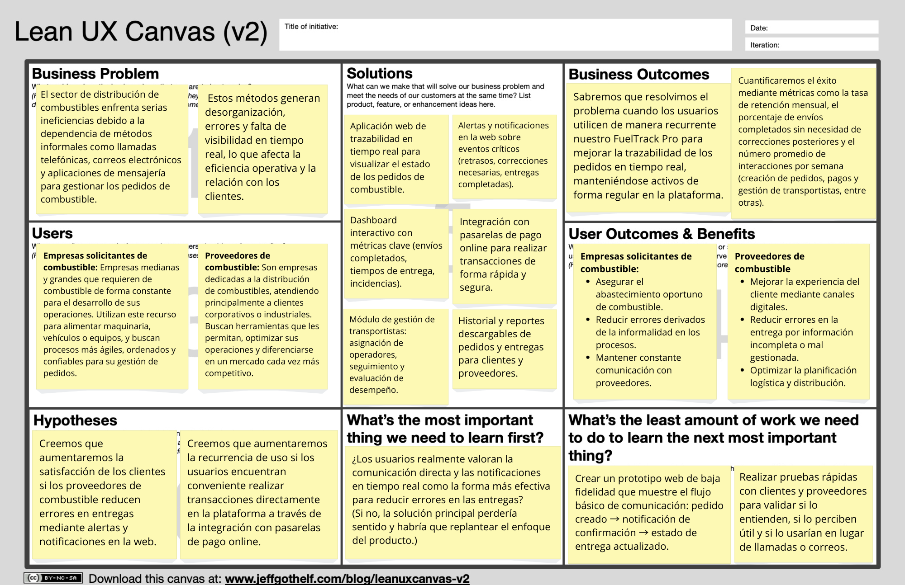

# Capítulo I: Introducción

## 1.1 Startup Profile

### 1.1.1 Descripción de la Startup

**Prime Fuel**: Startup innovador dedicado a la gestión de la compraventa de combustible entre empresas solicitantes y proveedores. Fundada por estudiantes de la Universidad Peruana de Ciencias Aplicadas, nuestra propuesta se centra en la digitalización de un sector tradicionalmente dependiente de procesos manuales, brindando una solución tecnológica que garantiza eficiencia, transparencia y un control más riguroso de las operaciones. 

**Misión**: Nuestra misión es desarrollar soluciones tecnológicas avanzadas que transformen el mercado de combustible, eliminando los medios informales y reduciendo el margen de error, mediante una plataforma web intuitiva y accesible. 

**Visión**: Nuestra visión es posicionarnos como líderes en la digitalización del sector energético, ofreciendo a las empresas una herramienta que facilite una gestión más eficiente, segura y sostenible, contribuyendo al progreso tecnológico y a la mejora de la competitividad del sector. 

### 1.1.2 Perfiles de integrantes del equipo

<table border>
  <thead>
    <tr>
      <th>Foto</th>
      <th>Nombre completo</th>
      <th>Código</th>
      <th>Carrera</th>
      <th>Habilidades técnicas</th>
    </tr>
  </thead>
  <tbody>
    <tr>
      <td></td>
      <td>Bonifacio Jaramillo Samuel Jesus</td>
      <td>u202317269</td>
      <td>Ingeniería de Software</td>
      <td>Soy Desarrollador FullStack orientado a soluciones AI. Amplia experiencia en pipelines automatizados y experimentos con LLMs. Actualmente desarrollando workflows inteligentes.</td>
    </tr>
    <tr>
      <td></td>
      <td>Castro Pariona Jefferson Ernesto</td>
      <td>u201822823</td>
      <td>Ingeniería de Software</td>
      <td></td>
    </tr>
    <tr>
      <td></td>
      <td>Alberto Alejandro Ponce Perales</td>
      <td>u202320684</td>
      <td>Ingeniería de Software</td>
      <td>Estudiante de la carrera de Ingeniería de Software en la UPC. Actualmente cuento con conocimientos en lenguajes de programación como C + + y manejo de Java. Considero que mis mayores virtudes son: la responsabilidad, capacidad de adaptarme, trabajar en equipo y la resiliencia.</td>
    </tr>
  </tbody>
</table>

---

## 1.2 Solution Profile

### 1.2.1 Antecedentes y problemática

- **What? (¿Qué?)**  
  La problemática principal es la falta de un sistema centralizado y digital para gestionar los pedidos de combustible, **agravada por la dependencia del reporte manual del nivel de combustible en los tanques de las empresas compradoras**. Actualmente, el comprador identifica de forma manual cuándo su nivel está por agotarse, lo que genera errores humanos, retrasos en las entregas y una imposibilidad de anticipar la necesidad de reposición. **Sin un mecanismo automatizado que reporte el nivel del tanque en tiempo real, la plataforma no puede conocer cuándo un cliente necesita abastecimiento ni anticiparse a la demanda**.

- **When? (¿Cuándo?)**  
  El problema se presenta constantemente en el proceso de gestión de pedidos, especialmente cuando hay un alto volumen de solicitudes o múltiples pedidos a coordinar. **La necesidad de reposición se detecta de forma tardía o reactiva**, solo cuando el operador verifica físicamente el tanque, a simple vista o con métodos rudimentarios, o, peor, cuando este ya está próximo a agotarse.

- **Where? (¿Dónde?)**  
  El problema ocurre en empresas solicitantes de combustible y proveedores, tanto en áreas urbanas como rurales, donde la infraestructura digital aún no está optimizada. **En el caso específico del monitoreo de tanques, la problemática se sitúa físicamente en las instalaciones del cliente**, donde no existe un sistema automatizado de medición de nivel.

- **Who? (¿Quién?)**  
  Los principales afectados son las empresas solicitantes (medianas y grandes) que dependen de combustible para operar, como los sectores industrial, minero, construcción y transporte, los proveedores de combustible y los encargados de la logística y gestión de pedidos. **Los operadores de tanques y encargados de compras son quienes directamente sufren la incertidumbre sobre el nivel real de sus reservas**.

- **Why? (¿Por qué?)**  
  El problema radica en la falta de integración entre los métodos actuales de gestión (como correos y aplicaciones de mensajería) **y, fundamentalmente, en la ausencia de un mecanismo automático que reporte el nivel de combustible en tiempo real**. Esto impide que la plataforma misma detecte cuándo un cliente necesita reposición, obligando a que sea el cliente quien inicie todo el proceso de forma manual. **Sin datos continuos de nivel de tanque, es imposible automatizar pedidos ni predecir patrones de consumo**.

- **How? (¿Cómo?)**  
  Los procesos actuales son desorganizados, utilizando diversas plataformas desconectadas. **En el caso del abastecimiento, el flujo comienza cuando el operador revisa el tanque de forma rudimentaria y decide contactar al proveedor vía correo o mensajería**. Este dato no está disponible digitalmente, lo que impide que el sistema genere alertas automáticas al cruzar un umbral crítico (ej. 20%) ni que, en caso de tener un proveedor favorito, se genere la solicitud de pedido de forma automática.

- **How Much? (¿Cuánto?)**  
  La magnitud del problema es considerable: cada día se pierden horas valiosas debido a la ineficiencia y los errores, lo que incrementa los costos operativos. **Un desabastecimiento no planificado puede detener operaciones industriales, mineras o de transporte, generando pérdidas económicas muy superiores al costo de prevenir el problema**. Además, la imposibilidad de recolectar datos históricos de consumo por cliente impide predecir patrones, optimizar la cadena de suministro y ofrecer inteligencia de datos tanto a compradores como a proveedores.

### 1.2.2 Lean UX Process

Para el desarrollo de la Startup, utilizamos el enfoque Lean UX, que nos permite validar nuestras hipótesis, enfocarnos en la experiencia del usuario y reducir riesgos desde las etapas iniciales. A través de prototipos, pruebas con empresas, simulaciones y ciclos de retroalimentación continua, adaptamos nuestra plataforma a las necesidades reales del mercado de combustible.

#### 1.2.2.1 Lean UX Problem Statements
 
**Solicitantes de Combustible (Empresas Compradoras)**
- **Problema:** Empresas de sectores industriales, mineros y de construcción coordinan sus pedidos de combustible mediante canales informales (llamadas, correos, mensajería), lo que genera desorganización, errores y ausencia de trazabilidad. 
- **Impacto:** Incertidumbre sobre el estado de los despachos y posibles interrupciones en sus operaciones debido a errores por mala coordinación.  
- **Riesgo:** La facilidad a la adaptación puede verse afectada si la plataforma no es intuitiva o no se adapta a procesos actuales.  
- **How Might We...?:** ¿Cómo podemos diseñar una experiencia que permita registrar y gestionar pedidos en menos de 3 minutos, con tasa de error <5% y adopción del 80% en el primer mes?  

**Proveedores de Combustible (Empresas Distribuidoras)**
- **Problema:** Gestionan múltiples pedidos, conciliaciones y despachos con procesos manuales, lo que aumenta la carga administrativa (asumida por los operadores del área) y el riesgo de errores logísticos.  
- **Impacto:** Baja eficiencia operativa y menor satisfacción del cliente.  
- **Riesgo:** Posible resistencia a la implementación si los beneficios no son inmediatos.  
- **How Might We...?:** ¿Cómo podemos demostrar que nuestra plataforma reduce el tiempo de gestión en un 40%, disminuye errores logísticos en un 60% y mejora la satisfacción del cliente en +1 punto en encuestas durante los primeros 3 meses?  

#### 1.2.2.2 Lean UX Assumptions

**Business Assumptions (Suposiciones de Negocio)**

* Las empresas están buscando formas de reducir errores y retrasos logísticos para optimizar sus costos operativos.
* Los proveedores están dispuestos a invertir para mejorar su nivel de servicio y aumentar su competitividad en el mercado.
* Las empresas usuarias apreciarán tener un mayor control sobre sus órdenes y ser capaces de seguirlas en una plataforma centralizada.
* La difícil trazabilidad de los pedidos y las fallas en la comunicación hace que dejar los métodos informales sea una necesidad crítica para todo el sector.

**User Assumptions (Suposiciones de Usuario)**

* *¿Quién es el usuario?*
  Los usuarios principales serían los encargados logísticos de los proveedores y las empresas solicitantes de combustible.
* *¿Dónde encaja nuestro producto en su trabajo o vida?*
  FullTank encajaría en el día a día de los usuarios como una plataforma de gestión centralizada, que ayudaría a coordinar, rastrear y organizar pedidos de combustible. Reemplazando así los sistemas no ligados que se utilizan hoy en día.
* *¿Qué problemas tiene nuestro producto que resolver?*
  FullTank debe resolver la desorganización causada por métodos informales de venta, reducir errores humanos y mejorar la experiencia del cliente.
* *¿Cuándo y cómo es nuestro producto usado?*
  Será utilizado diariamente por solicitantes y los proveedores por igual. Por el lado de los usuarios solicitantes, usarán la plataforma para registrar y monitorear pedidos de combustible, y por el lado de proveedores para gestionar la recepción, programación y entrega de dichos pedidos.
* *¿Qué características son importantes?*
  El seguimiento de pedidos en tiempo real, actualizaciones de estado mediante notificaciones, historial de entregas, paneles de control y una interfaz clara y rápida.
* *¿Cómo debe verse nuestro producto y cómo debe comportarse?*
  El producto debe presentar una interfaz limpia y profesional. Adaptada al perfil corporativo de los clientes objetivos. Debe ser eficiente, permitiendo la creación, modificación y seguimiento de pedidos en pocos clics. También debe ser altamente confiable, debido al alto valor y magnitud de las órdenes que se realizarán en la plataforma

**Feature Assumptions**

* Creemos que al proporcionar una plataforma centralizada con trazabilidad en tiempo real, ayudaremos a las empresas a reducir errores y mejorar la eficiencia logística.
* Creemos que al ofrecer una interfaz clara y rápida con funciones de seguimiento, aumentaremos la adopción entre proveedores y solicitantes.
* Creemos que al automatizar la gestión de pedidos, los usuarios reducirán su dependencia de métodos informales y ganarán en control y visibilidad.
* Creemos que al integrar notificaciones en tiempo real sobre estados de pedido, mejoraremos la coordinación entre actores y reduciremos los retrasos.
*  Creemos que al incluir visualización de métricas, facilitaremos la toma de decisiones y la optimización operativa de los proveedores.

#### 1.2.2.3 Lean UX Hypothesis Statements

**Hypothesis Statement 01:**
* *Creemos* que la centralización de los pedidos en nuestra plataforma reducirá el margen de errores causados por problemas de coordinación entre las empresas solicitantes y los proveedores drásticamente.
* *Sabremos* que hemos tenido éxito
* *Cuando* luego de los primeros tres meses de uso se reporte que más de un 70% de los pedidos realizados fueron confirmados sin necesidad de correcciones posteriores.

**Hypothesis Statement 02:**
* *Creemos* que ofrecer más herramientas para el control y seguimiento de pedidos mejorará la satisfacción de los clientes solicitantes.
* *Sabremos* que hemos tenido éxito
* *Cuando* se observe una reducción del 30% en llamadas de seguimiento.

**Hypothesis Statement 03:**
* *Creemos* que la plataforma permitirá a los proveedores optimizar el proceso de gestión de los pedidos y reducir el tiempo que toma cumplir con cada uno.
* *Sabremos* que hemos tenido éxito
* *Cuando* los proveedores logren reducir en un 20% el tiempo promedio entre confirmación y entrega de pedidos.

**Hypothesis Statement 04:**
* *Creemos* que las notificaciones automáticas sobre el estado de los pedidos reducirán la necesidad de una gran cantidad de operadores comerciales de alta disponibilidad.
* *Sabremos* que hemos tenido éxito
* *Cuando* las solicitudes de información por parte de clientes disminuyan en un 40% y el tiempo promedio de atención se reduzca en un 60% tras el primer trimestre de uso.

#### 1.2.2.4 Lean UX Canvas

## 1.3 Segmentos objetivos

**A. Empresas solicitantes de combustible**

Empresas medianas y grandes que requieren de combustible de forma constante para el desarrollo de sus operaciones. Utilizan este recurso para alimentar maquinaria, vehículos o equipos, y buscan procesos más ágiles, ordenados y confiables para su gestión de pedidos. Además, mantienen un contrato de exclusividad con un proveedor de combustible, lo que les permite tener un flujo constante de pedidos y una relación comercial estable.

*Necesidades:*
* Asegurar el abastecimiento oportuno de combustible.
* Reducir errores derivados de la informalidad en los procesos.
* Mantener constante comunicación con proveedores.
  
**B. Proveedores de combustible**

Son empresas dedicadas a la distribución de combustibles, atendiendo principalmente a clientes corporativos o industriales. Buscan herramientas que les permitan, optimizar sus operaciones y diferenciarse en un mercado cada vez más competitivo.

*Motivaciones:*
* Mejorar la experiencia del cliente mediante canales digitales.
* Reducir errores en la entrega por información incompleta o mal gestionada.
* Optimizar la planificación logística y distribución.