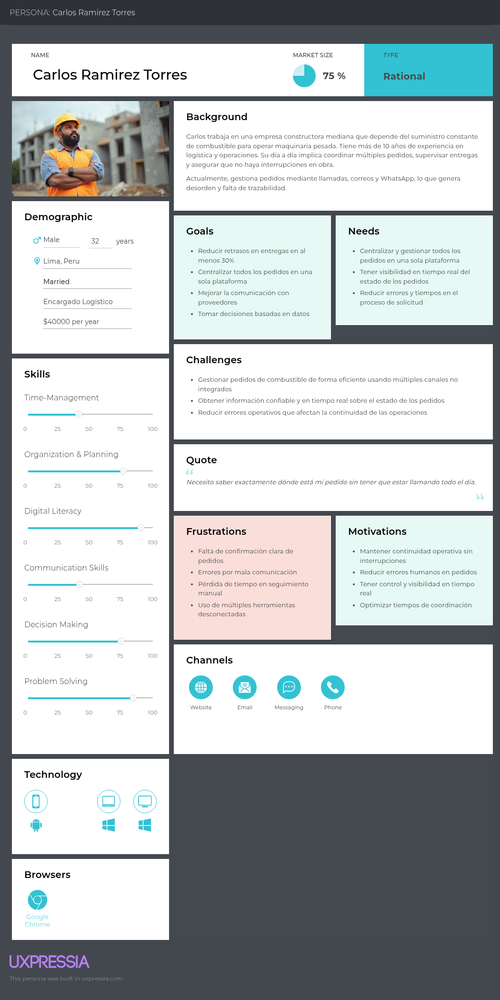
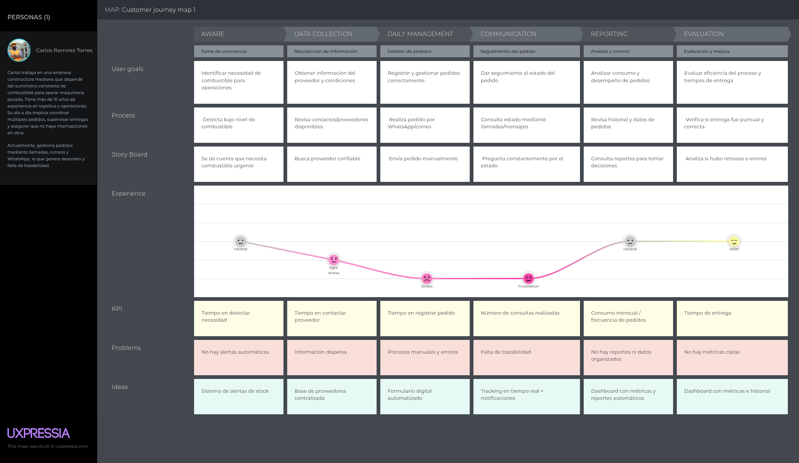
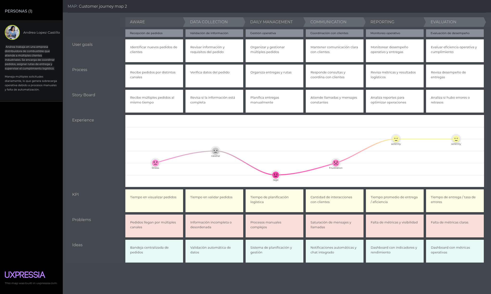

# Capítulo II: Requirements Elicitation & Analysis

## 2.1. Competidores

En el mercado existen diversas soluciones digitales enfocadas en la gestión de combustible y flotas que compiten de manera directa o indirecta con lo propuesto. Entre ellas destaca **Zavgar**, una plataforma SaaS que ayuda a las empresas con flotas vehiculares a optimizar costos y controlar el consumo de combustible. Otro competidor importante es **FuelCloud**, que ofrece una solución integrada de hardware y software para garantizar seguridad y precisión en el despacho de combustible, principalmente en empresas con tanques propios. Finalmente, **Wialon** se presenta como una plataforma internacional de gestión de flotas que combina monitoreo GPS, análisis operativos y control de combustible, dirigida a compañías logísticas y de transporte.

### 2.1.1. Análisis competitivo.

<table border="2">
  <tr>
    <th colspan="6" style="text-align:left">Competitive Analysis Landscape</th>
  </tr>
  <tr>
    <td colspan="1"><strong>¿Por qué llevar a cabo este análisis?</strong></td>
    <td colspan="5">Este análisis se está llevando a cabo porque queremos conocer las ventajas y desventajas de nuestra aplicación frente a la competencia, y cómo nos diferenciamos de ellas.</td>
  </tr>
  <tr>
    <td colspan="2"><strong></strong></td>
    <td><strong>FullTank</strong> </td>
    <td><strong>Zavgar</strong> </td>
    <td><strong>FuelCloud</strong> </td>
    <td><strong>Wialon</strong> </td>
  </tr>

  <tr>
    <th rowspan="3">Perfil</th>
    <td><strong>Visión general</strong></td>
    <td>Plataforma web que digitaliza y estructura el proceso completo de pedido de combustible entre empresas y proveedores.</td>
    <td>SaaS para la gestión de consumo de combustible de flotas, con enfoque en eficiencia, monitoreo y costos.</td>
    <td>Solución con hardware/software para el control físico del despacho de combustible.</td>
    <td>Plataforma de gestión de flotas con control de combustible, GPS y reportes operativos.</td>
  </tr>
  <tr>
    <td><strong>Ventaja competitiva</strong></td>
    <td>Especialización en el flujo completo de pedido, despacho y análisis; integración de pagos y logística; UI intuitiva.</td>
    <td>No requiere hardware; ofrece métricas, control de gastos y reportes sobre consumo.</td>
    <td>Control físico preciso del combustible, monitoreo en tiempo real.</td>
    <td>Seguimiento en tiempo real, visualización de rutas, integración con sensores de combustible.</td>
  </tr>
  <tr>
    <td><strong>¿Qué valor ofrece al cliente?</strong></td>
    <td>Trazabilidad total, eficiencia operativa, reportes de consumo y validación segura de pedidos.</td>
    <td>Optimización de costos y control sobre el uso de combustible en flotas.</td>
    <td>Seguridad y precisión operativa en el control de combustible.</td>
    <td>Trazabilidad de flotas, alertas automáticas, análisis de rutas y consumo de combustible.</td>
  </tr>
  <tr>
    <th rowspan="2">Perfil de Marketing</th>
    <td><strong>Mercado objetivo</strong></td>
    <td>Empresas que solicitan combustible a proveedores.</td>
    <td>Empresas con flotas vehiculares que desean monitorear y reducir el consumo de combustible.</td>
    <td>Empresas con tanques de combustible propios.</td>
    <td>Empresas logísticas, distribuidoras y de transporte de combustible.</td>
  </tr>
  <tr>
    <td><strong>Estrategias de marketing</strong></td>
    <td>Alianzas con proveedores, demostraciones de ahorro, marketing de contenido enfocado en eficiencia.</td>
    <td>Enfoque digital, contenido técnico, integración con proveedores de tarjetas de combustible.</td>
    <td>Ferias industriales, distribuidores, venta consultiva entre empresas.</td>
    <td>Alianzas con distribuidores de GPS, marketing técnico, ferias de transporte.</td>
  </tr>
  <tr>
    <th rowspan="3">Perfil de Producto</th>
    <td><strong>Productos & Servicios</strong></td>
    <td>Plataforma para gestión completa de pedidos, seguimiento, reportes, validación y alertas.</td>
    <td>Plataforma web con módulo de abastecimiento, reportes de consumo, integración GPS y tarjetas.</td>
    <td>Hardware IoT y software para gestión, y control de combustible.</td>
    <td>Plataforma SaaS + app móvil con monitoreo, alertas, mapas y módulos personalizables.</td>
  </tr>
  <tr>
    <td><strong>Precios & Costos</strong></td>
    <td>Modelo SaaS con suscripción escalable según volumen y servicios.</td>
    <td>SaaS con modelos por flota activa o vehículos monitoreados.</td>
    <td>Venta e instalación de hardware + licencias de software.</td>
    <td>Modelo SaaS modular, basado en vehículos activos y funcionalidades activadas.</td>
  </tr>
  <tr>
    <td><strong>Canales de distribución</strong></td>
    <td>Web app responsive, potencial app móvil futura.</td>
    <td>Web app, marketing digital y comunidad de flotas.</td>
    <td>Plataforma web + hardware instalado en sitio.</td>
    <td>Red de partners global, distribuidores locales e integradores de sistemas GPS.</td>
  </tr>
  <tr>
    <th rowspan="4">Análisis SWOT</th>
    <td><strong>Fortalezas</strong></td>
    <td>Enfoque especializado, experiencia de usuario optimizada, integraciones clave, análisis avanzado de consumo.</td>
    <td>Implementación ágil, sin hardware, fácil adopción en empresas medianas.</td>
    <td>Control físico riguroso, solución probada en industrias exigentes.</td>
    <td>Plataforma robusta, cobertura internacional, integración con más de 2,400 dispositivos GPS.</td>
  </tr>
  <tr>
    <td><strong>Debilidades</strong></td>
    <td>Nueva en el mercado, menor reconocimiento de marca, necesita consolidar confianza.</td>
    <td>No gestiona el flujo completo del pedido, enfoque parcial en flotas.</td>
    <td>Alto costo, dependencia de hardware, menor adaptabilidad en mercados emergentes.</td>
    <td>No gestiona pedidos entre proveedor y solicitante, requiere configuración técnica inicial.</td>
  </tr>
  <tr>
    <td><strong>Oportunidades</strong></td>
    <td>Alta informalidad en el sector, digitalización creciente en logística, necesidad de trazabilidad y control.</td>
    <td>Mayor conciencia en eficiencia de flotas y digitalización de costos operativos.</td>
    <td>Nuevos mercados industriales con enfoque en seguridad y control.</td>
    <td>Creciente necesidad de control logístico y monitoreo de distribución en países en desarrollo.</td>
  </tr>
  <tr>
    <td><strong>Amenazas</strong></td>
    <td>Aparición de soluciones similares, resistencia al cambio en empresas tradicionales, competencia ERP.</td>
    <td>SaaS especializados con mayor cobertura funcional (ERP, proveedores, logística).</td>
    <td>SaaS ágiles y sin hardware físico, que ofrecen soluciones más accesibles.</td>
    <td>SaaS más específicos y ligeros, enfocados exclusivamente en la trazabilidad de entregas.</td>
  </tr>
</table>

### 2.1.2. Estrategias y tácticas frente a competidores.

**PrimeFuel** aplicará diversas estrategias para afrontar la competencia y aprovechar las oportunidades que ofrece el sector.

#### a. Diferenciación a través de especialización
Una de las principales estrategias de **PrimeFuel** es la **especialización en el flujo completo de pedido de combustible**. A diferencia de soluciones como **Zavgar**, que están orientadas principalmente al control y análisis del consumo de combustible en flotas, nuestra plataforma se enfoca en las **interacciones B2B** entre empresas solicitantes y proveedores. Esto nos permite ofrecer un control dedicado del pedido, gestión de la logística, y reportes detallados de consumo y entregas, lo cual no está presente en la mayoría de las plataformas competidoras.

- **Táctica**: Desarrollar funcionalidades para la validación automática de pagos, gestión de stock en tiempo real y la optimización del transporte logrando la automatización de procesos que solo eran logrados de forma manual. Esto incluye el monitoreo IoT del nivel de los tanques del cliente, la generación automática de la solicitud de pedido cuando se cruza un umbral configurado y con un proveedor de confianza previamente seleccionado, y la posibilidad de que ese proveedor acepte o rechace la solicitud directamente desde la plataforma. Esto crea una ventaja frente a competidores como **FuelCloud**, que se centran más en el control físico del combustible y menos en la administración a nivel operativo.

#### b. Innovación en la interfaz de usuario y experiencia

El sistema de **PrimeFuel** está diseñado para ofrecer una **experiencia de usuario optimizada**, algo que **Wialon**, **FuelCloud** y la propia **OSINERGMIN** no abordan en sus plataformas. Al ser una solución especializada y dirigida a una tarea específica, podemos dedicar más recursos en crear una interfaz intuitiva y procesos bien definidos brindando comodidad y seguridad a nuestros usuarios.

- **Táctica**: Diseñar una **interfaz intuitiva y consistente** que permita a los usuarios acceder a reportes de consumo, validar pedidos y coordinar logística con facilidad, incluyendo una visualización clara del nivel del tanque en tiempo real y del estado de cada solicitud (pendiente, aceptada o rechazada). Además, ofrecer **soporte y formación continua** para asegurar que los usuarios aprovechen al máximo todas las funcionalidades del sistema.

#### c. Flexibilidad en precios y modelo SaaS escalable
El modelo de precios de **PrimeFuel** ofrece **planes escalables basados en suscripción**, lo que hace que sea más accesible para medianas y grandes empresas. Esto es más competitivo frente a **Wialon**, que puede no ser una opción viable para empresas que solo requieren una solución de pedidos de combustible. También es más asequible que **FuelCloud**, que requiere una inversión considerable en hardware, instalación y mantenimiento.

- **Táctica**: Ofrecer un modelo de suscripción flexible y **precios competitivos**, con **múltiples niveles de suscripción** adaptados a las necesidades de diferentes empresas. Esto permitirá que empresas de menor tamaño puedan acceder a la plataforma sin comprometer su presupuesto, a la vez que se asegura el crecimiento a largo plazo a medida que la empresa crece. El módulo de monitoreo IoT podrá ofrecerse como una capa adicional dentro de este modelo escalable, evitando que el costo del sensor sea una barrera de entrada para empresas más pequeñas.

#### d. Aprovechamiento de la digitalización en la logística
El sector de la logística está experimentando una transformación digital acelerada. **PrimeFuel** se aprovechará de esta tendencia incorporando monitoreo IoT del nivel de combustible en los tanques de almacenamiento de las empresas solicitantes, permitiendo que la plataforma cuente con datos reales y actualizados sobre sus reservas, en lugar de depender únicamente de la revisión manual que realizan hoy.

- **Táctica**: Instalar sensores de nivel en los tanques de las empresas del segmento comprador, configurables por umbral crítico según la capacidad y el consumo de cada cliente. Esta información permitirá generar alertas automáticas cuando el nivel de combustible se acerque al punto de reposición, y en los casos donde el cliente tenga un proveedor de confianza configurado, generar automáticamente la solicitud de pedido correspondiente. De esta forma, PrimeFuel deja de depender de que el cliente detecte manualmente la necesidad de abastecimiento, y puede anticiparse a ella con datos reales del propio tanque.

#### e. Expansión hacia mercados internacionales
Si bien **PrimeFuel** está inicialmente orientada a empresas locales, el modelo de negocio y la flexibilidad de la plataforma la hacen ideal para expandirse a **mercados internacionales**. Competidores como **Wialon** ya tienen presencia en mercados globales, pero su enfoque en empresas grandes y sus altos costos de implementación pueden ser una barrera para empresas de menor tamaño, limitando su alcance.

- **Táctica**: Iniciar la expansión en mercados emergentes donde la digitalización en la logística es una necesidad creciente. Esto incluirá la **localización de la plataforma** (idioma, moneda, regulaciones locales) para facilitar la adaptabilidad de los nuevos mercados.

## 2.2. Entrevistas.

### 2.2.1. Diseño de entrevistas.

Las entrevistas buscan comprender el proceso actual de abastecimiento antes de presentar la propuesta de FullTank. Por ese motivo, las preguntas se formulan de manera abierta y se enfocan en experiencias concretas, especialmente en la revisión del nivel de los tanques, la creación de pedidos y la coordinación de los despachos.

**A. Proveedores de combustible**

**Preguntas:**

1. ¿Cuál es su cargo y qué responsabilidades tiene en la gestión de pedidos o despachos?
2. ¿Qué tipos de clientes atiende la empresa y qué volumen aproximado de pedidos gestiona?
3. Cuénteme sobre el último pedido de combustible que recibió. ¿Por qué medio llegó y cómo lo registró?
4. ¿Cómo organizan actualmente los pedidos, contratos y despachos?
5. ¿Qué herramientas utilizan para registrar y consultar esa información?
6. ¿Qué errores o dificultades se presentan con mayor frecuencia durante la gestión de los pedidos?
7. ¿Cómo coordinan las cantidades, fechas, rutas y lugares de entrega?
8. ¿Cómo informan al cliente sobre la confirmación y el avance del despacho?
9. ¿Cuánto tiempo dedican a responder consultas sobre el estado de los pedidos?
10. ¿Qué ocurre cuando un cliente solicita combustible con poca anticipación?
11. ¿Qué información sobre el nivel o consumo del tanque del cliente les ayudaría a planificar mejor las entregas?
12. ¿Qué reportes o métricas necesitan para tomar decisiones operativas?
13. ¿Con qué sistemas tendría que integrarse una nueva plataforma?
14. ¿Qué condiciones serían necesarias para que la empresa adopte una plataforma de este tipo?
15. Si un cliente de confianza tuviera configurada la reposición automática, ¿qué necesitarían ver en la solicitud para poder aceptarla o rechazarla con seguridad?

---

**B. Empresas solicitantes de combustible**

**Preguntas:**

1. ¿Cuál es su cargo y qué responsabilidades tiene relacionadas con el combustible?
2. ¿Para qué operaciones utiliza combustible la empresa?
3. ¿La empresa cuenta con tanques de almacenamiento? ¿Qué capacidad aproximada tienen?
4. ¿Cómo revisan actualmente el nivel de combustible de los tanques?
5. ¿Con qué frecuencia realizan esa revisión?
6. ¿Cómo identifican que es necesario solicitar una reposición?
7. Cuénteme sobre la última vez que realizaron un pedido de combustible. ¿Cómo fue el proceso?
8. ¿Por qué medio contactan actualmente al proveedor?
9. ¿Qué problemas suelen presentarse al realizar o dar seguimiento a un pedido?
10. ¿Alguna vez han tenido retrasos o desabastecimiento? ¿Qué consecuencias tuvo para sus operaciones?
11. ¿Qué información necesitan consultar durante el proceso: nivel del tanque, cantidad solicitada, fecha de entrega o estado del despacho?
12. ¿Qué herramientas utilizan actualmente, como Excel, llamadas, correos o WhatsApp?
13. ¿Qué información les gustaría recibir automáticamente?
14. ¿Qué dificultades podrían tener para implementar un sensor o una plataforma digital?
15. ¿Confiarían en que la plataforma genere automáticamente la solicitud de pedido con un proveedor de su elección cuando el tanque llegue a un nivel crítico, o preferirían aprobar cada solicitud manualmente antes de que se envíe?

Al finalizar cada entrevista, se puede presentar brevemente la propuesta de FullTank y preguntar cómo se adapta al proceso descrito por el entrevistado. Esta explicación debe realizarse después de las preguntas principales para evitar influir en las respuestas.

### 2.2.2 Registro de entrevistas

**1. Segmento 1: Empresas solicitantes de combustible**

- Entrevista 1:

| Campo                    | Detalle |
|-------------------------|---------|
| **Nombre entrevistado** | - |
| **Edad**               | - |
| **Departamento**       | - |
| **Inicio del video**   | - |
| **Fin del video**      | - |
| **Link del video**     | - |
| **Foto entrevista**    | - |
| **Resumen**           | - |

- Entrevista 2:

| Campo                    | Detalle |
|-------------------------|---------|
| **Nombre entrevistado** | - |
| **Edad**               | - |
| **Departamento**       | - |
| **Inicio del video**   | - |
| **Fin del video**      | - |
| **Link del video**     | - |
| **Foto entrevista**    | - |
| **Resumen**           | - |

- Entrevista 3:

| Campo                    | Detalle |
|-------------------------|---------|
| **Nombre entrevistado** | - |
| **Edad**               | - |
| **Departamento**       | - |
| **Inicio del video**   | - |
| **Fin del video**      | - |
| **Link del video**     | - |
| **Foto entrevista**    | - |
| **Resumen**           | - |

**2. Segmento 2: Proveedores de combustible**

- Entrevista 1:

| Campo                    | Detalle |
|-------------------------|---------|
| **Nombre entrevistado** | - |
| **Edad**               | - |
| **Departamento**       | - |
| **Inicio del video**   | - |
| **Fin del video**      | - |
| **Link del video**     | - |
| **Foto entrevista**    | - |
| **Resumen**           | - |

- Entrevista 2:

| Campo                    | Detalle |
|-------------------------|---------|
| **Nombre entrevistado** | - |
| **Edad**               | - |
| **Departamento**       | - |
| **Inicio del video**   | - |
| **Fin del video**      | - |
| **Link del video**     | - |
| **Foto entrevista**    | - |
| **Resumen**           | - |

- Entrevista 3:

| Campo                    | Detalle |
|-------------------------|---------|
| **Nombre entrevistado** | - |
| **Edad**               | - |
| **Departamento**       | - |
| **Inicio del video**   | - |
| **Fin del video**      | - |
| **Link del video**     | - |
| **Foto entrevista**    | - |
| **Resumen**           | - |

### 2.2.3 Análisis de entrevistas
En esta sección se presenta el análisis detallado de la información recolectada. Para cada segmento, se explican los hallazgos objetivos y subjetivos, seguidos de su interpretación para el desarrollo de la solución.

### Segmento 1: Empresas Solicitantes de Combustible

**Análisis de Características Objetivas y Subjetivas:** El análisis evidencia una digitalización parcial pero desarticulada. El 100% de los entrevistados gestiona sus pedidos mediante herramientas informales como llamadas, correos electrónicos y WhatsApp, mientras que el 100% utiliza Excel como principal herramienta de registro. Sin embargo, no existe integración entre estas herramientas, lo que genera duplicidad de información y procesos manuales constantes. En términos operativos, los volúmenes gestionados son altos y críticos para la continuidad del negocio, con casos que superan los 20,000 m³ mensuales.

A nivel subjetivo, el 100% de los entrevistados identifica problemas de desorganización, errores en pedidos y pérdida de tiempo en validaciones. Asimismo, el 100% considera la trazabilidad en tiempo real como un factor clave, especialmente debido al impacto directo que tiene el desabastecimiento en sus operaciones, pudiendo generar paralizaciones completas. En cuanto a la toma de decisiones, el 100% prioriza el tiempo de entrega y la confiabilidad del proveedor por encima del precio en contextos críticos. Finalmente, existe una alta disposición a adoptar soluciones digitales, aunque con la condición implícita de que sean intuitivas y no generen fricción en su flujo actual.

### Segmento 2: Proveedores de Combustible

**Análisis de Características Objetivas y Subjetivas:** El análisis revela una operación altamente fragmentada y dependiente de procesos manuales. El 100% de los proveedores recibe pedidos mediante canales informales como WhatsApp, llamadas o correos, y el 100% utiliza Excel como herramienta principal de registro. Asimismo, el 100% gestiona contratos, pedidos y despachos en sistemas separados o documentos independientes, evidenciando una falta total de integración. En algunos casos, existen sistemas adicionales como ERP o GPS, pero estos operan de forma aislada, sin conexión con la gestión comercial o logística.

Desde una perspectiva subjetiva, el 100% de los entrevistados identifica errores frecuentes derivados de información incompleta o mal registrada, así como una pérdida significativa de tiempo en la búsqueda y validación de datos. Además, el 100% señala la falta de visibilidad del estado de los pedidos como un problema crítico, lo que obliga a realizar coordinaciones manuales constantes con clientes y operadores. A nivel estratégico, el 100% reconoce la importancia de contar con reportes históricos y métricas para mejorar la planificación y la toma de decisiones. Existe también un consenso en que una solución digital integrada representaría una mejora significativa en eficiencia operativa, escalabilidad y percepción de valor frente al cliente.

### Análisis Comparativo

**Contrastación de Segmentos:**

Al comparar ambos segmentos, se identifican coincidencias clave que validan la necesidad de la solución. En primer lugar, el 100% de ambos grupos depende de herramientas informales y no integradas (WhatsApp, correos y Excel), lo que genera ineficiencias estructurales en toda la cadena de valor. Asimismo, el 100% coincide en la necesidad de centralizar la información y mejorar la trazabilidad de los pedidos.

Sin embargo, existen diferencias importantes en la percepción del problema. Mientras que las empresas solicitantes experimentan el problema como un riesgo operativo crítico, donde el desabastecimiento puede detener completamente sus operaciones, los proveedores lo perciben como un problema de eficiencia y escalabilidad, relacionado con la sobrecarga operativa, errores y limitaciones para crecer sin aumentar recursos humanos.

Esta diferencia define claramente la propuesta de valor:

- Para los solicitantes: continuidad operativa y reducción de riesgo
- Para los proveedores: eficiencia, control y escalabilidad del negocio

### Conclusiones y Definición de Arquetipos

Basado en el análisis de las entrevistas, se definen los siguientes perfiles de usuario:

**User Persona Solicitante ("El Operador Crítico")**
- Rasgo clave: Prioriza la continuidad operativa y la confiabilidad por encima del costo.
- Sustento: El 100% considera la trazabilidad en tiempo real como crítica y prioriza el tiempo de entrega frente al precio.
- Necesidad principal: Evitar desabastecimientos y tener visibilidad inmediata del estado de sus pedidos.

**User Persona Proveedor ("El Gestor Saturado")**
- Rasgo clave: Busca orden y automatización para reducir carga operativa y escalar.
- Sustento: El 100% reporta desorganización, errores y procesos manuales intensivos, además de la necesidad de integrar sistemas.
- Necesidad principal: Centralizar la gestión de pedidos, contratos y despachos en una sola plataforma.

## 2.3 Needfinding
### 2.3.1 User Personas
- Segmento 1: Empresas solicitantes de combustible
  

- Segmento 2: Proveedores de Combustible
  

### 2.3.2 User Task Matrix

El User Task Matrix presenta las tareas que realizan los User Persona para cumplir sus objetivos en su día a día, independientemente de si usan nuestro software o no. Se evalúa la frecuencia y la importancia de cada tarea para identificar dónde aportar valor.

<table border="1">
  <thead>
    <tr>
      <th rowspan="2">Tarea (Task)</th>
      <th colspan="2">Empresas Solicitantes</th>
      <th colspan="2">Proveedores de Combustible</th>
    </tr>
    <tr>
      <th>Frecuencia</th>
      <th>Importancia</th>
      <th>Frecuencia</th>
      <th>Importancia</th>
    </tr>
  </thead>
  <tbody>
    <tr>
      <td>Registrar / recibir pedidos</td>
      <td>Alta</td>
      <td>Alta</td>
      <td>Alta</td>
      <td>Alta</td>
    </tr>
    <tr>
      <td>Validar información del pedido</td>
      <td>Media</td>
      <td>Alta</td>
      <td>Alta</td>
      <td>Alta</td>
    </tr>
    <tr>
      <td>Consultar / actualizar estado del pedido</td>
      <td>Alta</td>
      <td>Alta</td>
      <td>Alta</td>
      <td>Alta</td>
    </tr>
    <tr>
      <td>Modificar pedido</td>
      <td>Media</td>
      <td>Alta</td>
      <td>Baja</td>
      <td>Media</td>
    </tr>
    <tr>
      <td>Programar y planificar entregas</td>
      <td>Baja</td>
      <td>Media</td>
      <td>Alta</td>
      <td>Alta</td>
    </tr>
    <tr>
      <td>Gestionar múltiples pedidos</td>
      <td>Media</td>
      <td>Media</td>
      <td>Alta</td>
      <td>Alta</td>
    </tr>
    <tr>
      <td>Comunicarse entre cliente y proveedor</td>
      <td>Alta</td>
      <td>Alta</td>
      <td>Alta</td>
      <td>Alta</td>
    </tr>
    <tr>
      <td>Recibir / enviar notificaciones</td>
      <td>Alta</td>
      <td>Alta</td>
      <td>Alta</td>
      <td>Alta</td>
    </tr>
    <tr>
      <td>Revisar historial de pedidos</td>
      <td>Media</td>
      <td>Media</td>
      <td>Media</td>
      <td>Media</td>
    </tr>
    <tr>
      <td>Monitorear desempeño / consumo</td>
      <td>Baja</td>
      <td>Media</td>
      <td>Media</td>
      <td>Media</td>
    </tr>
    <tr>
      <td>Generar reportes y métricas</td>
      <td>Baja</td>
      <td>Media</td>
      <td>Media</td>
      <td>Media</td>
    </tr>
  </tbody>
</table>

### 2.3.3 User Journey Mapping

-Segmento 1: Empresas solicitantes de combustible

El User Journey Mapping de Carlos representa el recorrido actual que experimenta como responsable en una empresa constructora, en la gestión del abastecimiento de combustible necesario para la operación de maquinaria pesada. El mapa ilustra el proceso end-to-end, desde la identificación de la necesidad de combustible hasta la evaluación de la entrega y desempeño del proveedor.

En la situación As-Is, Carlos enfrenta un flujo de trabajo manual y poco estructurado: detecta necesidades sin apoyo de alertas, busca proveedores de manera informal, realiza pedidos mediante canales como WhatsApp o correo y da seguimiento a través de llamadas constantes. Esto genera desorden en la información, falta de trazabilidad, retrasos y una alta dependencia de la comunicación manual.

El Journey busca evidenciar los puntos críticos de su experiencia actual, identificando emociones, tareas, fricciones y oportunidades de mejora a lo largo de cada etapa (Awareness, Data Collection, Daily Management, Communication, Reporting y Evaluation). Este análisis servirá como base para diseñar una solución que centralice la información, automatice el registro de pedidos y permita el seguimiento en tiempo real.

 

-Segmento 2: Proveedores de Combustible

El User Journey Mapping de Andrea representa el recorrido actual que experimenta como coordinadora en una empresa distribuidora de combustible, encargada de gestionar múltiples pedidos, coordinar entregas y asegurar el cumplimiento logístico. El mapa ilustra el proceso end-to-end, desde la recepción de pedidos hasta la evaluación del desempeño operativo.

En la situación As-Is, Andrea enfrenta un flujo de trabajo altamente demandante y fragmentado: recibe pedidos por diversos canales, valida información manualmente, organiza rutas sin herramientas automatizadas y mantiene comunicación constante con clientes mediante llamadas y mensajes. Esto genera sobrecarga operativa, errores en la planificación, saturación en la comunicación y limitada visibilidad de métricas clave.

El Journey busca evidenciar los puntos críticos de su experiencia actual, identificando emociones, tareas, fricciones y oportunidades de mejora a lo largo de cada etapa (Awareness, Data Collection, Daily Management, Communication, Reporting y Evaluation). Este análisis servirá como base para diseñar una solución tecnológica que centralice pedidos, automatice la planificación logística y mejore la visibilidad operativa mediante indicadores y dashboards.

 

### 2.3.4 Empathy Mapping

Para la elaboración de los Empathy Maps, el equipo partió del conocimiento y observaciones recolectadas durante el análisis de los User Persona. Se colocó al centro de cada mapa al usuario correspondiente (Carlos y Andrea) y se respondieron las preguntas claves sobre su entorno, emociones, comportamientos y necesidades.

-Segmento 1: Empresas solicitantes de combustible

 

-Segmento 2: Proveedores de Combustible

 

## 2.4 Big Picture Event Storming

Para comprender a profundidad el dominio del negocio de **PrimeFuel** y alinear la visión tecnológica con las operaciones reales de compraventa y distribución de combustible, el equipo llevó a cabo una sesión de **Event Storming**. Esta técnica colaborativa nos permitió identificar los hitos clave del sistema sin adelantarnos a detalles técnicos.

### Step 1 – Free Exploration (Exploración Libre)

En esta primera etapa, el equipo realizó una lluvia de ideas desestructurada para capturar todos los **Eventos de Dominio** relevantes de la operativa logística y comercial. Utilizando notas de color naranja (*post-its*), registramos hechos que ya ocurrieron en el negocio, redactados estrictamente en tiempo pasado (ej. *Fuel request created*, *Fuel dispatched*). 

El objetivo principal fue plasmar sobre el lienzo la realidad del negocio, desde el registro de usuarios hasta el despacho físico en las cisternas, priorizando la cantidad de eventos sobre el orden cronológico o la jerarquía.

  
  
<em>Figura X: Step 1 - Exploración libre de eventos de dominio.</em>

### Step 2 – Structured Organization (Líneas de Tiempo)

Tras listar los eventos de dominio, procedimos a organizar el caos inicial estructurando los *post-its* en un flujo lógico de negocio de izquierda a derecha. Agrupamos los eventos en cuatro grandes bloques temporales que reflejan el ciclo de vida real de una operación de abastecimiento de combustible:

1. **Onboarding & Contracting:** Abarca el registro de las empresas y la formalización de los contratos de exclusividad.
2. **Order Management:** Contiene el núcleo transaccional administrativo, desde la creación de la solicitud y envío de cotizaciones, hasta la confirmación y validación financiera.
3. **Logistics & Dispatch:** Refleja la operativa física, incluyendo la asignación de cisternas (*Tanker assigned to order*), actualización de inventarios y la entrega del combustible.
4. **Monitoring & Analytics:** Agrupa los eventos asíncronos de valor agregado, como el envío de notificaciones, alertas de precios y reportes de consumo.

Esta estructura temporal nos ayudó a identificar claramente las áreas críticas donde la digitalización eliminará los actuales cuellos de botella del sector.

  
  
<em>Figura Y: Step 2 - Organización temporal por flujos de negocio.</em>

## 2.5 Ubiquitous Language

En este proyecto, cuyo objetivo principal es mejorar la eficiencia, la trazabilidad y la comunicación en la gestión y distribución de combustible a través de una plataforma web, se ha definido el siguiente lenguaje común para garantizar la claridad y la coherencia entre usuarios, desarrolladores y partes interesadas:

<table border="1">
  <thead>
    <tr>
      <th>Term</th>
      <th>Definition</th>
    </tr>
  </thead>
  <tbody>
    <tr>
      <td>Fuel Request</td>
      <td>Order generated by a client company specifying type, quantity, and delivery details of fuel.</td>
    </tr>
    <tr>
      <td>Client Company</td>
      <td>Organization that requires fuel for its operations and uses the platform to place and track orders.</td>
    </tr>
    <tr>
      <td>Fuel Supplier</td>
      <td>Company responsible for receiving, validating, and fulfilling fuel requests.</td>
    </tr>
    <tr>
      <td>Order Status</td>
      <td>Current stage of a request (e.g., pending, validated, scheduled, in delivery, completed).</td>
    </tr>
    <tr>
      <td>Order Tracking</td>
      <td>Real-time monitoring of the progress and location of a fuel delivery.</td>
    </tr>
    <tr>
      <td>Delivery Scheduling</td>
      <td>Process of assigning date, time, and logistics resources to fulfill a fuel request.</td>
    </tr>
    <tr>
      <td>Centralized Dashboard</td>
      <td>Main interface where users visualize orders, metrics, and operational status.</td>
    </tr>
    <tr>
      <td>Notification</td>
      <td>Automated message informing users about updates or changes in their fuel requests.</td>
    </tr>
    <tr>
      <td>Order History</td>
      <td>Record of past fuel requests, including details and outcomes.</td>
    </tr>
    <tr>
      <td>Logistics Planning</td>
      <td>Organization and optimization of routes, deliveries, and operational resources.</td>
    </tr>
    <tr>
      <td>Validation Process</td>
      <td>Step where the supplier confirms availability, accuracy, and feasibility of a request.</td>
    </tr>
    <tr>
      <td>Integrated Communication</td>
      <td>Built-in chat or messaging system enabling direct interaction between clients and suppliers.</td>
    </tr>
    <tr>
      <td>Operational Metrics</td>
      <td>Indicators such as delivery time, efficiency, and error rates used for performance evaluation.</td>
    </tr>
    <tr>
      <td>Report</td>
      <td>Generated document or dashboard summarizing fuel consumption, deliveries, and performance data.</td>
    </tr>
    <tr>
      <td>Session</td>
      <td>Authenticated period in which a user accesses the platform with secure credentials.</td>
    </tr>
    <tr>
      <td>Roles and Permissions</td>
      <td>Access controls that define what actions each type of user (client or supplier) can perform.</td>
    </tr>
  </tbody>
</table>

Beneficios esperados del lenguaje común:

- Facilita la comunicación entre desarrolladores, usuarios y partes interesadas del sistema.

- Mejora la comprensión de los procesos y funcionalidades principales del sistema.

- Reduce la ambigüedad y las malas interpretaciones durante el diseño y el desarrollo.

- Garantiza la coherencia en la documentación, las interfaces y la implementación.
