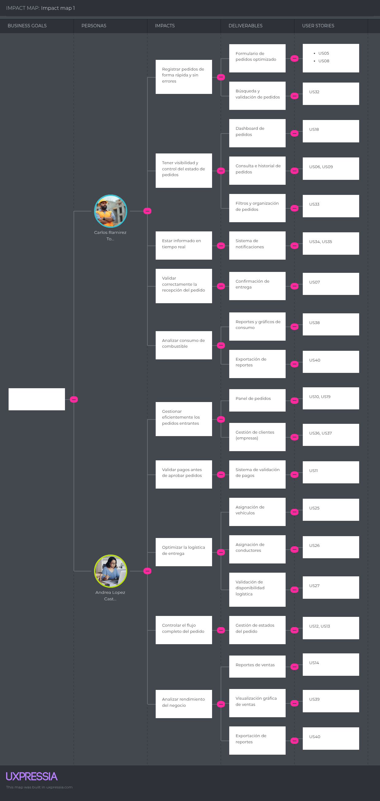

# Capítulo III: Requirements Specification

## 3.1 User Stories

Las épicas de este capítulo se derivan de las necesidades identificadas en el Capítulo I y validadas mediante las entrevistas y el Needfinding del Capítulo II. Una épica representa una capacidad de negocio suficientemente amplia para contener varias historias de usuario relacionadas por una misma necesidad; no representa una pantalla, un endpoint aislado ni una tarea técnica. Cada historia se mantiene dentro de la épica cuyo resultado contribuye directamente a resolver el problema.

La trazabilidad funcional se organiza de la siguiente manera:

El único segmento comercial de este capítulo es el **Distribuidor Logístico de Combustible**. Para conservar la numeración y el contenido de las historias levantadas en las entrevistas, las historias heredadas que utilizan los términos «proveedor», «solicitante» o «ambos roles» se interpretan como puntos de contacto dentro de ese mismo servicio: respectivamente, el distribuidor, el comprador asociado y la interacción entre ambos. Las historias nuevas del flujo IoT emplean directamente esta nomenclatura.

* **Necesidad N1 — Activar el abastecimiento sin comunicación manual:** se cubre con **EP02 — Activación IoT y solicitudes automáticas**, que agrupa la asociación del tanque, la detección del umbral, la generación idempotente del pedido y la consulta de su estado.
* **Necesidad N2 — Permitir que el distribuidor decida si puede atender el pedido:** se cubre con **EP03 — Aceptación y gestión del pedido del distribuidor**, que agrupa la revisión, aceptación, rechazo, despacho y cierre de la solicitud.
* **Necesidad N3 — Asignar recursos compatibles y disponibles:** se cubre con **EP08 — Asignación de recursos y despacho**, que agrupa la administración de conductores y cisternas, la validación de capacidad y la asignación al pedido.
* **Necesidad N4 — Entregar el combustible de forma segura y demostrable:** se cubre con **EP16 — Telemetría, seguridad y trazabilidad**, que agrupa la telemetría de tanque y cisterna, el control de válvulas, las alertas y la evidencia de recepción.
* **Necesidad N5 — Mantener acceso, comunicación y decisiones basadas en datos:** se cubre con las épicas transversales de IAM, notificaciones, reportes, catálogo e inventario, que soportan las capacidades principales sin sustituirlas.

Las historias existentes de registro manual, consulta, pagos, autenticación y landing se conservan como capacidades complementarias o de contingencia. El flujo principal, sin embargo, debe empezar en el evento IoT de nivel bajo y no en un formulario manual del comprador.

<table border>
  <thead>
    <tr>
      <th>ID</th>
      <th>Título</th>
      <th>Descripción</th>
      <th>Criterios de Aceptación</th>
      <th>Epic ID</th>
    </tr>
  </thead>
  <tbody>

<!-- EP01 -->
<tr>
  <td colspan="5"><b>EP01 — Landing Page:</b> Como visitante, quiero explorar el sitio web público de FullTank para conocer el producto antes de registrarme.</td>
</tr>
<tr>
  <td>US-01</td>
  <td>Ver sección Home</td>
  <td>Como visitante (proveedor), quiero ver una sección de inicio que resuma el valor de FullTank para comprender rápidamente el objetivo del sistema.</td>
  <td><b>Escenario 1: Visualización de resumen del sistema</b> Dado que el visitante (proveedor) accede al sitio web, Cuando se encuentra en la sección Home, Entonces puede ver un resumen claro del sistema.  <b>Escenario 2: Acceso a call to action desde Home</b> Dado que el visitante (proveedor) revisa la sección Home, Cuando desliza hacia abajo, Entonces encuentra un botón que lo invita a conocer más sobre FullTank.</td>
  <td>EP01</td>
</tr>
<tr>
  <td>US-02</td>
  <td>Ver sección About Us</td>
  <td>Como visitante del servicio FullTank, quiero conocer quiénes están detrás de FullTank para confiar en el sistema.</td>
  <td><b>Escenario 1: Información visible del equipo</b> Dado que el visitante del servicio FullTank accede a About Us, Cuando se carga la sección, Entonces puede leer una descripción del equipo detrás del sistema.  <b>Escenario 2: Ver valores o misión</b> Dado que el visitante del servicio FullTank revisa la sección completa, Cuando llega al final del contenido, Entonces puede conocer los valores o misión de la empresa.</td>
  <td>EP01</td>
</tr>
<tr>
  <td>US-03</td>
  <td>Ver sección How it works?</td>
  <td>Como visitante del servicio FullTank, quiero entender cómo funciona FullTank paso a paso para evaluar si se ajusta a mis necesidades.</td>
  <td><b>Escenario 1: Comprensión del flujo de pedidos</b> Dado que el visitante del servicio FullTank accede a How it works?, Cuando lee la sección, Entonces entiende el flujo de pedido desde solicitud hasta entrega.  <b>Escenario 2: Interacción clara entre usuarios</b> Dado que el visitante del servicio FullTank busca claridad, Cuando revisa la sección, Entonces puede comprender cómo interactúan solicitante y proveedor.</td>
  <td>EP01</td>
</tr>
<tr>
  <td>US-04</td>
  <td>Enviar mensaje de contacto</td>
  <td>Como visitante del servicio FullTank, quiero enviar un mensaje desde Contact Us para solicitar más información.</td>
  <td><b>Escenario 1: Envío exitoso de mensaje</b> Dado que el visitante del servicio FullTank completa el formulario correctamente, Cuando presiona "Enviar", Entonces el mensaje es registrado para revisión.  <b>Escenario 2: Validación de campos obligatorios</b> Dado que el visitante del servicio FullTank deja campos vacíos, Cuando intenta enviar el formulario, Entonces el sistema muestra una advertencia.  <b>Escenario 3: Confirmación visual del envío</b> Dado que el visitante del servicio FullTank envía el formulario exitosamente, Cuando el mensaje es registrado, Entonces recibe una confirmación visual o notificación.</td>
  <td>EP01</td>
</tr>
<tr>
  <td>US-36</td>
  <td>Ver sección Benefits</td>
  <td>Como visitante del servicio FullTank, quiero conocer las principales ventajas con las que puedo contar para evaluar la implementación de la plataforma.</td>
  <td><b>Escenario 1: Visualizar beneficios</b> Dado que el visitante del servicio FullTank accede a la sección "¿Por qué elegir FullTank?", Cuando visualiza los múltiples beneficios, Entonces puede identificar nuestra ventajas frente a nuestros competidores.  <b>Escenario 2: Visualizar beneficios</b> Dado que el visitante del servicio FullTank accede a la sección "¿Por qué elegir FullTank?", Cuando observa la lista de beneficios, Entonces ve como le podría beneficiar usar FullTank.</td>
  <td>EP01</td>
</tr>
<tr>
  <td>US-37</td>
  <td>Ver sección Lo que Dicen Nuestros Clientes</td>
  <td>Como visitante del servicio FullTank, quiero conocer los testimonios de los usuarios de FullTank para tener confianza en la plataforma y saber que otras empresas ya la están usando.</td>
  <td><b>Escenario 1: Ver testimonios de clientes</b> Dado que el visitante del servicio FullTank está interesado en los comentarios de los clientes, Cuando accede a la sección, Entonces puede leer un breve testimonio sobre experiencias usando FullTank.  <b>Escenario 2: Visualizar testimonios recientes</b> Dado que el visitante del servicio FullTank accede a la sección y esta se actualiza regularmente, Cuando se carga la información, Entonces visualiza las últimos testimonios que se han unido a FullTank.</td>
  <td>EP01</td>
</tr>
<tr>
  <td>US-38</td>
  <td>Ver sección Planes y Precios</td>
  <td>Como visitante del servicio FullTank, quiero saber que planes se adecuan a mis necesidades para poder iniciar un proceso de registro o solicitud.</td>
  <td><b>Escenario 1: Ver información sobre ser solicitante de combustible</b> Dado que el visitante entra a la sección Precios y Planes, Cuando visualiza los diferentes precios y las features incluidas, Entonces entiende que existe flexibilidad para adaptar FullTank a su empresa.  <b>Escenario 2: Seleccionar un plan</b> Dado que el visitante está interesado en obtener un plan específico, Cuando hace clic en el call to action, Entonces es redirigido a la página de registro.</td>
  <td>EP01</td>
</tr>
<tr>
  <td>US-39</td>
  <td>Cambiar idioma</td>
  <td>Como visitante del servicio FullTank, quiero poder cambiar entre inglés y español para entender la plataforma en mi idioma preferido.</td>
  <td><b>Escenario 1: Cambiar idioma a español</b> Dado que el visitante del servicio FullTank está viendo la página en inglés, Cuando selecciona la opción de español, Entonces toda la interfaz de la página se muestra en español.  <b>Escenario 2: Cambiar idioma a inglés</b> Dado que el visitante está viendo la página en español, Cuando selecciona la opción de inglés, Entonces toda la interfaz de la página se muestra en inglés.</td>
  <td>EP01</td>
</tr>

<!-- EP02 -->
<tr>
  <td colspan="5"><b>EP02 — Activación IoT y Solicitudes Automáticas:</b> Como comprador asociado y sistema IoT, quiero detectar el nivel bajo del tanque y generar una solicitud completa para iniciar el abastecimiento sin comunicación manual.</td>
</tr>
<tr>
  <td>US-05</td>
  <td>Registrar pedido de contingencia</td>
  <td>Como comprador asociado, quiero registrar manualmente un pedido cuando el dispositivo IoT no esté disponible para mantener la continuidad del abastecimiento.</td>
  <td><b>Escenario 1: Registro exitoso del pedido</b> Dado que el solicitante accede al formulario de pedidos, Cuando completa los campos requeridos, Entonces puede enviar un nuevo pedido.  <b>Escenario 2: Validación de campos</b> Dado que el solicitante deja un campo obligatorio vacío, Cuando intenta enviar el pedido, Entonces el sistema muestra un mensaje de error.  <b>Escenario 3: Confirmación del cambio de estado</b> Dado que el solicitante envió el pedido, Cuando el proveedor lo aprueba, Entonces su estado se actualiza automáticamente.</td>
  <td>EP02</td>
</tr>
<tr>
  <td>US-06</td>
  <td>Consultar estado del pedido</td>
  <td>Como comprador asociado, quiero consultar el estado del pedido generado por mi tanque para saber si fue aceptado, asignado, despachado o entregado.</td>
  <td><b>Escenario 1: Consulta de estado en el panel</b> Dado que el solicitante accede a su panel, Cuando revisa la lista de pedidos, Entonces ve el estado actualizado.  <b>Escenario 2: Actualización dinámica de estado</b> Dado que el solicitante está visualizando el panel de pedidos, Cuando el pedido cambia de estado, Entonces el cambio se refleja correctamente al recargar el panel.</td>
  <td>EP02</td>
</tr>
<tr>
  <td>US-07</td>
  <td>Confirmar recepción de pedido</td>
  <td>Como comprador asociado, quiero confirmar la recepción del combustible para que el distribuidor cierre la entrega y conserve la evidencia.</td>
  <td><b>Escenario 1: Confirmación exitosa de recepción</b> Dado que el solicitante recibió el pedido, Cuando lo confirma en el sistema, Entonces su estado cambia a "Entregado".  <b>Escenario 2: Prevención de doble confirmación</b> Dado que el solicitante ya confirmó la entrega, Cuando intenta volver a confirmar, Entonces el sistema bloquea la acción y notifica al usuario.</td>
  <td>EP02</td>
</tr>
<tr>
  <td>US-08</td>
  <td>Registrar información de pago</td>
  <td>Como comprador asociado, quiero registrar la información de pago asociada al pedido cuando el acuerdo comercial lo requiera.</td>
  <td><b>Escenario 1: Registro exitoso de depósitos</b> Dado que el solicitante ingresa la información de depósitos, Cuando registra el pedido, Estos quedan vinculados a él.  <b>Escenario 2: Número de operación con formato inválido</b> Dado que el solicitante ingresa un número de operación que no corresponde a un formato bancario válido, Cuando intenta registrar el depósito, Entonces el sistema muestra un mensaje de error.  <b>Escenario 3: Validación de depósitos ya registrados</b> Dado que el solicitante ingresa un depósito con un número de operación repetido, Cuando intenta seguir con el registro, Entonces el sistema notifica el error.</td>
  <td>EP02</td>
</tr>
<tr>
  <td>US-09</td>
  <td>Ver historial de pedidos</td>
  <td>Como comprador asociado, quiero consultar el historial de pedidos generados por mi tanque para revisar el abastecimiento recibido.</td>
  <td><b>Escenario 1: Visualización del historial</b> Dado que el solicitante accede al historial, Cuando se listan los pedidos, Entonces puede ver fecha, tipo y estado de cada uno.  <b>Escenario 2: Historial vacío</b> Dado que el solicitante aún no ha realizado pedidos, Cuando accede al historial, Entonces se muestra un mensaje informativo.  <b>Escenario 3: Acceso a detalles desde historial</b> Dado que el solicitante ve la lista de pedidos anteriores, Cuando selecciona uno, Entonces puede revisar sus detalles.</td>
  <td>EP02</td>
</tr>
<tr>
  <td>US-43</td>
  <td>Ver detalle de pedido</td>
  <td>Como usuario del servicio FullTank, quiero ver el detalle completo de un pedido para revisar toda la información asociada.</td>
  <td><b>Escenario 1: Visualización completa del detalle</b> Dado que el usuario selecciona un pedido desde su panel, Cuando se carga la vista de detalle, Entonces puede ver tipo de combustible, cantidad, estado, fechas, datos de pago y asignación logística.  <b>Escenario 2: Pedido no encontrado</b> Dado que el usuario intenta acceder al detalle de un pedido inexistente, Cuando se carga la vista, Entonces el sistema muestra un mensaje de error y ofrece regresar al listado.  <b>Escenario 3: Restricción de acceso a pedidos ajenos</b> Dado que el usuario intenta acceder al detalle de un pedido que no le pertenece, Cuando carga la URL directamente, Entonces el sistema restringe el acceso y redirige a su propio panel.</td>
  <td>EP02</td>
</tr>
<tr>
  <td>US-50</td>
  <td>Generar solicitud automática por umbral de tanque</td>
  <td>Como sistema IoT, quiero generar automáticamente una solicitud de pedido cuando el sensor detecte que el nivel del tanque alcanzó el umbral configurado y exista un distribuidor asociado, para que el abastecimiento se inicie sin intervención manual del comprador.</td>
  <td><b>Escenario 1: Generación automática exitosa</b> Dado que el sensor reporta un nivel igual o menor al umbral configurado y la empresa tiene un proveedor de confianza asignado, Cuando el sistema procesa la lectura, Entonces se crea automáticamente una solicitud con estado "Pendiente" sin intervención del solicitante.  <b>Escenario 2: Sin proveedor de confianza configurado</b> Dado que el sensor detecta el umbral crítico pero la empresa no tiene proveedor de confianza asignado, Cuando se procesa la lectura, Entonces el sistema notifica al solicitante para que registre el pedido manualmente.  <b>Escenario 3: Umbral aún no alcanzado</b> Dado que el sensor reporta un nivel por encima del umbral configurado, Cuando se procesa la lectura, Entonces no se genera ninguna solicitud.</td>
  <td>EP02</td>
</tr>

<!-- EP03 -->
<tr>
  <td colspan="5"><b>EP03 — Aceptación y Gestión del Pedido del Distribuidor:</b> Como distribuidor, quiero revisar, aceptar o rechazar las solicitudes generadas por IoT y conducirlas hasta el despacho y cierre.</td>
</tr>
<tr>
  <td>US-10</td>
  <td>Ver pedidos pendientes</td>
  <td>Como distribuidor, quiero ver las solicitudes pendientes con nivel, volumen, producto, ubicación y fecha requeridos para tomar una decisión informada.</td>
  <td><b>Escenario 1: Listado de pedidos pendientes</b> Dado que el proveedor accede al panel, Cuando ve los pedidos pendientes, Entonces puede revisar sus detalles básicos.  <b>Escenario 2: Filtro por fechas o cliente</b> Dado que el proveedor tiene muchos pedidos, Cuando aplica filtros por fecha o empresa, Entonces puede localizar los pedidos relevantes.</td>
  <td>EP03</td>
</tr>
<tr>
  <td>US-11</td>
  <td>Aprobar pedido</td>
  <td>Como distribuidor, quiero aceptar una solicitud generada por IoT cuando pueda atender el volumen, producto, ubicación y fecha requeridos.</td>
  <td><b>Escenario 1: Aprobación de pedido con depósitos válidos</b> Dado que el proveedor tiene el pago completo del pedido, Cuando intenta aprobarlo, Entonces el estado cambia a "Aprobado".  <b>Escenario 2: No aprobar el pedido por pago incompleto</b> Dado que el proveedor no cuenta con los depósitos suficientes para completar el pago del pedido, Cuando intenta aprobarlo, Entonces se muestra un mensaje indicando que el pedido no fue pagado por completo.</td>
  <td>EP03</td>
</tr>
<tr>
  <td>US-12</td>
  <td>Marcar pedido como despachado</td>
  <td>Como distribuidor, quiero marcar cuándo una orden asignada sale a entrega para iniciar el seguimiento del viaje.</td>
  <td><b>Escenario 1: Despacho exitoso de un pedido</b> Dado que el proveedor tiene un pedido aprobado, Cuando marca el pedido como despachado, Entonces el estado cambia a "Despachado".  <b>Escenario 2: Restricción de despacho sin aprobación previa</b> Dado que el proveedor intenta despachar un pedido sin pasar por la liberación correspondiente, Cuando ejecuta la acción, Entonces el sistema impide el cambio de estado y muestra un mensaje.</td>
  <td>EP03</td>
</tr>
<tr>
  <td>US-13</td>
  <td>Cerrar pedido</td>
  <td>Como distribuidor, quiero cerrar la orden cuando exista confirmación y evidencia de recepción para finalizar el proceso.</td>
  <td><b>Escenario 1: Cierre correcto del pedido tras confirmación</b> Dado que el solicitante ya confirmó la entrega, Cuando el proveedor cierra el pedido, Entonces este no puede modificarse más.  <b>Escenario 2: Intento de cierre sin confirmación previa</b> Dado que el proveedor intenta cerrar el pedido, Cuando el solicitante aún no ha confirmado la entrega, Entonces el sistema impide esta acción.</td>
  <td>EP03</td>
</tr>
<tr>
  <td>US-14</td>
  <td>Generar reporte de ventas</td>
  <td>Como proveedor, quiero generar reportes de ventas para tener registro de operaciones realizadas.</td>
  <td><b>Escenario 1: Generación de reporte con datos disponibles</b> Dado que el proveedor selecciona un rango de fechas válido, Cuando solicita el reporte, Entonces se genera un archivo con los datos de ventas.  <b>Escenario 2: Generación sin datos en el rango</b> Dado que el proveedor selecciona un rango sin ventas, Cuando solicita el reporte, Entonces el sistema informa que no hay resultados.  <b>Escenario 3: Descarga del archivo generado</b> Dado que el reporte se genera correctamente, Cuando finaliza el proceso, Entonces el proveedor puede descargar el archivo.</td>
  <td>EP03</td>
</tr>
<tr>
  <td>US-42</td>
  <td>Rechazar pedido</td>
  <td>Como distribuidor, quiero rechazar una solicitud cuando no pueda atenderla e indicar el motivo para notificar oportunamente al comprador.</td>
  <td><b>Escenario 1: Rechazo exitoso con motivo</b> Dado que el proveedor decide no atender un pedido pendiente, Cuando selecciona "Rechazar" e ingresa un motivo, Entonces el estado del pedido cambia a "Rechazado" y el solicitante recibe una notificación.  <b>Escenario 2: Intento de rechazo sin motivo</b> Dado que el proveedor intenta rechazar un pedido sin ingresar motivo, Cuando ejecuta la acción, Entonces el sistema solicita ingresar un motivo obligatorio antes de confirmar.  <b>Escenario 3: Rechazo de pedido ya procesado</b> Dado que el proveedor intenta rechazar un pedido que ya fue aprobado o despachado, Cuando ejecuta la acción, Entonces el sistema impide la acción y muestra el estado actual del pedido.</td>
  <td>EP03</td>
</tr>

<!-- EP04 -->
<tr>
  <td colspan="5"><b>EP04 — Autenticación y Registro:</b> Como usuario, quiero registrarme e iniciar sesión en la plataforma para acceder de forma segura a mi cuenta.</td>
</tr>
<tr>
  <td>US-15</td>
  <td>Iniciar sesión</td>
  <td>Como usuario registrado, quiero iniciar sesión con correo y contraseña para acceder a mi cuenta.</td>
  <td><b>Escenario 1: Inicio de sesión exitoso</b> Dado que el usuario registrado ingresa credenciales válidas, Cuando presiona iniciar sesión, Entonces accede a su dashboard.  <b>Escenario 2: Error por credenciales incorrectas</b> Dado que el usuario registrado ingresa datos incorrectos, Cuando intenta iniciar sesión, Entonces el sistema muestra un mensaje de error.  <b>Escenario 3: Validación de campos vacíos</b> Dado que el usuario deja campos vacíos, Cuando intenta iniciar sesión, Entonces el sistema solicita completar los campos.</td>
  <td>EP04</td>
</tr>
<tr>
  <td>US-16</td>
  <td>Recuperar contraseña</td>
  <td>Como usuario registrado, quiero recuperar mi contraseña para volver a acceder si la olvidé.</td>
  <td><b>Escenario 1: Envío de enlace de recuperación</b> Dado que el usuario registrado ingresa su correo válido, Cuando solicita recuperación, Entonces recibe un enlace al correo.  <b>Escenario 2: Error por correo no registrado</b> Dado que el usuario ingresa un correo inexistente, Cuando solicita recuperación, Entonces se le informa que el correo no está registrado.  <b>Escenario 3: Validación de campo vacío</b> Dado que el usuario no completa el campo de correo, Cuando intenta enviar la solicitud, Entonces el sistema solicita completarlo.</td>
  <td>EP04</td>
</tr>
<tr>
  <td>US-17</td>
  <td>Cerrar sesión</td>
  <td>Como usuario registrado, quiero poder cerrar sesión para mantener segura mi cuenta.</td>
  <td><b>Escenario 1: Cierre exitoso de sesión</b> Dado que el usuario está autenticado, Cuando selecciona "Cerrar sesión", Entonces la sesión se finaliza y es redirigido al login.  <b>Escenario 2: Confirmación de cierre de sesión</b> Dado que el usuario cierra sesión, Cuando termina la acción, Entonces el sistema muestra un mensaje de despedida o confirmación.</td>
  <td>EP04</td>
</tr>
<tr>
  <td>US-40</td>
  <td>Registrar empresa solicitante</td>
  <td>Como visitante (solicitante), quiero registrar mi empresa en la plataforma para comenzar a realizar pedidos de combustible.</td>
  <td><b>Escenario 1: Registro exitoso de empresa</b> Dado que el visitante completa todos los campos requeridos del formulario de registro, Cuando presiona "Registrar empresa", Entonces se crea la cuenta y es redirigido a su dashboard.  <b>Escenario 2: RUC o correo ya registrado</b> Dado que el visitante ingresa un RUC o correo que ya existe en el sistema, Cuando intenta completar el registro, Entonces el sistema muestra un mensaje indicando que ya existe una cuenta con esos datos.  <b>Escenario 3: Campos obligatorios vacíos</b> Dado que el visitante deja uno o más campos obligatorios sin completar, Cuando intenta continuar con el registro, Entonces el sistema resalta los campos faltantes y solicita completarlos.</td>
  <td>EP04</td>
</tr>
<tr>
  <td>US-41</td>
  <td>Registrar empresa proveedora</td>
  <td>Como visitante (proveedor), quiero registrar mi empresa distribuidora en la plataforma para comenzar a gestionar pedidos de combustible.</td>
  <td><b>Escenario 1: Registro exitoso de proveedor</b> Dado que el visitante proveedor completa todos los campos del formulario, Cuando confirma el registro, Entonces se crea la cuenta y puede acceder a su panel de gestión.  <b>Escenario 2: Datos de empresa duplicados</b> Dado que el visitante ingresa un RUC que ya está registrado como proveedor, Cuando intenta finalizar el registro, Entonces el sistema notifica que ya existe una empresa con ese RUC.  <b>Escenario 3: Formato inválido en campos</b> Dado que el visitante ingresa datos con formato incorrecto, Cuando intenta avanzar en el formulario, Entonces el sistema muestra un mensaje de validación por campo.</td>
  <td>EP04</td>
</tr>

<!-- EP05 -->
<tr>
  <td colspan="5"><b>EP05 — Dashboard y Resumen Operativo:</b> Como usuario, quiero ver un panel de control con el resumen de mis pedidos para tener visibilidad operativa rápida.</td>
</tr>
<tr>
  <td>US-18</td>
  <td>Ver resumen de pedidos (Solicitante)</td>
  <td>Como solicitante, quiero ver un resumen de mis pedidos para identificar cuántos están en proceso o completados.</td>
  <td><b>Escenario 1: Visualización de resumen con datos disponibles</b> Dado que el solicitante tiene pedidos registrados, Cuando accede a su dashboard, Entonces visualiza los KPIs por estado: pendientes, aprobados, despachados, finalizados y rechazados.  <b>Escenario 2: Sin pedidos registrados</b> Dado que el solicitante no tiene pedidos, Cuando accede al dashboard, Entonces ve un mensaje informando "No hay pedidos registrados".  <b>Escenario 3: Error al cargar datos del resumen</b> Dado que el solicitante accede al dashboard, Cuando ocurre un error de carga, Entonces el sistema muestra un mensaje e intenta recargar los datos automáticamente.</td>
  <td>EP05</td>
</tr>
<tr>
  <td>US-47</td>
  <td>Ver Dashboard principal del proveedor</td>
  <td>Como proveedor, quiero acceder a un panel principal con KPIs de operación y un gráfico de tendencia de ventas para tener visibilidad en tiempo real del estado de mi negocio.</td>
  <td><b>Escenario 1: Visualización de KPIs y gráfico de tendencia</b> Dado que el proveedor accede al dashboard principal, Cuando se cargan los datos del periodo activo, Entonces visualiza las tarjetas de KPIs (combustible total vendido, pedidos pendientes) y un gráfico de tendencia con opción de filtrar por vista diaria, semanal o mensual.  <b>Escenario 2: Navegación desde el dashboard hacia otras secciones</b> Dado que el proveedor revisa el panel principal y desea profundizar en un indicador, Cuando selecciona el acceso directo a pedidos activos o al módulo de reportes, Entonces es redirigido a la vista correspondiente sin perder el contexto de sesión.</td>
  <td>EP05</td>
</tr>

<!-- EP08 -->
<tr>
  <td colspan="5"><b>EP08 — Asignación de Recursos y Despacho:</b> Como distribuidor, quiero asignar automáticamente un conductor habilitado y una cisterna compatible para preparar y ejecutar cada despacho.</td>
</tr>
<tr>
  <td>US-22</td>
  <td>Validar disponibilidad de transporte</td>
  <td>Como distribuidor, quiero consultar vehículos y conductores disponibles, habilitados y compatibles antes de confirmar una asignación.</td>
  <td><b>Escenario 1: Vehículo no disponible por superposición</b> Dado que el proveedor visualiza el listado de vehículos, Cuando un vehículo está asignado a otro pedido para la misma fecha y hora estimada, Entonces el sistema lo muestra como no disponible.  <b>Escenario 2: Vehículo disponible</b> Dado que el proveedor visualiza un vehículo sin conflictos de agenda, Cuando se carga el listado de vehículos, Entonces dicho vehículo se muestra como seleccionable.  <b>Escenario 3: Conflicto en tiempo real</b> Dado que el proveedor intenta seleccionar un vehículo que fue asignado recientemente por otro usuario, Cuando realiza la acción, Entonces el sistema bloquea la selección y muestra un mensaje de actualización.</td>
  <td>EP08</td>
</tr>
<tr>
  <td>US-44</td>
  <td>Gestionar vehículos de flota</td>
  <td>Como distribuidor, quiero registrar la capacidad, unidad, tipo de combustible y disponibilidad de mis cisternas para que el sistema pueda asignarlas correctamente.</td>
  <td><b>Escenario 1: Registro exitoso de vehículo</b> Dado que el proveedor accede al módulo de flota y completa los datos del vehículo, Cuando guarda el registro, Entonces el vehículo queda disponible para ser asignado a pedidos.  <b>Escenario 2: Placa duplicada</b> Dado que el proveedor intenta registrar un vehículo con una placa ya existente, Cuando intenta guardar, Entonces el sistema muestra un error indicando que la placa ya está registrada.  <b>Escenario 3: Eliminación de vehículo</b> Dado que el proveedor elimina un vehículo de la flota, Cuando confirma la acción, Entonces el vehículo deja de aparecer como opción en la asignación de pedidos.</td>
  <td>EP08</td>
</tr>
<tr>
  <td>US-45</td>
  <td>Gestionar conductores</td>
  <td>Como distribuidor, quiero registrar la habilitación, disponibilidad y restricciones de mis conductores para que el sistema pueda recomendarlos en los despachos.</td>
  <td><b>Escenario 1: Registro exitoso de conductor</b> Dado que el proveedor completa los datos del conductor (nombre, DNI, licencia), Cuando guarda el registro, Entonces el conductor queda disponible para ser asignado a pedidos.  <b>Escenario 2: DNI duplicado</b> Dado que el proveedor intenta registrar un conductor con un DNI ya existente, Cuando intenta guardar, Entonces el sistema notifica que el conductor ya está registrado.  <b>Escenario 3: Edición de datos de conductor</b> Dado que el proveedor actualiza los datos de un conductor existente, Cuando guarda los cambios, Entonces la información se actualiza correctamente en el sistema.</td>
  <td>EP08</td>
</tr>
<tr>
  <td>US-49</td>
  <td>Asignar recursos a despacho</td>
  <td>Como distribuidor, quiero recibir una recomendación automática de conductor y cisterna para un pedido aceptado, considerando volumen, capacidad, producto, disponibilidad y ruta.</td>
  <td><b>Escenario 1: Asignación exitosa de recursos al despacho</b> Dado que el proveedor selecciona un pedido aprobado y elige un vehículo y conductor disponibles, Cuando confirma la asignación, Entonces ambos recursos quedan vinculados al pedido y el despacho queda registrado con estado "Asignado".  <b>Escenario 2: Recursos no disponibles para la fecha del pedido</b> Dado que el proveedor intenta asignar recursos a un pedido y tanto el vehículo como el conductor seleccionados ya tienen compromisos en esa fecha, Cuando ejecuta la asignación, Entonces el sistema muestra cuáles recursos están en conflicto e impide completar la operación.</td>
  <td>EP08</td>
</tr>

<!-- EP16 -->
<tr>
  <td colspan="5"><b>EP16 — Telemetría, Seguridad y Trazabilidad:</b> Como distribuidor, quiero monitorear los eventos IoT y controlar la descarga para demostrar que cada pedido se ejecutó de forma segura y trazable.</td>
</tr>
<tr>
  <td>US-51</td>
  <td>Asociar tanque y dispositivo IoT</td>
  <td>Como distribuidor, quiero asociar un dispositivo IoT a un comprador, tanque, producto y umbral para recibir lecturas confiables.</td>
  <td><b>Escenario 1: Asociación válida</b> Dado que el dispositivo tiene un identificador único y el tanque pertenece a un comprador asociado, Cuando el distribuidor registra la asociación, Entonces el sistema la guarda y permite configurar el umbral.  <b>Escenario 2: Dispositivo duplicado</b> Dado que el dispositivo ya está asociado a otro tanque, Cuando se intenta registrarlo, Entonces el sistema impide la duplicidad y muestra el vínculo existente.</td>
  <td>EP16</td>
</tr>
<tr>
  <td>US-52</td>
  <td>Consultar telemetría del pedido</td>
  <td>Como supervisor de operaciones, quiero consultar nivel, volumen, ubicación y estado de la cisterna asociados al pedido para supervisar su ejecución.</td>
  <td><b>Escenario 1: Telemetría disponible</b> Dado que existe un pedido en tránsito, Cuando el supervisor abre su detalle, Entonces visualiza el último dato recibido, su antigüedad y la ubicación de la unidad.  <b>Escenario 2: Pérdida temporal de conexión</b> Dado que el dispositivo no transmite temporalmente, Cuando el sistema recibe una nueva lectura, Entonces sincroniza los eventos pendientes sin duplicarlos.</td>
  <td>EP16</td>
</tr>
<tr>
  <td>US-53</td>
  <td>Autorizar o bloquear válvula</td>
  <td>Como sistema, quiero autorizar o bloquear la apertura de la válvula según la geocerca, la identidad del conductor y el estado del pedido para evitar descargas no permitidas.</td>
  <td><b>Escenario 1: Apertura autorizada</b> Dado que el pedido está aceptado, la unidad está en la geocerca autorizada y el conductor está habilitado, Cuando se solicita la apertura, Entonces el sistema registra la autorización y permite la descarga.  <b>Escenario 2: Apertura no autorizada</b> Dado que la unidad está fuera de geocerca o el pedido no está habilitado, Cuando se solicita la apertura, Entonces el sistema bloquea la válvula y genera una alerta.</td>
  <td>EP16</td>
</tr>
<tr>
  <td>US-54</td>
  <td>Recibir alertas de operación</td>
  <td>Como operador de control, quiero recibir alertas por caída anómala de nivel, desvío, apertura no autorizada o pérdida de comunicación para atender incidentes.</td>
  <td><b>Escenario 1: Alerta crítica</b> Dado que se detecta un evento que supera el umbral definido, Cuando el motor de reglas lo procesa, Entonces se crea una alerta con prioridad, ubicación, pedido y acción recomendada.  <b>Escenario 2: Reconocimiento</b> Dado que el operador revisa la alerta, Cuando la marca como atendida, Entonces se registra su identidad, fecha y comentario.</td>
  <td>EP16</td>
</tr>
<tr>
  <td>US-55</td>
  <td>Generar expediente de entrega</td>
  <td>Como responsable de liquidación, quiero obtener un expediente que relacione el pedido, la asignación, la telemetría, la descarga y la recepción para auditar la operación.</td>
  <td><b>Escenario 1: Expediente completo</b> Dado que una entrega finalizó, Cuando el responsable solicita su expediente, Entonces el sistema muestra el identificador del pedido, lecturas de inicio y fin, ubicación, conductor, cisterna, eventos de válvula y confirmación de recepción.  <b>Escenario 2: Evidencia incompleta</b> Dado que falta una lectura o firma requerida, Cuando se intenta cerrar la entrega, Entonces el sistema identifica la evidencia faltante y evita presentar el viaje como completamente conciliado.</td>
  <td>EP16</td>
</tr>

<!-- EP09 -->
<tr>
  <td colspan="5"><b>EP09 — Perfil de Usuario:</b> Como usuario registrado, quiero ver y editar mi perfil para mantener mi información actualizada en la plataforma.</td>
</tr>
<tr>
  <td>US-23</td>
  <td>Ver perfil de usuario</td>
  <td>Como usuario registrado, quiero ver mis datos de perfil para revisar mi información registrada.</td>
  <td><b>Escenario 1: Visualización exitosa del perfil</b> Dado que el usuario tiene sesión activa, Cuando accede a su perfil, Entonces ve su nombre, correo y rol.  <b>Escenario 2: Error en la carga de datos</b> Dado que el usuario accede a su perfil y ocurre un error al obtener los datos, Cuando se carga la vista, Entonces se muestra un mensaje de error y se sugiere reintentar.  <b>Escenario 3: Restricción de datos de otros usuarios</b> Dado que el usuario tiene sesión activa, Cuando intenta ver otro perfil, Entonces el sistema restringe el acceso y muestra su propia información.</td>
  <td>EP09</td>
</tr>
<tr>
  <td>US-24</td>
  <td>Editar datos de perfil</td>
  <td>Como usuario registrado, quiero editar mis datos para mantener mi información actualizada.</td>
  <td><b>Escenario 1: Edición y guardado exitoso</b> Dado que el usuario modifica uno o más campos del formulario, Cuando la información ingresada es válida, Entonces el sistema guarda los cambios correctamente.  <b>Escenario 2: Campo obligatorio vacío</b> Dado que el usuario deja un campo obligatorio vacío, Cuando intenta guardar, Entonces el sistema muestra un mensaje de validación indicando el campo requerido.  <b>Escenario 3: Error del servidor al guardar</b> Dado que el usuario intenta guardar y ocurre un fallo en el servidor, Cuando se realiza la acción, Entonces se muestra un mensaje de error y los datos ingresados permanecen visibles.</td>
  <td>EP09</td>
</tr>

<!-- EP10 -->
<tr>
  <td colspan="5"><b>EP10 — Soporte y Contacto:</b> Como usuario, quiero acceder a soporte y datos de contacto para resolver dudas sin necesidad de intermediarios.</td>
</tr>
<tr>
  <td>US-25</td>
  <td>Ver sección de preguntas frecuentes</td>
  <td>Como visitante del servicio FullTank, quiero acceder a una sección de preguntas frecuentes para resolver dudas rápidamente.</td>
  <td><b>Escenario 1: Visualización de preguntas comunes</b> Dado que el visitante accede a la sección, Cuando se carga el contenido, Entonces puede leer las preguntas y respuestas más frecuentes.  <b>Escenario 2: Organización por categorías</b> Dado que el visitante accede a la sección de preguntas frecuentes con muchas entradas, Cuando navega por la sección, Entonces puede visualizarlas clasificadas en categorías.  <b>Escenario 3: Error al cargar FAQs</b> Dado que el visitante accede a la sección y ocurre un fallo en la carga, Cuando intenta visualizar las preguntas frecuentes, Entonces se muestra un mensaje de error o un contenido informativo alternativo.</td>
  <td>EP10</td>
</tr>
<tr>
  <td>US-26</td>
  <td>Acceder a información de contacto rápido</td>
  <td>Como usuario del servicio FullTank, quiero ver datos de contacto directo (teléfono o correo) para hacer consultas urgentes.</td>
  <td><b>Escenario 1: Visualización de datos de contacto</b> Dado que el usuario accede a la sección de soporte, Cuando se carga la página, Entonces puede visualizar claramente el correo de soporte y número telefónico.  <b>Escenario 2: Acceso al correo de cliente</b> Dado que el usuario hace clic en la dirección de correo, Cuando tiene una app de correo configurada, Entonces se abre automáticamente su aplicación de correo predeterminada.  <b>Escenario 3: Falla en la configuración de contacto</b> Dado que el usuario accede a la página y los datos de contacto no están bien configurados, Cuando se carga la sección de contacto, Entonces el sistema muestra un mensaje genérico invitando a intentar más tarde.</td>
  <td>EP10</td>
</tr>

<!-- EP11 -->
<tr>
  <td colspan="5"><b>EP11 — Búsqueda y Filtrado:</b> Como usuario, quiero buscar y filtrar pedidos para encontrar rápidamente la información que necesito.</td>
</tr>
<tr>
  <td>US-27</td>
  <td>Buscar pedido por código</td>
  <td>Como usuario del servicio FullTank, quiero buscar un pedido específico por su código para encontrarlo rápidamente.</td>
  <td><b>Escenario 1: Pedido encontrado</b> Dado que el usuario escribe un código válido, Cuando existe un pedido con ese código, Entonces se muestra el resultado correspondiente.  <b>Escenario 2: Pedido no encontrado</b> Dado que el usuario digita un código no correspondiente a ningún pedido, Cuando finaliza la búsqueda, Entonces el sistema muestra un mensaje de que no hay coincidencias.</td>
  <td>EP11</td>
</tr>
<tr>
  <td>US-28</td>
  <td>Filtrar pedidos por estado</td>
  <td>Como usuario del servicio FullTank, quiero filtrar mis pedidos por estado (pendiente, aprobado, entregado) para facilitar la revisión.</td>
  <td><b>Escenario 1: Aplicar filtro correctamente</b> Dado que el usuario selecciona un estado, Cuando se aplica el filtro, Entonces solo se muestran los pedidos con ese estado.  <b>Escenario 2: No hay pedidos en ese estado</b> Dado que el usuario selecciona un estado que no tiene coincidencias, Cuando ejecuta el filtro, Entonces se muestra un mensaje indicando que no hay pedidos para ese estado.</td>
  <td>EP11</td>
</tr>

<!-- EP12 -->
<tr>
  <td colspan="5"><b>EP12 — Notificaciones Operativas:</b> Como comprador asociado y distribuidor, quiero recibir notificaciones sobre nivel bajo, aceptación, asignación, despacho, alertas y entrega para actuar oportunamente.</td>
</tr>
<tr>
  <td>US-29</td>
  <td>Recibir notificación de aprobación</td>
  <td>Como solicitante, quiero recibir una notificación cuando un pedido sea aprobado o rechazado para estar informado.</td>
  <td><b>Escenario 1: Visualización de notificación</b> Dado que el proveedor cambia el estado del pedido, Cuando el solicitante inicia sesión, Entonces ve una notificación del evento.  <b>Escenario 2: Pedido actualizado desde otra sesión</b> Dado que el solicitante aún no ha leído la notificación, Cuando actualiza la interfaz, Entonces la notificación se mantiene visible hasta que sea marcada como leída.</td>
  <td>EP12</td>
</tr>
<tr>
  <td>US-30</td>
  <td>Notificación de pedido despachado</td>
  <td>Como solicitante, quiero recibir una notificación cuando un pedido haya sido despachado para estar informado.</td>
  <td><b>Escenario 1: Pedido marcado como despachado</b> Dado que el proveedor marca el pedido como despachado, Cuando el solicitante consulta su cuenta, Entonces puede ver la notificación correspondiente.  <b>Escenario 2: Visualización posterior del evento</b> Dado que el pedido fue despachado anteriormente, Cuando el solicitante accede en otro momento, Entonces la notificación sigue disponible hasta ser archivada o leída.</td>
  <td>EP12</td>
</tr>

<!-- EP13 -->
<tr>
  <td colspan="5"><b>EP13 — Gestión de Compradores y Tanques Asociados:</b> Como distribuidor, quiero administrar los compradores, sus tanques y el historial de solicitudes IoT para operar el servicio integral.</td>
</tr>
<tr>
  <td>US-31</td>
  <td>Ver listado de empresas</td>
  <td>Como distribuidor, quiero ver una lista de compradores asociados, tanques y dispositivos para identificar qué clientes tienen el servicio IoT activo.</td>
  <td><b>Escenario 1: Visualización del listado</b> Dado que el proveedor accede al módulo de empresas, Cuando se carga el listado, Entonces se muestran nombre, pedidos activos y total histórico por empresa.  <b>Escenario 2: Lista vacía o sin datos</b> Dado que el proveedor accede al módulo y no hay empresas registradas, Cuando se carga la vista, Entonces se muestra un mensaje indicando que no hay empresas disponibles.</td>
  <td>EP13</td>
</tr>
<tr>
  <td>US-32</td>
  <td>Ver detalles de empresa</td>
  <td>Como distribuidor, quiero ver el detalle de un comprador, sus umbrales, pedidos generados y entregas para administrar la relación operativa.</td>
  <td><b>Escenario 1: Acceso a detalle de empresa</b> Dado que el proveedor selecciona una empresa, Cuando se carga el detalle, Entonces visualiza pedidos realizados, cantidades solicitadas y fechas.  <b>Escenario 2: Empresa sin historial de pedidos</b> Dado que el proveedor selecciona una empresa que aún no ha realizado pedidos, Cuando se accede a su perfil, Entonces se muestra un mensaje indicando que no hay historial disponible.</td>
  <td>EP13</td>
</tr>

<!-- EP14 -->
<tr>
  <td colspan="5"><b>EP14 — Reportes y Analytics:</b> Como usuario, quiero acceder a gráficos y reportes descargables para analizar mi consumo o ventas por periodo.</td>
</tr>
<tr>
  <td>US-33</td>
  <td>Ver gráfico de consumo (Solicitante)</td>
  <td>Como solicitante, quiero ver un gráfico de mi consumo mensual para tener control sobre el uso del combustible.</td>
  <td><b>Escenario 1: Gráfico con datos disponibles</b> Dado que el solicitante ha realizado pedidos, Cuando accede al módulo de reportes, Entonces se visualiza un gráfico con galones consumidos por mes.  <b>Escenario 2: Sin datos de consumo</b> Dado que el solicitante no ha hecho pedidos aún, Cuando accede al gráfico, Entonces se muestra un mensaje de que no hay datos suficientes.</td>
  <td>EP14</td>
</tr>
<tr>
  <td>US-34</td>
  <td>Ver gráfico de ventas (Proveedor)</td>
  <td>Como proveedor, quiero ver un gráfico de ventas por mes para monitorear el rendimiento del negocio.</td>
  <td><b>Escenario 1: Datos disponibles para graficar</b> Dado que el proveedor ha despachado pedidos, Cuando accede al módulo de reportes, Entonces se visualiza un gráfico con las ventas mensuales totales.  <b>Escenario 2: Sin pedidos registrados</b> Dado que el proveedor no ha realizado ventas aún, Cuando accede al gráfico, Entonces se muestra un mensaje de que no hay datos suficientes.</td>
  <td>EP14</td>
</tr>
<tr>
  <td>US-35</td>
  <td>Descargar reporte PDF</td>
  <td>Como usuario del servicio FullTank, quiero descargar un resumen de pedidos o ventas en formato PDF para archivarlo o compartirlo.</td>
  <td><b>Escenario 1: Generación de PDF con datos</b> Dado que el usuario hace clic en "Descargar", Cuando hay datos en el periodo seleccionado, Entonces se genera un archivo PDF descargable.  <b>Escenario 2: No hay datos en el periodo seleccionado</b> Dado que el usuario no tiene registros en el periodo seleccionado, Cuando se solicita la descarga, Entonces el sistema notifica que no hay contenido para exportar.  <b>Escenario 3: Falla en la generación del PDF</b> Dado que el usuario intenta descargar el archivo y ocurre un error en el backend al generar el PDF, Cuando hace clic en el botón de descargar, Entonces se muestra un mensaje de error sin afectar la sesión.</td>
  <td>EP14</td>
</tr>
<tr>
  <td>US-48</td>
  <td>Ver distribución de ventas por sector</td>
  <td>Como proveedor, quiero ver la distribución de mis ventas por sector industrial para identificar cuáles son mis clientes más relevantes por rubro.</td>
  <td><b>Escenario 1: Visualización de distribución con datos disponibles</b> Dado que el proveedor accede al módulo de reportes de clientes, Cuando existen ventas registradas en más de un sector industrial, Entonces el sistema muestra un gráfico de barras con el volumen y porcentaje de participación por sector.  <b>Escenario 2: Sin distribución por sector disponible</b> Dado que el proveedor aún no tiene ventas registradas o todos sus clientes pertenecen al mismo sector, Cuando accede a la sección de distribución, Entonces el sistema muestra un mensaje indicando que no hay datos suficientes para mostrar la distribución.</td>
  <td>EP14</td>
</tr>

<!-- EP15 -->
<tr>
  <td colspan="5"><b>EP15 — Gestión de Inventario (Proveedor):</b> Como proveedor, quiero administrar mi catálogo de productos de combustible para mantenerlo actualizado y disponible en la plataforma.</td>
</tr>
<tr>
  <td>US-46</td>
  <td>Gestionar inventario de combustibles</td>
  <td>Como proveedor, quiero registrar, editar y eliminar los productos de combustible de mi catálogo para que estén disponibles como opciones al crear un pedido.</td>
  <td><b>Escenario 1: Registro y visualización de productos en el inventario</b> Dado que el proveedor accede al módulo de inventario y completa los campos requeridos del formulario de producto (nombre, tipo de combustible, precio por litro y unidad), Cuando guarda el registro, Entonces el producto aparece listado en el inventario con su información completa y queda disponible para ser referenciado en nuevos pedidos.  <b>Escenario 2: Edición y eliminación de un producto existente</b> Dado que el proveedor selecciona un producto ya registrado en el inventario, Cuando actualiza sus datos o confirma su eliminación, Entonces los cambios se reflejan de inmediato en el listado y el producto editado o eliminado no genera inconsistencias en pedidos en curso.</td>
  <td>EP15</td>
</tr>

<tr>
  <td colspan="5"><em>Las siguientes agrupaciones son épicas técnicas habilitadoras (ET). No representan necesidades de negocio independientes; contienen historias de implementación que permiten entregar las épicas funcionales derivadas del problema.</em></td>
</tr>

<!-- Technical Enablers: ET-01 -->
<tr>
  <td colspan="5"><b>ET-01 — API de Autenticación:</b> Como developer, quiero contar con endpoints de autenticación para implementar login, logout y recuperación de contraseña.</td>
</tr>
<tr>
  <td>TS-01</td>
  <td>Endpoint: Login</td>
  <td>Como developer, quiero un endpoint para autenticar usuarios.</td>
  <td><b>Escenario 1: Autenticación exitosa</b> Dado que el developer incluye credenciales válidas en el request, Cuando lo envía al endpoint de autenticación, Entonces recibe un token JWT y un status 200 como respuesta.  <b>Escenario 2: Credenciales inválidas</b> Dado que el developer incluye credenciales incorrectas en el request, Cuando se procesa la solicitud, Entonces se retorna status 401 con un mensaje de error.  <b>Escenario 3: Error interno del servidor</b> Dado que el developer realiza un request y ocurre un problema en el backend, Cuando se procesa la autenticación, Entonces se retorna status 500 con un mensaje genérico de error.</td>
  <td>ET-01</td>
</tr>
<tr>
  <td>TS-02</td>
  <td>Endpoint: Recuperar contraseña</td>
  <td>Como developer, quiero un endpoint para que permita enviar correo de recuperación.</td>
  <td><b>Escenario 1: Solicitud válida</b> Dado que el developer envía un request con un correo que existe en la base de datos, Cuando el request llega al endpoint de recuperación, Entonces el sistema genera un token y envía el correo de recuperación.  <b>Escenario 2: Correo inexistente</b> Dado que el developer envía un request con un correo no registrado, Cuando se procesa la solicitud, Entonces se retorna status 404 y no se envía ningún correo.  <b>Escenario 3: Error en el envío del correo</b> Dado que el developer ejecuta la acción y ocurre un fallo en el servicio de correo, Cuando se intenta enviar el mensaje, Entonces se retorna status 500 y se registra el error en los logs del servidor.</td>
  <td>ET-01</td>
</tr>
<tr>
  <td>TS-03</td>
  <td>Endpoint: Logout</td>
  <td>Como developer, quiero un endpoint para cerrar sesión.</td>
  <td><b>Escenario 1: Logout exitoso</b> Dado que el developer envía un token de sesión válido, Cuando llama al endpoint de logout, Entonces la sesión se invalida y se retorna status 200.  <b>Escenario 2: Token inválido o expirado</b> Dado que el developer incluye un token no válido o expirado, Cuando se llama al endpoint de logout, Entonces se retorna status 401 y no se realiza ninguna acción.  <b>Escenario 3: Falla del servidor</b> Dado que el developer realiza un request y ocurre un error interno en el servidor, Cuando se procesa el logout, Entonces se retorna status 500 con un mensaje genérico.</td>
  <td>ET-01</td>
</tr>

<!-- Technical Enablers: ET-02 -->
<tr>
  <td colspan="5"><b>ET-02 — API de Pedidos:</b> Como developer, quiero contar con endpoints de pedidos para crear y consultar órdenes de combustible desde el frontend.</td>
</tr>
<tr>
  <td>TS-04</td>
  <td>Endpoint: Crear pedido</td>
  <td>Como developer, quiero un endpoint para registrar un nuevo pedido de combustible.</td>
  <td><b>Escenario 1: Petición con datos completos</b> Dado que el developer envía una petición con todos los campos requeridos, Cuando se procesa el POST, Entonces se retorna status 201 con el ID del nuevo pedido.  <b>Escenario 2: Petición incompleta</b> Dado que el developer envía una petición con campos obligatorios faltantes, Cuando se procesa la solicitud, Entonces se retorna status 400 con un mensaje de validación.</td>
  <td>ET-02</td>
</tr>
<tr>
  <td>TS-05</td>
  <td>Endpoint: Consultar pedidos por usuario</td>
  <td>Como developer, quiero un endpoint para obtener todos los pedidos de un usuario.</td>
  <td><b>Escenario 1: Usuario con pedidos registrados</b> Dado que el usuario tiene pedidos en el sistema, Cuando se llama al endpoint, Entonces retorna un array con sus pedidos y status 200.  <b>Escenario 2: Usuario sin pedidos</b> Dado que el usuario no ha realizado pedidos, Cuando se ejecuta la solicitud, Entonces retorna un array vacío con status 200.</td>
  <td>ET-02</td>
</tr>
<tr>
  <td>TS-13</td>
  <td>Endpoint: Consultar pedidos</td>
  <td>Como developer, quiero endpoints para listar todos los pedidos y consultarlos por ID, por empresa compradora y por proveedor.</td>
  <td><b>Escenario 1: Consulta exitosa por ID</b> Dado que el developer envía un ID de pedido existente, Cuando se llama al endpoint de consulta, Entonces se retorna el pedido correspondiente con status 200.  <b>Escenario 2: Consulta por empresa compradora o proveedor</b> Dado que el developer envía el identificador de una empresa compradora o proveedora, Cuando se ejecuta la solicitud, Entonces se retorna un array con los pedidos asociados y status 200.  <b>Escenario 3: Pedido no encontrado</b> Dado que el developer envía un ID que no corresponde a ningún pedido registrado, Cuando se procesa la solicitud, Entonces se retorna status 404 con un mensaje de error.</td>
  <td>ET-02</td>
</tr>
<tr>
  <td>TS-14</td>
  <td>Endpoint: Confirmar / cancelar pedido</td>
  <td>Como developer, quiero endpoints para confirmar o cancelar un pedido existente.</td>
  <td><b>Escenario 1: Confirmación exitosa del pedido</b> Dado que el developer envía una solicitud de confirmación sobre un pedido válido, Cuando se procesa el request, Entonces el estado del pedido cambia a confirmado y se retorna status 200.  <b>Escenario 2: Cancelación exitosa del pedido</b> Dado que el developer envía una solicitud de cancelación sobre un pedido que aún puede cancelarse, Cuando se procesa el request, Entonces el estado del pedido cambia a cancelado y se retorna status 200.  <b>Escenario 3: Intento de acción sobre pedido ya cerrado</b> Dado que el developer intenta confirmar o cancelar un pedido que ya fue cerrado o cancelado previamente, Cuando se procesa la solicitud, Entonces se retorna status 400 con un mensaje indicando que la acción no es válida para el estado actual.</td>
  <td>ET-02</td>
</tr>
  </tbody>
<!-- Technical Enablers: ET-03 -->

<tr>
  <td colspan="5"><b>ET-03 — Gestión de Usuarios y Empresas:</b> Como developer, quiero contar con endpoints para administrar usuarios y empresas dentro de la plataforma.</td>
</tr>

<tr>
  <td>TS-06</td>
  <td>Endpoint: Registro de usuario</td>
  <td>Como developer, quiero un endpoint para registrar nuevos usuarios en la plataforma (sign-up).</td>
  <td>Ver especificación del endpoint de registro de usuarios.</td>
  <td>ET-03</td>
</tr>

<tr>
  <td>TS-07</td>
  <td>Endpoint: Consultar usuarios</td>
  <td>Como developer, quiero endpoints para listar todos los usuarios y consultar uno por su ID.</td>
  <td>Ver especificación de consulta de usuarios.</td>
  <td>ET-03</td>
</tr>

<tr>
  <td>TS-08</td>
  <td>Endpoint: CRUD de empresas compradoras</td>
  <td>Como developer, quiero endpoints para registrar, listar, consultar y actualizar empresas compradoras.</td>
  <td>Ver especificación CRUD de buyer companies.</td>
  <td>ET-03</td>
</tr>

<tr>
  <td>TS-09</td>
  <td>Endpoint: CRUD de empresas proveedoras</td>
  <td>Como developer, quiero endpoints para registrar, listar, consultar y actualizar empresas proveedoras.</td>
  <td>Ver especificación CRUD de provider companies.</td>
  <td>ET-03</td>
</tr>

<tr>
  <td>TS-10</td>
  <td>Endpoint: Actualizar perfil de usuario</td>
  <td>Como developer, quiero un endpoint para que un usuario autenticado actualice los datos de su propio perfil.</td>
  <td>Ver especificación de actualización de perfil.</td>
  <td>ET-03</td>
</tr>

<!-- Technical Enablers: ET-04 -->

<tr>
  <td colspan="5"><b>ET-04 — Gestión de Inventario:</b> Como developer, quiero contar con endpoints para administrar productos de combustible y su stock disponible.</td>
</tr>

<tr>
  <td>TS-11</td>
  <td>Endpoint: CRUD de productos de combustible</td>
  <td>Como developer, quiero endpoints para crear, listar, consultar, actualizar y eliminar productos de combustible.</td>
  <td>Ver especificación CRUD de productos.</td>
  <td>ET-04</td>
</tr>

<tr>
  <td>TS-12</td>
  <td>Endpoint: Actualizar stock de producto</td>
  <td>Como developer, quiero un endpoint para actualizar el stock disponible de un producto de combustible.</td>
  <td>Ver especificación de actualización de stock.</td>
  <td>ET-04</td>
</tr>

<!-- Technical Enablers: ET-05 -->

<tr>
  <td colspan="5"><b>ET-05 — Gestión Logística:</b> Como developer, quiero contar con endpoints para administrar solicitudes, entregas, vehículos y conductores involucrados en el despacho de combustible.</td>
</tr>

<tr>
  <td>TS-15</td>
  <td>Endpoint: Solicitudes de combustible</td>
  <td>Como developer, quiero endpoints para crear, listar, aceptar y rechazar solicitudes de combustible.</td>
  <td>Ver especificación de fuel requests.</td>
  <td>ET-05</td>
</tr>

<tr>
  <td>TS-16</td>
  <td>Endpoint: Consultar solicitud por ID</td>
  <td>Como developer, quiero un endpoint para consultar el detalle de una solicitud de combustible específica.</td>
  <td>Ver especificación de consulta de solicitud.</td>
  <td>ET-05</td>
</tr>

<tr>
  <td>TS-17</td>
  <td>Endpoint: Gestión de entregas</td>
  <td>Como developer, quiero endpoints para crear, despachar, completar, marcar como fallida y consultar entregas.</td>
  <td>Ver especificación de entregas.</td>
  <td>ET-05</td>
</tr>

<tr>
  <td>TS-18</td>
  <td>Endpoint: CRUD de conductores</td>
  <td>Como developer, quiero endpoints para registrar, consultar, actualizar y eliminar conductores.</td>
  <td>Ver especificación CRUD de conductores.</td>
  <td>ET-05</td>
</tr>

<tr>
  <td>TS-19</td>
  <td>Endpoint: CRUD de vehículos</td>
  <td>Como developer, quiero endpoints para registrar, consultar, actualizar y eliminar vehículos.</td>
  <td>Ver especificación CRUD de vehículos.</td>
  <td>ET-05</td>
</tr>

<!-- Technical Enablers: ET-06 -->

<tr>
  <td colspan="5"><b>ET-06 — Gestión de Pagos:</b> Como developer, quiero contar con endpoints para registrar, consultar y procesar pagos asociados a los pedidos.</td>
</tr>

<tr>
  <td>TS-20</td>
  <td>Endpoint: Registrar y procesar pagos</td>
  <td>Como developer, quiero endpoints para registrar pagos, completarlos y procesar reembolsos.</td>
  <td>Ver especificación de pagos.</td>
  <td>ET-06</td>
</tr>

<tr>
  <td>TS-21</td>
  <td>Endpoint: Consultar pagos</td>
  <td>Como developer, quiero endpoints para consultar pagos por distintos criterios.</td>
  <td>Ver especificación de consultas de pago.</td>
  <td>ET-06</td>
</tr>

<!-- Technical Enablers: ET-07 -->

<tr>
  <td colspan="5"><b>ET-07 — Catálogo y Equipos:</b> Como developer, quiero contar con endpoints para gestionar calificaciones, equipos y relaciones con proveedores.</td>
</tr>

<tr>
  <td>TS-22</td>
  <td>Endpoint: Calificaciones de proveedores</td>
  <td>Como developer, quiero endpoints para crear, listar y actualizar calificaciones de proveedores.</td>
  <td>Ver especificación de provider ratings.</td>
  <td>ET-07</td>
</tr>

<tr>
  <td>TS-23</td>
  <td>Endpoint: Gestión de equipos</td>
  <td>Como developer, quiero endpoints para registrar, actualizar, listar y consultar equipos.</td>
  <td>Ver especificación de equipos.</td>
  <td>ET-07</td>
</tr>

<tr>
  <td>TS-24</td>
  <td>Endpoint: Asignar proveedor favorito</td>
  <td>Como developer, quiero un endpoint para asignar un proveedor favorito a un equipo.</td>
  <td>Ver especificación de proveedor favorito.</td>
  <td>ET-07</td>
</tr>

<tr>
  <td>TS-25</td>
  <td>Endpoint: Eliminar equipo</td>
  <td>Como developer, quiero un endpoint para eliminar un equipo registrado.</td>
  <td>Ver especificación de eliminación de equipos.</td>
  <td>ET-07</td>
</tr>

<!-- Technical Enablers: ET-08 -->

<tr>
  <td colspan="5"><b>ET-08 — Sistema de Notificaciones:</b> Como developer, quiero contar con endpoints para gestionar y consultar notificaciones de la plataforma.</td>
</tr>

<tr>
  <td>TS-26</td>
  <td>Endpoint: Sistema de notificaciones</td>
  <td>Como developer, quiero endpoints para crear, consultar y marcar notificaciones como leídas.</td>
  <td>Ver especificación de notificaciones.</td>
  <td>ET-08</td>
</tr>

<!-- Technical Enablers: ET-09 -->

<tr>
  <td colspan="5"><b>ET-09 — Reportes y Analítica:</b> Como developer, quiero contar con endpoints para obtener métricas y reportes del funcionamiento de la plataforma.</td>
</tr>

<tr>
  <td>TS-27</td>
  <td>Endpoint: Reportes y analítica</td>
  <td>Como developer, quiero endpoints para obtener indicadores y estadísticas de la plataforma.</td>
  <td>Ver especificación de analítica.</td>
  <td>ET-09</td>
</tr>

</table>

## 3.2 Impact Mapping

El Impact Mapping de FullTank parte del siguiente objetivo de negocio SMART: **automatizar el abastecimiento de los compradores asociados de los Distribuidores Logísticos de Combustible, reduciendo en un 80 % el registro manual de pedidos, logrando que el 90 % de las solicitudes se atienda en menos de 5 minutos y disminuyendo en un 25 % las reasignaciones por selección inadecuada de recursos durante el primer piloto**.

El actor principal es el **Distribuidor Logístico de Combustible**, representado por el jefe de operaciones, el operador de pedidos y el planificador de despachos. El actor asociado es el **comprador**, cuyo tanque genera el evento IoT. Los impactos esperados se derivan directamente de las necesidades del problema:

* **I1 — Activar el abastecimiento automáticamente:** el comprador mantiene su tanque instrumentado y el distribuidor recibe una solicitud estructurada sin depender de llamadas o mensajes.
* **I2 — Decidir rápidamente si atender el pedido:** el distribuidor visualiza nivel, producto, volumen, ubicación y fecha, y acepta o rechaza la solicitud con un motivo.
* **I3 — Utilizar correctamente la flota:** el planificador obtiene una recomendación de conductor y cisterna considerando capacidad, disponibilidad, habilitación, compatibilidad y ruta.
* **I4 — Entregar con seguridad y evidencia:** el operador supervisa la telemetría, controla las válvulas y conserva la cadena de eventos hasta la recepción.

Los entregables se agrupan en las épicas del apartado 3.1: **EP02 Activación IoT y Solicitudes Automáticas**, **EP03 Aceptación y Gestión del Pedido del Distribuidor**, **EP08 Asignación de Recursos y Despacho** y **EP16 Telemetría, Seguridad y Trazabilidad**. Las épicas transversales de IAM, Notification, Reporting, Inventory y Catalog habilitan estos entregables. Cada historia de usuario se vincula con una de estas necesidades y no se crea como una función aislada; por ejemplo, US-50 resuelve I1, US-10/US-11/US-42 resuelven I2, US-22/US-44/US-45/US-49 resuelven I3 y US-51 a US-55 resuelven I4.

 

## 3.3 Product Backlog

| #Orden | ID | Título | Descripción | Story Points |
|--------|-----|--------|-------------|:------------:|
| 01 | US-05 | Registrar pedido de contingencia | Como comprador asociado, quiero registrar manualmente un pedido cuando el dispositivo IoT no esté disponible para mantener la continuidad del abastecimiento. |      5       |
| 02 | US-06 | Consultar estado del pedido | Como solicitante, quiero ver el estado de mis pedidos para saber si están aprobados, en tránsito o entregados. |      2       |
| 03 | US-08 | Registrar información de pago | Como solicitante, quiero ingresar la información de los pagos correspondientes para validar el pedido ante el proveedor. |      3       |
| 04 | US-07 | Confirmar recepción de pedido | Como solicitante, quiero confirmar que recibí el pedido para que el proveedor lo cierre. |      2       |
| 05 | US-09 | Ver historial de pedidos | Como solicitante, quiero ver mis pedidos anteriores para tener control sobre mi consumo. |      2       |
| 06 | US-43 | Ver detalle de pedido | Como usuario del servicio FullTank, quiero ver el detalle completo de un pedido para revisar toda la información asociada. |      2       |
| 07 | US-10 | Ver solicitudes pendientes | Como distribuidor, quiero revisar solicitudes con nivel, volumen, producto, ubicación y fecha para tomar acción. |      2       |
| 08 | US-11 | Aceptar solicitud | Como distribuidor, quiero aceptar una solicitud generada por IoT cuando pueda atender sus condiciones. |      3       |
| 09 | US-42 | Rechazar solicitud | Como distribuidor, quiero rechazar una solicitud cuando no pueda atenderla e indicar el motivo. |      2       |
| 10 | US-12 | Marcar pedido como despachado | Como proveedor, quiero marcar cuándo un pedido sale a entrega para notificar al cliente. |      2       |
| 11 | US-13 | Cerrar pedido | Como proveedor, quiero cerrar el pedido cuando el cliente confirme la entrega para finalizar el proceso. |      2       |
| 12 | US-14 | Generar reporte de ventas | Como proveedor, quiero generar reportes de ventas para tener registro de operaciones realizadas. |      3       |
| 13 | US-46 | Gestionar inventario de combustibles | Como proveedor, quiero registrar, editar y eliminar los productos de combustible de mi catálogo para que estén disponibles como opciones al crear un pedido. |      3       |
| 14 | US-44 | Gestionar vehículos de flota | Como distribuidor, quiero registrar capacidad, unidad, tipo de combustible y disponibilidad de mis cisternas para asignarlas correctamente. |      3       |
| 15 | US-45 | Gestionar conductores | Como distribuidor, quiero registrar habilitación, disponibilidad y restricciones de mis conductores para recomendarlos en los despachos. |      3       |
| 16 | US-49 | Asignar recursos a despacho | Como distribuidor, quiero recibir una recomendación automática de conductor y cisterna para un pedido aceptado. |      5       |
| 17 | US-22 | Validar disponibilidad y capacidad | Como distribuidor, quiero consultar vehículos y conductores disponibles, habilitados y compatibles antes de confirmar una asignación. |      5       |
| 18 | US-18 | Ver resumen de pedidos (Solicitante) | Como solicitante, quiero ver un resumen de mis pedidos para identificar cuántos están en proceso o completados. |      3       |
| 19 | US-47 | Ver Dashboard principal del proveedor | Como proveedor, quiero acceder a un panel principal con KPIs de operación y un gráfico de tendencia de ventas para tener visibilidad en tiempo real del estado de mi negocio. |      3       |
| 20 | US-29 | Recibir notificación de aprobación | Como solicitante, quiero recibir una notificación cuando un pedido sea aprobado o rechazado para estar informado. |      2       |
| 21 | US-30 | Notificación de pedido despachado | Como solicitante, quiero recibir una notificación cuando un pedido haya sido despachado para estar informado. |      2       |
| 22 | US-27 | Buscar pedido por código | Como usuario del servicio FullTank, quiero buscar un pedido específico por su código para encontrarlo rápidamente. |      2       |
| 23 | US-28 | Filtrar pedidos por estado | Como usuario del servicio FullTank, quiero filtrar mis pedidos por estado para facilitar la revisión. |      2       |
| 24 | US-31 | Ver listado de empresas | Como proveedor, quiero ver una lista de empresas solicitantes para identificar a mis clientes frecuentes. |      2       |
| 25 | US-32 | Ver detalles de empresa | Como proveedor, quiero ver información detallada de una empresa solicitante para analizar su historial de pedidos. |      2       |
| 26 | US-33 | Ver gráfico de consumo (Solicitante) | Como solicitante, quiero ver un gráfico de mi consumo mensual para tener control sobre el uso del combustible. |      3       |
| 27 | US-34 | Ver gráfico de ventas (Proveedor) | Como proveedor, quiero ver un gráfico de ventas por mes para monitorear el rendimiento del negocio. |      3       |
| 28 | US-48 | Ver distribución de ventas por sector | Como proveedor, quiero ver la distribución de mis ventas por sector industrial para identificar cuáles son mis clientes más relevantes por rubro. |      2       |
| 29 | US-35 | Descargar reporte PDF | Como usuario del servicio FullTank, quiero descargar un resumen de pedidos o ventas en formato PDF para archivarlo o compartirlo. |      3       |
| 30 | US-01 | Ver sección Home | Como visitante (proveedor), quiero ver una sección de inicio que resuma el valor de FullTank para comprender rápidamente el objetivo del sistema. |      2       |
| 31 | US-02 | Ver sección About Us | Como visitante del servicio FullTank, quiero conocer quiénes están detrás de FullTank para confiar en el sistema. |      1       |
| 32 | US-03 | Ver sección How it works? | Como visitante del servicio FullTank, quiero entender cómo funciona FullTank paso a paso para evaluar si se ajusta a mis necesidades. |      2       |
| 33 | US-36 | Ver sección Benefits | Como visitante del servicio FullTank, quiero conocer las principales ventajas para evaluar la implementación de la plataforma. |      1       |
| 34 | US-37 | Ver sección Lo que Dicen Nuestros Clientes | Como visitante del servicio FullTank, quiero conocer los testimonios de usuarios de FullTank para tener confianza en la plataforma. |      2       |
| 35 | US-38 | Ver sección Planes y Precios | Como visitante del servicio FullTank, quiero saber qué planes se adecuan a mis necesidades para poder iniciar un proceso de registro. |      3       |
| 36 | US-39 | Cambiar idioma | Como visitante del servicio FullTank, quiero poder cambiar entre inglés y español para entender la plataforma en mi idioma preferido. |      3       |
| 37 | US-04 | Enviar mensaje de contacto | Como visitante del servicio FullTank, quiero enviar un mensaje desde Contact Us para solicitar más información. |      3       |
| 38 | US-23 | Ver perfil de usuario | Como usuario registrado, quiero ver mis datos de perfil para revisar mi información registrada. |      1       |
| 39 | US-24 | Editar datos de perfil | Como usuario registrado, quiero editar mis datos para mantener mi información actualizada. |      2       |
| 40 | US-25 | Ver sección de preguntas frecuentes | Como visitante del servicio FullTank, quiero acceder a una sección de preguntas frecuentes para resolver dudas rápidamente. |      2       |
| 41 | US-26 | Acceder a información de contacto rápido | Como usuario del servicio FullTank, quiero ver datos de contacto directo (teléfono o correo) para hacer consultas urgentes. |      1       |
| 42 | US-40 | Registrar empresa solicitante | Como visitante (solicitante), quiero registrar mi empresa en la plataforma para comenzar a realizar pedidos de combustible. |      3       |
| 43 | US-41 | Registrar empresa proveedora | Como visitante (proveedor), quiero registrar mi empresa distribuidora en la plataforma para comenzar a gestionar pedidos de combustible. |      3       |
| 44 | US-15 | Iniciar sesión | Como usuario registrado, quiero iniciar sesión con correo y contraseña para acceder a mi cuenta. |      2       |
| 45 | US-16 | Recuperar contraseña | Como usuario registrado, quiero recuperar mi contraseña para volver a acceder si la olvidé. |      2       |
| 46 | US-17 | Cerrar sesión | Como usuario registrado, quiero poder cerrar sesión para mantener segura mi cuenta. |      1       |
| 47 | TS-01 | Endpoint: Login | Como developer, quiero un endpoint para autenticar usuarios. |      2       |
| 48 | TS-02 | Endpoint: Recuperar contraseña | Como developer, quiero un endpoint que permita enviar correo de recuperación. |      2       |
| 49 | TS-03 | Endpoint: Logout | Como developer, quiero un endpoint para cerrar sesión. |      1       |
| 50 | TS-04 | Endpoint: Crear pedido | Como developer, quiero un endpoint para registrar un nuevo pedido de combustible. |      3       |
| 51 | TS-05 | Endpoint: Consultar pedidos por usuario | Como developer, quiero un endpoint para obtener todos los pedidos de un usuario. |      2       |
| 51 | TS-06 | Endpoint: Registro de usuario | Como developer, quiero un endpoint para registrar nuevos usuarios en la plataforma (sign-up). |      3       |
| 52 | TS-07 | Endpoint: Consultar usuarios | Como developer, quiero endpoints para listar todos los usuarios y consultar uno por su ID. |      2       |
| 53 | TS-08 | Endpoint: CRUD de empresas compradoras | Como developer, quiero endpoints para registrar, listar, consultar y actualizar empresas compradoras (buyer companies). |      5       |
| 54 | TS-09 | Endpoint: CRUD de empresas proveedoras | Como developer, quiero endpoints para registrar, listar, consultar y actualizar empresas proveedoras (provider companies). |      5       |
| 55 | TS-10 | Endpoint: Actualizar perfil de usuario | Como developer, quiero un endpoint para que un usuario autenticado actualice los datos de su propio perfil. |      3       |
| 56 | TS-11 | Endpoint: CRUD de productos de combustible | Como developer, quiero endpoints para crear, listar, consultar (por ID y por proveedor), actualizar y eliminar productos de combustible. |      5       |
| 57 | TS-12 | Endpoint: Actualizar stock de producto | Como developer, quiero un endpoint para actualizar el stock disponible de un producto de combustible. |      2       |
| 58 | TS-13 | Endpoint: Consultar pedidos | Como developer, quiero endpoints para listar todos los pedidos y consultarlos por ID, por empresa compradora y por proveedor. |      3       |
| 59 | TS-14 | Endpoint: Confirmar / cancelar pedido | Como developer, quiero endpoints para confirmar o cancelar un pedido existente. |      3       |
| 60 | TS-15 | Endpoint: Solicitudes de combustible | Como developer, quiero endpoints para crear, listar, aceptar y rechazar solicitudes de combustible (fuel requests). |      5       |
| 61 | TS-16 | Endpoint: Consultar solicitud por ID | Como developer, quiero un endpoint para consultar el detalle de una solicitud de combustible específica. |      2       |
| 62 | TS-17 | Endpoint: Gestión de entregas | Como developer, quiero endpoints para crear, despachar, completar, marcar como fallida y consultar entregas (todas, por ID, por proveedor y por pedido). |      5       |
| 63 | TS-18 | Endpoint: CRUD de conductores | Como developer, quiero endpoints para registrar, listar por proveedor, consultar, actualizar y eliminar conductores. |      5       |
| 64 | TS-19 | Endpoint: CRUD de vehículos | Como developer, quiero endpoints para registrar, listar por proveedor, consultar, actualizar y eliminar vehículos. |      5       |
| 65 | TS-20 | Endpoint: Registrar y procesar pagos | Como developer, quiero endpoints para registrar un pago, marcarlo como completado y procesar su reembolso. |      5       |
| 66 | TS-21 | Endpoint: Consultar pagos | Como developer, quiero endpoints para listar todos los pagos y consultarlos por ID, por pedido y por empresa. |      3       |
| 67 | TS-22 | Endpoint: Calificaciones de proveedores | Como developer, quiero endpoints para crear, listar y actualizar calificaciones de proveedores. |      3       |
| 68 | TS-23 | Endpoint: Gestión de equipos | Como developer, quiero endpoints para registrar, actualizar, listar y consultar equipos (por ID y por empresa). |      5       |
| 69 | TS-24 | Endpoint: Asignar proveedor favorito | Como developer, quiero un endpoint para asignar un proveedor favorito a un equipo. |      2       |
| 70 | TS-25 | Endpoint: Eliminar equipo | Como developer, quiero un endpoint para eliminar un equipo registrado. |      2       |
| 71 | TS-26 | Endpoint: Sistema de notificaciones | Como developer, quiero endpoints para crear notificaciones, marcarlas como leídas y consultarlas por usuario, por empresa compradora, por proveedor y las no leídas de un usuario. |      5       |
| 72 | TS-27 | Endpoint: Reportes y analítica | Como developer, quiero endpoints para obtener el resumen general de la plataforma y la analítica de un proveedor o comprador específico. |      5       |
| 73 | US-50 | Generar solicitud automática por umbral IoT | Como sistema IoT, quiero generar un pedido cuando el tanque asociado alcance el umbral configurado. |      5       |
| 74 | US-51 | Asociar tanque y dispositivo IoT | Como distribuidor, quiero asociar un dispositivo a un tanque y configurar su umbral. |      3       |
| 75 | US-52 | Consultar telemetría del pedido | Como supervisor, quiero consultar nivel, volumen y ubicación de la unidad asociada al pedido. |      5       |
| 76 | US-53 | Autorizar o bloquear válvula | Como sistema, quiero controlar la apertura de la válvula según geocerca, conductor y estado del pedido. |      5       |
| 77 | US-54 | Recibir alertas de operación | Como operador de control, quiero recibir alertas contextualizadas para atender incidentes. |      3       |
| 78 | US-55 | Generar expediente de entrega | Como responsable de liquidación, quiero conservar la trazabilidad completa de la entrega. |      5       |

---

Link del Trello: https://trello.com/invite/b/69e2fd01ee5b055b2d967a45/ATTI05a9ebca4c1da02108fc92fa76bfa07e412172F6/fulltank

