# Capítulo IV: Solution Software Design

El presente capítulo describe el diseño de la solución de software de **FullTank**, elaborado por la startup **PrimeFuel**, aplicando los principios de **Domain-Driven Design (DDD)** y el modelo **C4** para la documentación de la arquitectura. El diseño se organiza en dos niveles complementarios: un nivel **estratégico**, donde se delimita el dominio, se descubren los *bounded contexts* y se establecen sus relaciones; y un nivel **táctico**, donde cada contexto se detalla en sus capas de dominio, interfaz, aplicación e infraestructura, junto con sus diagramas de componentes y de código.

## 4.1. Strategic-Level Domain-Driven Design

En este nivel se realiza la descomposición estratégica del dominio de negocio del abastecimiento de combustible. Partiendo de los hallazgos del *Big Picture EventStorming* (Sección 2.4) y del *Ubiquitous Language* (Sección 2.5), el equipo aplica un *Design-Level EventStorming* para identificar los contextos delimitados, modelar los flujos de mensajes entre ellos y definir sus relaciones mediante un *Context Mapping*, para finalmente representar la arquitectura del sistema a nivel de paisaje, contexto, contenedores y despliegue.

### 4.1.1. Design-Level EventStorming

Para identificar los eventos de dominio, es recomendable realizar una sesión de Event Storming. Esta técnica permite visualizar y comprender el flujo de eventos dentro del dominio, facilitando la identificación de los Bounded Context.

El desarrollo del proceso de Domain-Driven Design se realizó en la aplicación Miro: https://miro.com/app/board/uXjVGgOzeI4=/?share_link_id=421094077860

  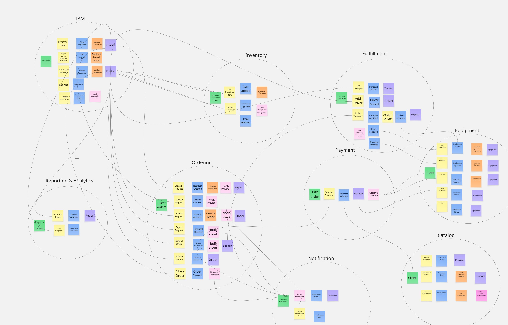
  
<em>Figura 4.1: Sesión de Event Storming realizada en Miro.</em>

#### 4.1.1.1. Candidate Context Discovery

A partir de la sesión de Event Storming se identificaron los siguientes contextos candidatos del dominio de FullTank, cada uno con una responsabilidad claramente delimitada dentro del proceso de abastecimiento de combustible:

1. **IAM (Identity and Access Management):** autenticación, autorización y gestión de credenciales dentro del sistema. Administra procesos como el registro de clientes y proveedores, inicio de sesión, recuperación de contraseñas y asignación de permisos según el rol. Su propósito es garantizar accesos seguros y controlados, asegurando que cada usuario interactúe únicamente con las funcionalidades que le corresponden dentro de la plataforma.

2. **Catalog:** gestión de la visualización y consulta de empresas proveedoras y los productos de combustible que ofrecen dentro del sistema. Su propósito es permitir que los solicitantes puedan explorar, comparar y evaluar diferentes opciones de combustible según disponibilidad, características y oferta de cada proveedor, facilitando así la toma de decisiones para seleccionar el producto más adecuado para sus equipos y operaciones.

3. **Ordering:** gestión del ciclo de vida de las solicitudes y órdenes realizadas por los clientes. Administra procesos como la creación de solicitudes, validación, aceptación o rechazo por parte del proveedor, generación de órdenes, despacho, confirmación de entrega y cierre del pedido. Su propósito es orquestar el flujo principal del negocio, asegurando que cada pedido siga un proceso claro, trazable y consistente desde su inicio hasta su finalización.

4. **Fulfillment:** gestión logística necesaria para cumplir con las órdenes generadas. Administra procesos como el registro de transportes y conductores, asignación de recursos a pedidos y ejecución del despacho. Su propósito es garantizar que la entrega del combustible se realice de manera eficiente, coordinando los recursos logísticos involucrados en la distribución.

5. **Payment:** gestión de los pagos asociados a las órdenes. Administra procesos como la solicitud de pago, registro de transacciones y aprobación del pago. Su propósito es asegurar que las operaciones económicas se realicen de manera confiable, validando que los pedidos cuenten con el respaldo financiero necesario antes de su ejecución o finalización.

6. **Notification:** generación y gestión de notificaciones dentro del sistema. Administra procesos como la creación de notificaciones y el seguimiento de su estado (leídas o no leídas). Su propósito es mantener informados a los usuarios sobre eventos relevantes, como cambios en el estado de pedidos, pagos o entregas, mejorando la comunicación dentro de la plataforma.

7. **Reporting & Analytics:** generación y visualización de reportes basados en la información del sistema. Administra procesos como la elaboración de reportes de ventas, consumo y métricas operativas. Su propósito es proporcionar información clave para la toma de decisiones, permitiendo analizar el comportamiento del negocio y optimizar sus procesos.

8. **Inventory:** gestión de los productos de combustible ofrecidos por los proveedores dentro del sistema. Administra procesos como el registro, actualización y eliminación de productos, así como la modificación de información relacionada con precios, disponibilidad y características del combustible. Su propósito es permitir que los proveedores mantengan actualizado su inventario, asegurando que los solicitantes puedan consultar ofertas vigentes y seleccionar el producto más adecuado para sus necesidades operativas.

9. **Equipment:** gestión y monitoreo de los equipos pertenecientes a los clientes o solicitantes dentro del sistema. Administra procesos como el registro y actualización de equipos, así como la visualización de su estado operativo y el nivel de combustible disponible en cada uno. Su propósito es permitir a los solicitantes supervisar sus hornos, maquinarias, tanques y otros equipos relacionados, facilitando el control del consumo de combustible y la planificación eficiente de sus operaciones.

#### 4.1.1.2. Domain Message Flows Modeling

Una vez definidos los contextos candidatos, el equipo modeló los flujos de mensajes del dominio que los conectan. Para cada flujo se identifican el comando que inicia la interacción, el evento de dominio que produce el contexto receptor y la política que reacciona a dicho evento, incluyendo los eventos de integración que cruzan los límites de cada contexto.

- **Registro y acceso:** un visitante registra su empresa (solicitante o proveedora) en *IAM*, que habilita la creación de pedidos en *Ordering*.
- **Ciclo de vida del pedido:** *Ordering* orquesta la creación de la solicitud, la aprobación o rechazo del pedido, el despacho, la confirmación de entrega y el cierre, coordinando al resto de contextos.
- **Validación financiera:** *Payment* valida que el monto total coincida con el precio del combustible solicitado antes de habilitar la aprobación de la orden en *Ordering*.
- **Logística y despacho:** *Fulfillment* asigna transporte y conductor a una orden aprobada y libera ambos recursos cuando la orden se cierra.
- **Actualización de inventario:** *Ordering* descuenta el stock en *Inventory* al cerrar las órdenes, y *Catalog* consume datos de *Inventory* para mostrar disponibilidad.
- **Comunicación transversal:** *Notification* reacciona a los cambios de estado de las órdenes, y *Reporting & Analytics* consume datos de órdenes cerradas para generar agregados analíticos.

#### 4.1.1.3. Bounded Context Canvases

A continuación se presenta el diagrama de cada *bounded context* identificado, elaborado durante la sesión de Event Storming:

1. **Bounded Context IAM**

  

2. **Bounded Context Catalog**

  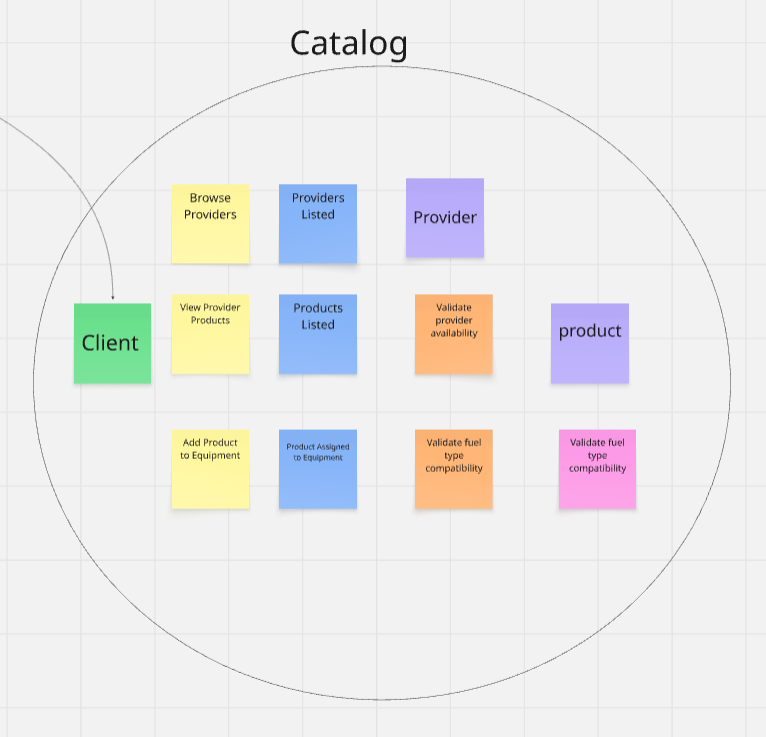

3. **Bounded Context Ordering**

  

4. **Bounded Context Fulfillment**

  

5. **Bounded Context Payment**

  

6. **Bounded Context Notification**

  

7. **Bounded Context Reporting & Analytics**

  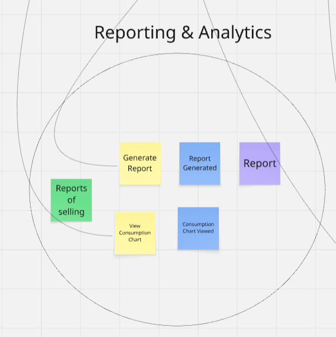

8. **Bounded Context Inventory**

  

9. **Bounded Context Equipment**

  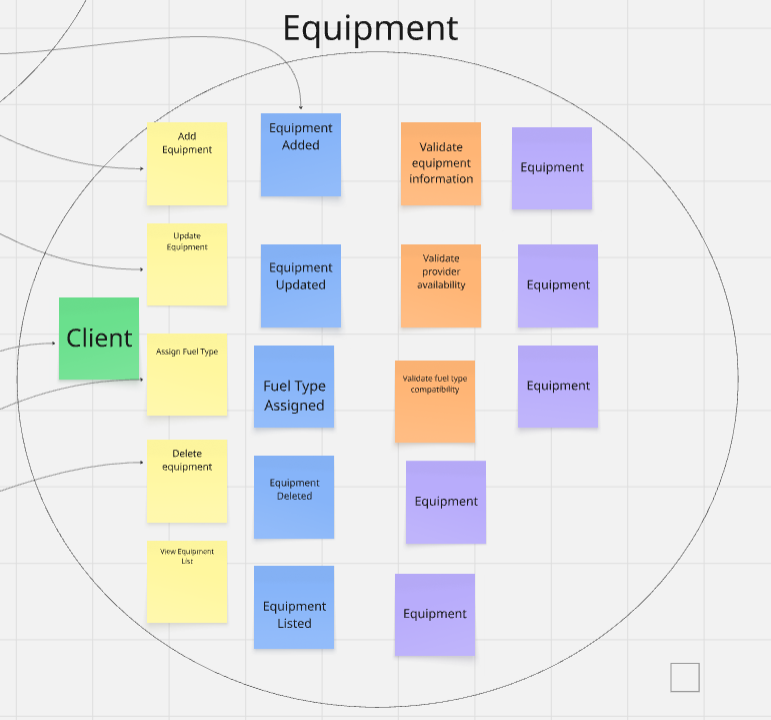

### 4.1.2. Context Mapping

El *Context Mapping* describe cómo se relacionan los *bounded contexts* identificados y qué dependencias existen entre ellos. El diagrama completo del backend muestra la organización de todos los *bounded contexts* como módulos independientes dentro del sistema, donde el *bounded context* de **Ordering** actúa como núcleo del sistema y coordina a los demás contextos mediante interfaces.

Las principales dependencias entre contextos incluyen:

- Verificación de pagos antes de aprobar órdenes (*Payment* → *Ordering*).
- Gestión y liberación de recursos logísticos (*Ordering* → *Fulfillment*).
- Validación y actualización de inventario (*Ordering* → *Inventory*).
- Lectura de disponibilidad y validación de compatibilidad de productos (*Catalog* → *Inventory* y *Equipment*).
- Generación de notificaciones ante cambios de estado (*Ordering* / *Fulfillment* → *Notification*).
- Alimentación de datos para reportes y análisis (*Ordering* → *Reporting & Analytics*).

Todas las interacciones entre *bounded contexts* se realizan a través de interfaces, evitando dependencias directas de implementación y favoreciendo el desacoplamiento.

### 4.1.3. Software Architecture

La arquitectura de software de FullTank se documenta mediante el **modelo C4**, que representa el sistema en cuatro niveles de abstracción: paisaje (Landscape), contexto (Context), contenedores (Container) y despliegue (Deployment). El sistema se concibe como una plataforma basada en servicios, con un backend que expone una API REST, un frontend web para los usuarios y una base de datos relacional que persiste la información del dominio.

#### 4.1.3.1. Software Architecture System Landscape Diagram

El **System Landscape Diagram** muestra el panorama general en el que se inserta FullTank, incluyendo a sus usuarios (empresas solicitantes y proveedores de combustible) y los sistemas externos con los que interactúa, como la plataforma de sensores IoT, la pasarela de pagos y el servicio de correo electrónico.

> *Diagrama por completar.*

#### 4.1.3.2. Software Architecture Context Level Diagrams

En este nivel se presenta una vista de alto nivel de la arquitectura, donde el foco está en el sistema de software **FullTank Platform** como una "caja negra" y en las interacciones que mantiene con sus usuarios y con otros sistemas externos.

El *context diagram* muestra al FullTank Platform como un recuadro central, rodeado por los principales actores y sistemas con los que se comunica:

- **Visitor:** usuario anónimo que navega la landing page para conocer la plataforma, revisar sus beneficios y registrarse en el sistema.
- **Client (Requester):** representante de una empresa que requiere combustible. Interactúa con la plataforma para explorar el catálogo de proveedores y sus productos, gestionar sus equipos (vehículos, generadores, maquinaria), crear solicitudes de abastecimiento, registrar pagos, hacer seguimiento de pedidos y confirmar entregas.
- **Provider:** representante de una empresa proveedora de combustible. Gestiona su inventario de productos, evalúa solicitudes entrantes, aprueba o rechaza pedidos, asigna recursos logísticos (transporte y conductores) y ejecuta despachos.
- **Email Service:** sistema externo encargado de enviar correos electrónicos, principalmente para la recuperación de contraseñas y notificaciones relacionadas a autenticación.
- **Cloud Storage:** sistema externo utilizado para almacenar comprobantes de pago (vouchers) cargados por los clientes.
- **PDF Generator Service:** sistema externo encargado de generar reportes en formato PDF, como resúmenes de consumo y ventas.

En el diagrama se representan las relaciones entre estos elementos, destacando que los usuarios (Visitor, Client y Provider) interactúan directamente con FullTank, mientras que el sistema se encarga de orquestar la comunicación con los servicios externos (correo, almacenamiento y generación de reportes). Esta vista permite comprender el alcance del sistema, sus límites de responsabilidad y el ecosistema en el que opera antes de entrar en detalles internos.

  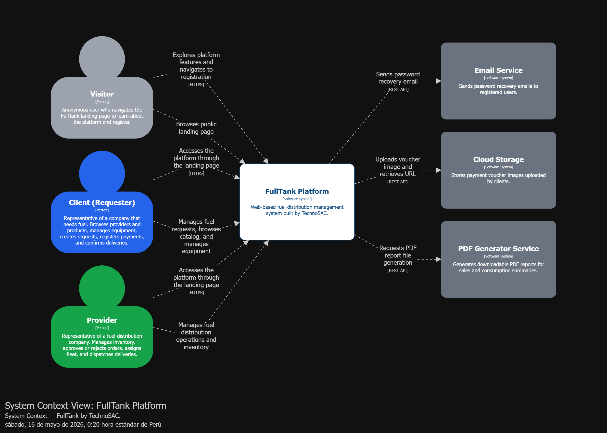
  
<em>Figura 4.2: Diagrama de contexto del sistema FullTank.</em>

#### 4.1.3.3. Software Architecture Container Level Diagrams

En el nivel de contenedores, la atención se centra en cómo se organiza internamente el sistema en aplicaciones y fuentes de datos. El *container diagram* muestra los elementos principales de la arquitectura de FullTank, sus responsabilidades y la forma en que se comunican entre sí y con sistemas externos.

La arquitectura lógica de FullTank se estructura en los siguientes contenedores:

- **Landing Page:** aplicación web estática que presenta la propuesta de valor del sistema, incluyendo secciones como descripción del servicio, beneficios, testimonios, precios, preguntas frecuentes y contacto. Está desarrollada con HTML, CSS y JavaScript, y orientada a usuarios no autenticados.
- **FullTank Web Application (SPA):** aplicación web principal desarrollada en Vue.js 3 con Pinia como gestor de estado y Vue Router para navegación protegida por roles. Es utilizada por clientes y proveedores para interactuar con el sistema. Del lado del cliente contiene módulos como catálogo de proveedores, gestión de equipos, solicitudes, pagos, reportes de consumo y notificaciones. Del lado del proveedor incluye módulos de inventario, gestión de órdenes, flota y despacho, reportes de ventas y listado de clientes.
- **FullTank API:** backend desarrollado en ASP.NET Core 8 con Entity Framework Core que expone una API REST. Centraliza la lógica de negocio, reglas de validación y orquestación de procesos, organizados en nueve *bounded contexts* del dominio: Identity & Access, Catalog, Equipment, Inventory, Ordering, Payment, Fulfillment, Notification y Reporting & Analytics.
- **MySQL Database:** base de datos relacional donde se almacena toda la información estructurada del sistema, incluyendo usuarios, proveedores, productos, equipos, solicitudes, órdenes, pagos, inventario, flota, despachos, notificaciones y reportes.

En el diagrama se observa que los usuarios acceden inicialmente a la Landing Page, desde donde pueden registrarse o ingresar a la aplicación principal. La Web Application (SPA) se comunica exclusivamente con la API mediante peticiones HTTPS utilizando formato JSON a través de un cliente HTTP centralizado (Axios) con interceptor JWT. La API persiste y consulta datos en la base de datos MySQL mediante Entity Framework Core. Adicionalmente, la API se integra con sistemas externos: Email Service para correos de recuperación de contraseña, Cloud Storage para almacenamiento de comprobantes de pago y PDF Generator Service para la generación de reportes descargables.

Esta vista permite entender la distribución de responsabilidades entre la capa de presentación (Landing Page y SPA), la capa de lógica de negocio (API) y la capa de persistencia (Database), así como las principales decisiones tecnológicas adoptadas.

  
  
<em>Figura 4.3: Diagrama de contenedores de FullTank.</em>

#### 4.1.3.4. Software Architecture Deployment Diagrams

El **Deployment Diagram** describe la distribución física de los contenedores en la infraestructura de despliegue, incluyendo los entornos de producción y desarrollo, los servicios de hosting de frontend y backend, la base de datos y los dispositivos IoT instalados en las instalaciones de las empresas solicitantes.

> *Diagrama por completar.*

## 4.2. Tactical-Level Domain-Driven Design

Esta sección documenta los bounded contexts **Notification** e **Inventory** con el formato utilizado en la rama `katherine`: tablas por capa, diagramas separados y evidencia runtime obtenida desde Swagger UI. La inspección se realizó sobre el código fuente existente, sin modificar el backend.

### 4.2.1. Bounded Context: Notification

| Elemento | Descripción |
| :------: | :---------: |
| Propósito | Centralizar las notificaciones internas que reciben los usuarios ante eventos relevantes de órdenes, entregas o pagos. |
| Actores | Compradores, proveedores y componentes autenticados que crean o consultan notificaciones. |
| Relación con otros contextos | Consulta la identidad del destinatario mediante IAM y conserva `referenceId` como referencia al evento externo, sin asumir el ciclo de vida de órdenes o usuarios. |

### 4.2.1.1. Domain Layer.

El core de Notification es el agregado raíz `Notification`. Su invariantes principal es que toda notificación nace como no leída (`read = false`) y solo el agregado puede cambiar ese estado mediante `markAsRead()`. El agregado recibe un comando de creación, conserva el destinatario, el tipo, el contenido y la referencia opcional al evento que originó la notificación.

|     Clase     |      Tipo      |                                  Propósito                                 |
| :-----------: | :------------: | :------------------------------------------------------------------------: |
| `Notification` | Aggregate Root | Gestiona el destinatario, tipo, título, mensaje, estado de lectura, referencia del evento y fecha de creación. Expone `markAsRead()` como comportamiento del dominio. |
| `NotificationType` | Value Object | Restringe los tipos de notificación soportados, como `NEW_REQUEST`, `ORDER_ACCEPTED`, `PAYMENT_COMPLETED` y `GENERAL`. |
| `CreateNotificationCommand` | Domain Command | Define los datos normalizados necesarios para crear una notificación dirigida a un usuario. |
| `MarkNotificationAsReadCommand` | Domain Command | Identifica la notificación cuyo estado debe cambiar a leído. |
| `GetNotificationByIdQuery` | Domain Query | Define la consulta de una notificación por su identificador. |
| `GetNotificationsByUserIdQuery` | Domain Query | Define la consulta de todas las notificaciones asociadas a un usuario. |
| `GetUnreadNotificationsByUserIdQuery` | Domain Query | Define la consulta de las notificaciones pendientes de lectura de un usuario. |
| `NotificationRepository` | Domain Repository | Expone el puerto de persistencia que utiliza el dominio sin depender de JPA o Spring Data. |

### 4.2.1.2. Interface Layer.

| Clase / Componente | Tipo | Propósito |
| :----------------: | :--: | :-------: |
| `NotificationsController` | REST Controller | Expone la API `/api/v1/notifications`: creación, consulta por id, consultas por usuario/compañía/proveedor y marcado como leído. También valida que la creación tenga exactamente un destinatario y aplica las reglas de acceso. |
| `CreateNotificationResource` | REST Resource (DTO) | Define el cuerpo JSON de entrada para crear una notificación. |
| `NotificationResource` | REST Resource (DTO) | Define la representación JSON que se devuelve al cliente. |
| `CreateNotificationCommandFromResourceAssembler` | Assembler / Transformer | Convierte el recurso HTTP de creación en `CreateNotificationCommand`. |
| `NotificationResourceFromEntityAssembler` | Assembler / Transformer | Convierte el agregado de dominio en `NotificationResource` para la respuesta HTTP. |

### 4.2.1.3. Application Layer.

| Clase / Componente | Tipo | Propósito |
| :----------------: | :--: | :-------: |
| `NotificationCommandService` | Command Service (Interface) | Define el contrato para crear notificaciones y marcar una notificación como leída. |
| `NotificationCommandServiceImpl` | Command Service Implementation | Construye el agregado, lo persiste, recupera notificaciones existentes y ejecuta `markAsRead()`. Devuelve un error de dominio cuando el identificador no existe. |
| `NotificationQueryService` | Query Service (Interface) | Define el contrato para consultar por id, usuario y estado de lectura. |
| `NotificationQueryServiceImpl` | Query Service Implementation | Ejecuta las consultas y delega el acceso de datos al puerto `NotificationRepository`. |

### 4.2.1.4. Infrastructure Layer.

| Clase / Componente | Tipo | Propósito |
| :----------------: | :--: | :-------: |
| `NotificationPersistenceEntity` | JPA Entity | Representa la tabla `notifications`; almacena el tipo como texto y el estado de lectura en `is_read`. |
| `NotificationPersistenceAssembler` | Assembler / Mapper | Convierte entre `Notification` y `NotificationPersistenceEntity`, manteniendo separado el modelo de dominio del modelo persistente. |
| `NotificationPersistenceRepository` | Spring Data JPA Repository | Ejecuta la persistencia y las consultas por usuario y por estado no leído. |
| `NotificationRepositoryImpl` | Repository Adapter | Implementa el puerto del dominio y conecta sus operaciones con Spring Data JPA. |

### 4.2.1.5. Bounded Context Software Architecture Component Level Diagrams.

### 4.2.1.6. Bounded Context Software Architecture Code Level Diagrams.

#### 4.2.1.6.1. Bounded Context Domain Layer Class Diagram.

### 4.2.1.7. Runtime Evidence.

| Operación | Resultado |
| :-------: | :-------: |
| Crear notificación | `201 Created` |
| Consultar por id, usuario y no leídas | `200 OK` |
| Marcar como leída | `200 OK` |
| Consultar no leídas después de marcar | `200 OK`, colección vacía |
| Acceso de proveedor al endpoint de comprador | `403 Forbidden` |
| Swagger sin token | `401 Unauthorized` |

### 4.2.2. Bounded Context: Inventory

| Elemento | Descripción |
| :------: | :---------: |
| Propósito | Administrar el catálogo de productos de combustible ofrecidos por proveedores y publicados para compradores. |
| Actores | Proveedores que crean y actualizan productos, y compradores que consultan el catálogo. |
| Relación con otros contextos | Valida identidad y propiedad mediante IAM; conserva `providerId` y puede ser referenciado por solicitudes u órdenes sin incorporar su lógica al agregado. |

### 4.2.2.1. Domain Layer.

El core de Inventory es el agregado raíz `FuelProduct`. Este agregado concentra los datos comerciales del producto y las operaciones que modifican su estado: creación, actualización general y actualización de stock. `active` se inicializa en `true` cuando el comando no lo especifica, de modo que el producto queda publicado por defecto; `update()` conserva su valor si la actualización no lo incluye.

|     Clase     |      Tipo      |                                  Propósito                                 |
| :-----------: | :------------: | :------------------------------------------------------------------------: |
| `FuelProduct` | Aggregate Root | Gestiona nombre, tipo de combustible, precio, unidad, stock disponible, capacidad, proveedor y estado de publicación. Expone `updateStock()` y `update()` como comportamiento del dominio. |
| `FuelType` | Value Object | Restringe los tipos de combustible válidos: diésel, gasolinas, GLP y GNV. |
| `CreateFuelProductCommand` | Domain Command | Define los datos iniciales de un producto de combustible. |
| `UpdateFuelProductCommand` | Domain Command | Define los datos editables del producto y su estado de publicación. |
| `UpdateFuelProductStockCommand` | Domain Command | Define el nuevo stock disponible para un producto existente. |
| `DeleteFuelProductCommand` | Domain Command | Identifica el producto que debe eliminarse. |
| `GetAllFuelProductsQuery` | Domain Query | Define la consulta del catálogo visible para compradores. |
| `GetFuelProductByIdQuery` | Domain Query | Define la consulta de un producto por identificador. |
| `GetFuelProductsByProviderIdQuery` | Domain Query | Define la consulta de productos pertenecientes a un proveedor. |
| `FuelProductRepository` | Domain Repository | Expone el puerto de persistencia que utiliza `FuelProduct` sin depender de la implementación JPA. |

### 4.2.2.2. Interface Layer.

| Clase / Componente | Tipo | Propósito |
| :----------------: | :--: | :-------: |
| `FuelProductsController` | REST Controller | Expone la API `/api/v1/fuel-products`: creación, consultas, actualización general, actualización de stock y eliminación. Valida el rol de comprador y la propiedad del proveedor antes de operar. |
| `CreateFuelProductResource` | REST Resource (DTO) | Define el cuerpo JSON de entrada para crear un producto. |
| `FuelProductResource` | REST Resource (DTO) | Define la representación JSON de un producto para el catálogo o el proveedor. |
| `UpdateFuelProductResource` | REST Resource (DTO) | Define los datos de actualización general del producto. |
| `UpdateFuelProductStockResource` | REST Resource (DTO) | Define el nuevo stock enviado por el cliente. |
| `CreateFuelProductCommandFromResourceAssembler` | Assembler / Transformer | Convierte el recurso HTTP de creación en `CreateFuelProductCommand`. |
| `UpdateFuelProductCommandFromResourceAssembler` | Assembler / Transformer | Convierte el recurso HTTP de actualización en `UpdateFuelProductCommand`. |
| `UpdateFuelProductStockCommandFromResourceAssembler` | Assembler / Transformer | Convierte el recurso HTTP de stock en `UpdateFuelProductStockCommand`. |
| `FuelProductResourceFromEntityAssembler` | Assembler / Transformer | Convierte el agregado de dominio en el recurso de respuesta. |

### 4.2.2.3. Application Layer.

| Clase / Componente | Tipo | Propósito |
| :----------------: | :--: | :-------: |
| `FuelProductCommandService` | Command Service (Interface) | Define el contrato para crear, actualizar stock, actualizar datos y eliminar productos. |
| `FuelProductCommandServiceImpl` | Command Service Implementation | Coordina los comandos, recupera el agregado antes de modificarlo, persiste los cambios y traduce inexistencia o conflictos de integridad a errores de aplicación. |
| `FuelProductQueryService` | Query Service (Interface) | Define el contrato para consultar por id, proveedor o colección completa. |
| `FuelProductQueryServiceImpl` | Query Service Implementation | Ejecuta las consultas y delega la recuperación al puerto `FuelProductRepository`. |

### 4.2.2.4. Infrastructure Layer.

| Clase / Componente | Tipo | Propósito |
|:--|:--|:--|
| `FuelProductPersistenceEntity` | JPA Entity | Representa la tabla `fuel_products` y persiste tipo, precio, stock, capacidad, proveedor y estado `active`. |
| `FuelProductPersistenceAssembler` | Assembler / Mapper | Convierte entre `FuelProduct` y `FuelProductPersistenceEntity`. |
| `FuelProductPersistenceRepository` | Spring Data JPA Repository | Ejecuta la persistencia y la consulta de productos por `providerId`. |
| `FuelProductRepositoryImpl` | Repository Adapter | Implementa el puerto del dominio y adapta sus operaciones a Spring Data JPA. |

### 4.2.2.5. Bounded Context Software Architecture Component Level Diagrams.

### 4.2.2.6. Bounded Context Software Architecture Code Level Diagrams.

#### 4.2.2.6.1. Bounded Context Domain Layer Class Diagram.

### 4.2.2.7. Runtime Evidence.

| Operación | Resultado |
| :-------: | :-------: |
| Crear producto | `201 Created` |
| Consultar por id y proveedor | `200 OK` |
| Actualizar stock y producto | `200 OK` |
| Eliminar producto | `204 No Content` |
| Consultar producto eliminado | `404 Not Found` |
| Acceso de proveedor al endpoint de comprador | `403 Forbidden` |
| Swagger sin token | `401 Unauthorized` |

La evidencia visual se conserva por módulo en `Report/assets/chapter-4/Bounded Context Evidence`. Las capturas de código/GitHub fueron retiradas; permanecen únicamente las capturas de Swagger y los diagramas UML y de componentes generados para estos bounded contexts.

#### 4.2.2.6. Bounded Context Software Architecture Code Level Diagrams.

Presenta los diagramas que descienden al nivel de código, contrastando el modelo de objetos del dominio con el diseño de la base de datos. Estos diagramas complementan al *Component Diagram* de la API Application y a los contenedores definidos, proporcionando una vista centrada en clases, relaciones y responsabilidades.

##### 4.2.2.6.1. Bounded Context Domain Layer Class Diagrams.

A nivel de clases se modelan, por un lado, las clases del frontend en función de los módulos y vistas que consumen los servicios expuestos por la API y, por otro, las clases del backend que reflejan la implementación detallada de los módulos definidos como componentes dentro de la API.

**Diagramas de clases del Frontend**

La aplicación web sigue una arquitectura modular basada en *bounded contexts*, donde cada contexto se organiza en packages independientes con las siguientes capas:

- **domain/model:** contiene las estructuras que representan los modelos de datos y value objects utilizados en la interfaz.
- **application:** incluye servicios de aplicación que coordinan la lógica necesaria para interactuar con el backend.
- **infrastructure/api:** encapsula las llamadas HTTP a la API mediante un cliente centralizado.
- **presentation:** agrupa las vistas y componentes de interfaz de usuario, así como los mecanismos de gestión de estado cuando es necesario compartir información entre múltiples vistas.

*Diagrama del Frontend completo:*

  

El diagrama completo del frontend muestra la organización general de la capa de presentación, incluyendo todos los *bounded contexts* agrupados en packages independientes, los mecanismos de gestión de estado global, el cliente HTTP centralizado con manejo de autenticación, y los componentes encargados de la protección de rutas según el rol del usuario autenticado. Cada vista se conecta a su servicio correspondiente, el cual interactúa con la capa de infraestructura para consumir los servicios REST del backend.

*Diagrama del Frontend dividido por contextos:*

- **Identity & Access Frontend** — Responsabilidad: maneja las vistas de registro, inicio de sesión, recuperación de contraseña y edición de perfil de usuario.

  

- **Catalog Frontend** — Responsabilidad: maneja las vistas de gestión del inventario de recursos ofrecidos por el proveedor.

  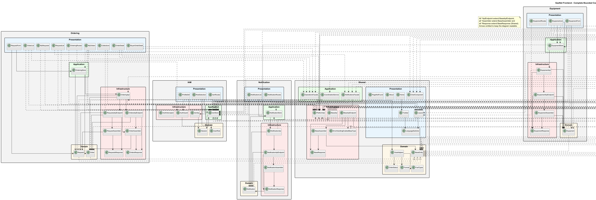

- **Ordering Frontend** — Responsabilidad: maneja las vistas del ciclo de vida completo de pedidos: creación de solicitudes, aprobación, rechazo, despacho, confirmación de entrega y cierre.

  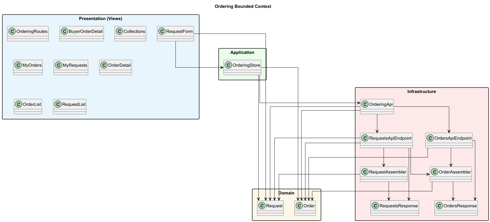

- **Payment Frontend** — Responsabilidad: maneja las vistas para que el cliente registre comprobantes de pago vinculados a una orden.

  

- **Fulfillment Frontend** — Responsabilidad: maneja las vistas de gestión de recursos logísticos (por ejemplo, vehículos y operadores) y la asignación de despacho a órdenes aprobadas.

  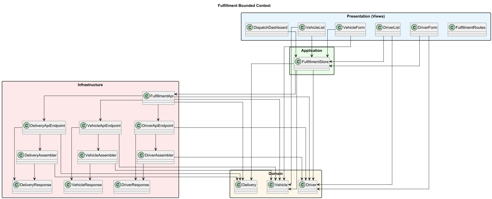

- **Notification Frontend** — Responsabilidad: maneja el panel de notificaciones dentro de la aplicación para informar a los usuarios sobre cambios en el estado de los pedidos.

  

- **Reporting & Analytics Frontend** — Responsabilidad: maneja las vistas de visualización de métricas, gráficos de consumo o ventas, y la descarga de reportes.

  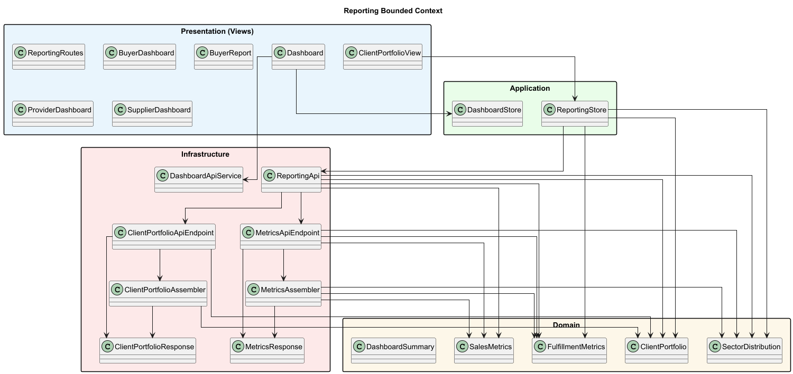

- **Equipment Frontend** — Responsabilidad: maneja las vistas para que el cliente registre, actualice, elimine y visualice sus equipos (vehículos, generadores, maquinaria), incluyendo el tipo de combustible requerido y el estado operativo de cada uno.

  

- **Inventory Frontend** — Responsabilidad: maneja las vistas de gestión del inventario de combustible por parte del proveedor, incluyendo el registro, actualización y eliminación de ítems, así como la visualización de niveles de stock y precio por litro.

  

**Diagramas de clases del Backend**

El sistema sigue una arquitectura por capas organizada por *bounded contexts*, donde cada contexto mantiene una clara separación de responsabilidades:

- **interfaces:** expone los endpoints del sistema (controladores REST) y componentes encargados de transformar datos entre modelos externos e internos.
- **domain:** contiene las entidades, agregados, value objects, así como comandos, consultas e interfaces que definen el comportamiento del dominio.
- **application:** implementa la lógica de negocio mediante servicios que ejecutan comandos y consultas.
- **infrastructure:** define los mecanismos de persistencia y comunicación con sistemas externos, incluyendo repositorios y servicios de integración.

*Diagrama del Backend completo:*

  

El diagrama completo del backend muestra la organización de todos los *bounded contexts* como módulos independientes dentro del sistema. Se visualizan las dependencias entre contextos, donde el *bounded context* de **Ordering** actúa como núcleo del sistema y coordina a los demás contextos mediante interfaces.

*Diagrama del Backend dividido por contextos:*

- **Identity & Access Backend** — Responsabilidad: gestiona el registro de usuarios, autenticación, autorización y control de acceso.

  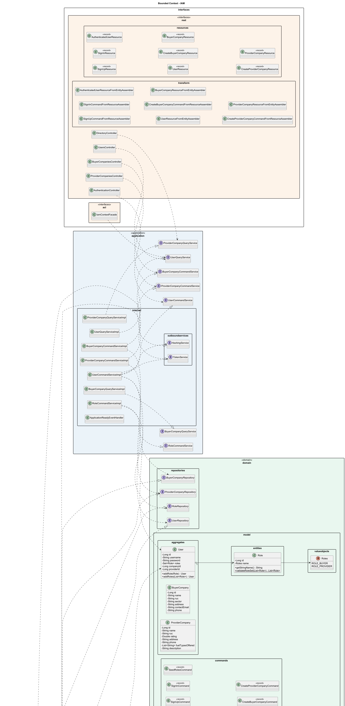

- **Catalog Backend** — Responsabilidad: gestiona el inventario de recursos disponibles, incluyendo stock y características relevantes.

  

- **Ordering Backend** — Responsabilidad: orquesta el ciclo de vida completo del pedido. Es el *bounded context* central que coordina la interacción con los demás contextos.

  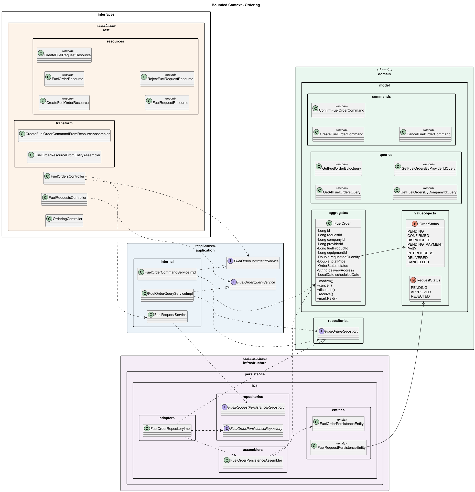

- **Payment Backend** — Responsabilidad: gestiona el registro y validación de pagos asociados a órdenes.

  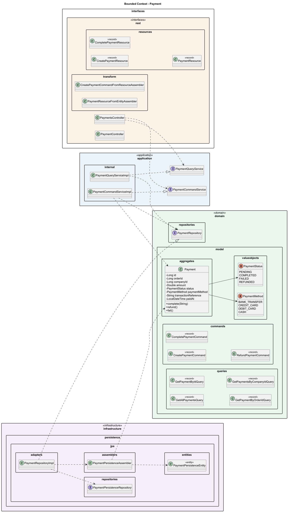

- **Fulfillment Backend** — Responsabilidad: gestiona los recursos necesarios para la ejecución de entregas y su asignación a órdenes.

  

- **Notification Backend** — Responsabilidad: genera y gestiona notificaciones ante eventos relevantes del sistema.

  

- **Reporting & Analytics Backend** — Responsabilidad: agrega información histórica para generar métricas, análisis y reportes.

  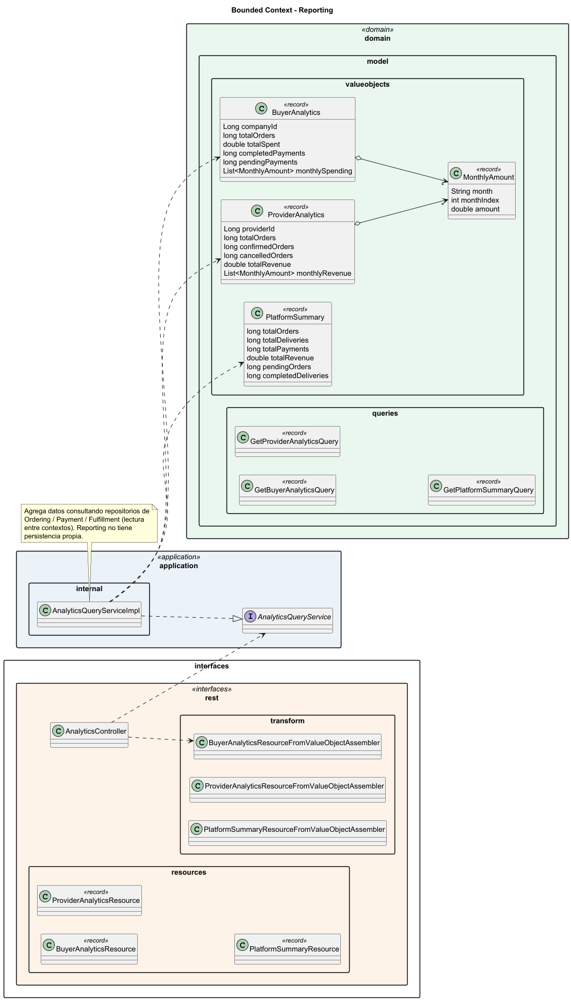

- **Equipment Backend** — Responsabilidad: gestiona el registro, actualización, eliminación y consulta de los equipos del cliente, así como la asignación del tipo de combustible requerido por cada equipo.

  

- **Inventory Backend** — Responsabilidad: gestiona el registro, actualización y eliminación de los productos de combustible del proveedor, validando la información del ítem y controlando los niveles de stock disponible y precio por litro.

  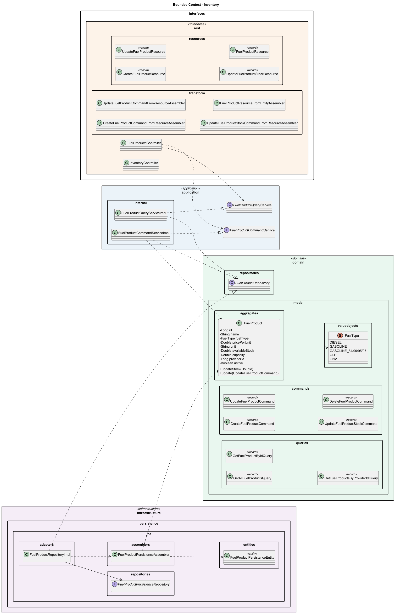

##### 4.2.2.6.2. Bounded Context Database Design Diagram.

La base de datos relacional almacena todos los datos del dominio del sistema. Las tablas se organizan en correspondencia directa con los *bounded contexts* definidos en el diseño orientado a objetos. A continuación, se detalla qué tablas pertenecen a cada contexto y cuál es su responsabilidad dentro del modelo de datos.

  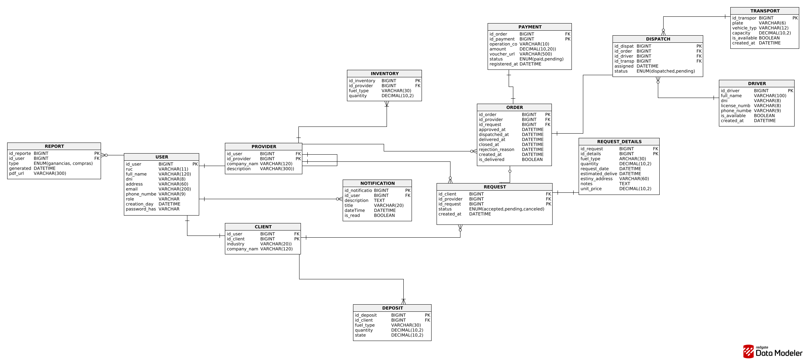
  
<em>Figura 4.5: Diagrama general de la base de datos de FullTank.</em>

**Identity & Access — Base de datos**

*Responsabilidad:* almacena la información de usuarios, sesiones y las extensiones de perfil para clientes y proveedores.

- **USER:** datos base del usuario autenticado (`id_user`, `ruc`, `full_name`, `dni`, `email`, `password_hash`, `phone_number`, `address`, `role`, `is_active`, `created_at`, `updated_at`).
- **CLIENT:** extensión del perfil para empresas solicitantes (`id_client`, `id_user` FK, `company_name`, `company_ruc`, `industry`, `created_at`).
- **PROVIDER:** extensión del perfil para empresas proveedoras (`id_provider`, `id_user` FK, `company_name`, `company_ruc`, `description`, `created_at`).

  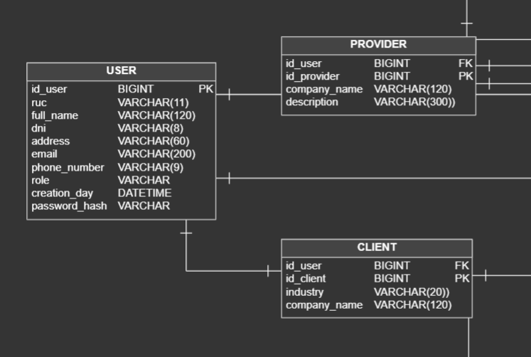

**Catalog — Base de datos**

*Responsabilidad:* almacena el inventario disponible de cada proveedor, incluyendo stock y características relevantes.

- **INVENTORY:** registro de stock por tipo de recurso (`id_inventory`, `id_provider` FK, `fuel_type`, `quantity_liters`, `price_per_liter`, `updated_at`).

  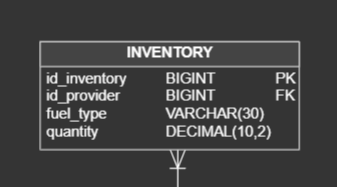

**Ordering — Base de datos**

*Responsabilidad:* almacena el ciclo de vida completo de solicitudes y órdenes, incluyendo el detalle de ítems y los cambios de estado.

- **REQUEST:** solicitud creada por el cliente (`id_request`, `id_client` FK, `id_provider` FK, `fuel_type`, `quantity_liters`, `delivery_address`, `requested_date`, `estimated_delivery`, `status`, `notes`, `created_at`).
- **REQUEST_DETAIL:** detalle del pedido con desglose de valores (`id_detail`, `id_request` FK, `fuel_type`, `quantity_liters`, `unit_price`, `subtotal`).
- **ORDER:** orden generada a partir de una solicitud aprobada (`id_order`, `id_request` FK, `status`, `approved_at`, `dispatched_at`, `delivered_at`, `closed_at`, `rejection_reason`, `created_at`).

  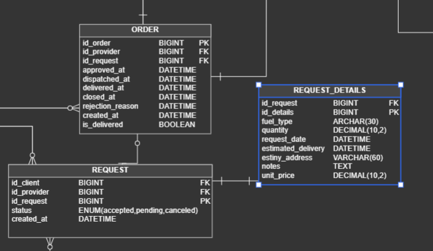

**Payment — Base de datos**

*Responsabilidad:* almacena los registros de pago asociados a las órdenes.

- **PAYMENT:** comprobante de pago vinculado a una orden (`id_payment`, `id_order` FK, `operation_code`, `amount`, `bank_name`, `voucher_url`, `payment_date`, `status`, `registered_at`).

  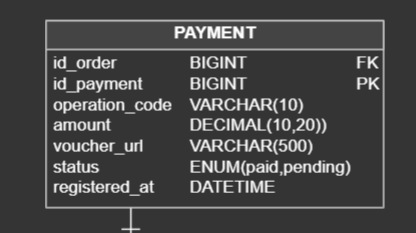

**Fulfillment — Base de datos**

*Responsabilidad:* almacena los recursos logísticos y su asignación a órdenes.

- **TRANSPORT:** recurso de transporte del proveedor (`id_transport`, `id_provider` FK, `plate`, `vehicle_type`, `capacity_liters`, `is_available`, `created_at`).
- **DRIVER:** operador asignado al transporte (`id_driver`, `id_provider` FK, `full_name`, `dni`, `license_number`, `phone_number`, `is_available`, `created_at`).
- **DISPATCH:** asignación de recursos a una orden (`id_dispatch`, `id_order` FK, `id_transport` FK, `id_driver` FK, `assigned_at`, `status`).

  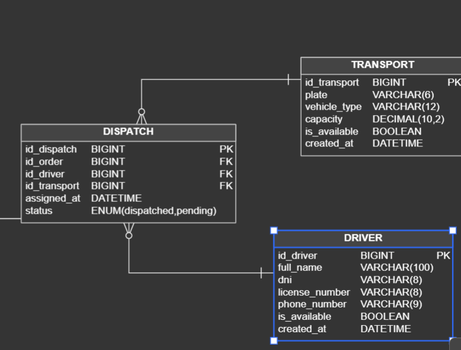

**Notification — Base de datos**

*Responsabilidad:* almacena las notificaciones generadas por eventos del sistema.

- **NOTIFICATION:** notificación asociada a un usuario (`id_notification`, `id_user` FK, `id_order` FK, `type`, `message`, `is_read`, `created_at`).

  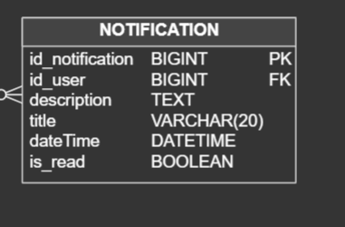

**Reporting & Analytics — Base de datos**

*Responsabilidad:* almacena la información de reportes generados a partir de datos históricos.

- **REPORT:** reporte generado por un usuario (`id_report`, `id_user` FK, `type`, `pdf_url`, `generated_at`).

  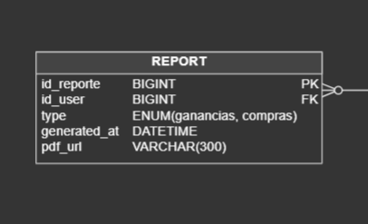

### 4.2.8. Bounded Context: Payment

### 4.2.8.1. Domain Layer.

|     Clase     |      Tipo      |                                  Propósito                                 |
|:-------------:|:--------------:|:--------------------------------------------------------------------------:|
|    Payment    | Aggregate Root | Entidad principal que gestiona la información del pago y su ciclo de vida. |
| PaymentStatus |  Value Object  |                 Representar los estados posibles del pago.                 |
| PaymentMethod |  Value Object  |           Identificar el método utilizado para realizar el pago.           |

### 4.2.8.2. Interface Layer.

|          Clase          |       Tipo      |                                                     Propósito                                                    |
|:-----------------------:|:---------------:|:----------------------------------------------------------------------------------------------------------------:|
|      PaymentStatus      | REST Controller |              Exponer los endpoints HTTP para gestionar la creación, estado y consulta de los pagos.              |
| CompletePaymentResource |   DTO (Record)  |      Representar los datos de entrada requeridos por el cliente para solicitar la creación de un nuevo pago.     |
| CreatePaymentResource   | DTO (Record)    | Representar el dato enviado por el cliente necesario para marcar un pago como completado.                        |
| PaymentResource         | DTO (Record)    | Representar los datos de salida con la información detallada del pago que se devuelve como respuesta al cliente. |

### 4.2.8.3. Application Layer.

|           Clase           |       Tipo      |                                                     Propósito                                                     |
|:-------------------------:|:---------------:|:-----------------------------------------------------------------------------------------------------------------:|
|   PaymentCommandService   |    Interface    |                      Definir los casos de uso para las operaciones que modifican información.                     |
| PaymentCommandServiceImpl | Command Handler | Implementar la lógica real que ejecuta las operaciones de modificación coordinando el dominio y la base de datos. |
| PaymentQueryService       | Interface       | Definir los casos de uso para las operaciones de solo lectura.                                                    |
| PaymentQueryServiceImpl   | Command Handler | Implementar la lógica para ejecutar las consultas y devolver la información de los pagos sin alterar ningún dato. |

### 4.2.8.4. Infrastructure Layer.

|             Clase            |            Tipo            |                                                              Propósito                                                             |
|:----------------------------:|:--------------------------:|:----------------------------------------------------------------------------------------------------------------------------------:|
|     PaymentRepositoryImpl    |     Repository Adapter     |                         Actúa como un adaptador que conecta las operaciones de negocio con Spring Data JPA.                        |
| PaymentPersistenceAssembler  |     Assembler / Mapper     | Funciona como un traductor bidireccional, transformando los objetos del modelo de dominio a entidades de persistencia y viceversa. |
| PaymentPersistenceEntity     | JPA Entity                 | Representa la estructura de la tabla payments en la base de datos relacional.                                                      |
| PaymentPersistenceRepository | Spring Data JPA Repository | Encargada de ejecutar las consultas SQL automáticas y personalizadas directamente sobre la base de datos.                          |

### 4.2.8.5. Bounded Context Software Architecture Component Level Diagrams.

### 4.2.8.6. Bounded Context Software Architecture Code Level Diagrams.

### 4.2.8.6.1. Bounded Context Domain Layer Class Diagrams.

### 4.2.8.6.2. Bounded Context Database Design Diagram.

### 4.2.9. Bounded Context: Reporting

### 4.2.9.1. Domain Layer.

|           Clase           |     Tipo     |                                             Propósito                                             |
|:-------------------------:|:------------:|:-------------------------------------------------------------------------------------------------:|
|   GetBuyerAnalyticsQuery  | Domain Query |  Define la estructura de la consulta para solicitar las analíticas y métricas de los compradores. |
| GetPlatformSummaryQuery   | Domain Query |  Define la estructura de la consulta para obtener el resumen general del estado de la plataforma. |
| GetProviderAnalyticsQuery | Domain Query | Define la estructura de la consulta para solicitar las analíticas y métricas de los proveedores.  |
| BuyerAnalytics            | Value Object | Modela los datos de valor inmutables que representan las analíticas consolidadas de un comprador. |
| MonthlyAmount             | Value Object | Modela los montos monetarios agrupados por periodo mensual para reportes y estadísticas.          |
| PlatformSummary           | Value Object | Modela los indicadores y datos globales que componen el resumen general de la plataforma.         |
| ProviderAnalytics         | Value Object | Modela los datos de valor inmutables que representan las analíticas y métricas de un proveedor.   |

### 4.2.9.2. Interface Layer.

|                       Clase                       |       Tipo      |                                                       Propósito                                                      |
|:-------------------------------------------------:|:---------------:|:--------------------------------------------------------------------------------------------------------------------:|
|                AnalyticsController                | REST Controller |       Expone los endpoints HTTP para gestionar y recibir las solicitudes de consulta de analíticas y resúmenes.      |
|               BuyerAnalyticsResource              |  REST Resource  |            Define la estructura de datos JSON que se expone al cliente para las analíticas de compradores.           |
|              PlatformSummaryResource              |  REST Resource  |         Define la estructura de datos JSON que se expone al cliente para el resumen general de la plataforma.        |
|             ProviderAnalyticsResource             |  REST Resource  |            Define la estructura de datos JSON que se expone al cliente para las analíticas de proveedores.           |
|   BuyerAnalyticsResourceFromValueObjectAssembler  |    Assembler    |    Convierte el objeto de valor del dominio (BuyerAnalytics) al recurso de presentación (BuyerAnalyticsResource).    |
|  PlatformSummaryResourceFromValueObjectAssembler  |    Assembler    |   Convierte el objeto de valor del dominio (PlatformSummary) al recurso de presentación (PlatformSummaryResource).   |
| ProviderAnalyticsResourceFromValueObjectAssembler |    Assembler    | Convierte el objeto de valor del dominio (ProviderAnalytics) al recurso de presentación (ProviderAnalyticsResource). |

### 4.2.9.3. Application Layer.

|           Clase           |             Tipo             |                                                           Propósito                                                          |
|:-------------------------:|:----------------------------:|:----------------------------------------------------------------------------------------------------------------------------:|
|   AnalyticsQueryService   |         Query Service        | Define el contrato de los servicios de consulta para coordinar el procesamiento de las solicitudes de reportes y analíticas. |
| AnalyticsQueryServiceImpl | Query Service Implementation | Implementa la lógica de negocio descrita por el contrato para procesar y resolver las consultas de analíticas en el sistema. |

### 4.2.9.5. Bounded Context Software Architecture Component Level Diagrams.

### 4.2.9.6. Bounded Context Software Architecture Code Level Diagrams.
### 4.2.9.6.1. Bounded Context Domain Layer Class Diagrams.

