# Capítulo IV: Solution Software Design

El presente capítulo describe el diseño de la solución de software de **FullTank**, elaborado por la startup **PrimeFuel**, aplicando los principios de **Domain-Driven Design (DDD)** y el modelo **C4** para la documentación de la arquitectura. El cliente principal del sistema es el **Distribuidor Logístico de Combustible**; el comprador asociado participa mediante un dispositivo IoT instalado en su tanque. Por ello, el flujo arquitectónico inicia en una lectura de nivel bajo y continúa con la generación idempotente del pedido, la aceptación del distribuidor, la asignación automática de conductor y cisterna, el despacho, la telemetría, el control de válvulas y el cierre de la entrega. El diseño se organiza en dos niveles complementarios: un nivel **estratégico**, donde se delimita el dominio, se descubren los *bounded contexts* y se establecen sus relaciones; y un nivel **táctico**, donde cada contexto se detalla en sus capas de dominio, interfaz, aplicación e infraestructura, junto con sus diagramas de componentes y de código.

## 4.1. Strategic-Level Domain-Driven Design

En este nivel se realiza la descomposición estratégica del dominio de negocio del abastecimiento de combustible. Partiendo de los hallazgos del *Big Picture EventStorming* (Sección 2.4) y del *Ubiquitous Language* (Sección 2.5), el equipo aplica un *Design-Level EventStorming* para identificar los contextos delimitados, modelar los flujos de mensajes entre ellos y definir sus relaciones mediante un *Context Mapping*, para finalmente representar la arquitectura del sistema a nivel de paisaje, contexto, contenedores y despliegue.

### 4.1.1. Design-Level EventStorming

Para identificar los eventos de dominio, es recomendable realizar una sesión de Event Storming. Esta técnica permite visualizar y comprender el flujo de eventos dentro del dominio, facilitando la identificación de los Bounded Context.

El desarrollo del proceso de Domain-Driven Design se realizó en la aplicación Miro: https://miro.com/app/board/uXjVGgOzeI4=/?share_link_id=421094077860

<div align="center">
  
  <p><em>Figura 4.1: Sesión de Event Storming realizada en Miro.</em></p>
</div>

#### 4.1.1.1. Candidate Context Discovery

A partir de la sesión de Event Storming se identificaron los siguientes contextos candidatos del dominio de FullTank, cada uno con una responsabilidad claramente delimitada dentro del proceso de abastecimiento de combustible:

1. **IAM (Identity and Access Management):** autenticación, autorización y gestión de credenciales dentro del sistema. Administra procesos como el registro de clientes y proveedores, inicio de sesión, recuperación de contraseñas y asignación de permisos según el rol. Su propósito es garantizar accesos seguros y controlados, asegurando que cada usuario interactúe únicamente con las funcionalidades que le corresponden dentro de la plataforma.

2. **Catalog:** gestión de los productos y condiciones de abastecimiento que el distribuidor ofrece a sus compradores asociados. Su propósito es validar el tipo de combustible, las unidades de medida y las condiciones que debe cumplir una solicitud generada por el tanque IoT.

3. **Ordering:** gestión del ciclo de vida de las solicitudes y órdenes iniciadas por eventos IoT o por una operación de contingencia. Administra la validación del nivel, la generación idempotente de solicitudes, la aceptación o rechazo por parte del distribuidor, la creación de órdenes, el despacho, la confirmación y el cierre. Su propósito es orquestar el flujo principal del negocio desde el evento `LowFuelLevelDetected` hasta la entrega.

4. **Fulfillment:** gestión logística necesaria para cumplir con las órdenes generadas. Administra el registro de cisternas y conductores, la validación de capacidad, compatibilidad, habilitación y disponibilidad, la recomendación automática de recursos y la ejecución del despacho. Su propósito es garantizar que cada pedido sea asignado a recursos válidos antes de iniciar la entrega.

5. **Payment:** gestión de los pagos asociados a las órdenes. Administra procesos como la solicitud de pago, registro de transacciones y aprobación del pago. Su propósito es asegurar que las operaciones económicas se realicen de manera confiable, validando que los pedidos cuenten con el respaldo financiero necesario antes de su ejecución o finalización.

6. **Notification:** generación y gestión de notificaciones dentro del sistema. Administra procesos como la creación de notificaciones y el seguimiento de su estado (leídas o no leídas). Su propósito es mantener informados a los usuarios sobre eventos relevantes, como cambios en el estado de pedidos, pagos o entregas, mejorando la comunicación dentro de la plataforma.

7. **Reporting & Analytics:** generación y visualización de reportes basados en la información del sistema. Administra procesos como la elaboración de reportes de ventas, consumo y métricas operativas. Su propósito es proporcionar información clave para la toma de decisiones, permitiendo analizar el comportamiento del negocio y optimizar sus procesos.

8. **Inventory:** gestión de los productos de combustible ofrecidos por los distribuidores dentro del sistema. Administra procesos como el registro, actualización y eliminación de productos, así como la disponibilidad que debe validar el distribuidor antes de aceptar una solicitud IoT.

9. **Equipment e IoT Tank Monitoring:** gestión de los tanques asociados y de los dispositivos IoT instalados en ellos. Administra el registro del dispositivo, la configuración del umbral, la recepción de lecturas, la validación de la asociación tanque-comprador y la emisión del evento `LowFuelLevelDetected`. Su propósito es iniciar de forma confiable el pedido automático que será procesado por Ordering.

La delimitación estratégica establece que **Equipment e IoT Tank Monitoring** es el contexto iniciador, **Ordering** es el núcleo transaccional, **Fulfillment** resuelve la asignación de recursos y el despacho, y **Notification**, **Reporting & Analytics** y **IAM** actúan como capacidades transversales. La telemetría de la cisterna y el control de válvulas se consideran capacidades de seguridad y trazabilidad vinculadas a Fulfillment, no funcionalidades aisladas de seguimiento GPS.

#### 4.1.1.2. Domain Message Flows Modeling

Una vez definidos los contextos candidatos, el equipo modeló los flujos de mensajes del dominio que los conectan. Para cada flujo se identifican el comando que inicia la interacción, el evento de dominio que produce el contexto receptor y la política que reacciona a dicho evento, incluyendo los eventos de integración que cruzan los límites de cada contexto.

- **Asociación del tanque:** un distribuidor registra al comprador asociado, el tanque y el dispositivo en *IAM* y *Equipment e IoT Tank Monitoring*. La configuración del umbral queda vinculada al dispositivo y al producto.
- **Inicio automático:** el dispositivo publica una lectura; cuando el nivel es igual o inferior al umbral, *Equipment e IoT Tank Monitoring* emite `LowFuelLevelDetected`. Una política de integración solicita a *Ordering* crear una solicitud idempotente.
- **Ciclo de vida del pedido:** *Ordering* valida comprador, producto, volumen, punto de entrega y distribuidor asociado; notifica la solicitud, registra la aceptación o rechazo y crea la orden atendible.
- **Asignación de recursos:** *Fulfillment* recibe `OrderAccepted`, consulta la capacidad y disponibilidad de cisternas y conductores y devuelve una recomendación válida. La confirmación de la asignación publica `ResourcesAssigned`.
- **Despacho seguro:** *Fulfillment* inicia el viaje y correlaciona telemetría, geocerca y estado de válvula. Una política permite o bloquea la descarga y publica `DeliveryDispatched`, `ValveOpeningAuthorized` o `ValveOpeningBlocked`.
- **Cierre y trazabilidad:** la recepción publica `CargoReceived`; *Ordering* cierra la orden, *Notification* informa a las partes y *Reporting & Analytics* conserva los indicadores de tiempo, volumen, capacidad y excepciones.
- **Validación financiera:** *Payment* valida que el monto total coincida con el precio del combustible solicitado antes de habilitar la aprobación de la orden en *Ordering*.
- **Actualización de inventario:** *Ordering* descuenta el stock en *Inventory* al cerrar las órdenes, y *Catalog* consume datos de *Inventory* para mostrar disponibilidad.
- **Comunicación transversal:** *Notification* reacciona a eventos de nivel, aceptación, asignación, alerta y entrega; *Reporting & Analytics* consume la bitácora completa para generar indicadores operativos y de trazabilidad.

#### 4.1.1.3. Bounded Context Canvases

A continuación se presenta el diagrama de cada *bounded context* identificado, elaborado durante la sesión de Event Storming:

1. **Bounded Context IAM**

<div align="center">
  
</div>

2. **Bounded Context Catalog**

<div align="center">
  
</div>

3. **Bounded Context Ordering**

<div align="center">
  
</div>

4. **Bounded Context Fulfillment**

<div align="center">
  
</div>

5. **Bounded Context Payment**

<div align="center">
  
</div>

6. **Bounded Context Notification**

<div align="center">
  
</div>

7. **Bounded Context Reporting & Analytics**

<div align="center">
  
</div>

8. **Bounded Context Inventory**

<div align="center">
  
</div>

9. **Bounded Context Equipment**

<div align="center">
  
</div>

### 4.1.2. Context Mapping

El *Context Mapping* describe cómo se relacionan los *bounded contexts* identificados y qué dependencias existen entre ellos. El diagrama completo del backend muestra la organización de todos los *bounded contexts* como módulos independientes dentro del sistema. En el flujo actualizado, **Equipment e IoT Tank Monitoring** inicia la interacción mediante eventos de nivel, **Ordering** actúa como núcleo transaccional y **Fulfillment** determina los recursos de transporte y ejecuta el despacho.

Las principales dependencias entre contextos incluyen:

- Publicación de lecturas y eventos de nivel bajo (*Equipment e IoT Tank Monitoring* → *Ordering*).
- Validación de comprador, producto, volumen y distribuidor asociado (*Ordering* → *Catalog* / *Inventory*).
- Solicitud de aceptación y emisión de `OrderAccepted` o `OrderRejected` (*Ordering* → *Notification*).
- Recomendación y confirmación de conductor y cisterna (*Ordering* → *Fulfillment*).
- Telemetría de cisterna, geocerca y autorización de válvula (*Fulfillment* → *Notification* / *Reporting & Analytics*).
- Verificación de pagos antes de liberar la orden cuando el modelo comercial lo requiera (*Payment* → *Ordering*).
- Alimentación de datos de pedidos, asignaciones, lecturas y entregas para reportes (*Ordering* / *Fulfillment* → *Reporting & Analytics*).

Todas las interacciones entre *bounded contexts* se realizan a través de interfaces, evitando dependencias directas de implementación y favoreciendo el desacoplamiento.

### 4.1.3. Software Architecture

La arquitectura de software de FullTank se documenta mediante el **modelo C4**, que representa el sistema en cuatro niveles de abstracción: paisaje (Landscape), contexto (Context), contenedores (Container) y despliegue (Deployment). El sistema se concibe como una plataforma basada en servicios, con un backend que expone una API REST, un frontend web para los usuarios y una base de datos relacional que persiste la información del dominio.

#### 4.1.3.1. Software Architecture System Landscape Diagram

El **System Landscape Diagram** muestra el panorama general en el que se inserta FullTank, incluyendo al Distribuidor Logístico de Combustible como cliente principal, al comprador asociado como usuario del tanque instrumentado y los sistemas externos con los que interactúa, como el dispositivo IoT, la pasarela de pagos y el servicio de correo electrónico.

<div align="center">
  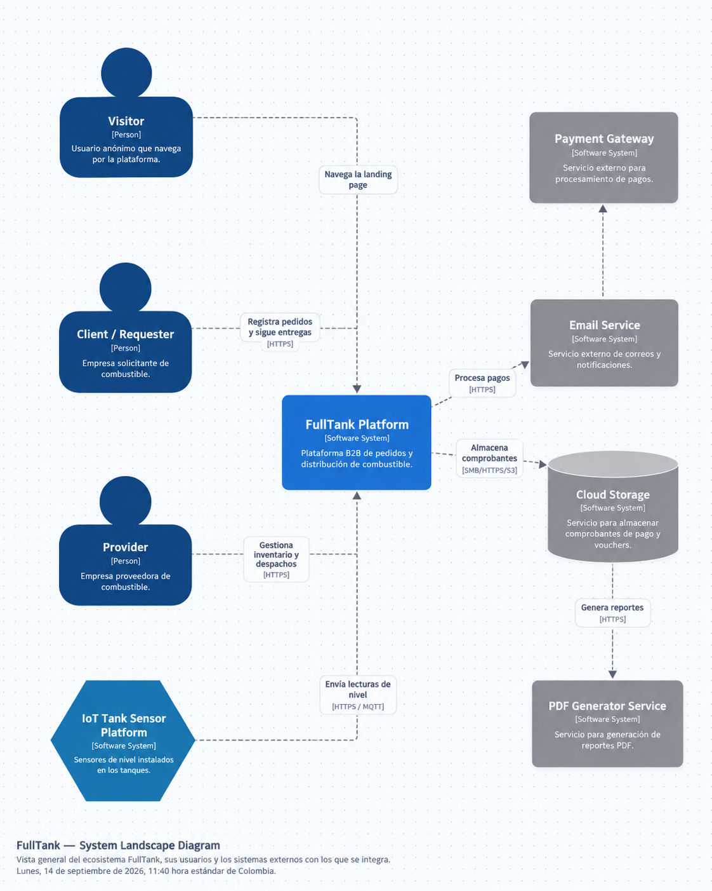
</div>

#### 4.1.3.2. Software Architecture Context Level Diagrams

En este nivel se presenta una vista de alto nivel de la arquitectura, donde el foco está en el sistema de software **FullTank Platform** como una "caja negra" y en las interacciones que mantiene con sus usuarios y con otros sistemas externos.

El *context diagram* muestra al FullTank Platform como un recuadro central, rodeado por los principales actores y sistemas con los que se comunica:

- **Visitor:** usuario anónimo que navega la landing page para conocer la plataforma, revisar sus beneficios y registrarse en el sistema.
- **Associated Buyer:** representante de la empresa compradora cuyo tanque tiene instalado el dispositivo IoT. Consulta el nivel, el pedido generado y el estado de la entrega, y puede confirmar la recepción.
- **Fuel Distributor:** representante del Distribuidor Logístico de Combustible. Administra compradores asociados, acepta o rechaza solicitudes, mantiene la flota, revisa recomendaciones de conductor y cisterna, supervisa el despacho y consulta la trazabilidad.
- **Tank IoT Device:** dispositivo externo que transmite el nivel del tanque y otros datos configurados. Su evento `LowFuelLevelDetected` inicia el flujo de solicitud en FullTank.
- **Email Service:** sistema externo encargado de enviar correos electrónicos, principalmente para la recuperación de contraseñas y notificaciones relacionadas a autenticación.
- **Cloud Storage:** sistema externo utilizado para almacenar comprobantes de pago (vouchers) cargados por los clientes.
- **PDF Generator Service:** sistema externo encargado de generar reportes en formato PDF, como resúmenes de consumo y ventas.

En el diagrama se representan las relaciones entre estos elementos, destacando que los usuarios (Visitor, Client y Provider) interactúan directamente con FullTank, mientras que el sistema se encarga de orquestar la comunicación con los servicios externos (correo, almacenamiento y generación de reportes). Esta vista permite comprender el alcance del sistema, sus límites de responsabilidad y el ecosistema en el que opera antes de entrar en detalles internos.

<div align="center">
  
  <p><em>Figura 4.2: Diagrama de contexto del sistema FullTank.</em></p>
</div>

#### 4.1.3.3. Software Architecture Container Level Diagrams

En el nivel de contenedores, la atención se centra en cómo se organiza internamente el sistema en aplicaciones y fuentes de datos. El *container diagram* muestra los elementos principales de la arquitectura de FullTank, sus responsabilidades y la forma en que se comunican entre sí y con sistemas externos.

La arquitectura lógica de FullTank se estructura en los siguientes contenedores:

- **Landing Page:** aplicación web estática que presenta la propuesta de valor del sistema, incluyendo secciones como descripción del servicio, beneficios, testimonios, precios, preguntas frecuentes y contacto. Está desarrollada con HTML, CSS y JavaScript, y orientada a usuarios no autenticados.
- **FullTank Web Application (SPA):** aplicación web principal desarrollada en Vue.js 3 con Pinia como gestor de estado y Vue Router para navegación protegida por roles. El distribuidor utiliza módulos de tanques asociados, solicitudes IoT, aceptación, asignación de flota, despachos, telemetría, alertas y reportes; el comprador asociado consulta el nivel, el estado del pedido y la entrega.
- **FullTank API:** backend desarrollado en ASP.NET Core 8 con Entity Framework Core que expone una API REST. Centraliza la lógica de negocio, reglas de validación y orquestación de procesos, organizados en los *bounded contexts* de IAM, Equipment e IoT Tank Monitoring, Ordering, Inventory, Catalog, Fulfillment, Notification, Payment y Reporting & Analytics.
- **IoT Gateway and Device Ingestion:** componente encargado de recibir lecturas del dispositivo del tanque, validar identidad, normalizar unidades, almacenar temporalmente los mensajes y publicar eventos idempotentes como `LowFuelLevelDetected` hacia la API o el broker de mensajería.
- **MySQL Database and Telemetry Store:** la base relacional conserva usuarios, compradores, tanques, pedidos, órdenes, asignaciones, flota, despachos, notificaciones y reportes. Las lecturas de nivel, ubicación, válvulas y eventos de entrega se conservan en un almacenamiento de telemetría o en tablas particionadas por dispositivo y viaje.

En el diagrama se observa que los usuarios acceden inicialmente a la Landing Page, desde donde pueden registrarse o ingresar a la aplicación principal. La Web Application (SPA) se comunica con la API mediante HTTPS y JSON a través de Axios con interceptor JWT. El dispositivo IoT del tanque transmite a través del gateway y un canal seguro; la API valida la identidad del dispositivo y procesa `LowFuelLevelDetected` de forma idempotente antes de crear la solicitud en Ordering. La API persiste datos transaccionales en MySQL y telemetría en el almacenamiento de eventos. Adicionalmente, se integra con Email Service, Cloud Storage, PDF Generator Service y, cuando corresponda, un broker MQTT sobre TLS.

Esta vista permite entender la distribución de responsabilidades entre la capa de presentación (Landing Page y SPA), la capa de lógica de negocio (API) y la capa de persistencia (Database), así como las principales decisiones tecnológicas adoptadas.

<div align="center">
  
  <p><em>Figura 4.3: Diagrama de contenedores de FullTank.</em></p>
</div>

#### 4.1.3.4. Software Architecture Deployment Diagrams

El **Deployment Diagram** describe la distribución física de los contenedores en la infraestructura de despliegue, incluyendo los entornos de producción y desarrollo, los servicios de hosting de frontend y backend, la base de datos, el gateway de ingestión y los dispositivos IoT instalados en los tanques de los compradores asociados. El dispositivo debe poder almacenar lecturas durante una interrupción temporal y reenviarlas de manera idempotente cuando recupere la conectividad.

<div align="center">
  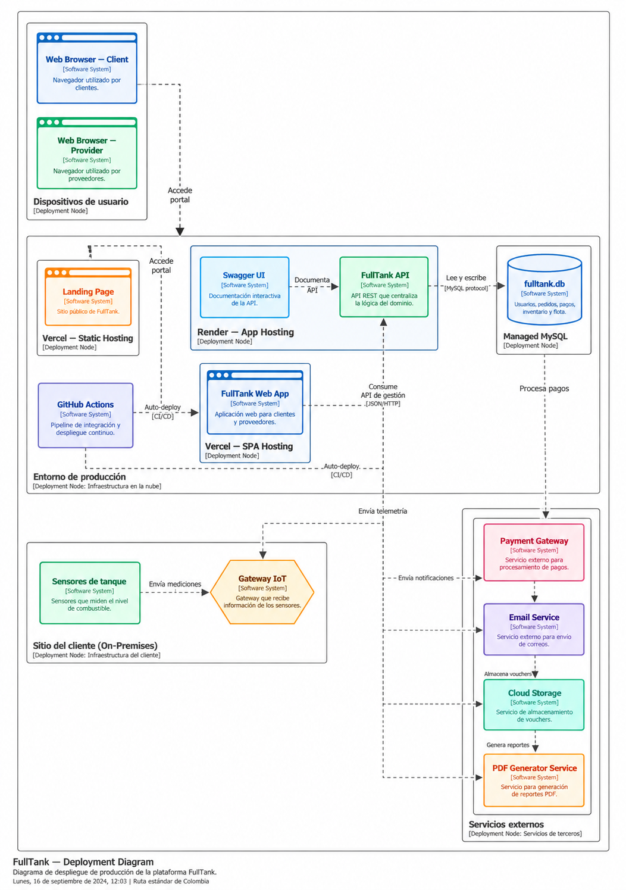
</div>

## 4.2. Tactical-Level Domain-Driven Design

En este nivel se documentan los bounded contexts **IAM**, **Notification**, **Inventory**, **Catalog**, **Equipment e IoT Tank Monitoring**, **Fulfillment**, **Ordering**, **Payment** y **Reporting**, profundizando en sus capas **Domain**, **Interface**, **Application** e **Infrastructure**, sus agregados principales y la evidencia runtime disponible. La documentación se basa en los artefactos de diseño y en la evidencia funcional conservada en este repositorio; las capacidades IoT, de asignación automática y de control de válvulas que todavía no cuenten con evidencia runtime se identifican explícitamente como evolución arquitectónica propuesta.

### 4.2.1. Bounded Context: IAM

IAM (Identity and Access Management) centraliza la identidad y el control de acceso de FullTank. Gestiona el registro de usuarios, compradores asociados y Distribuidores Logísticos de Combustible, el inicio de sesión, la emisión de tokens JWT, la recuperación de contraseña, los roles y las reglas de ownership que protegen los recursos de cada organización. El contexto mantiene su propio modelo de usuarios, compañías, roles y tokens de recuperación.

#### Cross-Cutting Bounded Context Software Architecture Component Level Diagrams.

En el nivel de componentes se detalla la descomposición interna de los contenedores, enfocándose principalmente en el contenedor **FullTank API**, donde reside la lógica de negocio del sistema.

El *component diagram* organiza la arquitectura interna siguiendo los *bounded contexts* definidos en el dominio. Cada uno representa un módulo backend con responsabilidades específicas:

- **Identity & Access BC:** gestiona el registro de usuarios (compradores asociados y distribuidores), autenticación mediante credenciales de correo electrónico y contraseña, autorización basada en roles, emisión de tokens JWT, recuperación de contraseñas y administración de perfiles. Redirige al usuario según su rol tras el inicio de sesión.
- **Catalog BC:** *bounded context* que permite gestionar los productos y las condiciones de abastecimiento ofrecidas por el distribuidor. Consume datos de *Inventory* para validar disponibilidad y de *Equipment e IoT Tank Monitoring* para comprobar que el producto sea compatible con el tanque asociado.
- **Equipment e IoT Tank Monitoring BC:** gestiona compradores asociados, tanques, dispositivos, umbrales y lecturas. Valida la identidad del dispositivo, normaliza la medición y publica `LowFuelLevelDetected` sin crear directamente la orden, manteniendo la responsabilidad transaccional en *Ordering*.
- **Inventory BC:** *bounded context* orientado al proveedor que administra el inventario de combustible, incluyendo niveles de stock disponible y precio por litro según tipo de combustible. Valida la información de los ítems al momento de registro o actualización y notifica al administrador ante cambios relevantes.
- **Ordering BC:** orquesta el ciclo de vida completo de las solicitudes y órdenes, desde `LowFuelLevelDetected` o una solicitud manual de contingencia hasta su aceptación, rechazo, despacho, confirmación y cierre. Garantiza la idempotencia del pedido generado por IoT, valida producto, volumen y distribuidor asociado y notifica a los actores según corresponda.
- **Payment BC:** gestiona el registro de pagos mediante comprobantes (vouchers), valida que el monto total coincida con el precio del combustible solicitado y habilita la aprobación de órdenes una vez verificado el respaldo financiero.
- **Fulfillment BC:** administra los recursos logísticos del distribuidor, incluyendo cisternas y conductores. Recomienda o confirma la asignación según capacidad, producto, disponibilidad, habilitación y ruta; controla el ciclo de la entrega y libera los recursos cuando la orden se cierra.
- **Notification BC:** genera notificaciones dentro del sistema en respuesta a eventos relevantes del dominio, como cambios en el estado de las órdenes (creación, aprobación, rechazo, despacho, entrega, cierre). Permite a los usuarios visualizar su historial de notificaciones y marcarlas como leídas.
- **Reporting & Analytics BC:** procesa la bitácora de eventos IoT, pedidos, asignaciones, telemetría, válvulas y entregas para generar indicadores de tiempo de atención, utilización de flota, trazabilidad, excepciones y cumplimiento, además de los reportes descargables.

En el diagrama se refleja cómo la Web Application consume los servicios de cada componente backend mediante endpoints REST organizados por contexto. Cada *bounded context* accede a la base de datos para gestionar la información correspondiente a su dominio. En el flujo actualizado, *Equipment e IoT Tank Monitoring* publica eventos de nivel bajo hacia *Ordering*; *Ordering* solicita aceptación y coordina con *Fulfillment* la recomendación de recursos; *Fulfillment* consume telemetría de la cisterna, aplica las políticas de válvulas y publica eventos de entrega; *Notification* reacciona a los cambios de estado y alertas; y *Reporting* consume la bitácora completa para generar agregados analíticos. Algunos componentes se integran con sistemas externos: el gateway IoT o broker MQTT, el servicio de correo, el almacenamiento de evidencias y el generador de PDFs.

De esta manera, los *component diagrams* permiten entender cómo la arquitectura se organiza internamente en módulos coherentes con el dominio, cómo se relacionan entre sí y cómo colaboran para implementar la funcionalidad completa de FullTank.

<div align="center">
  
  <p><em>Figura 4.14: Límites y responsabilidades del Bounded Context IAM.</em></p>
</div>

#### 4.2.1.1. Domain Layer

El dominio está formado por los agregados User, BuyerCompany y ProviderCompany, además de la entidad Role y el value object Roles. User representa la identidad autenticable, sus roles y el vínculo con una compañía compradora o proveedora. BuyerCompany y ProviderCompany representan los perfiles empresariales que pertenecen al contexto IAM.

Los comandos son SignUpCommand, SignInCommand, CreateBuyerCompanyCommand, CreateProviderCompanyCommand y SeedRolesCommand. Las consultas son GetAllUsersQuery, GetUserByIdQuery, GetUserByUsernameQuery, GetAllBuyerCompaniesQuery, GetBuyerCompanyByIdQuery, GetAllProviderCompaniesQuery y GetProviderCompanyByIdQuery. UserRepository, RoleRepository, BuyerCompanyRepository y ProviderCompanyRepository son puertos de persistencia que mantienen el dominio independiente de JPA.

#### 4.2.1.2. Interface Layer

AuthenticationController transforma los recursos HTTP mediante assemblers y delega en los servicios de aplicación. Expone:

- POST /api/v1/authentication/sign-up
- POST /api/v1/authentication/sign-in
- POST /api/v1/authentication/password-reset/request
- POST /api/v1/authentication/password-reset/confirm

BuyerCompaniesController expone la creación, consulta y actualización de compañías compradoras; ProviderCompaniesController expone las operaciones equivalentes para compañías proveedoras; UsersController expone consultas administrativas y consultas propias. Los resources representan los contratos REST y los assemblers convierten entre recursos y comandos o entidades.

Las reglas de autorización usan `@PreAuthorize`, `CurrentUserAccess` y los roles `ROLE_ADMIN`, `ROLE_BUYER` y `ROLE_PROVIDER`. Los endpoints de autenticación son públicos; las consultas y actualizaciones de recursos requieren JWT y validación de ownership o rol.

#### 4.2.1.3. Application Layer

UserCommandServiceImpl coordina el registro y el inicio de sesión. En el registro valida exactamente un rol de comprador o proveedor, crea el usuario y el perfil empresarial correspondiente dentro de una transacción y devuelve el recurso autenticado. PasswordResetService genera tokens de un solo uso, almacena únicamente el hash, aplica expiración y envía las instrucciones mediante SMTP.

BuyerCompanyCommandServiceImpl, ProviderCompanyCommandServiceImpl y RoleCommandServiceImpl coordinan los comandos específicos de compañías y roles. UserQueryServiceImpl, BuyerCompanyQueryServiceImpl y ProviderCompanyQueryServiceImpl resuelven las consultas del directorio.

Flujo principal: Controller → servicio de aplicación → agregado IAM → puerto de repositorio. La autenticación agrega HashingService y TokenService como puertos de salida para BCrypt y JWT.

#### 4.2.1.4. Infrastructure Layer

UserPersistenceEntity, RolePersistenceEntity, BuyerCompanyPersistenceEntity, ProviderCompanyPersistenceEntity y PasswordResetTokenEntity representan las tablas `users`, `roles`, `user_roles`, `buyer_companies`, `provider_companies`, `provider_company_fuel_types` y `password_reset_tokens`. Los assemblers transforman entre entidades JPA y objetos de dominio; los repositorios Spring Data son implementados por los adaptadores de persistencia.

WebSecurityConfiguration configura Spring Security. BearerAuthorizationRequestFilter valida el token JWT, UserDetailsServiceImpl carga la identidad, CurrentUserAccess aplica las reglas de ownership, BCryptHashingService protege las contraseñas y BearerTokenService gestiona los tokens.

#### 4.2.1.5. Bounded Context Software Architecture Component Level Diagram

La vista de componentes muestra la separación entre Interfaces, Application, Domain e Infrastructure y las dependencias dirigidas hacia el dominio. IAM se integra con el resto de la plataforma mediante la identidad autenticada y la autorización de recursos.

<div align="center">
  
  <p><em>Figura 4.15: Capas y componentes principales de IAM.</em></p>
</div>

#### 4.2.1.6. Bounded Context Software Architecture Code Level Diagrams.

##### 4.2.1.6.1. Bounded Context Domain Layer Class Diagram.


##### 4.2.1.6.2. Bounded Context Database Design Diagram.


#### 4.2.1.7. Runtime Evidence

| Operación | Resultado |
|---|---:|
| Registro de usuario y compañía | 201 Created |
| Inicio de sesión y emisión de JWT | 200 OK |
| Solicitud de recuperación de contraseña | 202 Accepted |
| Confirmación de recuperación | 204 No Content |
| Acceso protegido sin token | 401 Unauthorized |
| Acceso a compañía ajena | 403 Forbidden |

### 4.2.2. Bounded Context: Notification

| Elemento | Descripción |
| :------: | :---------: |
| Propósito | Centralizar las notificaciones internas que reciben los usuarios ante eventos relevantes de solicitudes IoT, órdenes, entregas o pagos. |
| Actores | Compradores asociados, distribuidores y componentes autenticados que crean o consultan notificaciones. |
| Relación con otros contextos | Consulta la identidad del destinatario mediante IAM y conserva `referenceId` como referencia al evento externo, sin asumir el ciclo de vida de órdenes o usuarios. |

#### 4.2.2.1. Domain Layer

El core de Notification es el agregado raíz `Notification`. Su invariantes principal es que toda notificación nace como no leída (`read = false`) y solo el agregado puede cambiar ese estado mediante `markAsRead()`. El agregado recibe un comando de creación, conserva el destinatario, el tipo, el contenido y la referencia opcional al evento que originó la notificación.

|     Clase     |      Tipo      |                                  Propósito                                 |
| :-----------: | :------------: | :------------------------------------------------------------------------: |
| `Notification` | Aggregate Root | Gestiona el destinatario, tipo, título, mensaje, estado de lectura, referencia del evento y fecha de creación. Expone `markAsRead()` como comportamiento del dominio. |
| `NotificationType` | Value Object | Restringe los tipos de notificación soportados, como `NEW_REQUEST`, `ORDER_ACCEPTED`, `PAYMENT_COMPLETED` y `GENERAL`. |
| `CreateNotificationCommand` | Domain Command | Define los datos normalizados necesarios para crear una notificación dirigida a un usuario. |
| `MarkNotificationAsReadCommand` | Domain Command | Identifica la notificación cuyo estado debe cambiar a leído. |
| `GetNotificationByIdQuery` | Domain Query | Define la consulta de una notificación por su identificador. |
| `GetNotificationsByUserIdQuery` | Domain Query | Define la consulta de todas las notificaciones asociadas a un usuario. |
| `GetUnreadNotificationsByUserIdQuery` | Domain Query | Define la consulta de las notificaciones pendientes de lectura de un usuario. |
| `NotificationRepository` | Domain Repository | Expone el puerto de persistencia que utiliza el dominio sin depender de JPA o Spring Data. |

#### 4.2.2.2. Interface Layer

| Clase / Componente | Tipo | Propósito |
| :----------------: | :--: | :-------: |
| `NotificationsController` | REST Controller | Expone la API `/api/v1/notifications`: creación, consulta por id, consultas por usuario/compañía/proveedor y marcado como leído. También valida que la creación tenga exactamente un destinatario y aplica las reglas de acceso. |
| `CreateNotificationResource` | REST Resource (DTO) | Define el cuerpo JSON de entrada para crear una notificación. |
| `NotificationResource` | REST Resource (DTO) | Define la representación JSON que se devuelve al cliente. |
| `CreateNotificationCommandFromResourceAssembler` | Assembler / Transformer | Convierte el recurso HTTP de creación en `CreateNotificationCommand`. |
| `NotificationResourceFromEntityAssembler` | Assembler / Transformer | Convierte el agregado de dominio en `NotificationResource` para la respuesta HTTP. |

#### 4.2.2.3. Application Layer

| Clase / Componente | Tipo | Propósito |
| :----------------: | :--: | :-------: |
| `NotificationCommandService` | Command Service (Interface) | Define el contrato para crear notificaciones y marcar una notificación como leída. |
| `NotificationCommandServiceImpl` | Command Service Implementation | Construye el agregado, lo persiste, recupera notificaciones existentes y ejecuta `markAsRead()`. Devuelve un error de dominio cuando el identificador no existe. |
| `NotificationQueryService` | Query Service (Interface) | Define el contrato para consultar por id, usuario y estado de lectura. |
| `NotificationQueryServiceImpl` | Query Service Implementation | Ejecuta las consultas y delega el acceso de datos al puerto `NotificationRepository`. |

#### 4.2.2.4. Infrastructure Layer

| Clase / Componente | Tipo | Propósito |
| :----------------: | :--: | :-------: |
| `NotificationPersistenceEntity` | JPA Entity | Representa la tabla `notifications`; almacena el tipo como texto y el estado de lectura en `is_read`. |
| `NotificationPersistenceAssembler` | Assembler / Mapper | Convierte entre `Notification` y `NotificationPersistenceEntity`, manteniendo separado el modelo de dominio del modelo persistente. |
| `NotificationPersistenceRepository` | Spring Data JPA Repository | Ejecuta la persistencia y las consultas por usuario y por estado no leído. |
| `NotificationRepositoryImpl` | Repository Adapter | Implementa el puerto del dominio y conecta sus operaciones con Spring Data JPA. |

#### 4.2.2.5. Bounded Context Software Architecture Component Level Diagrams.


#### 4.2.2.6. Bounded Context Software Architecture Code Level Diagrams.

#### 4.2.2.6.1. Bounded Context Domain Layer Class Diagram.


##### 4.2.2.6.2. Bounded Context Database Design Diagram.


#### 4.2.2.7. Runtime Evidence.

| Operación | Resultado |
| :-------: | :-------: |
| Crear notificación | `201 Created` |
| Consultar por id, usuario y no leídas | `200 OK` |
| Marcar como leída | `200 OK` |
| Consultar no leídas después de marcar | `200 OK`, colección vacía |
| Acceso de proveedor al endpoint de comprador | `403 Forbidden` |
| Swagger sin token | `401 Unauthorized` |


### 4.2.3. Bounded Context: Inventory

| Elemento | Descripción |
| :------: | :---------: |
| Propósito | Administrar el catálogo de productos de combustible ofrecidos por distribuidores y publicados para compradores asociados. |
| Actores | Distribuidores que crean y actualizan productos, y compradores asociados que consultan el catálogo. |
| Relación con otros contextos | Valida identidad y propiedad mediante IAM; conserva el identificador del distribuidor y puede ser referenciado por solicitudes u órdenes sin incorporar su lógica al agregado. |

#### 4.2.3.1. Domain Layer

El core de Inventory es el agregado raíz `FuelProduct`. Este agregado concentra los datos comerciales del producto y las operaciones que modifican su estado: creación, actualización general y actualización de stock. `active` se inicializa en `true` cuando el comando no lo especifica, de modo que el producto queda publicado por defecto; `update()` conserva su valor si la actualización no lo incluye.

|     Clase     |      Tipo      |                                  Propósito                                 |
| :-----------: | :------------: | :------------------------------------------------------------------------: |
| `FuelProduct` | Aggregate Root | Gestiona nombre, tipo de combustible, precio, unidad, stock disponible, capacidad, proveedor y estado de publicación. Expone `updateStock()` y `update()` como comportamiento del dominio. |
| `FuelType` | Value Object | Restringe los tipos de combustible válidos: diésel, gasolinas, GLP y GNV. |
| `CreateFuelProductCommand` | Domain Command | Define los datos iniciales de un producto de combustible. |
| `UpdateFuelProductCommand` | Domain Command | Define los datos editables del producto y su estado de publicación. |
| `UpdateFuelProductStockCommand` | Domain Command | Define el nuevo stock disponible para un producto existente. |
| `DeleteFuelProductCommand` | Domain Command | Identifica el producto que debe eliminarse. |
| `GetAllFuelProductsQuery` | Domain Query | Define la consulta del catálogo visible para compradores. |
| `GetFuelProductByIdQuery` | Domain Query | Define la consulta de un producto por identificador. |
| `GetFuelProductsByProviderIdQuery` | Domain Query | Define la consulta de productos pertenecientes a un proveedor. |
| `FuelProductRepository` | Domain Repository | Expone el puerto de persistencia que utiliza `FuelProduct` sin depender de la implementación JPA. |

#### 4.2.3.2. Interface Layer

| Clase / Componente | Tipo | Propósito |
| :----------------: | :--: | :-------: |
| `FuelProductsController` | REST Controller | Expone la API `/api/v1/fuel-products`: creación, consultas, actualización general, actualización de stock y eliminación. Valida el rol de comprador y la propiedad del proveedor antes de operar. |
| `CreateFuelProductResource` | REST Resource (DTO) | Define el cuerpo JSON de entrada para crear un producto. |
| `FuelProductResource` | REST Resource (DTO) | Define la representación JSON de un producto para el catálogo o el proveedor. |
| `UpdateFuelProductResource` | REST Resource (DTO) | Define los datos de actualización general del producto. |
| `UpdateFuelProductStockResource` | REST Resource (DTO) | Define el nuevo stock enviado por el cliente. |
| `CreateFuelProductCommandFromResourceAssembler` | Assembler / Transformer | Convierte el recurso HTTP de creación en `CreateFuelProductCommand`. |
| `UpdateFuelProductCommandFromResourceAssembler` | Assembler / Transformer | Convierte el recurso HTTP de actualización en `UpdateFuelProductCommand`. |
| `UpdateFuelProductStockCommandFromResourceAssembler` | Assembler / Transformer | Convierte el recurso HTTP de stock en `UpdateFuelProductStockCommand`. |
| `FuelProductResourceFromEntityAssembler` | Assembler / Transformer | Convierte el agregado de dominio en el recurso de respuesta. |

#### 4.2.3.3. Application Layer

| Clase / Componente | Tipo | Propósito |
| :----------------: | :--: | :-------: |
| `FuelProductCommandService` | Command Service (Interface) | Define el contrato para crear, actualizar stock, actualizar datos y eliminar productos. |
| `FuelProductCommandServiceImpl` | Command Service Implementation | Coordina los comandos, recupera el agregado antes de modificarlo, persiste los cambios y traduce inexistencia o conflictos de integridad a errores de aplicación. |
| `FuelProductQueryService` | Query Service (Interface) | Define el contrato para consultar por id, proveedor o colección completa. |
| `FuelProductQueryServiceImpl` | Query Service Implementation | Ejecuta las consultas y delega la recuperación al puerto `FuelProductRepository`. |

#### 4.2.3.4. Infrastructure Layer

| Clase / Componente | Tipo | Propósito |
|:--|:--|:--|
| `FuelProductPersistenceEntity` | JPA Entity | Representa la tabla `fuel_products` y persiste tipo, precio, stock, capacidad, proveedor y estado `active`. |
| `FuelProductPersistenceAssembler` | Assembler / Mapper | Convierte entre `FuelProduct` y `FuelProductPersistenceEntity`. |
| `FuelProductPersistenceRepository` | Spring Data JPA Repository | Ejecuta la persistencia y la consulta de productos por `providerId`. |
| `FuelProductRepositoryImpl` | Repository Adapter | Implementa el puerto del dominio y adapta sus operaciones a Spring Data JPA. |

#### 4.2.3.5. Bounded Context Software Architecture Component Level Diagrams.


#### 4.2.3.6. Bounded Context Software Architecture Code Level Diagrams.

#### 4.2.3.6.1. Bounded Context Domain Layer Class Diagram.


##### 4.2.3.6.2. Bounded Context Database Design Diagram.


#### 4.2.3.7. Runtime Evidence.

| Operación | Resultado |
| :-------: | :-------: |
| Crear producto | `201 Created` |
| Consultar por id y proveedor | `200 OK` |
| Actualizar stock y producto | `200 OK` |
| Eliminar producto | `204 No Content` |
| Consultar producto eliminado | `404 Not Found` |
| Acceso de proveedor al endpoint de comprador | `403 Forbidden` |
| Swagger sin token | `401 Unauthorized` |


La evidencia visual disponible se conserva por módulo en `Report/assets/chapter-4` y en sus subdirectorios de diagramas. Cuando no existe un artefacto específico para un bounded context, la sección enlaza la vista global disponible o lo indica expresamente.

### 4.2.4. Cross-Cutting Software Architecture Views

Presenta los diagramas que descienden al nivel de código, contrastando el modelo de objetos del dominio con el diseño de la base de datos. Estos diagramas complementan al *Component Diagram* de la API Application y a los contenedores definidos, proporcionando una vista centrada en clases, relaciones y responsabilidades.

#### 4.2.4.1. Software Architecture Code Level Diagrams.

##### 4.2.4.1.1. Software Architecture Domain Layer Class Diagrams.

A nivel de clases se modelan, por un lado, las clases del frontend en función de los módulos y vistas que consumen los servicios expuestos por la API y, por otro, las clases del backend que reflejan la implementación detallada de los módulos definidos como componentes dentro de la API.

**Diagramas de clases del Frontend**

La aplicación web sigue una arquitectura modular basada en *bounded contexts*, donde cada contexto se organiza en packages independientes con las siguientes capas:

- **domain/model:** contiene las estructuras que representan los modelos de datos y value objects utilizados en la interfaz.
- **application:** incluye servicios de aplicación que coordinan la lógica necesaria para interactuar con el backend.
- **infrastructure/api:** encapsula las llamadas HTTP a la API mediante un cliente centralizado.
- **presentation:** agrupa las vistas y componentes de interfaz de usuario, así como los mecanismos de gestión de estado cuando es necesario compartir información entre múltiples vistas.

*Diagrama del Frontend completo:*

<div align="center">
  
</div>

El diagrama completo del frontend muestra la organización general de la capa de presentación, incluyendo todos los *bounded contexts* agrupados en packages independientes, los mecanismos de gestión de estado global, el cliente HTTP centralizado con manejo de autenticación, y los componentes encargados de la protección de rutas según el rol del usuario autenticado. Cada vista se conecta a su servicio correspondiente, el cual interactúa con la capa de infraestructura para consumir los servicios REST del backend.

*Diagrama del Frontend dividido por contextos:*

- **Identity & Access Frontend** — Responsabilidad: maneja las vistas de registro, inicio de sesión, recuperación de contraseña y edición de perfil de usuario.

<div align="center">
  
</div>

- **Catalog Frontend** — Responsabilidad: maneja las vistas de gestión del inventario de recursos ofrecidos por el proveedor.

<div align="center">
  
</div>

- **Ordering Frontend** — Responsabilidad: maneja las vistas del ciclo de vida completo de pedidos: recepción de solicitudes IoT, aceptación, rechazo, asignación, despacho, confirmación de entrega y cierre.

<div align="center">
  
</div>

- **Payment Frontend** — Responsabilidad: maneja las vistas para que el cliente registre comprobantes de pago vinculados a una orden.

<div align="center">
  
</div>

- **Fulfillment Frontend** — Responsabilidad: maneja las vistas de gestión de cisternas y conductores, las recomendaciones automáticas de recursos, la telemetría del viaje y la asignación de despacho a órdenes aceptadas.

<div align="center">
  
</div>

- **Notification Frontend** — Responsabilidad: maneja el panel de notificaciones dentro de la aplicación para informar a los usuarios sobre cambios en el estado de los pedidos.

<div align="center">
  
</div>

- **Reporting & Analytics Frontend** — Responsabilidad: maneja las vistas de visualización de métricas, gráficos de consumo o ventas, y la descarga de reportes.

<div align="center">
  
</div>

- **Equipment e IoT Tank Monitoring Frontend** — Responsabilidad: maneja las vistas para asociar compradores y tanques, configurar umbrales, consultar lecturas IoT y visualizar el estado del pedido generado automáticamente.

<div align="center">
  
</div>

- **Inventory Frontend** — Responsabilidad: maneja las vistas de gestión del inventario de combustible por parte del proveedor, incluyendo el registro, actualización y eliminación de ítems, así como la visualización de niveles de stock y precio por litro.

<div align="center">
  
</div>

**Diagramas de clases del Backend**

El sistema sigue una arquitectura por capas organizada por *bounded contexts*, donde cada contexto mantiene una clara separación de responsabilidades:

- **interfaces:** expone los endpoints del sistema (controladores REST) y componentes encargados de transformar datos entre modelos externos e internos.
- **domain:** contiene las entidades, agregados, value objects, así como comandos, consultas e interfaces que definen el comportamiento del dominio.
- **application:** implementa la lógica de negocio mediante servicios que ejecutan comandos y consultas.
- **infrastructure:** define los mecanismos de persistencia y comunicación con sistemas externos, incluyendo repositorios y servicios de integración.

*Diagrama del Backend completo:*

<div align="center">
  
</div>

El diagrama completo del backend muestra la organización de todos los *bounded contexts* como módulos independientes dentro del sistema. Se visualizan las dependencias entre contextos, donde el *bounded context* de **Ordering** actúa como núcleo del sistema y coordina a los demás contextos mediante interfaces.

*Diagrama del Backend dividido por contextos:*

- **Identity & Access Backend** — Responsabilidad: gestiona el registro de usuarios, autenticación, autorización y control de acceso.

<div align="center">
  
</div>

- **Catalog Backend** — Responsabilidad: gestiona el inventario de recursos disponibles, incluyendo stock y características relevantes.

<div align="center">
  
</div>

- **Ordering Backend** — Responsabilidad: orquesta el ciclo de vida completo de la solicitud y el pedido, incluyendo la creación idempotente iniciada por IoT, la aceptación, el rechazo y la coordinación con Fulfillment.

<div align="center">
  
</div>

- **Payment Backend** — Responsabilidad: gestiona el registro y validación de pagos asociados a órdenes.

<div align="center">
  
</div>

- **Fulfillment Backend** — Responsabilidad: gestiona cisternas, conductores, reglas de capacidad y disponibilidad, asignación de recursos, telemetría del viaje y seguridad contextual de válvulas.

<div align="center">
  
</div>

- **Notification Backend** — Responsabilidad: genera y gestiona notificaciones ante eventos relevantes del sistema.

<div align="center">
  
</div>

- **Reporting & Analytics Backend** — Responsabilidad: agrega información histórica para generar métricas, análisis y reportes.

<div align="center">
  
</div>

- **Equipment e IoT Tank Monitoring Backend** — Responsabilidad: gestiona la asociación del dispositivo al tanque del comprador, los umbrales, las lecturas, la validación de identidad y la publicación de `LowFuelLevelDetected` hacia Ordering.

<div align="center">
  
</div>

- **Inventory Backend** — Responsabilidad: gestiona el registro, actualización y eliminación de los productos de combustible del proveedor, validando la información del ítem y controlando los niveles de stock disponible y precio por litro.

<div align="center">
  
</div>

#### 4.2.4.2. Software Architecture Database Design Diagram.

La base de datos relacional almacena todos los datos del dominio del sistema. Las tablas se organizan en correspondencia directa con los *bounded contexts* definidos en el diseño orientado a objetos. A continuación, se detalla qué tablas pertenecen a cada contexto y cuál es su responsabilidad dentro del modelo de datos.

<div align="center">
  
  <p><em>Figura 4.5: Diagrama general de la base de datos de FullTank.</em></p>
</div>

**Identity & Access — Base de datos**

*Responsabilidad:* almacena la identidad autenticable, sus roles, las compañías vinculadas y los tokens de recuperación.

- **users:** usuario autenticable (`id`, `username`, `password`, `company_id`, `provider_id`, auditoría).
- **roles:** catálogo de roles (`id`, `name`), relacionado con usuarios mediante **user_roles**.
- **buyer_companies:** perfil de compañía compradora (`id`, `name`, `ruc`, `sector`, `address`, `contact_email`, `phone`).
- **provider_companies:** perfil de compañía proveedora (`id`, `name`, `ruc`, `rating`, `address`, `phone`, `description`), con **provider_company_fuel_types** para los tipos ofrecidos.
- **password_reset_tokens:** hash del token, usuario asociado y fecha de expiración.

<div align="center">
  
</div>

**Catalog — Base de datos**

*Responsabilidad:* almacena el inventario disponible de cada proveedor, incluyendo stock y características relevantes.

- **INVENTORY:** registro de stock por tipo de recurso (`id_inventory`, `id_provider` FK, `fuel_type`, `quantity_liters`, `price_per_liter`, `updated_at`).

<div align="center">
  
</div>

**Ordering — Base de datos**

*Responsabilidad:* almacena el ciclo de vida completo de solicitudes y órdenes, incluyendo el detalle de ítems y los cambios de estado.

- **REQUEST:** solicitud creada por el cliente (`id_request`, `id_client` FK, `id_provider` FK, `fuel_type`, `quantity_liters`, `delivery_address`, `requested_date`, `estimated_delivery`, `status`, `notes`, `created_at`).
- **REQUEST_DETAIL:** detalle del pedido con desglose de valores (`id_detail`, `id_request` FK, `fuel_type`, `quantity_liters`, `unit_price`, `subtotal`).
- **ORDER:** orden generada a partir de una solicitud aprobada (`id_order`, `id_request` FK, `status`, `approved_at`, `dispatched_at`, `delivered_at`, `closed_at`, `rejection_reason`, `created_at`).

<div align="center">
  
</div>

**Payment — Base de datos**

*Responsabilidad:* almacena los registros de pago asociados a las órdenes.

- **PAYMENT:** comprobante de pago vinculado a una orden (`id_payment`, `id_order` FK, `operation_code`, `amount`, `bank_name`, `voucher_url`, `payment_date`, `status`, `registered_at`).

<div align="center">
  
</div>

**Fulfillment — Base de datos**

*Responsabilidad:* almacena los recursos logísticos y su asignación a órdenes.

- **deliveries:** entrega asociada a una orden (`id`, `order_id` FK, `provider_id` FK, `driver_id` FK, `vehicle_id` FK, `status`, `scheduled_date`, `dispatched_at`, `delivered_at`, `notes`, auditoría).
- **vehicles:** vehículo logístico del proveedor (`id`, `provider_id` FK, `license_plate` UNIQUE, `brand`, `model`, `capacity`, `unit`, `status`, auditoría).
- **drivers:** conductor del proveedor (`id`, `provider_id` FK, `first_name`, `last_name`, `license_number` UNIQUE, `phone_number`, `email`, `status`, auditoría).

La documentación adopta los nombres `deliveries`, `vehicles` y `drivers` usados por el diseño táctico de Fulfillment; no se conserva un diagrama gráfico actualizado de este esquema.

**Notification — Base de datos**

*Responsabilidad:* almacena las notificaciones generadas por eventos del sistema.

- **NOTIFICATION:** notificación asociada a un usuario (`id_notification`, `id_user` FK, `id_order` FK, `type`, `message`, `is_read`, `created_at`).

<div align="center">
  
</div>

**Reporting & Analytics — Base de datos**

*Responsabilidad:* almacena la información de reportes generados a partir de datos históricos.

- **REPORT:** reporte generado por un usuario (`id_report`, `id_user` FK, `type`, `pdf_url`, `generated_at`).

<div align="center">
  
</div>

### 4.2.5. Bounded Context: Catalog

| Elemento | Descripción |
| :------: | :---------: |
| Propósito | Gestionar las valoraciones que las empresas compradoras asignan a los proveedores de combustible, permitiendo registrar, consultar y actualizar la calificación de cada proveedor. |
| Actores | Empresas compradoras que califican a los proveedores, proveedores que reciben las valoraciones y usuarios autenticados que consultan la información disponible. |
| Relación con otros contextos | Se integra con **IAM** para comprobar la existencia de las empresas compradoras y proveedoras, así como para validar que la empresa compradora pertenezca al usuario autenticado. En la implementación actual, la información comercial de productos, stock y precios se administra en **Inventory**, mientras Catalog conserva la valoración del proveedor mediante `companyId`, `providerId` y `rating`. |

El alcance táctico implementado actualmente para **Catalog** se concentra en la valoración de proveedores. Aunque a nivel estratégico el contexto participa en la experiencia de consulta y evaluación de proveedores, la persistencia propia del módulo `catalog` está representada por las calificaciones realizadas por las empresas compradoras. La información de productos ofrecidos por cada proveedor se obtiene de otros contextos, principalmente **Inventory**, evitando duplicar responsabilidades dentro del modelo.

#### 4.2.5.1. Domain Layer.

El núcleo del bounded context **Catalog** está representado por el agregado raíz `ProviderRating`. Este agregado modela la valoración que una empresa compradora asigna a una empresa proveedora y mantiene los identificadores de ambas organizaciones junto con el valor de la calificación.

La principal invariante del dominio establece que una valoración únicamente puede encontrarse dentro del rango de **1 a 5**. Esta regla se controla mediante el método `changeRating()`, utilizado tanto durante la creación del agregado como durante la modificación posterior de una calificación existente. De esta manera, la validez de la valoración permanece protegida por el propio modelo de dominio y no depende exclusivamente de la validación realizada en la capa REST.

El dominio también define `ProviderRatingRepository` como puerto de persistencia. Esta interfaz permite recuperar una valoración mediante su identificador, localizar la calificación asociada a una combinación específica de empresa compradora y proveedor, realizar consultas filtradas y persistir el agregado sin introducir dependencias hacia Spring Data JPA.

| Clase | Tipo | Propósito |
| :---: | :--: | :-------- |
| `ProviderRating` | Aggregate Root | Representa la valoración realizada por una empresa compradora hacia un proveedor. Gestiona `companyId`, `providerId` y `rating`, y protege el rango permitido de 1 a 5 mediante `changeRating()`. |
| `ProviderRatingRepository` | Domain Repository | Define el puerto de persistencia utilizado por Catalog. Permite consultar por identificador, por combinación comprador-proveedor, realizar búsquedas filtradas y persistir las valoraciones. |

Una característica importante de este agregado es que no incorpora directamente objetos pertenecientes a IAM. En lugar de mantener referencias a `BuyerCompany` o `ProviderCompany`, almacena únicamente sus identificadores. Esto mantiene el límite del bounded context y evita trasladar al dominio de Catalog responsabilidades relacionadas con la administración de empresas o usuarios.

#### 4.2.5.2. Interface Layer.

La capa de interfaces expone las funcionalidades del bounded context mediante `ProviderRatingsController`, disponible a través de la ruta base `/api/v1/provider-ratings`.

El controlador permite consultar valoraciones utilizando filtros opcionales por empresa compradora o proveedor, crear nuevas calificaciones y actualizar el valor de una calificación existente. Durante las operaciones de escritura también realiza validaciones relacionadas con IAM para comprobar que las empresas involucradas existan.

Adicionalmente, las operaciones de creación y actualización utilizan `CurrentUserAccess` mediante `@PreAuthorize`, garantizando que el usuario autenticado únicamente pueda registrar o modificar valoraciones en nombre de una empresa compradora que le pertenezca.

| Clase / Componente | Tipo | Propósito |
| :----------------: | :--: | :-------- |
| `ProviderRatingsController` | REST Controller | Expone la API `/api/v1/provider-ratings`. Gestiona la consulta, creación y actualización de valoraciones, además de validar la existencia de comprador y proveedor y aplicar las reglas de autorización. |
| `ProviderRatingResource` | REST Resource (DTO) | Representa los datos intercambiados mediante HTTP: `id`, `companyId`, `providerId` y `rating`. Es utilizado como recurso de entrada y salida de la API. |

Las operaciones implementadas actualmente son:

| Método | Endpoint | Descripción |
| :----: | :------- | :---------- |
| `GET` | `/api/v1/provider-ratings` | Obtiene las valoraciones registradas. Acepta opcionalmente `companyId` y `providerId` como parámetros de filtrado. |
| `POST` | `/api/v1/provider-ratings` | Registra una nueva valoración de una empresa compradora hacia un proveedor. |
| `PUT` | `/api/v1/provider-ratings/{id}` | Modifica únicamente el valor de una calificación existente. La empresa compradora y el proveedor asociados no pueden ser modificados. |

Antes de registrar o actualizar una valoración, el controlador valida que `companyId`, `providerId` y `rating` hayan sido proporcionados y que el valor de `rating` se encuentre entre 1 y 5. También comprueba mediante `BuyerCompanyRepository` y `ProviderCompanyRepository` que las empresas involucradas realmente existan.

Durante la creación se verifica adicionalmente que la misma empresa compradora no haya calificado previamente al mismo proveedor. Si dicha combinación ya existe, la API rechaza la creación para conservar una única valoración por relación comprador-proveedor.

#### 4.2.5.3. Application Layer.

En la implementación actual del bounded context **Catalog** no existe una capa Application materializada mediante Command Services o Query Services independientes.

A diferencia de otros contextos como Notification o Inventory, los casos de uso de Catalog son coordinados directamente por `ProviderRatingsController`, que utiliza el puerto de dominio `ProviderRatingRepository` y los repositorios de IAM necesarios para realizar las validaciones de las empresas involucradas.

Esta decisión representa una implementación simplificada del patrón por capas. El dominio continúa aislado de la infraestructura gracias a `ProviderRatingRepository`, pero la coordinación de los casos de uso permanece actualmente en el controlador.

| Clase / Componente | Tipo | Propósito |
| :----------------: | :--: | :-------- |
| `ProviderRatingsController` | Use Case Coordinator | Coordina actualmente los casos de uso de consulta, creación y actualización de valoraciones y delega la persistencia al puerto `ProviderRatingRepository`. |
| `ProviderRatingRepository` | Domain Port | Proporciona al coordinador las operaciones necesarias para consultar y persistir el agregado sin depender directamente de Spring Data JPA. |

Como evolución de la arquitectura, la coordinación realizada actualmente por el controlador podría trasladarse a servicios de aplicación específicos, por ejemplo un `ProviderRatingCommandService` y un `ProviderRatingQueryService`. Sin embargo, dichos componentes no forman parte de la implementación actual, por lo que no se incluyen como elementos existentes del diseño.

#### 4.2.5.4. Infrastructure Layer.

La capa de infraestructura implementa la persistencia del bounded context utilizando **Spring Data JPA** y una base de datos MySQL.

`ProviderRatingPersistenceEntity` representa la información almacenada en la tabla `provider_ratings`. La entidad conserva los identificadores de la empresa compradora y del proveedor junto con la calificación asignada. Asimismo, hereda los campos de auditoría utilizados por la plataforma para registrar las fechas de creación y modificación.

La tabla establece una restricción de unicidad sobre la combinación `company_id` y `provider_id`. Como consecuencia, una empresa compradora puede mantener una sola valoración para un proveedor determinado. Si desea cambiar su evaluación, debe actualizar la valoración existente en lugar de crear una nueva.

`ProviderRatingRepositoryImpl` funciona como adaptador entre el dominio y Spring Data JPA. Este componente implementa `ProviderRatingRepository`, transforma las entidades persistentes en agregados de dominio y realiza el proceso inverso al momento de almacenar cambios.

| Clase / Componente | Tipo | Propósito |
| :----------------: | :--: | :-------- |
| `ProviderRatingPersistenceEntity` | JPA Entity | Representa la tabla `provider_ratings`. Persiste `companyId`, `providerId` y `rating`, además de los campos de auditoría heredados. |
| `ProviderRatingPersistenceRepository` | Spring Data JPA Repository | Extiende `JpaRepository` y proporciona consultas por empresa compradora, proveedor y combinación comprador-proveedor. |
| `ProviderRatingRepositoryImpl` | Repository Adapter | Implementa el puerto `ProviderRatingRepository`, adapta las operaciones del dominio hacia Spring Data JPA y transforma entre el agregado y la entidad persistente. |

Las consultas soportadas por la infraestructura permiten recuperar todas las valoraciones registradas, las valoraciones realizadas por una empresa compradora, las valoraciones recibidas por un proveedor y una valoración específica correspondiente a una combinación comprador-proveedor.

#### 4.2.5.5. Bounded Context Software Architecture Component Level Diagrams.

A nivel de componentes, el bounded context **Catalog** recibe solicitudes HTTP mediante `ProviderRatingsController`. El controlador utiliza `ProviderRatingRepository`, definido en el dominio, para consultar y persistir las valoraciones.

La implementación de dicho puerto corresponde a `ProviderRatingRepositoryImpl`, que delega las operaciones de persistencia en `ProviderRatingPersistenceRepository`. Este último utiliza Spring Data JPA para comunicarse con la base de datos MySQL.

Catalog también mantiene una integración con **IAM** mediante `BuyerCompanyRepository` y `ProviderCompanyRepository`. Esta interacción se utiliza únicamente para validar la existencia de las empresas involucradas. La autorización de las operaciones de escritura se complementa mediante `CurrentUserAccess`.

El flujo principal de componentes puede representarse de la siguiente manera:

```text
Cliente / Swagger UI
        |
        v
ProviderRatingsController
        |
        +-----------------------> IAM
        |                         |- BuyerCompanyRepository
        |                         |- ProviderCompanyRepository
        |                         `- CurrentUserAccess
        |
        v
ProviderRatingRepository
        |
        v
ProviderRatingRepositoryImpl
        |
        v
ProviderRatingPersistenceRepository
        |
        v
      MySQL
```

#### 4.2.5.6. Bounded Context Software Architecture Code Level Diagrams.

Los diagramas a nivel de código del bounded context **Catalog** representan las clases que conforman su modelo de dominio y la estructura de persistencia utilizada para almacenar las valoraciones.

##### 4.2.5.6.1. Bounded Context Domain Layer Class Diagram.

El modelo de dominio de Catalog está compuesto principalmente por el agregado `ProviderRating` y el puerto `ProviderRatingRepository`.

`ProviderRating` contiene los atributos `id`, `companyId`, `providerId` y `rating`. Su operación de dominio `changeRating()` garantiza que el valor asignado permanezca entre 1 y 5.

`ProviderRatingRepository` actúa como contrato entre el dominio y la infraestructura, ofreciendo operaciones de consulta y persistencia sin exponer detalles relacionados con JPA.

La estructura del dominio puede representarse de la siguiente manera:

```text
+------------------------------------------------+
|                ProviderRating                  |
+------------------------------------------------+
| - id: Long                                     |
| - companyId: Long                              |
| - providerId: Long                             |
| - rating: Integer                              |
+------------------------------------------------+
| + ProviderRating(companyId, providerId, rating)|
| + changeRating(rating): void                   |
+------------------------------------------------+
                      |
                      | utiliza
                      v
+------------------------------------------------+
|           ProviderRatingRepository             |
+------------------------------------------------+
| + findById(id)                                 |
| + findByCompanyIdAndProviderId(...)            |
| + findAll(companyId, providerId)               |
| + save(rating)                                 |
+------------------------------------------------+
```

La representación textual anterior es la evidencia de código disponible para Catalog en este repositorio. No se conserva un archivo UML gráfico específico adicional.

##### 4.2.5.6.2. Bounded Context Database Design Diagram.

La persistencia propia de Catalog se concentra en la tabla `provider_ratings`.

Esta tabla almacena la relación entre la empresa compradora y el proveedor evaluado. No almacena directamente datos personales o empresariales pertenecientes a IAM, sino únicamente sus identificadores. Del mismo modo, tampoco almacena los productos o niveles de stock del proveedor, debido a que estos pertenecen al bounded context Inventory.

| Campo | Descripción |
| :---: | :---------- |
| `id` | Identificador único de la valoración y clave primaria. |
| `company_id` | Identificador de la empresa compradora que realiza la valoración. |
| `provider_id` | Identificador del proveedor evaluado. |
| `rating` | Valor numérico de la calificación, restringido por el dominio al rango de 1 a 5. |
| `created_at` | Fecha y hora en que se creó el registro. |
| `updated_at` | Fecha y hora de la última modificación del registro. |

Existe una restricción única para la combinación `company_id` y `provider_id`. Esto garantiza que una empresa compradora no registre más de una valoración independiente para el mismo proveedor.

La estructura de persistencia puede representarse de la siguiente manera:

```text
+--------------------------------------+
|           provider_ratings           |
+--------------------------------------+
| PK  id                               |
|     company_id                       |
|     provider_id                      |
|     rating                           |
|     created_at                       |
|     updated_at                       |
+--------------------------------------+
| UNIQUE(company_id, provider_id)      |
+--------------------------------------+
```

La tabla y el esquema textual anterior constituyen la evidencia de base de datos disponible para Catalog en este repositorio.

#### 4.2.5.7. Runtime Evidence.

La validación en tiempo de ejecución del bounded context Catalog se realiza desde **Swagger UI** mediante los endpoints disponibles en `/api/v1/provider-ratings`.

Las pruebas permiten verificar tanto los casos exitosos como las principales reglas de validación, autorización y consistencia implementadas en el backend.

| Operación | Resultado esperado |
| :-------: | :----------------: |
| Consultar todas las valoraciones | `200 OK` |
| Consultar valoraciones filtradas por `companyId` | `200 OK` |
| Consultar valoraciones filtradas por `providerId` | `200 OK` |
| Consultar por `companyId` y `providerId` simultáneamente | `200 OK` |
| Crear una valoración válida entre 1 y 5 | `201 Created` |
| Crear nuevamente una valoración para la misma combinación comprador-proveedor | `409 Conflict` |
| Crear una valoración menor que 1 o mayor que 5 | `400 Bad Request` |
| Crear una valoración con comprador o proveedor inexistente | `400 Bad Request` |
| Actualizar correctamente el valor de una valoración | `200 OK` |
| Intentar cambiar `companyId` o `providerId` durante una actualización | `400 Bad Request` |
| Actualizar una valoración inexistente | `404 Not Found` |
| Crear o modificar una valoración para una empresa que no pertenece al usuario autenticado | `403 Forbidden` |
| Realizar una operación protegida sin autenticación | `401 Unauthorized` |

La evidencia visual de Swagger para Catalog no está incluida en este repositorio; la tabla anterior conserva los escenarios que deben verificarse cuando se disponga del entorno ejecutable.

### 4.2.6. Bounded Context: Fulfillment

| Elemento | Descripción |
| :------: | :---------: |
| Propósito | Coordinar los recursos logísticos del distribuidor (cisternas y conductores) y gestionar el ciclo de vida de la entrega física del combustible desde que la orden es despachada hasta que se confirma su recepción o su fallo. |
| Actores | Distribuidores, que administran su flota y ejecutan las entregas; compradores asociados, que consultan el estado de su entrega; administradores, que consultan el total de entregas de la plataforma. |
| Relación con otros contextos | Al crear una entrega valida la propiedad del distribuidor contra IAM, consulta la orden en **Ordering**, valida la capacidad y disponibilidad de la cisterna y del conductor, y registra la asignación. Durante el viaje consume telemetría, geocercas y estado de válvula; al completarla, conserva la evidencia de recepción y publica el evento para que Ordering cierre la orden, Inventory actualice el stock y Notification informe a los actores. La implementación actual utiliza llamadas directas del monolito modular; la evolución propuesta introduce eventos idempotentes para la ingestión IoT.

#### 4.2.6.1. Domain Layer.

El core de Fulfillment es el agregado raíz `Delivery`, que orquesta el ciclo de vida de una entrega y valida las transiciones de estado (`SCHEDULED → DISPATCHED → DELIVERED`, o `→ FAILED`). `Vehicle` y `Driver` son agregados raíz independientes que representan los recursos logísticos del proveedor; su ciclo de vida (alta, edición, baja) es autónomo y no depende de `Delivery`, aunque esta última los referencia por identificador al momento de asignarlos a una entrega.

En el Event Storming original (ver evidencia de sesión) estos agregados se modelaron como `Transport` y `Dispatch`; en la implementación final del backend se materializaron como `Vehicle` y `Delivery` respectivamente, mientras que `Driver` conservó su nombre. La regla de negocio "envío gratis cuando la orden se cierra", capturada en la sesión de Event Storming, no tiene traducción visible en el código actual: ni `Delivery` ni el módulo de Payment aplican una lógica de tarifas o descuentos de envío.

|     Clase     |      Tipo      |                                  Propósito                                 |
| :-----------: | :------------: | :--------------------------------------------------------------------------------------------------------------------------------------: |
| `Delivery` | Aggregate Root | Gestiona orden, proveedor, conductor, vehículo, estado y fechas de despacho/entrega de una entrega. Expone `dispatch()`, `complete()` y `fail(String)` como comportamiento del dominio. |
| `Vehicle` | Aggregate Root | Gestiona placa, marca, modelo, capacidad, unidad y disponibilidad del vehículo de un proveedor. Expone `update()` para modificar sus datos. |
| `Driver` | Aggregate Root | Gestiona nombre, apellido, número de licencia, contacto y disponibilidad del conductor de un proveedor. Expone `update()` para modificar sus datos. |
| `DeliveryStatus` | Value Object | Restringe los estados válidos de una entrega: `SCHEDULED`, `DISPATCHED`, `DELIVERED`, `FAILED`. |
| `CreateDeliveryCommand` | Domain Command | Define los datos necesarios para programar una entrega: orden, proveedor, conductor, vehículo, fecha programada y notas. |
| `DispatchDeliveryCommand` | Domain Command | Identifica la entrega que pasa a estado despachado. |
| `CompleteDeliveryCommand` | Domain Command | Identifica la entrega que se marca como entregada. |
| `FailDeliveryCommand` | Domain Command | Identifica la entrega que falla, junto con el motivo. |
| `GetAllDeliveriesQuery` | Domain Query | Define la consulta de todas las entregas registradas. |
| `GetDeliveryByIdQuery` | Domain Query | Define la consulta de una entrega por su identificador. |
| `GetDeliveryByOrderIdQuery` | Domain Query | Define la consulta de la entrega asociada a una orden. |
| `DeliveryRepository` | Domain Repository | Expone el puerto de persistencia que utiliza `Delivery` sin depender de JPA. |
| `VehicleRepository` | Domain Repository | Expone el puerto de persistencia que utiliza `Vehicle`, incluida la consulta por proveedor. |
| `DriverRepository` | Domain Repository | Expone el puerto de persistencia que utiliza `Driver`, incluida la consulta por proveedor. |

#### 4.2.6.2. Interface Layer.

| Clase / Componente | Tipo | Propósito |
| :----------------: | :--: | :-------: |
| `DeliveriesController` | REST Controller | Expone la API `/api/v1/deliveries`: creación, despacho, completado, fallo y consultas (todas, por proveedor, por id, por orden). Aplica `@PreAuthorize` con `CurrentUserAccess` para restringir la creación y el listado global al proveedor dueño o al rol `ADMIN`. |
| `VehiclesController` | REST Controller | Expone la API `/api/v1/vehicles`: CRUD completo filtrado por `providerId`, validando propiedad del proveedor en cada operación. |
| `DriversController` | REST Controller | Expone la API `/api/v1/drivers`: CRUD completo filtrado por `providerId`, validando propiedad del proveedor en cada operación. |
| `FulfillmentController` | REST Controller (marcador) | Clase vacía sin rutas activas; no expone endpoints. Es un remanente documental, igual que otros marcadores detectados en el resto de la plataforma. |
| `CreateDeliveryResource` | REST Resource (DTO) | Define el cuerpo JSON de entrada para programar una entrega. |
| `DeliveryResource` | REST Resource (DTO) | Define la representación JSON de una entrega devuelta al cliente. |
| `FailDeliveryResource` | REST Resource (DTO) | Define el cuerpo JSON con el motivo del fallo de una entrega. |
| `VehicleResource` | REST Resource (DTO) | Define la representación JSON de entrada/salida de un vehículo. |
| `DriverResource` | REST Resource (DTO) | Define la representación JSON de entrada/salida de un conductor. |
| `CreateDeliveryCommandFromResourceAssembler` | Assembler / Transformer | Convierte `CreateDeliveryResource` en `CreateDeliveryCommand`. |
| `DeliveryResourceFromEntityAssembler` | Assembler / Transformer | Convierte el agregado `Delivery` en `DeliveryResource` para la respuesta HTTP. |

#### 4.2.6.3. Application Layer.

Solo `Delivery` tiene una capa de aplicación explícita, porque es el único agregado del contexto con reglas de negocio que cruzan otros bounded contexts (Ordering, Inventory, Equipment). `Vehicle` y `Driver` no tienen command/query services: sus controladores (`VehiclesController`, `DriversController`) invocan directamente sus repositorios de dominio, sin capa intermedia; es una simplificación consistente con lo observado en el resto de la plataforma (`provider-ratings` sigue el mismo patrón).

| Clase / Componente | Tipo | Propósito |
| :----------------: | :--: | :-------: |
| `DeliveryCommandService` | Command Service (Interface) | Define el contrato para crear, despachar, completar y fallar una entrega. |
| `DeliveryCommandServiceImpl` | Command Service Implementation | Orquesta la creación de la entrega: valida que conductor y cisterna pertenezcan al distribuidor y estén disponibles, valida capacidad y compatibilidad contra la cantidad y producto solicitados, evita entregas duplicadas por orden, registra la recomendación o asignación y al completar libera los recursos y publica la evidencia de recepción. |
| `DeliveryQueryService` | Query Service (Interface) | Define el contrato para consultar por id, por orden y el listado completo. |
| `DeliveryQueryServiceImpl` | Query Service Implementation | Ejecuta las consultas delegando en `DeliveryRepository`. |

#### 4.2.6.4. Infrastructure Layer.

| Clase / Componente | Tipo | Propósito |
| :----------------: | :--: | :-------: |
| `DeliveryPersistenceEntity` | JPA Entity | Representa la tabla `deliveries`: orden, proveedor, conductor, vehículo, estado (enum como texto), fechas de despacho/entrega, fecha programada y notas. |
| `VehiclePersistenceEntity` | JPA Entity | Representa la tabla `vehicles`: proveedor, placa (única), marca, modelo, capacidad, unidad y estado. |
| `DriverPersistenceEntity` | JPA Entity | Representa la tabla `drivers`: proveedor, nombre, apellido, número de licencia (único), teléfono, correo y estado. |
| `DeliveryPersistenceAssembler` | Assembler / Mapper | Convierte entre `Delivery` y `DeliveryPersistenceEntity`. |
| `VehiclePersistenceAssembler` | Assembler / Mapper | Convierte entre `Vehicle` y `VehiclePersistenceEntity`. |
| `DriverPersistenceAssembler` | Assembler / Mapper | Convierte entre `Driver` y `DriverPersistenceEntity`. |
| `DeliveryPersistenceRepository` | Spring Data JPA Repository | Ejecuta la persistencia y las consultas por orden y por proveedor. |
| `VehiclePersistenceRepository` | Spring Data JPA Repository | Ejecuta la persistencia y la consulta de vehículos por proveedor. |
| `DriverPersistenceRepository` | Spring Data JPA Repository | Ejecuta la persistencia y la consulta de conductores por proveedor. |
| `DeliveryRepositoryImpl` | Repository Adapter | Implementa `DeliveryRepository` y adapta sus operaciones a Spring Data JPA. |
| `VehicleRepositoryImpl` | Repository Adapter | Implementa `VehicleRepository` y adapta sus operaciones a Spring Data JPA. |
| `DriverRepositoryImpl` | Repository Adapter | Implementa `DriverRepository` y adapta sus operaciones a Spring Data JPA. |

#### 4.2.6.5. Bounded Context Software Architecture Component Level Diagrams.

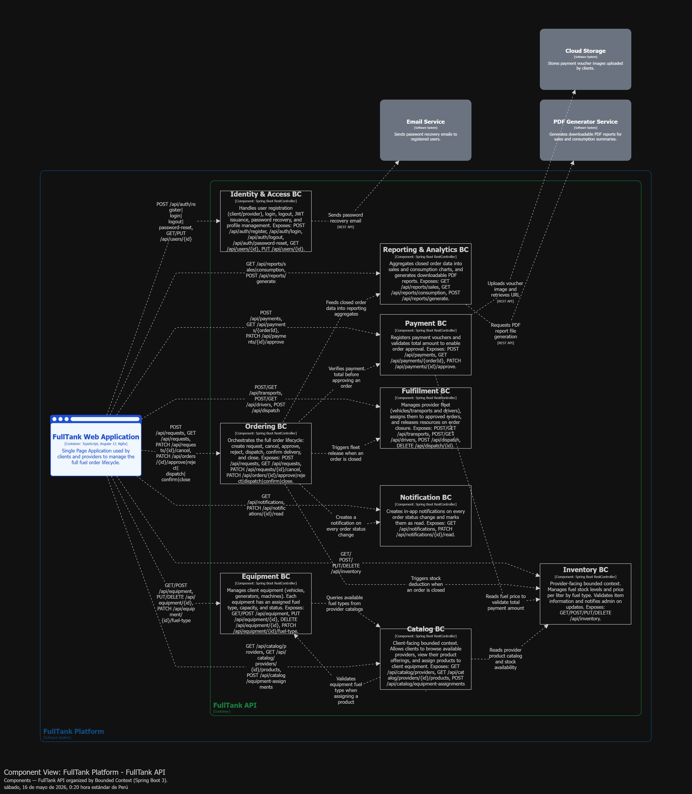

> El repositorio no conserva un diagrama de componentes exclusivo de Fulfillment; se enlaza la vista global disponible.

#### 4.2.6.6. Bounded Context Software Architecture Code Level Diagrams.

##### 4.2.6.6.1. Bounded Context Domain Layer Class Diagram.


> El repositorio conserva la vista backend disponible para Fulfillment, no un UML de dominio separado.

##### 4.2.6.6.2. Bounded Context Database Design Diagram.

*Responsabilidad:* almacena los recursos logísticos del proveedor y su asignación a las entregas de cada orden.

- **deliveries:** `id` (PK), `order_id` (FK → orders), `provider_id` (FK → providers), `driver_id` (FK → drivers), `vehicle_id` (FK → vehicles), `status` (`SCHEDULED`/`DISPATCHED`/`DELIVERED`/`FAILED`), `scheduled_date`, `dispatched_at`, `delivered_at`, `notes`, `created_at`, `updated_at`.
- **vehicles:** `id` (PK), `provider_id` (FK → providers), `license_plate` (único), `brand`, `model`, `capacity`, `unit`, `status`, `created_at`, `updated_at`.
- **drivers:** `id` (PK), `provider_id` (FK → providers), `first_name`, `last_name`, `license_number` (único), `phone_number`, `email`, `status`, `created_at`, `updated_at`.

> La tabla anterior es la especificación textual del diseño de base de datos de Fulfillment. No se conserva un diagrama gráfico específico de este modelo.

#### 4.2.6.7. Runtime Evidence.

| Operación | Resultado esperado |
| :-------: | :-------: |
| Crear entrega con conductor/vehículo disponibles y del mismo proveedor | `201 Created` |
| Crear entrega con conductor o vehículo de otro proveedor | `409 Conflict` |
| Crear entrega con capacidad de vehículo insuficiente | `409 Conflict` |
| Crear entrega duplicada para la misma orden | `409 Conflict` |
| Despachar / completar / fallar entrega | `200 OK` |
| Consultar entrega por id, por orden y por proveedor | `200 OK` |
| Listar todas las entregas (rol distinto de `ADMIN`) | `403 Forbidden` |
| CRUD de vehículos y conductores del proveedor dueño | `200`/`201`/`204` según operación |
| Acceso a vehículos/conductores de otro proveedor | `404 Not Found` |
| Swagger sin token | `401 Unauthorized` |

### 4.2.7. Bounded Context: Ordering

| Elemento | Descripción |
|---|---|
| Propósito | Gestionar la solicitud y la orden de combustible desde el evento IoT de nivel bajo o una operación manual de contingencia hasta su aceptación, asignación, despacho, confirmación y cierre. |
| Actores | Dispositivo IoT y comprador asociado que originan la solicitud; distribuidores que aceptan o rechazan; Fulfillment que asigna recursos y ejecuta el despacho. |
| Relación con otros contextos | Consume `LowFuelLevelDetected` desde Equipment e IoT Tank Monitoring, consulta Inventory para validar producto y disponibilidad, solicita recursos a Fulfillment, notifica estados mediante Notification y es consumido por Payment y Reporting mediante el `orderId` y el `tripId`. La evolución propuesta utiliza eventos idempotentes en lugar de crear solicitudes duplicadas. |

#### 4.2.7.1. Domain Layer

El core de Ordering es el agregado raíz `FuelOrder`. Su invariante principal reside en el value object `OrderStatus`: cada método del agregado protege las transiciones válidas del ciclo de vida, por ejemplo `dispatch()` lanza excepción si el estado no es `PENDING`, y `receive()` exige que la orden esté `DISPATCHED`. `confirm()` y `cancel()`, en cambio, no validan el estado previo antes de aplicarse.

| Clase | Tipo | Propósito |
|---|---|---|
| `FuelOrder` | Aggregate Root | Gestiona comprador asociado, distribuidor, tanque, dispositivo de origen, producto, volumen requerido, precio total, dirección, fecha, origen IoT y estado de asignación. Expone `confirm()`, `cancel()`, `dispatch()`, `receive()` y `markPaid()` como comportamiento del dominio. |
| `OrderStatus` | Value Object | Restringe los estados de la orden: `PENDING_ACCEPTANCE`, `ACCEPTED`, `RESOURCE_ASSIGNED`, `DISPATCHED`, `PENDING_PAYMENT`, `PAID`, `IN_PROGRESS`, `DELIVERED`, `CANCELLED`. |
| `RequestStatus` | Value Object | Restringe los estados de la solicitud: `PENDING`, `ACCEPTED`, `REJECTED`, `DUPLICATE`, `EXPIRED`. |
| `CreateFuelOrderCommand` | Domain Command | Define los datos necesarios para crear una orden (comprador, distribuidor, tanque, dispositivo, producto, cantidad, dirección, fecha y `sourceEventId`). |
| `ConfirmFuelOrderCommand` | Domain Command | Identifica la orden que debe confirmarse. |
| `CancelFuelOrderCommand` | Domain Command | Identifica la orden que debe cancelarse. |
| `GetAllFuelOrdersQuery` | Domain Query | Define la consulta de todas las órdenes. |
| `GetFuelOrderByIdQuery` | Domain Query | Define la consulta de una orden por identificador. |
| `GetFuelOrdersByCompanyIdQuery` | Domain Query | Define la consulta de órdenes de una empresa compradora. |
| `GetFuelOrdersByProviderIdQuery` | Domain Query | Define la consulta de órdenes de un proveedor. |
| `FuelOrderRepository` | Domain Repository | Expone el puerto de persistencia que utiliza `FuelOrder` sin depender de JPA o Spring Data. |

> Nota: la solicitud (`FuelRequest`) no llegó a modelarse como agregado de dominio propio; su comportamiento vive directamente en la entidad de persistencia y en `FuelRequestService` (ver 4.2.7.3 y 4.2.7.4).

#### 4.2.7.2. Interface Layer

| Clase / Componente | Tipo | Propósito |
|---|---|---|
| `FuelOrdersController` | REST Controller | Expone la API `/api/v1/fuel-orders`: creación, confirmación, cancelación y consulta por id, compañía o proveedor. Valida propiedad de compañía/proveedor mediante `CurrentUserAccess`. |
| `FuelRequestsController` | REST Controller | Expone la API `/api/v1/fuel-requests`: creación, listado, consulta por id, aceptación y rechazo. |
| `OrderingController` | REST Controller (placeholder) | Clase vacía, usada solo como marcador de documentación/diagrama; no define endpoints. |
| `CreateFuelOrderResource` | REST Resource (DTO) | Define el cuerpo JSON de entrada para crear una orden directamente. |
| `FuelOrderResource` | REST Resource (DTO) | Define la representación JSON de una orden para la respuesta HTTP. |
| `CreateFuelRequestResource` | REST Resource (DTO) | Define el cuerpo JSON de entrada para crear una solicitud. |
| `FuelRequestResource` | REST Resource (DTO) | Define la representación JSON de una solicitud para la respuesta HTTP. |
| `RejectFuelRequestResource` | REST Resource (DTO) | Define el motivo de rechazo enviado por el proveedor. |
| `CreateFuelOrderCommandFromResourceAssembler` | Assembler / Transformer | Convierte el recurso HTTP de creación en `CreateFuelOrderCommand`. |
| `FuelOrderResourceFromEntityAssembler` | Assembler / Transformer | Convierte el agregado `FuelOrder` en `FuelOrderResource` para la respuesta HTTP. |

> Nota: a diferencia de `FuelOrderResource`, la conversión de `FuelRequestPersistenceEntity` a `FuelRequestResource` no tiene un assembler dedicado; se resuelve con un método estático privado dentro de `FuelRequestsController`.

#### 4.2.7.3. Application Layer

| Clase / Componente | Tipo | Propósito |
|---|---|---|
| `FuelOrderCommandService` | Command Service (Interface) | Define el contrato para crear, confirmar y cancelar órdenes. |
| `FuelOrderCommandServiceImpl` | Command Service Implementation | Consulta `FuelProductQueryService` de Inventory para calcular el precio, construye el agregado, lo persiste y delega las transiciones de estado al propio `FuelOrder`. Devuelve `Result<FuelOrder, ApplicationError>`. |
| `FuelOrderQueryService` | Query Service (Interface) | Define el contrato para consultar por id, compañía, proveedor o colección completa. |
| `FuelOrderQueryServiceImpl` | Query Service Implementation | Ejecuta las consultas y delega la recuperación al puerto `FuelOrderRepository`. |
| `FuelRequestService` | Command/Query Service (clase concreta, sin interfaz) | Concentra `create`, `accept`, `reject` y `findAll`/`findById` de las solicitudes. La creación debe aceptar eventos IoT idempotentes mediante `sourceEventId`; `accept` construye un `CreateFuelOrderCommand`, crea la `FuelOrder` vinculada por `requestId` y actualiza la solicitud a `APPROVED`, todo en una única transacción. |

> Nota: a diferencia de `FuelOrderCommandService`/`FuelOrderQueryService`, `FuelRequestService` no sigue el patrón interfaz + implementación; es una única clase concreta anotada con `@Service`.

#### 4.2.7.4. Infrastructure Layer

| Clase / Componente | Tipo | Propósito |
|---|---|---|
| `FuelOrderPersistenceEntity` | JPA Entity | Representa la tabla `fuel_orders`; persiste `status` como `OrderStatus` en formato `VARCHAR`. |
| `FuelRequestPersistenceEntity` | JPA Entity | Representa la tabla `fuel_requests`; actúa como modelo único (sin contraparte de dominio) consumido directamente por `FuelRequestService`. |
| `FuelOrderPersistenceAssembler` | Assembler / Mapper | Convierte entre `FuelOrder` y `FuelOrderPersistenceEntity`, manteniendo el dominio libre de anotaciones JPA. |
| `FuelOrderPersistenceRepository` | Spring Data JPA Repository | Ejecuta la persistencia y las consultas por `companyId` y `providerId`. |
| `FuelRequestPersistenceRepository` | Spring Data JPA Repository | Ejecuta la persistencia y las consultas por `buyerCompanyId` y `providerId`; se usa directamente, sin puerto de dominio intermedio. |
| `FuelOrderRepositoryImpl` | Repository Adapter | Implementa el puerto `FuelOrderRepository` y adapta sus operaciones a Spring Data JPA. |

#### 4.2.7.5. Bounded Context Software Architecture Component Level Diagrams.
Component Diagram - Ordering Bounded Context

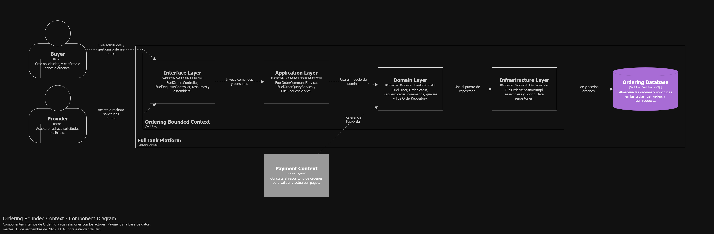

#### 4.2.7.6. Bounded Context Software Architecture Code Level Diagrams.

##### 4.2.7.6.1. Bounded Context Domain Layer Class Diagram.
Domain Layer Class Diagram - Ordering Bounded Context

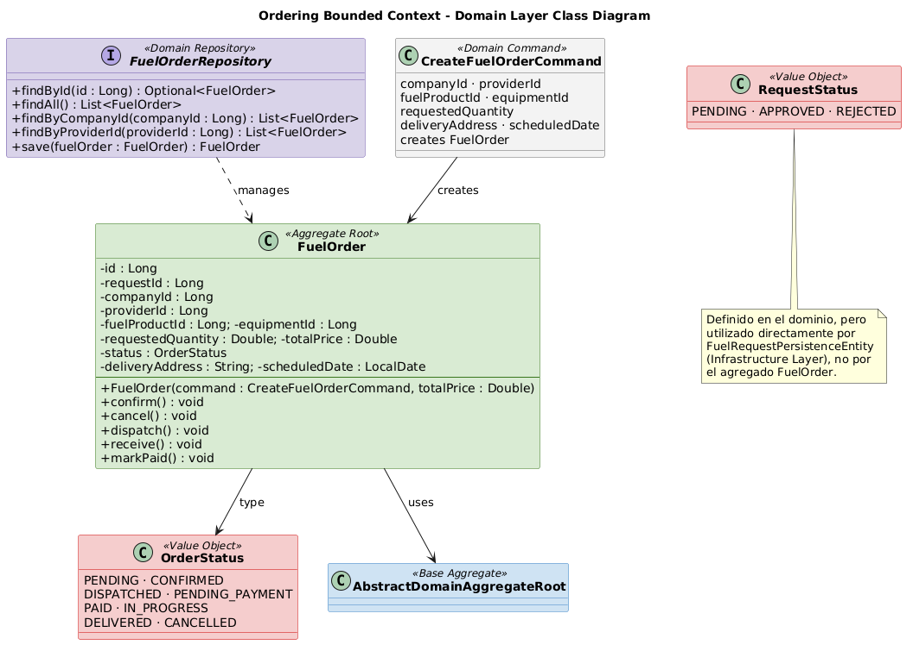

##### 4.2.7.6.2. Bounded Context Database Design Diagram.


#### 4.2.7.7. Runtime Evidence.

| Operación | Resultado |
|---|---|
| Registrar usuario proveedor (sign-up) | 201 Created |
| Registrar usuario comprador (sign-up) | 201 Created |
| Crear producto de combustible (Inventory, como proveedor) | 201 Created |
| Procesar `LowFuelLevelDetected` con tanque y distribuidor asociados | 201 Created, solicitud `PENDING` |
| Reprocesar el mismo `sourceEventId` IoT | 200 OK o solicitud existente, sin duplicar pedido |
| Crear solicitud (`fuel-requests`), estado inicial | 201 Created, `PENDING` |
| Aceptar solicitud (`accept`), genera orden automáticamente | 200 OK, orden `PENDING` con `totalPrice` calculado |
| Confirmar orden (`confirm`) | 200 OK, `CONFIRMED` |
| Consultar orden por id | 200 OK |
| Consultar órdenes por compañía | 200 OK |
| Consultar órdenes por proveedor | 200 OK |
| Crear orden directa (sin solicitud previa) | 201 Created, `requestId: null` |
| Cancelar orden ya confirmada | 200 OK, `CANCELLED` (sin validación de estado previo) |
| Token JWT con firma inválida (secreto distinto al del servidor) | 401 Unauthorized |

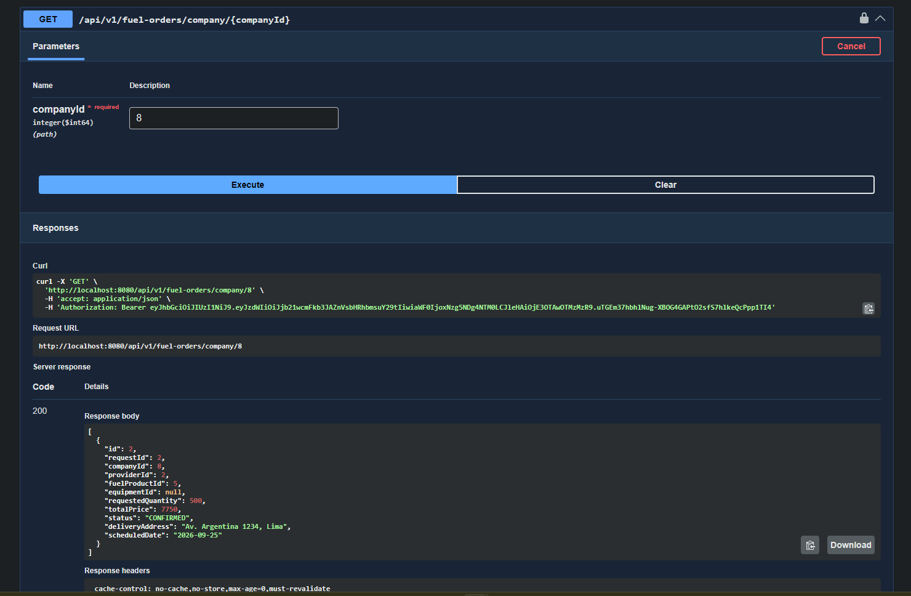
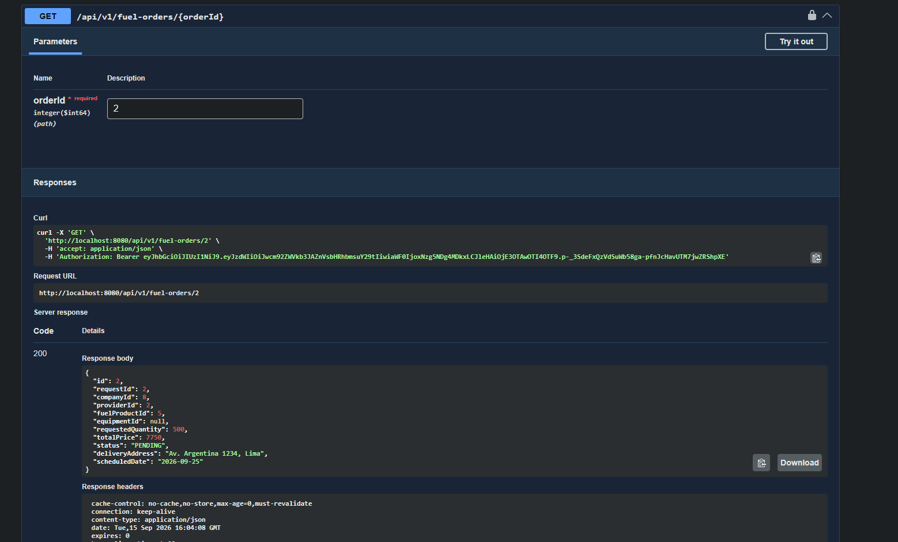
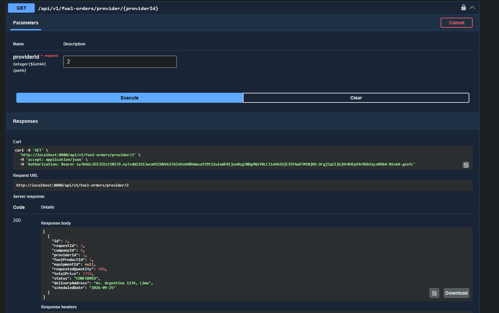
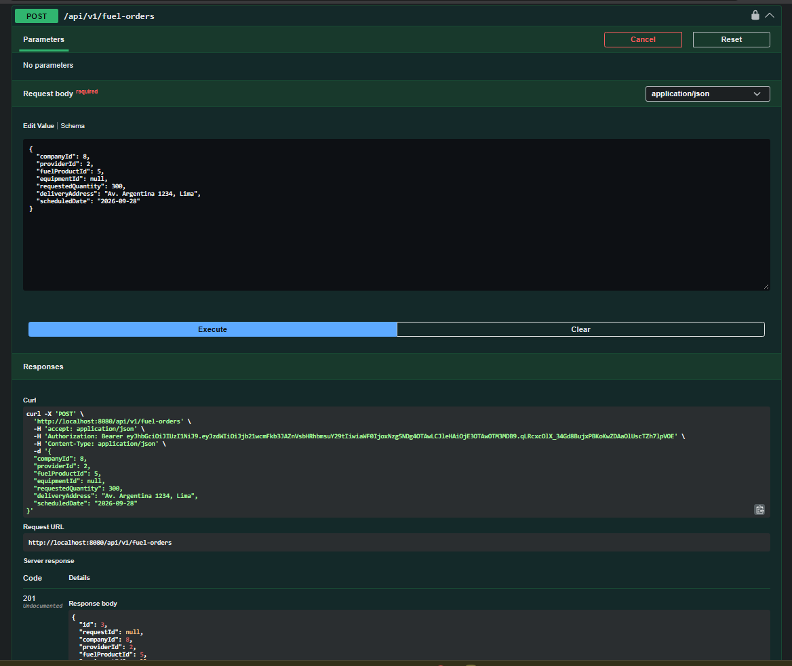
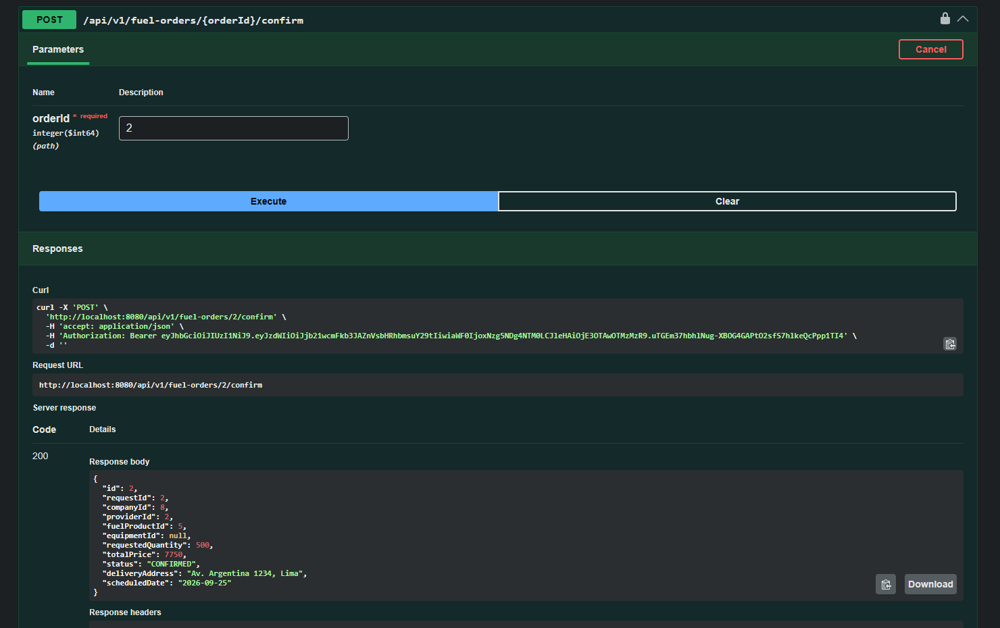
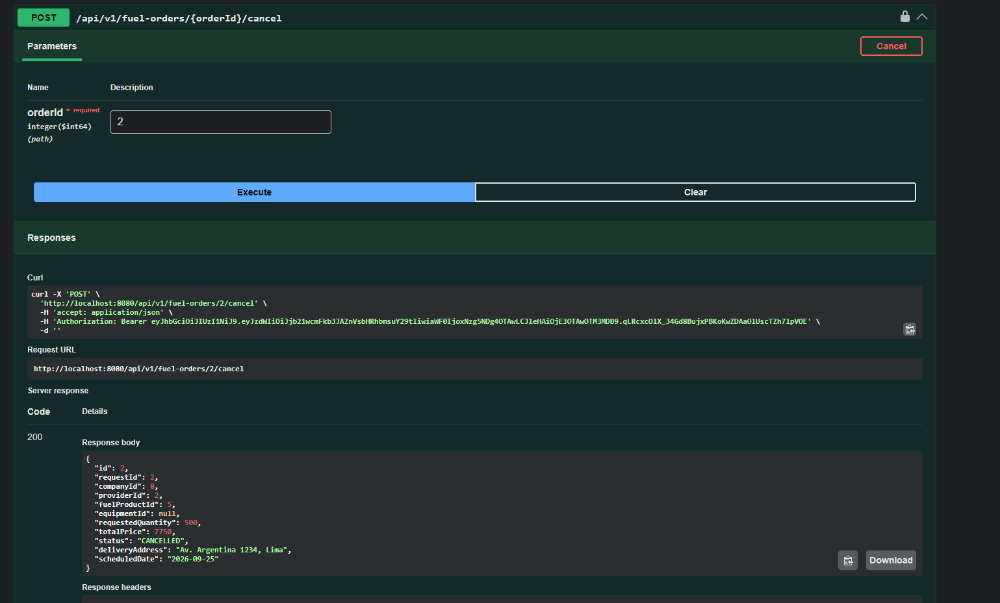

### 4.2.8. Bounded Context: Payment

#### 4.2.8.1. Domain Layer.

|     Clase     |      Tipo      |                                  Propósito                                 |
|:-------------:|:--------------:|:--------------------------------------------------------------------------:|
|    Payment    | Aggregate Root | Entidad principal que gestiona la información del pago y su ciclo de vida. |
| PaymentStatus |  Value Object  |                 Representar los estados posibles del pago.                 |
| PaymentMethod |  Value Object  |           Identificar el método utilizado para realizar el pago.           |

#### 4.2.8.2. Interface Layer.

|          Clase          |       Tipo      |                                                     Propósito                                                    |
|:-----------------------:|:---------------:|:----------------------------------------------------------------------------------------------------------------:|
|      PaymentStatus      | REST Controller |              Exponer los endpoints HTTP para gestionar la creación, estado y consulta de los pagos.              |
| CompletePaymentResource |   DTO (Record)  |      Representar los datos de entrada requeridos por el cliente para solicitar la creación de un nuevo pago.     |
| CreatePaymentResource   | DTO (Record)    | Representar el dato enviado por el cliente necesario para marcar un pago como completado.                        |
| PaymentResource         | DTO (Record)    | Representar los datos de salida con la información detallada del pago que se devuelve como respuesta al cliente. |

#### 4.2.8.3. Application Layer.

|           Clase           |       Tipo      |                                                     Propósito                                                     |
|:-------------------------:|:---------------:|:-----------------------------------------------------------------------------------------------------------------:|
|   PaymentCommandService   |    Interface    |                      Definir los casos de uso para las operaciones que modifican información.                     |
| PaymentCommandServiceImpl | Command Handler | Implementar la lógica real que ejecuta las operaciones de modificación coordinando el dominio y la base de datos. |
| PaymentQueryService       | Interface       | Definir los casos de uso para las operaciones de solo lectura.                                                    |
| PaymentQueryServiceImpl   | Command Handler | Implementar la lógica para ejecutar las consultas y devolver la información de los pagos sin alterar ningún dato. |

#### 4.2.8.4. Infrastructure Layer.

|             Clase            |            Tipo            |                                                              Propósito                                                             |
|:----------------------------:|:--------------------------:|:----------------------------------------------------------------------------------------------------------------------------------:|
|     PaymentRepositoryImpl    |     Repository Adapter     |                         Actúa como un adaptador que conecta las operaciones de negocio con Spring Data JPA.                        |
| PaymentPersistenceAssembler  |     Assembler / Mapper     | Funciona como un traductor bidireccional, transformando los objetos del modelo de dominio a entidades de persistencia y viceversa. |
| PaymentPersistenceEntity     | JPA Entity                 | Representa la estructura de la tabla payments en la base de datos relacional.                                                      |
| PaymentPersistenceRepository | Spring Data JPA Repository | Encargada de ejecutar las consultas SQL automáticas y personalizadas directamente sobre la base de datos.                          |

#### 4.2.8.5. Bounded Context Software Architecture Component Level Diagrams.


> No se conserva un diagrama de componentes exclusivo de Payment; se enlaza la vista global disponible.

#### 4.2.8.6. Bounded Context Software Architecture Code Level Diagrams.

##### 4.2.8.6.1. Bounded Context Domain Layer Class Diagrams.


##### 4.2.8.6.2. Bounded Context Database Design Diagram.


### 4.2.9. Bounded Context: Reporting

#### 4.2.9.1. Domain Layer.

|           Clase           |     Tipo     |                                             Propósito                                             |
|:-------------------------:|:------------:|:-------------------------------------------------------------------------------------------------:|
|   GetBuyerAnalyticsQuery  | Domain Query |  Define la estructura de la consulta para solicitar las analíticas y métricas de los compradores. |
| GetPlatformSummaryQuery   | Domain Query |  Define la estructura de la consulta para obtener el resumen general del estado de la plataforma. |
| GetProviderAnalyticsQuery | Domain Query | Define la estructura de la consulta para solicitar las analíticas y métricas de los proveedores.  |
| BuyerAnalytics            | Value Object | Modela los datos de valor inmutables que representan las analíticas consolidadas de un comprador. |
| MonthlyAmount             | Value Object | Modela los montos monetarios agrupados por periodo mensual para reportes y estadísticas.          |
| PlatformSummary           | Value Object | Modela los indicadores y datos globales que componen el resumen general de la plataforma.         |
| ProviderAnalytics         | Value Object | Modela los datos de valor inmutables que representan las analíticas y métricas de un proveedor.   |

#### 4.2.9.2. Interface Layer.

|                       Clase                       |       Tipo      |                                                       Propósito                                                      |
|:-------------------------------------------------:|:---------------:|:--------------------------------------------------------------------------------------------------------------------:|
|                AnalyticsController                | REST Controller |       Expone los endpoints HTTP para gestionar y recibir las solicitudes de consulta de analíticas y resúmenes.      |
|               BuyerAnalyticsResource              |  REST Resource  |            Define la estructura de datos JSON que se expone al cliente para las analíticas de compradores.           |
|              PlatformSummaryResource              |  REST Resource  |         Define la estructura de datos JSON que se expone al cliente para el resumen general de la plataforma.        |
|             ProviderAnalyticsResource             |  REST Resource  |            Define la estructura de datos JSON que se expone al cliente para las analíticas de proveedores.           |
|   BuyerAnalyticsResourceFromValueObjectAssembler  |    Assembler    |    Convierte el objeto de valor del dominio (BuyerAnalytics) al recurso de presentación (BuyerAnalyticsResource).    |
|  PlatformSummaryResourceFromValueObjectAssembler  |    Assembler    |   Convierte el objeto de valor del dominio (PlatformSummary) al recurso de presentación (PlatformSummaryResource).   |
| ProviderAnalyticsResourceFromValueObjectAssembler |    Assembler    | Convierte el objeto de valor del dominio (ProviderAnalytics) al recurso de presentación (ProviderAnalyticsResource). |

#### 4.2.9.3. Application Layer.

|           Clase           |             Tipo             |                                                           Propósito                                                          |
|:-------------------------:|:----------------------------:|:----------------------------------------------------------------------------------------------------------------------------:|
|   AnalyticsQueryService   |         Query Service        | Define el contrato de los servicios de consulta para coordinar el procesamiento de las solicitudes de reportes y analíticas. |
| AnalyticsQueryServiceImpl | Query Service Implementation | Implementa la lógica de negocio descrita por el contrato para procesar y resolver las consultas de analíticas en el sistema. |

#### 4.2.9.4. Infrastructure Layer.

La infraestructura de Reporting consume los datos persistidos de órdenes y pagos para construir las consultas analíticas y generar los reportes descritos por `AnalyticsQueryService`. El diagrama backend disponible documenta este módulo como parte de la infraestructura de Reporting.


#### 4.2.9.5. Bounded Context Software Architecture Component Level Diagrams.


> No se conserva un diagrama de componentes exclusivo de Reporting; se enlaza la vista global disponible.

#### 4.2.9.6. Bounded Context Software Architecture Code Level Diagrams.
##### 4.2.9.6.1. Bounded Context Domain Layer Class Diagrams.

##### 4.2.9.6.2. Bounded Context Database Design Diagram.

