# Capítulo IV: Solution Software Design

El presente capítulo describe el diseño de la solución de software de **FullTank**, elaborado por la startup **PrimeFuel**, aplicando los principios de **Domain-Driven Design (DDD)** y el modelo **C4** para la documentación de la arquitectura. El único segmento comercial objetivo es el **Distribuidor Logístico de Combustible**. El comprador asociado participa como actor operativo del servicio mediante un dispositivo IoT instalado en su tanque, pero no constituye un segmento independiente. Por ello, el flujo arquitectónico inicia en una lectura de nivel bajo y continúa con la generación idempotente del pedido, la aceptación del distribuidor, la asignación de conductor y cisterna, el despacho, la ejecución de la entrega y su cierre. El diseño se organiza en dos niveles complementarios: un nivel **estratégico**, donde se delimita el dominio, se descubren los *bounded contexts* y se establecen sus relaciones; y un nivel **táctico**, donde cada contexto se detalla en sus capas de dominio, interfaz, aplicación e infraestructura, junto con sus diagramas de componentes y de código.

## 4.1. Strategic-Level Domain-Driven Design

En este nivel se realiza la descomposición estratégica del dominio de negocio del abastecimiento de combustible. Partiendo de los hallazgos del *Big Picture EventStorming* (Sección 2.4) y del *Ubiquitous Language* (Sección 2.5), el equipo aplica un *Design-Level EventStorming* para identificar los contextos delimitados, modelar los flujos de mensajes entre ellos y definir sus relaciones mediante un *Context Mapping*, para finalmente representar la arquitectura del sistema a nivel de paisaje, contexto, contenedores y despliegue.

### 4.1.1. Design-Level EventStorming

Para identificar los eventos de dominio, es recomendable realizar una sesión de Event Storming. Esta técnica permite visualizar y comprender el flujo de eventos dentro del dominio, facilitando la identificación de los Bounded Context.

El desarrollo del proceso de Domain-Driven Design se realizó en la aplicación Miro: https://miro.com/app/board/uXjVGgOzeI4=/?share_link_id=421094077860

  
  
<em>Figura 4.1: Sesión de Event Storming realizada en Miro.</em>

El recorrido de la sesión siguió el ciclo de vida de una reposición:

1. **Lectura de nivel.** El comando *registrar lectura* lo emite el dispositivo del tanque; el hecho resultante es una lectura validada y asociada a un tanque.
2. **Nivel bajo.** La política de reposición compara el nivel con el umbral del tanque. Si el nivel es igual o menor al umbral y no hay otra solicitud pendiente, se abre un episodio de reposición. Este es el evento de negocio que el capítulo II llama *Low Fuel Level Event*.
3. **Solicitud.** Si el tanque tiene la generación automática habilitada, el episodio produce una solicitud con producto, volumen, dirección y fecha.
4. **Decisión.** El distribuidor acepta o rechaza la solicitud. La aceptación crea la orden de combustible dentro de la misma transacción.
5. **Asignación.** El distribuidor elige un conductor y una cisterna elegibles; el sistema reserva stock y flota y crea la entrega en estado asignado.
6. **Entrega y cierre.** La entrega avanza por sus estados físicos hasta completarse; al cerrar se liberan las reservas y la orden queda pendiente de pago.
7. **Pago.** El comprador registra el pago y, cuando se confirma, la orden pasa a pagada.

#### 4.1.1.1. Candidate Context Discovery

Para descubrir los contextos se usó la técnica de *start with value*: se agruparon los eventos alrededor de las decisiones que generan valor para el distribuidor y luego se separaron las capacidades de soporte y las genéricas. Cada contexto resultante corresponde a un módulo del backend.

| Bounded Context | Responsabilidad | Clasificación |
|---|---|---|
| **Replenishment** | Evalúa la política de umbral del tanque, abre y rearma episodios de nivel bajo y gestiona el ciclo de la solicitud de abastecimiento (pendiente, aceptada, rechazada o cancelada). | Core |
| **Fulfillment** | Crea la entrega asignada y controla su ciclo físico (asignada, iniciada, en destino, descargando, completada, fallida o cancelada), con historial de transiciones y línea de tiempo. | Core |
| **Ordering** | Mantiene la orden de combustible vinculada a una solicitud aceptada y su ciclo comercial hasta el pago. | Core |
| **Equipment** | Vincula a los compradores con el distribuidor, registra sus sitios y tanques, y mantiene el vínculo temporal entre dispositivo y tanque con sus credenciales. | Supporting |
| **Telemetry** | Recibe las lecturas del dispositivo, las autentica, las deduplica y publica solo las lecturas válidas. | Supporting |
| **Fleet** | Registra conductores y cisternas, calcula su elegibilidad y reserva los recursos por ventana de tiempo validando la capacidad. | Supporting |
| **Supply** | Expone el catálogo de productos por distribuidor y reserva el stock de una asignación para no sobrevender. | Supporting |
| **Inventory** | Administra los productos de combustible del distribuidor, su precio y su stock disponible. | Supporting |
| **Payment** | Registra el pago de una orden y su confirmación o reembolso. | Generic |
| **Notification** | Genera la bandeja in-app de cada usuario a partir de los eventos de negocio. | Generic |
| **Analytics** | Calcula indicadores de solo lectura para el distribuidor y el comprador, leyendo los demás contextos a través de una capa anticorrupción. | Generic |
| **IAM** | Autentica con JWT, gestiona organizaciones, membresías, invitaciones y roles, y resuelve el tenant de cada petición. | Generic |

Además de estos contextos, el backend tiene un módulo **Application Flows** que no es un *bounded context*, sino la raíz de composición: orquesta en una sola transacción la aceptación de una solicitud y la asignación de una entrega, usando sobre todo las interfaces públicas (paquete `api`) de cada contexto.

El backend también contiene dos módulos que dependen de una aplicación para el conductor: *tracking* (ubicación e hitos de carga que el conductor reporta desde su teléfono) y *safety* (geocerca de la entrega y registro lógico de apertura y cierre de válvula, sin hardware). Esa aplicación no forma parte de esta versión y el capítulo I excluye la telemetría de la carga y el control de válvulas, por lo que ambos módulos quedan fuera del alcance y no se documentan en este capítulo.

#### 4.1.1.2. Domain Message Flows Modeling

Los eventos entre contextos usan tipos versionados (`replenishment.accepted.v1`, `delivery.completed.v1`, etc.) que se publican con un *outbox* transaccional y se consumen de forma idempotente con un *inbox*.

**Flujo 1 – Detección de nivel bajo y generación de la solicitud.** El dispositivo envía la lectura con su token. Telemetry la autentica mediante Equipment, descarta duplicados por dispositivo, canal y secuencia, y guarda en cuarentena las lecturas de credenciales desconocidas o revocadas. Si la lectura es válida, Equipment actualiza el nivel del tanque y Telemetry publica `ValidatedTankReadingEvent`. Replenishment evalúa la política: abre un episodio cuando el nivel cae al umbral (20 % por defecto) y, si la generación automática está activa, crea la solicitud `AUTOMATIC`.

**Flujo 2 – Aceptación o rechazo y creación de la orden.** El distribuidor revisa las solicitudes de su organización. Al aceptar, Application Flows ejecuta en una transacción la aceptación, el consumo único de esa aceptación, la creación de la orden en Ordering y su vínculo con la solicitud. Si algún paso falla, no se conserva ningún cambio. La decisión se publica como evento y Notification la agrega a la bandeja de los miembros de la organización del comprador que hizo la solicitud.

**Flujo 3 – Asignación de conductor y cisterna.** El distribuidor puede pedir primero una recomendación: el sistema propone la cisterna de menor capacidad que cubre el volumen y un conductor elegible sin reservas que se traslapen, o indica por qué no hay recursos. La recomendación no reserva nada. Luego el distribuidor consulta los conductores y cisternas elegibles y envía la asignación con un `commandId`. En una transacción se reserva el stock en Supply, se reservan el conductor y la cisterna en Fleet (con bloqueo de filas, capacidad suficiente y sin traslape de ventana), se crea la entrega `ASSIGNED` y la orden pasa a `DISPATCHED`. Reintentar con el mismo `commandId` devuelve la misma entrega.

**Flujo 4 – Ejecución de la entrega, cierre y pago.** El distribuidor registra el inicio, la llegada y el cierre con el volumen entregado, que no puede superar el solicitado. Al completarse se liberan las reservas de flota, se concilia el stock y la orden pasa a `PENDING_PAYMENT`. El comprador registra el pago; al confirmarse, Payment publica `payment.completed.v1` y Ordering marca la orden como `PAID`.

**Flujo 5 – Alta del comprador, su tanque y el dispositivo.** Este flujo es la condición previa de los anteriores. El distribuidor busca al comprador por su RUC exacto y lo vincula, o lo registra si no existe; en la misma transacción se crean su cuenta y su sitio de entrega. Después registra el tanque con su capacidad, el producto que se repondrá, el umbral y el identificador del dispositivo: Equipment crea el tanque y el vínculo con el dispositivo, y Replenishment guarda la política. Si el dispositivo ya está vinculado a otro tanque, la operación se rechaza completa.

#### 4.1.1.3. Bounded Context Canvases

A continuación se presenta el diagrama de cada *bounded context* identificado, elaborado durante la sesión de Event Storming:

1. **Bounded Context IAM**

  

2. **Bounded Context Ordering**

  

3. **Bounded Context Fulfillment**

  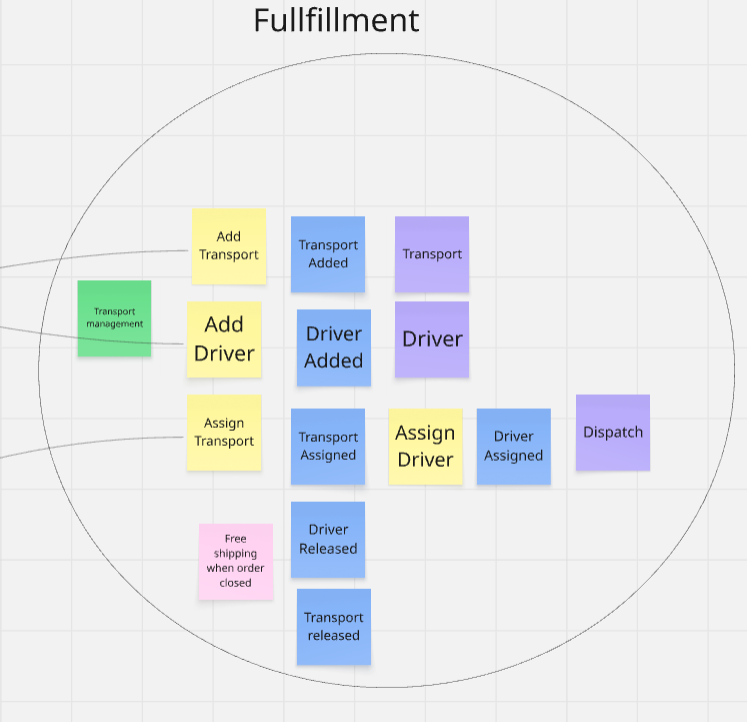

4. **Bounded Context Payment**

  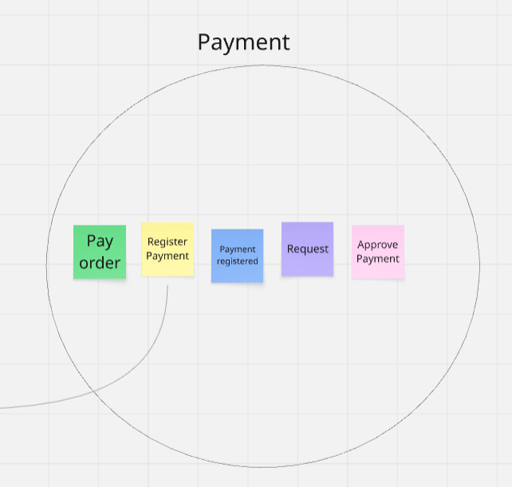

5. **Bounded Context Notification**

  

6. **Bounded Context Analytics**

  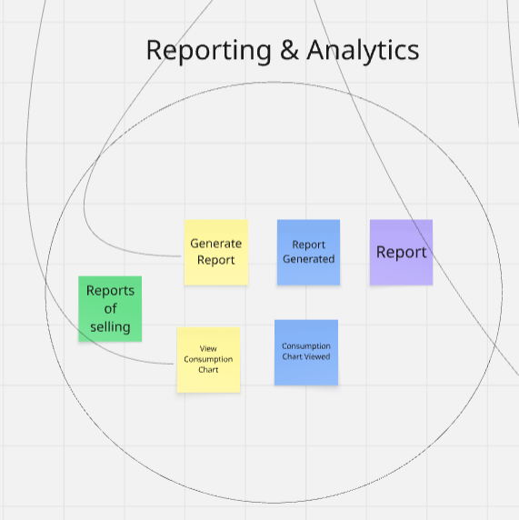

7. **Bounded Context Inventory**

  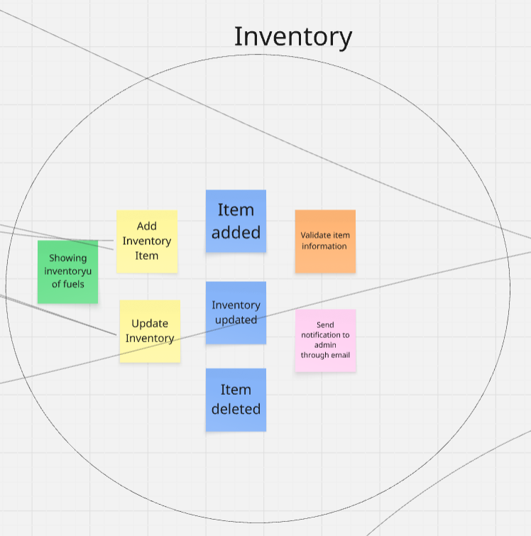

8. **Bounded Context Equipment**

  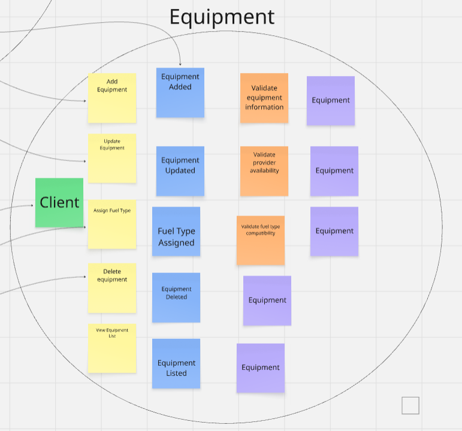

Telemetry, Replenishment, Fleet y Supply surgieron después de la sesión y todavía no tienen canvas propio.

### 4.1.2. Context Mapping

El *Context Mapping* muestra cómo se relacionan los contextos. La regla principal del backend es que un contexto solo usa la **superficie pública** de otro (su paquete `api`), nunca su dominio ni su infraestructura. Esta regla se verifica con pruebas de ArchUnit sobre los módulos originales del backend.

| Upstream | Downstream | Patrón | Mecanismo |
|---|---|---|---|
| IAM | Todos los contextos de negocio | Open Host Service / Conformist | `TenantAccess`, `MembershipAccess`, `MembershipDirectory` |
| Equipment | Telemetry | Open Host Service / Customer-Supplier | `DeviceAuthentication`, `TankAssets`, `ProviderBuyerAccess` |
| Telemetry | Replenishment | Published Language | `ValidatedTankReadingEvent` |
| Equipment | Replenishment | Open Host Service | `TankAssets`, `CustomerDirectory`, `TankLevelManuallyUpdatedEvent` |
| Replenishment | Equipment | Open Host Service | `TankRefillConfiguration`, `TankRefillLookup`, `ReplenishmentLookup` |
| IAM | Equipment | Open Host Service | `BuyerCompanyDirectory`, `BuyerCompanyRegistration` |
| Inventory | Equipment, Fulfillment, Analytics | Open Host Service | `FuelProductLookup` |
| Inventory | Supply | Anti-Corruption Layer | `InventorySupplyCatalog` traduce `fuel_products` al modelo de Supply |
| Supply | Replenishment, Application Flows | Open Host Service | `SupplyCatalog`, `SupplyReservations` |
| Replenishment, Ordering, Fleet, Fulfillment | Application Flows | Open Host Service | `ReplenishmentLookup`, `ReplenishmentAcceptance`, `FuelOrderCreation`, `FleetReservations`, `DeliveryAssignments` |
| Application Flows | Fulfillment | Anti-Corruption Layer | Implementa el puerto `DeliveryIntegration` para que Fulfillment no aplique por sí mismo los efectos del cierre sobre Fleet, Supply, Inventory y Ordering |
| Inventory, Equipment | Ordering | Conformist | Ordering consulta el producto (precio) y el equipo legado directamente con sus query services |
| Ordering | Payment, Equipment, Fulfillment | Open Host Service | `OrderLookup` |
| Fleet | Fulfillment | Open Host Service | `FleetCatalog` (conductor, cisterna y ventana reservada) |
| Payment | Ordering | Published Language | `payment.completed.v1` |
| Replenishment, Fulfillment, Inventory | Notification | Published Language / Conformist | `replenishment.*.v1`, `delivery.*.v1`, `inventory.catalog-empty.v1` |
| Ordering, Payment, Fulfillment | Analytics | Anti-Corruption Layer | Cada contexto expone un *facade* (`OrderingContextFacade`, `PaymentContextFacade`, `FulfillmentContextFacade`) y Analytics lo traduce a sus propios tipos con `ExternalOrderingService`, `ExternalPaymentService` y `ExternalFulfillmentService` |
| Shared Kernel | Todos | Shared Kernel | `Volume`, `Unit`, `Result`, `ApplicationError`, `EventEnvelope`, outbox e inbox |

Equipment y Replenishment se usan mutuamente: Replenishment lee los tanques de Equipment, y Equipment configura la política del tanque en Replenishment cuando el distribuidor lo registra. Se aceptó esa dependencia en ambos sentidos porque el alta del tanque debe ser atómica (tanque, vínculo del dispositivo y política) y cada contexto sigue usando solo la superficie pública del otro.

Durante el diseño se evaluaron tres alternativas:

- **Separar Supply de Inventory.** Se mantuvieron separados porque Inventory administra el catálogo (CRUD del distribuidor) y Supply resuelve la concurrencia de las reservas. Juntarlos obligaría a que cada edición de producto compita con los bloqueos de reserva.
- **Orquestación frente a coreografía para la asignación.** La asignación toca Replenishment, Supply, Fleet, Fulfillment y Ordering y debe ser todo o nada. Se eligió orquestarla en Application Flows dentro de una transacción local, en lugar de encadenar eventos con compensaciones, porque todos los contextos comparten la misma base de datos y así el rollback deshace cualquier paso fallido.
- **Lectura directa frente a capa anticorrupción en Analytics.** La primera versión de los reportes leía los query services de Ordering, Payment y Fulfillment. Se extrajo Analytics como contexto propio con una capa anticorrupción para que un cambio en el modelo de esos contextos no rompa los indicadores.

Algunas dependencias todavía acceden al modelo interno de otro contexto en lugar de su paquete `api`: Ordering consulta los query services de Inventory y Equipment; Fulfillment consulta el query service de Ordering; Supply lee los productos con el query service de Inventory; Equipment usa el tipo `FuelType` de Inventory; y Application Flows usa el servicio de comandos y el agregado de Replenishment, además de repositorios de Fleet, Inventory, Ordering y Equipment en `DeliveryIntegrationAdapter`. Las heredadas están registradas como deuda en la línea base de ArchUnit para que no aparezcan nuevas.

### 4.1.3. Software Architecture

La arquitectura de software de FullTank se documenta mediante el **modelo C4**, que representa el sistema en cuatro niveles de abstracción: paisaje (Landscape), contexto (Context), contenedores (Container) y despliegue (Deployment). El sistema se concibe como una plataforma basada en servicios, con un backend que expone una API REST, un frontend web para los usuarios y una base de datos relacional que persiste la información del dominio.

#### 4.1.3.1. Software Architecture System Landscape Diagram

El **System Landscape Diagram** muestra el panorama general en el que se inserta FullTank, incluyendo al Distribuidor Logístico de Combustible como cliente principal, al comprador asociado como usuario del tanque instrumentado y los sistemas externos con los que interactúa, como el dispositivo IoT, la pasarela de pagos y el servicio de correo electrónico.

  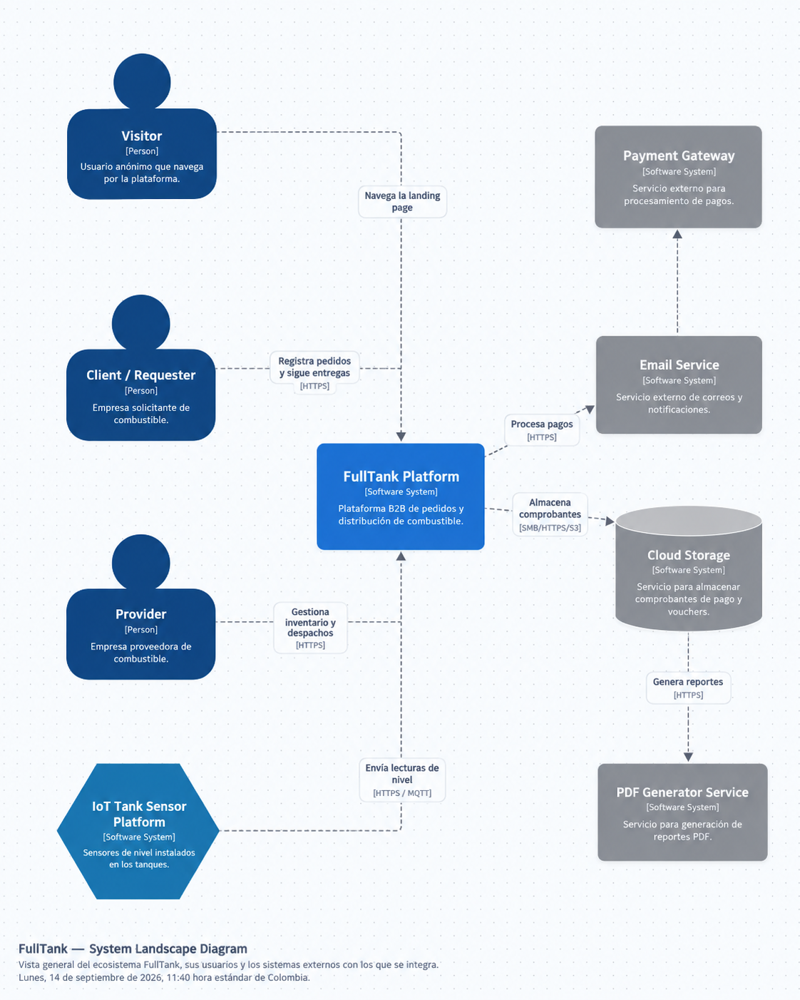

#### 4.1.3.2. Software Architecture Context Level Diagrams

En este nivel se presenta una vista de alto nivel de la arquitectura, donde el foco está en el sistema de software **FullTank Platform** como una "caja negra" y en las interacciones que mantiene con sus usuarios y con otros sistemas externos.

El *context diagram* muestra al FullTank Platform como un recuadro central, rodeado por los principales actores y sistemas con los que se comunica:

- **Visitor:** usuario anónimo que navega la landing page para conocer la plataforma, revisar sus beneficios y registrarse en el sistema.
- **Associated Buyer:** representante de la empresa compradora cuyo tanque tiene instalado el dispositivo IoT. Consulta el nivel, el pedido generado y el estado de la entrega, y puede confirmar la recepción.
- **Fuel Distributor:** representante del Distribuidor Logístico de Combustible. Administra compradores asociados, acepta o rechaza solicitudes, mantiene la flota, revisa recomendaciones de conductor y cisterna, supervisa el despacho y consulta la trazabilidad.
- **Tank IoT Device:** dispositivo externo que transmite el nivel del tanque y otros datos configurados. Su evento `LowFuelLevelDetected` inicia el flujo de solicitud en FullTank.
- **Email Service:** sistema externo encargado de enviar correos electrónicos, principalmente para la recuperación de contraseñas y notificaciones relacionadas a autenticación.
- **Cloud Storage:** sistema externo utilizado para almacenar comprobantes de pago (vouchers) cargados por los clientes.
- **PDF Generator Service:** sistema externo encargado de generar reportes en formato PDF, como resúmenes de consumo y ventas.

En el diagrama se representan las relaciones entre estos elementos, destacando que los usuarios (Visitor, Client y Provider) interactúan directamente con FullTank, mientras que el sistema se encarga de orquestar la comunicación con los servicios externos (correo, almacenamiento y generación de reportes). Esta vista permite comprender el alcance del sistema, sus límites de responsabilidad y el ecosistema en el que opera antes de entrar en detalles internos.

  
  
<em>Figura 4.2: Diagrama de contexto del sistema FullTank.</em>

#### 4.1.3.3. Software Architecture Container Level Diagrams

FullTank se compone de los siguientes contenedores:

| Contenedor | Tecnología | Responsabilidad |
|---|---|---|
| Landing Page | HTML, CSS, JavaScript | Presenta la propuesta de valor, los planes y el contacto, y dirige al registro. |
| Web Application | Angular 21, Angular Material, Chart.js, ngx-translate | SPA del distribuidor (panel, solicitudes, órdenes, clientes y tanques, flota, entregas, productos, pagos y analítica) y del comprador asociado (tanques, solicitudes, órdenes y pagos). Organizada por *bounded context* con las capas *domain*, *application*, *infrastructure* y *presentation*. |
| Mobile Application | Flutter | App del distribuidor para operar en campo. Está planificada y no forma parte del Sprint 1; en los diagramas aparece con borde punteado. |
| IAM, Equipment, Telemetry, Replenishment, Inventory, Supply, Ordering, Fleet, Fulfillment, Payment, Notification y Analytics | Spring Boot 4, Java 26 (módulos) | Un contenedor por *bounded context*. Cada uno expone sus endpoints bajo `/api` (salvo Supply, que solo usan otros contextos), es dueño de sus tablas y publica a los demás solo lo que está en su paquete `api` (interfaces y eventos). Replenishment, Ordering y Fulfillment forman el dominio core. |
| Application Flows | Spring Boot 4, Java 26 (módulo) | Raíz de composición: orquesta en una transacción la aceptación de solicitudes y la asignación de entregas. |
| FullTank Database | MySQL 8 | Esquema único versionado con Flyway (36 migraciones, numeradas de V1 a V37 sin la V31), con las tablas de cada contexto, el outbox (`event_publications`) y el inbox (`consumed_events`); Hibernate solo valida el esquema (`ddl-auto=validate`). |
| Tank Monitoring Device | ESP32 + JSN-SR04T, C++ (Arduino) | Mide la distancia al combustible, calcula el volumen y lo envía a `POST /api/telemetry/readings` con su `X-Device-Token`. |

Los contenedores de los *bounded contexts* y Application Flows se agrupan como **FullTank API** porque se compilan y despliegan juntos: son módulos de un solo proceso Spring Boot (monolito modular), no microservicios. Se modelan como contenedores para que el diagrama muestre qué contexto atiende a cada cliente, cómo se comunican entre sí y qué parte del esquema usa cada uno.

La Web Application llama a cada contexto por HTTPS con JSON y un token JWT *Bearer*; la Mobile Application usará el mismo canal cuando se implemente. El dispositivo usa un canal separado hacia Telemetry: no tiene usuario ni JWT y se autentica con un token rotativo cuyo hash guarda Equipment. Entre contextos, las llamadas son en proceso a través de las interfaces `api`, y los eventos (línea punteada) viajan por el outbox. Telemetry, Equipment, Replenishment, Inventory, Ordering, Fleet, Fulfillment, Payment y Application Flows resuelven el tenant o la propiedad del recurso con IAM (`TenantAccess`, y `CurrentUserAccess` en Ordering); esas nueve flechas se omiten en esta vista para que sea legible y aparecen en el diagrama de componentes de IAM.

  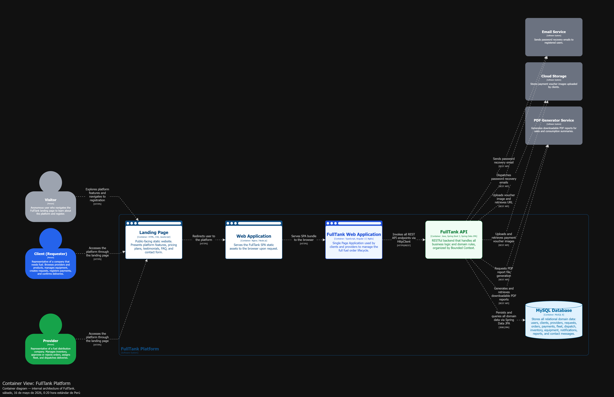
  
<em>Figura 4.3: Diagrama de contenedores de FullTank.</em>

#### 4.1.3.4. Software Architecture Deployment Diagrams

La solución está desplegada con servicios administrados. El diagrama de producción muestra estos nodos:

- **Vercel:** sirve el *build* de producción de la Web Application (`ng build`). Como es una SPA, todas las rutas se reescriben a `index.html`.
- **Render:** ejecuta la API como un *Web Service* a partir del `Dockerfile` del repositorio. La imagen se construye en dos etapas (compilación con `eclipse-temurin:26-jdk` y ejecución con `eclipse-temurin:26-jre`) y los doce *bounded contexts* y Application Flows corren en el mismo proceso. Render define el puerto con la variable `PORT` y el perfil `prod` con `SPRING_PROFILES_ACTIVE`.
- **Aiven:** servicio administrado de MySQL 8. La API se conecta con TLS obligatorio (`sslMode=REQUIRED`) y un *pool* de hasta tres conexiones; Flyway aplica las migraciones al iniciar.
- **Hosting de la Landing Page:** sitio estático en HTML, CSS y JavaScript.
- **Instalación del comprador:** el ESP32 montado en el tanque se conecta por Wi-Fi y envía sus lecturas a la API.
- **Proveedor de correo:** servidor SMTP para el restablecimiento de contraseña.

  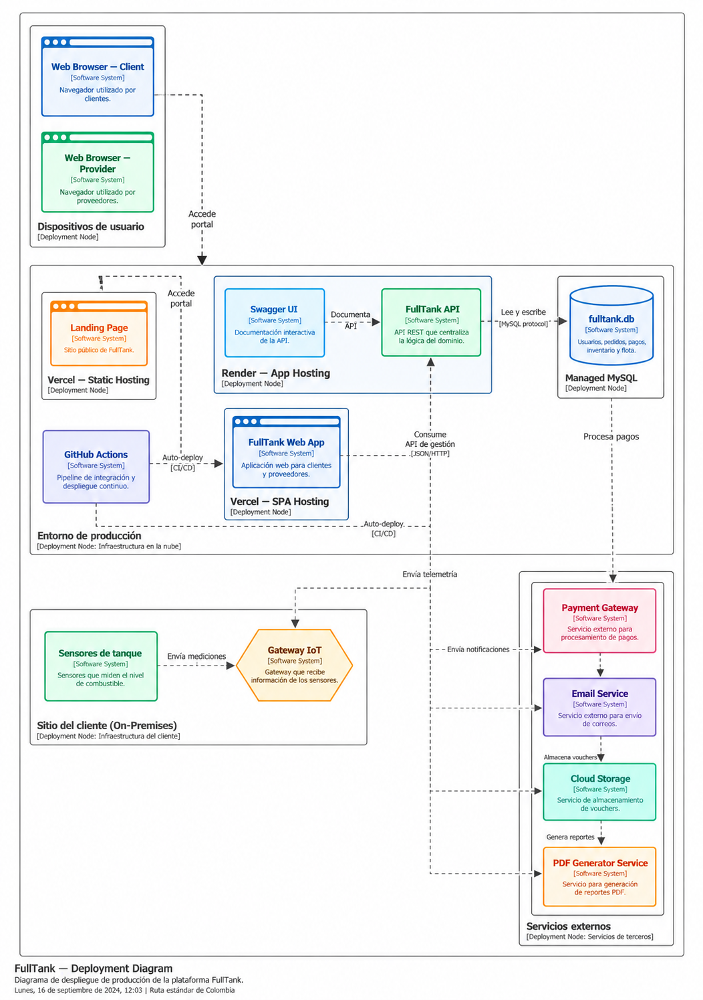

## 4.2. Tactical-Level Domain-Driven Design

En este nivel se documentan los bounded contexts **IAM**, **Notification**, **Inventory**, **Equipment**, **Fulfillment**, **Ordering**, **Payment**, **Analytics**, **Telemetry**, **Replenishment**, **Fleet** y **Supply**, además del módulo Application Flows (sección 4.1.1.1), con sus capas **Domain**, **Interface**, **Application** e **Infrastructure**, sus agregados principales y la evidencia disponible. La documentación se basa en el código del backend y en las pruebas y la documentación OpenAPI descritas en el capítulo VI. Los módulos de seguimiento del conductor y de geocerca y válvula no se documentan porque están fuera del alcance (sección 4.1.1.1).

### 4.2.1. Bounded Context: IAM

| Elemento | Descripción |
|---|---|
| Propósito | Autenticar a los usuarios, gestionar organizaciones y membresías, y resolver el tenant de cada petición. |
| Actores | Distribuidor (registro, onboarding e invitaciones), comprador asociado (inicio de sesión) y administrador de plataforma. |
| Relación con otros contextos | Es upstream de todos los contextos de negocio mediante `TenantAccess`, `MembershipAccess`, `MembershipDirectory` y `LegacyCompanyDirectory`; Equipment y Fulfillment usan además `BuyerCompanyDirectory`, y Equipment registra compradores con `BuyerCompanyRegistration`. Usa el servicio SMTP para el restablecimiento de contraseña. |

  
  
<em>Figura 4.14: Límites y responsabilidades del Bounded Context IAM.</em>

#### 4.2.1.1. Domain Layer

IAM combina dos modelos de identidad. El modelo de **organizaciones** (`Organization`, `Membership`, `OrganizationInvitation`) define a qué tenant pertenece cada usuario y con qué rol; es el que usan los contextos nuevos. El modelo de **compañías** (`BuyerCompany`, `ProviderCompany`) se conserva porque órdenes, pagos y flota todavía se relacionan por `companyId` y `providerId`. Las invariantes principales son que una membresía revocada no da acceso, que solo un `OWNER` o `ADMIN` puede invitar y nunca al rol `OWNER`, que una invitación solo se acepta si está pendiente y no venció, y que el conjunto de roles de un usuario es válido.

| Clase | Tipo | Propósito |
|---|---|---|
| `User` | Aggregate Root | Usuario con credenciales, roles y vínculo con su compañía (`companyId`) o distribuidor (`providerId`). Expone `addRole()` y `addRoles()`. |
| `Role` | Entity | Rol asignable (`ROLE_BUYER`, `ROLE_PROVIDER`, `ROLE_ADMIN`); valida el conjunto de roles y define el rol por defecto. |
| `Organization` | Aggregate Root | Organización con nombre, RUC, tipo (`DISTRIBUTOR` o `CUSTOMER`) y estado activo. Expone `activate()` y `deactivate()`. |
| `Membership` | Aggregate Root | Relación usuario–organización con rol (`OWNER`, `ADMIN`, `MEMBER`). Expone `revoke()` y `reactivate()`. |
| `OrganizationInvitation` | Aggregate Root | Invitación por correo con token y vencimiento. Expone `isUsable()`, `accept()` y `revoke()`. |
| `BuyerCompany` | Aggregate Root | Compañía del comprador en el modelo heredado (RUC, sector, contacto). |
| `ProviderCompany` | Aggregate Root | Compañía del distribuidor en el modelo heredado (RUC, dirección, tipos de combustible ofrecidos). |
| `Roles`, `OrganizationType`, `MembershipRole`, `InvitationStatus` | Value Objects | Restringen los valores válidos de rol, tipo de organización, rol de membresía y estado de invitación. |
| `SignUpCommand`, `SignInCommand`, `OnboardOrganizationCommand`, `CreateOrganizationCommand`, `GrantMembershipCommand`, `RevokeMembershipCommand`, `InviteMemberCommand`, `AcceptInvitationCommand`, `RevokeInvitationCommand`, `CreateBuyerCompanyCommand`, `CreateProviderCompanyCommand`, `SeedRolesCommand` | Domain Commands | Intenciones de registro, autenticación, onboarding, membresía, invitación y alta de compañías. |
| `GetUserByIdQuery`, `GetUserByUsernameQuery`, `GetAllUsersQuery`, `GetOrganizationByIdQuery`, `GetMembershipsByUserIdQuery`, `GetInvitationByIdQuery`, `GetInvitationByTokenQuery`, `GetBuyerCompanyByIdQuery`, `GetAllBuyerCompaniesQuery`, `GetProviderCompanyByIdQuery`, `GetAllProviderCompaniesQuery` | Domain Queries | Consultas de usuarios, organizaciones, membresías, invitaciones y compañías. |
| `UserRepository`, `RoleRepository`, `OrganizationRepository`, `MembershipRepository`, `OrganizationInvitationRepository`, `BuyerCompanyRepository`, `ProviderCompanyRepository` | Domain Repositories | Puertos de persistencia de cada agregado. |

#### 4.2.1.2. Interface Layer

| Clase / Componente | Tipo | Propósito |
|---|---|---|
| `AuthenticationController` | REST Controller | `/api/authentication`: `sign-up`, `sign-in`, `password-reset/request` y `password-reset/confirm`. |
| `OnboardingController` | REST Controller | `POST /api/onboarding`: crea la organización (de tipo distribuidor o cliente) y la membresía `OWNER` del usuario. |
| `InvitationsController` | REST Controller | Invita miembros a una organización (solo `OWNER` o `ADMIN`, con rol `ADMIN` o `MEMBER`), acepta una invitación por token y la revoca. |
| `MyOrganizationsController` | REST Controller | `GET /api/me/organizations`: organizaciones y rol del usuario autenticado. |
| `UsersController` | REST Controller | Consulta de usuarios (`/api/users`). |
| `AdminUsersController` | REST Controller | `POST /api/admin/users/{userId}/promote`: otorga `ROLE_ADMIN`; solo para administradores. |
| `BuyerCompaniesController`, `ProviderCompaniesController` | REST Controllers | CRUD de compañías del modelo heredado; el distribuidor no puede editar su propia calificación. |
| `SignUpResource`, `SignInResource`, `AuthenticatedUserResource`, `UserResource`, `OnboardOrganizationResource`, `OrganizationResource`, `OrganizationMembershipResource`, `InviteMemberResource`, `InvitationResource`, `PasswordResetRequestResource`, `PasswordResetConfirmResource`, `CreateBuyerCompanyResource`, `BuyerCompanyResource`, `CreateProviderCompanyResource`, `ProviderCompanyResource` | REST Resources | Cuerpos de entrada y representaciones de salida. |
| `SignUpCommandFromResourceAssembler`, `SignInCommandFromResourceAssembler`, `AuthenticatedUserResourceFromEntityAssembler`, `UserResourceFromEntityAssembler`, `OrganizationResourceFromDomainAssembler`, `InvitationResourceFromDomainAssembler`, `CreateBuyerCompanyCommandFromResourceAssembler`, `BuyerCompanyResourceFromEntityAssembler`, `CreateProviderCompanyCommandFromResourceAssembler`, `ProviderCompanyResourceFromEntityAssembler` | Assemblers | Convierten recursos en comandos y agregados en recursos. |
| `IamContextFacade` | Context Facade | Expone a otros módulos la consulta de usuarios y de compañías heredadas (compradora y distribuidora). |

#### 4.2.1.3. Application Layer

| Clase / Componente | Tipo | Propósito |
|---|---|---|
| `UserCommandService` / `UserCommandServiceImpl` | Command Service | Registro con contraseña cifrada y organización propia, e inicio de sesión que devuelve el JWT. |
| `OnboardingCommandService` / `OnboardingCommandServiceImpl` | Command Service | Crea la organización y la membresía `OWNER` en la misma transacción. |
| `InvitationCommandService` / `InvitationCommandServiceImpl` | Command Service | Emite invitaciones con vigencia de 7 días, las acepta y las revoca. |
| `MembershipCommandService`, `OrganizationCommandService`, `RoleCommandService` (+ `Impl`) | Command Services | Otorgan o revocan membresías, crean organizaciones y siembran los roles. |
| `BuyerCompanyCommandService`, `ProviderCompanyCommandService` (+ `Impl`) | Command Services | Alta y edición de compañías heredadas. |
| `PasswordResetService` | Command Service | Genera un token de un solo uso con vencimiento, envía el enlace por correo y confirma la nueva contraseña. |
| `UserQueryService`, `OrganizationQueryService`, `MembershipQueryService`, `InvitationQueryService`, `BuyerCompanyQueryService`, `ProviderCompanyQueryService` (+ `Impl`) | Query Services | Resuelven las consultas del dominio. |
| `TokenService`, `HashingService` | Outbound Service Ports | Contratos para emitir y validar el JWT y para cifrar contraseñas. |
| `ApplicationReadyEventHandler` | Event Handler | Siembra los roles al iniciar la aplicación. |

#### 4.2.1.4. Infrastructure Layer

| Clase / Componente | Tipo | Propósito |
|---|---|---|
| `WebSecurityConfiguration` | Security Configuration | Cadena de seguridad *stateless*; deja públicas la autenticación, Swagger, la ingesta de telemetría y el alta de compañías. |
| `BearerAuthorizationRequestFilter`, `UnauthorizedRequestHandlerEntryPoint`, `UsernamePasswordAuthenticationTokenBuilder` | Security Components | Leen el JWT de cada petición, arman la autenticación y responden 401. |
| `TokenServiceImpl` / `BearerTokenService` | JWT Adapter | Emiten y validan el JWT (jjwt) con el secreto `AUTHORIZATION_JWT_SECRET`; vigencia de 7 días. |
| `HashingServiceImpl` / `BCryptHashingService` | Hashing Adapter | Cifran contraseñas con BCrypt. |
| `UserDetailsServiceImpl`, `UserDetailsImpl` | Spring Security Adapters | Cargan el usuario y sus roles para Spring Security. |
| `TenantAccessImpl`, `MembershipAccessImpl`, `MembershipDirectoryImpl`, `LegacyCompanyDirectoryImpl` | Public API Implementations | Resuelven desde el principal el distribuidor, la organización y los miembros activos, comprueban si el usuario puede administrar la organización (`canManageOrganization`) y mapean compañías heredadas. |
| `BuyerCompanyDirectoryImpl`, `BuyerCompanyRegistrationImpl` | Public API Implementations | Buscan una compañía compradora por id o por RUC exacto, y registran una nueva (o reutilizan una existente) junto con su organización para que el distribuidor pueda vincularla. |
| `CurrentUserAccess` | Authorization Helper | Verificaciones de propiedad usadas en `@PreAuthorize` por controladores heredados. |
| `UserPersistenceEntity`, `RolePersistenceEntity`, `OrganizationPersistenceEntity`, `MembershipPersistenceEntity`, `OrganizationInvitationPersistenceEntity`, `BuyerCompanyPersistenceEntity`, `ProviderCompanyPersistenceEntity`, `PasswordResetTokenEntity` | JPA Entities | Tablas `users`, `roles`, `user_roles`, `organizations`, `memberships`, `organization_invitations`, `buyer_companies`, `provider_companies` y `password_reset_tokens`. |
| `*PersistenceAssembler`, `*RepositoryImpl`, `*PersistenceRepository` | Assemblers, Adapters y Spring Data | Convierten entre dominio y JPA e implementan los puertos de repositorio. |

#### 4.2.1.5. Bounded Context Software Architecture Component Level Diagram

La vista de componentes muestra la separación entre Interfaces, Application, Domain e Infrastructure y las dependencias dirigidas hacia el dominio. IAM se integra con el resto de la plataforma mediante la identidad autenticada y la autorización de recursos.

  
  
<em>Figura 4.15: Capas y componentes principales de IAM.</em>

#### 4.2.1.6. Bounded Context Software Architecture Code Level Diagrams.

##### 4.2.1.6.1. Bounded Context Domain Layer Class Diagram.

##### 4.2.1.6.2. Bounded Context Database Design Diagram.

| Tabla | Contenido principal |
|---|---|
| `users`, `roles`, `user_roles` | Usuario con contraseña cifrada y compañía o distribuidor vinculado, catálogo de roles y su relación. |
| `organizations`, `memberships`, `organization_invitations` | Organización (RUC único y tipo), membresía con rol (única por organización y usuario) e invitación con token y vencimiento. |
| `buyer_companies`, `provider_companies`, `provider_company_fuel_types` | Compañías del modelo heredado y tipos de combustible que ofrece el distribuidor. |
| `password_reset_tokens` | Hash del token de recuperación, usuario y vencimiento. |

#### 4.2.1.7. Runtime Evidence

| Operación | Resultado |
|---|---:|
| Registro de usuario y compañía | 201 Created |
| Inicio de sesión y emisión de JWT | 200 OK |
| Solicitud de recuperación de contraseña | 202 Accepted |
| Confirmación de recuperación | 204 No Content |
| Acceso protegido sin token | 401 Unauthorized |
| Acceso a compañía ajena | 403 Forbidden |

### 4.2.2. Bounded Context: Notification

| Elemento | Descripción |
| :------: | :---------: |
| Propósito | Generar la bandeja de notificaciones in-app de cada usuario a partir de los eventos de negocio (solicitudes, órdenes, entregas y pagos). |
| Actores | Compradores asociados y distribuidores, que consultan su propia bandeja y marcan sus notificaciones como leídas. |
| Relación con otros contextos | Consume los eventos `replenishment.*.v1`, `delivery.*.v1` e `inventory.catalog-empty.v1` (Published Language / Conformist) y resuelve a los destinatarios con `MembershipDirectory` de IAM, que entrega solo a los miembros activos. Conserva `referenceId` como referencia al hecho de origen, sin asumir el ciclo de vida de órdenes o usuarios. |

#### 4.2.2.1. Domain Layer

El core de Notification es el agregado raíz `Notification`. Su invariantes principal es que toda notificación nace como no leída (`read = false`) y solo el agregado puede cambiar ese estado mediante `markAsRead()`. El agregado nace de un comando de reparto (`NotificationFanoutCommand`) y conserva el destinatario, la organización, el tipo, el contenido, el identificador del evento de origen, el canal (hoy solo `IN_APP`), el estado de entrega (`DELIVERED` o `FAILED`) y el número de intentos. Un mismo evento no genera dos filas para el mismo usuario y canal (restricción única sobre `event_id`, `user_id` y `channel`).

|     Clase     |      Tipo      |                                  Propósito                                 |
| :-----------: | :------------: | :------------------------------------------------------------------------: |
| `Notification` | Aggregate Root | Gestiona el destinatario, tipo, título, mensaje, estado de lectura, referencia del evento y fecha de creación. Expone `markAsRead()` y `recordFailedAttempt()`. |
| `NotificationType` | Value Object | Restringe los tipos de notificación (por ejemplo `NEW_REQUEST`, `ORDER_ACCEPTED`, `DELIVERY_COMPLETED`, `PAYMENT_COMPLETED` y `GENERAL`). Lo acompañan `NotificationChannel` y `NotificationDeliveryStatus`. |
| `NotificationFanoutCommand` | Domain Command | Define los datos de una notificación dirigida a un destinatario a partir de un evento. |
| `MarkNotificationAsReadCommand` | Domain Command | Identifica la notificación cuyo estado debe cambiar a leído. |
| `GetNotificationByIdQuery` | Domain Query | Define la consulta de una notificación por su identificador. |
| `GetNotificationsByUserIdQuery` | Domain Query | Define la consulta de todas las notificaciones asociadas a un usuario. |
| `GetUnreadNotificationsByUserIdQuery` | Domain Query | Define la consulta de las notificaciones pendientes de lectura de un usuario. |
| `NotificationRepository` | Domain Repository | Expone el puerto de persistencia que utiliza el dominio sin depender de JPA o Spring Data. |

#### 4.2.2.2. Interface Layer

| Clase / Componente | Tipo | Propósito |
| :----------------: | :--: | :-------: |
| `MeNotificationsController` | REST Controller | `/api/me/notifications`: lista las notificaciones del usuario autenticado, las no leídas (`/unread`) y marca una propia como leída (`/{notificationId}/read`). Un usuario nunca ve la bandeja de otro. |
| `NotificationResource` | REST Resource (DTO) | Define la representación JSON que se devuelve al cliente. |
| `NotificationResourceFromEntityAssembler` | Assembler / Transformer | Convierte el agregado de dominio en `NotificationResource` para la respuesta HTTP. |

#### 4.2.2.3. Application Layer

| Clase / Componente | Tipo | Propósito |
| :----------------: | :--: | :-------: |
| `NotificationCommandService` | Command Service (Interface) | Define el contrato para repartir notificaciones y marcar una como leída. |
| `NotificationCommandServiceImpl` | Command Service Implementation | Construye el agregado, lo persiste y ejecuta `markAsRead()`. Devuelve un error de dominio cuando el identificador no existe. |
| `NotificationQueryService` | Query Service (Interface) | Define el contrato para consultar por id, usuario y estado de lectura. |
| `NotificationQueryServiceImpl` | Query Service Implementation | Ejecuta las consultas y delega el acceso de datos al puerto `NotificationRepository`. |
| `NotificationFanoutListener` | Event Listener | Consume cada evento de negocio una sola vez (*inbox*), obtiene los miembros activos de la organización destinataria y guarda una notificación por cada uno. |

#### 4.2.2.4. Infrastructure Layer

| Clase / Componente | Tipo | Propósito |
| :----------------: | :--: | :-------: |
| `NotificationPersistenceEntity` | JPA Entity | Representa la tabla `notifications`; almacena el tipo como texto y el estado de lectura en `is_read`. |
| `NotificationPersistenceAssembler` | Assembler / Mapper | Convierte entre `Notification` y `NotificationPersistenceEntity`, manteniendo separado el modelo de dominio del modelo persistente. |
| `NotificationPersistenceRepository` | Spring Data JPA Repository | Ejecuta la persistencia y las consultas por usuario y por estado no leído. |
| `NotificationRepositoryImpl` | Repository Adapter | Implementa el puerto del dominio y conecta sus operaciones con Spring Data JPA. |

#### 4.2.2.5. Bounded Context Software Architecture Component Level Diagrams.

#### 4.2.2.6. Bounded Context Software Architecture Code Level Diagrams.

#### 4.2.2.6.1. Bounded Context Domain Layer Class Diagram.

##### 4.2.2.6.2. Bounded Context Database Design Diagram.

| Tabla | Contenido principal |
|---|---|
| `notifications` | `id`, `user_id`, `organization_id`, `type`, `title`, `message`, `is_read`, `reference_id`, `event_id`, `channel`, `delivery_status`, `attempts`, `last_attempt_at`; único `(event_id, user_id, channel)`. |

#### 4.2.2.7. Runtime Evidence.

| Operación | Resultado |
| :-------: | :-------: |
| Consultar mis notificaciones y las no leídas | `200 OK` |
| Marcar una notificación propia como leída | `200 OK` |
| Consultar no leídas después de marcar | `200 OK`, colección vacía |
| Acceso de proveedor al endpoint de comprador | `403 Forbidden` |
| Swagger sin token | `401 Unauthorized` |

### 4.2.3. Bounded Context: Inventory

| Elemento | Descripción |
| :------: | :---------: |
| Propósito | Administrar el catálogo de productos de combustible ofrecidos por distribuidores y publicados para compradores asociados. |
| Actores | Distribuidores que crean y actualizan productos, y compradores asociados que consultan el catálogo. |
| Relación con otros contextos | Valida identidad y propiedad mediante IAM; conserva el identificador del distribuidor y puede ser referenciado por solicitudes u órdenes sin incorporar su lógica al agregado. |

#### 4.2.3.1. Domain Layer

El core de Inventory es el agregado raíz `FuelProduct`. Este agregado concentra los datos comerciales del producto y las operaciones que modifican su estado: creación, actualización general y actualización de stock. `active` se inicializa en `true` cuando el comando no lo especifica, de modo que el producto queda publicado por defecto; `update()` conserva su valor si la actualización no lo incluye.

|     Clase     |      Tipo      |                                  Propósito                                 |
| :-----------: | :------------: | :------------------------------------------------------------------------: |
| `FuelProduct` | Aggregate Root | Gestiona nombre, tipo de combustible, precio, unidad, stock disponible, capacidad, proveedor y estado de publicación. Expone `updateStock()` y `update()` como comportamiento del dominio. |
| `FuelType` | Value Object | Restringe los tipos de combustible válidos: `DIESEL`, `GASOLINE`, las gasolinas de 84, 90, 95 y 97 octanos, `GLP` y `GNV`. |
| `CreateFuelProductCommand` | Domain Command | Define los datos iniciales de un producto de combustible. |
| `UpdateFuelProductCommand` | Domain Command | Define los datos editables del producto y su estado de publicación. |
| `UpdateFuelProductStockCommand` | Domain Command | Define el nuevo stock disponible para un producto existente. |
| `DeleteFuelProductCommand` | Domain Command | Identifica el producto que debe eliminarse. |
| `GetAllFuelProductsQuery` | Domain Query | Define la consulta del catálogo visible para compradores. |
| `GetFuelProductByIdQuery` | Domain Query | Define la consulta de un producto por identificador. |
| `GetFuelProductsByProviderIdQuery` | Domain Query | Define la consulta de productos pertenecientes a un proveedor. |
| `FuelProductRepository` | Domain Repository | Expone el puerto de persistencia que utiliza `FuelProduct` sin depender de la implementación JPA. |

#### 4.2.3.2. Interface Layer

| Clase / Componente | Tipo | Propósito |
| :----------------: | :--: | :-------: |
| `FuelProductsController` | REST Controller | Expone la API `/api/fuel-products`: creación, consultas (todos, por id y por distribuidor), actualización general, actualización de stock (`POST /{fuelProductId}/update-stock`), eliminación y el aviso de catálogo vacío (`POST /provider/{providerId}/empty-catalog-alert`), que origina `inventory.catalog-empty.v1`. Valida la propiedad del distribuidor antes de operar. |
| `CreateFuelProductResource` | REST Resource (DTO) | Define el cuerpo JSON de entrada para crear un producto. |
| `FuelProductResource` | REST Resource (DTO) | Define la representación JSON de un producto para el catálogo o el proveedor. |
| `UpdateFuelProductResource` | REST Resource (DTO) | Define los datos de actualización general del producto. |
| `UpdateFuelProductStockResource` | REST Resource (DTO) | Define el nuevo stock enviado por el cliente. |
| `CreateFuelProductCommandFromResourceAssembler` | Assembler / Transformer | Convierte el recurso HTTP de creación en `CreateFuelProductCommand`. |
| `UpdateFuelProductCommandFromResourceAssembler` | Assembler / Transformer | Convierte el recurso HTTP de actualización en `UpdateFuelProductCommand`. |
| `UpdateFuelProductStockCommandFromResourceAssembler` | Assembler / Transformer | Convierte el recurso HTTP de stock en `UpdateFuelProductStockCommand`. |
| `FuelProductResourceFromEntityAssembler` | Assembler / Transformer | Convierte el agregado de dominio en el recurso de respuesta. |

#### 4.2.3.3. Application Layer

| Clase / Componente | Tipo | Propósito |
| :----------------: | :--: | :-------: |
| `FuelProductCommandService` | Command Service (Interface) | Define el contrato para crear, actualizar stock, actualizar datos y eliminar productos. |
| `FuelProductCommandServiceImpl` | Command Service Implementation | Coordina los comandos, recupera el agregado antes de modificarlo, persiste los cambios y traduce inexistencia o conflictos de integridad a errores de aplicación. |
| `FuelProductQueryService` | Query Service (Interface) | Define el contrato para consultar por id, proveedor o colección completa. |
| `FuelProductQueryServiceImpl` | Query Service Implementation | Ejecuta las consultas y delega la recuperación al puerto `FuelProductRepository`. |

#### 4.2.3.4. Infrastructure Layer

| Clase / Componente | Tipo | Propósito |
|:--|:--|:--|
| `FuelProductPersistenceEntity` | JPA Entity | Representa la tabla `fuel_products` y persiste tipo, precio, stock, capacidad, proveedor y estado `active`. |
| `FuelProductPersistenceAssembler` | Assembler / Mapper | Convierte entre `FuelProduct` y `FuelProductPersistenceEntity`. |
| `FuelProductPersistenceRepository` | Spring Data JPA Repository | Ejecuta la persistencia y la consulta de productos por `providerId`. |
| `FuelProductRepositoryImpl` | Repository Adapter | Implementa el puerto del dominio y adapta sus operaciones a Spring Data JPA. |

#### 4.2.3.5. Bounded Context Software Architecture Component Level Diagrams.

#### 4.2.3.6. Bounded Context Software Architecture Code Level Diagrams.

#### 4.2.3.6.1. Bounded Context Domain Layer Class Diagram.

##### 4.2.3.6.2. Bounded Context Database Design Diagram.

| Tabla | Contenido principal |
|---|---|
| `fuel_products` | `id`, `provider_id`, `name`, `fuel_type`, `price_per_unit`, `unit`, `available_stock`, `capacity`, `active`. |

#### 4.2.3.7. Runtime Evidence.

| Operación | Resultado |
| :-------: | :-------: |
| Crear producto | `201 Created` |
| Consultar por id y proveedor | `200 OK` |
| Actualizar stock y producto | `200 OK` |
| Eliminar producto | `204 No Content` |
| Consultar producto eliminado | `404 Not Found` |
| Acceso de proveedor al endpoint de comprador | `403 Forbidden` |
| Swagger sin token | `401 Unauthorized` |

La evidencia visual disponible se conserva por módulo en `Report/assets/chapter-4` y en sus subdirectorios de diagramas. Cuando no existe un artefacto específico para un bounded context, la sección enlaza la vista global disponible o lo indica expresamente.

### 4.2.4. Cross-Cutting Software Architecture Views

Presenta los diagramas que descienden al nivel de código, contrastando el modelo de objetos del dominio con el diseño de la base de datos. Estos diagramas complementan al *Component Diagram* de la API Application y a los contenedores definidos, proporcionando una vista centrada en clases, relaciones y responsabilidades.

#### 4.2.4.1. Software Architecture Code Level Diagrams.

##### 4.2.4.1.1. Software Architecture Domain Layer Class Diagrams.

A nivel de clases se modelan, por un lado, las clases del frontend en función de los módulos y vistas que consumen los servicios expuestos por la API y, por otro, las clases del backend que reflejan la implementación detallada de los módulos definidos como componentes dentro de la API.

**Diagramas de clases del Frontend**

La aplicación web sigue una arquitectura modular basada en *bounded contexts*, donde cada contexto se organiza en packages independientes con las siguientes capas:

- **domain/model:** contiene las estructuras que representan los modelos de datos y value objects utilizados en la interfaz.
- **application:** incluye servicios de aplicación que coordinan la lógica necesaria para interactuar con el backend.
- **infrastructure/api:** encapsula las llamadas HTTP a la API mediante un cliente centralizado.
- **presentation:** agrupa las vistas y componentes de interfaz de usuario, así como los mecanismos de gestión de estado cuando es necesario compartir información entre múltiples vistas.

*Diagrama del Frontend completo:*

  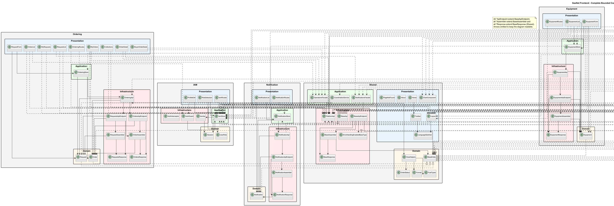

El diagrama completo del frontend muestra la organización general de la capa de presentación, incluyendo todos los *bounded contexts* agrupados en packages independientes, los mecanismos de gestión de estado global, el cliente HTTP centralizado con manejo de autenticación, y los componentes encargados de la protección de rutas según el rol del usuario autenticado. Cada vista se conecta a su servicio correspondiente, el cual interactúa con la capa de infraestructura para consumir los servicios REST del backend.

*Diagrama del Frontend dividido por contextos:*

- **Identity & Access Frontend** — Responsabilidad: maneja las vistas de registro, inicio de sesión, recuperación de contraseña y edición de perfil de usuario.

  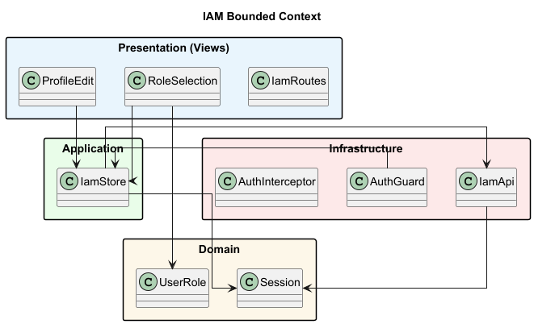

- **Ordering Frontend** — Responsabilidad: maneja las vistas del ciclo de vida completo de pedidos: solicitudes de abastecimiento, aceptación, rechazo, asignación, despacho, confirmación de entrega y pago.

  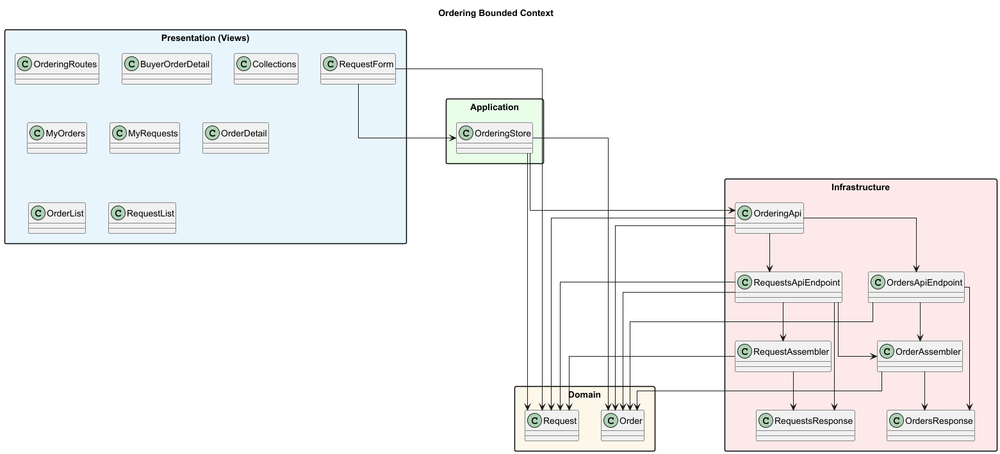

- **Payment Frontend** — Responsabilidad: maneja las vistas para que el cliente registre comprobantes de pago vinculados a una orden.

  

- **Fulfillment Frontend** — Responsabilidad: maneja las vistas de gestión de cisternas y conductores, la recomendación de conductor y cisterna, la asignación a órdenes aceptadas y el seguimiento del estado de la entrega.

  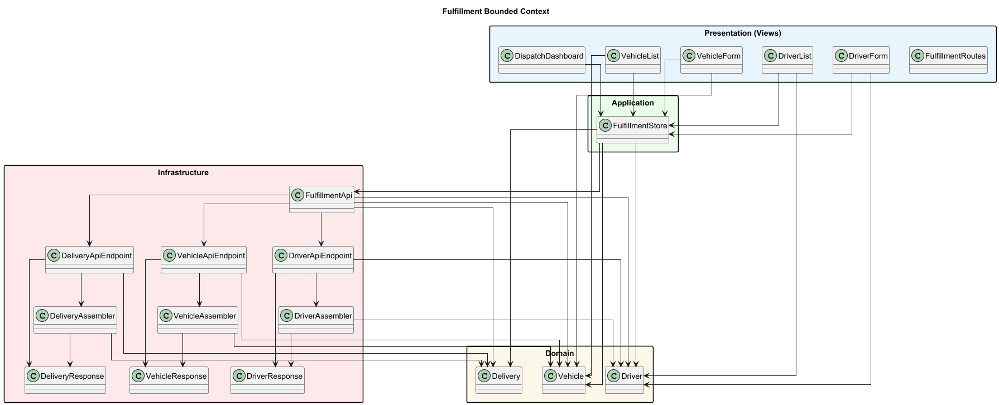

- **Notification Frontend** — Responsabilidad: maneja el panel de notificaciones dentro de la aplicación para informar a los usuarios sobre cambios en el estado de los pedidos.

  

- **Analytics Frontend** — Responsabilidad: maneja las vistas de indicadores del distribuidor y del comprador (gráficos de consumo y ventas).

  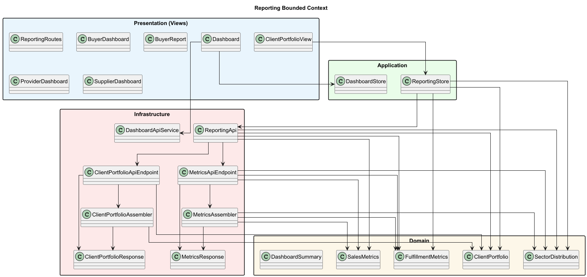

- **Equipment Frontend** — Responsabilidad: maneja las vistas para buscar y registrar compradores por RUC, registrar tanques con su dispositivo, configurar el umbral y consultar las lecturas.

  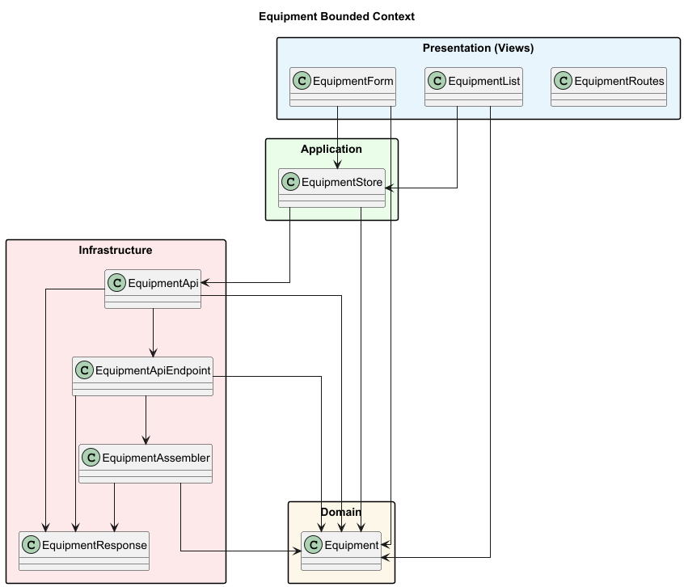

- **Inventory Frontend** — Responsabilidad: maneja las vistas de gestión del inventario de combustible por parte del proveedor, incluyendo el registro, actualización y eliminación de ítems, así como la visualización de niveles de stock y precio por litro.

  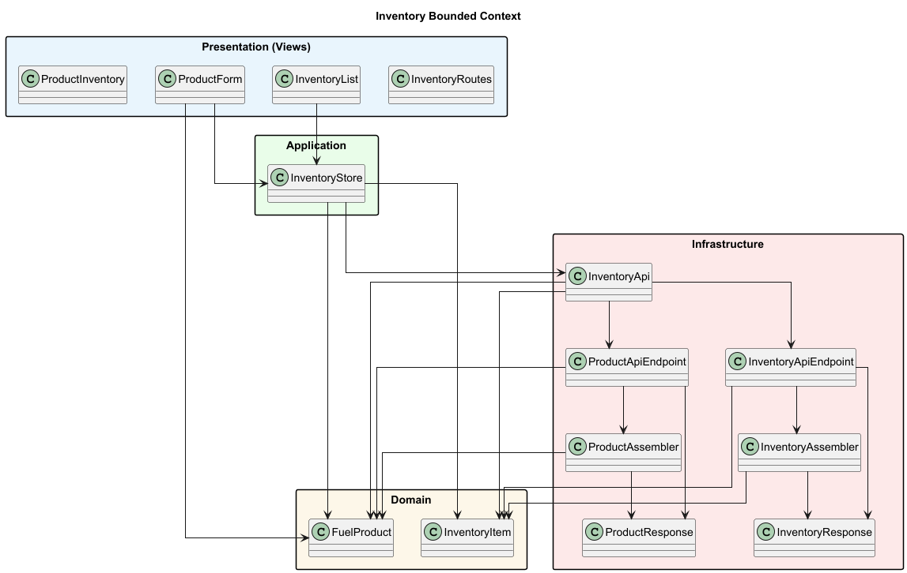

**Diagramas de clases del Backend**

El sistema sigue una arquitectura por capas organizada por *bounded contexts*, donde cada contexto mantiene una clara separación de responsabilidades:

- **interfaces:** expone los endpoints del sistema (controladores REST) y componentes encargados de transformar datos entre modelos externos e internos.
- **domain:** contiene las entidades, agregados, value objects, así como comandos, consultas e interfaces que definen el comportamiento del dominio.
- **application:** implementa la lógica de negocio mediante servicios que ejecutan comandos y consultas.
- **infrastructure:** define los mecanismos de persistencia y comunicación con sistemas externos, incluyendo repositorios y servicios de integración.

*Diagrama del Backend completo:*

  

El diagrama completo del backend muestra la organización de todos los *bounded contexts* como módulos independientes dentro del sistema. Se visualizan las dependencias entre contextos, donde **Application Flows** actúa como raíz de composición y coordina en una transacción la aceptación de solicitudes y la asignación de entregas mediante las interfaces `api` de cada contexto.

*Diagrama del Backend dividido por contextos:* los diagramas siguientes corresponden a la primera versión del modelo; Telemetry, Replenishment, Fleet y Supply no tienen diagrama propio.

- **Identity & Access Backend** — Responsabilidad: gestiona el registro de usuarios, autenticación, autorización y control de acceso.

  

- **Ordering Backend** — Responsabilidad: orquesta el ciclo de vida completo de la solicitud y el pedido, creada al aceptar una solicitud de abastecimiento, su confirmación, cancelación y pago.

  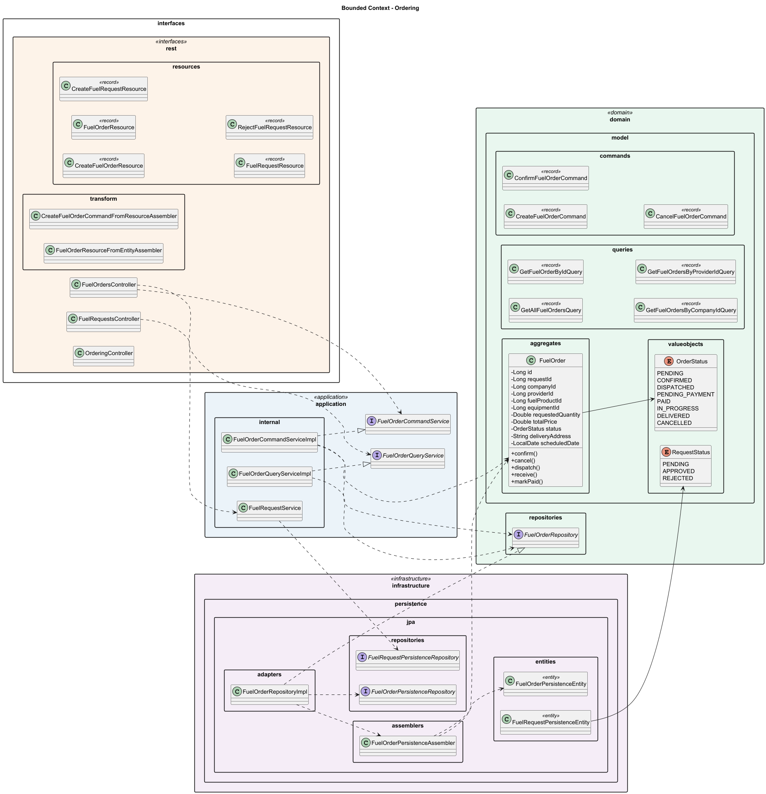

- **Payment Backend** — Responsabilidad: gestiona el registro y validación de pagos asociados a órdenes.

  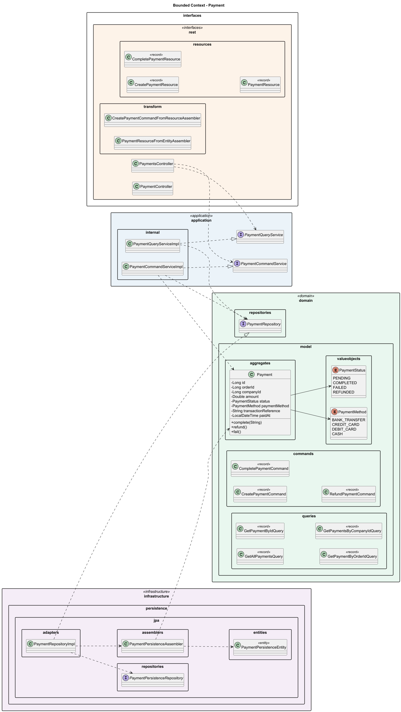

- **Fulfillment Backend** — Responsabilidad: gestiona el ciclo físico de la entrega con su historial de transiciones.

  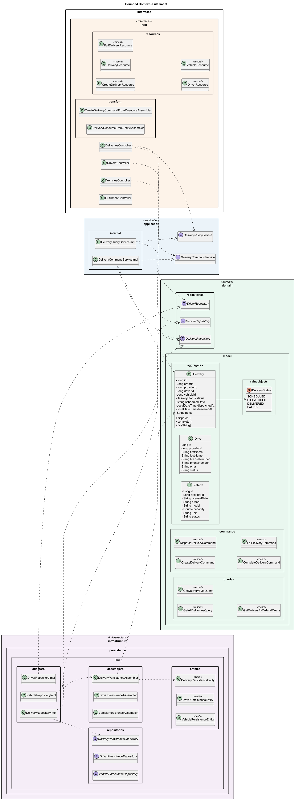

- **Notification Backend** — Responsabilidad: genera y gestiona notificaciones ante eventos relevantes del sistema.

  

- **Analytics Backend** — Responsabilidad: calcula indicadores de solo lectura leyendo Ordering, Payment y Fulfillment mediante una capa anticorrupción.

  

- **Equipment Backend** — Responsabilidad: gestiona los compradores vinculados, sus sitios y tanques, el vínculo temporal del dispositivo con el tanque y sus credenciales. Las lecturas las recibe Telemetry y la política de umbral la evalúa Replenishment.

  

- **Inventory Backend** — Responsabilidad: gestiona el registro, actualización y eliminación de los productos de combustible del proveedor, validando la información del ítem y controlando los niveles de stock disponible y precio por litro.

  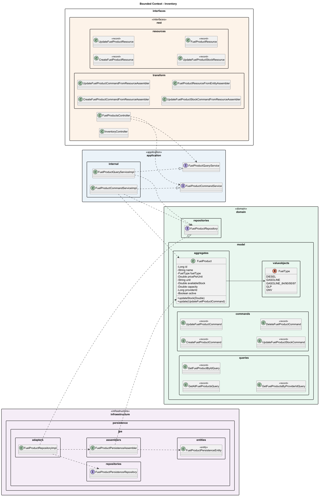

#### 4.2.4.2. Software Architecture Database Design Diagram.

La base de datos relacional es un esquema único de MySQL versionado con Flyway (36 migraciones, V1 a V37 sin la V31). Cada *bounded context* es dueño de sus tablas y los demás solo acceden a ellas mediante la interfaz `api` del contexto. A continuación se indica qué tablas pertenecen a cada contexto; las columnas de cada una están en la subsección de base de datos de su contexto (4.2.1 a 4.2.13).

| Contexto | Tablas |
|---|---|
| IAM | `users`, `roles`, `user_roles`, `organizations`, `memberships`, `organization_invitations`, `buyer_companies`, `provider_companies`, `provider_company_fuel_types`, `password_reset_tokens` |
| Equipment | `customer_accounts`, `customer_sites`, `tanks`, `tank_configurations`, `device_bindings`, `device_credentials`, `equipment` |
| Telemetry | `telemetry_readings` |
| Replenishment | `refill_policies`, `refill_episodes`, `replenishment_requests` |
| Inventory | `fuel_products` |
| Supply | `supply_reservations`, `supply_stock_locks` |
| Fleet | `drivers`, `vehicles` (cisternas), `fleet_reservations` |
| Fulfillment | `deliveries`, `delivery_state_transitions`, `delivery_business_journals` |
| Ordering | `fuel_orders` |
| Payment | `payments` |
| Notification | `notifications` |
| Analytics | Ninguna (solo lectura) |
| Shared Kernel | `event_publications` (*outbox*) y `consumed_events` (*inbox*) |

Las tablas `provider_ratings` (V32) y `fuel_requests` (V34) ya no existen.

> El diagrama general `baseDatos.png` y los diagramas por contexto (`baseDatos_identity.png`, `baseDatos_catalogo.png`, `baseDatos_ordering.png`, `baseDatosPayment.png`, `baseDatos_notification.png` y `baseDatos_analysis.png`) corresponden al modelo de la primera versión. Por eso no se incluyen en esta sección y cada contexto describe su esquema en una tabla.

### 4.2.5. Bounded Context: Equipment

| Elemento | Descripción |
|---|---|
| Propósito | Registrar a los compradores vinculados al distribuidor, sus sitios de entrega y sus tanques, y mantener el vínculo temporal entre cada tanque y el dispositivo IoT que lo mide, junto con las credenciales del dispositivo. Es el contexto donde empieza el flujo IoT: sin tanque y dispositivo vinculados no hay lecturas que atribuir ni solicitudes que generar. |
| Actores | Distribuidor (busca o registra al comprador por RUC, registra el tanque y su dispositivo), comprador asociado (consulta sus tanques) y el dispositivo ESP32 (se autentica con su credencial, a través de Telemetry). |
| Relación con otros contextos | Es upstream de Telemetry: expone `DeviceAuthentication` (autentica el token del dispositivo en un instante dado y devuelve el tanque y la organización a los que pertenece), `TankAssets` y `ActiveBinding`. Es upstream de Replenishment mediante `TankAssets`, `CustomerDirectory` y `TankLevelManuallyUpdatedEvent`, y a la vez configura la política del tanque en Replenishment (`TankRefillConfiguration`) durante el alta. Usa IAM (`TenantAccess`, `BuyerCompanyDirectory`, `BuyerCompanyRegistration`) para resolver al distribuidor y al comprador. |

  
  
<em>Canvas del Bounded Context Equipment (Event Storming).</em>

#### 4.2.5.1. Domain Layer.

Equipment tiene dos subdominios. El primero modela al cliente y su activo físico (`CustomerAccount`, `CustomerSite`, `Tank`, `TankConfiguration`). El segundo, `devicebinding`, modela la relación en el tiempo entre un dispositivo y un tanque (`DeviceBinding`) y la credencial con la que el dispositivo se autentica (`DeviceCredential`). El agregado `Equipment` es el modelo heredado de equipos de la primera versión; se conserva porque `tanks.legacy_equipment_id` lo referencia.

Las invariantes principales son: la capacidad del tanque debe ser positiva y el nivel no puede superar la capacidad (tampoco al reconfigurarla); una lectura validada solo se aplica con su instante de observación; un dispositivo tiene como máximo un vínculo abierto por canal (restricción única sobre `device_id`, `channel` y `active_slot`); solo un vínculo abierto puede cerrarse o moverse a otro tanque y el cierre no puede ser anterior al inicio de su vigencia; y solo una credencial activa puede revocarse.

| Clase | Tipo | Propósito |
|---|---|---|
| `CustomerAccount` | Aggregate Root | Cuenta del comprador dentro de la organización del distribuidor (nombre, RUC, contacto, referencia a la compañía heredada). Expone `deactivate()`. |
| `CustomerSite` | Aggregate Root | Sitio de entrega de una cuenta (nombre y dirección). Expone `deactivate()`. |
| `Tank` | Aggregate Root | Tanque del comprador con capacidad, nivel, unidad, combustible, clasificación y fuente del último nivel (`MANUAL` o `VALIDATED`). Expone `applyConfiguration()`, `updateLevelManually()`, `applyValidatedReading()` y `deactivate()`. |
| `TankConfiguration` | Aggregate Root | Historial versionado de la configuración del tanque (versión, combustible y capacidad). |
| `DeviceBinding` | Aggregate Root | Vínculo temporal dispositivo–canal–tanque con vigencia (`validFrom`, `validTo`). Expone `isOpen()`, `covers()`, `overlaps()`, `revoke()` y `moveTo()`. |
| `DeviceCredential` | Aggregate Root | Credencial del dispositivo. Guarda solo el hash del token y su versión; expone `isActive()` y `revoke()`. |
| `Equipment` | Aggregate Root | Equipo del modelo heredado (tipo, combustible, capacidad). Expone `update()` y `receiveFuel()`. |
| `TankClassification`, `EquipmentType`, `BindingStatus`, `CredentialStatus`, `DeviceAuthenticationOutcome` | Value Objects | Restringen la clasificación del tanque (`NATIVE`, `LEGACY_MAPPABLE`), el tipo de equipo, el estado del vínculo (`ACTIVE`, `CLOSED`, `REVOKED`), el de la credencial (`ACTIVE`, `REVOKED`) y el resultado de autenticar (`AUTHENTICATED`, `UNKNOWN_CREDENTIAL`, `REVOKED_CREDENTIAL`, `NO_ACTIVE_BINDING`). |
| `RegisterCustomerCommand`, `RegisterSiteCommand`, `RegisterTankCommand`, `UpdateTankConfigurationCommand`, `CreateEquipmentCommand`, `UpdateEquipmentCommand`, `BindDeviceCommand`, `MoveDeviceCommand`, `RevokeDeviceCommand`, `ProvisionDeviceCredentialCommand`, `RotateDeviceCredentialCommand`, `RevokeDeviceCredentialCommand` | Domain Commands | Intenciones de alta de cliente, sitio, tanque y equipo, y de vínculo y credenciales del dispositivo. |
| `GetCustomerByIdQuery`, `GetCustomersByOrganizationQuery`, `GetSitesByCustomerQuery`, `GetTankByIdQuery`, `GetTanksByOrganizationQuery`, `GetEquipmentByIdQuery`, `GetEquipmentByCompanyIdQuery`, `GetAllEquipmentQuery`, `GetActiveBindingQuery`, `GetBindingsByDeviceQuery` | Domain Queries | Consultas de clientes, sitios, tanques, equipos y vínculos. |
| `DeviceBoundEvent`, `DeviceMovedEvent`, `DeviceRevokedEvent` | Domain Events | Hechos del ciclo de vida del vínculo. |
| `CustomerAccountRepository`, `CustomerSiteRepository`, `TankRepository`, `TankConfigurationRepository`, `EquipmentRepository`, `DeviceBindingRepository`, `DeviceCredentialRepository` | Domain Repositories | Puertos de persistencia de cada agregado. |
| `DeviceTokenHasher` | Domain Service | Calcula el hash del token del dispositivo para no almacenarlo en claro. |

#### 4.2.5.2. Interface Layer.

| Clase / Componente | Tipo | Propósito |
|---|---|---|
| `CustomersController` | REST Controller | `/api/customers`: registra y lista cuentas de cliente y sus sitios de entrega. |
| `TanksController` | REST Controller | `/api/tanks`: registra, lista y consulta tanques. |
| `EquipmentController` | REST Controller | `/api/equipment`: alta, actualización y consulta de equipos del modelo heredado. |
| Operaciones del distribuidor | REST Controllers | `/api/provider/buyer-companies` (listar los compradores vinculados, buscar por RUC exacto con `/lookup` y registrar o vincular un comprador) y `/api/provider/tanks` (asociar tanque, producto y dispositivo, editar umbral, dispositivo y generación automática, consultar y listar). Solo operan sobre compradores vinculados al distribuidor autenticado. |
| `CreateCustomerResource`, `CustomerResource`, `CreateSiteResource`, `SiteResource`, `RegisterTankResource`, `TankResource`, `CreateEquipmentResource`, `UpdateEquipmentResource`, `EquipmentResource` | REST Resources | Cuerpos de entrada y representaciones de salida. |
| `CustomerResourceFromDomainAssembler`, `SiteResourceFromDomainAssembler`, `TankResourceFromDomainAssembler`, `CreateEquipmentCommandFromResourceAssembler`, `UpdateEquipmentCommandFromResourceAssembler`, `EquipmentResourceFromEntityAssembler` | Assemblers | Convierten recursos en comandos y agregados en recursos. |

#### 4.2.5.3. Application Layer.

| Clase / Componente | Tipo | Propósito |
|---|---|---|
| `CustomerCommandService` / `CustomerCommandServiceImpl` | Command Service | Registra cuentas de cliente y sitios dentro del tenant del distribuidor. |
| `TankCommandService` / `TankCommandServiceImpl` | Command Service | Registra tanques y actualiza su configuración, generando una nueva versión de `TankConfiguration`. |
| `TankReadingServiceImpl` | Application Service | Aplica una lectura validada al nivel del tanque. |
| `EquipmentCommandService` / `EquipmentCommandServiceImpl` | Command Service | Casos de uso del modelo heredado de equipos. |
| `DeviceBindingCommandService` / `DeviceBindingCommandServiceImpl` | Command Service | Vincula, mueve y revoca el dispositivo de un tanque; rechaza el vínculo si el dispositivo ya está abierto en otro tanque. |
| `DeviceCredentialServiceImpl` | Application Service | Aprovisiona, rota y revoca credenciales; solo guarda el hash del token. |
| `CustomerQueryService`, `TankQueryService`, `EquipmentQueryService`, `DeviceBindingQueryService` (+ `Impl`) | Query Services | Resuelven las consultas del dominio. |

#### 4.2.5.4. Infrastructure Layer.

| Clase / Componente | Tipo | Propósito |
|---|---|---|
| `CustomerAccountPersistenceEntity`, `CustomerSitePersistenceEntity`, `TankPersistenceEntity`, `TankConfigurationPersistenceEntity`, `EquipmentPersistenceEntity`, `DeviceBindingPersistenceEntity`, `DeviceCredentialPersistenceEntity` | JPA Entities | Tablas `customer_accounts`, `customer_sites`, `tanks`, `tank_configurations`, `equipment`, `device_bindings` y `device_credentials`. |
| `*PersistenceAssembler`, `*RepositoryImpl`, `*PersistenceRepository` | Assemblers, Adapters y Spring Data | Convierten entre dominio y JPA e implementan los puertos de repositorio. |
| `DeviceAuthenticationImpl` | Public API Implementation | Compara el hash del token con las credenciales y busca el vínculo que cubre el instante de captura. Devuelve el resultado de autenticación con el tanque y la organización. |
| `TankAssetsImpl`, `CustomerDirectoryImpl`, `ActiveBindingImpl` | Public API Implementations | Exponen a otros contextos la consulta de tanques, clientes y vínculos activos. |

#### 4.2.5.5. Bounded Context Software Architecture Component Level Diagrams.

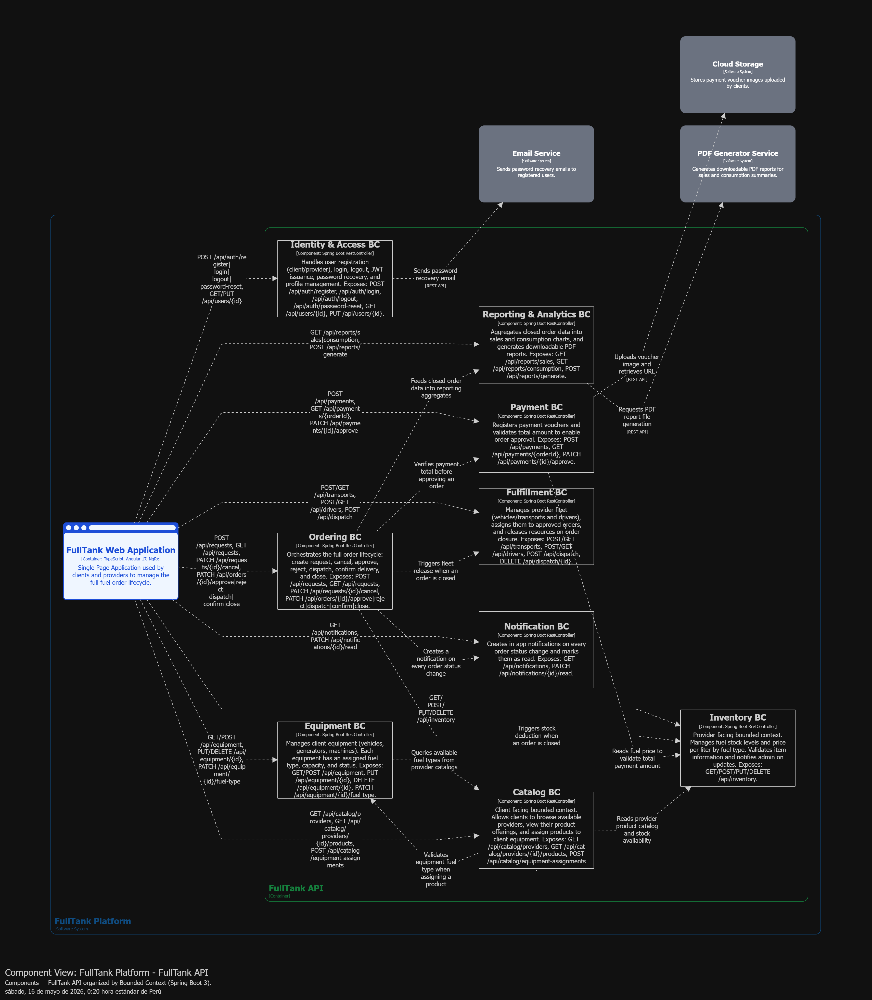

> No existe un diagrama de componentes exclusivo de Equipment; se enlaza la vista global disponible.

#### 4.2.5.6. Bounded Context Software Architecture Code Level Diagrams.

##### 4.2.5.6.1. Bounded Context Domain Layer Class Diagram.

> No existe un UML de dominio actualizado de Equipment; la vista enlazada es la disponible.

##### 4.2.5.6.2. Bounded Context Database Design Diagram.

Equipment es dueño de estas tablas:

| Tabla | Contenido principal |
|---|---|
| `customer_accounts` | `id`, `organization_id`, `legacy_company_id` (único), `name`, `ruc`, `address`, `contact_email`, `phone`, `active`. |
| `customer_sites` | `id`, `customer_account_id`, `organization_id`, `name`, `address`, `active`. |
| `tanks` | `id`, `organization_id`, `customer_account_id`, `site_id`, `name`, `classification`, `fuel_type`, `capacity_amount`/`capacity_unit`, `level_amount`/`level_unit`, `level_source`, `level_observed_at`, `configuration_version`, `legacy_equipment_id` (único), `active`. |
| `tank_configurations` | `id`, `tank_id`, `version`, `fuel_type`, `capacity_amount`/`capacity_unit`, `recorded_at`. |
| `device_bindings` | `id`, `organization_id`, `tank_id`, `device_id`, `channel`, `status`, `valid_from`, `valid_to`, `active_slot`; único `(device_id, channel, active_slot)`. |
| `device_credentials` | `id`, `device_id`, `channel`, `token_hash` (único), `token_version`, `status`, `revoked_at`. |
| `equipment` | Equipos del modelo heredado. |

> No se conserva un diagrama gráfico de este modelo; la tabla anterior es su especificación.

#### 4.2.5.7. Runtime Evidence.

La evidencia de Equipment son las pruebas automatizadas del backend (sección 6.2.1.5): 7 pruebas sobre el vínculo temporal del dispositivo, el aprovisionamiento de credenciales y el modelo del tanque, y las 23 pruebas de las operaciones del distribuidor, que cubren la búsqueda por RUC, el alta y la edición de tanques con el caso de otro distribuidor. Las 19 operaciones de Equipment están documentadas en Swagger UI (sección 6.2.1.7).

### 4.2.6. Bounded Context: Fulfillment

| Elemento | Descripción |
|---|---|
| Propósito | Gestionar el ciclo físico de la entrega de combustible, desde que se asigna conductor y cisterna hasta que se completa, falla o se cancela, con un historial inmutable de transiciones y una línea de tiempo. |
| Actores | Distribuidor, que asigna y ejecuta las entregas, y comprador asociado, que consulta el estado de la suya. |
| Relación con otros contextos | La asignación la orquesta Application Flows, que reserva stock en Supply y recursos en Fleet y luego crea la entrega. Fulfillment lee conductor, cisterna y ventana reservada mediante `FleetCatalog`, y publica `delivery.assigned`, `started`, `arrived`, `completed` y `failed` (`api.events`) que consumen Notification y el diario de negocio. Al cerrar la entrega, el puerto `DeliveryIntegration`, implementado en Application Flows, libera la flota, concilia el stock y deja la orden pendiente de pago. Analytics lo lee mediante `FulfillmentContextFacade`. |

  
  
<em>Canvas del Bounded Context Fulfillment (Event Storming).</em>

#### 4.2.6.1. Domain Layer.

El core es el agregado `Delivery`. Su estado físico (`DeliveryPhysicalState`) solo admite estas transiciones: `ASSIGNED → STARTED → ARRIVED → DELIVERING → COMPLETED`, y desde cualquier estado no terminal se puede ir a `FAILED` o `CANCELLED`. `COMPLETED`, `FAILED` y `CANCELLED` son terminales. Al completar, el volumen entregado debe ser mayor que cero y no puede superar el volumen solicitado. Cada transición queda registrada en `DeliveryStateTransition` con su versión del agregado y no se modifica después. Hay una sola entrega por orden (restricción única `uk_deliveries_order_id`).

Conductor y cisterna ya no pertenecen a este contexto: viven en Fleet y `Delivery` solo guarda sus identificadores. `DeliveryStatus` (`SCHEDULED`, `DISPATCHED`, `DELIVERED`, `FAILED`) es el estado de la primera versión; se conserva en la tabla por compatibilidad y el estado vigente es el físico.

| Clase | Tipo | Propósito |
|---|---|---|
| `Delivery` | Aggregate Root | Entrega con orden, distribuidor, conductor, cisterna, estado físico, fechas de cada etapa, volumen solicitado y entregado, versión y `assignmentCommandId` (idempotencia). Expone `assign()`, `start()`, `arrive()`, `beginDelivering()`, `completePhysical()`, `failPhysical()` y `cancel()`. |
| `DeliveryStateTransition` | Entity | Registro inmutable de cada cambio de estado (origen, destino, instante y versión). |
| `DeliveryPhysicalState`, `DeliveryStatus` | Value Objects | Estados físicos con su tabla de transiciones permitidas, y estado heredado de la primera versión. |
| `CreateDeliveryCommand`, `AssignDeliveryCommand`, `StartDeliveryCommand`, `ArriveDeliveryCommand`, `CompletePhysicalDeliveryCommand`, `FailDeliveryCommand`, `CancelDeliveryCommand` | Domain Commands | Intenciones de crear la entrega y de avanzar o cerrar su ciclo. |
| `GetDeliveryByIdQuery`, `GetAllDeliveriesQuery` | Domain Queries | Consultas de entregas. |
| `DeliveryRepository`, `DeliveryStateTransitionRepository` | Domain Repositories | Puertos de persistencia. |

#### 4.2.6.2. Interface Layer.

| Clase / Componente | Tipo | Propósito |
|---|---|---|
| `DeliveriesController` | REST Controller | `/api/deliveries`: `assign`, `start`, `arrive`, `complete`, `fail` y `cancel` como subrecursos con `POST`, consulta de una entrega, de sus `transitions` y listado de las entregas del distribuidor. |
| `DeliveryTimelineController` | REST Controller | `GET /api/deliveries/{deliveryId}/timeline`: cronología de la entrega. |
| `CompleteDeliveryResource`, `FailDeliveryResource`, `DeliveryResource`, `DeliveryTransitionResource`, `DeliveryTimelineItemResource` | REST Resources | Volumen entregado y motivo de fallo en la entrada; entrega, transiciones y cronología en la salida. |

La creación de la entrega (`POST /api/deliveries`) y la recomendación de recursos (`GET /api/deliveries/recommendation`) no están en este contexto sino en Application Flows, porque cruzan varios contextos (sección 4.1.1.2, flujo 3).

#### 4.2.6.3. Application Layer.

| Clase / Componente | Tipo | Propósito |
|---|---|---|
| `DeliveryLifecycleServiceImpl` | Command Service | Ejecuta las transiciones sobre el agregado, registra el historial y publica el evento de cada una. Al completar valida el volumen y llama al puerto `DeliveryIntegration`. |
| `DeliveryQueryService` / `DeliveryQueryServiceImpl` | Query Service | Consulta de entregas, transiciones y línea de tiempo, siempre dentro del tenant del distribuidor. |
| `DeliveryBusinessJournalListener` | Event Listener | Registra en el diario de negocio un renglón por cada evento de entrega, de forma idempotente por `source_event_id`. |

#### 4.2.6.4. Infrastructure Layer.

| Clase / Componente | Tipo | Propósito |
|---|---|---|
| `DeliveryPersistenceEntity`, `DeliveryStateTransitionPersistenceEntity`, `DeliveryBusinessJournalEntity` | JPA Entities | Tablas `deliveries`, `delivery_state_transitions` y `delivery_business_journals`. |
| `DeliveryPersistenceAssembler`, `DeliveryRepositoryImpl`, `DeliveryPersistenceRepository` y sus equivalentes para transiciones | Assembler, Adapter y Spring Data | Convierten entre dominio y JPA e implementan los puertos. |
| `DeliveryAssignmentsImpl`, `DeliveryTrackingLookupImpl` | Public API Implementations | Exponen a otros contextos la consulta de entregas y de sus asignaciones. |

#### 4.2.6.5. Bounded Context Software Architecture Component Level Diagrams.

> No existe un diagrama de componentes exclusivo de Fulfillment; se enlaza la vista global disponible.

#### 4.2.6.6. Bounded Context Software Architecture Code Level Diagrams.

##### 4.2.6.6.1. Bounded Context Domain Layer Class Diagram.

> El diagrama de clases anterior de Fulfillment (`backend_fullfilment.png`) corresponde al modelo de la primera versión, con `Vehicle`, `Driver` y `DeliveryStatus` dentro del contexto, y ya no representa el código. Se retiró de esta sección hasta contar con uno nuevo que muestre `Delivery`, `DeliveryStateTransition` y `DeliveryPhysicalState`.

##### 4.2.6.6.2. Bounded Context Database Design Diagram.

| Tabla | Contenido principal |
|---|---|
| `deliveries` | `id`, `order_id` (único), `provider_id`, `driver_id`, `vehicle_id` (la cisterna), `status`, `physical_state`, `scheduled_date`, `dispatched_at`, `started_at`, `arrived_at`, `delivering_at`, `delivered_at`, `requested_volume`, `delivered_volume`, `assignment_command_id` (único), `version`, `notes`. |
| `delivery_state_transitions` | `id`, `delivery_id`, `from_state`, `to_state`, `occurred_at`, `aggregate_version`. |
| `delivery_business_journals` | `id`, `source_event_id` (único), `delivery_id`, `provider_id`, `type`, `occurred_at`, `summary`, `ref_id`. |

> No se conserva un diagrama gráfico de este modelo; la tabla es su especificación.

#### 4.2.6.7. Runtime Evidence.

Las 10 operaciones de Fulfillment están en Swagger UI (sección 6.2.1.7). Las 29 pruebas del contexto (sección 6.2.1.5) verifican la máquina de estados de la entrega, el volumen entregado, el historial inmutable y la línea de tiempo. Las 8 de Application Flows verifican la asignación transaccional, el *rollback* ante un fallo y la idempotencia por `commandId`.

### 4.2.7. Bounded Context: Ordering

| Elemento | Descripción |
|---|---|
| Propósito | Mantener la orden de combustible que nace de una solicitud de abastecimiento aceptada y llevarla por su ciclo comercial hasta el pago. |
| Actores | Distribuidor, que acepta la solicitud (lo que crea la orden), y comprador asociado, que consulta sus órdenes y paga. |
| Relación con otros contextos | Application Flows crea la orden mediante `FuelOrderCreation` al aceptar una solicitud de Replenishment. Consulta el producto y su precio en Inventory (`FuelProductQueryService`, dependencia heredada registrada en la línea base de ArchUnit). Expone `OrderLookup` a Payment, Equipment y Fulfillment. Consume `payment.completed.v1` (`OrderingPaymentCompletionAdapter`) para marcar la orden como pagada. Analytics la lee mediante `OrderingContextFacade`. |

  
  
<em>Canvas del Bounded Context Ordering (Event Storming).</em>

#### 4.2.7.1. Domain Layer

El core es el agregado `FuelOrder`. La solicitud ya no se modela aquí: pasó a Replenishment como `ReplenishmentRequest` (sección 4.2.11) y la tabla `fuel_requests` se eliminó en la migración V34. `FuelOrder` solo conserva el `requestId` de la solicitud que la originó.

El agregado protege su ciclo de vida: `confirm()` exige estado `PENDING`; `cancel()` solo se permite desde `PENDING` o `CONFIRMED`; `dispatch()` exige que la orden esté pendiente de asignación; `receive()` exige `DISPATCHED`; y `markPaid()` rechaza una orden cancelada.

| Clase | Tipo | Propósito |
|---|---|---|
| `FuelOrder` | Aggregate Root | Orden con solicitud de origen, comprador, distribuidor, producto, volumen solicitado, precio total, dirección, fecha programada y estado. Expone `confirm()`, `cancel()`, `dispatch()`, `receive()` y `markPaid()`. |
| `OrderStatus` | Value Object | Estados de la orden: `PENDING`, `CONFIRMED`, `DISPATCHED`, `PENDING_PAYMENT`, `PAID`, `IN_PROGRESS`, `DELIVERED` y `CANCELLED`. |
| `CreateFuelOrderCommand`, `ConfirmFuelOrderCommand`, `CancelFuelOrderCommand` | Domain Commands | Intenciones de crear, confirmar y cancelar una orden. |
| `GetAllFuelOrdersQuery`, `GetFuelOrderByIdQuery`, `GetFuelOrdersByCompanyIdQuery`, `GetFuelOrdersByProviderIdQuery` | Domain Queries | Consultas de órdenes. |
| `FuelOrderRepository` | Domain Repository | Puerto de persistencia. |

#### 4.2.7.2. Interface Layer

| Clase / Componente | Tipo | Propósito |
|---|---|---|
| `FuelOrdersController` | REST Controller | `/api/fuel-orders`: creación directa, `confirm` y `cancel` como subrecursos, y consulta por id, por empresa compradora y por distribuidor. Valida la propiedad con `CurrentUserAccess`. |
| `CreateFuelOrderResource`, `FuelOrderResource` | REST Resources | Entrada de la creación y representación de la orden. |
| `CreateFuelOrderCommandFromResourceAssembler`, `FuelOrderResourceFromEntityAssembler` | Assemblers | Convierten recurso en comando y agregado en recurso. |

#### 4.2.7.3. Application Layer

| Clase / Componente | Tipo | Propósito |
|---|---|---|
| `FuelOrderCommandService` / `FuelOrderCommandServiceImpl` | Command Service | Consulta el precio en Inventory, construye el agregado, lo persiste y delega las transiciones al propio `FuelOrder`. Devuelve `Result<FuelOrder, ApplicationError>`. |
| `FuelOrderCreationImpl` | Public API Implementation | Implementa `FuelOrderCreation`, la entrada que usa Application Flows para crear la orden dentro de la transacción de aceptación. |
| `FuelOrderQueryService` / `FuelOrderQueryServiceImpl` | Query Service | Consultas por id, empresa, distribuidor o colección completa. |
| `OrderingPaymentCompletionAdapter` | Event Consumer | Consume `payment.completed.v1` de forma idempotente y marca la orden como `PAID`. |

#### 4.2.7.4. Infrastructure Layer

| Clase / Componente | Tipo | Propósito |
|---|---|---|
| `FuelOrderPersistenceEntity` | JPA Entity | Tabla `fuel_orders`; el estado se guarda como `VARCHAR`. |
| `FuelOrderPersistenceAssembler`, `FuelOrderRepositoryImpl`, `FuelOrderPersistenceRepository` | Assembler, Adapter y Spring Data | Convierten entre dominio y JPA e implementan el puerto. |
| `OrderLookupImpl` | Public API Implementation | Implementa `OrderLookup` para Payment, Equipment y Fulfillment. |

#### 4.2.7.5. Bounded Context Software Architecture Component Level Diagrams.
Component Diagram - Ordering Bounded Context

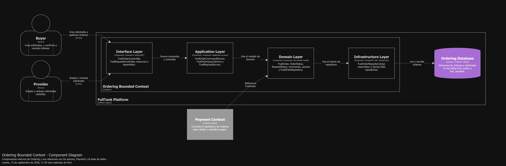

#### 4.2.7.6. Bounded Context Software Architecture Code Level Diagrams.

##### 4.2.7.6.1. Bounded Context Domain Layer Class Diagram.
Domain Layer Class Diagram - Ordering Bounded Context

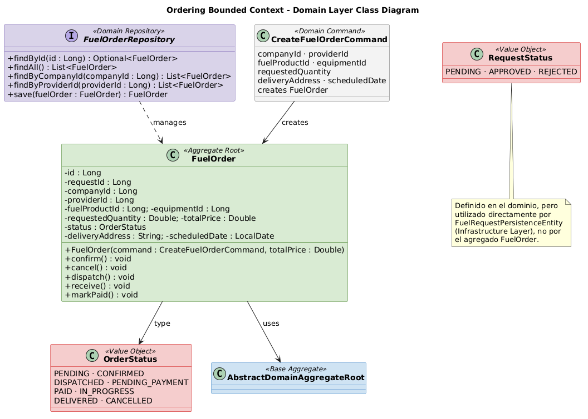

##### 4.2.7.6.2. Bounded Context Database Design Diagram.

| Tabla | Contenido principal |
|---|---|
| `fuel_orders` | `id`, `request_id`, `company_id`, `provider_id`, `fuel_product_id`, `requested_quantity`, `total_price`, `status`, `delivery_address`, `scheduled_date` y auditoría. |

> El diagrama `baseDatos_ordering.png` muestra las tablas `REQUEST`, `REQUEST_DETAIL` y `ORDER` de la primera versión y ya no corresponde al esquema; se retiró de esta sección.

#### 4.2.7.7. Runtime Evidence.

Las 7 operaciones de Ordering están en Swagger UI (sección 6.2.1.7). Las 40 pruebas de contrato recorren el flujo completo de orden a pago, el aislamiento entre organizaciones y la autorización por rol. La prueba de Payment verifica que el pago se desacople de la orden mediante el evento de pago completado. Las capturas siguientes muestran las consultas y operaciones sobre `/api/fuel-orders`:

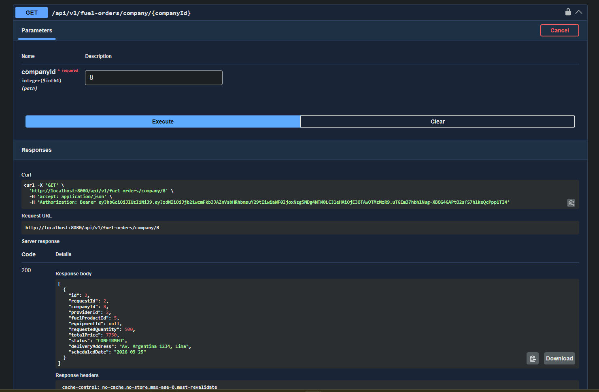
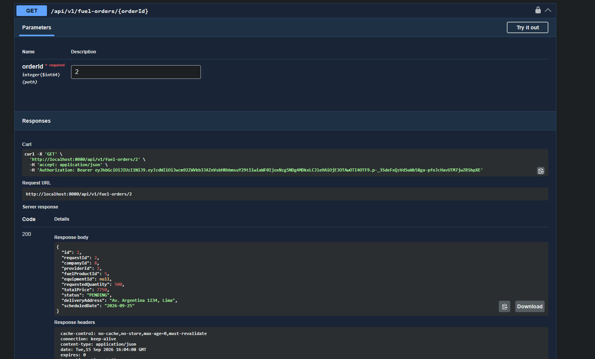
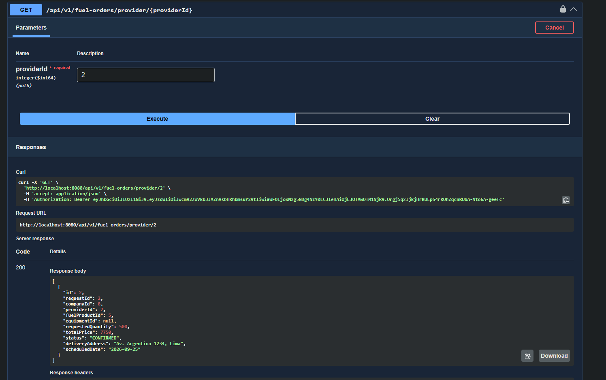
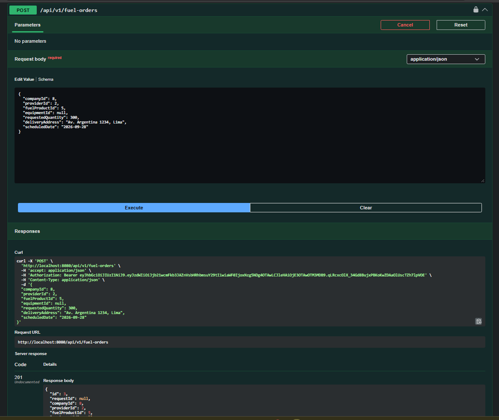
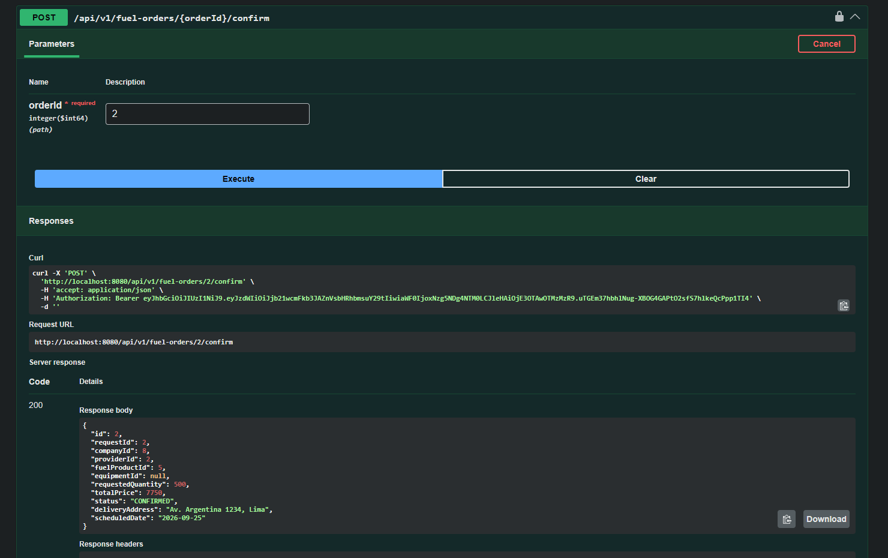
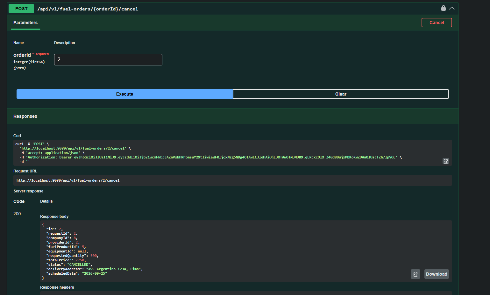

### 4.2.8. Bounded Context: Payment

| Elemento | Descripción |
|---|---|
| Propósito | Registrar el pago de una orden y su confirmación o reembolso. |
| Actores | Comprador asociado, que registra el pago, y distribuidor, que lo confirma o reembolsa y consulta los pagos de sus órdenes. |
| Relación con otros contextos | Consulta la orden mediante `OrderLookup` de Ordering. Al completarse un pago publica `payment.completed.v1`, que Ordering consume. Analytics lo lee mediante `PaymentContextFacade` y Notification genera los avisos de pago. |

  
  
<em>Canvas del Bounded Context Payment (Event Storming).</em>

#### 4.2.8.1. Domain Layer.

| Clase | Tipo | Propósito |
|---|---|---|
| `Payment` | Aggregate Root | Pago con orden, empresa, monto, estado, método, referencia de transacción y fecha de pago. Expone `complete(reference)`, `refund()` y `fail()`. |
| `PaymentStatus` | Value Object | Estados del pago: `PENDING`, `COMPLETED`, `FAILED` y `REFUNDED`. |
| `PaymentMethod` | Value Object | Método de pago: `BANK_TRANSFER`, `CREDIT_CARD`, `DEBIT_CARD` y `CASH`. |
| `CreatePaymentCommand`, `CompletePaymentCommand`, `RefundPaymentCommand` | Domain Commands | Intenciones de registrar, completar y reembolsar un pago. |
| `GetAllPaymentsQuery`, `GetPaymentByIdQuery`, `GetPaymentByOrderIdQuery`, `GetPaymentsByCompanyIdQuery` | Domain Queries | Consultas de pagos. |
| `PaymentRepository` | Domain Repository | Puerto de persistencia. |

#### 4.2.8.2. Interface Layer.

| Clase | Tipo | Propósito |
|---|---|---|
| `PaymentsController` | REST Controller | `/api/payments`: registrar, `complete` y `refund` como subrecursos, y consultar todos, por id, por orden, por empresa y por distribuidor. |
| `CreatePaymentResource`, `CompletePaymentResource`, `PaymentResource` | REST Resources (Record) | Datos para registrar un pago, referencia para completarlo y representación de salida. |
| `CreatePaymentCommandFromResourceAssembler`, `PaymentResourceFromEntityAssembler` | Assemblers | Convierten recurso en comando y agregado en recurso. |

#### 4.2.8.3. Application Layer.

| Clase | Tipo | Propósito |
|---|---|---|
| `PaymentCommandService` / `PaymentCommandServiceImpl` | Command Service | Registra, completa y reembolsa el pago, verifica la orden con `OrderLookup` y publica `payment.completed.v1`. |
| `PaymentQueryService` / `PaymentQueryServiceImpl` | Query Service | Consultas de solo lectura de pagos. |

#### 4.2.8.4. Infrastructure Layer.

| Clase | Tipo | Propósito |
|---|---|---|
| `PaymentPersistenceEntity` | JPA Entity | Tabla `payments`. |
| `PaymentPersistenceAssembler` | Assembler / Mapper | Traduce entre `Payment` y la entidad JPA. |
| `PaymentRepositoryImpl`, `PaymentPersistenceRepository` | Adapter y Spring Data | Implementan el puerto del dominio. |

#### 4.2.8.5. Bounded Context Software Architecture Component Level Diagrams.

> No existe un diagrama de componentes exclusivo de Payment; se enlaza la vista global disponible.

#### 4.2.8.6. Bounded Context Software Architecture Code Level Diagrams.

##### 4.2.8.6.1. Bounded Context Domain Layer Class Diagrams.

##### 4.2.8.6.2. Bounded Context Database Design Diagram.

| Tabla | Contenido principal |
|---|---|
| `payments` | `id`, `order_id`, `company_id`, `amount`, `status`, `payment_method`, `transaction_reference`, `paid_at`. |

#### 4.2.8.7. Runtime Evidence.

Las 8 operaciones de Payment están en Swagger UI (sección 6.2.1.7). Las 3 pruebas del contexto y las pruebas de contrato del flujo de orden a pago verifican el registro, la confirmación y el desacople mediante el evento.

### 4.2.9. Bounded Context: Analytics

| Elemento | Descripción |
|---|---|
| Propósito | Calcular indicadores de solo lectura para la plataforma, el distribuidor y el comprador. No es dueño de ninguna tabla. |
| Actores | Administrador de plataforma, distribuidor y comprador asociado. |
| Relación con otros contextos | Lee Ordering, Payment y Fulfillment a través de una capa anticorrupción: cada contexto expone un *facade* (`OrderingContextFacade`, `PaymentContextFacade`, `FulfillmentContextFacade`) y Analytics lo traduce a sus tipos con `ExternalOrderingService`, `ExternalPaymentService` y `ExternalFulfillmentService`. |

  
  
<em>Canvas del Bounded Context Analytics (Event Storming).</em>

#### 4.2.9.1. Domain Layer.

Analytics no tiene agregados: su dominio son consultas y *value objects* inmutables.

| Clase | Tipo | Propósito |
|---|---|---|
| `GetPlatformSummaryQuery`, `GetProviderAnalyticsQuery`, `GetBuyerAnalyticsQuery` | Domain Queries | Piden el resumen de la plataforma y los indicadores de un distribuidor o de una empresa compradora. |
| `PlatformSummary`, `ProviderAnalytics`, `BuyerAnalytics` | Value Objects | Indicadores consolidados de cada actor. |
| `MonthlyAmount` | Value Object | Monto agrupado por mes. |

#### 4.2.9.2. Interface Layer.

| Clase | Tipo | Propósito |
|---|---|---|
| `AnalyticsController` | REST Controller | `/api/analytics`: `GET /platform`, `GET /providers/{providerId}` y `GET /buyers/{companyId}`. |
| `PlatformSummaryResource`, `ProviderAnalyticsResource`, `BuyerAnalyticsResource` | REST Resources | Representaciones JSON de los indicadores. |
| `PlatformSummaryResourceFromValueObjectAssembler`, `ProviderAnalyticsResourceFromValueObjectAssembler`, `BuyerAnalyticsResourceFromValueObjectAssembler` | Assemblers | Convierten el *value object* en recurso. |

#### 4.2.9.3. Application Layer.

| Clase | Tipo | Propósito |
|---|---|---|
| `AnalyticsQueryService` / `AnalyticsQueryServiceImpl` | Query Service | Resuelve las consultas pidiendo los datos a los servicios externos de la capa anticorrupción y calculando los indicadores. |
| `ExternalOrderingService`, `ExternalPaymentService`, `ExternalFulfillmentService` | Anti-Corruption Layer | Traducen los *facades* de Ordering, Payment y Fulfillment al modelo de Analytics. |

#### 4.2.9.4. Infrastructure Layer.

Analytics no persiste datos. Su infraestructura es la capa anticorrupción de la sección anterior, que llama a los *facades* de los otros contextos dentro del mismo proceso.

#### 4.2.9.5. Bounded Context Software Architecture Component Level Diagrams.

> No existe un diagrama de componentes exclusivo de Analytics; se enlaza la vista global disponible.

#### 4.2.9.6. Bounded Context Software Architecture Code Level Diagrams.

##### 4.2.9.6.1. Bounded Context Domain Layer Class Diagrams.

##### 4.2.9.6.2. Bounded Context Database Design Diagram.

Analytics no tiene tablas. La tabla `REPORT` que mostraba el diagrama `baseDatos_analysis.png` pertenece a la primera versión y no existe en el esquema actual; la imagen se retiró de esta sección.

#### 4.2.9.7. Runtime Evidence.

Las 3 operaciones de Analytics están en Swagger UI (sección 6.2.1.7); las pruebas de contrato y las de operaciones del distribuidor cubren la consulta de indicadores.

### 4.2.10. Bounded Context: Telemetry

| Elemento | Descripción |
|---|---|
| Propósito | Recibir las lecturas de nivel que envía el dispositivo del tanque, autenticarlas, deduplicarlas y publicar solo las válidas. Solo observa: no aplica umbrales ni crea pedidos. |
| Actores | Dispositivo ESP32 (envía las lecturas) y distribuidor (consulta las lecturas de los tanques de sus compradores). |
| Relación con otros contextos | Autentica al dispositivo con `DeviceAuthentication` de Equipment. Publica `ValidatedTankReadingEvent`, que consumen Replenishment (evalúa la política de reposición) y Equipment (actualiza el nivel del tanque). |

#### 4.2.10.1. Domain Layer.

La invariante central es la autenticidad: una lectura nace `ACCEPTED` solo si el dispositivo se autenticó contra una credencial activa y un vínculo abierto en el instante de captura; si no, queda `QUARANTINED` con el motivo y nunca se publica. Una lectura se identifica de forma única por dispositivo, canal y número de secuencia, y la ingesta valida primero la versión del esquema (hoy solo la 1).

| Clase | Tipo | Propósito |
|---|---|---|
| `TelemetryReading` | Aggregate Root | Lectura con dispositivo, canal, secuencia, nivel con su unidad, instantes de captura y recepción, tanque y organización atribuidos, calidad y motivo de cuarentena. Expone `isAccepted()`. |
| `ReadingQuality` | Value Object | `ACCEPTED` o `QUARANTINED`. |
| `IngestTelemetryCommand` | Domain Command | Datos de una lectura entrante junto con el token del dispositivo. |
| `TelemetryReadingRepository` | Domain Repository | Puerto de persistencia, con la búsqueda por dispositivo, canal y secuencia. |
| `ValidatedTankReadingEvent` | Published Event (`api.events`) | Lectura validada y atribuida a un tanque. Es el lenguaje publicado hacia otros contextos. |

#### 4.2.10.2. Interface Layer.

| Clase | Tipo | Propósito |
|---|---|---|
| `TelemetryController` | REST Controller | `POST /api/telemetry/readings`: recibe la lectura. Se autentica con la cabecera `X-Device-Token` y no con JWT. La consulta de lecturas para el distribuidor es `GET /api/provider/tanks/{tankId}/readings`. |
| `IngestReadingResource`, `ReadingAckResource` | REST Resources | Cuerpo de la lectura y acuse de recibo. |
| `ReadingAckFromResultAssembler` | Assembler | Convierte el resultado de la ingesta en el acuse. |

#### 4.2.10.3. Application Layer.

| Clase | Tipo | Propósito |
|---|---|---|
| `TelemetryIngestServiceImpl` | Command Service | Valida el esquema, autentica antes de deduplicar (para que un emisor no autenticado no pueda ocupar la secuencia de un dispositivo real), descarta repeticiones, guarda la lectura y, si es válida, publica `ValidatedTankReadingEvent`. Si dos copias compiten, la restricción única evita duplicados. |
| `ValidatedTankReadingConsumer` | Event Consumer | Atiende la lectura validada dentro del contexto. |

#### 4.2.10.4. Infrastructure Layer.

| Clase | Tipo | Propósito |
|---|---|---|
| `TelemetryReadingPersistenceEntity` | JPA Entity | Tabla `telemetry_readings`, con restricción única `(device_id, channel, sequence_number)`. |
| `TelemetryReadingPersistenceAssembler`, `TelemetryReadingRepositoryImpl`, `TelemetryReadingPersistenceRepository` | Assembler, Adapter y Spring Data | Implementan el puerto del dominio. |

#### 4.2.10.5. Bounded Context Software Architecture Component Level Diagrams.

> No existe un diagrama de componentes exclusivo de Telemetry; se enlaza la vista global disponible.

#### 4.2.10.6. Bounded Context Software Architecture Code Level Diagrams.

##### 4.2.10.6.1. Bounded Context Domain Layer Class Diagram.

> No existe un UML de dominio de Telemetry.

##### 4.2.10.6.2. Bounded Context Database Design Diagram.

| Tabla | Contenido principal |
|---|---|
| `telemetry_readings` | `id`, `device_id`, `channel`, `sequence_number`, `schema_version`, `level_amount`/`level_unit`, `captured_at`, `received_at`, `tank_id`, `organization_id`, `quality`, `quarantine_reason`. |

#### 4.2.10.7. Runtime Evidence.

Las 2 operaciones de Telemetry están en Swagger UI (sección 6.2.1.7). Las 6 pruebas del contexto verifican la ingesta, los duplicados, la cuarentena y la aplicación de la lectura al tanque.

### 4.2.11. Bounded Context: Replenishment

| Elemento | Descripción |
|---|---|
| Propósito | Decidir cuándo un tanque necesita reposición y gestionar el ciclo de la solicitud de abastecimiento hasta que el distribuidor la acepta, la rechaza o se cancela. |
| Actores | Distribuidor (configura la política, revisa su bandeja y decide) y comprador asociado (crea solicitudes manuales y las cancela). |
| Relación con otros contextos | Consume `ValidatedTankReadingEvent` de Telemetry. Lee los tanques de Equipment (`TankAssets`, `CustomerDirectory`) y es leído por Equipment mediante `TankRefillConfiguration`, `TankRefillLookup` y `ReplenishmentLookup`. Consulta el precio en Supply (`SupplyCatalog`). Expone `ReplenishmentAcceptance` y `ReplenishmentLookup` a Application Flows, que orquesta la aceptación. Publica `replenishment.*.v1` para Notification. |

#### 4.2.11.1. Domain Layer.

`RefillPolicyEvaluator` es un servicio de dominio puro: dado el nivel, los umbrales, el episodio abierto y si ya hay una solicitud activa, decide sin tocar infraestructura. Aplica dos reglas: el nivel bajo es el 20 % de la capacidad (configurable por tanque) y el episodio solo se rearma cuando el nivel sube 10 puntos por encima (histéresis), de modo que el ruido cerca del umbral no genere solicitudes duplicadas. Un episodio abierto, o una solicitud pendiente, impide abrir otro. La clave del episodio se deriva de la lectura que lo disparó, así una lectura reenviada no abre un segundo episodio.

| Clase | Tipo | Propósito |
|---|---|---|
| `RefillPolicy` | Aggregate Root | Política de un tanque: umbral bajo, histéresis, nivel objetivo, producto, distribuidor y generación automática. Expone `reconfigure()`, `thresholds()` y `canGenerateRequests()`. |
| `RefillEpisode` | Aggregate Root | Episodio de nivel bajo, `OPEN` hasta que el nivel se recupera y pasa a `REARMED`. Expone `markRequestEmitted()` y `rearm()`. |
| `ReplenishmentRequest` | Aggregate Root | Solicitud de abastecimiento con tanque, producto, volumen, precio, origen (`MANUAL` o `AUTOMATIC`), dirección y fecha de entrega. Expone `accept()`, `reject(reason)`, `cancel()`, `attachOrder()` y `consumeAcceptance()` (la aceptación se consume una sola vez). |
| `RefillThresholds`, `RefillDecision`, `RefillDecisionType`, `RefillEpisodeStatus`, `ReplenishmentSource`, `ReplenishmentStatus` | Value Objects | Umbrales, decisión explicable de cada evaluación (`OPEN_EPISODE`, `REARM_EPISODE`, `NO_ACTION` y la supresión por solicitud activa) y estados (`PENDING`, `ACCEPTED`, `REJECTED`, `CANCELLED`). |
| `RefillPolicyEvaluator` | Domain Service | Evaluación determinista de la política con un instante inyectado. |
| `ConfigureRefillPolicyCommand`, `EvaluateRefillPolicyCommand`, `CreateReplenishmentRequestCommand`, `AcceptReplenishmentRequestCommand`, `RejectReplenishmentRequestCommand`, `CancelReplenishmentRequestCommand`, `ConsumeReplenishmentAcceptanceCommand`, `AttachReplenishmentOrderCommand` | Domain Commands | Intenciones sobre la política y la solicitud. |
| `GetRefillPolicyByTankQuery`, `GetRefillEpisodesByTankQuery`, `GetReplenishmentRequestByIdQuery`, `GetReplenishmentRequestsByOrganizationQuery` | Domain Queries | Consultas de política, episodios y solicitudes. |
| `RefillPolicyRepository`, `RefillEpisodeRepository`, `ReplenishmentRequestRepository` | Domain Repositories | Puertos de persistencia. |

#### 4.2.11.2. Interface Layer.

| Clase | Tipo | Propósito |
|---|---|---|
| `RefillPoliciesController` | REST Controller | `PUT` y `GET /api/tanks/{tankId}/refill-policy` y `GET /api/tanks/{tankId}/refill-episodes`; el distribuidor consulta los episodios en `/api/provider/tanks/{tankId}/refill-episodes`. |
| `ReplenishmentRequestsController` | REST Controller | `/api/replenishment-requests`: crear, listar, bandeja del distribuidor (`/inbox`), consultar, `reject` y `cancel`. La aceptación (`accept`) está en Application Flows. |
| `ConfigureRefillPolicyResource`, `RefillPolicyResource`, `RefillEpisodeResource`, `CreateReplenishmentRequestResource`, `RejectReplenishmentRequestResource`, `ReplenishmentRequestResource` | REST Resources | Entradas y salidas de la API. |
| `RefillPolicyResourceFromDomainAssembler`, `RefillEpisodeResourceFromDomainAssembler`, `ReplenishmentRequestResourceFromDomainAssembler` | Assemblers | Convierten agregados en recursos. |

#### 4.2.11.3. Application Layer.

| Clase | Tipo | Propósito |
|---|---|---|
| `RefillPolicyCommandService` / `RefillPolicyCommandServiceImpl` | Command Service | Configura la política de un tanque y evalúa una lectura: abre o rearma el episodio y, si la generación automática está activa, crea la solicitud `AUTOMATIC`. |
| `RefillPolicyEvaluationConsumer` | Event Consumer | Atiende `ValidatedTankReadingEvent` de forma idempotente y dispara la evaluación. |
| `ReplenishmentCommandService` / `ReplenishmentCommandServiceImpl` | Command Service | Crea, rechaza, cancela y vincula la orden a una solicitud. |
| `RefillPolicyQueryService`, `ReplenishmentQueryService` (+ `Impl`) | Query Services | Consultas de política, episodios y solicitudes. |

#### 4.2.11.4. Infrastructure Layer.

| Clase | Tipo | Propósito |
|---|---|---|
| `RefillPolicyPersistenceEntity`, `RefillEpisodePersistenceEntity`, `ReplenishmentRequestPersistenceEntity` | JPA Entities | Tablas `refill_policies`, `refill_episodes` y `replenishment_requests`. |
| `*PersistenceAssembler`, `*RepositoryImpl`, `*PersistenceRepository` | Assemblers, Adapters y Spring Data | Implementan los puertos del dominio. |
| `ReplenishmentAcceptanceImpl`, `ReplenishmentLookupImpl` | Public API Implementations | Exponen la aceptación y la consulta a Application Flows y Equipment. |

#### 4.2.11.5. Bounded Context Software Architecture Component Level Diagrams.

> No existe un diagrama de componentes exclusivo de Replenishment; se enlaza la vista global disponible.

#### 4.2.11.6. Bounded Context Software Architecture Code Level Diagrams.

##### 4.2.11.6.1. Bounded Context Domain Layer Class Diagram.

> No existe un UML de dominio de Replenishment.

##### 4.2.11.6.2. Bounded Context Database Design Diagram.

| Tabla | Contenido principal |
|---|---|
| `refill_policies` | `tank_id` (único), `organization_id`, `provider_id`, `fuel_product_id`, `low_level_percent`, `hysteresis_percent`, `target_level_percent`, `auto_generate_enabled`, `policy_version`. |
| `refill_episodes` | `episode_key` (único), `tank_id`, `status`, `open_slot` (único, impide dos episodios abiertos), `opened_level`, `opened_level_percent`, `requested_volume`, `target_level`, `request_id`, `request_emitted`, `opened_at`, `closed_at`. |
| `replenishment_requests` | `episode_key` (único), `organization_id`, `provider_id`, `tank_id`, `fuel_product_id`, `quantity`, `unit_price`, `source`, `status`, `rejection_reason`, `acceptance_consumed`, `order_id`, `delivery_address`, `delivery_date`. |

#### 4.2.11.7. Runtime Evidence.

Las 10 operaciones de Replenishment están en Swagger UI (sección 6.2.1.7). Sus 40 pruebas verifican la evaluación del umbral y la histéresis, la generación automática sin duplicados, la aceptación que crea la orden, la bandeja del distribuidor y la fecha de entrega en hora de Lima.

### 4.2.12. Bounded Context: Fleet

| Elemento | Descripción |
|---|---|
| Propósito | Registrar conductores y cisternas, calcular su elegibilidad y reservarlos por ventana de tiempo sin traslapes y con capacidad suficiente. |
| Actores | Distribuidor, dueño de su flota. |
| Relación con otros contextos | Application Flows reserva recursos mediante `FleetReservations`. Fulfillment lee los recursos con `FleetCatalog`. Resuelve el tenant con IAM. |

#### 4.2.12.1. Domain Layer.

Un conductor o una cisterna solo es elegible si está disponible y activo. La reserva usa ventanas semiabiertas `[inicio, fin)`: dos reservas se traslapan solo si cada una empieza antes de que termine la otra, así que las reservas contiguas son válidas. El volumen reservado debe ser positivo y solo una reserva activa puede liberarse.

| Clase | Tipo | Propósito |
|---|---|---|
| `Driver` | Aggregate Root | Conductor del distribuidor. Expone `update()`, `deactivate()` y `activate()`. |
| `Tanker` | Aggregate Root | Cisterna con placa, capacidad y estado; la capacidad debe ser positiva. Expone `update()`, `deactivate()` y `activate()`. |
| `FleetReservation` | Aggregate Root | Reserva de conductor y cisterna para una ventana y un volumen. Expone `overlaps()`, `isActive()`, `release()` y `expireIfPast()`. |
| `DriverStatus`, `TankerStatus`, `FleetReservationStatus`, `ReservationWindow` | Value Objects | Estados del conductor (`AVAILABLE`, `ASSIGNED`, `SUSPENDED`, `INACTIVE`), de la cisterna (`AVAILABLE`, `IN_ROUTE`, `MAINTENANCE`, `SUSPENDED`, `INACTIVE`), de la reserva (`ACTIVE`, `RELEASED`, `EXPIRED`) y la ventana de tiempo. |
| `RegisterDriverCommand`, `UpdateDriverCommand`, `RegisterTankerCommand`, `UpdateTankerCommand`, `ReserveFleetCommand` | Domain Commands | Altas, ediciones y reserva. |
| `DriverRepository`, `TankerRepository`, `FleetReservationRepository` | Domain Repositories | Puertos de persistencia. |

#### 4.2.12.2. Interface Layer.

| Clase | Tipo | Propósito |
|---|---|---|
| `DriversController` | REST Controller | `/api/drivers`: registrar, listar, consultar, actualizar, `activate`, `deactivate`, `eligible` y `{driverId}/eligibility`. |
| `TankersController` | REST Controller | `/api/tankers`: las mismas operaciones para cisternas. |
| `DriverInputResource`, `DriverResource`, `TankerInputResource`, `TankerResource`, `EligibilityResource` | REST Resources | Entradas y salidas. |

#### 4.2.12.3. Application Layer.

Fleet implementa sus servicios directamente en la capa de infraestructura (`FleetRegistryImpl`, `FleetReservationServiceImpl`, `EligibilityQueryImpl`, `FleetCatalogImpl`), detrás de las interfaces del paquete `api`; no tiene una capa `application` propia.

| Clase | Tipo | Propósito |
|---|---|---|
| `FleetRegistry` | Public API | Registro y edición de conductores y cisternas. |
| `FleetReservations` | Public API | Reserva y liberación con bloqueo de filas, capacidad suficiente y sin traslape de ventana. |
| `EligibilityQuery`, `FleetCatalog` | Public API | Elegibilidad y consulta de recursos y ventana reservada. |
| `ResourceEnabledEvent`, `ResourceDisabledEvent` | Published Events | Hechos de activación y desactivación de un recurso. |

#### 4.2.12.4. Infrastructure Layer.

| Clase | Tipo | Propósito |
|---|---|---|
| `DriverPersistenceEntity`, `TankerPersistenceEntity`, `FleetReservationPersistenceEntity` | JPA Entities | Tablas `drivers`, `vehicles` (la cisterna) y `fleet_reservations`. |
| `*PersistenceAssembler`, `*RepositoryImpl`, `*PersistenceRepository` | Assemblers, Adapters y Spring Data | Implementan los puertos del dominio. |
| `FleetRegistryImpl`, `FleetReservationServiceImpl`, `EligibilityQueryImpl`, `FleetCatalogImpl` | Public API Implementations | Implementan las interfaces `api`. |

#### 4.2.12.5. Bounded Context Software Architecture Component Level Diagrams.

> No existe un diagrama de componentes exclusivo de Fleet; se enlaza la vista global disponible.

#### 4.2.12.6. Bounded Context Software Architecture Code Level Diagrams.

##### 4.2.12.6.1. Bounded Context Domain Layer Class Diagram.

> No existe un UML de dominio de Fleet.

##### 4.2.12.6.2. Bounded Context Database Design Diagram.

| Tabla | Contenido principal |
|---|---|
| `drivers` | `id`, `provider_id`, `user_id`, nombre, licencia (única), contacto, `status`, `active`, `deactivated_at`. |
| `vehicles` | Cisternas: `id`, `provider_id`, placa (única), marca, modelo, `capacity`, `unit`, `status`, `active`, `deactivated_at`. |
| `fleet_reservations` | `id`, `provider_id`, `driver_id`, `tanker_id`, `reference` (única), `window_start`, `window_end`, `volume`, `unit`, `status`, `version`; índice por recurso y ventana. |

#### 4.2.12.7. Runtime Evidence.

Las 16 operaciones de Fleet están en Swagger UI (sección 6.2.1.7). Sus 41 pruebas verifican la elegibilidad, el registro y la edición, las ventanas de reserva, los traslapes y las reservas concurrentes.

### 4.2.13. Bounded Context: Supply

| Elemento | Descripción |
|---|---|
| Propósito | Exponer el catálogo de productos por distribuidor y reservar el stock de una asignación para no sobrevender. |
| Actores | No tiene API REST: lo usan otros contextos. |
| Relación con otros contextos | Traduce el catálogo de Inventory con una capa anticorrupción (`InventorySupplyCatalog`). Replenishment y Application Flows lo usan mediante `SupplyCatalog` y `SupplyReservations`. |

#### 4.2.13.1. Domain Layer.

| Clase | Tipo | Propósito |
|---|---|---|
| `SupplyReservation` | Aggregate Root | Reserva de stock de un producto con cantidad, precio unitario y referencia. Expone `release()` y `reconcile()`. |
| `ReservationStatus` | Value Object | Estado de la reserva. |
| `ReserveSupplyCommand` | Domain Command | Intención de reservar stock. |
| `SupplyReservationRepository` | Domain Repository | Puerto de persistencia. |

#### 4.2.13.2. Interface Layer.

Supply no expone endpoints; su interfaz son `SupplyCatalog` y `SupplyReservations` del paquete `api`.

#### 4.2.13.3. Application Layer.

| Clase | Tipo | Propósito |
|---|---|---|
| `SupplyReservationServiceImpl` | Command Service | Reserva stock bajo un bloqueo por distribuidor y producto, de modo que dos asignaciones simultáneas no comprometan el mismo stock. |

#### 4.2.13.4. Infrastructure Layer.

| Clase | Tipo | Propósito |
|---|---|---|
| `SupplyReservationPersistenceEntity`, `SupplyStockLockPersistenceEntity` | JPA Entities | Tablas `supply_reservations` y `supply_stock_locks`. |
| `SupplyReservationRepositoryImpl`, `SupplyReservationPersistenceRepository`, `SupplyStockLockPersistenceRepository`, `SupplyStockLockInitializer` | Adapters, Spring Data e inicializador | Implementan el puerto y crean los bloqueos. |
| `InventorySupplyCatalog` | Anti-Corruption Layer | Traduce `fuel_products` al modelo de Supply. |
| `SupplyReservationsImpl` | Public API Implementation | Implementa `SupplyReservations`. |

#### 4.2.13.5. Bounded Context Software Architecture Component Level Diagrams.

> No existe un diagrama de componentes exclusivo de Supply; se enlaza la vista global disponible.

#### 4.2.13.6. Bounded Context Software Architecture Code Level Diagrams.

##### 4.2.13.6.1. Bounded Context Domain Layer Class Diagram.

> No existe un UML de dominio de Supply.

##### 4.2.13.6.2. Bounded Context Database Design Diagram.

| Tabla | Contenido principal |
|---|---|
| `supply_reservations` | `id`, `provider_id`, `fuel_product_id`, `quantity`, `unit`, `unit_price`, `reference`, `status`. |
| `supply_stock_locks` | `id`, `provider_id`, `fuel_product_id`; único `(provider_id, fuel_product_id)`. |

#### 4.2.13.7. Runtime Evidence.

Supply no tiene operaciones en Swagger UI. Sus 3 pruebas verifican el catálogo por distribuidor y la reserva de stock; las de Application Flows verifican que la reserva se deshaga si falla la asignación.
