# Capítulo V: Solution UI/UX Design

Este capítulo define la experiencia de usuario y la interfaz de FullTank para su segmento objetivo, el **Distribuidor Logístico de Combustible**, y para el comprador asociado como usuario secundario de consulta. Cubre la guía de estilo, la arquitectura de información, la landing page, la aplicación web (Angular), la aplicación móvil del distribuidor (Flutter) y el diseño del dispositivo IoT que mide el nivel del tanque.

Las decisiones de este capítulo se apoyan en la persona principal (Marco, jefe de operaciones del distribuidor), en su journey y empathy map (sección 2.3) y en las historias de usuario priorizadas del Product Backlog (sección 3.3).

## 5.1. Style Guidelines

### 5.1.1. General Style Guidelines

**Identidad.** El nombre del producto es **FullTank** y la startup es **PrimeFuel**. El logotipo combina una gota con barras de nivel y un check, y el nombre en dos tonos. Se usa siempre sobre fondo claro, con un margen libre alrededor igual a la altura de la letra "F", y nunca se deforma ni se recolorea.

**Paleta de colores.** Los colores de marca se tomaron del logotipo. Los colores de estado se eligieron para cumplir el contraste AA de WCAG sobre fondo blanco.

| Rol | Nombre | Hex | Uso |
|---|---|---|---|
| Primario oscuro | Navy FullTank | `#1A3D81` | Encabezados, barra lateral, fondo de secciones destacadas. Texto blanco sobre él: 10,35:1. |
| Primario | Azul FullTank | `#2581C3` | Íconos, gráficos, enlaces grandes y bordes activos. Con texto blanco solo en texto grande (4,19:1). |
| Primario para acción | Azul FullTank 700 | `#1E6AA3` | Botones principales con texto blanco (5,76:1). |
| Acento | Cian FullTank | `#20AADC` | Detalles gráficos, indicador de nivel y resaltados; no se usa como fondo de texto. |
| Acento claro | Cian claro | `#50C8EE` | Fondos de chips informativos con texto carbón (6,10:1). |
| Texto | Carbón | `#323748` | Texto principal (11,83:1 sobre blanco). |
| Texto secundario | Gris 600 | `#5B6474` | Etiquetas y ayudas (5,97:1 sobre blanco). |
| Fondo | Gris azulado claro | `#F5F8FC` | Fondo general de la aplicación. |
| Éxito | Verde | `#15803D` | Estados completados y nivel suficiente. |
| Advertencia | Ámbar | `#B45309` | Estados pendientes y nivel en observación. |
| Error | Rojo | `#B91C1C` | Rechazos, fallas y nivel crítico. |

El nivel del tanque se representa siempre con el mismo código, alineado con el umbral por defecto de la política de reposición (20 %): **verde** por encima de 50 %, **ámbar** entre 21 % y 50 % y **rojo** en 20 % o menos. El color siempre va acompañado del porcentaje en texto, para que no dependa solo del color.

**Tipografía.**

| Uso | Fuente | Tamaño / peso |
|---|---|---|
| Títulos de página | Poppins | 28 px / 600 |
| Títulos de sección | Poppins | 20 px / 600 |
| Texto de interfaz | Inter | 14–16 px / 400 |
| Etiquetas y botones | Inter | 14 px / 500 |
| Cifras (volúmenes, montos, niveles) | Inter con números tabulares | 14–24 px / 600 |

Poppins acompaña la forma geométrica del logotipo y se usa solo en títulos; Inter se usa en el resto por su legibilidad en tablas y formularios. Los volúmenes se muestran con separador de miles y unidad (`12 500 L`) y los montos en soles (`S/ 18 750,00`).

**Espaciado y forma.** Se usa una grilla base de 8 px (espacios de 8, 16, 24 y 32 px). Las tarjetas y los campos tienen radio de 8 px; los chips de estado, radio completo. Las sombras son suaves y solo marcan elevación (tarjetas, menús y diálogos).

**Iconografía.** Se usa **Material Symbols** (estilo *outlined*), disponible tanto en Angular Material como en Flutter, para que web y móvil compartan íconos. Íconos principales: `water_drop` (nivel), `local_shipping` (entregas y cisternas), `badge` (conductores), `assignment` (solicitudes), `receipt_long` (órdenes), `payments` (pagos) y `notifications`.

**Tono de los textos.** Los textos son operativos y directos: dicen qué pasó y qué puede hacer el usuario. Por ejemplo, "La cisterna no alcanza el volumen de la orden (8 000 L de 10 000 L)" en lugar de "Error de validación". Los estados usan siempre las mismas etiquetas definidas en 5.2.2.

### 5.1.2. Web, Mobile and IoT Style Guidelines

**Web (Angular + Angular Material).**

- **Layout:** barra lateral fija de 256 px con la navegación (color navy), barra superior con el nombre de la organización, la campana de notificaciones y el menú del usuario, y área de contenido con ancho máximo de 1280 px.
- **Breakpoints:** menos de 600 px (una columna y barra lateral como menú desplegable), de 600 a 1024 px (barra lateral contraída a íconos) y más de 1024 px (barra lateral completa).
- **Datos:** las listas operativas (solicitudes, órdenes, entregas y flota) se muestran en tablas con encabezado fijo, filtros sobre la tabla y el estado como chip de color en la primera columna útil.
- **Acciones:** una sola acción principal por pantalla (botón relleno Azul FullTank 700); las acciones destructivas o de rechazo usan botón con borde rojo y piden confirmación en un diálogo.
- **Formularios:** etiquetas arriba del campo, mensaje de ayuda debajo y errores en rojo con el motivo que devuelve la API.

**Mobile (Flutter, Material 3).**

- **Navegación:** barra inferior con cinco destinos (ver 5.2.5).
- **Tamaño táctil:** mínimo 48 × 48 dp para cualquier elemento interactivo.
- **Contenido:** las solicitudes y entregas se muestran como tarjetas con cliente, volumen, fecha y estado; la acción principal de cada pantalla va en un botón de ancho completo en la parte inferior, al alcance del pulgar.
- **Avance de la entrega:** los pasos Iniciar ruta, Llegué y Completar se muestran como una secuencia vertical; solo el siguiente paso válido está habilitado, igual que la máquina de estados del backend.
- **Conectividad:** si no hay red, la acción queda deshabilitada con el aviso "Sin conexión" y no se muestra un estado que la API no confirmó.

**IoT (Tank Monitoring Device).**

- **LED de estado:** verde fijo si el nivel supera 50 %, ámbar fijo entre 21 % y 50 %, rojo fijo en 20 % o menos y rojo intermitente si no hay Wi-Fi o la API no respondió.
- **Rotulado físico:** la carcasa lleva una etiqueta con el `deviceId` (por ejemplo, `FT-ESP32-0001`) y el nombre del tanque, que son los datos que el distribuidor usa para vincularlo en la plataforma.
- **Registro serial:** los mensajes del firmware siguen el formato `[FT] <evento> clave=valor`, por ejemplo `[FT] reading seq=1024 level=1520.5L quality=ACCEPTED`, para facilitar la depuración en Cirkit Designer y en el hardware real.

## 5.2. Information Architecture

### 5.2.1. Organization Systems

La información se organiza con tres esquemas complementarios:

- **Por audiencia.** Al iniciar sesión, la aplicación muestra un espacio distinto según el rol. El distribuidor accede a la operación completa; el comprador asociado solo ve sus pedidos, pagos y notificaciones.
- **Por tarea (secuencial).** El trabajo del distribuidor sigue el orden del proceso: tanques y umbrales → solicitudes → órdenes → asignación → entregas → pagos. Cada pantalla ofrece el paso siguiente (por ejemplo, desde una solicitud aceptada se llega directamente a Asignar recursos).
- **Cronológico.** Las listas operativas se ordenan de la más reciente a la más antigua y el detalle de cada entrega muestra su línea de tiempo.

Las listas de referencia (clientes, conductores, cisternas y productos) se ordenan alfabéticamente, y los tanques se pueden ordenar por nivel para ver primero los que están cerca del umbral.

### 5.2.2. Labeling Systems

Las etiquetas de la interfaz usan el lenguaje ubicuo de la sección 2.5 en español y son las mismas en web y móvil.

| Concepto del dominio | Etiqueta en la interfaz |
|---|---|
| Replenishment Request | Solicitud de abastecimiento |
| Refill Policy | Política de reposición |
| Refill Episode | Alerta de nivel bajo |
| Fuel Order | Orden |
| Delivery | Entrega |
| Driver / Tanker | Conductor / Cisterna |
| Customer Account / Site | Cliente / Sitio de entrega |
| Tank | Tanque |
| Fuel Product | Producto |
| Notification | Notificación |

| Estado en la API | Etiqueta | Color |
|---|---|---|
| Solicitud `PENDING` / `ACCEPTED` / `REJECTED` / `CANCELLED` | Pendiente / Aceptada / Rechazada / Cancelada | Ámbar / Verde / Rojo / Gris |
| Orden `PENDING` / `CONFIRMED` / `IN_PROGRESS` / `DISPATCHED` / `DELIVERED` / `PENDING_PAYMENT` / `PAID` / `CANCELLED` | Pendiente / Confirmada / En curso / Despachada / Entregada / Pendiente de pago / Pagada / Cancelada | Ámbar / Azul / Azul / Azul / Verde / Ámbar / Verde / Gris |
| Entrega `ASSIGNED` / `STARTED` / `ARRIVED` / `DELIVERING` / `COMPLETED` / `FAILED` / `CANCELLED` | Asignada / En ruta / En destino / Descargando / Completada / Fallida / Cancelada | Azul / Azul / Azul / Azul / Verde / Rojo / Gris |
| Pago `PENDING` / `COMPLETED` / `REFUNDED` / `FAILED` | Pendiente de confirmación / Pagado / Reembolsado / Fallido | Ámbar / Verde / Gris / Rojo |
| Recurso `AVAILABLE` / `ASSIGNED` o `IN_ROUTE` / `MAINTENANCE` / `SUSPENDED` / `INACTIVE` | Disponible / Ocupado / En mantenimiento / Suspendido / Inactivo | Verde / Azul / Ámbar / Rojo / Gris |

Las fuentes de una solicitud se etiquetan como **Automática** (generada por el nivel del tanque) o **Manual**.

### 5.2.3. SEO Tags and Meta Tags

Solo la landing page se indexa. La aplicación web y sus rutas internas llevan `noindex` porque requieren sesión.

**Landing page:**

```html
<html lang="es-PE">
<head>
  <meta charset="UTF-8">
  <meta name="viewport" content="width=device-width, initial-scale=1">
  <title>FullTank | Abastecimiento automático para distribuidores de combustible</title>
  <meta name="description" content="Plataforma para distribuidores logísticos de combustible: el nivel del tanque del cliente genera la solicitud, el distribuidor la acepta, asigna conductor y cisterna, y sigue el estado de la entrega.">
  <meta name="keywords" content="distribuidor de combustible, abastecimiento de combustible, monitoreo de tanques, IoT, cisternas, gestión de flota, Perú">
  <meta name="author" content="PrimeFuel">
  <meta name="robots" content="index, follow">
  <link rel="canonical" href="https://fulltank.app/">
  <meta property="og:type" content="website">
  <meta property="og:title" content="FullTank | Abastecimiento automático para distribuidores de combustible">
  <meta property="og:description" content="Del nivel del tanque del cliente a la entrega asignada, en una sola plataforma.">
  <meta property="og:image" content="https://fulltank.app/assets/og-fulltank.png">
  <meta property="og:locale" content="es_PE">
  <meta name="twitter:card" content="summary_large_image">
  <link rel="icon" type="image/png" href="/favicon.png">
</head>
```

**Aplicación web (todas las rutas):**

```html
<title>FullTank | Solicitudes</title>
<meta name="robots" content="noindex, nofollow">
```

El título de cada pestaña sigue el formato `FullTank | <Sección>` y lo actualiza el router de Angular al navegar. El dominio `fulltank.app` es provisional hasta definir el hosting.

### 5.2.4. Searching Systems

La búsqueda se resuelve con filtros sobre cada lista, porque el distribuidor busca dentro de su propia operación y no en un catálogo abierto (US-27 Buscar pedido por código y US-28 Filtrar pedidos por estado):

| Lista | Búsqueda y filtros |
|---|---|
| Solicitudes | Estado, fuente (automática o manual), cliente, tanque y rango de fechas de entrega. |
| Órdenes | Código de orden, estado y cliente. |
| Entregas | Estado, conductor, cisterna y fecha programada. |
| Clientes y tanques | Nombre o RUC del cliente; tanques por nivel (crítico, en observación, suficiente). |
| Flota | Nombre o licencia del conductor, placa de la cisterna, estado y elegibilidad. |
| Notificaciones | Leídas y no leídas. |

La API devuelve las colecciones ya limitadas a la organización del usuario, y los filtros se aplican en la aplicación sobre esa colección. Cada filtro activo se muestra como un chip que se puede quitar, y si no hay resultados la lista explica qué filtro los está ocultando.

### 5.2.5. Navigation Systems

**Landing page:** barra superior con anclas a Inicio, Nosotros, Cómo funciona, Beneficios, Dispositivo IoT, Planes, Preguntas frecuentes y Contacto, más los botones Iniciar sesión y Registrarse.

**Aplicación web del distribuidor (barra lateral):**

1. Panel (indicadores, tanques en nivel crítico y solicitudes pendientes)
2. Solicitudes
3. Órdenes
4. Entregas
5. Clientes y tanques
6. Flota (conductores y cisternas)
7. Productos
8. Pagos
9. Reportes
10. Organización (miembros e invitaciones)

La campana de notificaciones está en la barra superior. Las pantallas de detalle muestran una ruta de navegación, por ejemplo `Entregas / Entrega #58`.

**Aplicación web del comprador asociado:** Mis pedidos, Pagos y Notificaciones.

**Aplicación móvil del distribuidor (barra inferior):** Solicitudes, Entregas, Tanques, Flota y Perfil; las notificaciones se abren desde el ícono de la barra superior.

## 5.3. Landing Page UI Design

### 5.3.1. Landing Page Wireframe

La landing page está dirigida al Distribuidor Logístico de Combustible. Su estructura, de arriba hacia abajo, es:

1. **Encabezado:** logotipo, anclas de navegación e Iniciar sesión / Registrarse.
2. **Hero (Inicio):** título que explica el servicio en una frase, subtítulo con el flujo (nivel del tanque → solicitud → asignación → entrega) y botón Registrarse.
3. **Nosotros:** quiénes somos (PrimeFuel), misión y visión.
4. **Cómo funciona:** cuatro pasos con ícono: el sensor mide el tanque del cliente, se genera la solicitud, el distribuidor acepta y asigna conductor y cisterna, y se sigue la entrega.
5. **Beneficios para el distribuidor:** solicitudes sin transcripción manual, asignación validada por capacidad y trazabilidad del estado de cada entrega.
6. **Dispositivo IoT:** qué se instala en el tanque del cliente y qué datos envía.
7. **Planes y precios.**
8. **Lo que dicen nuestros clientes.**
9. **Preguntas frecuentes.**
10. **Contacto:** formulario y datos de contacto rápido.
11. **Pie de página:** enlaces, redes y selector de idioma (español / inglés).

Estas secciones cubren las historias US-01, US-02, US-03, US-04, US-25, US-26, US-36, US-37, US-38 y US-39.

<div align="center">
  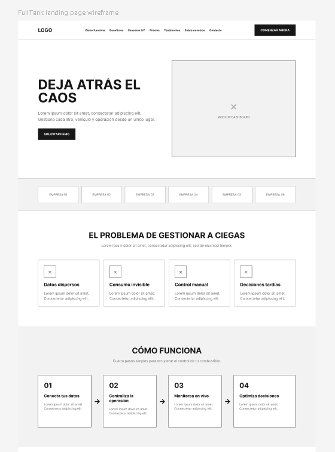
  <br/>
  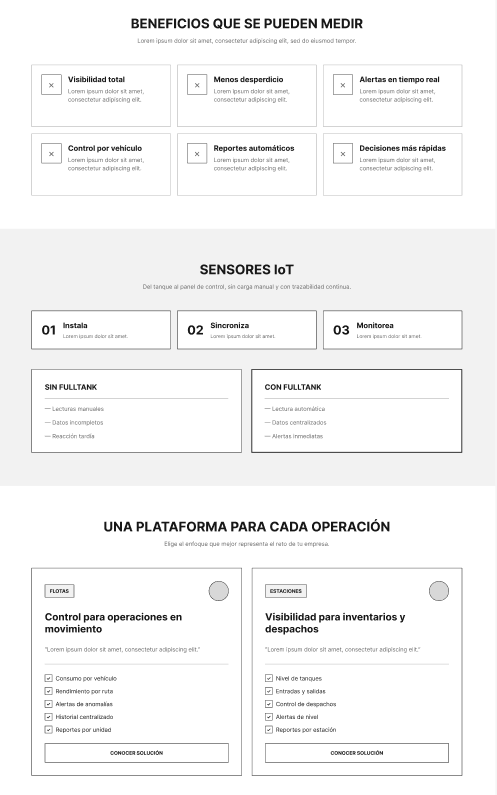
  <br/>
  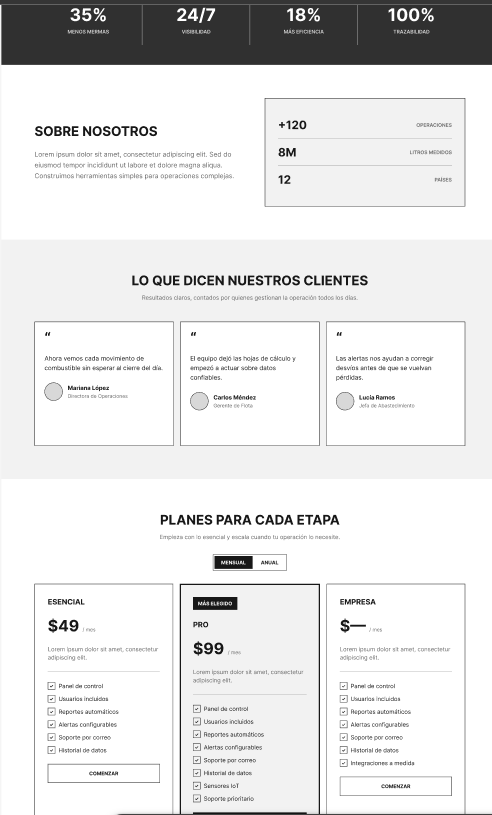
  <br/>
  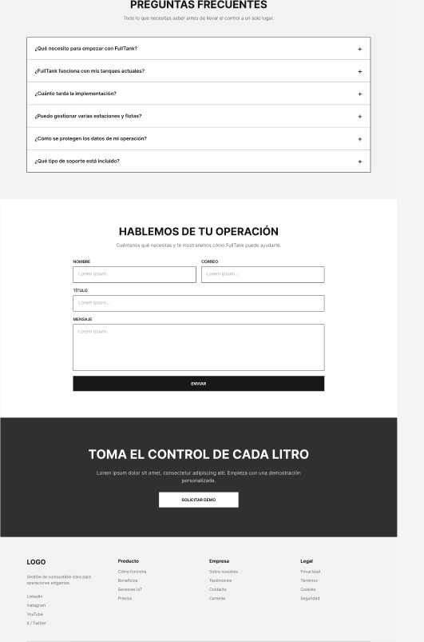
  <p><em>Figura 5.1: Wireframe de la landing page, presentado en cuatro partes consecutivas.</em></p>
</div>

### 5.3.2. Landing Page Mock-up

El mock-up aplica la guía de estilo: el hero usa fondo navy con el título en blanco (Poppins 600) y el botón Registrarse en Azul FullTank 700; las secciones alternan fondo blanco y `#F5F8FC`; los pasos de "Cómo funciona" usan íconos Material Symbols en Azul FullTank; y la sección del dispositivo muestra el indicador de nivel con los colores verde, ámbar y rojo.

<div align="center">
  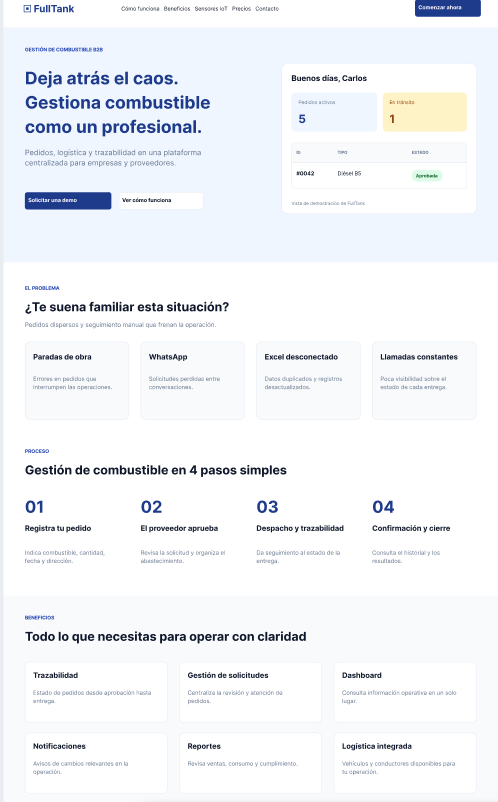
  <br/>
  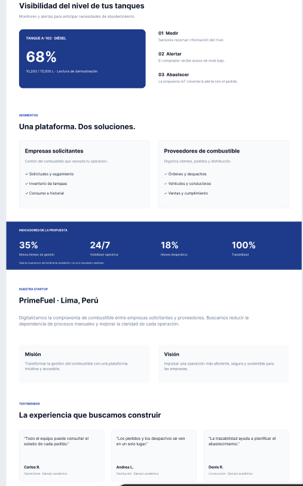
  <br/>
  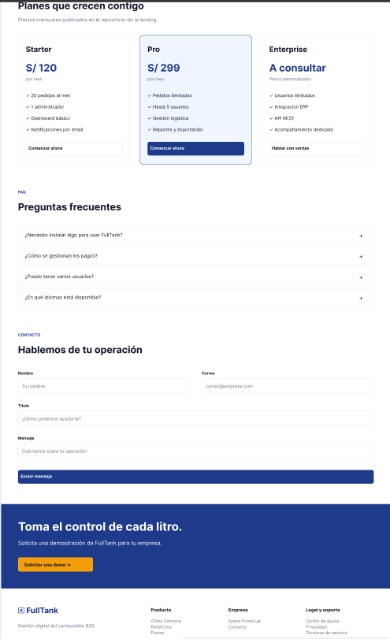
  <p><em>Figura 5.2: Mock-up de la landing page, presentado en tres partes consecutivas.</em></p>
</div>

## 5.4. Applications UX/UI Design

### 5.4.1. Applications Wireframes

Las pantallas se diseñaron a partir de las historias de usuario con mayor prioridad del Product Backlog.

| Pantalla | Aplicación | Contenido principal | Historias |
|---|---|---|---|
| Inicio de sesión y registro | Web y móvil | Correo, contraseña, recuperar contraseña; registro de la organización del distribuidor. | US-15, US-16, US-41 |
| Panel del distribuidor | Web | Indicadores del mes, tanques en nivel crítico, solicitudes pendientes y entregas del día. | US-47 |
| Solicitudes | Web y móvil | Lista con estado, fuente, cliente, tanque, volumen y fecha; filtros. | US-10, US-50 |
| Detalle de solicitud | Web y móvil | Datos de la solicitud y del tanque; botones Aceptar y Rechazar (con motivo). | US-11, US-42 |
| Asignar recursos | Web y móvil | Conductores y cisternas elegibles, aviso de capacidad, ventana y fecha; Confirmar asignación. | US-49, US-22 |
| Entregas | Web y móvil | Lista del día y detalle con pasos Iniciar ruta, Llegué, Completar o Reportar falla, y línea de tiempo. | US-12, US-13, US-55 |
| Clientes y tanques | Web y móvil | Clientes con sus sitios; tanques con nivel, capacidad y política de reposición. | US-51 |
| Flota | Web y móvil | Conductores y cisternas con estado y elegibilidad; alta, edición, desactivación. | US-44, US-45 |
| Productos | Web | Productos con precio y stock. | US-46 |
| Pagos | Web | Pagos por orden con estado; confirmar o reembolsar un pago. | US-13 |
| Reportes | Web | Ventas mensuales, distribución por sector y descarga en PDF. | US-14, US-34, US-35, US-48 |
| Notificaciones | Web y móvil | Bandeja con leídas y no leídas. | US-29, US-30, US-54 |
| Mis pedidos (comprador) | Web | Resumen, historial y detalle de las órdenes de su empresa; confirmar recepción y registrar pago. | US-06, US-07, US-08, US-09, US-18, US-43 |
| Perfil | Web y móvil | Datos del usuario, edición y cierre de sesión. | US-17, US-23, US-24 |

<div align="center">
  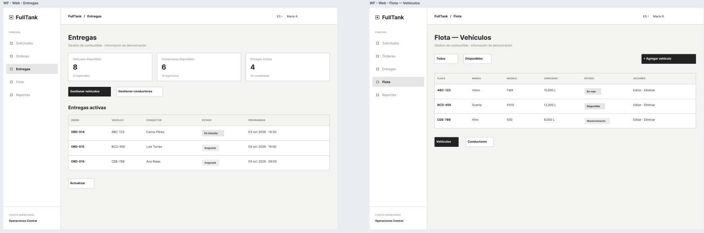
  <br/>
  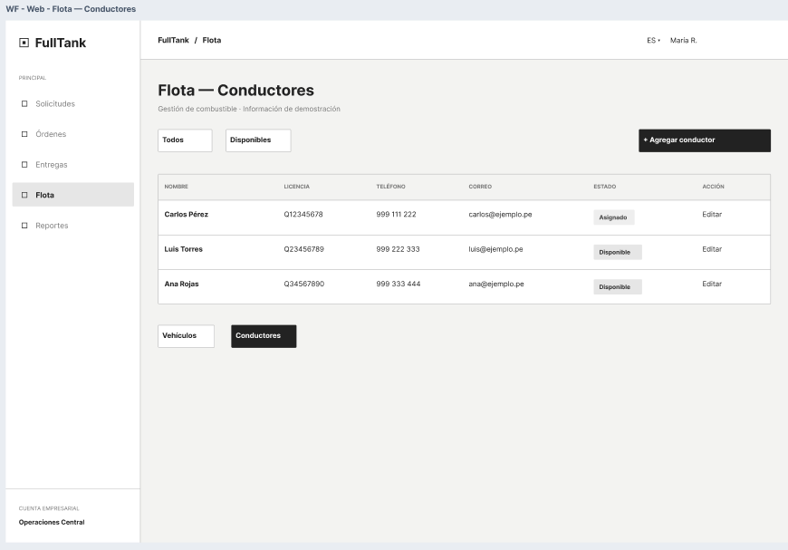
  <br/>
  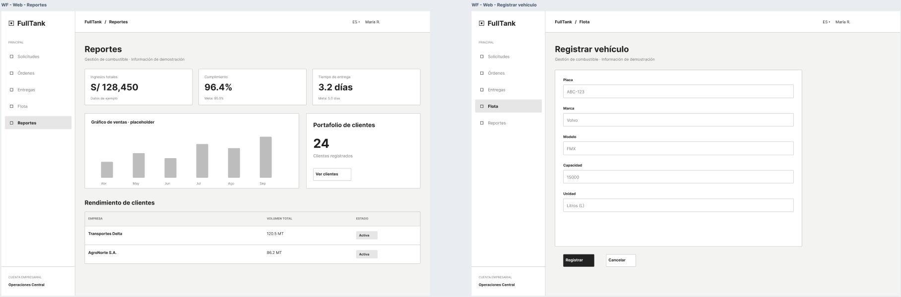
  <p><em>Figura 5.3: Wireframes de la aplicación web, presentados en tres partes.</em></p>
</div>

<div align="center">
  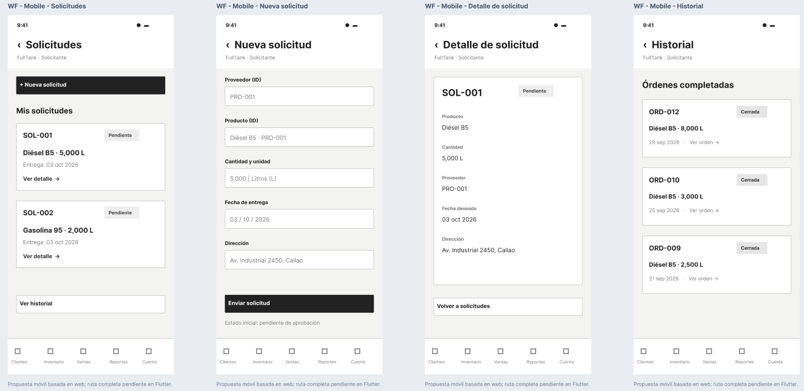
  <br/>
  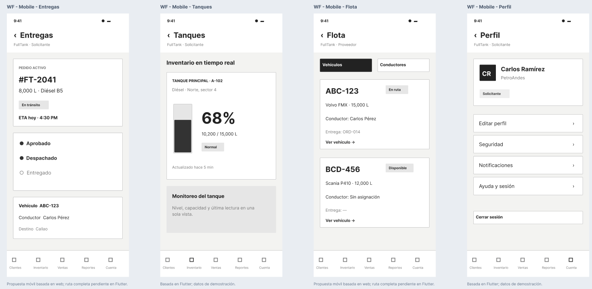
  <p><em>Figura 5.4: Wireframes de la aplicación móvil, presentados en dos partes.</em></p>
</div>

### 5.4.2. Applications Wireflow Diagrams

Los wireflows unen los wireframes con las transiciones de cada objetivo del usuario:

1. **Decidir una solicitud automática:** Notificación → Solicitudes → Detalle de solicitud → Aceptar → Orden creada → Asignar recursos.
2. **Asignar conductor y cisterna:** Asignar recursos → elegir conductor → elegir cisterna → ventana y fecha → Confirmar → Entrega asignada.
3. **Registrar el avance de la entrega (móvil):** Entregas de hoy → Detalle → Iniciar ruta → Llegué → Completar (volumen) → Entrega completada.
4. **Consultar el pedido y pagar (comprador):** Mis pedidos → Detalle de la orden → Registrar pago → Pago pendiente de confirmación.

<div align="center">
  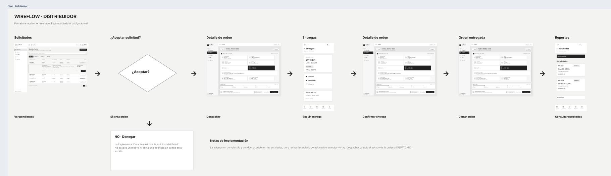
  <p><em>Figura 5.5: Wireflow del distribuidor (solicitud, asignación y entrega).</em></p>
</div>

<div align="center">
  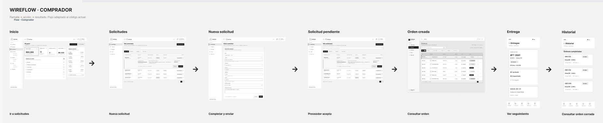
  <p><em>Figura 5.6: Wireflow del comprador asociado.</em></p>
</div>

### 5.4.3. Applications Mock-ups

Los mock-ups aplican la guía de estilo sobre los wireframes. Las decisiones visuales principales son:

- El **nivel del tanque** se muestra como una barra vertical con el porcentaje encima y el color de su rango, y una línea horizontal marca el umbral de la política.
- El **estado** de solicitudes, órdenes, entregas y pagos se muestra con los chips de 5.2.2.
- En **Asignar recursos**, las cisternas cuya capacidad no cubre el volumen de la orden se muestran deshabilitadas con el motivo, y el conductor y la cisterna elegidos se resumen antes de confirmar.
- En el **detalle de la entrega**, la línea de tiempo muestra cada transición con su hora.

<div align="center">
  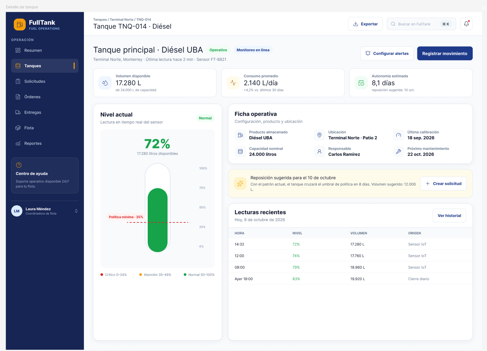
  <p><em>Figura 5.7a (Web): Detalle de tanque, nivel como barra vertical.</em></p>
</div>

<div align="center">
  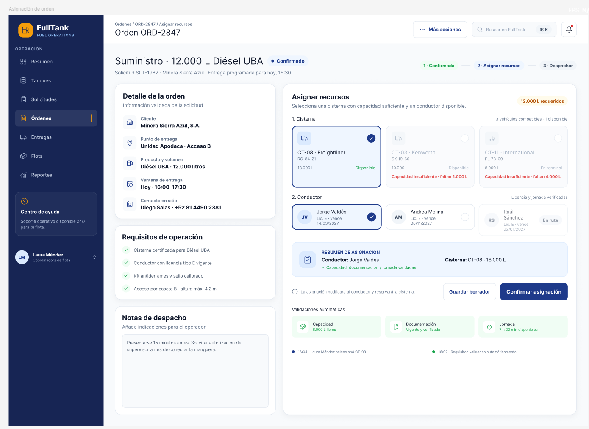
  <p><em>Figura 5.7b (Web): Asignar recursos en una orden.</em></p>
</div>

<div align="center">
  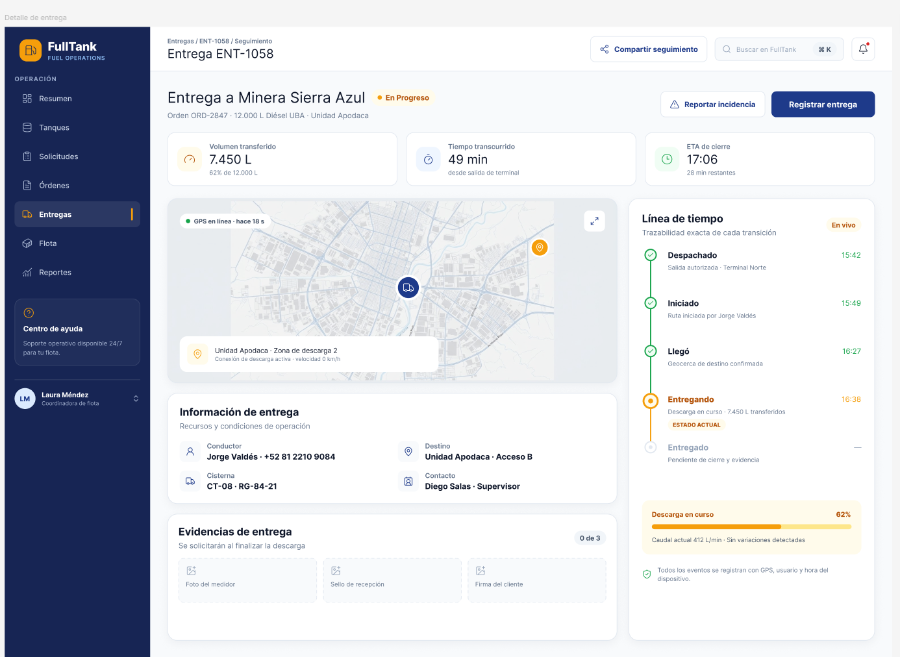
  <p><em>Figura 5.7c (Web): Detalle de entrega con línea de tiempo.</em></p>
</div>

<div align="center">
  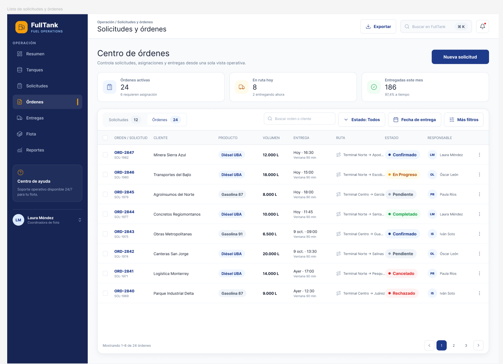
  <p><em>Figura 5.7d (Web): Lista de solicitudes y órdenes con chips de estado.</em></p>
</div>

<div align="center">
  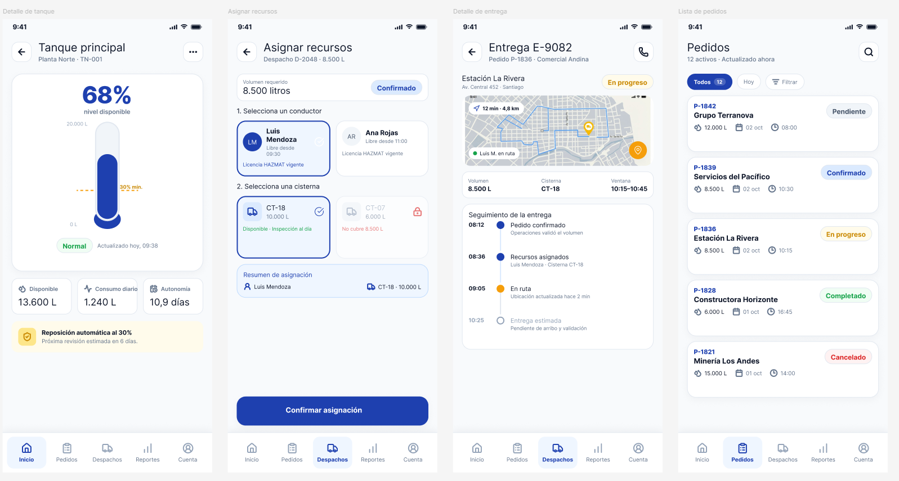
  <p><em>Figura 5.8 (Mobile): Mock-ups de la aplicación móvil.</em></p>
</div>

### 5.4.4. Applications User Flow Diagrams

Los diagramas de flujo de usuario describen las decisiones y los resultados posibles de cada tarea, incluidos los errores que devuelve la API.

<div align="center">
  
  <p><em>Figura 5.9: Revisar y decidir una solicitud automática.</em></p>
</div>

<div align="center">
  
  <p><em>Figura 5.10: Asignar conductor y cisterna.</em></p>
</div>

<div align="center">
  
  <p><em>Figura 5.11: Registrar el avance de la entrega desde la app móvil.</em></p>
</div>

<div align="center">
  
  <p><em>Figura 5.12: Consultar el pedido y registrar el pago (comprador asociado).</em></p>
</div>

<div align="center">
  
  <p><em>Figura 5.13: Registrar cliente, tanque y política de reposición.</em></p>
</div>

## 5.5. Applications Prototyping

El prototipo navegable se construyó en Figma a partir de los mock-ups y cubre los cuatro wireflows de 5.4.2: decidir una solicitud, asignar recursos, registrar el avance de la entrega en móvil y consultar el pedido y pagar como comprador.

- **Prototipo en Figma:** **[pendiente: enlace del prototipo]**
- **Video de recorrido:** **[pendiente: enlace del video]**

<div align="center">
  
  <p><em>Figura 5.14: Vista general del prototipo navegable.</em></p>
</div>

## 5.6. IoT Device Design

El **Tank Monitoring Device** se instala en la parte superior del tanque del comprador asociado y mide la distancia hasta la superficie del combustible. Con esa distancia y la geometría del tanque calcula el volumen y lo envía a FullTank. El diseño sigue las cuatro capas de una solución IoT: física, de intercambio de datos, de integración de información y de servicio de aplicación.

<div align="center">
  
  <p><em>Figura 5.15: Arquitectura del Tank Monitoring Device por capas IoT.</em></p>
</div>

**Requisitos.**

- Medir el nivel sin contacto con el combustible y resistir la humedad del tanque.
- Enviar lecturas de forma periódica y cuando el nivel cambie de forma relevante.
- Autenticarse ante la API con un token propio del dispositivo, sin usuario ni contraseña.
- No duplicar lecturas si reintenta un envío y no perder el orden de las lecturas si se reinicia.

**Componentes.**

| Componente | Función | Observación |
|---|---|---|
| ESP32 DevKit V1 | Microcontrolador con Wi-Fi que ejecuta el firmware. | Entradas a 3,3 V. |
| JSN-SR04T | Sensor ultrasónico impermeable, rango aproximado de 25 a 450 cm. | En Cirkit Designer se reemplaza por el HC-SR04, que usa el mismo protocolo TRIG/ECHO. |
| Resistencias 1 kΩ y 2 kΩ | Divisor de tensión para bajar la señal ECHO de 5 V a 3,3 V. | Protege el GPIO del ESP32. |
| LED verde, ámbar y rojo + resistencias de 220 Ω | Indicador local del nivel y de errores de conexión. | Ver 5.1.2. En Cirkit Designer se simulan con resistencias de 47 Ω para que el LED sea visible; en el montaje físico se usan 220 Ω. |
| Pantalla LCD 16x2 con módulo I2C | Muestra el porcentaje y el volumen del tanque. | Dirección I2C 0x27. |
| Pulsadores (2) | Simulan el aumento y la disminución de la distancia medida. | Solo para la simulación en Cirkit Designer; no se montan en el dispositivo final. |
| Fuente de 5 V | Alimenta el ESP32 (pin VIN), el sensor y la pantalla LCD. | — |
| Protoboard y cables | Montaje del prototipo. | — |

**Conexiones.** Los pines son la propuesta de diseño y coinciden con el circuito de Cirkit Designer; si se cambia algún GPIO, esta tabla debe reflejarlo.

| Desde | Hacia | Nota |
|---|---|---|
| JSN-SR04T VCC | 5 V (VIN) | Alimentación del sensor. |
| JSN-SR04T GND | GND | Tierra común. |
| JSN-SR04T TRIG | GPIO 5 | Pulso de disparo de 10 µs. |
| JSN-SR04T ECHO | Divisor 1 kΩ / 2 kΩ → GPIO 18 | Señal de eco reducida a 3,3 V. |
| LED verde / ámbar / rojo | GPIO 25 / 26 / 27 (con 220 Ω) | Indicador de nivel y de error. En la simulación se usan 47 Ω. |
| LCD I2C VCC | 5 V (VIN) | Alimentación de la pantalla. |
| LCD I2C GND | GND | Tierra común. |
| LCD I2C SDA | GPIO 21 | Bus I2C por defecto del ESP32. |
| LCD I2C SCL | GPIO 22 | Bus I2C por defecto del ESP32. |
| Pulsador SUBIR | GPIO 32 (con INPUT_PULLUP) y GND | Solo simulación: aumenta la distancia. |
| Pulsador BAJAR | GPIO 33 (con INPUT_PULLUP) y GND | Solo simulación: disminuye la distancia. |

<div align="center">
  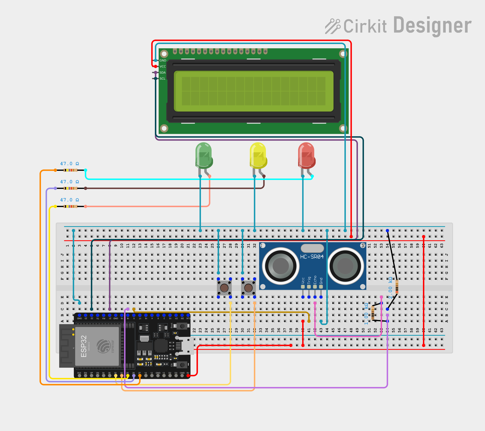
  <p><em>Figura 5.16: Circuito del Tank Monitoring Device en Cirkit Designer.</em></p>
</div>

**Procesamiento en el dispositivo.**

1. Se toman cinco mediciones y se usa la mediana para descartar ecos falsos. La distancia es el tiempo del eco por 0,0343 cm/µs dividido entre 2.
2. La altura del líquido es la altura del tanque menos la distancia y menos la separación entre el sensor y el nivel máximo. Para un tanque cilíndrico vertical, el volumen es esa altura dividida entre la altura útil por la capacidad del tanque. La altura, la capacidad y la separación se configuran en el firmware para cada tanque.
3. Se envía una lectura en cada intervalo de muestreo o antes, si el nivel cambió más de 2 %.

**Contrato con la API.** El dispositivo envía `POST /api/telemetry/readings` con la cabecera `X-Device-Token` y este cuerpo:

```json
{
  "schemaVersion": 1,
  "deviceId": "FT-ESP32-0001",
  "channel": "level",
  "sequence": 1024,
  "capturedAt": "2026-09-29T15:00:00Z",
  "level": 1520.5,
  "unit": "LITRE"
}
```

La API responde 202 cuando la lectura se aceptó, cuando es un duplicado y cuando quedó en cuarentena, y 400 cuando el cuerpo no es válido. De este contrato salen tres decisiones del firmware:

- **Secuencia persistente.** La API descarta una lectura cuya secuencia ya recibió de ese dispositivo y canal, así que la secuencia se guarda en la memoria no volátil (NVS) y no vuelve a cero al reiniciar. Si un envío falla, la misma lectura se reenvía con la misma secuencia, lo que evita duplicados si el primer envío sí llegó.
- **Hora real.** El nivel del tanque ignora las lecturas con `capturedAt` igual o anterior a la última aplicada, y ese instante también se usa para ubicar la lectura dentro del vínculo dispositivo-tanque. Por eso el dispositivo sincroniza la hora por NTP antes de medir.
- **Nivel en volumen.** La API recibe el nivel como volumen (`level` y `unit`), no como distancia; la conversión se hace en el dispositivo.

**Seguridad.** El token del dispositivo lo emite la plataforma al registrar el dispositivo y en el servidor solo se guarda su hash. En el dispositivo se guarda en NVS y no en el código fuente del repositorio. Si el dispositivo se retira o se pierde, el distribuidor revoca la credencial y las lecturas siguientes quedan en cuarentena.

<div align="center">
  
  <p><em>Figura 5.17: Ciclo del firmware del Tank Monitoring Device.</em></p>
</div>
