# Capítulo VI: Product Implementation, Validation & Deployment

Este capítulo describe cómo se construyó, probó y desplegó FullTank durante el Sprint 1. El alcance del sprint es la **landing page**, la **aplicación web** y los **web services** (backend). La aplicación móvil no forma parte de este sprint. Los datos de este capítulo salen de los repositorios de la organización [16518-IoT-PrimeFuel](https://github.com/16518-IoT-PrimeFuel) en GitHub.

## 6.1. Software Configuration Management

### 6.1.1. Software Development Environment Configuration

Las herramientas que usa el equipo, agrupadas por actividad del ciclo de vida, son:

**Project Management**

| Herramienta | Uso | Referencia |
|---|---|---|
| Trello | Tablero del Product Backlog y del Sprint Backlog, con las tarjetas de cada historia y su estado. | https://trello.com/ |
| **[por confirmar: herramienta de mensajería y reuniones]** | Comunicación diaria y reuniones del equipo. | — |
| GitHub (organización) | Repositorios, ramas e historial de cada producto. | https://github.com/16518-IoT-PrimeFuel |

**Requirements Management**

| Herramienta | Uso | Referencia |
|---|---|---|
| Miro | Sesiones de *EventStorming* de la fase de análisis y de diseño. | https://miro.com/ |
| Markdown en GitHub | Redacción de las historias de usuario y sus criterios de aceptación en el informe. | https://github.com/16518-IoT-PrimeFuel/Report |

**Product UX/UI Design**

| Herramienta | Uso | Referencia |
|---|---|---|
| Figma | Wireframes, mock-ups y prototipo de la landing page y de las aplicaciones. | https://www.figma.com/ |
| Structurizr | Diagramas C4 (contexto, contenedores, componentes y despliegue) a partir de un archivo DSL. | https://structurizr.com/ |
| PlantUML | Diagramas de clases, de base de datos, de secuencia y de flujo de usuario. | https://plantuml.com/ |
| Cirkit Designer | Diseño y simulación del circuito del dispositivo IoT. | https://www.cirkitdesigner.com/ |

**Software Development**

| Producto | Herramienta | Versión o detalle |
|---|---|---|
| Web Services | Java (JDK) | 26 |
| Web Services | Spring Boot | 4.0.6 (Web, Data JPA, Security, Validation, Mail) |
| Web Services | Maven Wrapper | `mvnw` incluido en el repositorio; no requiere Maven instalado |
| Web Services | MySQL y Flyway | MySQL 8; Flyway aplica 37 migraciones, numeradas de `V1` a `V38` |
| Web Services | Lombok, jjwt 0.12.6, springdoc-openapi 3.0.3 | Reducción de código repetitivo, JWT y documentación OpenAPI |
| Web Services | IntelliJ IDEA | IDE para Java |
| Web Application | Node.js y npm | npm 11 (declarado en `packageManager`) |
| Web Application | Angular y Angular CLI | 21.2 |
| Web Application | Angular Material, Chart.js (ng2-charts), ngx-translate | Componentes, gráficos e internacionalización (español e inglés) |
| Web Application | TypeScript | 5.9 |
| Web Application | Visual Studio Code o WebStorm | IDE para TypeScript |
| Landing Page | HTML5, CSS3 y JavaScript | Sin framework ni proceso de compilación |
| Todos | Git | Control de versiones |

Para ejecutar los web services en una máquina de desarrollo se necesitan el JDK 26 y MySQL 8, y dos variables de entorno: `AUTHORIZATION_JWT_SECRET` (secreto de al menos 32 bytes, sin valor por defecto) y `DATABASE_PASSWORD` (la contraseña del usuario de MySQL). Las demás tienen valores por defecto para desarrollo (`localhost`, puerto 3306, base `fulltank_platform`, usuario `root` y puerto 8080). Con eso, `./mvnw spring-boot:run` inicia la API con el perfil `dev` y Flyway crea el esquema. La aplicación web se inicia con `npm install` y `npm start`, y queda en `http://localhost:4200` apuntando a `http://localhost:8080/api`.

**Software Testing**

| Producto | Herramienta | Uso |
|---|---|---|
| Web Services | JUnit y Spring Boot Test | Pruebas unitarias del dominio y pruebas de integración de los endpoints. |
| Web Services | H2 | Base de datos en memoria para las pruebas. |
| Web Services | Spring Security Test | Pruebas de autorización por rol y por organización. |
| Web Services | ArchUnit 1.5 | Pruebas de arquitectura que verifican los límites entre módulos. |
| Web Application | Vitest 4 con JSDOM | Pruebas unitarias de componentes y *stores*, ejecutadas con `ng test`. |

**Software Deployment**

| Herramienta | Uso | Referencia |
|---|---|---|
| Docker | Imagen de los web services, definida en el `Dockerfile` del repositorio. | https://www.docker.com/ |
| Render | Ejecución de los web services como *Web Service* a partir de la imagen Docker. | https://render.com/ |
| Aiven | Base de datos MySQL administrada. | https://aiven.io/ |
| Vercel | Publicación de la aplicación web. | https://vercel.com/ |

**Software Documentation**

| Herramienta | Uso | Referencia |
|---|---|---|
| GitHub y Markdown | Informe del proyecto, versionado en el repositorio `Report`. | https://github.com/16518-IoT-PrimeFuel/Report |
| Swagger UI (springdoc-openapi) | Documentación navegable de los web services, generada desde las anotaciones de los controladores. | https://fulltank-backend.onrender.com/swagger-ui.html |

### 6.1.2. Source Code Management

El código se gestiona en GitHub, dentro de la organización **16518-IoT-PrimeFuel**. Cada producto tiene su repositorio:

| Producto | Repositorio |
|---|---|
| Informe | https://github.com/16518-IoT-PrimeFuel/Report |
| Landing Page | https://github.com/16518-IoT-PrimeFuel/landing-page |
| Web Application | https://github.com/16518-IoT-PrimeFuel/frontend |
| Web Services | https://github.com/16518-IoT-PrimeFuel/backend |
| Mobile Application (fuera del Sprint 1) | https://github.com/16518-IoT-PrimeFuel/mobile-app |

**Flujo de ramas.** Se usa GitFlow con estas ramas:

- `main`: versión estable y desplegada. Render y Vercel publican desde esta rama.
- `develop`: rama de integración, donde se juntan las funcionalidades terminadas.
- `feat/<nombre>`: una rama por funcionalidad o grupo de cambios, creada desde `develop`. Durante el sprint se usaron, por ejemplo, `feat/w1-guardrails` y `feat/w2-debug` en el backend, `feat/w1-backend-integration` en el frontend y `feat/new-features-and-versions` en la landing page.
- `release/<versión>` y `hotfix/<nombre>`: reservadas para preparar una entrega y para corregir un error en producción.

En el repositorio del informe, cada integrante trabaja en una rama con su nombre y la integra a `develop`.

**Versiones.** Las entregas se numeran con *Semantic Versioning* (`MAYOR.MENOR.PARCHE`). Los web services declaran la versión `0.0.1-SNAPSHOT` en el `pom.xml` y la muestran en la documentación OpenAPI.

**Mensajes de commit.** Se sigue *Conventional Commits*, en inglés, con el formato `<tipo>(<ámbito>): <descripción>`. Los tipos usados son `feat`, `fix`, `refactor`, `test`, `docs` y `chore`, y el ámbito suele ser el *bounded context* o el módulo. Durante el sprint, todos los commits del frontend cumplieron el formato; en el backend, 14 commits del 26 y 27 de setiembre se escribieron en español y sin prefijo, y quedan como excepción. Por ejemplo:

```text
feat(equipment): look up and link registered buyers by RUC
fix(payment): refund only completed payments
refactor(analytics): extract analytics bounded context from reporting
test(replenishment): use a relative date in acceptance test
```

### 6.1.3. Source Code Style Guide & Conventions

Todo el código (nombres de clases, métodos, variables, rutas y tablas) se escribe en inglés. Los textos que ve el usuario están en archivos de traducción y los mensajes de la documentación OpenAPI, en español.

**Java y Spring Boot (web services).**

- Se siguen la [Google Java Style Guide](https://google.github.io/styleguide/javaguide.html) y las convenciones de Spring: clases en `UpperCamelCase`, métodos y variables en `lowerCamelCase`, constantes en `UPPER_SNAKE_CASE` y paquetes en minúsculas.
- Cada *bounded context* es un paquete (`iam`, `equipment`, `replenishment`, etc.) con las capas `domain`, `application`, `infrastructure` e `interfaces`, más un paquete `api` con lo que otros contextos pueden usar.
- Los nombres indican el rol de la clase: `*Command`, `*Query`, `*CommandService`, `*QueryService`, `*Repository`, `*Controller`, `*Resource` y `*Assembler`.
- Los servicios de aplicación devuelven `Result<T, ApplicationError>` y los controladores traducen el error al código HTTP.
- **REST:** todas las rutas están bajo `/api`, con sustantivos en plural y `kebab-case` (`/api/replenishment-requests`, `/api/fuel-products`). Las acciones que no son un CRUD se expresan como un subrecurso con `POST` (`/api/deliveries/{id}/start`).
- **Base de datos:** tablas y columnas en `snake_case` y tablas en plural (`fuel_orders`, `refill_policies`). Los cambios de esquema se hacen solo con migraciones de Flyway llamadas `V<número>__<descripcion>.sql`; una migración aplicada no se edita.

**TypeScript y Angular (web application).**

- Se sigue la [Angular Style Guide](https://angular.dev/style-guide). El formato lo fijan `.editorconfig` y Prettier: sangría de 2 espacios, comillas simples y líneas de hasta 100 caracteres.
- El código se organiza por *bounded context* (`iam`, `equipment`, `ordering`, `fulfillment`, `inventory`, `analytics`, `notification`), con las capas `domain`, `application`, `infrastructure` y `presentation`; un contexto solo crea las capas que necesita.
- Archivos en `kebab-case` (`provider-tank-form.ts`), clases en `UpperCamelCase` y variables en `lowerCamelCase`.
- Ningún texto visible se escribe en el componente: todos salen de `public/i18n/es.json` y `en.json`, que tienen las mismas claves.

**HTML, CSS y JavaScript (landing page).**

- HTML semántico (`nav`, `section`, `footer`), con un `id` por sección para la navegación por anclas y atributos `aria-label` en los controles.
- CSS con variables en `:root` para colores, tipografía y bordes, y clases en `kebab-case`.
- Se sigue la [Google HTML/CSS Style Guide](https://google.github.io/styleguide/htmlcssguide.html).

**Gherkin.** Los criterios de aceptación de las historias de usuario se redactan con la estructura *Given – When – Then*, como se muestra en la sección 3.1.

### 6.1.4. Software Deployment Configuration

**Web Services (Render + Aiven).**

1. La imagen se construye con el `Dockerfile` del repositorio, en dos etapas: la primera compila el proyecto con `./mvnw -B clean package -DskipTests` sobre `eclipse-temurin:26-jdk`, y la segunda copia el `.jar` a una imagen `eclipse-temurin:26-jre` y lo ejecuta con `java -jar app.jar`.
2. En Render se crea un *Web Service* conectado al repositorio `backend`, rama `main`, con entorno Docker. Render define el puerto en la variable `PORT`, que la aplicación lee con `server.port=${PORT:8080}`.
3. En Aiven se crea el servicio MySQL. La aplicación se conecta con `sslMode=REQUIRED` y un *pool* de hasta tres conexiones.
4. Al iniciar con el perfil `prod`, Flyway aplica las migraciones pendientes e Hibernate solo valida el esquema (`ddl-auto=validate`).

Las variables de entorno que se configuran en Render son:

| Variable | Uso |
|---|---|
| `SPRING_PROFILES_ACTIVE` | `prod`, para activar la configuración de producción. |
| `DATABASE_URL`, `DATABASE_PORT`, `DATABASE_NAME` | Servidor, puerto y nombre de la base de datos de Aiven. |
| `DATABASE_USER`, `DATABASE_PASSWORD` | Credenciales de la base de datos. |
| `AUTHORIZATION_JWT_SECRET` | Secreto con el que se firman los JWT (mínimo 32 bytes). |
| `CORS_ALLOWED_ORIGINS` | Origen permitido de la aplicación web. Si no se define, se usa `https://primefuel-frontend-three.vercel.app`. |
| `SERVER_URL` | URL pública de la API que se muestra en la documentación OpenAPI. |
| `SMTP_HOST`, `SMTP_PORT`, `SMTP_USERNAME`, `SMTP_PASSWORD`, `SMTP_AUTH`, `SMTP_STARTTLS`, `MAIL_FROM` | Servidor de correo para el restablecimiento de contraseña. |
| `PASSWORD_RESET_LINK` | Dirección de la pantalla de restablecimiento que se envía por correo. Su valor por defecto es un enlace de la aplicación móvil (`fulltank:///reset-password`), así que en producción debe definirse con la ruta `/reset-password` de la aplicación web. |

Ninguna credencial está en el repositorio. El primer administrador de la plataforma se habilita con el script `scripts/seed-first-admin.sql`.

**Web Application (Vercel).**

1. La URL de la API de producción está en `src/environments/environment.ts` (`https://fulltank-backend.onrender.com/api`); la de desarrollo, en `environment.development.ts`.
2. En Vercel se importa el repositorio `frontend`, rama `main`. El comando de compilación es `ng build` y la carpeta de salida, `dist/Fronted-FullTank/browser`.
3. Como es una SPA, todas las rutas deben devolver `index.html` para que el enrutador de Angular las resuelva.
4. El origen de Vercel debe coincidir con el valor de `CORS_ALLOWED_ORIGINS` del backend.

**Landing Page.** Es un sitio estático (`index.html`, `style.css`, `main.js` y la carpeta `img`), sin proceso de compilación, por lo que se publica sirviendo directamente los archivos de la rama `main`.

**Direcciones de producción.**

| Producto | URL |
|---|---|
| Web Application | https://primefuel-frontend-three.vercel.app |
| Web Services (API) | https://fulltank-backend.onrender.com/api |
| Documentación de la API (Swagger UI) | https://fulltank-backend.onrender.com/swagger-ui.html |
| Landing Page | **[pendiente: URL pública de la landing page]** |

## 6.2. Landing Page, Services & Applications Implementation

### 6.2.1. Sprint 1

#### 6.2.1.1. Sprint Planning 1

| Sprint # | Sprint 1 |
|---|---|
| **Sprint Planning Background** | |
| Date | 21/09/2026 *(por confirmar)* |
| Time | **[pendiente: hora]** |
| Location | **[pendiente: lugar o herramienta de la reunión]** |
| Prepared By | Ponce Perales, Alberto Alejandro|
| Attendees (to planning meeting) | Bonifacio Jaramillo, Samuel Jesus; Castro Pariona, Jefferson Ernesto; Mejia Aliaga, Katherine Maryory; Ponce Perales, Alberto Alejandro; Delgado Carrasco, Schneider Carlos Alberto; Lopez Goitia, Carlos Alberto; Rodriguez Parco, Joseph Pablo |
| Sprint 0 Review Summary | No aplica: es el primer sprint. Antes del sprint el equipo redefinió el segmento objetivo y dejó como único segmento al Distribuidor Logístico de Combustible. |
| Sprint 0 Retrospective Summary | No aplica: es el primer sprint. |
| **Sprint Goal & User Stories** | |
| Sprint 1 Goal | Entregar al Distribuidor Logístico de Combustible el flujo completo de abastecimiento en la aplicación web: vincular a su comprador, registrar el tanque con su dispositivo, recibir la solicitud generada por el nivel bajo, aceptarla, asignar conductor y cisterna, registrar la entrega y confirmar el pago. Creemos que esto permite al distribuidor atender una reposición sin llamadas ni hojas de cálculo. Lo confirmaremos cuando un distribuidor complete ese flujo de inicio a fin en la aplicación desplegada. |
| Sprint 1 Velocity | 97 *(capacidad planificada; al ser el primer sprint no hay velocidad previa)* |
| Sum of Story Points | 97 |

El sprint duró dos semanas, del 21/09/2026 al 02/10/2026, que es el período en el que se concentran los commits de los repositorios `backend` y `frontend`.

#### 6.2.1.2. Aspect Leaders and Collaborators

La matriz indica quién lideró (L) y quién colaboró (C) en cada aspecto del sprint. Se elaboró a partir de los commits de cada repositorio y debe confirmarse con el equipo.

| Team Member (Last Name, First Name) | GitHub Username | Landing Page | Web Services | Web Application | UX/UI Design | Informe |
|---|---|:---:|:---:|:---:|:---:|:---:|
| Bonifacio Jaramillo, Samuel Jesus | samuelbonifacio015 | C | L | L | — | C |
| Rodriguez Parco, Joseph Pablo | eJosR-Coding | — | C | — | — | C |
| Castro Pariona, Jefferson Ernesto | Jefferson Castro | L | — | — | — | C |
| Ponce Perales, Alberto Alejandro | Alberto Alejandro Ponce Perales | — | — | — | L | L |
| Delgado Carrasco, Schneider Carlos Alberto | schneiderdc | — | — | — | C | C |
| Lopez Goitia, Carlos Alberto | CarlosAlb101 | — | — | — | C | C |
| Mejia Aliaga, Katherine Maryory | KathMJ | — | — | — | C | C |

#### 6.2.1.3. Sprint Backlog 1

El Sprint Backlog reúne las historias de usuario que dan forma al flujo de abastecimiento del distribuidor, las del comprador asociado que lo acompañan y las de la landing page. Los *story points* son los del Product Backlog (sección 3.3). El tablero del sprint está en Trello: https://trello.com/invite/b/69e2fd01ee5b055b2d967a45/ATTI05a9ebca4c1da02108fc92fa76bfa07e412172F6/fulltank

<div align="center">
  
  <p><em>Figura 6.1: Sprint Backlog 1 en Trello.</em></p>
</div>

| User Story | SP | Task | Descripción de la tarea | Asignado a | Estado |
|---|:---:|---|---|---|---|
| US-51 Asociar tanque y dispositivo IoT | 3 | T01 | Web services: registrar y editar el tanque de un comprador con producto, umbral y dispositivo, en una transacción. | Samuel Bonifacio | Done |
| | | T02 | Web: formulario Asociar tanque y detalle del tanque con lecturas y episodios. | Samuel Bonifacio | Done |
| | | T03 | Emitir el token del dispositivo desde la aplicación web. | Por asignar | To-Do |
| US-50 Generar solicitud automática por umbral IoT | 5 | T04 | Web services: ingesta de lecturas con token de dispositivo, sin duplicados y con cuarentena. | Samuel Bonifacio, Joseph Rodriguez | Done |
| | | T05 | Web services: política de reposición, episodios de nivel bajo y solicitud automática. | Samuel Bonifacio, Joseph Rodriguez | Done |
| | | T06 | Web: bandeja de solicitudes con el origen Automática o Manual. | Samuel Bonifacio | Done |
| US-31 Ver listado de empresas / US-32 Ver detalles de empresa | 2 + 2 | T07 | Web services: compradores vinculados, búsqueda por RUC y vínculo explícito. | Samuel Bonifacio | Done |
| | | T08 | Web: Clientes y tanques, registro de comprador y detalle con sitios, tanques y pedidos. | Samuel Bonifacio | Done |
| US-10 Ver solicitudes pendientes / US-11 Aceptar solicitud / US-42 Rechazar solicitud | 2 + 3 + 2 | T09 | Web services: bandeja del distribuidor y aceptación en una transacción que crea la orden. | Samuel Bonifacio | Done |
| | | T10 | Web: lista y detalle de solicitud con Aceptar y Rechazar con motivo. | Samuel Bonifacio | Done |
| US-22 Validar disponibilidad y capacidad | 5 | T11 | Web services: reserva de conductor y cisterna con bloqueo, capacidad suficiente y sin traslape de ventana. | Samuel Bonifacio | Done |
| US-49 Asignar recursos a despacho | 5 | T12 | Web services: asignación transaccional e idempotente (stock, flota, entrega y orden). | Samuel Bonifacio | Done |
| | | T13 | Web services y web: recomendación de conductor y cisterna, y pantalla de asignación. | Samuel Bonifacio | Done |
| | | T14 | Considerar la compatibilidad de producto y la ruta en la recomendación. | Por asignar | To-Do |
| US-44 Gestionar vehículos de flota / US-45 Gestionar conductores | 3 + 3 | T15 | Web services: conductores, cisternas y elegibilidad. | Samuel Bonifacio | Done |
| | | T16 | Web: listas y formularios de vehículos y conductores con su elegibilidad. | Samuel Bonifacio | Done |
| US-12 Marcar pedido como despachado / US-13 Cerrar pedido | 2 + 2 | T17 | Web services: ciclo físico de la entrega y efectos del cierre sobre flota, stock y orden. | Samuel Bonifacio, Joseph Rodriguez | Done |
| | | T18 | Web: lista de entregas por fecha y detalle con acciones, transiciones y línea de tiempo. | Samuel Bonifacio | Done |
| US-46 Gestionar inventario de combustibles | 3 | T19 | Web services y web: productos con precio y stock, y aviso de catálogo vacío. | Samuel Bonifacio | Done |
| US-08 Registrar información de pago | 3 | T20 | Web services: pagos por distribuidor, confirmación y reembolso solo de pagos completados. | Samuel Bonifacio | Done |
| | | T21 | Web: pago del comprador y pantalla Pagos del distribuidor. | Samuel Bonifacio | Done |
| US-47 Ver Dashboard principal del proveedor / US-34 Ver gráfico de ventas | 3 + 3 | T22 | Web services: contexto Analytics con período y tendencia de ventas. | Samuel Bonifacio | Done |
| | | T23 | Web: tablero y pantalla Analytics. | Samuel Bonifacio | Done |
| US-29 Recibir notificación de aprobación / US-30 Notificación de pedido despachado | 2 + 2 | T24 | Web services: bandeja in-app generada a partir de los eventos; el comprador recibe la aceptación o el rechazo de su solicitud. | Samuel Bonifacio, Joseph Rodriguez | Done |
| | | T25 | Web: bandeja de notificaciones y contador de no leídas. | Samuel Bonifacio | Done |
| | | T26 | Notificar al comprador cuando su pedido es despachado. | Por asignar | To-Do |
| US-41 Registrar empresa proveedora / US-40 Registrar empresa solicitante / US-15 Iniciar sesión / US-16 Recuperar contraseña / US-17 Cerrar sesión | 3 + 3 + 2 + 2 + 1 | T27 | Web services: organizaciones, membresías, invitaciones y restablecimiento de contraseña. | Samuel Bonifacio, Joseph Rodriguez | Done |
| | | T28 | Web: inicio de sesión, registro, recuperación de contraseña e invitaciones. | Samuel Bonifacio | Done |
| US-05 Registrar pedido de contingencia / US-06 Consultar estado del pedido / US-09 Ver historial de pedidos / US-43 Ver detalle de pedido | 5 + 2 + 2 + 2 | T29 | Web: nueva solicitud, órdenes, detalle de orden e historial de pagos del comprador. | Samuel Bonifacio | Done |
| US-39 Cambiar idioma | 3 | T30 | Web: traducción al español y al inglés de todas las pantallas. | Samuel Bonifacio | Done |
| US-01, US-02, US-03, US-36, US-37, US-38, US-25, US-26 y US-04 (secciones de la landing page) | 17 | T31 | Landing: secciones base, sensores IoT, planes, preguntas frecuentes y contacto. | Samuel Bonifacio | Done |
| | | T32 | Landing: contenido enfocado en el Distribuidor Logístico de Combustible. | Jefferson Castro | In-Process |
| Despliegue | — | T33 | Web services en Render con Docker y base de datos en Aiven. | Samuel Bonifacio | Done |
| | | T34 | Web en Vercel y configuración de CORS. | Samuel Bonifacio | Done |

Al cierre del sprint quedaron tres tareas sin empezar (T03, T14 y T26) y una en curso (T32, cuya rama todavía no se integró a `main`). Por eso las historias US-51, US-49 y US-30 pasan parcialmente al siguiente sprint.

#### 6.2.1.4. Development Evidence for Sprint Review

Durante el sprint se registraron 180 commits en la rama `main` del repositorio `backend` y 92 en la del repositorio `frontend`. Las tablas muestran los más representativos de cada producto; el historial completo está en GitHub.

**Landing Page** (https://github.com/16518-IoT-PrimeFuel/landing-page)

| Repository | Branch | Commit Id | Commit Message | Commit Message Body | Committed on | Autor |
|---|---|---|---|---|---|---|
| landing-page | main | acf54d7 | Initial commit: landing page | — | 10/09/2026 | Samuel Bonifacio |
| landing-page | main | 64eb6bd | feat(problem): update problem section UI | — | 10/09/2026 | Samuel Bonifacio |
| landing-page | main | 1eae7de | feat(sensors): add IoT sensors section and update navigation | — | 10/09/2026 | Samuel Bonifacio |
| landing-page | feat/new-features-and-versions | bf58ba2 | feat(landing): focus distributor conversion flow | — | 01/10/2026 | Jefferson Castro |

**Web Services** (https://github.com/16518-IoT-PrimeFuel/backend)

| Repository | Branch | Commit Id | Commit Message | Commit Message Body | Committed on | Autor |
|---|---|---|---|---|---|---|
| backend | main | 56d8826 | feat: add versioned database migration baseline | — | 22/09/2026 | Samuel Bonifacio |
| backend | main | 6fdb680 | feat: add organization onboarding and invitations | — | 22/09/2026 | Samuel Bonifacio |
| backend | main | 3216436 | feat: ingest telemetry and update tank readings | — | 22/09/2026 | Samuel Bonifacio |
| backend | main | a1ec644 | feat: trigger automatic refill generation from telemetry and manual readings | — | 22/09/2026 | Samuel Bonifacio |
| backend | main | 9411b9a | feat: add fleet reservation model with pessimistic locking (T13-A) | — | 22/09/2026 | Samuel Bonifacio |
| backend | main | 71b17bd | feat: orchestrate transactional delivery assignment | — | 22/09/2026 | Samuel Bonifacio |
| backend | main | 550354e | feat: add delivery physical lifecycle state machine (T14-A) | — | 22/09/2026 | Samuel Bonifacio |
| backend | main | 54e9d47 | feat: fan out replenishment events to organization members (T20-A) | — | 23/09/2026 | Samuel Bonifacio |
| backend | main | 34c1b8f | refactor: isolate payment writes behind ordering contracts (T23-B) | — | 23/09/2026 | Samuel Bonifacio |
| backend | main | d814b07 | feat: add device bindings and tank telemetry ingestion | — | 24/09/2026 | Joseph Rodriguez |
| backend | main | 76ae6c6 | feat: complete replenishment request lifecycle | — | 24/09/2026 | Joseph Rodriguez |
| backend | main | f8b800c | feat: add atomic supply reservations | — | 24/09/2026 | Joseph Rodriguez |
| backend | main | a7066eb | Unifica todas las rutas bajo /api y actualiza ledger, snapshot OpenAPI y docs | — | 27/09/2026 | Samuel Bonifacio |
| backend | main | e4a900a | refactor(analytics): extract analytics bounded context from reporting | — | 30/09/2026 | Samuel Bonifacio |
| backend | main | 94832d2 | feat(replenishment): add endpoint to retrieve replenishment requests by provider | — | 30/09/2026 | Samuel Bonifacio |
| backend | main | 3b6600f | fix(payment): refund only completed payments | — | 30/09/2026 | Samuel Bonifacio |
| backend | main | c38022b | feat: register and link provider buyers before their first order | — | 02/10/2026 | Samuel Bonifacio |
| backend | main | 03513b3 | feat: register provider tanks with products and IoT devices | — | 02/10/2026 | Samuel Bonifacio |
| backend | main | 283c7b7 | feat: recommend eligible drivers and tankers without assignment | — | 02/10/2026 | Samuel Bonifacio |
| backend | main | df80e5b | feat: add date filters and sales trends to provider analytics | — | 02/10/2026 | Samuel Bonifacio |
| backend | main | bd747c6 | feat(payment): list authenticated provider payments | — | 02/10/2026 | Samuel Bonifacio |
| backend | main | 9887983 | feat(prod): add aiven mysql credentials config | — | 02/10/2026 | Samuel Bonifacio |
| backend | main | 1f32b87 | feat(prod): set frontend origin as default CORS allowed origin | — | 02/10/2026 | Samuel Bonifacio |

**Web Application** (https://github.com/16518-IoT-PrimeFuel/frontend)

| Repository | Branch | Commit Id | Commit Message | Commit Message Body | Committed on | Autor |
|---|---|---|---|---|---|---|
| frontend | main | 53c3e98 | feat(iam): add session and authentication services | — | 28/09/2026 | Samuel Bonifacio |
| frontend | main | f78b01e | feat(iam): add login registration and profile screens | — | 28/09/2026 | Samuel Bonifacio |
| frontend | main | b6eaa2a | feat(app): wire protected routes and session navigation | — | 28/09/2026 | Samuel Bonifacio |
| frontend | main | c24501b | feat(inventory): connect fuel product APIs and models | — | 28/09/2026 | Samuel Bonifacio |
| frontend | main | c0d51fb | feat(equipment): add customer and tank screens | — | 28/09/2026 | Samuel Bonifacio |
| frontend | main | 17ab322 | feat(fulfillment): integrate tanker and driver APIs | — | 28/09/2026 | Samuel Bonifacio |
| frontend | main | 38e2fcf | feat(fulfillment): add delivery lifecycle and tracking views | — | 28/09/2026 | Samuel Bonifacio |
| frontend | main | 0ebb86b | feat(ordering): connect request and order APIs | — | 28/09/2026 | Samuel Bonifacio |
| frontend | main | bdb010b | feat(ordering): add order actions assignment and payments | — | 28/09/2026 | Samuel Bonifacio |
| frontend | main | 47b43f6 | feat(notification): connect user notifications | — | 28/09/2026 | Samuel Bonifacio |
| frontend | main | d70141b | feat(reporting): connect dashboards and analytics | — | 28/09/2026 | Samuel Bonifacio |
| frontend | main | b2124db | feat(request-detail): add request detail view with loading and action handling | — | 30/09/2026 | Samuel Bonifacio |
| frontend | main | fc65f5a | feat(payment-history): implement payment history view with filtering and refund functionality | — | 30/09/2026 | Samuel Bonifacio |
| frontend | main | d5ee295 | feat(provider): add client management and payments | — | 02/10/2026 | Samuel Bonifacio |
| frontend | main | 6a6579a | feat(fulfillment): add provider delivery tracking | — | 02/10/2026 | Samuel Bonifacio |
| frontend | main | cc92d13 | feat(fulfillment): suggest delivery assignments | — | 02/10/2026 | Samuel Bonifacio |
| frontend | main | a651726 | feat(analytics): expand provider dashboard | — | 02/10/2026 | Samuel Bonifacio |
| frontend | main | 41685f8 | feat(i18n): translate provider portal and dashboard | — | 02/10/2026 | Samuel Bonifacio |
| frontend | main | 39bb22c | feat(ordering): review assignments and safeguard orders, requests and payments | — | 02/10/2026 | Samuel Bonifacio |
| frontend | main | 31b2879 | feat(prod): update prod env url | — | 02/10/2026 | Samuel Bonifacio |

#### 6.2.1.5. Testing Suite Evidence for Sprint Review

**Web Services.** El repositorio `backend` tiene 84 clases en su directorio de pruebas, con 291 métodos de prueba, que se ejecutan con `./mvnw test` sobre una base de datos H2 en memoria. La última ejecución registrada por el equipo es del 02/10/2026: 282 pruebas, con 0 fallos, 0 errores y 3 omitidas. Después de esa ejecución se agregaron nueve pruebas más. Las pruebas de los contextos dentro del alcance son:

| Bounded context o grupo | Clases | Pruebas | Qué verifican |
|---|:---:|:---:|---|
| Replenishment | 7 | 40 | Evaluación del umbral y la histéresis, generación automática sin duplicados, aceptación que crea la orden, bandeja del distribuidor y fecha de entrega en hora de Lima. |
| Fleet | 9 | 41 | Elegibilidad, registro y edición de recursos, ventanas de reserva, traslapes y reservas concurrentes. |
| Fulfillment | 5 | 29 | Máquina de estados de la entrega, volumen entregado, historial inmutable y línea de tiempo. |
| Application Flows | 2 | 8 | Asignación transaccional, *rollback* ante un fallo e idempotencia por `commandId`. |
| Operaciones del distribuidor (`provider`) | 17 | 23 | Compradores vinculados y búsqueda por RUC, alta y edición de tanques, lecturas, episodios, entregas, pagos, recomendación y analítica, cada una con el caso de otro distribuidor. Una de las 23 corresponde a la consulta de válvula, fuera del alcance. |
| Contratos (`contract`) | 8 | 40 | Flujo completo de orden a pago, aislamiento entre organizaciones, autorización por rol, y que la documentación OpenAPI coincida con las rutas. |
| Equipment | 5 | 7 | Vínculo temporal del dispositivo, aprovisionamiento de credenciales y modelo del tanque. |
| Telemetry | 2 | 6 | Ingesta, duplicados, cuarentena y aplicación de la lectura al tanque. |
| Notification | 3 | 8 | Notificaciones generadas por eventos, bandeja propia y aviso de catálogo vacío. |
| IAM | 6 | 7 | Registro con organización, invitaciones, membresías y acceso del usuario. |
| Payment | 1 | 3 | Pago desacoplado de la orden mediante el evento de pago completado. |
| Supply | 2 | 3 | Catálogo por distribuidor y reserva de stock. |
| Shared | 3 | 8 | Conversión de volumen, *outbox* e *inbox* de eventos. |
| Arquitectura (ArchUnit) | 3 | 5 | Que ningún módulo use el dominio ni los repositorios de otro. |

Las 63 pruebas restantes son la prueba de arranque de la aplicación (6) y las de los módulos de seguimiento y de geocerca y válvula (57), que están fuera del alcance de este sprint.

**Web Application.** El repositorio `frontend` tiene 21 archivos de prueba con 82 pruebas, que se ejecutan con `npm test -- --watch=false` (Vitest con JSDOM). Para este informe se ejecutaron sobre el commit `a0c4a9a` de `main` y pasaron las 82.

| Área | Archivos | Qué verifican |
|---|:---:|---|
| Ordering | 6 | Lista y filtros de solicitudes, formulario de solicitud, detalle de orden con asignación y pago, y pagos del distribuidor con confirmación y reembolso. |
| Equipment | 5 | Registro de comprador con búsqueda por RUC, formulario y detalle de tanque, y refresco de las vistas del distribuidor. |
| Fulfillment | 3 | Detalle de entrega con sus acciones, formulario de cisterna y *store* de despacho. |
| IAM | 2 | Validaciones de inicio de sesión y registro, y manejo de errores de autenticación. |
| Analytics, Dashboard, Inventory y Notification | 4 | Indicadores, secciones del tablero con carga y error independientes, inventario y bandeja de notificaciones. |
| Aplicación | 1 | Arranque de la aplicación y rutas base. |

<div align="center">
  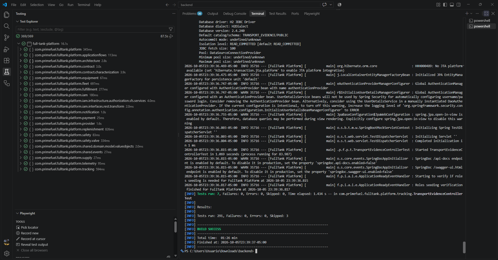
  <p><em>Figura 6.2: Resultado de <code>./mvnw test</code> en los web services.</em></p>
</div>

<div align="center">
  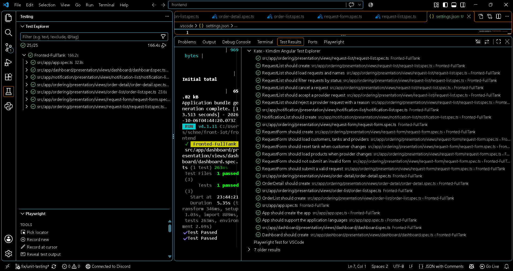
  <p><em>Figura 6.3: Resultado de <code>npm test</code> en la aplicación web.</em></p>
</div>

Los commits relacionados con las pruebas son:

| Repository | Branch | Commit Id | Commit Message | Committed on |
|---|---|---|---|---|
| backend | main | 152eba8 | test: freeze architecture rule baselines | 22/09/2026 |
| backend | main | fe962ba | test: cover assignment rollback and concurrent delivery creation | 22/09/2026 |
| backend | main | 7cf6774 | test: cover cross-tenant reads of buyer and provider companies | 25/09/2026 |
| backend | main | b0782de | feat(replenishment): implement GetReplenishmentRequestsByProviderQuery and integration tests | 30/09/2026 |
| backend | main | 93760d2 | test(replenishment): use a relative date in acceptance test | 30/09/2026 |
| frontend | main | 72aff50 | feat(tanker-form): enhance form structure and validation, add unit tests | 30/09/2026 |
| frontend | main | ffff19f | chore(deps): declare test runtimes and synchronize lockfile | 02/10/2026 |
| frontend | main | 3335333 | chore(test): update application and notification baseline tests | 02/10/2026 |

#### 6.2.1.6. Execution Evidence for Sprint Review

En este sprint se alcanzó el flujo completo del distribuidor en la aplicación web desplegada:

1. **Landing page:** presenta la propuesta para el distribuidor, los sensores IoT, los planes y el contacto, en español e inglés.
2. **Acceso:** registro del distribuidor y del comprador, inicio de sesión y recuperación de contraseña.
3. **Clientes y tanques:** el distribuidor vincula a un comprador por su RUC y le asocia un tanque con producto, umbral y dispositivo.
4. **Solicitudes:** la bandeja muestra las solicitudes automáticas y manuales; el distribuidor acepta o rechaza con un motivo.
5. **Asignación:** en el detalle de la orden, el distribuidor usa la recomendación o elige conductor y cisterna, y crea la entrega.
6. **Entregas:** registra el inicio, la llegada y el cierre con el volumen entregado, y consulta la línea de tiempo.
7. **Pagos:** el comprador registra el pago y el distribuidor lo confirma o lo reembolsa.
8. **Tablero y Analytics:** indicadores del mes, tanques críticos, entregas del día y tendencia de ventas.

<div align="center">
  
  <p><em>Figura 6.4: Landing page.</em></p>
</div>

<div align="center">
  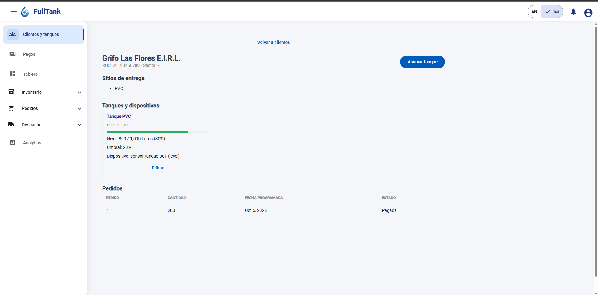
  <p><em>Figura 6.5: Clientes y tanques, con el detalle de un tanque y sus lecturas.</em></p>
</div>

<div align="center">
  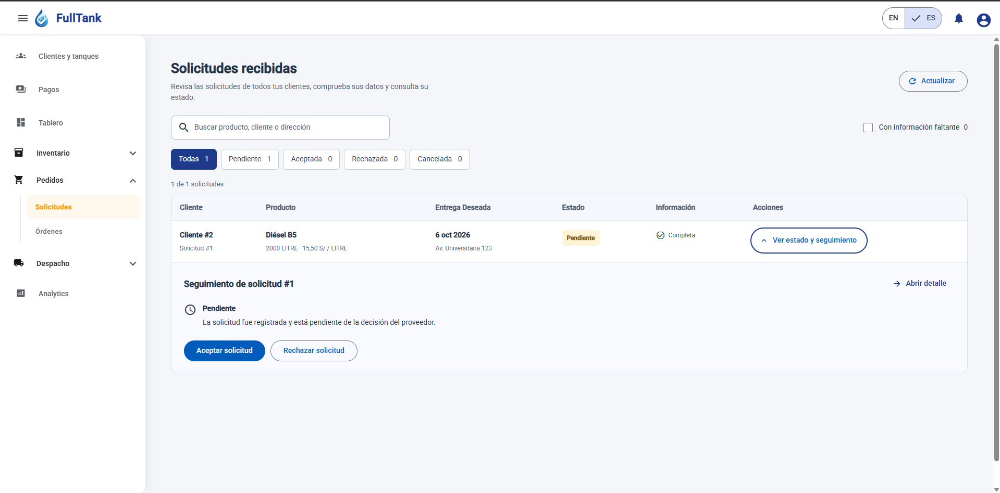
  <p><em>Figura 6.6: Bandeja de solicitudes y detalle con Aceptar y Rechazar.</em></p>
</div>

<div align="center">
  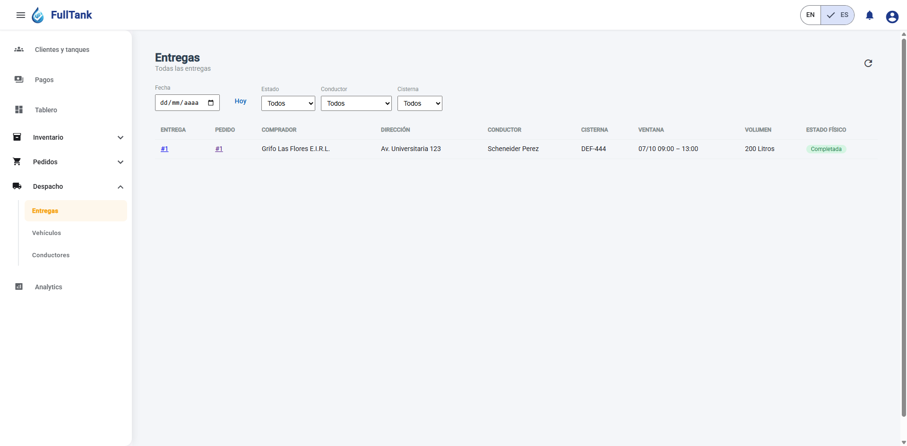
  <p><em>Figura 6.7: Recomendación y asignación de conductor y cisterna.</em></p>
</div>

<div align="center">
  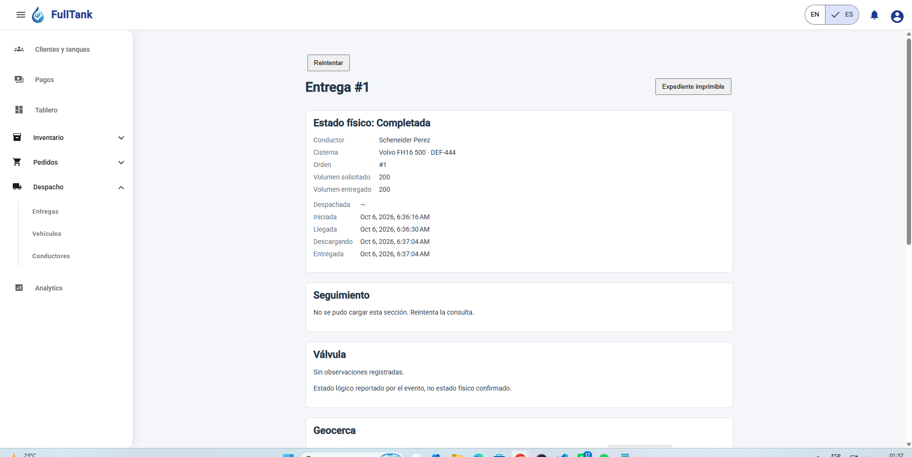
  <p><em>Figura 6.8: Entregas y detalle con línea de tiempo.</em></p>
</div>

<div align="center">
  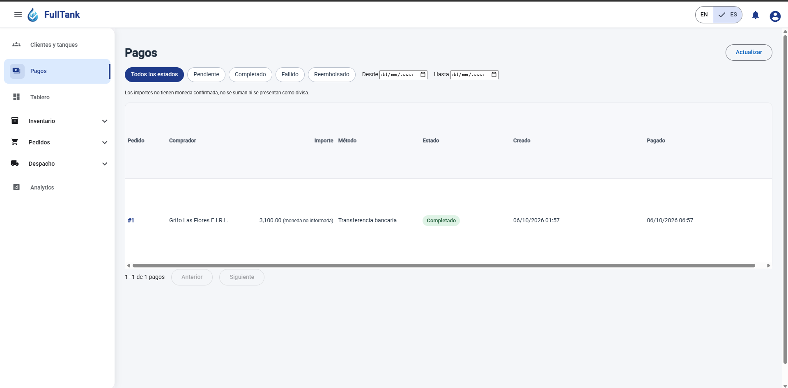
  <p><em>Figura 6.9: Pagos del distribuidor y tablero.</em></p>
</div>

- **Video de la ejecución:** **[pendiente: enlace del video]**

#### 6.2.1.7. Services Documentation Evidence for Sprint Review

Los web services se documentan con OpenAPI 3.1 mediante springdoc. Los controladores declaran, en español, el resumen de cada operación, su descripción y, en casi todas, el significado de cada código de respuesta. La documentación se publica en:

- **Swagger UI:** https://fulltank-backend.onrender.com/swagger-ui.html
- **Documento OpenAPI:** https://fulltank-backend.onrender.com/api-docs

Todas las rutas están bajo `/api` y requieren un JWT en la cabecera `Authorization: Bearer <token>`, salvo el registro de usuarios, el alta de compañías, el inicio de sesión, el restablecimiento de contraseña y la ingesta de lecturas, que usa la cabecera `X-Device-Token`. En Swagger UI, el token se ingresa con el botón *Authorize*.

La API expone 118 operaciones; las 109 que están dentro del alcance son:

| Bounded context | Operaciones |
|---|:---:|
| IAM | 20 |
| Equipment | 19 |
| Fleet | 16 |
| Replenishment | 10 |
| Fulfillment | 10 |
| Inventory | 8 |
| Payment | 8 |
| Ordering | 7 |
| Notification | 3 |
| Analytics | 3 |
| Application Flows | 3 |
| Telemetry | 2 |

| Bounded context | Método | Ruta | Operación |
|---|---|---|---|
| IAM | POST | `/api/admin/users/{userId}/promote` | Otorgar rol de administrador de plataforma |
| IAM | POST | `/api/authentication/sign-up` | Registrar una cuenta |
| IAM | POST | `/api/authentication/sign-in` | Iniciar sesión |
| IAM | POST | `/api/authentication/password-reset/request` | Solicitar restablecimiento de contraseña |
| IAM | POST | `/api/authentication/password-reset/confirm` | Confirmar restablecimiento de contraseña |
| IAM | POST | `/api/buyer-companies` | Registrar empresa compradora |
| IAM | GET | `/api/buyer-companies` | Listar empresas compradoras |
| IAM | GET | `/api/buyer-companies/{companyId}` | Consultar empresa compradora por identificador |
| IAM | PUT | `/api/buyer-companies/{companyId}` | Actualizar empresa compradora |
| IAM | POST | `/api/organizations/{organizationId}/invitations` | Invitar miembro a una organización |
| IAM | POST | `/api/invitations/{token}/accept` | Aceptar invitación |
| IAM | DELETE | `/api/invitations/{invitationId}` | Revocar invitación |
| IAM | GET | `/api/me/organizations` | Listar mis organizaciones |
| IAM | POST | `/api/onboarding` | Registrar organización |
| IAM | POST | `/api/provider-companies` | Registrar distribuidor |
| IAM | GET | `/api/provider-companies` | Listar distribuidores |
| IAM | GET | `/api/provider-companies/{providerId}` | Consultar distribuidor por identificador |
| IAM | PUT | `/api/provider-companies/{providerId}` | Actualizar distribuidor |
| IAM | GET | `/api/users` | Listar usuarios |
| IAM | GET | `/api/users/{userId}` | Consultar usuario por identificador |
| Equipment | POST | `/api/customers` | Registrar una cuenta de cliente |
| Equipment | GET | `/api/customers` | Listar cuentas de cliente |
| Equipment | POST | `/api/customers/{customerId}/sites` | Registrar un sitio de entrega |
| Equipment | GET | `/api/customers/{customerId}/sites` | Listar sitios de una cuenta |
| Equipment | POST | `/api/equipment` | Crear equipo |
| Equipment | POST | `/api/equipment/{equipmentId}/update` | Actualizar equipo |
| Equipment | GET | `/api/equipment` | Listar todos los equipos |
| Equipment | GET | `/api/equipment/{equipmentId}` | Consultar equipo por identificador |
| Equipment | GET | `/api/equipment/company/{companyId}` | Listar equipos por empresa |
| Equipment | GET | `/api/provider/buyer-companies` | Listar compradores vinculados |
| Equipment | GET | `/api/provider/buyer-companies/lookup` | Buscar un comprador registrado por su RUC exacto |
| Equipment | POST | `/api/provider/buyer-companies` | Registrar o vincular comprador antes del primer pedido |
| Equipment | POST | `/api/provider/tanks` | Asociar tanque, producto y dispositivo |
| Equipment | PUT | `/api/provider/tanks/{tankId}` | Editar el producto, el umbral, el dispositivo o la generación automática de un tanque |
| Equipment | GET | `/api/provider/tanks/{tankId}` | Consultar el tanque de un comprador vinculado |
| Equipment | GET | `/api/provider/tanks` | Listar tanques de compradores vinculados |
| Equipment | POST | `/api/tanks` | Registrar tanque |
| Equipment | GET | `/api/tanks` | Listar tanques |
| Equipment | GET | `/api/tanks/{tankId}` | Consultar tanque por identificador |
| Telemetry | GET | `/api/provider/tanks/{tankId}/readings` | Consultar lecturas IoT de un tanque vinculado |
| Telemetry | POST | `/api/telemetry/readings` | Recibir medición de dispositivo |
| Replenishment | GET | `/api/provider/tanks/{tankId}/refill-episodes` | Consultar episodios de reposición como distribuidor |
| Replenishment | PUT | `/api/tanks/{tankId}/refill-policy` | Configurar política de reposición |
| Replenishment | GET | `/api/tanks/{tankId}/refill-policy` | Consultar política de reposición |
| Replenishment | GET | `/api/tanks/{tankId}/refill-episodes` | Listar episodios de reposición |
| Replenishment | POST | `/api/replenishment-requests` | Crear solicitud de abastecimiento |
| Replenishment | GET | `/api/replenishment-requests` | Listar solicitudes de abastecimiento |
| Replenishment | GET | `/api/replenishment-requests/inbox` | Bandeja de solicitudes del distribuidor |
| Replenishment | GET | `/api/replenishment-requests/{requestId}` | Consultar solicitud por identificador |
| Replenishment | POST | `/api/replenishment-requests/{requestId}/reject` | Rechazar solicitud de abastecimiento |
| Replenishment | POST | `/api/replenishment-requests/{requestId}/cancel` | Cancelar solicitud de abastecimiento |
| Inventory | POST | `/api/fuel-products/provider/{providerId}/empty-catalog-alert` | Avisar al distribuidor que debe publicar productos |
| Inventory | POST | `/api/fuel-products` | Crear producto de combustible |
| Inventory | POST | `/api/fuel-products/{fuelProductId}/update-stock` | Actualizar existencias del producto |
| Inventory | GET | `/api/fuel-products` | Listar productos de combustible |
| Inventory | GET | `/api/fuel-products/{fuelProductId}` | Consultar producto por identificador |
| Inventory | GET | `/api/fuel-products/provider/{providerId}` | Listar productos por distribuidor |
| Inventory | PUT | `/api/fuel-products/{fuelProductId}` | Actualizar producto de combustible |
| Inventory | DELETE | `/api/fuel-products/{fuelProductId}` | Eliminar producto de combustible |
| Ordering | POST | `/api/fuel-orders` | Crear orden de combustible |
| Ordering | POST | `/api/fuel-orders/{orderId}/confirm` | Confirmar orden de combustible |
| Ordering | POST | `/api/fuel-orders/{orderId}/cancel` | Cancelar orden de combustible |
| Ordering | GET | `/api/fuel-orders` | Listar todas las órdenes de combustible |
| Ordering | GET | `/api/fuel-orders/{orderId}` | Consultar orden por identificador |
| Ordering | GET | `/api/fuel-orders/company/{companyId}` | Listar órdenes por empresa compradora |
| Ordering | GET | `/api/fuel-orders/provider/{providerId}` | Listar órdenes por distribuidor |
| Fleet | POST | `/api/drivers` | Registrar conductor |
| Fleet | GET | `/api/drivers` | Listar conductores |
| Fleet | GET | `/api/drivers/{driverId}` | Consultar conductor por identificador |
| Fleet | PUT | `/api/drivers/{driverId}` | Actualizar conductor |
| Fleet | POST | `/api/drivers/{driverId}/deactivate` | Desactivar conductor |
| Fleet | POST | `/api/drivers/{driverId}/activate` | Reactivar conductor |
| Fleet | GET | `/api/drivers/eligible` | Listar conductores elegibles |
| Fleet | GET | `/api/drivers/{driverId}/eligibility` | Evaluar elegibilidad del conductor |
| Fleet | POST | `/api/tankers` | Registrar cisterna |
| Fleet | GET | `/api/tankers` | Listar cisternas |
| Fleet | GET | `/api/tankers/{tankerId}` | Consultar cisterna por identificador |
| Fleet | PUT | `/api/tankers/{tankerId}` | Actualizar cisterna |
| Fleet | POST | `/api/tankers/{tankerId}/deactivate` | Desactivar cisterna |
| Fleet | POST | `/api/tankers/{tankerId}/activate` | Reactivar cisterna |
| Fleet | GET | `/api/tankers/eligible` | Listar cisternas elegibles |
| Fleet | GET | `/api/tankers/{tankerId}/eligibility` | Evaluar elegibilidad de cisterna |
| Fulfillment | POST | `/api/deliveries/{deliveryId}/assign` | Asignar entrega |
| Fulfillment | POST | `/api/deliveries/{deliveryId}/start` | Iniciar entrega |
| Fulfillment | POST | `/api/deliveries/{deliveryId}/arrive` | Registrar llegada de entrega |
| Fulfillment | POST | `/api/deliveries/{deliveryId}/complete` | Completar entrega |
| Fulfillment | POST | `/api/deliveries/{deliveryId}/fail` | Marcar entrega fallida |
| Fulfillment | POST | `/api/deliveries/{deliveryId}/cancel` | Cancelar entrega |
| Fulfillment | GET | `/api/deliveries/{deliveryId}` | Consultar entrega |
| Fulfillment | GET | `/api/deliveries/{deliveryId}/transitions` | Listar transiciones de una entrega |
| Fulfillment | GET | `/api/deliveries/{deliveryId}/timeline` | Consultar cronología de entrega |
| Fulfillment | GET | `/api/deliveries` | Listar entregas del distribuidor |
| Payment | POST | `/api/payments` | Registrar pago |
| Payment | POST | `/api/payments/{paymentId}/complete` | Completar pago |
| Payment | POST | `/api/payments/{paymentId}/refund` | Reembolsar pago |
| Payment | GET | `/api/payments` | Listar todos los pagos |
| Payment | GET | `/api/payments/{paymentId}` | Consultar pago por identificador |
| Payment | GET | `/api/payments/order/{orderId}` | Consultar pago de una orden |
| Payment | GET | `/api/payments/company/{companyId}` | Listar pagos por empresa |
| Payment | GET | `/api/payments/provider/{providerId}` | Listar los pagos de las órdenes del distribuidor |
| Notification | GET | `/api/me/notifications` | Listar mis notificaciones |
| Notification | GET | `/api/me/notifications/unread` | Listar mis notificaciones no leídas |
| Notification | POST | `/api/me/notifications/{notificationId}/read` | Marcar una notificación propia como leída |
| Analytics | GET | `/api/analytics/platform` | Consultar resumen de plataforma |
| Analytics | GET | `/api/analytics/providers/{providerId}` | Consultar indicadores del distribuidor |
| Analytics | GET | `/api/analytics/buyers/{companyId}` | Consultar indicadores de empresa compradora |
| Application Flows | POST | `/api/deliveries` | Asignar entrega para una orden aceptada |
| Application Flows | GET | `/api/deliveries/recommendation` | Recomendar conductor y cisterna |
| Application Flows | POST | `/api/replenishment-requests/{requestId}/accept` | Aceptar solicitud de abastecimiento |

Ejemplo de una operación. La asignación de una entrega se pide con `POST /api/deliveries`:

```json
{
  "commandId": "b1f0c9a2-6f6e-4a1e-9d0b-2f8f6c1a7e55",
  "orderId": 91,
  "driverId": 8,
  "tankerId": 12,
  "windowStart": "2026-10-02T14:00:00Z",
  "windowEnd": "2026-10-02T18:00:00Z",
  "scheduledDate": "2026-10-02"
}
```

La respuesta 201 devuelve la entrega creada con sus reservas (`deliveryId`, `supplyReservationId`, `fleetReservationId` y `physicalState` igual a `ASSIGNED`). Repetir la petición con el mismo `commandId` devuelve la misma entrega.

<div align="center">
  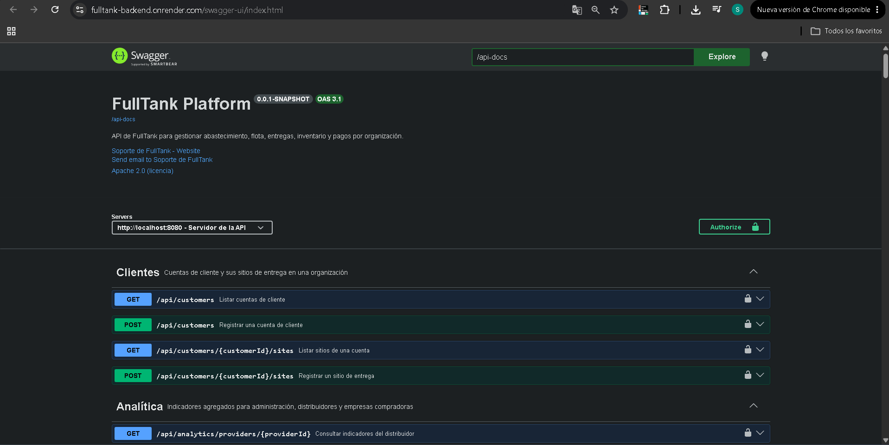
  <p><em>Figura 6.10: Swagger UI de los web services desplegados.</em></p>
</div>

<div align="center">
  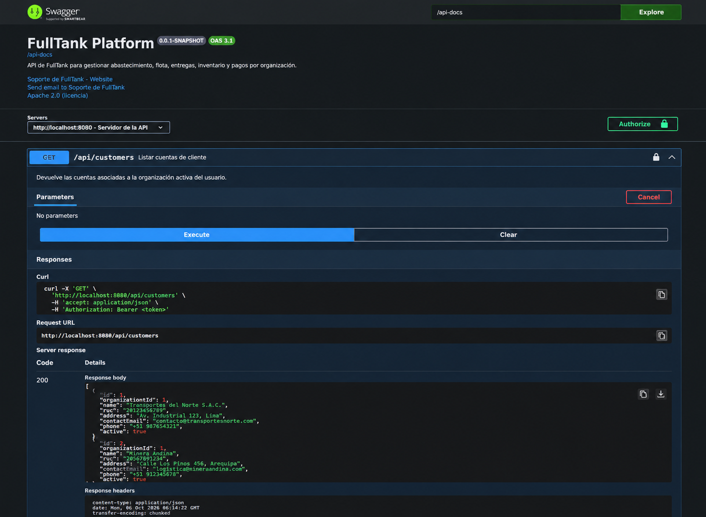
  <p><em>Figura 6.11: Prueba de un endpoint desde Swagger UI.</em></p>
</div>

Los commits relacionados con la documentación de los servicios son:

| Repository | Branch | Commit Id | Commit Message | Committed on |
|---|---|---|---|---|
| backend | main | 654c309 | docs: annotate active controllers with OpenAPI responses | 22/09/2026 |
| backend | main | ca76165 | Documenta endpoints REST en español | 27/09/2026 |
| backend | main | 2a0fcbb | feat(docs): enhance API methods doc by ROLE | 28/09/2026 |
| backend | main | df34cd6 | feat(replenishment): update documentation for replenishment request endpoints | 30/09/2026 |

#### 6.2.1.8. Software Deployment Evidence for Sprint Review

En este sprint se desplegaron los web services y la aplicación web, con la configuración descrita en 6.1.4:

1. **Base de datos (Aiven).** Se creó el servicio MySQL y se tomaron su servidor, puerto, usuario y contraseña para las variables de entorno del backend.
2. **Web services (Render).** Se creó el *Web Service* desde el repositorio `backend` con entorno Docker y se configuraron las variables de entorno. Al iniciar, Flyway aplica las migraciones del esquema.
3. **Aplicación web (Vercel).** Se importó el repositorio `frontend` y se publicó el resultado de `ng build`. Luego se configuró su dirección como origen permitido de CORS en el backend.
4. **Verificación.** La aplicación web responde en su dirección pública. Las capturas del inicio de sesión contra la API desplegada y de Swagger UI se adjuntan como evidencia.

| Producto | URL |
|---|---|
| Web Application | https://primefuel-frontend-three.vercel.app |
| Web Services | https://fulltank-backend.onrender.com/api |
| Swagger UI | https://fulltank-backend.onrender.com/swagger-ui.html |
| Landing Page | **[pendiente: URL pública de la landing page]** |

<div align="center">
  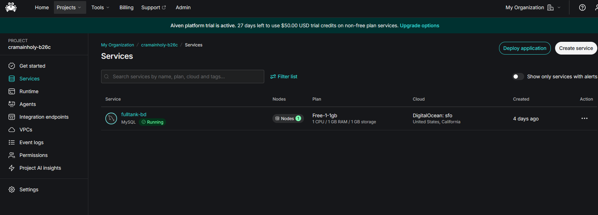
  <p><em>Figura 6.12: Servicio MySQL en Aiven.</em></p>
</div>

<div align="center">
  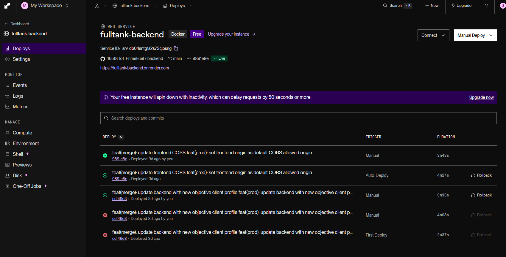
  <p><em>Figura 6.13: Web Service de los web services en Render, con sus variables de entorno.</em></p>
</div>

<div align="center">
  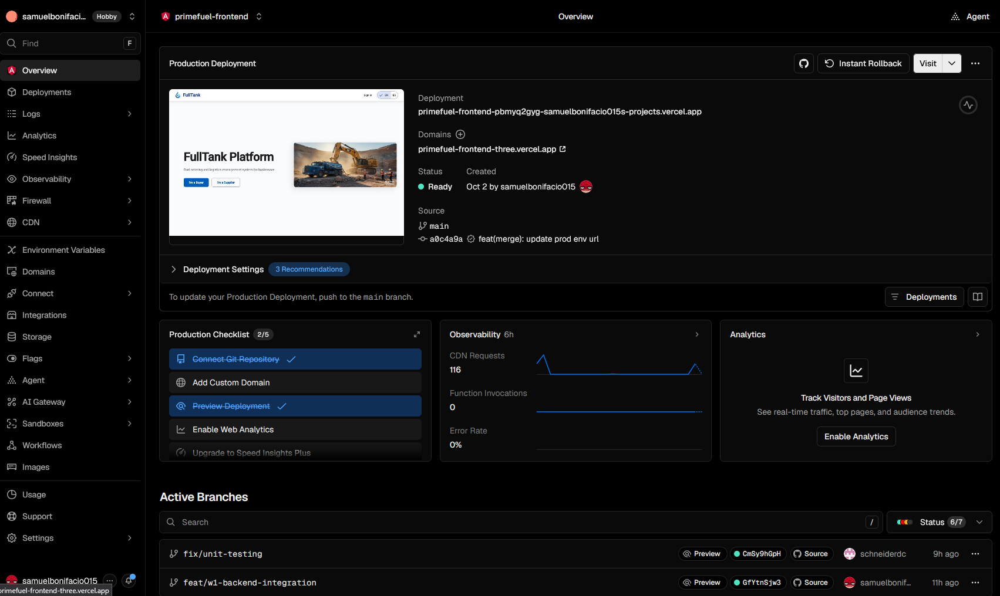
  <p><em>Figura 6.14: Proyecto de la aplicación web en Vercel.</em></p>
</div>

Los commits relacionados con el despliegue son:

| Repository | Branch | Commit Id | Commit Message | Committed on |
|---|---|---|---|---|
| backend | main | 9887983 | feat(prod): add aiven mysql credentials config | 02/10/2026 |
| backend | main | 1f32b87 | feat(prod): set frontend origin as default CORS allowed origin | 02/10/2026 |
| frontend | main | 31b2879 | feat(prod): update prod env url | 02/10/2026 |

#### 6.2.1.9. Team Collaboration Insights during Sprint

La tabla resume los commits de cada integrante entre el 12/09/2026 y el 02/10/2026, según el historial de GitHub. En `backend` y `frontend` se cuenta la rama `main`; en `landing-page` y `Report`, todas las ramas.

| Team Member | landing-page | backend | frontend | Report |
|---|:---:|:---:|:---:|:---:|
| Bonifacio Jaramillo, Samuel Jesus | — | 140 | 92 | 9 |
| Rodriguez Parco, Joseph Pablo | — | 42 | — | 5 |
| Castro Pariona, Jefferson Ernesto | 1 | — | — | 5 |
| Ponce Perales, Alberto Alejandro | — | — | — | 6 |
| Delgado Carrasco, Schneider Carlos Alberto | — | — | — | 6 |
| Lopez Goitia, Carlos Alberto | — | — | — | 6 |
| Mejia Aliaga, Katherine Maryory | — | — | — | 8 |

Los tres commits iniciales de la landing page son del 10/09/2026, anteriores a este período.

<div align="center">
  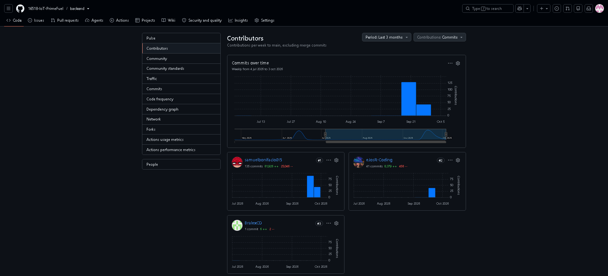
  <p><em>Figura 6.15: Insights del repositorio de los web services.</em></p>
</div>

<div align="center">
  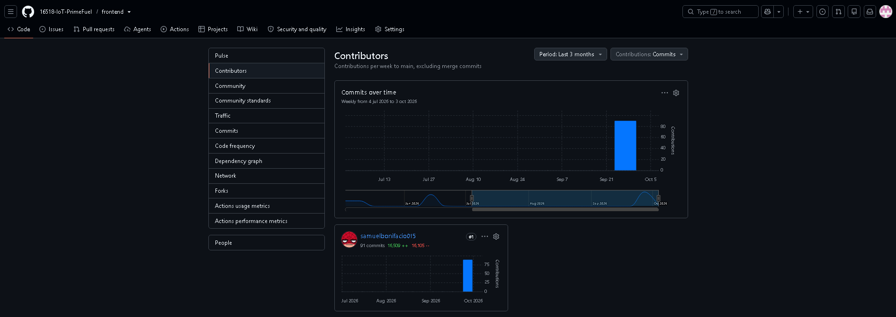
  <p><em>Figura 6.16: Insights del repositorio de la aplicación web.</em></p>
</div>

<div align="center">
  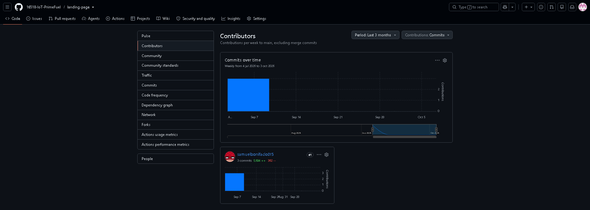
  <p><em>Figura 6.17: Insights del repositorio de la landing page.</em></p>
</div>
